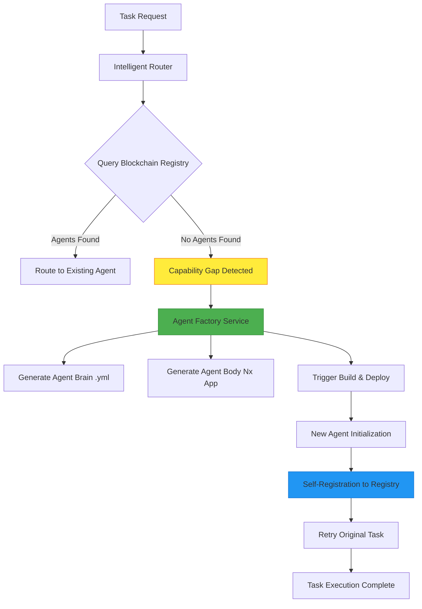
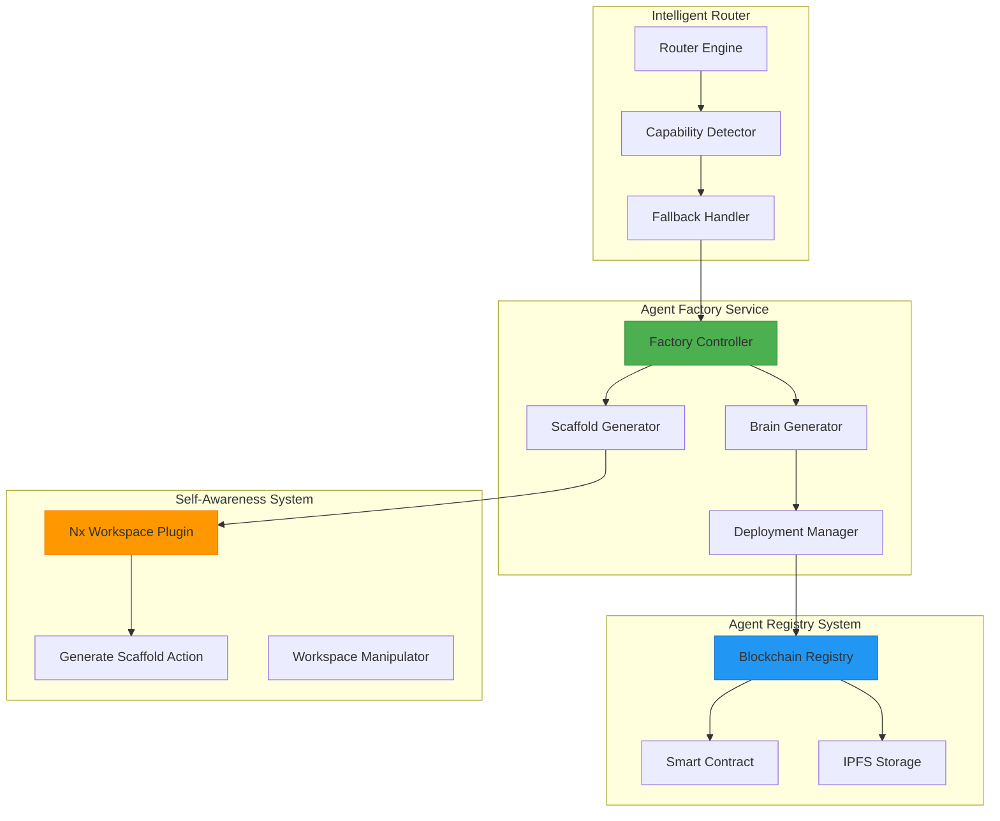
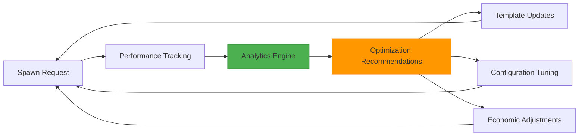

# Autonomous Agent Spawning System Design

## Overview

The Autonomous Agent Spawning System enhances the 371 OS with self-expanding capabilities by enabling the Intelligent Router to automatically create new agents when required capabilities are missing from the Blockchain Registry. This system transforms the 371 OS from a static agent ecosystem into a dynamic, self-evolving organism that can adapt to new requirements without human intervention.

### Core Value Proposition

- **Autonomous Capability Expansion**: Automatically fills capability gaps without manual intervention
- **Zero-Downtime Scaling**: Creates new agents while maintaining system operations
- **Self-Registration Integration**: New agents automatically join the ecosystem and register their capabilities
- **Intelligent Fallback Strategy**: Provides structured escalation when agent discovery fails

### System Boundaries

The autonomous spawning system operates within the existing 371 OS architecture, integrating with:
- Intelligent Router for capability gap detection
- Blockchain Registry for agent discovery and registration
- Nx Workspace Plugin for agent scaffold generation
- Agent Factory service for coordinated agent creation
- ElizaOS runtime for agent deployment and execution

## Architecture

### High-Level System Flow



### Component Architecture



## Core Components

### Intelligent Router Enhancement

#### Capability Gap Detection

The Intelligent Router's fallback logic is enhanced to detect capability gaps and initiate the spawning process:

**Detection Strategy:**
- Query Blockchain Registry for agents with required capability
- Analyze confidence scores and availability metrics
- Identify capability gaps based on zero matches or insufficient confidence
- Log capability gaps for trend analysis and proactive spawning

**Escalation Decision Matrix:**

| Scenario | Confidence Score | Available Agents | Action |
|----------|------------------|------------------|---------|
| Perfect Match | >0.8 | >=1 | Route Immediately |
| Good Match | 0.6-0.8 | >=1 | Route with Monitoring |
| Weak Match | 0.3-0.6 | >=1 | Spawn + Route to Existing |
| No Match | <0.3 or N/A | 0 | Trigger Agent Factory |

#### Enhanced Fallback Logic

``mermaid
sequenceDiagram
    participant Task as Incoming Task
    participant Router as Intelligent Router
    participant Registry as Blockchain Registry
    participant Factory as Agent Factory
    participant NewAgent as Spawned Agent
    
    Task->>Router: Task with Capability Requirement
    Router->>Registry: findAgentsByCapability(capability)
    Registry-->>Router: Empty Result Set
    Router->>Factory: spawnAgent(capability, taskDescription)
    Factory->>Factory: Generate Agent Brain & Body
    Factory-->>Router: Agent Creation Initiated
    Router->>Router: Queue Original Task for Retry
    Factory->>NewAgent: Deploy & Initialize
    NewAgent->>Registry: Self-Register Capabilities
    Router->>Registry: Retry Capability Query
    Registry-->>Router: Return New Agent
    Router->>NewAgent: Route Original Task
```

### Agent Factory Service

#### Factory Controller

The Factory Controller orchestrates the entire agent creation process with these responsibilities:

**Process Orchestration:**
- Receive spawn requests from Intelligent Router
- Validate capability requirements and task descriptions
- Coordinate brain generation and body scaffolding
- Manage deployment pipeline integration
- Monitor agent creation success rates

**Capability Analysis:**
- Parse capability descriptions into structured metadata
- Generate role definitions based on capability requirements
- Determine appropriate agent templates and configurations
- Establish initial performance targets and success criteria

#### Brain Generator

The Brain Generator creates agent definition YAML files in the `libs/prompts/agent-definitions/` directory:

**Generation Strategy:**

| Input Parameter | YAML Section | Generation Logic |
|----------------|--------------|------------------|
| Capability Name | agent_name | Convert to human-readable format |
| Task Description | core_instructions | Extract domain and responsibilities |
| Required Skills | personality_traits | Map to appropriate behavioral patterns |
| Domain Context | delegation_rules | Generate routing and escalation rules |

**Template Structure:**
``yaml
agent_name: "{Capability} Specialist Agent"
agent_type: "SPECIALIZED_CAPABILITY"

core_instructions: |
  You are a specialized agent for {capability_domain}.
  Primary function: {derived_from_task_description}
  
  Core Responsibilities:
  1. {responsibility_1}
  2. {responsibility_2}
  3. {responsibility_3}

personality_traits:
  - {trait_1}: {description}
  - {trait_2}: {description}

required_tools:
  - {tool_category}:{permission_level}

performance_targets:
  response_time_ms: 1000
  task_success_rate: 0.9
  escalation_rate: 0.1
```

#### Scaffold Generator

The Scaffold Generator leverages the `@elizaos/plugin-nx-workspace` to create agent body applications:

**Integration Pattern:**
- Instantiate ElizaOS agent with nx-workspace plugin
- Execute `GENERATE_SCAFFOLD` action with standardized parameters
- Apply agent-specific configurations and dependencies
- Generate initial test suites and documentation templates

**Scaffold Parameters:**

| Parameter | Value | Purpose |
|-----------|--------|---------|
| type | 'app' | Create Nx application |
| name | '{capability-slug}-agent' | Consistent naming |
| template | 'elizaos-agent' | Agent-specific template |
| directory | 'apps/' | Standard location |

### Self-Registration System

#### Agent Initialization Enhancement

New agents receive enhanced initialization logic to automatically register with the Blockchain Registry:

**Registration Process:**
1. Load agent brain configuration from YAML file
2. Parse capabilities and generate capability metadata
3. Initialize Blockchain Registry Provider
4. Generate cryptographic identity and credentials
5. Register agent with capabilities in smart contract
6. Store extended metadata in IPFS
7. Emit registration success events

**Registration Data Model:**

``mermaid
classDiagram
    class SpawnedAgentEntry {
        +string agentId
        +string did
        +AgentCapability[] capabilities
        +string originalTaskId
        +timestamp createdAt
        +SpawnMetadata spawnMetadata
    }
    
    class SpawnMetadata {
        +string requestingAgent
        +string capabilityGap
        +string taskDescription
        +number confidenceScore
        +string[] relatedDomains
    }
    
    class AgentCapability {
        +string toolId
        +string name
        +string description
        +object inputSchema
        +object outputSchema
        +CapabilityMetadata metadata
    }
    
    SpawnedAgentEntry --> SpawnMetadata
    SpawnedAgentEntry --> AgentCapability
```

## Data Models & Business Logic

### Capability Gap Analysis

#### Gap Detection Algorithm

The system uses multi-dimensional analysis to identify capability gaps:

**Capability Matching Matrix:**

| Dimension | Weight | Evaluation Criteria |
|-----------|--------|-------------------|
| Semantic Similarity | 0.4 | NLP analysis of capability descriptions |
| Domain Alignment | 0.3 | Categorical matching of business domains |
| Tool Compatibility | 0.2 | Required tool overlap analysis |
| Performance History | 0.1 | Success rates for similar tasks |

**Gap Classification:**

- **Critical Gap**: Zero agents with >0.3 confidence for capability
- **Performance Gap**: Agents exist but success rate <0.7
- **Availability Gap**: Agents exist but all currently unavailable
- **Specialization Gap**: Generic agents exist but specialized version needed

### Agent Template System

#### Template Selection Logic

The Factory determines appropriate templates based on capability analysis:

**Template Categories:**

| Template Type | Use Cases | Generated Components |
|---------------|-----------|---------------------|
| Business Analyst | Data analysis, reporting, metrics | Dashboard, SQL queries, report generators |
| Technical Specialist | Code review, architecture, debugging | Code analysis, test runners, deployment scripts |
| Communication Agent | Customer service, documentation, translation | Message handlers, content generators, workflow triggers |
| Integration Agent | API management, data sync, monitoring | Connectors, validators, error handlers |

#### Configuration Inheritance

New agents inherit base configurations with capability-specific overrides:

**Inheritance Hierarchy:**
```
Base Agent Template
├── Domain-Specific Template (Business/Technical/Communication)
├── Capability-Specific Overrides
└── Task-Context Customizations
```

### Economic Coordination

#### Spawning Cost Model

The system implements economic controls to prevent unnecessary agent proliferation:

**Cost Structure:**

| Factor | Cost Impact | Justification |
|--------|-------------|---------------|
| Deployment Resources | Variable | Akash Network deployment costs |
| Registry Transaction | Fixed | Blockchain gas fees |
| Storage Overhead | Variable | IPFS metadata storage |
| Monitoring Resources | Fixed | Performance tracking infrastructure |

**Economic Safeguards:**
- Maximum spawn rate limits (5 agents per hour)
- Capability overlap analysis to prevent redundancy
- Automatic agent retirement after sustained inactivity
- Performance-based reputation staking for new agents

## Integration Patterns

### Router-Factory Integration

#### Communication Protocol

The Intelligent Router communicates with the Agent Factory through a standardized API:

**Spawn Request Schema:**
```yaml
SpawnRequest:
  capability: string                    # Required capability identifier
  taskDescription: string              # Context for agent generation
  priority: enum[LOW, MEDIUM, HIGH]    # Urgency indicator
  requesterAgent: string               # Originating agent ID
  originalTaskId: string               # Task requiring capability
  domainHints: string[]                # Additional context clues
  performanceRequirements:
    maxResponseTime: number            # Milliseconds
    minSuccessRate: number            # 0.0-1.0
    maxEscalationRate: number         # 0.0-1.0
```

**Response Schema:**
```yaml
SpawnResponse:
  success: boolean
  agentId: string                      # Generated agent identifier
  estimatedReadyTime: timestamp        # When agent will be available
  deploymentId: string                 # Akash deployment reference
  registryTxHash: string              # Blockchain transaction
  message: string                      # Status or error description
```

### Registry Integration Enhancement

#### Enhanced Query Capabilities

The Blockchain Registry is enhanced to support spawning-related queries:

**New Query Methods:**

| Method | Purpose | Parameters |
|--------|---------|------------|
| `findCapabilityGaps()` | Identify missing capabilities | domain, confidence_threshold |
| `getSpawnHistory()` | Retrieve spawning analytics | time_range, capability_filter |
| `checkSpawnEligibility()` | Validate spawn conditions | capability, economic_limits |
| `queryPendingSpawns()` | Monitor active spawning | status_filter, requester_agent |

#### Capability Gap Analytics

The registry maintains analytics to optimize future spawning decisions:

**Analytics Dimensions:**
- Capability gap frequency and patterns
- Spawn success rates by capability type
- Agent utilization post-spawning
- Economic efficiency metrics
- Cross-domain capability clustering

### Monitoring & Performance Tracking

#### Spawning Metrics Dashboard

The system provides comprehensive monitoring of the spawning process:

**Key Performance Indicators:**

| Metric | Target | Measurement |
|--------|--------|------------|
| Spawn Success Rate | >95% | Successful deployments / Total spawn attempts |
| Time to Availability | <5 minutes | Agent ready time - Spawn request time |
| Registry Integration Rate | >98% | Successful registrations / Successful spawns |
| Task Retry Success | >90% | Successful retries / Total retry attempts |
| Economic Efficiency | <$0.10/spawn | Total spawn cost / Number of spawns |

#### Performance Optimization Feedback Loop

The system continuously optimizes spawning based on performance data:



## Security Considerations

### Agent Identity Verification

#### Cryptographic Identity Generation

Spawned agents receive cryptographically verified identities:

**Identity Components:**
- **DID (Decentralized Identifier)**: Unique blockchain-based identity
- **Verifiable Credentials**: Capability attestations from Factory
- **Cryptographic Key Pair**: For message signing and verification
- **Reputation Stake**: Economic bond ensuring good behavior

#### Spawn Authorization Framework

The system implements multi-layered authorization:

**Authorization Levels:**

| Level | Requirements | Capabilities Granted |
|-------|-------------|---------------------|
| Basic | Router request + economic stake | Standard business capabilities |
| Elevated | Multi-agent consensus | Cross-domain coordination |
| Critical | Human approval | System administration |
| Emergency | CEO agent authorization | Security incident response |

### Sandbox Environment

#### Isolation Strategy

New agents operate in controlled environments during initial deployment:

**Sandbox Constraints:**
- Limited resource allocation (CPU, memory, network)
- Restricted access to sensitive system components
- Monitored communications with established agents
- Automatic termination on suspicious behavior
- Graduated trust model based on performance history

## Testing Strategy

### Spawn Process Validation

#### End-to-End Testing Framework

The system includes comprehensive testing for the entire spawning workflow:

**Test Categories:**

| Test Type | Scope | Success Criteria |
|-----------|-------|------------------|
| Unit Tests | Individual components | Code coverage >90% |
| Integration Tests | Component interactions | All integration points validated |
| System Tests | Complete spawn workflow | End-to-end process completion |
| Performance Tests | Load and stress scenarios | Meets performance targets |
| Security Tests | Authorization and isolation | No security vulnerabilities |

#### Test Scenarios

**Critical Test Cases:**
1. **Basic Spawning**: Single capability gap triggers successful agent creation
2. **Concurrent Spawning**: Multiple simultaneous spawn requests handled correctly
3. **Registry Integration**: New agents successfully register and become discoverable
4. **Task Retry**: Original tasks execute successfully on spawned agents
5. **Economic Limits**: Spawning respects cost constraints and rate limits
6. **Failure Recovery**: System handles spawn failures gracefully
7. **Agent Lifecycle**: Spawned agents integrate fully with existing ecosystem

#### Performance Benchmarking

**Benchmark Targets:**

| Scenario | Target Performance | Measurement Method |
|----------|-------------------|-------------------|
| Simple Capability Spawn | <3 minutes total | End-to-end timing |
| Complex Multi-Domain Spawn | <5 minutes total | Component timing |
| Registry Query Performance | <100ms response | Database metrics |
| Concurrent Spawn Handling | 10 simultaneous spawns | Load testing |
| Resource Utilization | <80% CPU/Memory | System monitoring |

---

This autonomous agent spawning system transforms the 371 OS into a truly self-evolving ecosystem that can adapt to new requirements without human intervention, while maintaining security, performance, and economic efficiency standards.
