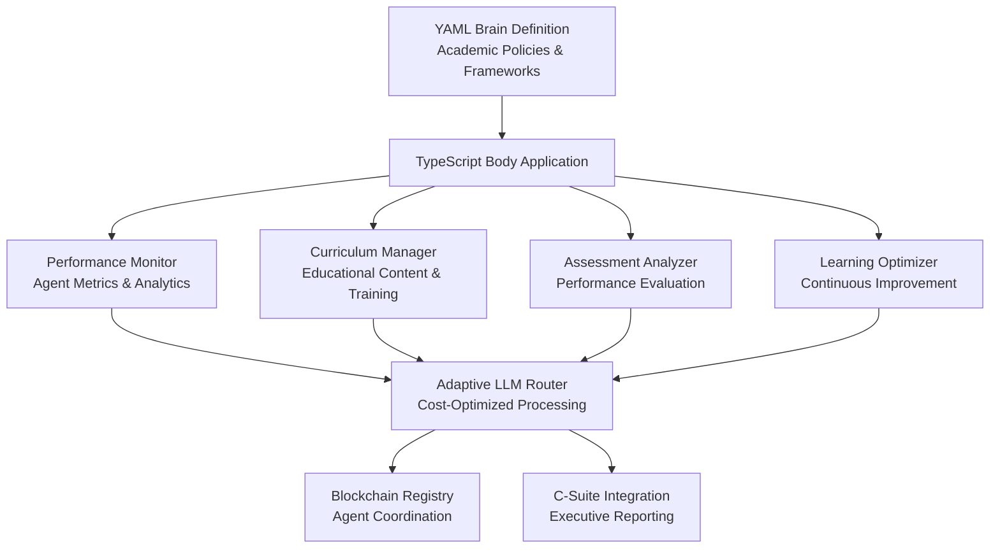
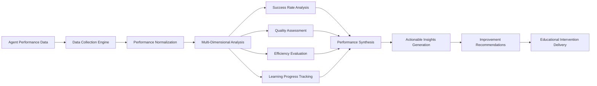

# Chief Academic Officer (CAO) Agent Design

## Overview

The Chief Academic Officer (CAO) Agent represents a crucial addition to the 371 OS C-Suite executive layer, responsible for monitoring agent performance, managing educational components, and ensuring continuous improvement of the autonomous workforce. Following the established unified "brain/body" architecture pattern, the CAO Agent will provide comprehensive academic leadership, performance analytics, and learning optimization across the entire agent ecosystem.

## Architecture

### Brain/Body Separation Pattern

The CAO Agent follows the established unified architecture pattern with clear separation between cognitive decision-making and execution capabilities:

#### Agent "Brain" (Cognitive Layer)
- **Location**: `libs/prompts/agent-definitions/cao_agent.yml`
- **Purpose**: Defines the CAO's core personality, decision-making frameworks, and academic leadership protocols
- **Content**: Academic policies, performance evaluation criteria, educational curriculum guidelines, and learning optimization strategies

#### Agent "Body" (Execution Layer)
- **Location**: `apps/cao-agent/` (New Nx Application)
- **Purpose**: Implements the runtime execution environment with performance monitoring, educational delivery, and agent assessment capabilities
- **Architecture**: TypeScript/Node.js application with modular component structure

### Component Architecture

The CAO Agent consists of four primary operational components:

## Agent Responsibilities & Capabilities

### Core Academic Functions

#### Performance Monitoring & Analytics
- **Real-time Agent Performance Tracking**: Continuous monitoring of all agents across success rates, response times, and task completion metrics
- **Cross-Agent Performance Benchmarking**: Comparative analysis to identify high-performing agents and improvement opportunities
- **Performance Trend Analysis**: Historical performance tracking with predictive analytics for capability forecasting
- **KPI Dashboard Management**: Executive-level performance dashboards for C-Suite consumption

#### Educational Curriculum Development
- **Adaptive Learning Curriculum Design**: Development of personalized training modules based on individual agent performance gaps
- **Skill Enhancement Programs**: Targeted educational content for specific agent capabilities and domain expertise
- **Best Practice Documentation**: Capture and formalization of successful agent behaviors for organization-wide adoption
- **Knowledge Transfer Optimization**: Efficient distribution of learning content across the agent ecosystem

#### Assessment & Evaluation Framework
- **Competency Assessment**: Systematic evaluation of agent capabilities against established performance standards
- **Learning Progress Tracking**: Monitoring of educational intervention effectiveness and skill acquisition rates
- **Performance Gap Analysis**: Identification of capability deficiencies and strategic improvement recommendations
- **Certification & Validation**: Formal assessment processes for agent capability verification

#### Continuous Improvement Orchestration
- **Learning Loop Implementation**: Systematic feedback mechanisms for ongoing agent enhancement
- **Performance Optimization Strategies**: Data-driven recommendations for agent capability improvements
- **Educational Intervention Planning**: Strategic deployment of training resources based on performance analysis
- **Innovation Catalyst**: Identification and promotion of emerging best practices across the agent ecosystem

### Technical Implementation Domains

#### Performance Metrics Framework
- **Success Rate Analysis**: Task completion success rates across different agent types and complexity levels
- **Response Time Optimization**: Performance benchmarking for response latency and throughput optimization
- **Resource Utilization Tracking**: CPU, memory, and network resource consumption analysis
- **Quality Metrics Assessment**: Output quality evaluation through automated and human-in-the-loop validation

#### Learning Management System
- **Curriculum Versioning**: Systematic management of educational content versions and updates
- **Learning Path Optimization**: Personalized educational sequences based on agent learning patterns
- **Assessment Automation**: Automated testing and evaluation of agent capability improvements
- **Progress Analytics**: Detailed tracking of learning outcomes and skill acquisition metrics

## Data Models & Performance Tracking

### Agent Performance Schema

| Field | Type | Description | Validation Rules |
|-------|------|-------------|------------------|
| agentId | string | Unique agent identifier | Required, alphanumeric |
| performanceScore | number | Overall performance rating (0-100) | Range: 0-100 |
| successRate | number | Task completion success percentage | Range: 0-1.0 |
| averageResponseTime | number | Mean response time in milliseconds | Positive integer |
| taskComplexityHandling | object | Capability ratings by task complexity | Complex nested object |
| learningProgress | array | Historical learning milestones | Chronologically ordered |
| competencyAreas | object | Skills assessment by domain | Domain-specific ratings |
| improvementRecommendations | array | Actionable improvement suggestions | Prioritized list |

### Educational Curriculum Structure

| Component | Type | Purpose | Update Frequency |
|-----------|------|---------|------------------|
| curriculumId | string | Unique curriculum identifier | Static |
| targetCompetencies | array | Learning objectives and outcomes | Monthly review |
| learningModules | array | Educational content components | Continuous updates |
| assessmentCriteria | object | Evaluation standards and metrics | Quarterly review |
| prerequisiteSkills | array | Required foundational capabilities | Stable |
| difficultyProgression | object | Learning complexity sequence | Adaptive |
| completionMetrics | object | Success measurement criteria | Performance-based |

### Performance Assessment Matrix

| Metric Category | Weight | Evaluation Criteria | Threshold Values |
|-----------------|--------|-------------------|------------------|
| Task Completion | 30% | Success rate and accuracy | Excellent: >95%, Good: >85%, Needs Improvement: <85% |
| Response Quality | 25% | Output relevance and completeness | High: >90%, Medium: >75%, Low: <75% |
| Learning Velocity | 20% | Skill acquisition speed | Fast: >80% improvement/month, Average: >50%, Slow: <50% |
| Adaptability | 15% | Performance across diverse tasks | Highly Adaptable: >85%, Moderate: >70%, Limited: <70% |
| Resource Efficiency | 10% | Computational resource optimization | Efficient: <2x baseline, Standard: <3x, Inefficient: >3x |

## Business Logic Architecture

### Performance Analysis Workflow

The CAO Agent implements a sophisticated performance analysis pipeline that processes agent behavior data through multiple evaluation layers:

### Curriculum Development Engine

The educational curriculum development process follows a systematic approach to ensure optimal learning outcomes:

1. **Performance Gap Identification**: Analysis of agent performance data to identify specific capability deficiencies
2. **Learning Objective Definition**: Translation of performance gaps into specific, measurable learning objectives
3. **Content Development Strategy**: Creation of educational materials tailored to address identified learning needs
4. **Assessment Design**: Development of evaluation mechanisms to measure learning progress and effectiveness
5. **Delivery Optimization**: Personalization of educational content delivery based on agent learning patterns
6. **Outcome Measurement**: Continuous evaluation of educational intervention effectiveness

### Assessment & Evaluation Framework

The CAO Agent implements a comprehensive assessment framework that evaluates agent capabilities across multiple dimensions:

#### Competency Assessment Process
1. **Baseline Capability Mapping**: Initial assessment of agent capabilities across all functional domains
2. **Performance Benchmarking**: Comparison of agent performance against established organizational standards
3. **Gap Analysis**: Identification of specific areas requiring improvement or enhancement
4. **Learning Plan Development**: Creation of personalized educational interventions based on assessment results
5. **Progress Monitoring**: Continuous tracking of learning outcomes and capability improvements
6. **Outcome Validation**: Formal certification of acquired capabilities and skills

## Integration Patterns

### C-Suite Coordination Framework

The CAO Agent maintains strategic integration with other C-Suite agents to ensure comprehensive organizational performance optimization:

#### CEO Agent (Mimi) Integration
- **Strategic Performance Reporting**: Regular delivery of high-level performance analytics and organizational learning metrics
- **Resource Allocation Recommendations**: Data-driven insights for educational resource investment and prioritization
- **Agent Capability Forecasting**: Predictive analysis of future agent capabilities based on current learning trajectories

#### CTO Agent (Zara) Integration
- **Technical Competency Development**: Collaboration on technical skill enhancement programs for engineering-focused agents
- **Performance Optimization Consulting**: Technical recommendations for agent performance improvements
- **System Integration Learning**: Educational support for complex technical integration requirements

#### CFO Agent (Maya) Integration
- **Training ROI Analysis**: Financial impact assessment of educational investments and learning programs
- **Cost-Benefit Evaluation**: Economic analysis of performance improvement initiatives
- **Budget Planning Support**: Educational resource budgeting based on performance improvement projections

#### CLO Agent (Alex) Integration
- **Compliance Training Coordination**: Educational programs ensuring agent adherence to legal and regulatory requirements
- **Governance Framework Education**: Training delivery for organizational policy and governance compliance
- **Risk Mitigation Learning**: Educational interventions addressing legal and compliance risk areas

### External System Integration

#### Adaptive LLM Router Coordination
- **Performance-Based Routing**: Integration with the LLM router to optimize educational content delivery based on cost and performance considerations
- **Learning Analytics Enhancement**: Utilization of router analytics to improve educational content effectiveness
- **Resource Optimization**: Collaborative optimization of computational resources for educational delivery

#### Blockchain Registry Integration
- **Agent Capability Verification**: Registration and verification of agent capabilities through blockchain-based certification
- **Performance Credentialing**: Cryptographic validation of agent competencies and learning achievements
- **Decentralized Learning Records**: Immutable storage of educational progress and achievement records

## Testing Strategy

### Performance Testing Framework

The CAO Agent requires comprehensive testing across multiple dimensions to ensure reliable academic leadership:

#### Mock Performance Analysis Testing
- **Simulated Agent Performance Data**: Generation of realistic performance data sets for algorithm validation
- **Assessment Accuracy Validation**: Verification of performance evaluation accuracy through controlled test scenarios
- **Learning Progress Simulation**: Testing of educational intervention effectiveness through simulated learning scenarios

#### Educational Content Delivery Testing
- **Curriculum Effectiveness Validation**: Testing of educational content delivery mechanisms and learning outcome measurement
- **Assessment Framework Verification**: Validation of agent competency assessment accuracy and reliability
- **Personalization Algorithm Testing**: Testing of adaptive learning path generation and optimization

#### Integration Testing Protocol
- **C-Suite Coordination Testing**: Validation of inter-agent communication and coordination mechanisms
- **Router Integration Verification**: Testing of adaptive LLM router integration for educational content delivery
- **Blockchain Integration Testing**: Verification of blockchain-based capability registration and verification systems