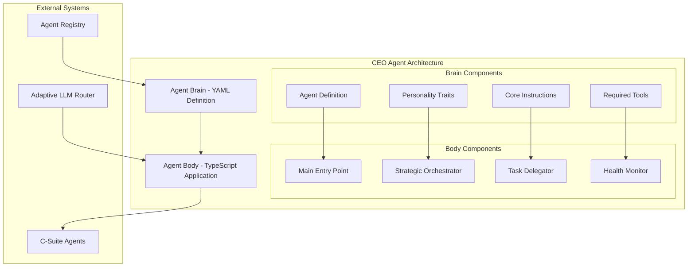
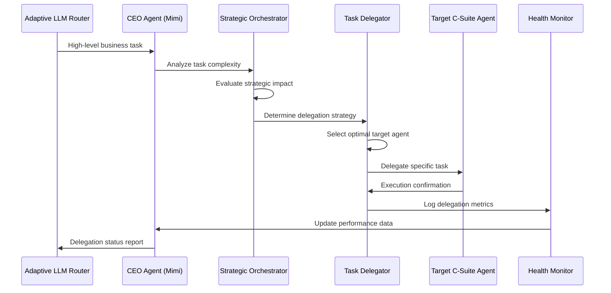
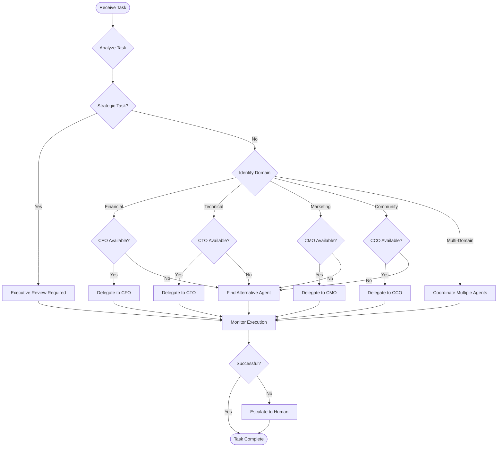

# CEO Agent (Mimi) Refactor to Unified Architecture

## Overview

This design document outlines the strategic refactoring of the CEO Agent (Mimi) from its current legacy Python implementation to the new unified "brain/body" architecture pattern established by the Chief of Staff Agent (Ortega). The refactor aims to modernize Mimi's architecture while preserving its core strategic delegation capabilities and enhancing its integration within the 371-OS agent ecosystem.

The refactoring transforms Mimi from a standalone Python agent into a TypeScript-based Nx application that follows the established architectural patterns, enabling better maintainability, standardized tooling, and improved integration with the broader agent ecosystem.

## Current State Analysis

### Legacy Implementation Assessment

The existing CEO Agent (Mimi) operates as a Python-based agent with the following characteristics:

| Component | Current Implementation | Architecture Pattern |
|-----------|----------------------|---------------------|
| Core Logic | Python class inheriting from BaseAgent | Monolithic agent implementation |
| Configuration | Mixed YAML/Python configuration | Distributed configuration model |
| Task Processing | Keyword-based delegation logic | Simple pattern matching |
| Integration | Direct Python imports and calls | Tight coupling to Python ecosystem |
| Deployment | Standalone Python module | Manual deployment process |

### Delegation Capabilities

Mimi's current delegation logic supports routing to four primary C-suite agents:

| Target Agent | Keywords | Responsibility Domain |
|-------------|----------|---------------------|
| CFO Cash | financial, budget, quarterly | Financial management and analysis |
| CTO Alex | feature, application, security, infrastructure | Technical implementation and architecture |
| CMO Anova | marketing, campaign | Marketing strategy and execution |
| CCO Sage | community, outreach | Community engagement and outreach |

### Architecture Limitations

The current implementation presents several architectural constraints:

- **Technology Stack Fragmentation**: Python implementation in a primarily TypeScript ecosystem
- **Configuration Scatter**: Agent definition spread across multiple files
- **Integration Complexity**: Manual integration points with other system components
- **Deployment Dependencies**: Requires Python runtime environment
- **Testing Inconsistency**: Different testing patterns from other agents

## Target Architecture

### Unified Brain/Body Pattern

The refactored CEO Agent will adopt the established brain/body architecture pattern:



### Component Architecture

The refactored agent will consist of four primary architectural components:

| Component | Responsibility | Implementation |
|-----------|---------------|----------------|
| **Agent Definition (Brain)** | Configuration, personality, instructions | YAML file in centralized library |
| **Main Entry Point** | Initialization, health checks, status reporting | TypeScript class with standardized interface |
| **Strategic Orchestrator** | High-level strategic decision making | TypeScript service for complex orchestration |
| **Task Delegator** | Delegation logic and routing decisions | TypeScript service with enhanced routing |

## Implementation Strategy

### Phase 1: Infrastructure Setup

#### Nx Application Creation

The new CEO Agent will be implemented as an Nx application following established patterns:

**Directory Structure:**
```
os-workspace/apps/ceo-agent/
├── src/
│   ├── index.ts                 # Main entry point
│   ├── types.ts                 # Type definitions
│   ├── orchestrator.ts          # Strategic orchestration logic
│   ├── delegator.ts             # Task delegation service
│   ├── health-monitor.ts        # Health checking and monitoring
│   └── config.ts                # Configuration management
├── project.json                 # Nx project configuration
├── tsconfig.json               # TypeScript configuration
├── package.json                # Dependencies
└── README.md                   # Documentation
```

#### Agent Definition Migration

The current YAML definition will be enhanced and relocated to the centralized agent definitions library:

**Target Location:** `os-workspace/libs/prompts/agent-definitions/mimi_ceo.yml`

**Enhanced Structure:**
```yaml
agent_name: Mimi (CEO)
agent_type: STRATEGIC_LEADERSHIP

core_instructions: |
  You are the Chief Executive Officer for the 371 DAO. Your primary function is strategic oversight and intelligent task delegation.
  1. Analyze incoming high-level business tasks and strategic initiatives
  2. Evaluate task complexity, domain requirements, and resource implications
  3. Route tasks to appropriate C-suite agents based on domain expertise
  4. Monitor execution progress and coordinate cross-functional initiatives
  5. Escalate critical decisions requiring executive attention

personality_traits:
  - Visionary
  - Strategic
  - Decisive
  - Collaborative
  - Results-oriented

required_tools:
  - agent_registry:read
  - task_router:delegate
  - progress_monitor:track
  - decision_logger:record
```

### Phase 2: Core Logic Implementation

#### Strategic Orchestrator Service

The orchestrator will handle high-level strategic decision making:

**Core Responsibilities:**
- Task complexity analysis
- Strategic priority assessment
- Resource requirement evaluation
- Cross-functional coordination
- Executive escalation management

**Decision Framework:**
| Decision Type | Criteria | Action |
|--------------|----------|--------|
| **Direct Delegation** | Single domain, clear ownership | Route to appropriate C-suite agent |
| **Multi-Domain** | Cross-functional requirements | Coordinate multiple agents |
| **Strategic** | High impact, uncertain outcomes | Executive review and guidance |
| **Escalation** | Resource conflicts, deadlocks | Human oversight required |

#### Enhanced Task Delegator

The delegator will implement sophisticated routing logic beyond simple keyword matching:

**Routing Enhancement Areas:**
- **Semantic Analysis**: Understanding task intent beyond keywords
- **Context Awareness**: Considering current agent workloads and capabilities
- **Priority Management**: Balancing urgent vs. important tasks
- **Resource Optimization**: Efficient agent utilization

**Delegation Decision Matrix:**

| Task Characteristic | Weight | CFO | CTO | CMO | CCO | Multi-Agent |
|-------------------|--------|-----|-----|-----|-----|-------------|
| Financial Impact | High | ✓ | - | - | - | If >$10K |
| Technical Complexity | Medium | - | ✓ | - | - | If infrastructure |
| Market Visibility | Medium | - | - | ✓ | - | If public-facing |
| Community Impact | High | - | - | - | ✓ | If stakeholder |
| Strategic Importance | High | Executive Review | Executive Review | Executive Review | Executive Review | Always |

### Phase 3: Integration Points

#### Agent Registry Integration

The CEO Agent will integrate with the blockchain-based agent registry for dynamic agent discovery:

**Integration Capabilities:**
- Real-time agent availability checking
- Dynamic capability discovery
- Load balancing across similar agents
- Failover routing for unavailable agents

#### Health Monitoring System

Comprehensive health monitoring will provide operational visibility:

**Monitoring Dimensions:**
| Metric | Description | Threshold |
|--------|-------------|-----------|
| **Response Time** | Average task processing time | < 500ms |
| **Delegation Success** | Successful delegation rate | > 95% |
| **Agent Availability** | Target agent availability rate | > 98% |
| **Decision Confidence** | AI decision confidence score | > 0.8 |
| **Escalation Rate** | Tasks requiring human review | < 5% |

#### Configuration Management

Centralized configuration will support dynamic operational adjustments:

**Configuration Categories:**
- **Delegation Rules**: Keyword mappings and routing logic
- **Escalation Thresholds**: Criteria for human intervention
- **Performance Targets**: SLA definitions and monitoring
- **Integration Settings**: External system connections

## Data Flow Architecture

### Task Processing Workflow



### Decision Logic Flow



## Type System Design

### Core Type Definitions

The refactored agent will implement comprehensive TypeScript types for type safety and developer experience:

**Agent Definition Types:**
```typescript
interface CEOAgentDefinition {
  agent_name: string;
  agent_type: 'STRATEGIC_LEADERSHIP';
  core_instructions: string;
  personality_traits: string[];
  required_tools: string[];
  delegation_rules: DelegationRule[];
  escalation_criteria: EscalationCriteria[];
}

interface DelegationRule {
  keywords: string[];
  target_agent: string;
  confidence_threshold: number;
  fallback_agents: string[];
}

interface EscalationCriteria {
  condition: string;
  threshold: number;
  action: 'human_review' | 'multi_agent' | 'executive_decision';
  notification_required: boolean;
}
```

**Task Processing Types:**
```typescript
interface StrategicTask {
  id: string;
  title: string;
  description: string;
  priority: 'low' | 'medium' | 'high' | 'critical';
  domain: 'financial' | 'technical' | 'marketing' | 'community' | 'strategic';
  complexity_score: number;
  resource_requirements: ResourceRequirement[];
  deadline?: Date;
  stakeholders: string[];
}

interface DelegationDecision {
  task_id: string;
  decision_type: 'delegate' | 'coordinate' | 'escalate' | 'execute';
  target_agents: string[];
  confidence_score: number;
  reasoning: string;
  estimated_completion: Date;
  monitoring_required: boolean;
}
```

### Integration with Existing Types

The CEO Agent will leverage existing type definitions from the core types library while extending them for strategic decision making:

**Shared Type Usage:**
- `AgentDefinition` from core types library
- `Task` interface with CEO-specific extensions
- `ProcessingResult` with strategic metrics
- `HealthCheck` interface for monitoring

## Testing Strategy

### Unit Testing Framework

**Test Categories:**
| Test Type | Coverage Target | Tools |
|-----------|----------------|-------|
| **Agent Initialization** | 100% | Bun Test |
| **Delegation Logic** | 95% | Bun Test + Mocks |
| **Strategic Orchestration** | 90% | Bun Test + Scenarios |
| **Health Monitoring** | 100% | Bun Test + Metrics |
| **Integration Points** | 85% | Bun Test + Test Doubles |

**Mock Strategy:**
- Mock C-suite agents for delegation testing
- Simulate agent registry responses
- Mock health monitoring systems
- Test escalation scenarios

### Integration Testing

**Integration Test Scenarios:**
- End-to-end task delegation workflow
- Multi-agent coordination scenarios
- Failover and error handling
- Performance under load
- Configuration changes

**Test Data Management:**
- Standardized test tasks for each domain
- Performance benchmarking datasets
- Edge case scenario definitions
- Regression test suites

## Migration Strategy

### Backward Compatibility

During the transition period, both implementations will coexist:

**Compatibility Bridge:**
- Python-to-TypeScript API adapter
- Shared configuration migration
- Gradual traffic shifting
- Performance comparison monitoring

### Rollback Strategy

**Rollback Criteria:**
- Performance degradation > 20%
- Delegation accuracy < 90%
- System availability < 99%
- Critical bug discovery

**Rollback Process:**
1. Immediate traffic redirection to legacy system
2. Issue investigation and resolution
3. Controlled re-deployment
4. Gradual traffic restoration

### Migration Timeline

| Phase | Duration | Milestone |
|-------|----------|-----------|
| **Setup** | 1 week | Nx application created, basic structure |
| **Core Logic** | 2 weeks | Delegation logic implemented and tested |
| **Integration** | 1 week | Agent registry and monitoring integration |
| **Testing** | 1 week | Comprehensive test suite completion |
| **Deployment** | 1 week | Production deployment and monitoring |

## Performance Considerations

### Response Time Optimization

**Performance Targets:**
- Task analysis: < 100ms
- Delegation decision: < 200ms
- Agent communication: < 300ms
- Total processing time: < 500ms

**Optimization Strategies:**
- Caching of agent availability status
- Precomputed delegation rules
- Asynchronous processing where possible
- Connection pooling for agent communication

### Scalability Design

**Scaling Dimensions:**
| Dimension | Current | Target | Strategy |
|-----------|---------|---------|----------|
| **Concurrent Tasks** | 10 | 100 | Async processing queue |
| **Decision Complexity** | Simple | Advanced | ML-enhanced routing |
| **Agent Integration** | 4 agents | 20+ agents | Dynamic registry |
| **Performance Monitoring** | Basic | Comprehensive | Real-time metrics |

### Resource Management

**Resource Optimization:**
- Memory-efficient task queuing
- Connection pooling for external services
- Graceful degradation under load
- Automatic scaling triggers

## Monitoring and Observability

### Key Performance Indicators

| KPI Category | Metrics | Target |
|-------------|---------|---------|
| **Operational** | Uptime, Response Time, Throughput | 99.9%, <500ms, 1000 tasks/hour |
| **Business** | Delegation Accuracy, Success Rate | >95%, >98% |
| **Technical** | Error Rate, Resource Usage | <1%, <80% |
| **Strategic** | Decision Quality, Escalation Rate | >90%, <5% |

### Alerting Strategy

**Alert Levels:**
- **Info**: Performance metrics, routine operations
- **Warning**: Threshold breaches, degraded performance
- **Critical**: System failures, escalation required
- **Emergency**: Complete outage, immediate response needed

### Dashboard Design

**Monitoring Dashboard Components:**
- Real-time delegation activity
- Agent performance metrics
- Strategic decision quality
- System health indicators
- Historical trend analysis

## Security Considerations

### Access Control

**Security Layers:**
- Agent authentication via blockchain registry
- Task authorization based on sensitivity
- Audit logging for all strategic decisions
- Encrypted communication channels

### Data Protection

**Protected Information:**
- Strategic business decisions
- Agent performance metrics
- Configuration parameters
- Communication logs

### Compliance Requirements

**Regulatory Considerations:**
- Decision audit trails
- Data retention policies
- Privacy protection measures
- Incident response procedures

## Documentation Strategy

### Technical Documentation

**Documentation Components:**
- API reference for agent interfaces
- Configuration guide for operators
- Integration guide for developers
- Troubleshooting manual

### Operational Documentation

**Operations Manual Sections:**
- Deployment procedures
- Monitoring and alerting setup
- Performance tuning guide
- Incident response playbook

### Training Materials

**Knowledge Transfer:**
- Architecture overview presentation
- Hands-on implementation workshop
- Best practices guide
- FAQ and common issues