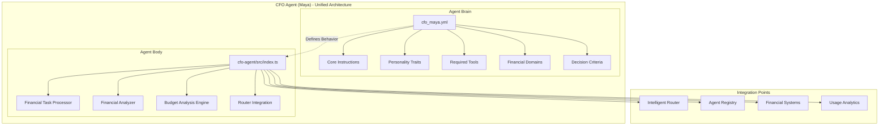
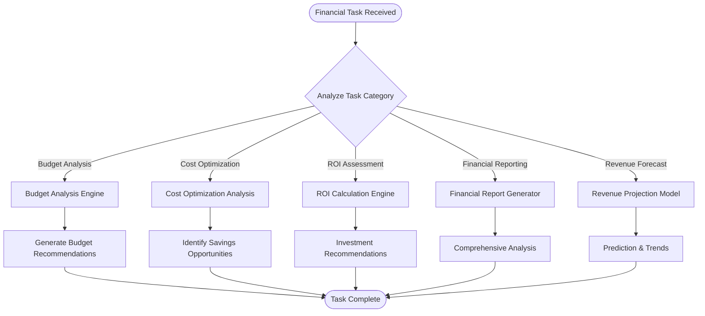
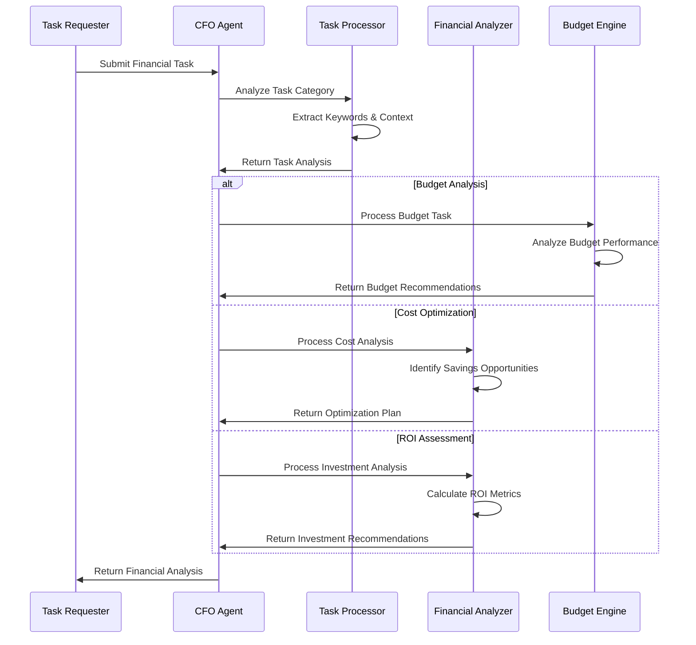
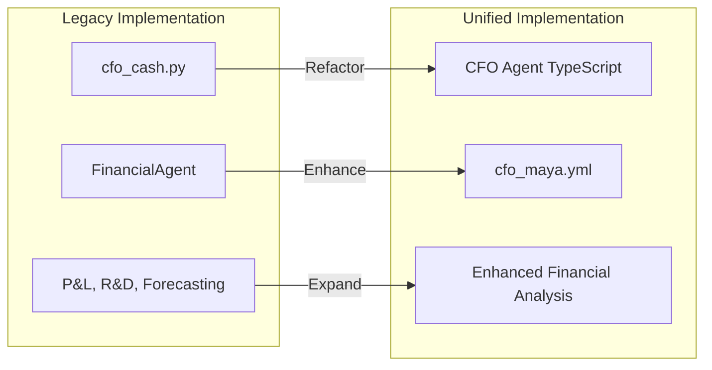
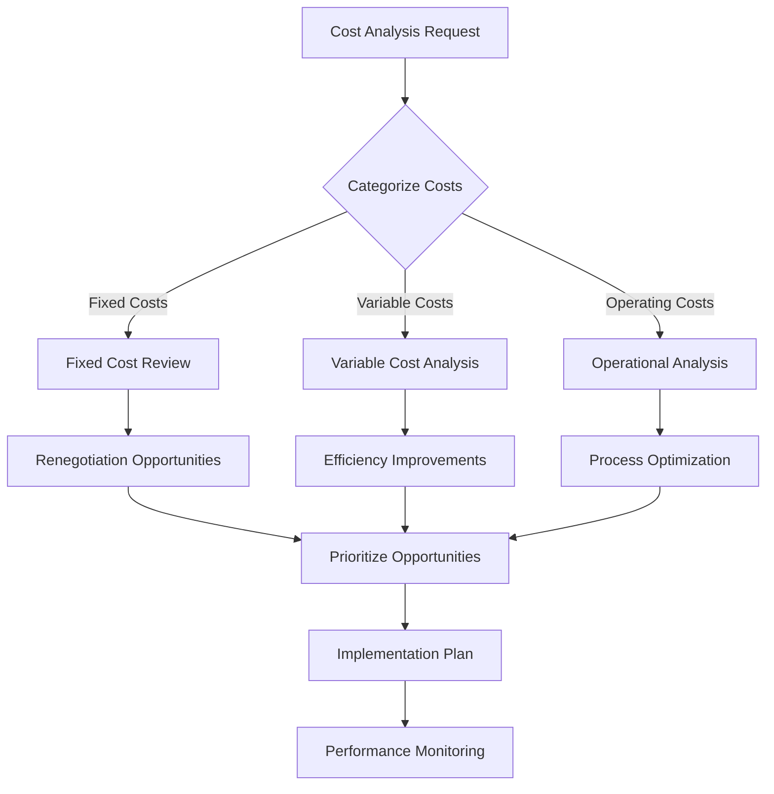

# CFO Agent (Maya) Refactoring to Unified Architecture

## Overview

This design document outlines the refactoring of the legacy CFO Agent (Maya) from the current Python-based implementation to the modernized unified "brain/body" architecture pattern. The refactoring aligns Maya with the established architectural standards demonstrated by the CTO Agent (Zara) and other C-Suite agents, enabling seamless integration with the 371 OS ecosystem while maintaining Maya's core financial capabilities.

The refactoring transforms Maya from a legacy Python implementation (`cfo_cash.py`) into a modern TypeScript-based agent following the established patterns of separation between configuration ("brain") and execution ("body").

## Architecture Overview

The unified architecture separates the CFO Agent into two distinct components:



### Component Structure

| Component | Location | Purpose |
|-----------|----------|---------|
| **Agent Brain** | `libs/prompts/agent-definitions/cfo_maya.yml` | Centralized configuration defining Maya's personality, capabilities, and decision framework |
| **Agent Body** | `apps/cfo-agent/src/index.ts` | TypeScript implementation providing execution runtime and business logic |
| **Task Processor** | `apps/cfo-agent/src/financial-task-processor.ts` | Intelligent task categorization and analysis engine |
| **Financial Analyzer** | `apps/cfo-agent/src/financial-analyzer.ts` | Core financial decision generation and analysis logic |
| **Budget Engine** | `apps/cfo-agent/src/budget-analysis-engine.ts` | Specialized component for budget optimization and cost analysis |

## Financial Domain Model

Maya's financial capabilities are organized into distinct domains with specific decision criteria and analysis frameworks:



### Financial Decision Framework

| Domain | Keywords | Analysis Approach | Decision Factors |
|--------|----------|-------------------|------------------|
| **Budget Analysis** | budget, allocation, spending, variance | Comparative analysis against targets | Performance vs budget, variance analysis, trend identification |
| **Cost Optimization** | cost-saving, efficiency, optimization, reduce | Opportunity identification and prioritization | Impact magnitude, implementation complexity, risk assessment |
| **ROI Assessment** | investment, return, profitability, value | Cost-benefit analysis with projections | Expected returns, payback period, risk-adjusted value |
| **Financial Reporting** | P&L, financial, quarterly, analysis | Comprehensive financial statement analysis | Revenue trends, cost structure, profitability metrics |
| **Revenue Forecasting** | forecast, revenue, projection, growth | Predictive modeling and trend analysis | Historical patterns, market conditions, growth indicators |

## Agent Brain Configuration

The `cfo_maya.yml` configuration defines Maya's core behavioral patterns and capabilities:

### Core Instructions Structure

```yaml
agent_name: Maya (CFO)
agent_type: FINANCIAL_LEADERSHIP

core_instructions: |
  You are the Chief Financial Officer for the 371 DAO. Your primary function is financial strategy, 
  budget optimization, cost analysis, and financial decision-making.
  
  Core Responsibilities:
  1. Analyze budget performance and identify optimization opportunities
  2. Conduct cost-benefit analysis for strategic initiatives
  3. Generate ROI assessments and investment recommendations
  4. Oversee financial reporting and variance analysis
  5. Develop revenue forecasts and financial projections
  6. Coordinate cost optimization across all business units

personality_traits:
  - Financial Acumen: Deep expertise in financial analysis and strategic planning
  - Cost-Conscious: Relentless focus on efficiency and cost optimization
  - Data-Driven: Evidence-based decision making with quantitative analysis
  - Strategic Vision: Long-term financial planning aligned with business objectives
  - Risk-Aware: Comprehensive risk assessment and mitigation strategies
  - Performance-Oriented: Measurable outcomes and continuous improvement
```

### Financial Domain Definitions

| Domain | Decision Criteria | Performance Targets |
|--------|-------------------|-------------------|
| **Budget Management** | Variance thresholds, spending patterns, allocation efficiency | <5% budget variance, 95% forecast accuracy |
| **Cost Optimization** | Savings potential, implementation feasibility, ROI impact | >10% cost reduction opportunities identified |
| **Investment Analysis** | ROI thresholds, payback periods, risk-adjusted returns | >15% ROI requirement, <24 month payback |
| **Financial Planning** | Revenue growth, margin improvement, cash flow optimization | >20% revenue growth, >5% margin improvement |

## Agent Body Implementation

The TypeScript implementation provides the execution runtime for Maya's financial operations:

### Core Class Structure

```typescript
export class CFOAgent {
  private agentDefinition: AgentDefinition;
  private taskProcessor: FinancialTaskProcessor;
  private financialAnalyzer: FinancialAnalyzer;
  private budgetEngine: BudgetAnalysisEngine;
  private performanceMetrics: FinancialMetrics;

  constructor() {
    this.agentDefinition = this.loadAgentDefinition();
    this.taskProcessor = new FinancialTaskProcessor();
    this.financialAnalyzer = new FinancialAnalyzer();
    this.budgetEngine = new BudgetAnalysisEngine();
    this.performanceMetrics = this.initializeMetrics();
  }

  public async processTask(task: FinancialTask): Promise<FinancialResult> {
    // Task processing implementation
  }
}
```

### Financial Task Processing Logic

The task processor implements intelligent categorization and routing of financial tasks:



## Migration Strategy

The migration from legacy Python implementation to unified architecture follows a structured approach:

### Phase 1: Architecture Setup

| Task | Component | Implementation |
|------|-----------|----------------|
| Create Agent Application | `apps/cfo-agent/` | Generate new Nx application with TypeScript configuration |
| Define Agent Brain | `libs/prompts/agent-definitions/cfo_maya.yml` | Configure Maya's personality, instructions, and capabilities |
| Setup Core Structure | `src/index.ts` | Implement main CFO agent class with component initialization |
| Initialize Components | `src/` directory | Create task processor, analyzer, and engine components |

### Phase 2: Core Implementation

| Component | Functionality | Testing Strategy |
|-----------|---------------|------------------|
| **Task Processor** | Intelligent task categorization using keyword analysis | Unit tests with various financial task scenarios |
| **Financial Analyzer** | Core financial decision logic with multiple analysis modes | Integration tests with mock financial data |
| **Budget Engine** | Specialized budget analysis and optimization recommendations | Performance tests with large dataset scenarios |
| **Integration Layer** | Router integration and performance monitoring | End-to-end tests with actual task processing |

### Phase 3: Legacy Migration

The migration preserves existing functionality while enhancing capabilities:



## Financial Analysis Capabilities

Maya's enhanced capabilities provide comprehensive financial analysis across multiple domains:

### Budget Analysis Engine

```typescript
interface BudgetAnalysis {
  budgetPerformance: {
    actualVsBudget: number;
    variancePercentage: number;
    trendAnalysis: string;
  };
  optimizationOpportunities: {
    category: string;
    savingsPotential: number;
    implementationComplexity: 'low' | 'medium' | 'high';
    riskLevel: 'low' | 'medium' | 'high';
  }[];
  recommendations: {
    priority: 'high' | 'medium' | 'low';
    action: string;
    expectedImpact: number;
    timeframe: string;
  }[];
}
```

### ROI Assessment Framework

| Metric | Calculation Method | Decision Threshold |
|--------|--------------------|-------------------|
| **Return on Investment** | (Gain - Cost) / Cost × 100 | >15% minimum acceptable |
| **Payback Period** | Initial Investment / Annual Cash Flow | <24 months preferred |
| **Net Present Value** | Sum of discounted future cash flows | >$0 required |
| **Internal Rate of Return** | Discount rate where NPV = 0 | >Cost of capital + risk premium |

### Cost Optimization Analysis



## Integration Architecture

Maya integrates with the broader 371 OS ecosystem through standardized interfaces:

### Router Integration

```typescript
interface RouterIntegration {
  registerCapabilities(): void;
  handleTaskRequest(task: FinancialTask): Promise<FinancialResult>;
  reportPerformanceMetrics(): PerformanceReport;
  updateAvailabilityStatus(status: AvailabilityStatus): void;
}
```

### Performance Monitoring

| Metric | Target | Measurement |
|--------|--------|-------------|
| **Response Time** | <1000ms | Average task processing time |
| **Analysis Accuracy** | >95% | Validation against actual outcomes |
| **Cost Optimization Impact** | >10% savings identified | Measurable cost reduction opportunities |
| **Budget Forecast Accuracy** | >90% | Variance between forecast and actual |

## Testing Strategy

Comprehensive testing ensures Maya's reliability and accuracy:

### Unit Testing Framework

```typescript
describe('CFO Agent Financial Analysis', () => {
  test('Budget analysis identifies variance opportunities', async () => {
    const budgetTask = createMockBudgetTask();
    const result = await cfoAgent.processTask(budgetTask);
    
    expect(result.analysis.variancePercentage).toBeDefined();
    expect(result.recommendations).toHaveMinimumLength(1);
    expect(result.metadata.confidence).toBeGreaterThan(0.85);
  });

  test('Cost optimization generates actionable recommendations', async () => {
    const costTask = createMockCostOptimizationTask();
    const result = await cfoAgent.processTask(costTask);
    
    expect(result.optimizationOpportunities).toBeDefined();
    expect(result.savingsPotential).toBeGreaterThan(0);
  });
});
```

### Integration Testing Scenarios

| Test Scenario | Validation Criteria | Expected Outcome |
|---------------|-------------------|------------------|
| **Budget Variance Analysis** | Task processing accuracy and recommendation quality | Identifies 3+ optimization opportunities with >90% confidence |
| **ROI Assessment** | Calculation accuracy and decision logic | Provides investment recommendation with supporting analysis |
| **Cost Reduction Planning** | Savings identification and implementation prioritization | Generates actionable cost reduction plan with timeline |
| **Financial Reporting** | Data accuracy and insight generation | Produces comprehensive financial analysis with trend identification |

## Performance Considerations

Maya is optimized for high-performance financial analysis:

### Processing Optimization

```typescript
class PerformanceOptimizations {
  private static readonly CACHE_TTL = 300000; // 5 minutes
  private static readonly MAX_CONCURRENT_TASKS = 10;
  private static readonly RESPONSE_TIME_TARGET = 1000; // 1 second
  
  private taskCache: Map<string, CachedResult>;
  private concurrencyLimiter: ConcurrencyLimiter;
  private performanceMonitor: PerformanceMonitor;
}
```

### Scalability Architecture

| Component | Scaling Strategy | Performance Target |
|-----------|------------------|-------------------|
| **Task Processing** | Asynchronous processing with concurrency limits | Handle 100+ concurrent tasks |
| **Analysis Engine** | Caching of frequent calculations | <500ms analysis completion |
| **Data Access** | Optimized queries with result caching | <200ms data retrieval |
| **Integration** | Connection pooling and circuit breakers | >99.9% availability |

## Deployment Configuration

The CFO Agent integrates seamlessly with Nx workspace build and deployment processes:

### Package Configuration

```json
{
  "name": "cfo-agent",
  "version": "1.0.0",
  "description": "CFO Agent (Maya) - Financial Leadership and Analysis",
  "main": "src/index.ts",
  "type": "module",
  "scripts": {
    "start": "bun run src/index.ts",
    "dev": "bun --watch src/index.ts",
    "test": "bun test",
    "build": "bun build src/index.ts --outdir dist --target node"
  },
  "dependencies": {
    "yaml": "^2.4.1"
  }
}
```

### Nx Project Configuration

```json
{
  "name": "cfo-agent",
  "sourceRoot": "apps/cfo-agent/src",
  "projectType": "application",
  "targets": {
    "build": {
      "executor": "@nx/node:build",
      "options": {
        "outputPath": "dist/apps/cfo-agent",
        "main": "apps/cfo-agent/src/index.ts",
        "tsConfig": "apps/cfo-agent/tsconfig.app.json"
      }
    },
    "test": {
      "executor": "@nx/jest:jest",
      "options": {
        "jestConfig": "apps/cfo-agent/jest.config.ts"
      }
    }
  }
}
```

## Implementation Timeline

The refactoring follows a structured implementation timeline:

### Week 1: Foundation Setup
- Create Nx application structure for `cfo-agent`
- Define `cfo_maya.yml` agent brain configuration
- Implement core `CFOAgent` class with basic functionality
- Setup project configuration and dependencies

### Week 2: Core Components
- Implement `FinancialTaskProcessor` with intelligent categorization
- Develop `FinancialAnalyzer` with multi-domain analysis capabilities
- Create `BudgetAnalysisEngine` for specialized budget operations
- Build router integration layer

### Week 3: Enhanced Analysis
- Implement advanced financial analysis algorithms
- Add ROI assessment and cost optimization logic
- Develop performance monitoring and metrics collection
- Create comprehensive error handling and logging

### Week 4: Testing & Integration
- Build comprehensive unit and integration test suites
- Validate against legacy CFO agent functionality
- Performance optimization and load testing
- Documentation and deployment preparation

## Risk Assessment

| Risk Category | Risk Description | Mitigation Strategy | Impact Level |
|---------------|------------------|-------------------|--------------|
| **Functional Parity** | New implementation may not match legacy capabilities | Comprehensive test suite comparing old vs new behavior | Medium |
| **Performance** | TypeScript implementation may be slower than Python | Optimization through caching and async processing | Low |
| **Integration** | Router integration complexity may cause delays | Phased integration with fallback mechanisms | Medium |
| **Data Accuracy** | Financial analysis accuracy critical for business decisions | Extensive validation and confidence scoring | High |

## Success Criteria

### Functional Requirements
- [ ] Agent successfully loads `cfo_maya.yml` configuration
- [ ] Processes budget analysis tasks with >90% accuracy
- [ ] Identifies cost optimization opportunities
- [ ] Generates ROI assessments with supporting analysis
- [ ] Integrates seamlessly with Intelligent Router
- [ ] Maintains <1000ms average response time

### Business Requirements
- [ ] Maintains all existing CFO agent capabilities
- [ ] Enhances financial analysis depth and accuracy
- [ ] Provides actionable business insights and recommendations
- [ ] Supports strategic decision-making with data-driven analysis
- [ ] Enables scalable financial operations across 371 DAO

### Technical Requirements
- [ ] Follows unified brain/body architecture pattern
- [ ] Implements comprehensive error handling and logging
- [ ] Includes extensive test coverage (>90%)
- [ ] Provides performance monitoring and health checks
- [ ] Supports concurrent task processing

The successful completion of this refactoring will establish Maya as a production-ready financial leadership agent, fully aligned with the 371 OS unified architecture while delivering enhanced financial analysis capabilities for autonomous business operations.