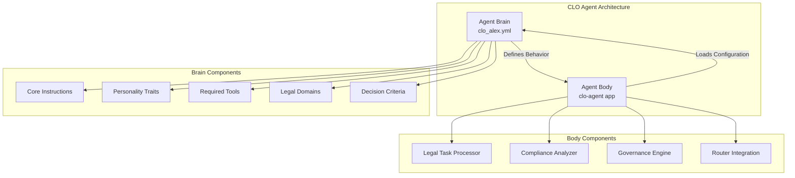
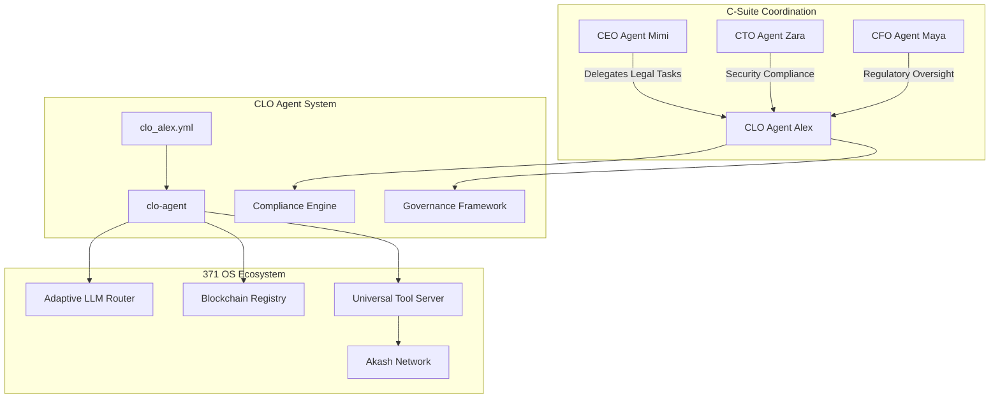
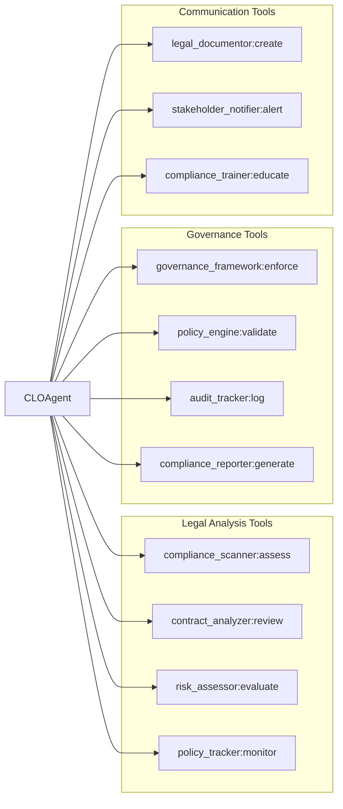
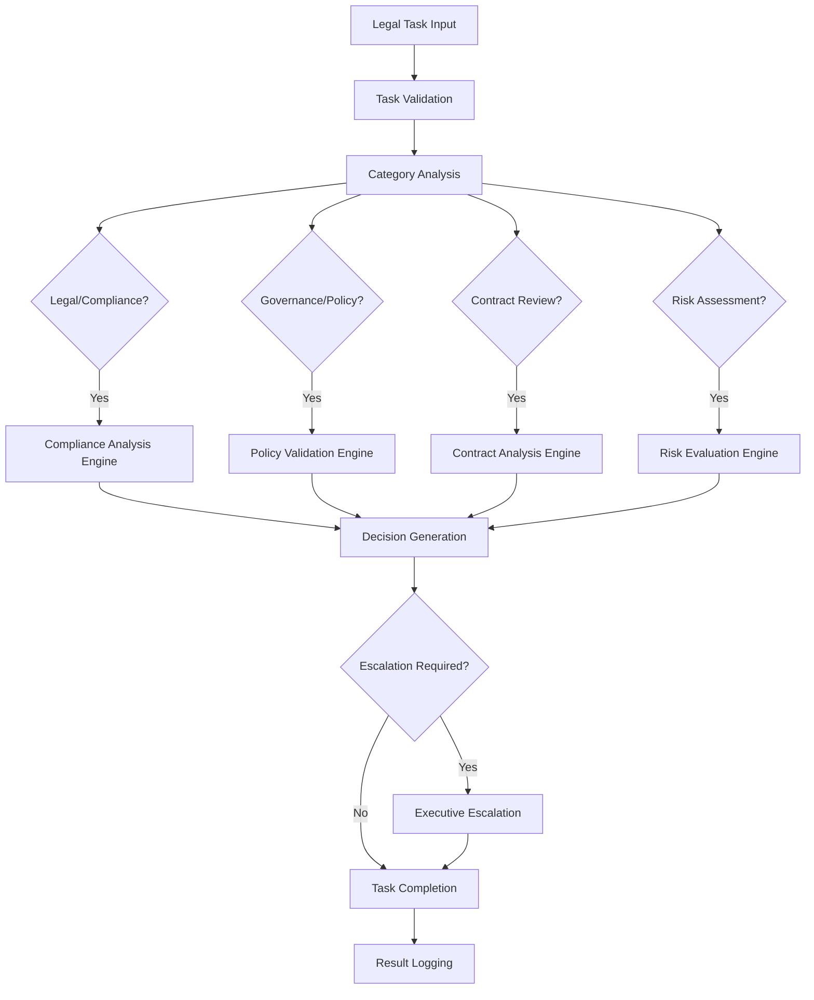
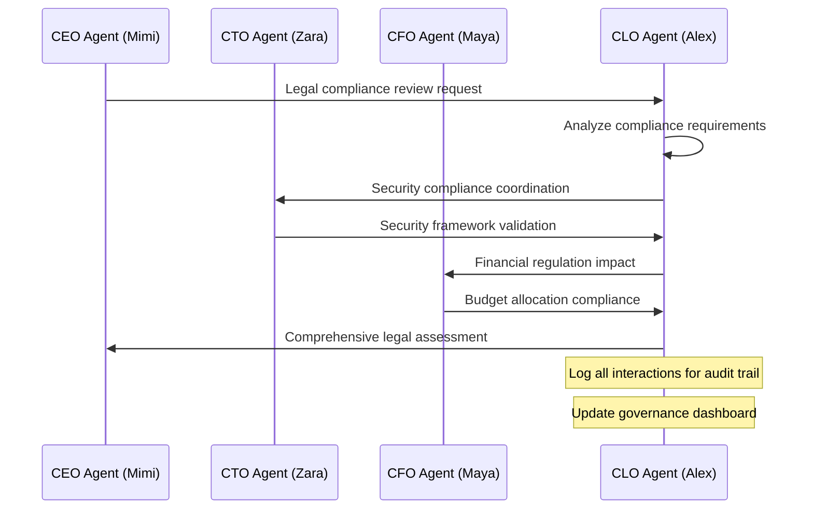
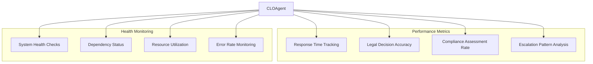
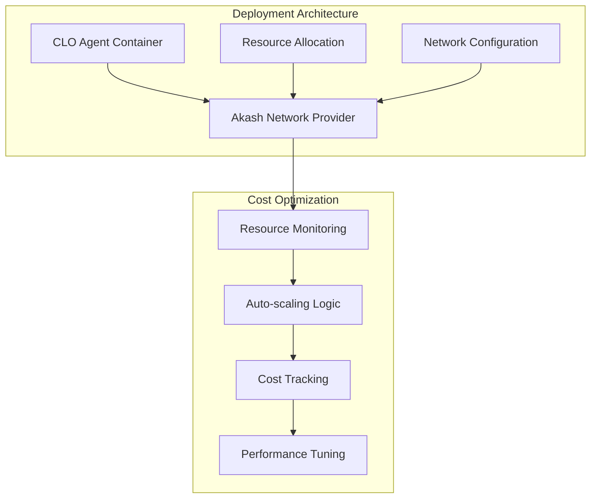

# CLO Agent (Alex) Unified Architecture Refactoring Design

## Overview

This design document outlines the refactoring of the legacy CLO Agent (Alex) from scattered implementation files to a unified "brain/body" architecture pattern, aligning with the modernized C-Suite agent standards established by the CEO Agent (Mimi), CTO Agent (Zara), and CFO Agent (Maya).

## Architecture

### Brain/Body Separation Pattern

The unified architecture separates agent concerns into two distinct components:

- **Brain (Cognitive Definition)**: YAML-based agent definition containing core instructions, personality traits, and behavioral patterns stored in the centralized prompt library
- **Body (Execution Runtime)**: TypeScript-based Nx application providing task processing, decision logic, and system integration capabilities



### Component Integration

The CLO Agent integrates with the broader 371 OS ecosystem through standardized interfaces:



## Agent Brain Definition (clo_alex.yml)

### Core Instructions Structure

The agent brain defines Alex's role as the Chief Legal Officer with specific focus areas:

| Responsibility Area | Description | Success Criteria |
|-------------------|-------------|------------------|
| Legal Compliance | Ensure adherence to regulatory requirements and legal frameworks | 100% compliance assessment completion within SLA |
| Governance Oversight | Manage organizational governance structures and policy enforcement | Policy violations identified and addressed within 24 hours |
| Risk Assessment | Identify legal risks and develop mitigation strategies | Risk assessments completed with >90% accuracy |
| Regulatory Analysis | Monitor regulatory changes and assess business impact | Regulatory updates processed within 48 hours |
| Contract Review | Analyze legal documents and agreements for compliance | Contract reviews completed with zero critical issues missed |

### Personality Traits Framework

Alex's personality is designed to embody legal expertise and risk awareness:

- **Legal Precision**: Meticulous attention to regulatory detail and compliance requirements
- **Risk-Aware**: Proactive identification and mitigation of legal and compliance risks
- **Governance-Focused**: Strong emphasis on organizational structure and policy adherence
- **Analytical Rigor**: Evidence-based legal reasoning and systematic review processes
- **Stakeholder Communication**: Clear communication of legal implications to business stakeholders

### Required Tools Integration



## Agent Body Implementation (clo-agent)

### Nx Application Structure

The CLO Agent body follows the established Nx application pattern:

| File/Directory | Purpose | Implementation Details |
|----------------|---------|----------------------|
| `src/index.ts` | Main entry point and agent orchestration | Agent definition loading, component initialization, health checks |
| `src/types.ts` | TypeScript interfaces and type definitions | Legal task types, compliance structures, governance models |
| `src/legal-task-processor.ts` | Core legal task processing engine | Task categorization, analysis routing, decision logic |
| `src/compliance-analyzer.ts` | Compliance assessment and analysis | Regulatory compliance evaluation, violation detection |
| `src/governance-engine.ts` | Governance framework enforcement | Policy validation, governance structure management |
| `src/router-integration.ts` | Adaptive LLM Router integration | Cost-optimized legal analysis, provider selection |
| `project.json` | Nx project configuration | Build targets, dependencies, execution parameters |
| `package.json` | Node.js package configuration | Dependencies, scripts, metadata |
| `tsconfig.json` | TypeScript compiler configuration | Compilation settings, module resolution |

### Legal Task Processing Engine

The core processing logic implements mock legal analysis with sophisticated decision trees:



### Mock Legal Analysis Logic

The implementation provides sophisticated mock analysis that demonstrates realistic decision-making patterns:

#### Compliance Analysis

```typescript
// Mock implementation structure
interface ComplianceAnalysisResult {
  complianceStatus: 'compliant' | 'non-compliant' | 'requires-review';
  riskLevel: 'low' | 'medium' | 'high' | 'critical';
  recommendedActions: string[];
  legalRequirements: string[];
  timeToResolution: number; // hours
}
```

#### Governance Framework Enforcement

```typescript
interface GovernanceDecision {
  policyAlignment: boolean;
  governanceGaps: string[];
  enforcementActions: string[];
  stakeholderNotifications: string[];
  auditTrail: AuditEntry[];
}
```

#### Risk Assessment Framework

| Risk Category | Assessment Criteria | Mitigation Strategies |
|---------------|-------------------|---------------------|
| Regulatory Compliance | Legal requirement adherence, audit findings | Policy updates, training programs, process improvements |
| Contractual Risk | Agreement terms, liability exposure | Contract amendments, insurance coverage, legal review |
| Governance Risk | Policy violations, structural weaknesses | Governance restructuring, oversight enhancement |
| Operational Risk | Process compliance, regulatory changes | Procedure updates, monitoring systems, alert mechanisms |

## Integration Patterns

### C-Suite Coordination

The CLO Agent coordinates with other C-Suite agents through standardized interfaces:



### Adaptive LLM Router Integration

The CLO Agent leverages the Adaptive LLM Router for cost-optimized legal analysis:

| Analysis Type | Recommended Provider | Cost Optimization Strategy |
|---------------|---------------------|---------------------------|
| Basic Compliance Check | Local/Edge Model | Minimize API costs for routine checks |
| Complex Legal Analysis | GPT-4/Claude | Use premium models for critical decisions |
| Contract Review | Specialized Legal LLM | Leverage domain-specific expertise |
| Risk Assessment | Ensemble Approach | Combine multiple models for accuracy |

### Performance Monitoring



## Testing Strategy

### Unit Testing Framework

Comprehensive testing ensures reliable legal decision-making:

| Test Category | Coverage Areas | Validation Criteria |
|---------------|----------------|-------------------|
| Agent Definition Loading | YAML parsing, configuration validation | Successful brain loading with all required fields |
| Task Processing | Input validation, categorization logic | Correct task routing and analysis initiation |
| Compliance Analysis | Mock decision logic, escalation triggers | Appropriate compliance assessments and recommendations |
| Integration Testing | Router integration, C-Suite coordination | Successful cross-agent communication and data exchange |
| Performance Testing | Response time, resource utilization | SLA compliance and resource efficiency |

### Mock Legal Scenarios

The testing framework includes realistic legal scenarios:

#### Scenario 1: GDPR Compliance Review
- **Input**: Privacy policy compliance assessment request
- **Expected Output**: Detailed compliance analysis with gap identification and remediation recommendations
- **Validation**: Accurate identification of GDPR requirements and compliance status

#### Scenario 2: Contract Risk Assessment
- **Input**: Vendor agreement risk evaluation
- **Expected Output**: Risk categorization with mitigation strategies and approval recommendations
- **Validation**: Proper risk level assignment and actionable mitigation plans

#### Scenario 3: Governance Policy Violation
- **Input**: Internal policy violation incident
- **Expected Output**: Violation assessment with corrective actions and stakeholder notifications
- **Validation**: Appropriate escalation and comprehensive remediation plan

## Deployment Integration

### Akash Network Optimization

The CLO Agent deployment leverages the 371 OS cost optimization strategy:



### Security Configuration

The deployment includes comprehensive security measures:

| Security Layer | Implementation | Validation Method |
|----------------|---------------|------------------|
| Network Security | Zero-trust networking, encrypted communications | Network traffic analysis, penetration testing |
| Data Protection | Encrypted storage, secure data transmission | Data flow auditing, encryption validation |
| Access Control | Role-based permissions, multi-factor authentication | Access log analysis, permission testing |
| Audit Logging | Comprehensive audit trail, immutable logs | Log integrity verification, compliance reporting |

## Success Criteria

### Technical Implementation

| Criterion | Success Metric | Validation Method |
|-----------|---------------|------------------|
| Agent Definition Loading | 100% successful YAML parsing | Automated configuration validation |
| Task Processing | >95% successful task completion | Integration testing suite |
| Decision Accuracy | >90% accurate legal assessments | Mock scenario validation |
| Performance SLA | <2 second average response time | Performance monitoring dashboard |
| Integration Success | 100% C-Suite coordination functionality | Cross-agent communication testing |

### Business Value

| Value Dimension | Target Outcome | Measurement Approach |
|-----------------|---------------|-------------------|
| Compliance Automation | 80% reduction in manual compliance reviews | Process efficiency metrics |
| Risk Mitigation | 100% critical legal risk identification | Risk assessment accuracy tracking |
| Cost Optimization | 97.6% infrastructure cost reduction via Akash | Cost comparison analysis |
| Decision Quality | >90% stakeholder satisfaction with legal guidance | Stakeholder feedback surveys |
| Operational Efficiency | 50% reduction in legal decision cycle time | Process timeline analysis |