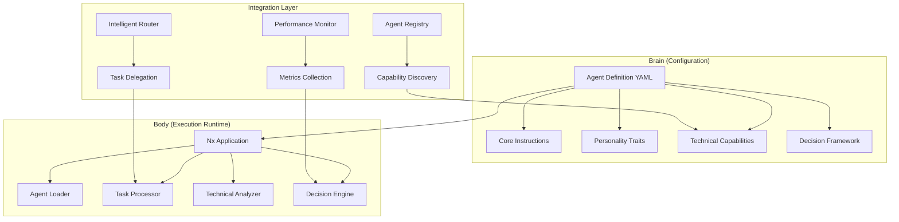
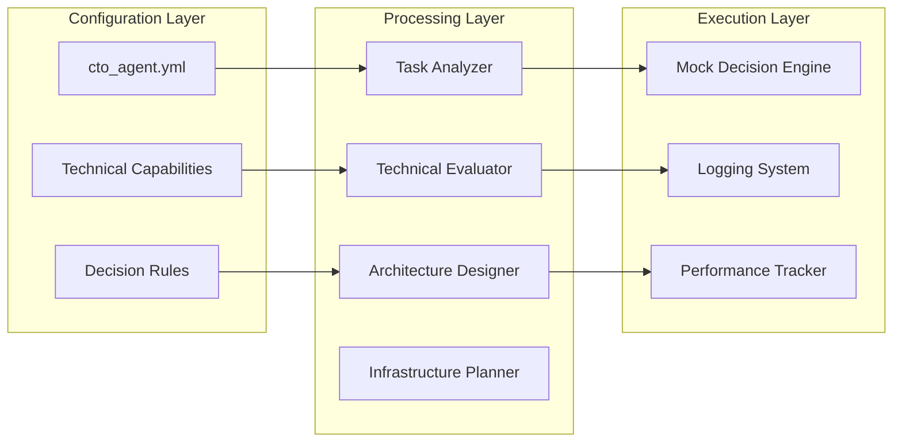
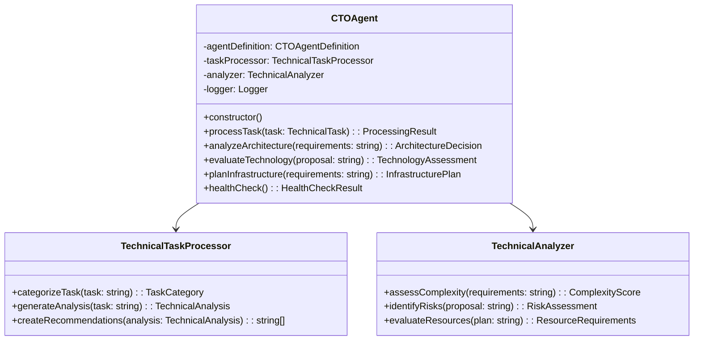
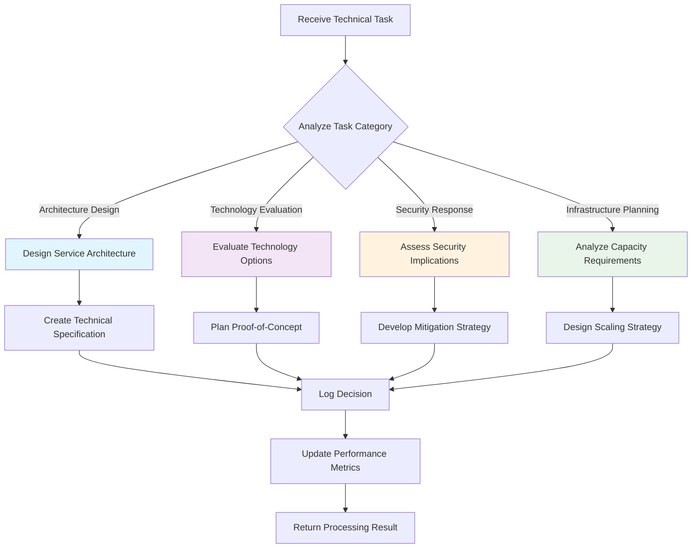
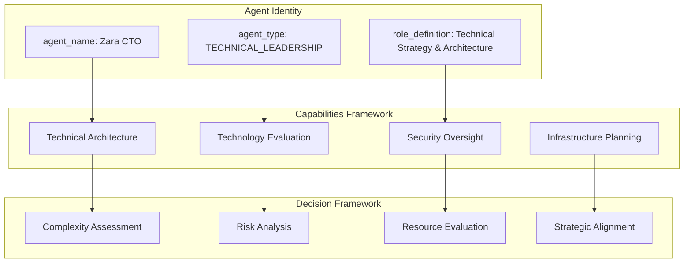
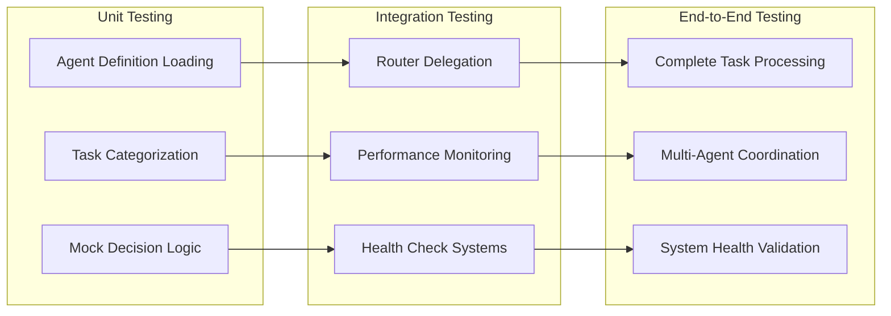

# CTO Agent (Zara) Refactoring Design

## Overview

The CTO Agent (Zara) refactoring implements the unified "brain/body" architecture pattern within the 371 OS ecosystem. This transformation separates the agent's cognitive definition (brain) from its execution runtime (body), enabling centralized prompt management and standardized agent coordination. The refactored agent will serve as a primary technical leadership component for tasks delegated by the intelligent router.

### Design Objectives

- Migrate legacy CTO agent implementation to unified architecture pattern
- Establish centralized brain configuration in prompt library
- Create standardized execution runtime following proven patterns
- Enable seamless integration with intelligent task routing system
- Maintain technical leadership capabilities while improving system coherence

## Architecture

### Agent Architecture Pattern

The CTO Agent follows the established brain/body separation pattern:



### Component Architecture

The CTO Agent consists of three primary architectural layers:



## Agent Definition Structure

### CTO Agent Brain Configuration

The centralized agent definition establishes Zara's identity and capabilities:

| Configuration Element | Description | Implementation |
|----------------------|-------------|----------------|
| **Agent Identity** | Name, type, and role definition | Technical leadership and strategic oversight |
| **Core Instructions** | Primary responsibilities and decision framework | Architecture design, technology evaluation, infrastructure planning |
| **Personality Traits** | Behavioral characteristics and communication style | Technical expertise, strategic thinking, innovation focus |
| **Required Tools** | System capabilities and integration points | Agent registry, technical analysis, infrastructure monitoring |
| **Decision Rules** | Task categorization and processing logic | Architecture, security, scalability, and technology evaluation |

### Technical Capability Matrix

| Capability Domain | Primary Functions | Decision Criteria |
|------------------|-------------------|-------------------|
| **Architecture Design** | System design, service architecture, integration planning | Complexity analysis, scalability requirements, technical debt assessment |
| **Technology Evaluation** | Technology selection, proof-of-concept planning, risk assessment | Innovation potential, ecosystem compatibility, adoption complexity |
| **Security Response** | Vulnerability mitigation, security architecture, compliance oversight | Risk severity, business impact, regulatory requirements |
| **Infrastructure Planning** | Capacity planning, deployment strategy, cost optimization | Performance requirements, scalability projections, budget constraints |

## Technical Implementation

### Agent Runtime Structure

The CTO Agent execution environment follows the established Nx application pattern:



### Task Processing Workflow

The CTO Agent implements a structured approach to technical task processing:



### Mock Implementation Patterns

The initial implementation includes mock decision logic for validation:

| Task Type | Mock Analysis Process | Decision Output |
|-----------|----------------------|----------------|
| **Architecture Design** | System requirements analysis, integration point identification | Technical specification with recommended architecture patterns |
| **Technology Evaluation** | Innovation assessment, ecosystem compatibility analysis | Technology recommendation with implementation roadmap |
| **Security Assessment** | Vulnerability analysis, risk prioritization | Security strategy with mitigation timeline |
| **Infrastructure Planning** | Capacity modeling, cost optimization analysis | Infrastructure blueprint with scaling recommendations |

## Agent Definition Specification

### Core Configuration Elements



### Personality and Communication Style

| Trait Category | Characteristics | Implementation |
|----------------|-----------------|----------------|
| **Technical Expertise** | Deep technical knowledge, architectural thinking | Detailed technical analysis and comprehensive documentation |
| **Strategic Vision** | Long-term technology roadmap, innovation focus | Strategic technology recommendations aligned with business goals |
| **Risk Management** | Security-first approach, compliance awareness | Proactive risk identification and mitigation strategies |
| **Collaboration** | Cross-functional coordination, knowledge sharing | Clear communication with technical and non-technical stakeholders |

### Integration Requirements

The CTO Agent requires integration with multiple system components:

| Integration Point | Purpose | Implementation |
|------------------|---------|----------------|
| **Intelligent Router** | Task reception and delegation | Standard task processing interface |
| **Agent Registry** | Capability advertisement and discovery | Technical capability metadata publication |
| **Performance Monitor** | Metrics collection and health monitoring | Standardized performance reporting |
| **Knowledge Base** | Technical documentation and best practices | Architectural pattern library integration |

## Implementation Strategy

### Development Phases

```mermaid
gantt
    title CTO Agent Refactoring Timeline
    dateFormat  YYYY-MM-DD
    section Phase 1
    Nx Application Setup           :active, setup, 2024-01-01, 1d
    Agent Definition Migration     :after setup, migration, 1d
    section Phase 2
    Core Logic Implementation      :after migration, core, 2d
    Mock Processing Functions      :after core, mock, 1d
    section Phase 3
    Integration Testing           :after mock, testing, 1d
    Documentation Updates         :after testing, docs, 1d
```

### Technical Requirements

| Requirement Category | Specifications | Validation Criteria |
|---------------------|----------------|-------------------|
| **Runtime Environment** | Node.js/TypeScript Nx application | Successful build and execution |
| **Configuration Loading** | YAML agent definition parsing | Correct personality and capability loading |
| **Task Processing** | Mock technical decision simulation | Appropriate logging and decision output |
| **System Integration** | Intelligent router compatibility | Successful task delegation and processing |

### Success Metrics

The refactored CTO Agent must demonstrate:

| Metric Category | Target | Measurement Method |
|----------------|--------|-------------------|
| **Functionality** | Successful task processing with appropriate technical analysis | Mock decision logging and output validation |
| **Integration** | Seamless operation with intelligent router | End-to-end task delegation testing |
| **Performance** | Response time under 500ms for standard tasks | Performance monitoring and logging |
| **Maintainability** | Clear separation of brain and body components | Architecture compliance verification |

## Testing Strategy

### Validation Scenarios

The implementation includes comprehensive testing across multiple dimensions:



### Test Case Matrix

| Test Category | Scenario | Expected Outcome |
|---------------|----------|------------------|
| **Architecture Design** | New service architecture request | Technical specification with recommended patterns |
| **Technology Evaluation** | Technology stack selection task | Evaluation report with implementation recommendations |
| **Security Assessment** | Security vulnerability response | Mitigation strategy with priority timeline |
| **Infrastructure Planning** | Scaling requirements analysis | Infrastructure blueprint with resource requirements |

This design establishes the foundation for transforming the CTO Agent into a unified architecture component while maintaining its technical leadership capabilities and enabling seamless integration with the broader 371 OS agent ecosystem.