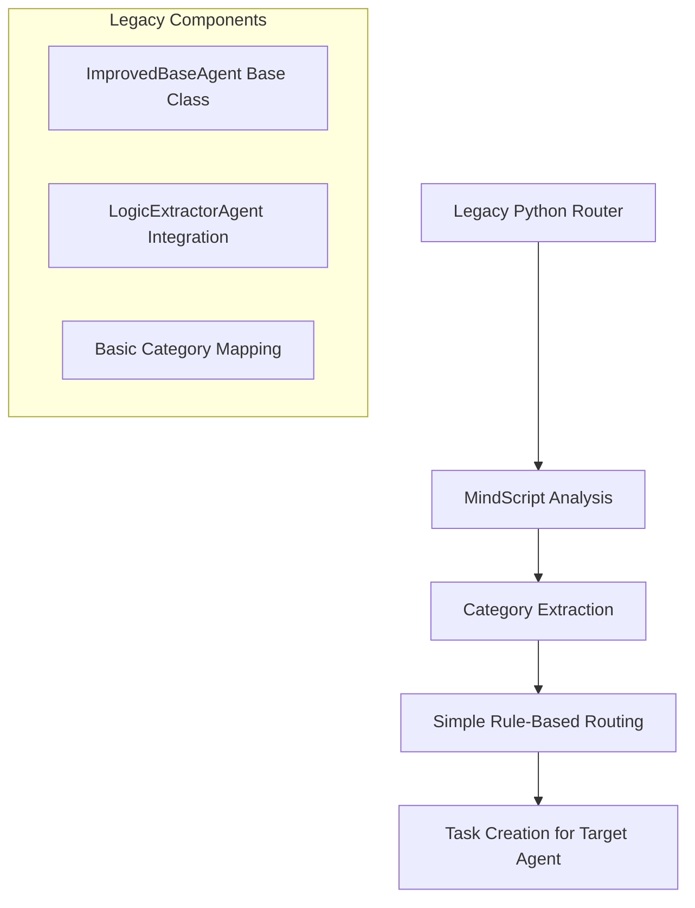
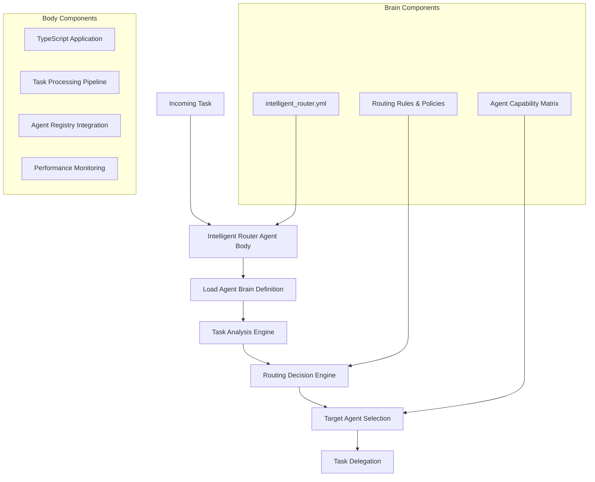
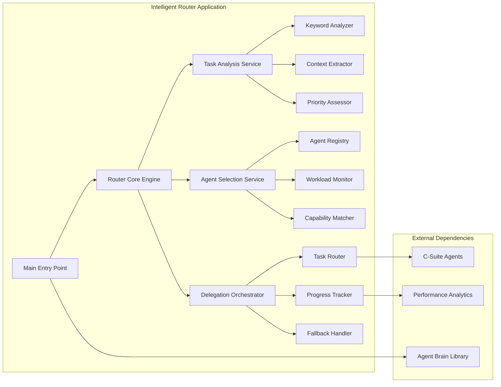
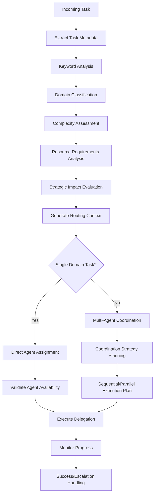
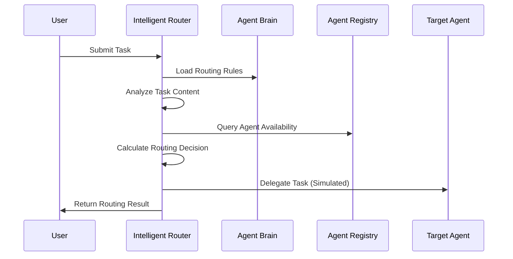
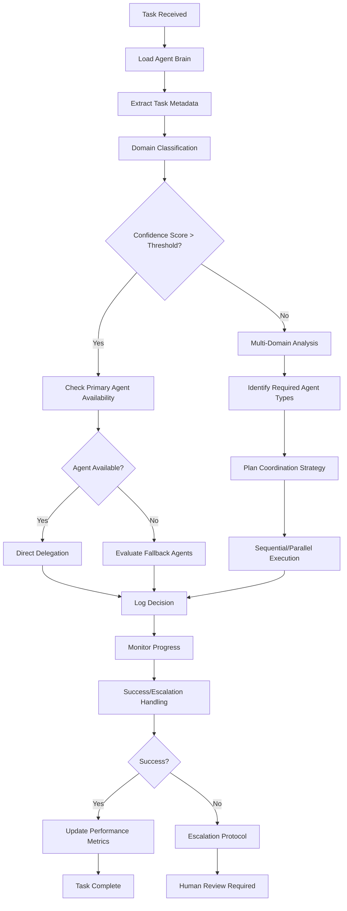

# Intelligent Router Agent Refactoring Design

## Overview

This design outlines the transformation of the legacy Python-based `intelligent_router_agent.py` into a modern TypeScript-based Nx application that conforms to the unified "brain/body" architecture pattern. The refactored Intelligent Router Agent will serve as the central nervous system for task routing within the 371 OS ecosystem, intelligently analyzing incoming tasks and delegating them to appropriate C-Suite agents based on content analysis, workload distribution, and strategic priorities.

## Repository Analysis

Based on the comprehensive repository analysis, this is a **Full-Stack Application** with the following characteristics:

- **Backend Infrastructure**: Node.js/TypeScript applications in Nx workspace structure
- **Agent-Based Architecture**: Unified "brain/body" pattern with centralized prompt definitions
- **Distributed System Components**: Multiple specialized agents with clear separation of concerns
- **Legacy Migration Context**: Python-based components being modernized to TypeScript/Nx architecture

## Architecture

### Current Legacy Architecture

The existing `intelligent_router_agent.py` implements a basic routing mechanism with the following components:



### Target Unified Architecture

The refactored Intelligent Router Agent will implement a sophisticated routing system following the established patterns:



### Component Architecture



## Agent Brain Definition Structure

The `intelligent_router.yml` will define the router's behavioral patterns and routing logic:

| Component | Description | Implementation |
|-----------|-------------|----------------|
| **Role Definition** | Core function as intelligent task router | Task analysis, agent selection, delegation orchestration |
| **Routing Policies** | Decision-making rules for agent selection | Keyword matching, workload balancing, capability assessment |
| **Agent Capability Matrix** | Knowledge of each agent's strengths and domains | Financial, technical, marketing, community, strategic domains |
| **Escalation Rules** | Criteria for human intervention or complex routing | Multi-domain tasks, resource conflicts, uncertainty thresholds |
| **Performance Metrics** | Success criteria and monitoring parameters | Routing accuracy, response time, delegation success rate |

## Routing Engine Logic

### Task Analysis Pipeline

The router will implement a sophisticated analysis pipeline:



### Agent Selection Matrix

| Domain | Primary Keywords | Primary Agent | Fallback Agents | Confidence Threshold |
|--------|-----------------|---------------|-----------------|---------------------|
| **Financial** | financial, budget, quarterly, revenue, cost, investment, roi, funding | CFO Cash | Financial Analyst, Budget Coordinator | 0.8 |
| **Technical** | feature, application, security, infrastructure, development, architecture, technical, engineering | CTO Alex | Technical Lead, Security Officer | 0.8 |
| **Marketing** | marketing, campaign, brand, promotion, advertising, growth, customer, engagement | CMO Anova | Marketing Specialist, Brand Manager | 0.8 |
| **Community** | community, outreach, stakeholder, governance, social, relationship, partnership | CCO Sage | Community Manager, Stakeholder Relations | 0.8 |
| **Strategic** | strategic, planning, vision, roadmap, executive, leadership, decision | CEO Mimi | Strategic Advisor, Executive Assistant | 0.9 |

### Routing Decision Algorithm

The router will implement a multi-factor decision algorithm:

1. **Domain Confidence Scoring**: Calculate confidence scores for each potential domain
2. **Agent Availability Assessment**: Check current workload and availability status
3. **Performance History Analysis**: Consider past success rates for similar tasks
4. **Resource Constraint Evaluation**: Assess computational and time requirements
5. **Strategic Priority Alignment**: Ensure routing supports organizational objectives

## Mock Routing Implementation

The initial implementation will provide simulated routing logic:



### Simulation Scenarios

| Test Scenario | Input Task | Expected Routing Decision | Confidence Score |
|---------------|------------|--------------------------|------------------|
| **Financial Analysis** | "Analyze Q3 financial report for profitability issues" | CFO Cash | 0.95 |
| **Technical Feature** | "Implement new authentication system with security protocols" | CTO Alex | 0.92 |
| **Marketing Campaign** | "Launch social media campaign for product release" | CMO Anova | 0.88 |
| **Community Engagement** | "Organize stakeholder meeting for governance proposal" | CCO Sage | 0.91 |
| **Strategic Planning** | "Develop 5-year organizational roadmap" | CEO Mimi | 0.94 |
| **Multi-Domain Task** | "Launch new product with technical, marketing, and financial coordination" | Multi-Agent Coordination | 0.85 |

## Implementation Architecture

### Application Structure

```
apps/intelligent-router/
├── src/
│   ├── main.ts                    # Application entry point
│   ├── router-engine.ts           # Core routing logic
│   ├── task-analyzer.ts           # Task analysis service
│   ├── agent-selector.ts          # Agent selection logic
│   ├── delegation-orchestrator.ts # Task delegation management
│   ├── performance-monitor.ts     # Monitoring and analytics
│   └── types.ts                   # Type definitions
├── README.md                      # Application documentation
├── package.json                   # Dependencies and scripts
├── project.json                   # Nx project configuration
└── tsconfig.json                  # TypeScript configuration
```

### Core Components

| Component | Responsibility | Key Methods |
|-----------|---------------|-------------|
| **RouterEngine** | Main orchestration logic | `routeTask()`, `analyzeAndDelegate()`, `handleEscalation()` |
| **TaskAnalyzer** | Task content analysis | `extractKeywords()`, `classifyDomain()`, `assessComplexity()` |
| **AgentSelector** | Agent selection logic | `selectPrimaryAgent()`, `evaluateAlternatives()`, `checkAvailability()` |
| **DelegationOrchestrator** | Task delegation management | `delegateToAgent()`, `coordinateMultiAgent()`, `trackProgress()` |
| **PerformanceMonitor** | Metrics and monitoring | `recordDecision()`, `trackSuccess()`, `generateAnalytics()` |

### Type System

The application will implement comprehensive TypeScript types for type safety and maintainability:

```typescript
interface IntelligentRouterDefinition {
  agent_name: string;
  agent_type: string;
  core_instructions: string;
  routing_policies: RoutingPolicySet;
  agent_capability_matrix: AgentCapabilityMatrix;
  escalation_rules: EscalationRuleSet;
  performance_targets: PerformanceTargets;
}

interface RoutingTask {
  id: string;
  title: string;
  description: string;
  priority: TaskPriority;
  domain_hints?: string[];
  resource_requirements?: ResourceRequirement[];
  deadline?: Date;
  strategic_importance: boolean;
}

interface RoutingDecision {
  success: boolean;
  primary_agent: string;
  confidence_score: number;
  routing_rationale: string;
  alternative_agents?: string[];
  coordination_required: boolean;
  estimated_completion_time: number;
}
```

## Task Delegation Workflow

The router will implement a comprehensive delegation workflow:



## Integration Points

### Agent Registry Integration

The router will integrate with the existing agent ecosystem:

| Integration Point | Purpose | Implementation |
|------------------|---------|----------------|
| **Agent Discovery** | Locate available agents | Query agent registry for active agents |
| **Capability Assessment** | Understand agent strengths | Maintain capability matrix in brain definition |
| **Workload Monitoring** | Balance task distribution | Track current agent workloads and performance |
| **Performance Feedback** | Improve routing decisions | Collect success metrics for learning |

### Performance Analytics

The router will provide comprehensive analytics:

- **Routing Accuracy**: Percentage of successful delegations
- **Response Time**: Average time from task receipt to delegation
- **Agent Utilization**: Workload distribution across agents
- **Escalation Rate**: Frequency of human intervention requirements
- **Decision Confidence**: Average confidence scores for routing decisions

## Testing Strategy

### Unit Testing

Each component will have comprehensive unit tests:

- **TaskAnalyzer**: Test keyword extraction, domain classification, complexity assessment
- **AgentSelector**: Test selection logic, availability checking, fallback mechanisms
- **RouterEngine**: Test end-to-end routing workflow and decision logic
- **PerformanceMonitor**: Test metrics collection and analytics generation

### Integration Testing

System-level integration tests will validate:

- **Agent Registry Integration**: Verify proper agent discovery and querying
- **Multi-Component Workflow**: Test complete routing pipeline
- **Error Handling**: Validate graceful failure and escalation scenarios
- **Performance Benchmarks**: Ensure response time and accuracy targets

### Simulation Testing

Mock routing scenarios will validate decision logic:

- **Single-Domain Tasks**: Test straightforward routing decisions
- **Multi-Domain Tasks**: Validate coordination planning
- **Edge Cases**: Test uncertainty handling and escalation triggers
- **Load Testing**: Verify performance under high task volumes