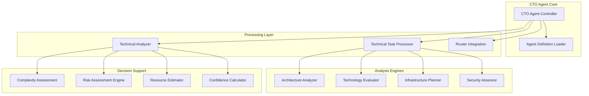
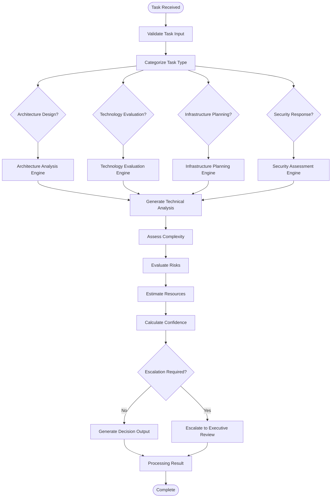
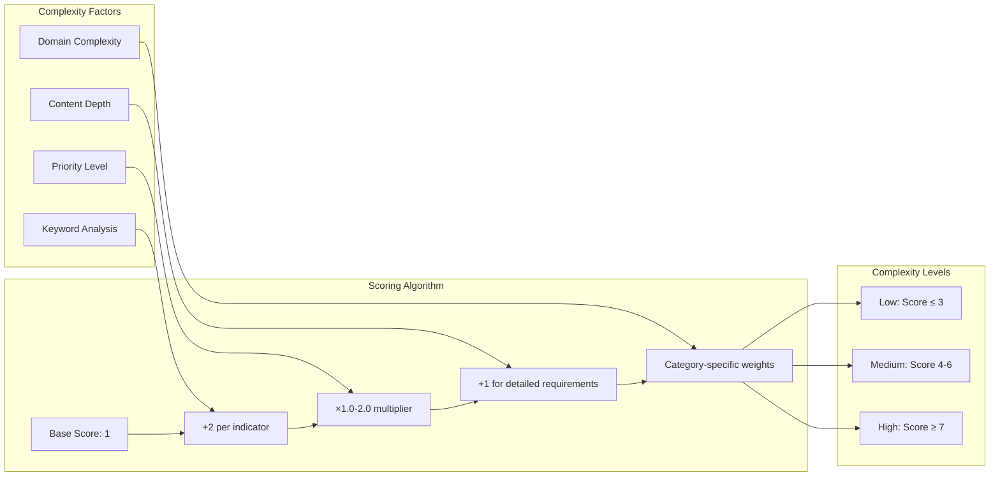
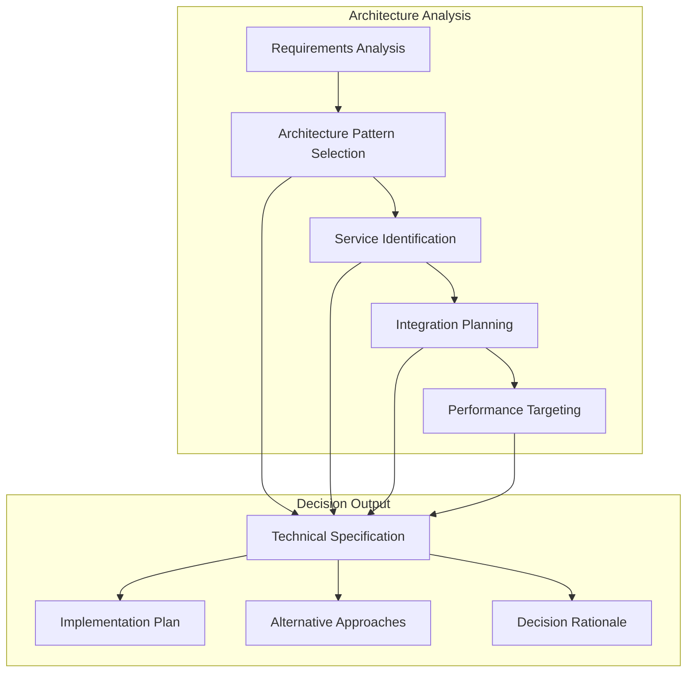
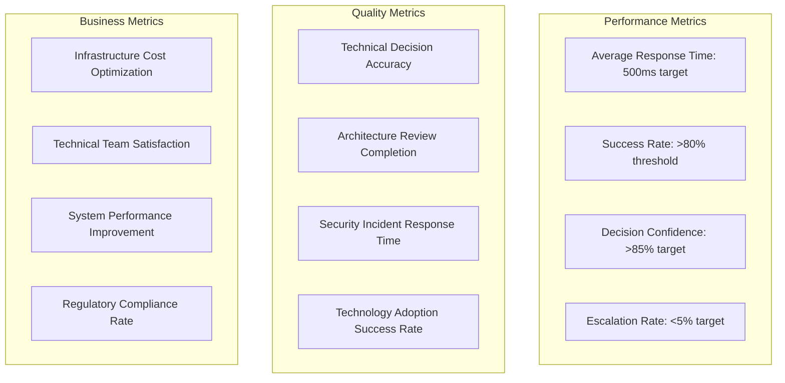
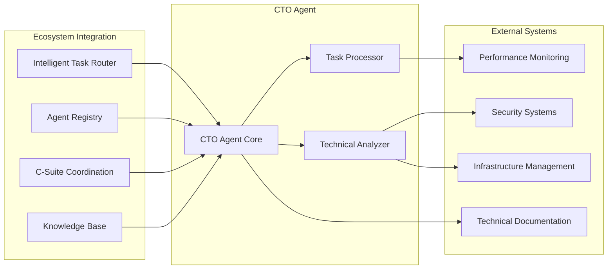
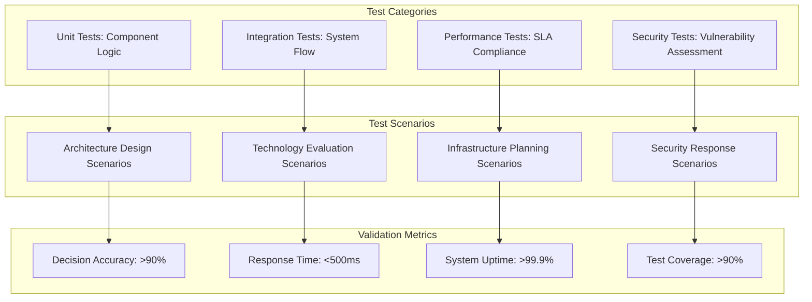

# CTO Agent Technical Task Processor and Analyzer

## Overview

The CTO Agent (Zara) Technical Task Processor and Analyzer is a sophisticated system designed to provide strategic technical leadership for the 371 DAO ecosystem. This system enables the CTO Agent to analyze complex technical requirements, evaluate technology options, design system architectures, and plan infrastructure scaling with high confidence and precision.

The system operates as the primary technical decision-making engine, transforming abstract technical requirements into concrete, actionable strategies that align with business objectives while maintaining security, scalability, and cost optimization principles.

## Architecture

### Component Architecture

The CTO Agent system follows a modular, event-driven architecture with three core processing components:

### Technical Task Processing Flow

The system processes technical tasks through a sophisticated analysis pipeline:

### Agent Definition Loading

The system loads the CTO Agent's "brain" definition from the centralized prompt library:

| Component | Purpose | Implementation |
|-----------|---------|----------------|
| **Agent Definition Path** | Centralized configuration source | `libs/prompts/agent-definitions/zara_cto.yml` |
| **YAML Parser** | Configuration interpretation | YAML parsing with validation |
| **Personality Traits** | Decision-making characteristics | Technical expertise, strategic vision, security-first approach |
| **Required Tools** | Capability specification | Architecture analyzer, technology registry, security scanner |
| **Technical Domains** | Specialization areas | Architecture, technology evaluation, security, infrastructure |

## Task Analysis Component

### Categorization Engine

The task categorization system uses sophisticated keyword analysis and semantic evaluation:

| Category | Keywords | Complexity Indicators | Decision Factors |
|----------|----------|----------------------|------------------|
| **Architecture Design** | architecture, microservices, api, integration, system design, scalability, distributed systems | high throughput, multi-region, real-time, complex workflows | performance requirements, scalability needs, maintenance complexity |
| **Technology Evaluation** | technology, framework, library, platform, tool, evaluation, proof-of-concept, migration | multiple systems, legacy integration, vendor lock-in | ecosystem maturity, community support, learning curve |
| **Security Response** | security, vulnerability, threat, compliance, encryption, authentication, audit | critical severity, data breach, regulatory impact | business impact, data sensitivity, exploit likelihood |
| **Infrastructure Planning** | infrastructure, scaling, capacity, performance, deployment, monitoring, availability | high availability, disaster recovery, global distribution | growth projections, performance targets, cost constraints |

### Complexity Assessment Framework

The system evaluates task complexity through multi-dimensional analysis:

### Risk Assessment Engine

The risk assessment system identifies and quantifies potential risks:

| Risk Type | Assessment Criteria | Impact Levels | Mitigation Strategies |
|-----------|-------------------|---------------|----------------------|
| **Technical Risk** | Technology maturity, integration complexity, technical debt | Low, Medium, High, Critical | Proof-of-concept validation, phased implementation |
| **Security Risk** | Vulnerability exposure, compliance impact, data sensitivity | Low, Medium, High, Critical | Security reviews, penetration testing, compliance audits |
| **Operational Risk** | Service disruption, capacity planning, resource availability | Low, Medium, High, Critical | Blue-green deployment, capacity buffers, monitoring |
| **Strategic Risk** | Business alignment, competitive impact, opportunity cost | Low, Medium, High, Critical | Executive consultation, strategic reviews |

## Task Processing Component

### Architecture Decision Engine

The architecture decision engine generates comprehensive technical specifications:

### Technology Evaluation Matrix

The technology evaluation system provides structured assessment:

| Evaluation Dimension | Scoring Range | Weight Factor | Decision Impact |
|----------------------|---------------|---------------|-----------------|
| **Technology Maturity** | Emerging, Proven, Legacy | High | Adoption risk assessment |
| **Ecosystem Support** | 1-10 scale | High | Long-term viability |
| **Learning Curve** | Low, Medium, High | Medium | Implementation timeline |
| **Integration Complexity** | Low, Medium, High | High | Development effort |
| **Long-term Viability** | 1-10 scale | High | Strategic alignment |
| **Total Cost of Ownership** | Monetary analysis | High | Budget impact |

### Infrastructure Planning Framework

The infrastructure planning system designs scalable, cost-optimized solutions:

| Planning Component | Assessment Areas | Output Specifications | Optimization Targets |
|-------------------|------------------|----------------------|---------------------|
| **Performance Requirements** | CPU utilization, memory usage, disk I/O, network throughput | Detailed performance targets with measurement criteria | Resource efficiency maximization |
| **Availability Targets** | Uptime requirements, recovery objectives, redundancy needs | SLA definitions with RTO/RPO specifications | Business continuity assurance |
| **Security Architecture** | Access control, encryption, monitoring, compliance | Comprehensive security plan with verification methods | Zero-trust implementation |
| **Scaling Strategy** | Growth projections, capacity triggers, automation rules | Dynamic scaling configuration with cost controls | Cost optimization with performance |

## Agent Capabilities & Performance

### Technical Decision Capabilities

The CTO Agent provides comprehensive technical leadership across multiple domains:

| Capability Area | Specific Functions | Performance Targets | Quality Metrics |
|----------------|-------------------|-------------------|-----------------|
| **Architecture Design** | System design, service definition, integration planning | 24-hour SLA for architecture reviews | Decision accuracy > 90% |
| **Technology Assessment** | Evaluation, recommendation, adoption planning | 5-day SLA for technology evaluations | Adoption success rate > 85% |
| **Security Response** | Vulnerability assessment, incident coordination, compliance | 4-hour SLA for security responses | Risk mitigation effectiveness > 95% |
| **Infrastructure Planning** | Capacity modeling, scaling strategy, cost optimization | Real-time infrastructure analysis | Cost optimization targets 30%+ savings |

### Performance Monitoring

The system tracks comprehensive performance metrics:

### Health Check System

The agent implements comprehensive health monitoring:

| Health Check Component | Validation Criteria | Status Indicators | Recovery Actions |
|------------------------|-------------------|-------------------|------------------|
| **Agent Definition** | Configuration loaded, parsing successful | Operational, degraded, failed | Reload configuration, validate syntax |
| **Task Processor** | Processing capability, validation successful | Operational, degraded, failed | Restart processor, clear cache |
| **Technical Analyzer** | Analysis engines operational, confidence adequate | Operational, degraded, failed | Recalibrate engines, update models |
| **Performance Metrics** | Success rate threshold, response time targets | Healthy, degraded, unhealthy | Performance tuning, resource scaling |

## Integration Architecture

### Intelligent Router Integration

The CTO Agent integrates seamlessly with the 371 OS ecosystem:

### Data Flow Architecture

The system processes technical tasks through a well-defined data pipeline:

| Stage | Input Data | Processing | Output Data | Integration Points |
|-------|------------|------------|-------------|-------------------|
| **Task Reception** | Technical task specification | Validation, categorization | Validated task object | Intelligent Router, Agent Registry |
| **Analysis Generation** | Task requirements, context | Complexity, risk, resource assessment | Technical analysis report | Knowledge Base, Performance Monitor |
| **Decision Processing** | Analysis results, agent definition | Architecture/technology/infrastructure decision | Structured decision output | Documentation System, Coordination API |
| **Result Delivery** | Processing results, metadata | Formatting, escalation logic | Final recommendation | Executive Dashboard, Implementation Teams |

## Testing Strategy

### Component Testing

The system implements comprehensive testing at multiple levels:

| Testing Level | Components Tested | Test Coverage | Validation Criteria |
|---------------|------------------|---------------|-------------------|
| **Unit Testing** | Individual processors, analyzers, engines | >90% code coverage | All public methods tested |
| **Integration Testing** | Component interactions, data flow | End-to-end scenarios | Real-world task processing |
| **Performance Testing** | Response times, throughput, scalability | Load and stress testing | SLA compliance validation |
| **Security Testing** | Input validation, authorization, data protection | Security scan coverage | Vulnerability assessment |

### Validation Framework

The testing framework ensures system reliability and accuracy:

### Demo Task Processing

The system demonstrates capabilities through comprehensive task processing:

| Demo Scenario | Task Description | Expected Output | Success Criteria |
|---------------|------------------|-----------------|------------------|
| **Architecture Design** | "Design scalable microservices architecture for real-time processing" | Complete architecture specification with implementation plan | Pattern selection, service definition, integration plan |
| **Technology Evaluation** | "Evaluate React vs Vue for frontend development" | Structured recommendation with rationale | Comprehensive assessment, clear decision, implementation roadmap |
| **Infrastructure Planning** | "Plan infrastructure for 10x user growth" | Scaling strategy with cost optimization | Performance targets, scaling triggers, cost projections |
| **Security Response** | "Critical vulnerability in authentication system" | Immediate response plan with mitigation steps | Risk assessment, containment strategy, remediation timeline |

This comprehensive design establishes the CTO Agent as a powerful technical decision-making system capable of providing strategic leadership across all technical domains while maintaining high performance, security, and cost optimization standards.