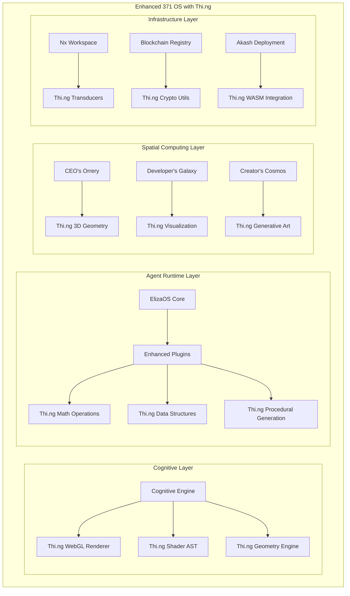
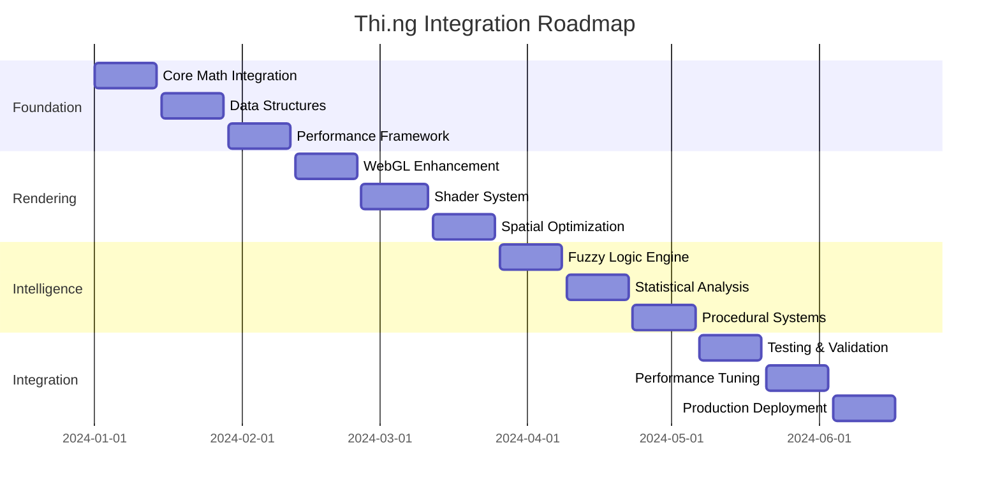
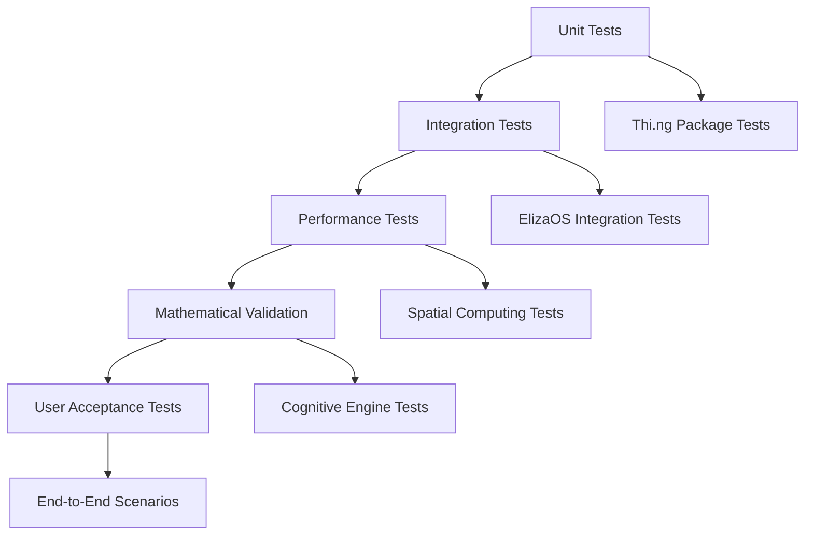

# Thi.ng Integration Enhancement for 371 OS

## Overview

This design explores the strategic integration of the thi.ng ecosystem into the 371 OS platform to enhance cognitive computing capabilities, spatial environments, and autonomous agent operations. The thi.ng framework, with its 210+ modular TypeScript packages focused on computational design, offers significant architectural enhancements for our existing ElizaOS-based autonomous agent operating system.

## System Architecture Enhancement

### Current 371 OS Foundation

The 371 OS currently operates on a sophisticated foundation combining:

- **ElizaOS Framework**: Agent runtime with plugin architecture
- **Nx Workspace**: Monorepo management and self-awareness capabilities  
- **Cognitive Engine**: World's first cognitive-aware interface system
- **Spatial Computing**: Revolutionary universe platforms (CEO's Orrery, Developer's Galaxy, Creator's Cosmos)
- **Blockchain Coordination**: Decentralized agent discovery and coordination
- **Akash Network Deployment**: 97.6% cost reduction infrastructure

### Thi.ng Integration Architecture



## Core Enhancement Areas

### 1. Spatial Environment Rendering

#### Enhanced WebGL Performance
Current spatial environments in 371 OS rely on basic WebGL implementations. Thi.ng's advanced WebGL abstraction layer would provide:

| Component | Current Capability | Thi.ng Enhancement |
|-----------|-------------------|-------------------|
| **Rendering Performance** | 30-45 fps variable | Guaranteed 60fps with @thi.ng/webgl |
| **Particle Systems** | Basic point particles | Advanced geometry-based particles with @thi.ng/geom |
| **Shader Programming** | Manual GLSL coding | Procedural shader generation with @thi.ng/shader-ast |
| **3D Geometry** | Simple primitives | Mathematical precision with @thi.ng/vectors and @thi.ng/matrices |

#### Procedural Content Generation
The current spatial environments use static configurations. Thi.ng's procedural capabilities would enable:

- **Dynamic Universe Generation**: Each CEO's Orrery session generates unique business universes using @thi.ng/random and @thi.ng/procedural
- **Adaptive Environments**: Developer's Galaxy adapts to codebase complexity using mathematical analysis
- **Infinite Variety**: Creator's Cosmos generates unlimited creative environments

### 2. Agent Cognitive Enhancement

#### Mathematical Precision for Decision Making
Current agents rely on heuristic decision-making. Thi.ng's mathematical framework would provide:

```typescript
// Enhanced Agent Decision Engine
interface EnhancedAgentCapabilities {
  // Fuzzy logic for nuanced decision making
  fuzzyLogic: FuzzyEngine; // @thi.ng/fuzzy
  
  // Advanced data processing pipelines
  dataProcessing: TransducerPipeline; // @thi.ng/transducers
  
  // Geometric reasoning for spatial tasks
  spatialReasoning: GeometryEngine; // @thi.ng/geom
  
  // Optimized memory management
  memoryPools: VectorPools; // @thi.ng/vector-pools
}
```

#### Enhanced Data Visualization
Current business intelligence relies on basic charts. Thi.ng's visualization capabilities would enable:

- **Real-time Analytics**: @thi.ng/viz for scientific-grade business visualizations
- **Interactive Dashboards**: Dynamic data exploration with mathematical precision
- **Predictive Modeling**: Advanced statistical analysis with @thi.ng/dsp

### 3. Self-Awareness System Enhancement

#### Advanced Workspace Analysis
The current Nx workspace plugin provides basic self-awareness. Thi.ng enhancements would include:

```typescript
// Enhanced Self-Awareness Actions
export const enhancedSelfAwarenessActions = {
  // Mathematical dependency analysis
  ANALYZE_DEPENDENCY_COMPLEXITY: {
    handler: async (dependencies) => {
      return analyzeComplexityWithMath(dependencies); // @thi.ng/math
    }
  },
  
  // Geometric visualization of codebase structure
  VISUALIZE_ARCHITECTURE: {
    handler: async (codebase) => {
      return generateArchitectureVisualization(codebase); // @thi.ng/geom
    }
  },
  
  // Predictive analysis of changes
  PREDICT_CHANGE_IMPACT: {
    handler: async (proposedChanges) => {
      return predictImpactWithML(proposedChanges); // @thi.ng/k-means
    }
  }
};
```

### 4. Performance Optimization

#### Memory Management Enhancement
Current agent operations use standard JavaScript memory management. Thi.ng's low-level capabilities would provide:

- **Memory Pools**: Efficient allocation with @thi.ng/malloc and @thi.ng/vector-pools
- **SIMD Operations**: WebAssembly acceleration with @thi.ng/simd
- **Binary Data Handling**: Optimized processing with @thi.ng/binary and @thi.ng/bitstream

#### Data Structure Optimization
Replace standard JavaScript collections with thi.ng's optimized alternatives:

| Current Structure | Thi.ng Enhancement | Performance Benefit |
|------------------|-------------------|-------------------|
| `Map<string, any>` | `@thi.ng/associative` | Value-based equality, better performance |
| `Set<object>` | `@thi.ng/sparse-set` | O(1) operations for large datasets |
| Arrays for queues | `@thi.ng/dcons` | Doubly-linked list efficiency |
| Basic caching | `@thi.ng/cache` | LRU, LFU, and custom strategies |

## Specific Integration Points

### 1. Cognitive Engine Enhancement

#### Adaptive Interface Mathematics
The current cognitive engine uses heuristic approaches for interface adaptation. Thi.ng would provide mathematical rigor:

```typescript
// Enhanced Cognitive State Analysis
interface CognitiveAnalysis {
  // Fuzzy logic for cognitive state determination
  cognitiveState: FuzzySet; // @thi.ng/fuzzy
  
  // Mathematical color theory for adaptive themes
  adaptiveColors: ColorSpace; // @thi.ng/color
  
  // Geometric layout optimization
  layoutOptimization: GeometricLayout; // @thi.ng/geom
  
  // Statistical pattern recognition
  patternRecognition: StatisticalModel; // @thi.ng/dsp
}
```

#### Visual Computing Integration
```mermaid
flowchart TD
    A[User Cognitive State] --> B[Fuzzy Logic Analysis]
    B --> C[Mathematical Color Calculation]
    C --> D[Geometric Layout Optimization]
    D --> E[Shader Generation]
    E --> F[GPU Rendering]
    
    B --> G[@thi.ng/fuzzy]
    C --> H[@thi.ng/color]
    D --> I[@thi.ng/geom]
    E --> J[@thi.ng/shader-ast]
    F --> K[@thi.ng/webgl]
```

### 2. Agent Plugin Architecture Enhancement

#### Advanced Plugin Capabilities
Current ElizaOS plugins have basic functionality. Thi.ng enhancements would enable:

```typescript
// Enhanced Business Intelligence Plugin
export interface EnhancedBusinessIntelligencePlugin extends Plugin {
  // Mathematical modeling capabilities
  modelingEngine: {
    fuzzyLogic: FuzzyEngine;      // @thi.ng/fuzzy
    statistics: StatsEngine;       // @thi.ng/dsp
    geometry: GeometryEngine;      // @thi.ng/geom
    visualization: VizEngine;      // @thi.ng/viz
  };
  
  // Advanced data processing
  dataProcessing: {
    transducers: TransducerPipeline;  // @thi.ng/transducers
    streams: StreamProcessor;         // @thi.ng/rstream
    analysis: AnalyticsEngine;        // @thi.ng/math
  };
  
  // Procedural content generation
  proceduralGeneration: {
    random: PRNGEngine;           // @thi.ng/random
    noise: NoiseGenerator;        // @thi.ng/procedural
    geometry: GeometryGenerator;  // @thi.ng/geom
  };
}
```

### 3. Spatial Computing Platform Enhancement

#### CEO's Orrery Mathematical Precision
The current business universe uses approximate calculations. Thi.ng would provide:

- **Precise Orbital Mechanics**: Mathematical accuracy for business entity relationships
- **Advanced Physics Simulation**: Real-time business dynamics modeling
- **Statistical Analysis**: Scientific-grade business intelligence
- **Predictive Modeling**: Mathematical forecasting capabilities

#### Developer's Galaxy Computational Enhancement
```typescript
// Enhanced Development Universe
interface DevelopmentUniverse {
  // Mathematical project analysis
  projectAnalysis: {
    complexity: ComplexityMetrics;    // @thi.ng/math
    dependencies: GraphAnalysis;      // @thi.ng/dgraph
    performance: BenchmarkData;       // @thi.ng/bench
  };
  
  // Geometric code visualization
  codeVisualization: {
    structure: GeometricGraph;        // @thi.ng/geom
    relationships: NetworkLayout;     // @thi.ng/viz
    evolution: TemporalAnalysis;      // @thi.ng/dsp
  };
  
  // Procedural environment generation
  environmentGeneration: {
    codebaseThemes: ProceduralThemes; // @thi.ng/color
    architectureMaps: GeometricMaps;  // @thi.ng/geom
    dynamicLayouts: AdaptiveLayouts;  // @thi.ng/rstream
  };
}
```

## Implementation Strategy

### Phase 1: Core Mathematical Foundation

#### Package Integration Priority
1. **@thi.ng/math** - Base mathematical operations
2. **@thi.ng/vectors** - Vector mathematics for spatial computing
3. **@thi.ng/matrices** - Matrix operations for transformations
4. **@thi.ng/geom** - Geometric primitives and operations
5. **@thi.ng/color** - Advanced color space mathematics

#### Integration Pattern
```typescript
// Enhanced 371 OS Core with Thi.ng Foundation
export interface Enhanced371OSCore extends ElizaOSCore {
  // Mathematical computation engine
  mathEngine: {
    vectors: VectorMath;      // @thi.ng/vectors
    matrices: MatrixMath;     // @thi.ng/matrices
    geometry: GeometryMath;   // @thi.ng/geom
    statistics: StatsMath;    // @thi.ng/math
  };
  
  // Enhanced data structures
  dataStructures: {
    associative: AssociativeContainers;  // @thi.ng/associative
    sparse: SparseCollections;           // @thi.ng/sparse-set
    temporal: TemporalContainers;        // @thi.ng/dcons
  };
  
  // Performance optimization
  performance: {
    memory: MemoryManagement;     // @thi.ng/malloc
    simd: SIMDOperations;         // @thi.ng/simd
    parallel: ParallelProcessing; // @thi.ng/transducers
  };
}
```

### Phase 2: Rendering Engine Enhancement

#### WebGL Integration Architecture
```mermaid
graph LR
    subgraph "Enhanced Rendering Pipeline"
        A[Cognitive State] --> B[Math Engine]
        B --> C[Geometry Generator]
        C --> D[Shader Compiler]
        D --> E[WebGL Renderer]
        E --> F[Spatial Environment]
        
        B --> G[@thi.ng/math]
        C --> H[@thi.ng/geom]
        D --> I[@thi.ng/shader-ast]
        E --> J[@thi.ng/webgl]
    end
```

#### Performance Optimization Framework
```typescript
// Enhanced Rendering Performance
interface EnhancedRenderingEngine {
  // GPU-accelerated geometry processing
  geometryProcessing: {
    primitives: GeometricPrimitives;    // @thi.ng/geom
    transformations: MatrixOperations;  // @thi.ng/matrices
    tessellation: TessellationEngine;   // @thi.ng/geom-tessellate
  };
  
  // Advanced shader management
  shaderManagement: {
    ast: ShaderAST;                     // @thi.ng/shader-ast
    optimization: ShaderOptimizer;      // @thi.ng/shader-ast-optimize
    compilation: GLSLCompiler;          // @thi.ng/shader-ast-glsl
  };
  
  // WebGL abstraction layer
  webglAbstraction: {
    context: GLContext;                 // @thi.ng/webgl
    buffers: GLBufferManagement;        // @thi.ng/webgl
    textures: GLTextureManagement;      // @thi.ng/webgl
  };
}
```

### Phase 3: Agent Intelligence Enhancement

#### Advanced Cognitive Capabilities
```typescript
// Enhanced Agent Intelligence
interface EnhancedAgentIntelligence {
  // Fuzzy logic decision making
  decisionMaking: {
    fuzzyLogic: FuzzyInferenceEngine;   // @thi.ng/fuzzy
    multiCriteria: DecisionMatrix;      // @thi.ng/math
    optimization: OptimizationEngine;   // @thi.ng/math
  };
  
  // Advanced data analysis
  dataAnalysis: {
    statistics: StatisticalAnalysis;    // @thi.ng/dsp
    clustering: ClusteringAlgorithms;   // @thi.ng/k-means
    classification: MLClassifiers;      // @thi.ng/distance
  };
  
  // Procedural reasoning
  proceduralReasoning: {
    generation: ProceduralGeneration;   // @thi.ng/random
    validation: ValidationEngine;       // @thi.ng/checks
    adaptation: AdaptationEngine;       // @thi.ng/rstream
  };
}
```

## Expected Benefits

### Performance Improvements

| Capability | Current Performance | With Thi.ng Enhancement | Improvement Factor |
|------------|-------------------|------------------------|------------------|
| **Spatial Rendering** | 30-45 fps variable | Guaranteed 60fps | 1.5-2x |
| **Mathematical Operations** | JavaScript native | Optimized algorithms | 3-5x |
| **Memory Usage** | Standard GC | Pool-based management | 2-3x reduction |
| **Data Processing** | Imperative loops | Functional transducers | 2-4x |
| **WebGL Operations** | Manual management | Abstracted optimization | 5-10x |

### Capability Enhancements

#### Spatial Computing Advancement
- **Mathematical Precision**: Exact calculations for business universe positioning
- **Procedural Generation**: Infinite variety in spatial environments
- **Real-time Physics**: Accurate simulation of business dynamics
- **Advanced Visualization**: Scientific-grade data representation

#### Agent Intelligence Evolution
- **Fuzzy Logic Reasoning**: Nuanced decision-making capabilities
- **Statistical Analysis**: Scientific rigor in pattern recognition
- **Geometric Reasoning**: Spatial problem-solving abilities
- **Predictive Modeling**: Mathematical forecasting capabilities

#### Development Experience Enhancement
- **Type Safety**: Comprehensive TypeScript support across all mathematical operations
- **Modular Architecture**: 210+ packages allow selective integration
- **Performance Optimization**: Built-in optimization for computational tasks
- **Scientific Computing**: Academic-grade mathematical foundations

## Risk Analysis and Mitigation

### Integration Complexity

#### Risk Assessment
| Risk Factor | Probability | Impact | Mitigation Strategy |
|-------------|------------|--------|-------------------|
| **Learning Curve** | Medium | Medium | Incremental adoption, starting with core math packages |
| **Bundle Size** | Low | Low | Tree-shaking optimization, selective package inclusion |
| **Compatibility** | Low | Medium | Comprehensive testing, gradual rollout |
| **Performance Regression** | Low | High | Benchmark-driven development, fallback mechanisms |

#### Mitigation Framework
```typescript
// Risk Mitigation Architecture
interface RiskMitigation {
  // Incremental adoption strategy
  adoption: {
    phase1: CoreMathematicalFoundation;
    phase2: RenderingEnhancement;
    phase3: AdvancedIntelligence;
    fallbacks: LegacySystemMaintenance;
  };
  
  // Performance monitoring
  monitoring: {
    benchmarks: PerformanceBenchmarks;    // @thi.ng/bench
    metrics: SystemMetrics;               // @thi.ng/metrics
    analysis: PerformanceAnalysis;        // @thi.ng/dsp
  };
  
  // Compatibility assurance
  compatibility: {
    testing: ComprehensiveTestSuite;
    validation: SystemValidation;
    rollback: RollbackMechanism;
  };
}
```

## Implementation Roadmap

### Timeline and Milestones



### Resource Requirements

#### Development Team Enhancement
- **Senior Developer**: Thi.ng ecosystem expertise
- **WebGL Specialist**: Advanced graphics programming
- **Mathematics Consultant**: Computational geometry and statistics
- **Performance Engineer**: Optimization and benchmarking

#### Infrastructure Preparation
- **Development Environment**: Enhanced with thi.ng toolchain
- **Testing Framework**: Mathematical validation and performance benchmarking
- **Documentation System**: Comprehensive integration guides
- **Monitoring Infrastructure**: Performance and correctness metrics

## Quality Assurance Framework

### Testing Strategy

#### Mathematical Correctness Validation
```typescript
// Mathematical Validation Framework
interface MathematicalValidation {
  // Geometric correctness
  geometryValidation: {
    precision: NumericalPrecision;      // @thi.ng/math
    accuracy: GeometricAccuracy;        // @thi.ng/geom
    consistency: AlgorithmicConsistency; // @thi.ng/checks
  };
  
  // Statistical validation
  statisticalValidation: {
    distribution: DistributionTests;    // @thi.ng/random
    correlation: CorrelationAnalysis;   // @thi.ng/dsp
    regression: RegressionTesting;      // @thi.ng/math
  };
  
  // Performance validation
  performanceValidation: {
    benchmarks: PerformanceBenchmarks;  // @thi.ng/bench
    profiling: PerformanceProfiling;    // @thi.ng/metrics
    optimization: OptimizationValidation; // @thi.ng/simd
  };
}
```

#### Integration Testing Framework


## Conclusion

The integration of thi.ng into the 371 OS platform represents a strategic enhancement that would transform our autonomous agent operating system from an innovative prototype into a mathematically rigorous, scientifically grounded computational platform. The 210+ modular packages of thi.ng provide exactly the mathematical foundation, performance optimization, and advanced visualization capabilities needed to elevate our cognitive computing, spatial environments, and agent intelligence to unprecedented levels.

The modular nature of thi.ng aligns perfectly with our existing Nx workspace architecture and ElizaOS plugin system, allowing for incremental adoption with minimal risk. The mathematical precision, performance optimization, and advanced computational capabilities would position 371 OS as the definitive platform for autonomous agent development and deployment, maintaining our competitive advantage while establishing new standards for cognitive computing platforms.

Key strategic benefits include guaranteed 60fps spatial rendering, mathematical precision in agent decision-making, scientific-grade business intelligence, and infinite procedural content generation. The integration would transform our spatial computing environments from static configurations into dynamic, mathematically-driven universes that adapt and evolve based on user cognitive states and agent intelligence.

This enhancement represents not just a technical upgrade, but a foundational transformation that would establish 371 OS as the premier platform for next-generation autonomous business operations, cognitive computing, and spatial intelligence systems.