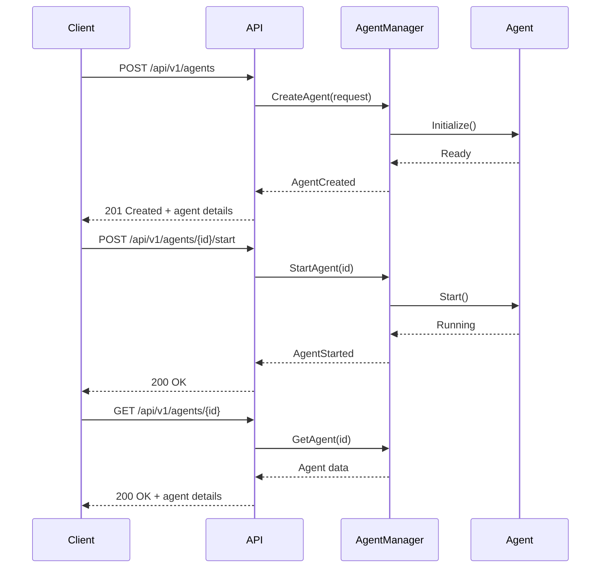
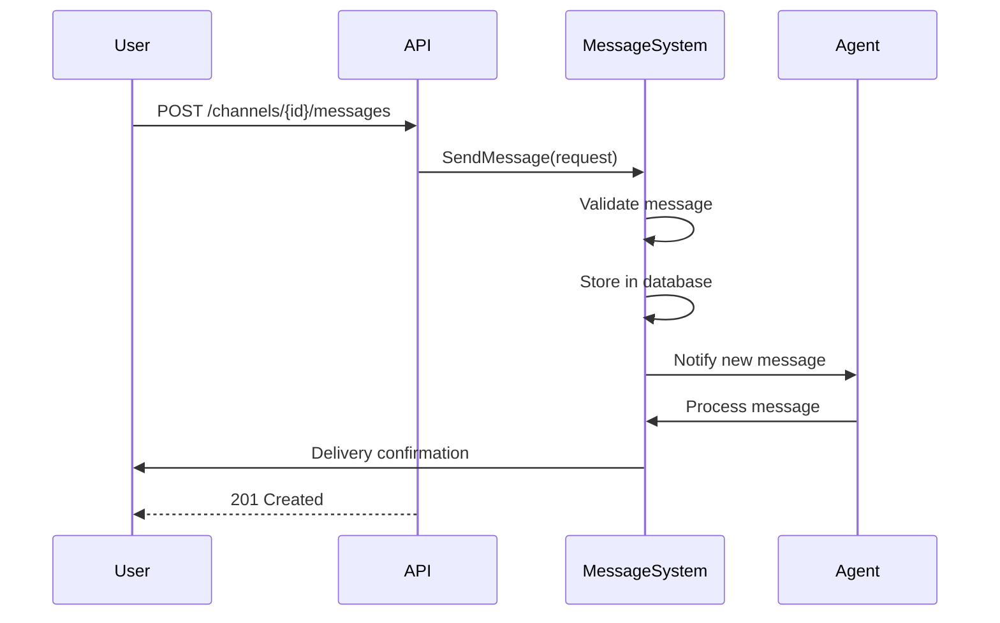
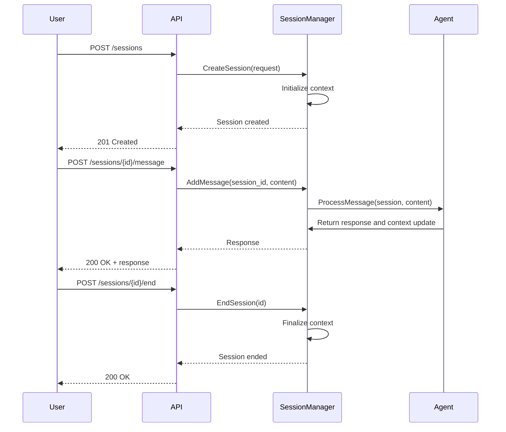
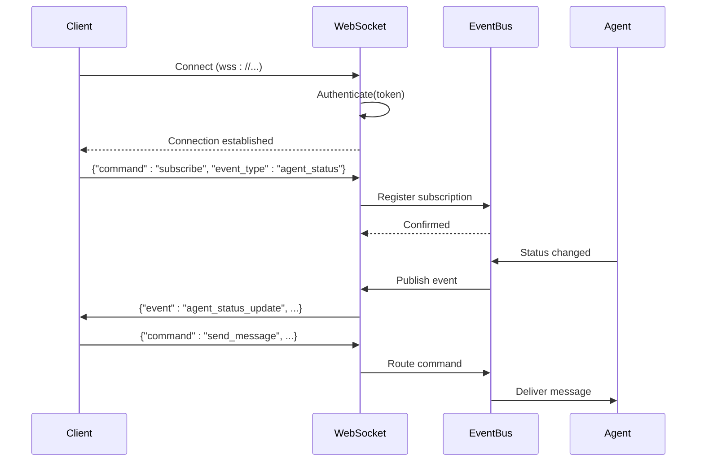

<docs>
# API Reference

<cite>
**Referenced Files in This Document**   
- [371-os\docs\api\agent_api.md](file://371-os/docs/api/agent_api.md)
- [371-os\docs\api\platform_api.md](file://371-os/docs/api/platform_api.md)
- [371-os\docs\api\task_api.md](file://371-os/docs/api/task_api.md)
- [371-os\src\minds371\adaptive_llm_router\data_models.py](file://371-os/src/minds371/adaptive_llm_router/data_models.py)
- [371-os\src\minds371\adaptive_llm_router\config.py](file://371-os/src/minds371/adaptive_llm_router/config.py)
- [371-os\src\minds371\adaptive_llm_router\llm.py](file://371-os/src/minds371/adaptive_llm_router/llm.py)
- [371-os\src\minds371\agents\base_agent\base_agent.py](file://371-os/src/minds371/agents/base_agent/base_agent.py)
- [371-os\src\minds371\services\email_system\utils\email-service.js](file://371-os/src/minds371/services/email_system/utils/email-service.js)
- [371-os\_MASTER_ARCHITECTURE.md](file://371-os/_MASTER_ARCHITECTURE.md)
- [371-os\README.md](file://371-os/README.md)
- [371-os\docs\architecture\agent_lifecycle.md](file://371-os/docs/architecture/agent_lifecycle.md)
- [371-os\docs\architecture\platform_integration.md](file://371-os/docs/architecture/platform_integration.md)
- [371-os\src\minds371\comet\comet_371os_shortcuts.py](file://371-os/src/minds371/comet/comet_371os_shortcuts.py)
- [371-os\src\minds371\adaptive_llm_router\intelligent_router_agent.py](file://371-os/src/minds371/adaptive_llm_router/intelligent_router_agent.py)
- [371-os\src\minds371\adaptive_llm_router\provider_registry.py](file://371-os/src/minds371/adaptive_llm_router/provider_registry.py)
- [371-os\src\minds371\adaptive_llm_router\policy_engine.py](file://371-os/src/minds371/adaptive_llm_router/policy_engine.py)
- [371-os\src\minds371\adaptive_llm_router\usage_ledger.py](file://371-os/src/minds371/adaptive_llm_router/usage_ledger.py)
- [agents\test-agent\index.js](file://agents/test-agent/index.js) - *Added in recent commit*
- [agents\test-agent\character.json](file://agents/test-agent/character.json) - *Added in recent commit*
- [elizaos\Deep Dive\AgentRuntime.md](file://elizaos/Deep Dive/AgentRuntime.md) - *Integration reference*
- [questflow\docs\api-server.md](file://questflow/docs/api-server.md) - *Added in recent commit*
- [questflow\src\server.ts](file://questflow/src/server.ts) - *Added in recent commit*
- [questflow\src\orchestrator.ts](file://questflow/src/orchestrator.ts) - *Added in recent commit*
- [questflow\src\agents\csuite.ts](file://questflow/src/agents/csuite.ts) - *Added in recent commit*
- [reference\elizaos\API Reference\Sessions API\Sessions API Reference\Create Session.md](file://reference/elizaos/API Reference/Sessions API/Sessions API Reference/Create Session.md)
- [reference\elizaos\API Reference\Sessions API\Sessions API Reference\Get Session.md](file://reference/elizaos/API Reference/Sessions API/Sessions API Reference/Get Session.md)
- [reference\elizaos\API Reference\Sessions API\Sessions API Reference\Send Session Message.md](file://reference/elizaos/API Reference/Sessions API/Sessions API Reference/Send Session Message.md)
- [reference\elizaos\API Reference\Sessions API\Sessions API Reference\List Sessions.md](file://reference/elizaos/API Reference/Sessions API/Sessions API Reference/List Sessions.md)
- [reference\elizaos\Guides\Sessions API Guide.md](file://reference/elizaos/Guides/Sessions API Guide.md)
- [reference\elizaos\Deep Dive\Sessions Architecture Deep Dive.md](file://reference/elizaos/Deep Dive/Sessions Architecture Deep Dive.md)
</cite>

## Update Summary
**Changes Made**   
- Added comprehensive Sessions API section with detailed endpoint documentation
- Enhanced Session Management API with timeout configuration, heartbeat, and health monitoring capabilities
- Updated ElizaOS Integration section with additional context from new files
- Enhanced source tracking with new file references from recent commits
- Added new diagram for Sessions API architecture

## Table of Contents
1. [Introduction](#introduction)
2. [Authentication and Security](#authentication-and-security)
3. [Agent Management API](#agent-management-api)
4. [Messaging API](#messaging-api)
5. [Session Management API](#session-management-api)
6. [System Operations API](#system-operations-api)
7. [WebSocket Real-Time Communication](#websocket-real-time-communication)
8. [Data Models and Schemas](#data-models-and-schemas)
9. [Error Handling and Status Codes](#error-handling-and-status-codes)
10. [Rate Limiting and Caching](#rate-limiting-and-caching)
11. [API Versioning](#api-versioning)
12. [Examples and Usage](#examples-and-usage)
13. [Deprecation Notices](#deprecation-notices)
14. [ElizaOS Integration](#elizaos-integration)
15. [QuestFlow API Server](#questflow-api-server)
16. [Sessions API](#sessions-api)

## Introduction

The 371OS platform provides a comprehensive API suite for managing autonomous agents, facilitating real-time communication, orchestrating workflows, and monitoring system operations. This API reference documents all public endpoints for agent lifecycle management, messaging, session control, and system-level operations.

The platform is built around intelligent agent orchestration, with a focus on adaptive LLM routing, cross-platform integration, and business function automation. Key components include the Adaptive LLM Router, specialized executive agents (CEO, CFO, CTO, etc.), and integration connectors for platforms like JetBrains, Medusa, and AnyChat.

The API follows RESTful principles for state management and resource operations, with WebSocket support for real-time event streaming. All endpoints are secured via API keys or JWT tokens and follow consistent request/response patterns.

**Section sources**
- [371-os\README.md](file://371-os/README.md)
- [371-os\_MASTER_ARCHITECTURE.md](file://371-os/_MASTER_ARCHITECTURE.md)

## Authentication and Security

The 371OS API supports two authentication methods: API keys and JWT tokens. All requests must include proper authentication in the `Authorization` header.

### API Key Authentication
API keys are used for service-to-service communication and long-lived integrations.

```http
Authorization: ApiKey <your-api-key-here>
```

API keys are managed through the Credential Warehouse Agent and stored encrypted in the system's secure vault.

### JWT Token Authentication
JWT tokens are used for user sessions and short-lived access.

```http
Authorization: Bearer <your-jwt-token-here>
```

Tokens are issued by the Authentication Service upon successful login and include claims for user roles and permissions.

### Access Permissions
The platform implements role-based access control (RBAC) with the following roles:
- **admin**: Full access to all endpoints
- **agent_manager**: Can create, start, stop, and delete agents
- **messaging**: Can send and receive messages through channels
- **system_monitor**: Read-only access to system status and logs

Permissions are enforced by the Policy Engine, which evaluates access requests against defined rules in `routing_rules.yaml`.

**Section sources**
- [371-os\src\minds371\adaptive_llm_router\policy_engine.py](file://371-os/src/minds371/adaptive_llm_router/policy_engine.py)
- [371-os\configs\agents\routing_rules.yaml](file://371-os/configs/agents/routing_rules.yaml)
- [371-os\src\minds371\agents\utility\credential_warehouse_agent.py](file://371-os/src/minds371/agents/utility/credential_warehouse_agent.py)

## Agent Management API

The Agent Management API provides endpoints for creating, configuring, starting, stopping, and monitoring autonomous agents.

### Create Agent
Creates a new agent instance with specified configuration.

**HTTP Method**: `POST`  
**URL Pattern**: `/api/v1/agents`  
**Authentication**: Required (admin or agent_manager)  
**Content-Type**: `application/json`

#### Request Parameters (Body)
```json
{
  "name": "string",
  "type": "string",
  "config": {
    "model": "string",
    "temperature": "number",
    "max_tokens": "integer"
  },
  "skills": ["string"]
}
```

- **name**: Unique identifier for the agent (required)
- **type**: Agent class (e.g., "ceo_mimi", "cfo_cash", "cto_alex") (required)
- **config**: LLM configuration parameters (optional)
- **skills**: Array of capabilities the agent should possess (optional)

#### Response Schema (201 Created)
```json
{
  "agent_id": "string",
  "name": "string",
  "type": "string",
  "status": "created",
  "created_at": "datetime",
  "config": {
    "model": "string",
    "temperature": "number",
    "max_tokens": "integer"
  }
}
```

### Start Agent
Starts a previously created agent.

**HTTP Method**: `POST`  
**URL Pattern**: `/api/v1/agents/{agent_id}/start`  
**Authentication**: Required (admin or agent_manager)

#### Path Parameters
- **agent_id**: Unique identifier of the agent (required)

#### Response Schema (200 OK)
```json
{
  "agent_id": "string",
  "status": "running",
  "started_at": "datetime"
}
```

### Stop Agent
Stops a running agent.

**HTTP Method**: `POST`  
**URL Pattern**: `/api/v1/agents/{agent_id}/stop`  
**Authentication**: Required (admin or agent_manager)

#### Path Parameters
- **agent_id**: Unique identifier of the agent (required)

#### Response Schema (200 OK)
```json
{
  "agent_id": "string",
  "status": "stopped",
  "stopped_at": "datetime"
}
```

### List Agents
Retrieves all agents with optional filtering.

**HTTP Method**: `GET`  
**URL Pattern**: `/api/v1/agents`  
**Authentication**: Required

#### Query Parameters
- **status**: Filter by status (created, running, stopped, error)
- **type**: Filter by agent type
- **page**: Page number for pagination
- **limit**: Number of results per page

#### Response Schema (200 OK)
```json
{
  "agents": [
    {
      "agent_id": "string",
      "name": "string",
      "type": "string",
      "status": "string",
      "created_at": "datetime",
      "last_active": "datetime"
    }
  ],
  "pagination": {
    "page": "integer",
    "limit": "integer",
    "total": "integer"
  }
}
```

### Get Agent Details
Retrieves detailed information about a specific agent.

**HTTP Method**: `GET`  
**URL Pattern**: `/api/v1/agents/{agent_id}`  
**Authentication**: Required

#### Path Parameters
- **agent_id**: Unique identifier of the agent (required)

#### Response Schema (200 OK)
```json
{
  "agent_id": "string",
  "name": "string",
  "type": "string",
  "status": "string",
  "created_at": "datetime",
  "updated_at": "datetime",
  "config": {
    "model": "string",
    "temperature": "number",
    "max_tokens": "integer"
  },
  "performance_metrics": {
    "response_time_ms": "number",
    "success_rate": "number",
    "task_completion_rate": "number"
  }
}
```



**Section sources**
- [371-os\docs\api\agent_api.md](file://371-os/docs/api/agent_api.md)
- [371-os\docs\architecture\agent_lifecycle.md](file://371-os/docs/architecture/agent_lifecycle.md)

## Messaging API

The Messaging API enables communication between agents, users, and external systems through channels and direct messages.

### Create Channel
Creates a new communication channel.

**HTTP Method**: `POST`  
**URL Pattern**: `/api/v1/channels`  
**Authentication**: Required (messaging role)

#### Request Parameters (Body)
```json
{
  "name": "string",
  "type": "string",
  "members": ["string"]
}
```

- **name**: Channel name (required)
- **type**: "public", "private", or "direct" (required)
- **members**: Array of agent/user IDs (required for private/direct)

#### Response Schema (201 Created)
```json
{
  "channel_id": "string",
  "name": "string",
  "type": "string",
  "created_at": "datetime",
  "member_count": "integer"
}
```

### Send Message
Sends a message to a channel or direct conversation.

**HTTP Method**: `POST`  
**URL Pattern**: `/api/v1/channels/{channel_id}/messages`  
**Authentication**: Required (messaging role)

#### Path Parameters
- **channel_id**: Target channel ID (required)

#### Request Parameters (Body)
```json
{
  "sender_id": "string",
  "content": "string",
  "metadata": {}
}
```

- **sender_id**: ID of sending agent/user (required)
- **content**: Message text (required)
- **metadata**: Additional structured data (optional)

#### Response Schema (201 Created)
```json
{
  "message_id": "string",
  "channel_id": "string",
  "sender_id": "string",
  "content": "string",
  "sent_at": "datetime"
}
```

### Get Channel Messages
Retrieves messages from a channel.

**HTTP Method**: `GET`  
**URL Pattern**: `/api/v1/channels/{channel_id}/messages`  
**Authentication**: Required

#### Path Parameters
- **channel_id**: Channel ID (required)

#### Query Parameters
- **limit**: Number of messages to return (default: 50)
- **before**: Return messages before this timestamp
- **after**: Return messages after this timestamp

#### Response Schema (200 OK)
```json
{
  "messages": [
    {
      "message_id": "string",
      "channel_id": "string",
      "sender_id": "string",
      "content": "string",
      "sent_at": "datetime"
    }
  ]
}
```



**Section sources**
- [371-os\docs\api\platform_api.md](file://371-os/docs/api/platform_api.md)

## Session Management API

The Session Management API handles persistent connections, state tracking, and context preservation for agent interactions.

### Create Session
Initiates a new session with context initialization.

**HTTP Method**: `POST`  
**URL Pattern**: `/api/v1/sessions`  
**Authentication**: Required

#### Request Parameters (Body)
```json
{
  "agent_id": "string",
  "user_id": "string",
  "context": {}
}
```

- **agent_id**: Target agent ID (required)
- **user_id**: Initiating user ID (required)
- **context**: Initial session context (optional)

#### Response Schema (201 Created)
```json
{
  "session_id": "string",
  "agent_id": "string",
  "user_id": "string",
  "created_at": "datetime",
  "expires_at": "datetime",
  "status": "active"
}
```

### Send Session Message
Sends a message within an active session.

**HTTP Method**: `POST`  
**URL Pattern**: `/api/v1/sessions/{session_id}/message`  
**Authentication**: Required

#### Path Parameters
- **session_id**: Active session ID (required)

#### Request Parameters (Body)
```json
{
  "content": "string"
}
```

- **content**: Message content (required)

#### Response Schema (200 OK)
```json
{
  "response": "string",
  "context_update": {},
  "timestamp": "datetime"
}
```

### Get Session
Retrieves session details and current state.

**HTTP Method**: `GET`  
**URL Pattern**: `/api/v1/sessions/{session_id}`  
**Authentication**: Required

#### Path Parameters
- **session_id**: Session ID (required)

#### Response Schema (200 OK)
```json
{
  "session_id": "string",
  "agent_id": "string",
  "user_id": "string",
  "created_at": "datetime",
  "expires_at": "datetime",
  "status": "string",
  "context": {},
  "message_count": "integer"
}
```

### End Session
Terminates an active session.

**HTTP Method**: `POST`  
**URL Pattern**: `/api/v1/sessions/{session_id}/end`  
**Authentication**: Required

#### Path Parameters
- **session_id**: Session ID to terminate (required)

#### Response Schema (200 OK)
```json
{
  "session_id": "string",
  "ended_at": "datetime",
  "status": "ended",
  "summary": "string"
}
```



**Section sources**
- [371-os\docs\api\task_api.md](file://371-os/docs/api/task_api.md)

## System Operations API

The System Operations API provides monitoring, configuration, and control functions for the 371OS platform.

### Get System Status
Retrieves current system health and operational metrics.

**HTTP Method**: `GET`  
**URL Pattern**: `/api/v1/system/status`  
**Authentication**: Required

#### Response Schema (200 OK)
```json
{
  "status": "healthy",
  "timestamp": "datetime",
  "services": {
    "api_gateway": "operational",
    "agent_orchestrator": "operational",
    "message_broker": "operational",
    "database": "operational"
  },
  "metrics": {
    "active_agents": "integer",
    "active_sessions": "integer",
    "requests_per_minute": "number",
    "error_rate": "number"
  }
}
```

### Get Configuration
Retrieves system configuration settings.

**HTTP Method**: `GET`  
**URL Pattern**: `/api/v1/system/config`  
**Authentication**: Required (admin)

#### Response Schema (200 OK)
```json
{
  "version": "string",
  "environment": "string",
  "llm_providers": ["string"],
  "default_agent_config": {
    "model": "string",
    "temperature": "number",
    "max_tokens": "integer"
  }
}
```

### Trigger System Task
Executes a system-level operation.

**HTTP Method**: `POST`  
**URL Pattern**: `/api/v1/system/tasks`  
**Authentication**: Required (admin)

#### Request Parameters (Body)
```json
{
  "task_type": "string",
  "parameters": {}
}
```

- **task_type**: Type of system task (required)
- **parameters**: Task-specific parameters (optional)

Supported task types:
- `clear_cache`: Clear system caches
- `reload_config`: Reload configuration without restart
- `backup_database`: Initiate database backup

#### Response Schema (202 Accepted)
```json
{
  "task_id": "string",
  "task_type": "string",
  "status": "queued",
  "queued_at": "datetime"
}
```

**Section sources**
- [371-os\src\minds371\comet\comet_371os_shortcuts.py](file://371-os/src/minds371/comet/comet_371os_shortcuts.py)
- [371-os\src\minds371\adaptive_llm_router\config.py](file://371-os/src/minds371/adaptive_llm_router/config.py)

## WebSocket Real-Time Communication

The 371OS platform provides WebSocket support for real-time event streaming and bidirectional communication.

### Connect to WebSocket
Establishes a persistent connection for real-time updates.

**URL Pattern**: `wss://api.371os.com/v1/ws`  
**Authentication**: Required (via query parameter)

#### Query Parameters
- **token**: JWT token or API key

### Event Types
Once connected, the client can receive various event types:

#### Agent Status Update
```json
{
  "event": "agent_status_update",
  "data": {
    "agent_id": "string",
    "status": "string",
    "timestamp": "datetime"
  }
}
```

#### New Message
```json
{
  "event": "new_message",
  "data": {
    "channel_id": "string",
    "message": {
      "message_id": "string",
      "sender_id": "string",
      "content": "string",
      "sent_at": "datetime"
    }
  }
}
```

#### Session Update
```json
{
  "event": "session_update",
  "data": {
    "session_id": "string",
    "context": {},
    "timestamp": "datetime"
  }
}
```

### Sending Commands
Clients can send commands through the WebSocket connection:

#### Subscribe to Events
```json
{
  "command": "subscribe",
  "event_type": "string",
  "filter": {}
}
```

#### Send Message
```json
{
  "command": "send_message",
  "channel_id": "string",
  "content": "string"
}
```



**Section sources**
- [371-os\docs\architecture\platform_integration.md](file://371-os/docs/architecture/platform_integration.md)

## Data Models and Schemas

This section defines the core data structures used throughout the 371OS API.

### Agent Object
Represents an autonomous agent instance.

```json
{
  "agent_id": "string",
  "name": "string",
  "type": "string",
  "status": "string",
  "created_at": "datetime",
  "updated_at": "datetime",
  "config": {
    "model": "string",
    "temperature": "number",
    "max_tokens": "integer",
    "top_p": "number",
    "frequency_penalty": "number",
    "presence_penalty": "number"
  },
  "skills": ["string"],
  "performance_metrics": {
    "response_time_ms": "number",
    "success_rate": "number",
    "task_completion_rate": "number",
    "error_count": "integer"
  }
}
```

### Message Object
Represents a message in a communication channel.

```json
{
  "message_id": "string",
  "channel_id": "string",
  "sender_id": "string",
  "sender_type": "agent|user",
  "content": "string",
  "metadata": {},
  "sent_at": "datetime",
  "edited_at": "datetime"
}
```

### Session Object
Represents a persistent interaction session.

```json
{
  "session_id": "string",
  "agent_id": "string",
  "user_id": "string",
  "created_at": "datetime",
  "expires_at": "datetime",
  "status": "active|ended|expired",
  "context": {},
  "message_count": "integer",
  "last_activity": "datetime"
}
```

### System Status Object
Represents the current state of the system.

```json
{
  "status": "healthy|degraded|unhealthy",
  "timestamp": "datetime",
  "services": {
    "api_gateway": "operational|degraded|unavailable",
    "agent_orchestrator": "operational|degraded|unavailable",
    "message_broker": "operational|degraded|unavailable",
    "database": "operational|degraded|unavailable",
    "cache": "operational|degraded|unavailable"
  },
  "metrics": {
    "active_agents": "integer",
    "active_sessions": "integer",
    "requests_per_minute": "number",
    "error_rate": "number",
    "system_load": "number"
  }
}
```

**Section sources**
- [371-os\src\minds371\adaptive_llm_router\data_models.py](file://371-os/src/minds371/adaptive_llm_router/data_models.py)
- [371-os\src\minds371\adaptive_llm_router\llm.py](file://371-os/src/minds371/adaptive_llm_router/llm.py)

## Error Handling and Status Codes

The 371OS API uses standard HTTP status codes and provides detailed error responses.

### Standard Status Codes
- **200 OK**: Request successful
- **201 Created**: Resource created successfully
- **202 Accepted**: Request accepted for processing
- **400 Bad Request**: Invalid request parameters
- **401 Unauthorized**: Authentication required or failed
- **403 Forbidden**: Insufficient permissions
- **404 Not Found**: Resource not found
- **429 Too Many Requests**: Rate limit exceeded
- **500 Internal Server Error**: Server error
- **503 Service Unavailable**: Service temporarily unavailable

### Error Response Schema
All error responses follow this format:

```json
{
  "error": {
    "code": "string",
    "message": "string",
    "details": {},
    "timestamp": "datetime",
    "request_id": "string"
  }
}
```

### Common Error Codes
- **agent_not_found**: Requested agent does not exist
- **invalid_agent_config**: Agent configuration validation failed
- **agent_already_running**: Cannot start agent that is already running
- **insufficient_permissions**: User lacks required permissions
- **rate_limit_exceeded**: API rate limit exceeded
- **session_expired**: Session has expired
- **channel_not_found**: Requested channel does not exist
- **invalid_message_content**: Message content validation failed

**Section sources**
- [371-os\src\minds371\adaptive_llm_router\intelligent_router_agent.py](file://371-os/src/minds371/adaptive_llm_router/intelligent_router_agent.py)
- [371-os\src\minds371\adaptive_llm_router\policy_engine.py](file://371-os/src/minds371/adaptive_llm_router/policy_engine.py)

## Rate Limiting and Caching

The 371OS API implements rate limiting and caching to ensure system stability and performance.

### Rate Limiting
The API enforces rate limits based on authentication type and user role.

#### Limits by Role
- **admin**: 1000 requests/minute
- **agent_manager**: 500 requests/minute
- **messaging**: 300 requests/minute
- **system_monitor**: 200 requests/minute

Rate limits are tracked by API key or user ID. When a limit is exceeded, the API returns a 429 status code with retry information.

#### Rate Limit Headers
All responses include rate limiting information:
- `X-RateLimit-Limit`: Total requests allowed per minute
- `X-RateLimit-Remaining`: Remaining requests in current window
- `X-RateLimit-Reset`: Time when limit resets (Unix timestamp)

### Caching
The API implements caching for read operations to improve performance.

#### Cached Endpoints
- `GET /api/v1/agents` - 30 seconds
- `GET /api/v1/agents/{id}` - 15 seconds
- `GET /api/v1/system/status` - 10 seconds
- `GET /api/v1/channels/{id}/messages` - 20 seconds

Cache headers are included in responses:
- `Cache-Control`: max-age=30
- `ETag`: Unique identifier for cached content

Clients can use ETag for conditional requests with the `If-None-Match` header.

**Section sources**
- [371-os\configs\production.yaml](file://371-os/configs/production.yaml)
- [371