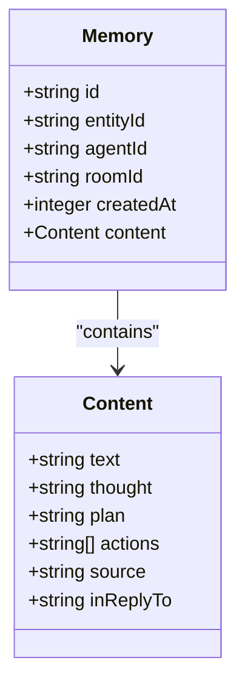
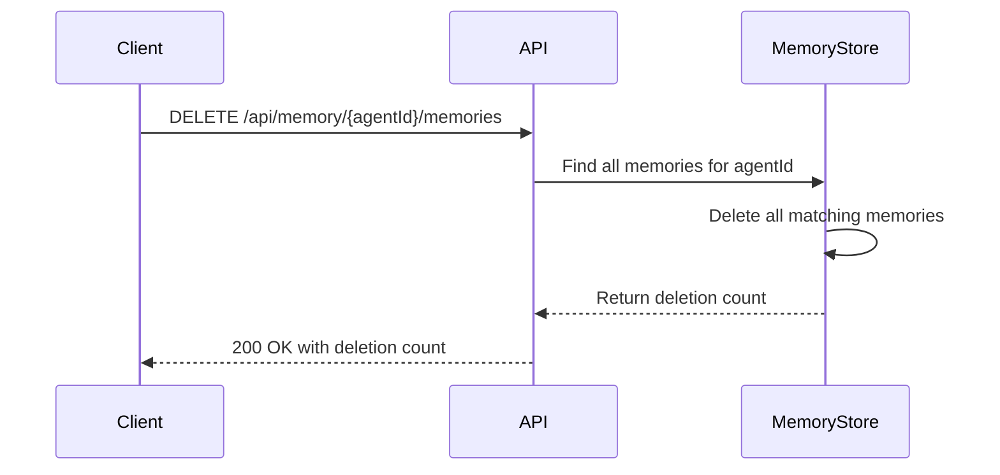
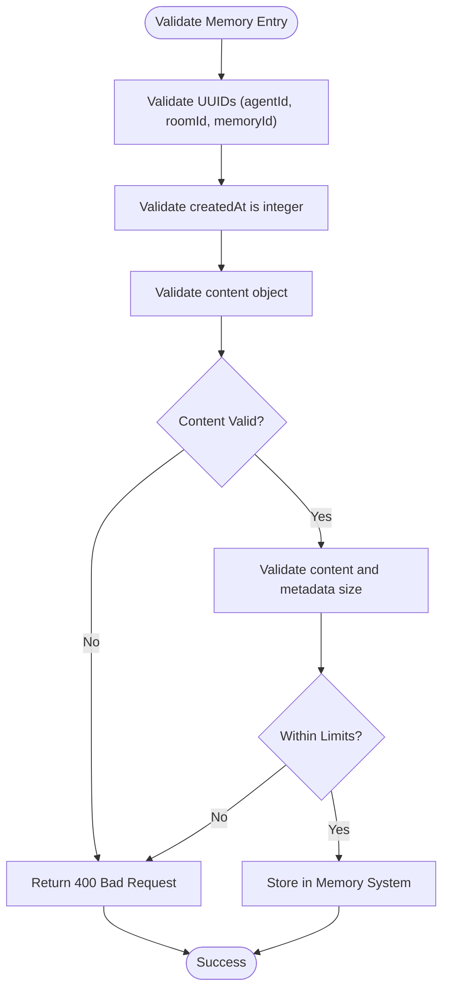
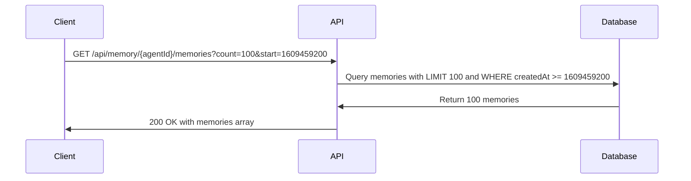
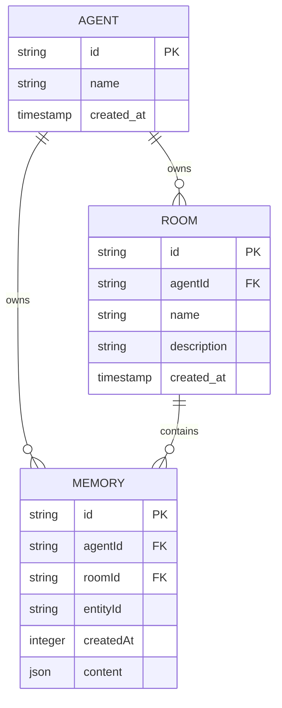

# Memory API

<cite>
**Referenced Files in This Document**   
- [elizaos\API Reference\Memory\Create a room.md](file://elizaos/API%20Reference/Memory/Create%20a%20room.md)
- [elizaos\API Reference\Memory\Get agent memories.md](file://elizaos/API%20Reference/Memory/Get%20agent%20memories.md)
- [elizaos\API Reference\Memory\Get room memories.md](file://elizaos/API%20Reference/Memory/Get%20room%20memories.md)
- [elizaos\API Reference\Memory\Update a memory.md](file://elizaos/API%20Reference/Memory/Update%20a%20memory.md)
- [elizaos\API Reference\Memory\Delete all agent memories.md](file://elizaos/API%20Reference/Memory/Delete%20all%20agent%20memories.md)
- [elizaos\API Reference\Memory\Delete all memories for a room.md](file://elizaos/API%20Reference/Memory/Delete%20all%20memories%20for%20a%20room.md)
- [elizaos\Deep Dive\Sessions Architecture Deep Dive.md](file://elizaos/Deep%20Dive/Sessions%20Architecture%20Deep%20Dive.md)
- [elizaos\Guides\State Management.md](file://elizaos/Guides/State%20Management.md)
- [thought_leadership\AASA\researchprotocol.md](file://thought_leadership/AASA/researchprotocol.md)
</cite>

## Table of Contents
1. [Introduction](#introduction)
2. [Core Memory Endpoints](#core-memory-endpoints)
3. [Authentication and Access Control](#authentication-and-access-control)
4. [Memory Data Model](#memory-data-model)
5. [Bulk Operations](#bulk-operations)
6. [Data Validation Rules](#data-validation-rules)
7. [Pagination and Performance](#pagination-and-performance)
8. [Error Handling](#error-handling)
9. [Sample Operations](#sample-operations)
10. [Relationships and Ownership](#relationships-and-ownership)

## Introduction
The Memory API in the 371OS platform provides comprehensive functionality for managing agent memories and memory rooms. This API enables agents to store, retrieve, update, and delete memory entries that capture interactions, thoughts, plans, and actions. The system supports both agent-level and room-level memory operations, with robust access control based on agent ownership. Memory entries are structured to support rich contextual information including text content, internal thought processes, action plans, and source tracking.

**Section sources**
- [elizaos\API Reference\Memory\Get agent memories.md](file://elizaos/API%20Reference/Memory/Get%20agent%20memories.md#L0-L216)
- [thought_leadership\AASA\researchprotocol.md](file://thought_leadership/AASA/researchprotocol.md#L1209-L1226)

## Core Memory Endpoints

### Create Memory Room
Creates a new memory room for an agent to organize related memories.

**HTTP Method**: POST  
**URL**: `/api/agents/{agentId}/rooms`  

**Path Parameters**:
- `agentId`: ID of the agent creating the room (string, required, format: uuid)

**Request Body**:
```json
{
  "name": "string",
  "description": "string",
  "metadata": {}
}
```

**Response (201)**:
```json
{
  "success": true,
  "data": {
    "id": "3c90c3cc-0d44-4b50-8888-8dd25736052a",
    "agentId": "3c90c3cc-0d44-4b50-8888-8dd25736052a",
    "name": "string",
    "description": "string",
    "createdAt": 123,
    "metadata": {}
  }
}
```

### Retrieve Agent Memories
Retrieves all memories associated with a specific agent.

**HTTP Method**: GET  
**URL**: `/api/memory/{agentId}/memories`  

**Path Parameters**:
- `agentId`: ID of the agent (string, required, format: uuid)

**Query Parameters**:
- `tableName`: Table name to query (string, default: "messages")
- `includeEmbedding`: Include embedding vectors in response (boolean, default: false)
- `channelId`: Filter by channel ID (string, format: uuid)
- `roomId`: Filter by room ID (string, format: uuid)

**Response (200)**:
```json
{
  "success": true,
  "data": {
    "memories": [
      {
        "id": "3c90c3cc-0d44-4b50-8888-8dd25736052a",
        "entityId": "3c90c3cc-0d44-4b50-8888-8dd25736052a",
        "agentId": "3c90c3cc-0d44-4b50-8888-8dd25736052a",
        "roomId": "3c90c3cc-0d44-4b50-8888-8dd25736052a",
        "createdAt": 123,
        "content": {
          "text": "string",
          "thought": "string",
          "plan": "string",
          "actions": ["string"],
          "source": "string",
          "inReplyTo": "3c90c3cc-0d44-4b50-8888-8dd25736052a"
        }
      }
    ]
  }
}
```

### Retrieve Room Memories
Retrieves memories from a specific room.

**HTTP Method**: GET  
**URL**: `/api/agents/{agentId}/rooms/{roomId}/memories`  

**Path Parameters**:
- `agentId`: ID of the agent (string, required, format: uuid)
- `roomId`: ID of the room (string, required, format: uuid)

**Query Parameters**:
- `count`: Number of memories to retrieve (integer, default: 50)
- `unique`: Return only unique memories (boolean, default: true)
- `start`: Start timestamp filter (integer)
- `end`: End timestamp filter (integer)

**Response (200)**:
```json
{
  "success": true,
  "data": [
    {
      "id": "3c90c3cc-0d44-4b50-8888-8dd25736052a",
      "entityId": "3c90c3cc-0d44-4b50-8888-8dd25736052a",
      "agentId": "3c90c3cc-0d44-4b50-8888-8dd25736052a",
      "roomId": "3c90c3cc-0d44-4b50-8888-8dd25736052a",
      "createdAt": 123,
      "content": {
        "text": "string",
        "thought": "string",
        "plan": "string",
        "actions": ["string"],
        "source": "string",
        "inReplyTo": "3c90c3cc-0d44-4b50-8888-8dd25736052a"
      }
    }
  ]
}
```

### Update Memory Entry
Updates a specific memory entry.

**HTTP Method**: PATCH  
**URL**: `/api/memory/{agentId}/memories/{memoryId}`  

**Path Parameters**:
- `agentId`: ID of the agent (string, required, format: uuid)
- `memoryId`: ID of the memory to update (string, required, format: uuid)

**Request Body**:
```json
{
  "content": {
    "text": "string",
    "thought": "string",
    "plan": "string",
    "actions": ["string"],
    "source": "string",
    "inReplyTo": "3c90c3cc-0d44-4b50-8888-8dd25736052a"
  },
  "metadata": {}
}
```

**Response (200)**:
```json
{
  "success": true,
  "data": {
    "id": "3c90c3cc-0d44-4b50-8888-8dd25736052a",
    "message": "Memory updated successfully"
  }
}
```

**Section sources**
- [elizaos\API Reference\Memory\Get agent memories.md](file://elizaos/API%20Reference/Memory/Get%20agent%20memories.md#L6-L216)
- [elizaos\API Reference\Memory\Get room memories.md](file://elizaos/API%20Reference/Memory/Get%20room%20memories.md#L0-L216)
- [elizaos\API Reference\Memory\Update a memory.md](file://elizaos/API%20Reference/Memory/Update%20a%20memory.md#L0-L151)

## Authentication and Access Control
The Memory API uses agent-specific authentication to ensure proper access control. Each agent must authenticate with their unique agent token or API key when making requests to the memory endpoints. Access permissions are strictly enforced based on agent ownership - agents can only access, modify, or delete memories and rooms that they own. The system validates agent identity through the agentId parameter in the request path, ensuring that operations are performed within the agent's authorized scope. No explicit authentication headers are shown in the documentation, indicating that authentication is likely handled through the agent context established during session initialization.

**Section sources**
- [elizaos\API Reference\Memory\Get agent memories.md](file://elizaos/API%20Reference/Memory/Get%20agent%20memories.md#L6-L216)
- [elizaos\Deep Dive\Sessions Architecture Deep Dive.md](file://elizaos/Deep%20Dive/Sessions%20Architecture%20Deep%20Dive.md#L324-L375)

## Memory Data Model

### Memory Object Structure
The memory object represents a single memory entry in the system with the following properties:

**Memory Schema**:
- `id`: Unique identifier for the memory (string, format: uuid)
- `entityId`: ID of the entity associated with this memory (string, format: uuid)
- `agentId`: ID of the agent associated with this memory (string, format: uuid)
- `roomId`: ID of the room this memory belongs to (string, format: uuid)
- `createdAt`: Unix timestamp when the memory was created (integer, format: int64)
- `content`: Object containing the memory content with properties:
  - `text`: Text content of the message (string)
  - `thought`: Agent's internal thought process (string)
  - `plan`: Agent's plan or reasoning (string)
  - `actions`: Actions the agent wants to take (array of strings)
  - `source`: Source of the message (string)
  - `inReplyTo`: ID of the message this is in reply to (string, format: uuid)



**Diagram sources**
- [elizaos\API Reference\Memory\Get agent memories.md](file://elizaos/API%20Reference/Memory/Get%20agent%20memories.md#L6-L216)

**Section sources**
- [elizaos\API Reference\Memory\Get agent memories.md](file://elizaos/API%20Reference/Memory/Get%20agent%20memories.md#L6-L216)

## Bulk Operations

### Delete All Agent Memories
Deletes all memories associated with a specific agent.

**HTTP Method**: DELETE  
**URL**: `/api/memory/{agentId}/memories`  

**Path Parameters**:
- `agentId`: ID of the agent (string, required, format: uuid)

**Response (200)**:
```json
{
  "success": true,
  "data": {
    "deleted": 123,
    "message": "All memories deleted successfully"
  }
}
```

### Delete All Room Memories
Deletes all memories within a specific room.

**HTTP Method**: DELETE  
**URL**: `/api/memory/{agentId}/memories/all/{roomId}`  

**Path Parameters**:
- `agentId`: ID of the agent (string, required, format: uuid)
- `roomId`: ID of the room (string, required, format: uuid)

**Response (204)**:
No content returned on successful deletion.



**Diagram sources**
- [elizaos\API Reference\Memory\Delete all agent memories.md](file://elizaos/API%20Reference/Memory/Delete%20all%20agent%20memories.md#L0-L135)
- [elizaos\API Reference\Memory\Delete all memories for a room.md](file://elizaos/API%20Reference/Memory/Delete%20all%20memories%20for%20a%20room.md#L0-L123)

**Section sources**
- [elizaos\API Reference\Memory\Delete all agent memories.md](file://elizaos/API%20Reference/Memory/Delete%20all%20agent%20memories.md#L0-L135)
- [elizaos\API Reference\Memory\Delete all memories for a room.md](file://elizaos/API%20Reference/Memory/Delete%20all%20memories%20for%20a%20room.md#L0-L123)

## Data Validation Rules

### Content Validation
The system enforces strict validation rules for memory content to ensure data integrity:

- Content must be a non-empty string
- Text content has a maximum length defined by MAX_CONTENT_LENGTH
- Metadata size is limited to MAX_METADATA_SIZE bytes when serialized as JSON
- UUID format is validated using standard UUID regex pattern

### Field Constraints
- All ID fields (agentId, roomId, memoryId) must be valid UUIDs
- createdAt timestamp must be a valid Unix timestamp (integer)
- Content fields (text, thought, plan) must be strings
- Actions array must contain only string values
- inReplyTo field must be a valid UUID if present



**Diagram sources**
- [elizaos\Deep Dive\Sessions Architecture Deep Dive.md](file://elizaos/Deep%20Dive/Sessions%20Architecture%20Deep%20Dive.md#L613-L680)

**Section sources**
- [elizaos\Deep Dive\Sessions Architecture Deep Dive.md](file://elizaos/Deep%20Dive/Sessions%20Architecture%20Deep%20Dive.md#L613-L680)

## Pagination and Performance

### Pagination Strategy
For retrieving large sets of memories, the API implements query-based pagination:

- The `count` parameter limits the number of memories returned (default: 50)
- Timestamp filters (`start` and `end`) enable time-based pagination
- Results are ordered by creation time (oldest first)
- The `unique` parameter can be used to eliminate duplicate memories

### Performance Considerations
- For agent-level memory retrieval, consider using filtering parameters (roomId, channelId) to reduce response size
- Room-level memory retrieval is optimized for recent memories with the default count limit
- Including embeddings (`includeEmbedding=true`) significantly increases response size and should be used judiciously
- For large memory sets, implement client-side pagination using timestamp ranges



**Diagram sources**
- [elizaos\API Reference\Memory\Get room memories.md](file://elizaos/API%20Reference/Memory/Get%20room%20memories.md#L0-L216)

**Section sources**
- [elizaos\API Reference\Memory\Get room memories.md](file://elizaos/API%20Reference/Memory/Get%20room%20memories.md#L0-L216)
- [elizaos\Guides\State Management.md](file://elizaos/Guides/State%20Management.md#L1044-L1092)

## Error Handling

### Status Codes
The Memory API returns standard HTTP status codes with detailed error responses:

- **200 OK**: Successful GET or PATCH operation
- **201 Created**: Successful room creation
- **204 No Content**: Successful deletion
- **400 Bad Request**: Invalid parameters or request format
- **404 Not Found**: Agent, room, or memory not found
- **500 Internal Server Error**: Server error during operation

### Error Response Structure
```json
{
  "success": false,
  "error": {
    "code": "string",
    "message": "string",
    "details": "string"
  }
}
```

### Common Error Conditions
- **Memory Not Found**: Returned when attempting to update or delete a non-existent memory (404)
- **Access Denied**: Implicitly enforced by agent ownership - operations on foreign memories return 404 rather than 403
- **Invalid Memory Format**: Returned when request body contains invalid data types or malformed JSON (400)
- **Invalid Agent ID**: Returned when agentId is not a valid UUID format (400)

**Section sources**
- [elizaos\API Reference\Memory\Get agent memories.md](file://elizaos/API%20Reference/Memory/Get%20agent%20memories.md#L6-L216)
- [elizaos\API Reference\Memory\Update a memory.md](file://elizaos/API%20Reference/Memory/Update%20a%20memory.md#L0-L151)

## Sample Operations

### Create Memory Room (curl)
```bash
curl -X POST "http://localhost:3000/api/agents/3c90c3cc-0d44-4b50-8888-8dd25736052a/rooms" \
  -H "Content-Type: application/json" \
  -d '{
    "name": "Project Planning",
    "description": "Memory room for project strategy discussions",
    "metadata": {
      "project": "371OS Launch"
    }
  }'
```

### Retrieve Agent Memories (curl)
```bash
curl -X GET "http://localhost:3000/api/memory/3c90c3cc-0d44-4b50-8888-8dd25736052a/memories?roomId=3c90c3cc-0d44-4b50-8888-8dd25736052a&includeEmbedding=false" \
  -H "Content-Type: application/json"
```

### Update Memory Entry (curl)
```bash
curl -X PATCH "http://localhost:3000/api/memory/3c90c3cc-0d44-4b50-8888-8dd25736052a/memories/3c90c3cc-0d44-4b50-8888-8dd25736052a" \
  -H "Content-Type: application/json" \
  -d '{
    "content": {
      "text": "Updated project timeline with new milestones",
      "thought": "The original timeline was too aggressive",
      "plan": "Adjust deadlines and communicate changes to stakeholders",
      "actions": [
        "Update project management tool",
        "Send status update email"
      ],
      "source": "planning_meeting_2024"
    }
  }'
```

### Delete All Room Memories (curl)
```bash
curl -X DELETE "http://localhost:3000/api/memory/3c90c3cc-0d44-4b50-8888-8dd25736052a/memories/all/3c90c3cc-0d44-4b50-8888-8dd25736052a" \
  -H "Content-Type: application/json"
```

**Section sources**
- [elizaos\API Reference\Memory\Get agent memories.md](file://elizaos/API%20Reference/Memory/Get%20agent%20memories.md#L6-L216)
- [elizaos\API Reference\Memory\Get room memories.md](file://elizaos/API%20Reference/Memory/Get%20room%20memories.md#L0-L216)
- [elizaos\API Reference\Memory\Update a memory.md](file://elizaos/API%20Reference/Memory/Update%20a%20memory.md#L0-L151)
- [elizaos\API Reference\Memory\Delete all agent memories.md](file://elizaos/API%20Reference/Memory/Delete%20all%20agent%20memories.md#L0-L135)

## Relationships and Ownership

### Agent-Memory-Room Relationship
The Memory API implements a hierarchical relationship structure:

- Each agent owns multiple memory rooms
- Each memory room contains multiple memory entries
- Each memory entry belongs to exactly one agent and one room
- Agents can only access memories and rooms they own

This ownership model ensures data isolation between agents while allowing organized memory management within each agent's scope. The relationship is enforced through the agentId parameter in all memory operations, which serves as both an identifier and an access control mechanism.



**Diagram sources**
- [elizaos\API Reference\Memory\Get agent memories.md](file://elizaos/API%20Reference/Memory/Get%20agent%20memories.md#L6-L216)
- [elizaos\API Reference\Memory\Get room memories.md](file://elizaos/API%20Reference/Memory/Get%20room%20memories.md#L0-L216)

**Section sources**
- [elizaos\API Reference\Memory\Get agent memories.md](file://elizaos/API%20Reference/Memory/Get%20agent%20memories.md#L6-L216)
- [elizaos\API Reference\Memory\Get room memories.md](file://elizaos/API%20Reference/Memory/Get%20room%20memories.md#L0-L216)