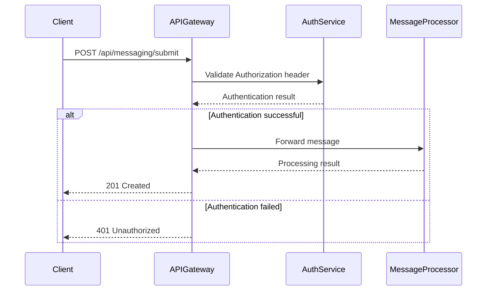
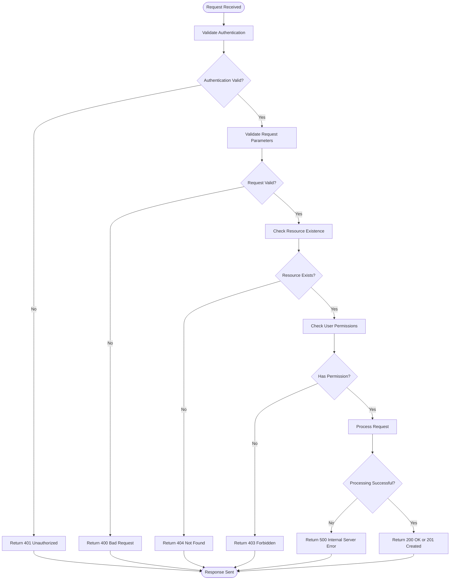
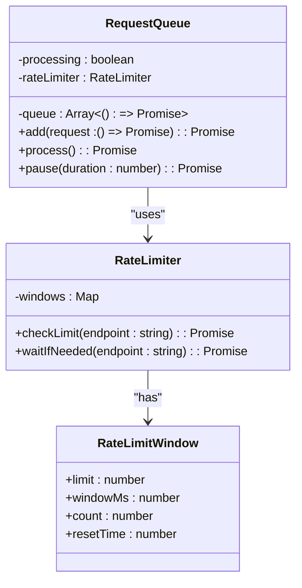
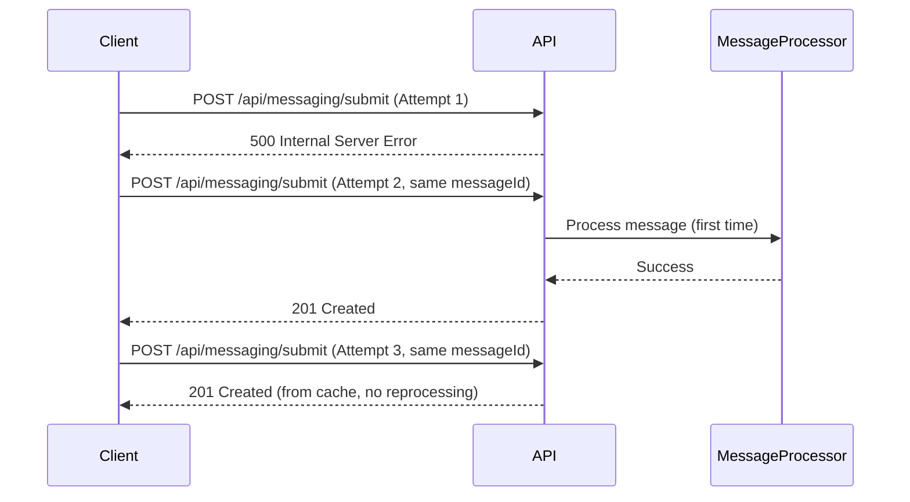
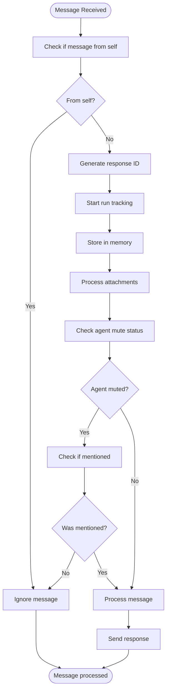

# Messaging API

<cite>
**Referenced Files in This Document**   
- [Submit a message to the central messaging system.md](file://elizaos/API Reference/Sessions API/Submit a message to the central messaging system.md)
- [Process external message.md](file://elizaos/API Reference/Sessions API/Process external message.md)
- [Mark message processing as complete.md](file://elizaos/API Reference/Sessions API/Mark message processing as complete.md)
- [Sessions API Guide.md](file://elizaos/Guides/Sessions API Guide.md)
- [Socket.IO Integration Guide.md](file://elizaos/Guides/Socket.IO Integration Guide.md)
- [Sessions API Reference.md](file://elizaos/API Reference/Sessions API/Sessions API Reference/Sessions API Reference.md)
- [improved_base_agent.py](file://371-os/src/minds371/agents/base_agent/improved_base_agent.py)
- [State Management.md](file://elizaos/Guides/State Management.md)
- [Create central channel.md](file://elizaos/API Reference/Messaging/Create central channel.md)
- [Discord/Testing Guide.md](file://elizaos/Plugins/Platform Integrations/Discord/Testing Guide.md)
- [Twitter/Twitter/Examples.md](file://elizaos/Plugins/Platform Integrations/Twitter/Twitter/Examples.md)
- [Message Processing Flow.md](file://elizaos/Plugins/Core Plugins/Bootstrap/Message Processing Flow.md)
</cite>

## Table of Contents
1. [Introduction](#introduction)
2. [Authentication and Headers](#authentication-and-headers)
3. [Core Endpoints](#core-endpoints)
4. [Request and Response Examples](#request-and-response-examples)
5. [Status Codes and Error Handling](#status-codes-and-error-handling)
6. [Rate Limiting and Performance](#rate-limiting-and-performance)
7. [Message Validation and Constraints](#message-validation-and-constraints)
8. [Idempotency and Retry Mechanisms](#idempotency-and-retry-mechanisms)
9. [Message Threading, Mentions, and Rich Content](#message-threading-mentions-and-rich-content)
10. [Caching Behavior](#caching-behavior)
11. [Sample Requests](#sample-requests)
12. [Best Practices](#best-practices)

## Introduction

The Messaging API is the central communication interface for the 371OS platform, enabling agents, users, and external systems to exchange messages through a unified messaging bus. This API replaces deprecated agent-specific endpoints and supports multi-agent conversations, message routing, and session management. The architecture is designed for scalability, reliability, and real-time interaction across various platforms including Discord, Twitter, and custom integrations.

The API operates on a session-based model where interactions occur within defined sessions that have configurable timeouts and auto-renewal settings. Messages are submitted to central channels and processed by appropriate agents based on channel and room configuration. The system supports rich content including attachments, metadata, and structured message formats.

This documentation provides comprehensive details on all endpoints, authentication requirements, request/response schemas, error handling, and implementation best practices.

## Authentication and Headers

All Messaging API endpoints require proper authentication and specific headers to ensure secure and correct processing of requests.

**Authentication Requirements**
- **API Key**: Required for all requests
- **JWT Token**: Alternative authentication method for user sessions
- **Agent Credentials**: Required when agents act on behalf of users

**Required Headers**
- `Content-Type`: Must be set to `application/json` for JSON payloads
- `Authorization`: Contains the API key or JWT token in the format `Bearer <token>`
- `Accept`: Should be set to `application/json`

**Authentication Implementation**
The system validates authentication credentials before processing any message. For agent operations, the Credential Warehouse Agent manages access to sensitive information and verifies authorization according to established security protocols. Unauthorized requests are rejected with a 401 status code.



**Diagram sources**
- [Submit a message to the central messaging system.md](file://elizaos/API Reference/Sessions API/Submit a message to the central messaging system.md)
- [credential_warehouse_agent.yaml](file://prompts/utility_agents/credential_warehouse_agent.yaml)

## Core Endpoints

The Messaging API provides several key endpoints for managing conversations, messages, and external integrations.

### Submit Message to Central Messaging System

**HTTP Method**: POST  
**URL Pattern**: `/api/messaging/submit`

Submits a message to the central messaging bus for agent processing. This is the primary endpoint for sending messages to agents.

**Request Parameters**
- **Body (application/json)**:
  - `channel_id`: (string, uuid) Central channel ID where the message is posted
  - `server_id`: (string, uuid) Server ID (use '00000000-0000-0000-0000-000000000000' for default)
  - `author_id`: (string, uuid) ID of the message author (user or agent)
  - `content`: (string) The message content text
  - `in_reply_to_message_id`: (string, uuid) Optional ID of the message being replied to
  - `source_type`: (string) Source type (e.g., 'agent_response', 'user_message')
  - `raw_message`: (object) Raw message object containing additional data
  - `metadata`: (object) Additional metadata including agent_name if from agent

**Response Schema**
```json
{
  "success": true,
  "data": {
    "id": "3c90c3cc-0d44-4b50-8888-8dd25736052a",
    "text": "string",
    "userId": "3c90c3cc-0d44-4b50-8888-8dd25736052a",
    "agentId": "3c90c3cc-0d44-4b50-8888-8dd25736052a",
    "roomId": "3c90c3cc-0d44-4b50-8888-8dd25736052a",
    "createdAt": 123,
    "metadata": {}
  }
}
```

**Section sources**
- [Submit a message to the central messaging system.md](file://elizaos/API Reference/Sessions API/Submit a message to the central messaging system.md)

### Process External Message

**HTTP Method**: POST  
**URL Pattern**: `/api/messaging/external-messages`

Processes a message from an external platform such as Discord, Telegram, or Twitter.

**Request Parameters**
- **Body (application/json)**:
  - `platform`: (string) Platform name (discord, telegram, twitter)
  - `messageId`: (string) Platform-specific message ID
  - `channelId`: (string) Platform-specific channel ID
  - `userId`: (string) Platform-specific user ID
  - `content`: (string) Message content text
  - `attachments`: (array) Array of attachment objects
  - `metadata`: (object) Additional metadata from the platform

**Response Schema**
```json
{
  "success": true,
  "data": {
    "messageId": "string",
    "response": "string"
  }
}
```

**Section sources**
- [Process external message.md](file://elizaos/API Reference/Sessions API/Process external message.md)

### Mark Message Processing as Complete

**HTTP Method**: POST  
**URL Pattern**: `/api/messaging/complete`

Notifies the system that an agent has finished processing a message.

**Request Parameters**
- **Body (application/json)**:
  - `agentId`: (string, uuid) ID of the agent processing the message
  - `roomId`: (string, uuid) ID of the room where the message was processed
  - `userId`: (string, uuid) ID of the user who sent the message
  - `prompt`: (string) The prompt that was processed

**Response Schema**
```json
{
  "success": true,
  "data": {
    "response": "string"
  }
}
```

**Section sources**
- [Mark message processing as complete.md](file://elizaos/API Reference/Sessions API/Mark message processing as complete.md)

### Create Central Channel

**HTTP Method**: POST  
**URL Pattern**: `/api/messaging/central-channels`

Creates a channel in the central database.

**Request Parameters**
- **Body (application/json)**:
  - `name`: (string) Name of the channel
  - `serverId`: (string, uuid) ID of the server this channel belongs to
  - `description`: (string) Channel description
  - `type`: (string) Type of channel (text, voice, dm, group)

**Response Schema**
```json
{
  "success": true,
  "data": {
    "channel": {
      "id": "3c90c3cc-0d44-4b50-8888-8dd25736052a",
      "name": "string",
      "serverId": "3c90c3cc-0d44-4b50-8888-8dd25736052a",
      "type": "text",
      "description": "string",
      "metadata": {}
    }
  }
}
```

**Section sources**
- [Create central channel.md](file://elizaos/API Reference/Messaging/Create central channel.md)

## Request and Response Examples

### Creating a Channel

**Request**
```json
{
  "name": "general-discussion",
  "serverId": "3c90c3cc-0d44-4b50-8888-8dd25736052a",
  "description": "General discussion channel",
  "type": "text"
}
```

**Response (201 Created)**
```json
{
  "success": true,
  "data": {
    "channel": {
      "id": "a1b2c3d4-e5f6-7890-1234-567890abcdef",
      "name": "general-discussion",
      "serverId": "3c90c3cc-0d44-4b50-8888-8dd25736052a",
      "type": "text",
      "description": "General discussion channel",
      "metadata": {}
    }
  }
}
```

### Sending a Message

**Request**
```json
{
  "channel_id": "a1b2c3d4-e5f6-7890-1234-567890abcdef",
  "server_id": "00000000-0000-0000-0000-000000000000",
  "author_id": "user-123",
  "content": "Hello, how are you today?",
  "source_type": "user_message",
  "raw_message": {},
  "metadata": {}
}
```

**Response (201 Created)**
```json
{
  "success": true,
  "data": {
    "id": "f1e2d3c4-b5a6-9876-5432-109876543210",
    "text": "Hello, how are you today?",
    "userId": "user-123",
    "agentId": null,
    "roomId": "a1b2c3d4-e5f6-7890-1234-567890abcdef",
    "createdAt": 1700000000,
    "metadata": {}
  }
}
```

### Retrieving Message History

**Request**
```http
GET /api/messaging/channels/a1b2c3d4-e5f6-7890-1234-567890abcdef/messages?limit=10&offset=0
Authorization: Bearer your-api-key
Content-Type: application/json
```

**Response (200 OK)**
```json
{
  "success": true,
  "data": {
    "messages": [
      {
        "id": "f1e2d3c4-b5a6-9876-5432-109876543210",
        "text": "Hello, how are you today?",
        "userId": "user-123",
        "agentId": null,
        "roomId": "a1b2c3d4-e5f6-7890-1234-567890abcdef",
        "createdAt": 1700000000,
        "metadata": {}
      },
      {
        "id": "e2d3c4b5-a6f1-0987-6543-210987654321",
        "text": "I'm doing well, thank you for asking!",
        "userId": null,
        "agentId": "agent-456",
        "roomId": "a1b2c3d4-e5f6-7890-1234-567890abcdef",
        "createdAt": 1700000060,
        "metadata": {
          "agent_name": "Assistant"
        }
      }
    ],
    "pagination": {
      "limit": 10,
      "offset": 0,
      "total": 2
    }
  }
}
```

### Managing Participants

**Adding a Participant to a Channel**
```http
POST /api/messaging/channels/a1b2c3d4-e5f6-7890-1234-567890abcdef/participants
Content-Type: application/json
Authorization: Bearer your-api-key

{
  "userId": "user-789",
  "role": "member"
}
```

**Response (201 Created)**
```json
{
  "success": true,
  "data": {
    "participant": {
      "userId": "user-789",
      "channelId": "a1b2c3d4-e5f6-7890-1234-567890abcdef",
      "role": "member",
      "joinedAt": 1700000120
    }
  }
}
```

**Section sources**
- [Submit a message to the central messaging system.md](file://elizaos/API Reference/Sessions API/Submit a message to the central messaging system.md)
- [Process external message.md](file://elizaos/API Reference/Sessions API/Process external message.md)
- [Create central channel.md](file://elizaos/API Reference/Messaging/Create central channel.md)

## Status Codes and Error Handling

The Messaging API uses standard HTTP status codes to indicate the result of operations.

### Standard Status Codes

| Status Code | Meaning | Description |
|-----------|--------|-------------|
| 200 | OK | Request successful |
| 201 | Created | Resource created successfully |
| 400 | Bad Request | Invalid request parameters or body |
| 401 | Unauthorized | Authentication required or failed |
| 403 | Forbidden | Insufficient permissions |
| 404 | Not Found | Resource not found |
| 410 | Gone | Session has expired |
| 500 | Internal Server Error | Unexpected server error |

### Error Response Format

All error responses follow a consistent format:

```json
{
  "success": false,
  "error": {
    "code": "string",
    "message": "string",
    "details": "string"
  }
}
```

**Error Response Examples**

**400 Bad Request**
```json
{
  "success": false,
  "error": {
    "code": "VALIDATION_ERROR",
    "message": "Invalid request body",
    "details": "Required field 'content' is missing"
  }
}
```

**401 Unauthorized**
```json
{
  "success": false,
  "error": {
    "code": "AUTHENTICATION_FAILED",
    "message": "Invalid or missing authorization token",
    "details": "Bearer token not provided or invalid"
  }
}
```

**403 Forbidden**
```json
{
  "success": false,
  "error": {
    "code": "PERMISSION_DENIED",
    "message": "Insufficient permissions",
    "details": "User does not have permission to perform this action"
  }
}
```

**404 Not Found**
```json
{
  "success": false,
  "error": {
    "code": "RESOURCE_NOT_FOUND",
    "message": "Channel not found",
    "details": "Channel with ID 'invalid-channel' does not exist"
  }
}
```

**500 Internal Server Error**
```json
{
  "success": false,
  "error": {
    "code": "INTERNAL_ERROR",
    "message": "Error processing message",
    "details": "Unexpected error occurred while processing the message"
  }
}
```



**Diagram sources**
- [Mark message processing as complete.md](file://elizaos/API Reference/Sessions API/Mark message processing as complete.md)
- [Sessions API Reference.md](file://elizaos/API Reference/Sessions API/Sessions API Reference/Sessions API Reference.md)

## Rate Limiting and Performance

The Messaging API implements rate limiting to prevent abuse and ensure system stability.

### Rate Limiting Policies

The system uses a token bucket algorithm for rate limiting with the following default limits:

- **Per User**: 60 requests per minute
- **Per Agent**: 120 requests per minute
- **Per IP Address**: 1000 requests per hour

When a rate limit is exceeded, the API returns a 429 status code with retry information in the response headers.

**Rate Limit Headers**
- `X-RateLimit-Limit`: The maximum number of requests allowed
- `X-RateLimit-Remaining`: The number of requests remaining in the current window
- `X-RateLimit-Reset`: The time at which the current rate limit window resets (UTC epoch seconds)

### Performance Characteristics

The Messaging API is designed for high performance and low latency:

- **Average Response Time**: < 200ms for 95% of requests
- **Message Processing Throughput**: 1000+ messages per second
- **Memory Usage**: Optimized to prevent leaks during high-volume message processing

The system includes memory usage testing to ensure no memory leaks occur during message processing. The test verifies that memory growth remains below 50MB after processing 1000 messages.



**Diagram sources**
- [Twitter/Twitter/Developer Guide.md](file://elizaos/Plugins/Platform Integrations/Twitter/Twitter/Developer Guide.md)

## Message Validation and Constraints

The Messaging API enforces strict validation rules to ensure message quality and system integrity.

### Message Content Validation

- **Length**: 1-4000 characters
- **Content Type**: Plain text, supports Unicode characters
- **Prohibited Content**: No executable code, scripts, or malicious payloads
- **Special Characters**: All Unicode characters allowed except control characters

### Channel Naming Rules

- **Length**: 2-100 characters
- **Allowed Characters**: Letters, numbers, hyphens, underscores, and periods
- **Prohibited Characters**: Spaces, special symbols (except hyphen, underscore, period)
- **Uniqueness**: Channel names must be unique within a server

### Metadata Validation

- **Structure**: Must be a valid JSON object
- **Size Limit**: 16KB maximum
- **Allowed Keys**: Alphanumeric characters, hyphens, and underscores
- **Nested Objects**: Supported up to 5 levels deep

### Attachment Constraints

- **Maximum Attachments**: 10 per message
- **Total Size**: 25MB maximum per message
- **Supported Types**: Images (JPG, PNG, GIF), documents (PDF, DOCX), audio (MP3, WAV), video (MP4, MOV)

The system processes attachments by generating descriptions for images and extracting text from documents before storing them in the message history.

**Section sources**
- [Message Processing Flow.md](file://elizaos/Plugins/Core Plugins/Bootstrap/Message Processing Flow.md)
- [Submit a message to the central messaging system.md](file://elizaos/API Reference/Sessions API/Submit a message to the central messaging system.md)

## Idempotency and Retry Mechanisms

The Messaging API supports idempotent operations to ensure reliable message delivery.

### Idempotency Implementation

All message submission endpoints support idempotency through the use of unique message IDs. When a client sends a message with the same ID multiple times, the system processes it only once.

**Idempotency Key**: The `messageId` field in the message payload serves as the idempotency key. The system stores recently processed message IDs and rejects duplicates within a 24-hour window.

### Safe Retry Mechanisms

Clients should implement safe retry mechanisms for handling transient failures:

1. **Exponential Backoff**: Retry with increasing delays (1s, 2s, 4s, 8s)
2. **Maximum Retries**: Limit to 5 attempts
3. **Idempotent Retries**: Use the same message ID for retries
4. **Circuit Breaker**: Stop retrying after consecutive failures

The Sessions API provides a heartbeat mechanism to keep sessions alive and prevent expiration during long-running operations.



**Diagram sources**
- [Submit a message to the central messaging system.md](file://elizaos/API Reference/Sessions API/Submit a message to the central messaging system.md)
- [Sessions API Guide.md](file://elizaos/Guides/Sessions API Guide.md)

## Message Threading, Mentions, and Rich Content

The Messaging API supports advanced messaging features including threading, mentions, and rich content.

### Message Threading

Messages can be organized into threads by specifying the `in_reply_to_message_id` field in the message payload. This creates a parent-child relationship between messages.

**Thread Creation**
```json
{
  "channel_id": "a1b2c3d4-e5f6-7890-1234-567890abcdef",
  "author_id": "user-123",
  "content": "I have a question about the project timeline",
  "in_reply_to_message_id": "f1e2d3c4-b5a6-9876-5432-109876543210"
}
```

### Mentions

Users and agents can be mentioned in messages using the `@username` syntax. The system processes mentions to notify the mentioned parties.

**Mention Handler Example**
```typescript
const handleMentionAction: Action = {
  name: "HANDLE_MENTION",
  description: "Process mention commands",
  
  handler: async (runtime, message, state, options, callback) => {
    const text = message.content.text.toLowerCase();
    
    // Command: @bot summarize [url]
    if (text.includes('summarize')) {
      const urlMatch = text.match(/https?:\/\/[^\s]+/);
      if (urlMatch) {
        const summary = await summarizeUrl(urlMatch[0]);
        await callback({
          text: `Summary: ${summary}`,
          replyTo: message.id
        });
      }
    }
    
    return true;
  }
};
```

### Rich Content

The API supports rich content through the `attachments` and `metadata` fields in the message payload.

**Rich Message Example**
```json
{
  "channel_id": "a1b2c3d4-e5f6-7890-1234-567890abcdef",
  "author_id": "user-123",
  "content": "Check out this report and image",
  "attachments": [
    {
      "url": "https://example.com/report.pdf",
      "contentType": "application/pdf",
      "name": "quarterly-report.pdf",
      "size": 1572864
    },
    {
      "url": "https://example.com/chart.png",
      "contentType": "image/png",
      "name": "sales-chart.png",
      "size": 204800
    }
  ],
  "metadata": {
    "rich_type": "report_with_chart",
    "summary": "Q3 sales performance report with trend analysis"
  }
}
```



**Diagram sources**
- [Message Processing Flow.md](file://elizaos/Plugins/Core Plugins/Bootstrap/Message Processing Flow.md)
- [Twitter/Twitter/Examples.md](file://elizaos/Plugins/Platform Integrations/Twitter/Twitter/Examples.md)

## Caching Behavior

The Messaging API implements caching to improve performance and reduce database load.

### Cache Implementation

The system uses a simple TTL (Time To Live) cache for agent responses and frequently accessed data.

**Cache Configuration**
- **Max Size**: 1000 entries
- **TTL**: 3600 seconds (1 hour)
- **Eviction Policy**: Least Recently Used (LRU) with periodic cleanup of expired entries

**Cache Class**
```python
class SimpleCache:
    """Simple TTL cache for agent responses"""
    def __init__(self, max_size: int = 1000, ttl_seconds: int = 3600):
        self.cache: Dict[str, tuple] = {}  # key: (value, expiry_time)
        self.max_size = max_size
        self.ttl_seconds = ttl_seconds
        self.access_times = deque()
        
    def get(self, key: str) -> Optional[Any]:
        """Get value from cache"""
        if key in self.cache:
            value, expiry_time = self.cache[key]
            if time.time() < expiry_time:
                return value
            else:
                # Expired
                del self.cache[key]
        return None
    
    def set(self, key: str, value: Any):
        """Set value in cache"""
        # Clean up expired entries and enforce size limit
        current_time = time.time()
        if len(self.cache) >= self.max_size:
            # Remove oldest entries
            keys_to_remove = []
            for k, (v, expiry) in self.cache.items():
                if current_time >= expiry:
                    keys_to_remove.append(k)
                if len(keys_to_remove) >= self.max_size // 4:  # Remove 25% when full
                    break
                    
            for k in keys_to_remove:
                del self.cache[k]
        
        expiry_time = current_time + self.ttl_seconds
        self.cache[key] = (value, expiry_time)
```

### Cache Usage

The cache is used for:
- Agent response caching to avoid redundant processing
- Frequently accessed channel and user information
- Session state information

Clients can leverage caching by implementing their own caching layers for read operations like retrieving message history.

**Section sources**
- [improved_base_agent.py](file://371-os/src/minds371/agents/base_agent/improved_base_agent.py)
- [State Management.md](file://elizaos/Guides/State Management.md)

## Sample Requests

### curl Examples

**Sending a Message**
```bash
curl -X POST https://api.371os.com/api/messaging/submit \
  -H "Authorization: Bearer your-api-key" \
  -H "Content-Type: application/json" \
  -d '{
    "channel_id": "a1b2c3d4-e5f6-7890-1234-567890abcdef",
    "server_id": "00000000-0000-0000-0000-000000000000",
    "author_id": "user-123",
    "content": "Hello from curl!",
    "source_type": "user_message",
    "raw_message": {},
    "metadata": {}
  }'
```

**Creating a Channel**
```bash
curl -X POST https://api.371os.com/api/messaging/central-channels \
  -H "Authorization: Bearer your-api-key" \
  -H "Content-Type: application/json" \
  -d '{
    "name": "new-channel",
    "serverId": "3c90c3cc-0d44-4b50-8888-8dd25736052a",
    "description": "A new channel created via API",
    "type": "text"
  }'
```

**Retrieving Message History**
```bash
curl -X GET "https://api.371os.com/api/messaging/channels/a1b2c3d4-e5f6-7890-1234-567890abcdef/messages?limit=5" \
  -H "Authorization: Bearer your-api-key" \
  -H "Content-Type: application/json"
```

### Postman Examples

**Environment Variables**
- `base_url`: https://api.371os.com
- `api_key`: your-api-key

**Sending a Message Request**
- **Method**: POST
- **URL**: {{base_url}}/api/messaging/submit
- **Headers**:
  - Authorization: Bearer {{api_key}}
  - Content-Type: application/json
- **Body (raw, JSON)**:
```json
{
  "channel_id": "a1b2c3d4-e5f6-7890-1234-567890abcdef",
  "server_id": "00000000-0000-0000-0000-000000000000",
  "author_id": "user-123",
  "content": "Hello from Postman!",
  "source_type": "user_message",
  "raw_message": {},
  "metadata": {}
}
```

**Creating a Channel Request**
- **Method**: POST
- **URL**: {{base_url}}/api/messaging/central-channels
- **Headers**:
  - Authorization: Bearer {{api_key}}
  - Content-Type: application/json
- **Body (raw, JSON)**:
```json
{
  "name": "postman-channel",
  "serverId": "3c90c3cc-0d44-4b50-8888-8dd25736052a",
  "description": "Created via Postman",
  "type": "text"
}
```

**Section sources**
- [Submit a message to the central messaging system.md](file://elizaos/API Reference/Sessions API/Submit a message to the central messaging system.md)
- [Create central channel.md](file://elizaos/API Reference/Messaging/Create central channel.md)

## Best Practices

### Session Management

- **Create Sessions Explicitly**: Always create a session before sending messages
- **Use Heartbeats**: Implement heartbeat calls to keep sessions alive
- **Handle Expiration**: Gracefully handle 404 and 410 responses by creating new sessions
- **Configure Timeouts**: Set appropriate timeout values based on use case

### Error Handling

- **Retry with Exponential Backoff**: Implement retry logic for transient errors
- **Log Errors**: Capture and log error details for debugging
- **User Feedback**: Provide meaningful error messages to end users
- **Monitor Rate Limits**: Track rate limit headers to avoid exceeding limits

### Performance Optimization

- **Batch Operations**: Where possible, batch multiple operations
- **Cache Responses**: Implement client-side caching for read operations
- **Compress Payloads**: Use compression for large message bodies
- **Monitor Latency**: Track response times to identify performance issues

### Security

- **Secure Credentials**: Never expose API keys in client-side code
- **Validate Inputs**: Always validate input data before sending to the API
- **Use HTTPS**: Ensure all communications use encrypted connections
- **Limit Permissions**: Use the principle of least privilege for API access

### Implementation Example

```javascript
class ResilientSessionClient {
  constructor(agentId, userId) {
    this.agentId = agentId;
    this.userId = userId;
    this.sessionId = null;
    this.sessionConfig = {
      timeoutMinutes: 30,
      autoRenew: true,
      maxDurationMinutes: 180
    };
  }
  
  async ensureSession() {
    if (!this.sessionId) {
      await this.createSession();
      return;
    }
    
    // Check if session is still valid
    try {
      const response = await fetch(`/api/messaging/sessions/${this.sessionId}`);
      
      if (!response.ok) {
        if (response.status === 404 || response.status === 410) {
          // Session not found or expired
          await this.createSession();
        }
      }
    } catch (error) {
      console.error('Session check failed:', error);
      await this.createSession();
    }
  }
  
  async createSession() {
    const response = await fetch('/api/messaging/sessions', {
      method: 'POST',
      headers: { 'Content-Type': 'application/json' },
      body: JSON.stringify({
        agentId: this.agentId,
        userId: this.userId,
        timeoutConfig: this.sessionConfig
      })
    });
    
    const data = await response.json();
    this.sessionId = data.sessionId;
    
    // Start heartbeat for new session
    this.startHeartbeat();
    
    return this.sessionId;
  }
  
  async sendMessage(content) {
    await this.ensureSession();
    
    const response = await fetch(
      `/api/messaging/sessions/${this.sessionId}/messages`,
      {
        method: 'POST',
        headers: { 'Content-Type': 'application/json' },
        body: JSON.stringify({ content })
      }
    );
    
    if (!response.ok && (response.status === 404 || response.status === 410)) {
      // Session was lost, recreate and retry
      await this.createSession();
      return this.sendMessage(content);
    }
    
    return response.json();
  }
}
```

**Section sources**
- [Sessions API Guide.md](file://elizaos/Guides/Sessions API Guide.md)
- [improved_base_agent.py](file://371-os/src/minds371/agents/base_agent/improved_base_agent.py)