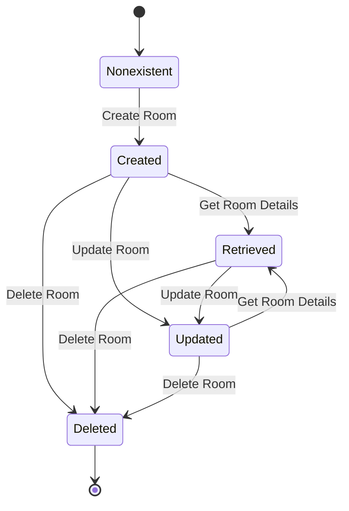
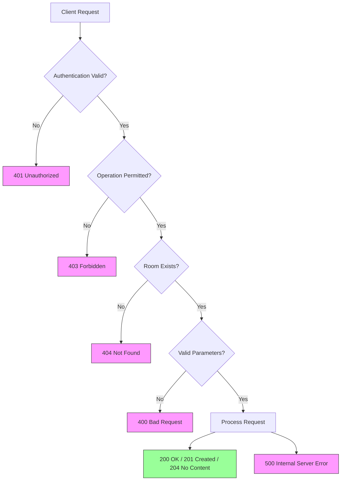
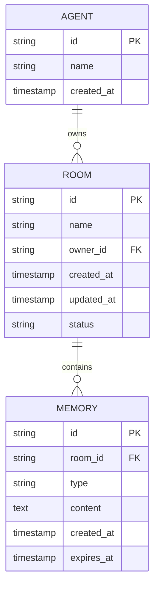

# Rooms API

<cite>
**Referenced Files in This Document**   
- [create_a_room.md](file://elizaos/API%20Reference/Memory/Create%20a%20room.md)
- [delete_a_room.md](file://elizaos/API%20Reference/Memory/Delete%20a%20room.md)
- [get_agent_rooms.md](file://elizaos/API%20Reference/Memory/Get%20agent%20rooms.md)
- [get_room_details.md](file://elizaos/API%20Reference/Memory/Get%20room%20details.md)
- [update_a_room.md](file://elizaos/API%20Reference/Memory/Update%20a%20room.md)
</cite>

## Table of Contents
1. [Introduction](#introduction)
2. [Authentication and Access Control](#authentication-and-access-control)
3. [Room Lifecycle Management](#room-lifecycle-management)
4. [Endpoint Reference](#endpoint-reference)
5. [Room Configuration Schema](#room-configuration-schema)
6. [Error Handling](#error-handling)
7. [Rate Limiting and Performance](#rate-limiting-and-performance)
8. [Relationships with Agents and Memory](#relationships-with-agents-and-memory)
9. [Sample Commands](#sample-commands)
10. [Best Practices](#best-practices)

## Introduction

The Rooms API in the 371OS platform provides a structured mechanism for managing persistent conversational and operational contexts known as "rooms." These rooms serve as containers for agent interactions, memory storage, and collaborative workflows. This API enables agents and administrators to create, retrieve, update, and delete rooms, as well as list all rooms associated with a specific agent.

Rooms are central to the platform's agentic architecture, enabling stateful interactions, memory persistence, and multi-agent coordination. Each room is owned by an agent and can be configured with specific parameters that define its behavior, access policies, and integration points.

This documentation details all available endpoints, request/response formats, authentication requirements, and usage patterns for effective room management within the 371OS ecosystem.

## Authentication and Access Control

### Authentication Requirements
All Rooms API endpoints require authentication via API keys. Two levels of access are supported:

- **Agent-level API keys**: Allow agents to manage rooms they own
- **Admin API keys**: Grant full access to all rooms across the system

**Required Header**:
```
Authorization: Bearer <API_KEY>
```

### Access Control Policies
Access to room operations is governed by ownership-based policies:

- **Room Creation**: Agents can create rooms using their own API keys
- **Room Retrieval**: Agents can retrieve their own rooms; admins can retrieve any room
- **Room Updates**: Only the owning agent or an admin can modify a room
- **Room Deletion**: Only the owning agent or an admin can delete a room

Ownership is established at creation time and cannot be transferred. The system validates ownership on every request by comparing the authenticated agent ID with the room's owner field.

**Section sources**
- [create_a_room.md](file://elizaos/API%20Reference/Memory/Create%20a%20room.md)
- [get_room_details.md](file://elizaos/API%20Reference/Memory/Get%20room%20details.md)

## Room Lifecycle Management

The room lifecycle consists of four primary operations: creation, retrieval, update, and deletion. Each room maintains a state that evolves through these operations.



**Diagram sources**
- [create_a_room.md](file://elizaos/API%20Reference/Memory/Create%20a%20room.md)
- [get_room_details.md](file://elizaos/API%20Reference/Memory/Get%20room%20details.md)
- [update_a_room.md](file://elizaos/API%20Reference/Memory/Update%20a%20room.md)
- [delete_a_room.md](file://elizaos/API%20Reference/Memory/Delete%20a%20room.md)

## Endpoint Reference

### Create a Room
Creates a new room with specified configuration.

- **HTTP Method**: POST
- **URL Pattern**: `/api/v1/rooms`
- **Request Body**: JSON object containing room configuration (see Room Configuration Schema)

**Success Response (201 Created)**:
```json
{
  "id": "room_12345",
  "name": "Project Alpha",
  "owner_id": "agent_67890",
  "created_at": "2023-12-01T10:00:00Z",
  "updated_at": "2023-12-01T10:00:00Z",
  "config": {
    "memory_system": "vector",
    "retention_policy": "30d",
    "access_control": "private"
  },
  "status": "active"
}
```

**Section sources**
- [create_a_room.md](file://elizaos/API%20Reference/Memory/Create%20a%20room.md)

### Get Room Details
Retrieves information about a specific room.

- **HTTP Method**: GET
- **URL Pattern**: `/api/v1/rooms/{room_id}`
- **Path Parameters**:
  - `room_id`: Unique identifier of the room

**Success Response (200 OK)**:
```json
{
  "id": "room_12345",
  "name": "Project Alpha",
  "owner_id": "agent_67890",
  "created_at": "2023-12-01T10:00:00Z",
  "updated_at": "2023-12-01T10:30:00Z",
  "config": {
    "memory_system": "vector",
    "retention_policy": "30d",
    "access_control": "private"
  },
  "status": "active",
  "memory_usage_kb": 156
}
```

**Section sources**
- [get_room_details.md](file://elizaos/API%20Reference/Memory/Get%20room%20details.md)

### Update a Room
Modifies the configuration of an existing room.

- **HTTP Method**: PUT
- **URL Pattern**: `/api/v1/rooms/{room_id}`
- **Path Parameters**:
  - `room_id`: Unique identifier of the room
- **Request Body**: JSON object with fields to update

**Success Response (200 OK)**:
```json
{
  "id": "room_12345",
  "name": "Project Alpha Updated",
  "owner_id": "agent_67890",
  "created_at": "2023-12-01T10:00:00Z",
  "updated_at": "2023-12-01T11:00:00Z",
  "config": {
    "memory_system": "hybrid",
    "retention_policy": "90d",
    "access_control": "team"
  },
  "status": "active"
}
```

**Section sources**
- [update_a_room.md](file://elizaos/API%20Reference/Memory/Update%20a%20room.md)

### Delete a Room
Removes a room and all associated data.

- **HTTP Method**: DELETE
- **URL Pattern**: `/api/v1/rooms/{room_id}`
- **Path Parameters**:
  - `room_id`: Unique identifier of the room

**Success Response (204 No Content)**:
No response body is returned on successful deletion.

**Section sources**
- [delete_a_room.md](file://elizaos/API%20Reference/Memory/Delete%20a%20room.md)

### Get Agent Rooms
Lists all rooms associated with a specific agent.

- **HTTP Method**: GET
- **URL Pattern**: `/api/v1/agents/{agent_id}/rooms`
- **Path Parameters**:
  - `agent_id`: Unique identifier of the agent
- **Query Parameters**:
  - `status`: Filter by room status (active, archived, deleted)
  - `limit`: Maximum number of results to return
  - `offset`: Number of results to skip for pagination

**Success Response (200 OK)**:
```json
{
  "rooms": [
    {
      "id": "room_12345",
      "name": "Project Alpha",
      "owner_id": "agent_67890",
      "created_at": "2023-12-01T10:00:00Z",
      "updated_at": "2023-12-01T11:00:00Z",
      "config": {
        "memory_system": "hybrid",
        "retention_policy": "90d",
        "access_control": "team"
      },
      "status": "active"
    }
  ],
  "total_count": 1,
  "limit": 10,
  "offset": 0
}
```

**Section sources**
- [get_agent_rooms.md](file://elizaos/API%20Reference/Memory/Get%20agent%20rooms.md)

## Room Configuration Schema

The room configuration object defines the behavior and properties of a room. All fields are optional when creating a room, with system defaults applied if omitted.

```json
{
  "config": {
    "memory_system": "string",
    "retention_policy": "string",
    "access_control": "string",
    "max_participants": "integer",
    "enable_logging": "boolean",
    "sensitive_data": "boolean"
  }
}
```

### Configuration Fields

- **memory_system**: Specifies the memory storage backend
  - Values: `"vector"`, `"graph"`, `"hybrid"`, `"none"`
  - Default: `"vector"`

- **retention_policy**: Data retention duration
  - Format: Number followed by unit (d=days, h=hours)
  - Values: `"7d"`, `"30d"`, `"90d"`, `"1y"`, `"infinite"`
  - Default: `"30d"`

- **access_control**: Room visibility and access permissions
  - Values: `"private"`, `"team"`, `"organization"`, `"public"`
  - Default: `"private"`

- **max_participants**: Maximum number of agents that can join
  - Range: 1-100
  - Default: 10

- **enable_logging**: Whether to log interactions in the room
  - Values: `true`, `false`
  - Default: `true`

- **sensitive_data**: Indicates if room contains sensitive information
  - Values: `true`, `false`
  - Default: `false`
  - When true, additional encryption and access controls are applied

**Section sources**
- [create_a_room.md](file://elizaos/API%20Reference/Memory/Create%20a%20room.md)
- [update_a_room.md](file://elizaos/API%20Reference/Memory/Update%20a%20room.md)

## Error Handling

The Rooms API returns standardized error responses with appropriate HTTP status codes.



**Diagram sources**
- [create_a_room.md](file://elizaos/API%20Reference/Memory/Create%20a%20room.md)
- [get_room_details.md](file://elizaos/API%20Reference/Memory/Get%20room%20details.md)
- [update_a_room.md](file://elizaos/API%20Reference/Memory/Update%20a%20room.md)
- [delete_a_room.md](file://elizaos/API%20Reference/Memory/Delete%20a%20room.md)

### HTTP Status Codes

- **200 OK**: Request successful, resource returned
- **201 Created**: Room successfully created
- **204 No Content**: Room successfully deleted
- **400 Bad Request**: Invalid request parameters or body
- **401 Unauthorized**: Missing or invalid authentication credentials
- **403 Forbidden**: Authenticated but lacks permission for operation
- **404 Not Found**: Specified room or agent does not exist
- **429 Too Many Requests**: Rate limit exceeded
- **500 Internal Server Error**: Server encountered an unexpected condition

Error responses follow this format:
```json
{
  "error": {
    "code": "string",
    "message": "string",
    "details": "object"
  }
}
```

## Rate Limiting and Performance

### Rate Limiting
To prevent abuse and ensure system stability, room creation is subject to rate limiting:

- **Per Agent**: 10 room creations per minute
- **Per Organization**: 100 room creations per minute
- **Burst Capacity**: 2x the normal rate for short bursts

When limits are exceeded, the API returns a 429 Too Many Requests status code with a `Retry-After` header indicating when the client can retry.

### Performance Implications
Large room collections can impact performance in the following ways:

- **List Operations**: Retrieving large numbers of rooms may require pagination
- **Memory Usage**: Each active room consumes memory resources
- **Query Latency**: Complex queries across many rooms may experience increased latency

Best practices include:
- Using pagination for agent room listings
- Archiving inactive rooms rather than keeping them active
- Monitoring memory usage through the room details endpoint
- Implementing client-side caching for frequently accessed room data

**Section sources**
- [get_agent_rooms.md](file://elizaos/API%20Reference/Memory/Get%20agent%20rooms.md)

## Relationships with Agents and Memory

Rooms are intrinsically linked to agents and memory systems within the 371OS platform.



**Diagram sources**
- [create_a_room.md](file://elizaos/API%20Reference/Memory/Create%20a%20room.md)
- [get_room_details.md](file://elizaos/API%20Reference/Memory/Get%20room%20details.md)

### Agent-Room Relationship
- Each room has exactly one owner agent
- Agents can own multiple rooms
- Room ownership determines access control and billing responsibility
- Agents can invite other agents to join rooms based on access control settings

### Room-Memory Relationship
- Each room has an associated memory system as specified in its configuration
- Memory persistence is tied to the room's retention policy
- Memory can be cleared independently of the room using the Delete All Room Memories endpoint
- The memory system type affects query performance and capabilities

## Sample Commands

### Create a Room
```bash
curl -X POST https://api.371os.com/api/v1/rooms \
  -H "Authorization: Bearer YOUR_API_KEY" \
  -H "Content-Type: application/json" \
  -d '{
    "name": "Project Development",
    "config": {
      "memory_system": "hybrid",
      "retention_policy": "90d",
      "access_control": "team",
      "max_participants": 25
    }
  }'
```

### List Agent Rooms
```bash
curl -X GET https://api.371os.com/api/v1/agents/agent_67890/rooms?status=active \
  -H "Authorization: Bearer YOUR_API_KEY"
```

### Update Room Configuration
```bash
curl -X PUT https://api.371os.com/api/v1/rooms/room_12345 \
  -H "Authorization: Bearer YOUR_API_KEY" \
  -H "Content-Type: application/json" \
  -d '{
    "config": {
      "retention_policy": "1y",
      "enable_logging": false
    }
  }'
```

### Delete a Room
```bash
curl -X DELETE https://api.371os.com/api/v1/rooms/room_12345 \
  -H "Authorization: Bearer YOUR_API_KEY"
```

## Best Practices

1. **Use Descriptive Names**: Room names should clearly indicate their purpose
2. **Set Appropriate Retention**: Choose retention policies based on data sensitivity and usage patterns
3. **Manage Participants**: Limit participants to those who need access
4. **Monitor Usage**: Regularly check memory usage and performance metrics
5. **Handle Errors Gracefully**: Implement retry logic for rate-limited requests
6. **Secure Sensitive Data**: Mark rooms with sensitive data appropriately for enhanced protection
7. **Clean Up**: Delete or archive rooms that are no longer needed to conserve resources