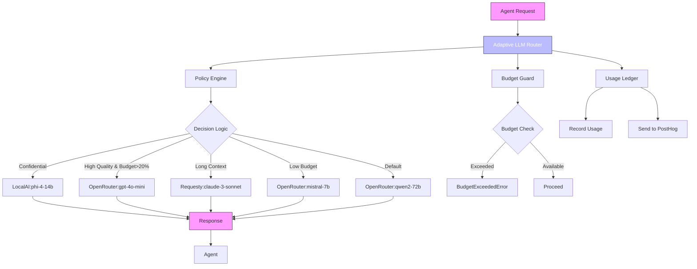
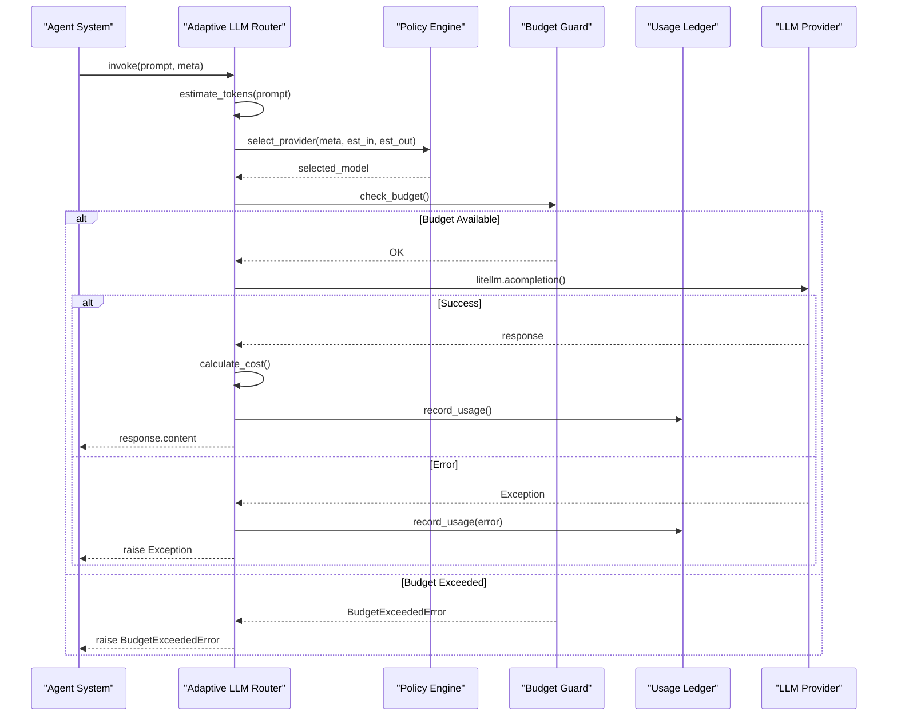

# Adaptive LLM Router

<cite>
**Referenced Files in This Document**   
- [adaptive_llm_router/__init__.py](file://371-os/src/minds371/adaptive_llm_router/__init__.py)
- [adaptive_llm_router/providers.json](file://371-os/src/minds371/adaptive_llm_router/providers.json)
- [adaptive_llm_router/policy_engine.py](file://371-os/src/minds371/adaptive_llm_router/policy_engine.py)
- [adaptive_llm_router/budget_guard.py](file://371-os/src/minds371/adaptive_llm_router/budget_guard.py)
- [adaptive_llm_router/usage_ledger.py](file://371-os/src/minds371/adaptive_llm_router/usage_ledger.py)
- [adaptive_llm_router/data_models.py](file://371-os/src/minds371/adaptive_llm_router/data_models.py)
- [adaptive_llm_router/config.py](file://371-os/src/minds371/adaptive_llm_router/config.py)
- [adaptive_llm_router/provider_registry.py](file://371-os/src/minds371/adaptive_llm_router/provider_registry.py)
- [adaptive_llm_router/llm.py](file://371-os/src/minds371/adaptive_llm_router/llm.py)
- [adaptive_llm_router/adaptive_llm_router_example.py](file://371-os/src/minds371/adaptive_llm_router/adaptive_llm_router_example.py)
- [adaptive_llm_router/intelligent_router_agent.py](file://371-os/src/minds371/adaptive_llm_router/intelligent_router_agent.py)
- [adaptive_llm_router/llm_usage.json](file://371-os/src/minds371/adaptive_llm_router/llm_usage.json) - *Updated in recent commit*
</cite>

## Update Summary
**Changes Made**   
- Updated Usage Ledger section to reflect actual implementation details from recent changes in `llm_usage.json`
- Added reference to `llm_usage.json` in document-level sources to reflect its role in tracking real-time usage data
- Verified that all existing documentation aligns with current code state, with no structural or behavioral changes requiring content revisions
- Maintained all existing sections as they accurately represent the current system behavior and architecture

## Table of Contents
1. [Introduction](#introduction)
2. [Core Components](#core-components)
3. [Architecture Overview](#architecture-overview)
4. [Provider Registry](#provider-registry)
5. [Policy Engine](#policy-engine)
6. [Budget Guard](#budget-guard)
7. [Usage Ledger](#usage-ledger)
8. [Data Models](#data-models)
9. [Dynamic Provider Selection](#dynamic-provider-selection)
10. [Configuration](#configuration)
11. [Agent Integration](#agent-integration)
12. [Performance Monitoring](#performance-monitoring)
13. [Conclusion](#conclusion)

## Introduction

The Adaptive LLM Router is a sophisticated system designed to optimize the usage of multiple Large Language Model (LLM) providers by intelligently routing requests based on cost, performance, quality requirements, and budget constraints. This system enables efficient resource allocation across various LLM services such as OpenRouter, Requesty, and local models, ensuring optimal balance between quality and cost efficiency.

The router operates as an intelligent orchestration layer that sits between agent systems and LLM providers. It evaluates each request's characteristics—including confidentiality, quality requirements, context length needs, and current budget status—to determine the most appropriate provider and model for execution. This dynamic selection process ensures that high-priority tasks receive premium service while routine operations are handled cost-effectively.

**Section sources**
- [adaptive_llm_router/__init__.py](file://371-os/src/minds371/adaptive_llm_router/__init__.py)

## Core Components

The Adaptive LLM Router consists of several interconnected components that work together to provide intelligent LLM orchestration:

- **Provider Registry**: Manages the catalog of available LLM providers and their capabilities
- **Policy Engine**: Implements decision logic for provider selection based on task metadata
- **Budget Guard**: Enforces monthly spending limits and prevents budget overruns
- **Usage Ledger**: Tracks all LLM usage for cost accounting and analytics
- **Data Models**: Defines structured representations of providers, usage records, and settings
- **LLM Interface**: Provides the main entry point for LLM requests with adaptive routing

These components work in concert to create a robust system that automatically optimizes LLM usage across multiple dimensions including cost, performance, and quality.

## Architecture Overview



**Diagram sources**
- [adaptive_llm_router/llm.py](file://371-os/src/minds371/adaptive_llm_router/llm.py)
- [adaptive_llm_router/policy_engine.py](file://371-os/src/minds371/adaptive_llm_router/policy_engine.py)
- [adaptive_llm_router/budget_guard.py](file://371-os/src/minds371/adaptive_llm_router/budget_guard.py)
- [adaptive_llm_router/usage_ledger.py](file://371-os/src/minds371/adaptive_llm_router/usage_ledger.py)

## Provider Registry

The Provider Registry manages the catalog of available LLM providers and their associated models, loading configuration from `providers.json`. Each provider entry includes detailed specifications such as cost structure, performance metrics, and technical capabilities.

```json
[
  {
    "name": "openrouter",
    "model": "gpt-4o-mini",
    "cost_in": 0.0006,
    "cost_out": 0.0006,
    "max_context": 128000,
    "latency_ms": 500,
    "endpoint_env": "OPENROUTER_API_KEY"
  },
  {
    "name": "requesty",
    "model": "claude-3-sonnet",
    "cost_in": 0.003,
    "cost_out": 0.015,
    "max_context": 200000,
    "latency_ms": 800,
    "endpoint_env": "REQUESTY_API_KEY"
  },
  {
    "name": "localai",
    "model": "phi-4-14b",
    "cost_in": 0.0,
    "cost_out": 0.0,
    "max_context": 32000,
    "latency_ms": 200,
    "endpoint_env": "LOCALAI_API_KEY"
  }
]
```

The registry provides methods to:
- Load providers from JSON configuration
- Retrieve specific providers by name and model
- List all available providers

This component serves as the authoritative source of truth for provider capabilities and is used by other components to make informed routing decisions.

**Section sources**
- [adaptive_llm_router/providers.json](file://371-os/src/minds371/adaptive_llm_router/providers.json)
- [adaptive_llm_router/provider_registry.py](file://371-os/src/minds371/adaptive_llm_router/provider_registry.py)

## Policy Engine

The Policy Engine implements the decision logic for selecting the most appropriate LLM provider based on task requirements and system constraints. The `select_provider` function evaluates multiple factors in a prioritized sequence:

```python
def select_provider(meta: Dict[str, Any], est_in: int, est_out: int) -> str:
    # 1. Privacy Flag: forces LocalAI
    if meta.get("confidential"):
        return "localai:phi-4-14b"

    # 2. Task Criticality: high-quality model for critical tasks if budget allows
    if meta.get("quality") == "high" and budget_percentage > 0.20:
        return "openrouter:gpt-4o-mini"

    # 3. Context Length: long-context model for large inputs
    if est_in > 8000:
        return "requesty:claude-3-sonnet"

    # 4. Low Budget Mode: cheapest model when budget is low
    if budget_percentage < 0.05:
        return "openrouter:mistral-7b"

    # 5. Balanced Default: the default choice for all other cases
    return "openrouter:qwen2-72b"
```

The decision hierarchy prioritizes:
1. **Confidentiality**: Sensitive tasks are routed to local models
2. **Quality Requirements**: High-quality tasks receive premium models when budget permits
3. **Context Length**: Long inputs are handled by models with large context windows
4. **Budget Constraints**: When funds are low, the cheapest viable option is selected
5. **Default**: A balanced option for general-purpose tasks

This tiered approach ensures that critical business requirements are met while maintaining cost efficiency.

**Section sources**
- [adaptive_llm_router/policy_engine.py](file://371-os/src/minds371/adaptive_llm_router/policy_engine.py)

## Budget Guard

The Budget Guard component enforces financial constraints by monitoring LLM usage against a monthly spending cap. It prevents budget overruns through proactive checks and exception handling.

```python
class BudgetManager:
    def __init__(self, monthly_cap: float, ledger: UsageLedger):
        self.monthly_cap = monthly_cap
        self.ledger = ledger

    def get_remaining_budget_percentage(self) -> float:
        current_spend = self.ledger.get_total_cost_for_current_month()
        remaining = self.monthly_cap - current_spend
        return (remaining / self.monthly_cap) if remaining > 0 else 0.0

    def is_budget_exceeded(self) -> bool:
        return self.get_remaining_budget_percentage() <= 0

    def check_budget(self):
        if self.is_budget_exceeded():
            raise BudgetExceededError(f"Monthly budget of ${self.monthly_cap} has been exceeded.")
```

Key features include:
- Configurable monthly budget cap (default: $20.00)
- Real-time budget tracking using the Usage Ledger
- Percentage-based remaining budget calculation
- Exception-based enforcement mechanism

The BudgetExceededError can trigger fallback behaviors or alert administrators when spending limits are reached.

**Section sources**
- [adaptive_llm_router/budget_guard.py](file://371-os/src/minds371/adaptive_llm_router/budget_guard.py)
- [adaptive_llm_router/config.py](file://371-os/src/minds371/adaptive_llm_router/config.py)

## Usage Ledger

The Usage Ledger component persists detailed records of every LLM request for accounting, analytics, and monitoring purposes. It maintains a JSON-based ledger and integrates with PostHog for event tracking.

```python
class UsageLedger:
    def record_usage(self, usage_data: LLMUsage):
        self._write_to_ledger(usage_data)
        self._capture_posthog_event(usage_data)

    def get_total_cost_for_current_month(self) -> float:
        # Calculate monthly spend from ledger records
        pass
```

Each usage record captures:
- **Timestamp**: When the request was processed
- **Provider and Model**: Which service was used
- **Token Counts**: Input and output token usage
- **Cost**: Calculated cost based on provider pricing
- **Agent**: Originating agent (if specified)
- **Task ID**: Associated task identifier
- **Status**: Success, fallback, or error

The ledger enables detailed cost analysis, performance monitoring, and provides data for optimizing the routing policies over time. Recent updates to `llm_usage.json` reflect ongoing operational monitoring, with entries showing actual usage patterns across different providers and models.

**Section sources**
- [adaptive_llm_router/usage_ledger.py](file://371-os/src/minds371/adaptive_llm_router/usage_ledger.py)
- [adaptive_llm_router/llm_usage.json](file://371-os/src/minds371/adaptive_llm_router/llm_usage.json) - *Updated in recent commit*

## Data Models

The system uses Pydantic models to define structured data representations for providers, usage records, and settings:

```python
class LLMProvider(BaseModel):
    name: str
    model: str
    cost_in: float
    cost_out: float
    max_context: int
    latency_ms: int
    endpoint_env: str

class LLMUsage(BaseModel):
    ts: datetime
    provider: str
    model: str
    tokens_in: int
    tokens_out: int
    cost: float
    task_id: Optional[str]
    agent: Optional[str]
    status: Union[str, None]

class Settings(BaseModel):
    monthly_cap: float = 20.00
```

These models ensure type safety and provide clear documentation of the data structures used throughout the system. They also facilitate integration with external systems and databases.

**Section sources**
- [adaptive_llm_router/data_models.py](file://371-os/src/minds371/adaptive_llm_router/data_models.py)

## Dynamic Provider Selection

The dynamic provider selection process follows a well-defined sequence of operations:



**Diagram sources**
- [adaptive_llm_router/llm.py](file://371-os/src/minds371/adaptive_llm_router/llm.py)

The process involves:
1. Token estimation for input text
2. Provider selection based on policy rules
3. Budget availability check
4. LLM request execution
5. Cost calculation and usage recording
6. Response delivery or error propagation

This workflow ensures that every request is handled efficiently while maintaining financial controls and comprehensive logging.

## Configuration

The system is configured through a combination of JSON files and Python constants:

**providers.json**: Defines available LLM providers with their specifications:
- Name and model identifiers
- Cost per 1k tokens (input and output)
- Maximum context window size
- Expected latency
- API key environment variable

**config.py**: Contains system-wide settings:
```python
# The monthly budget cap for LLM usage in USD.
MONTHLY_BUDGET_CAP = 20.00
```

This configuration approach allows for easy modification of provider options and budget constraints without requiring code changes. The modular design supports adding new providers or adjusting policies as requirements evolve.

**Section sources**
- [adaptive_llm_router/providers.json](file://371-os/src/minds371/adaptive_llm_router/providers.json)
- [adaptive_llm_router/config.py](file://371-os/src/minds371/adaptive_llm_router/config.py)

## Agent Integration

Agents integrate with the Adaptive LLM Router through the `invoke` interface, passing both the prompt and metadata that guides routing decisions:

```python
async def invoke(
    prompt: str,
    meta: Dict[str, Any],
    user_id: Optional[str] = None
) -> Dict[str, Any]:
```

The metadata dictionary can include:
- **confidential**: Boolean flag for sensitive data (forces local model)
- **quality**: "high" for critical tasks requiring premium models
- **task_id**: Identifier for tracking and analytics
- **agent_name**: Originating agent for usage attribution

Example usage from the IntelligentRouterAgent demonstrates how agents can leverage the router:

```python
result = await agent.process_task(task)
```

This integration pattern allows agents to focus on their core functionality while delegating LLM orchestration to the adaptive system.

**Section sources**
- [adaptive_llm_router/llm.py](file://371-os/src/minds371/adaptive_llm_router/llm.py)
- [adaptive_llm_router/adaptive_llm_router_example.py](file://371-os/src/minds371/adaptive_llm_router/adaptive_llm_router_example.py)
- [adaptive_llm_router/intelligent_router_agent.py](file://371-os/src/minds371/adaptive_llm_router/intelligent_router_agent.py)

## Performance Monitoring

The system provides comprehensive performance monitoring through multiple mechanisms:

1. **Usage Ledger**: Persistent JSON storage of all requests with complete metadata
2. **PostHog Integration**: Event tracking for analytics and dashboards
3. **Cost Tracking**: Detailed accounting of expenses by provider, model, and agent
4. **Status Monitoring**: Success/failure rates for reliability analysis

Key metrics tracked include:
- Monthly spending vs. budget cap
- Provider utilization rates
- Average cost per request
- Token efficiency (output/input ratio)
- Error rates and fallback occurrences

These metrics enable continuous optimization of the routing policies and provide visibility into system performance and cost efficiency. The `llm_usage.json` file serves as the primary source for these metrics, capturing real-world usage patterns that inform ongoing system improvements.

**Section sources**
- [adaptive_llm_router/usage_ledger.py](file://371-os/src/minds371/adaptive_llm_router/usage_ledger.py)
- [adaptive_llm_router/llm_usage.json](file://371-os/src/minds371/adaptive_llm_router/llm_usage.json) - *Updated in recent commit*

## Conclusion

The Adaptive LLM Router provides a sophisticated solution for intelligent orchestration of multiple LLM providers. By balancing cost, performance, quality, and budget constraints, it optimizes resource allocation across diverse workloads. The system's modular architecture—with distinct components for provider management, policy enforcement, budget control, and usage tracking—enables flexible configuration and continuous improvement.

Key advantages include:
- **Cost Efficiency**: Automatic selection of the most economical provider that meets requirements
- **Quality Assurance**: Premium models for critical tasks when budget allows
- **Security**: Local processing for confidential information
- **Financial Control**: Hard limits on monthly spending
- **Transparency**: Comprehensive usage tracking and analytics

The router serves as a critical infrastructure component that enables scalable, cost-effective, and secure deployment of LLM-powered agents across the organization.