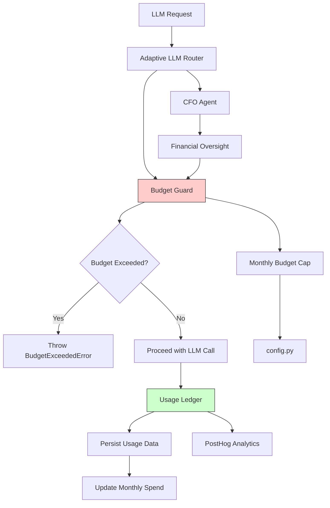
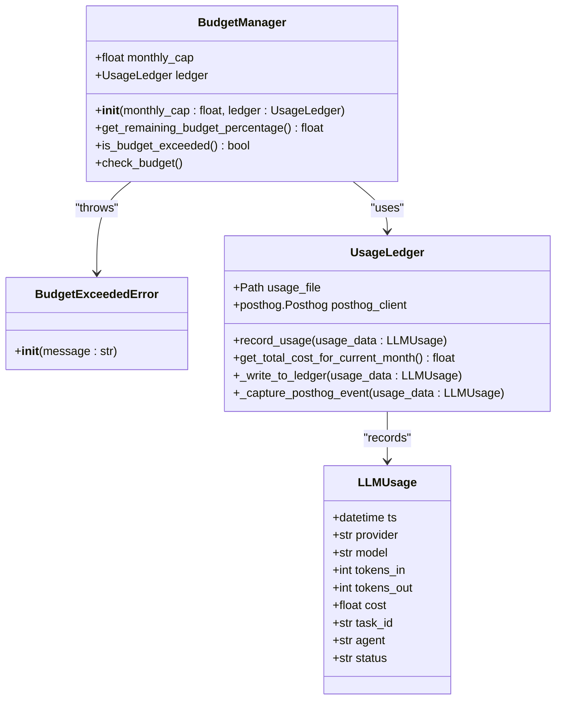
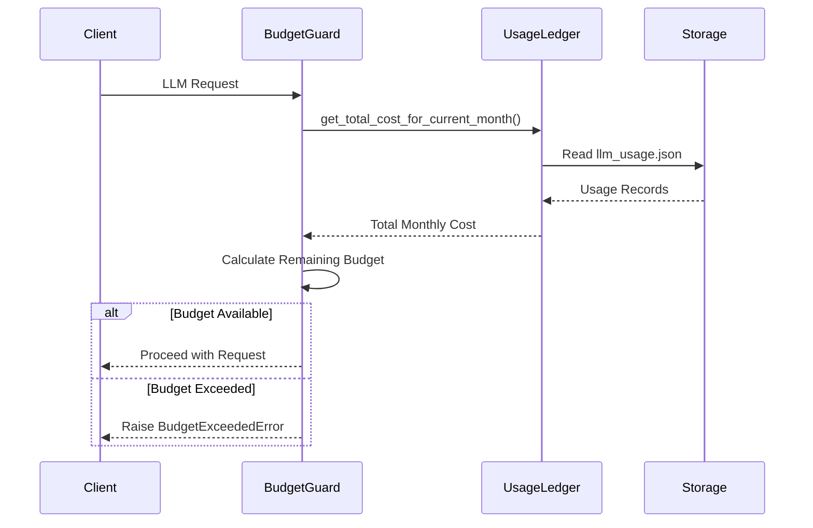
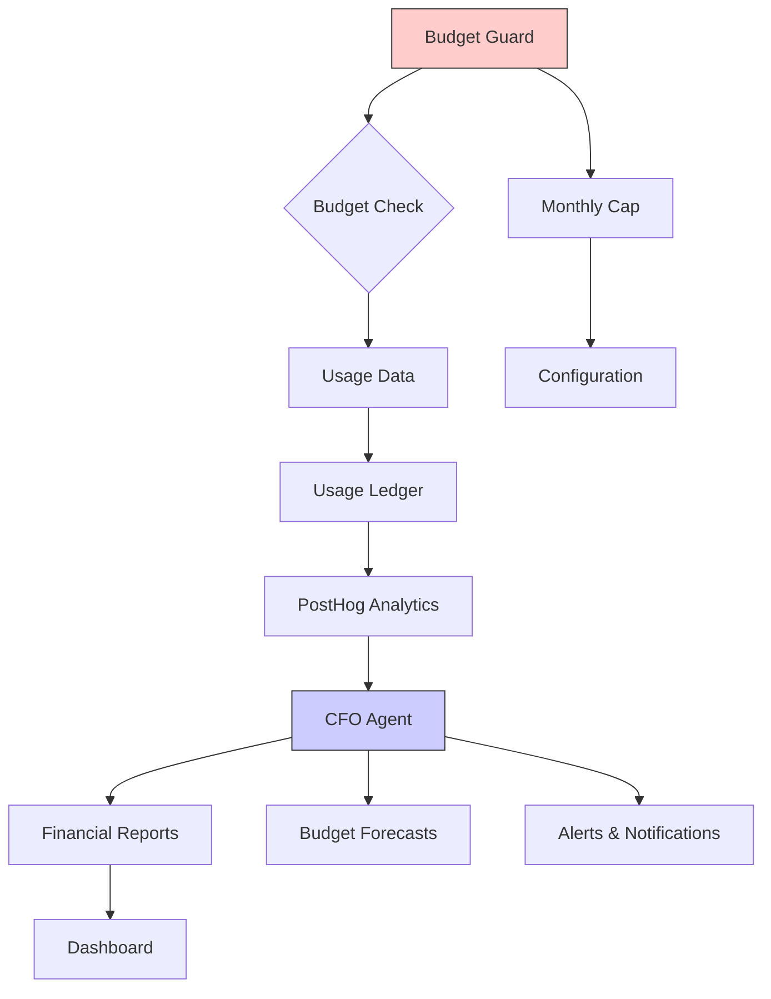
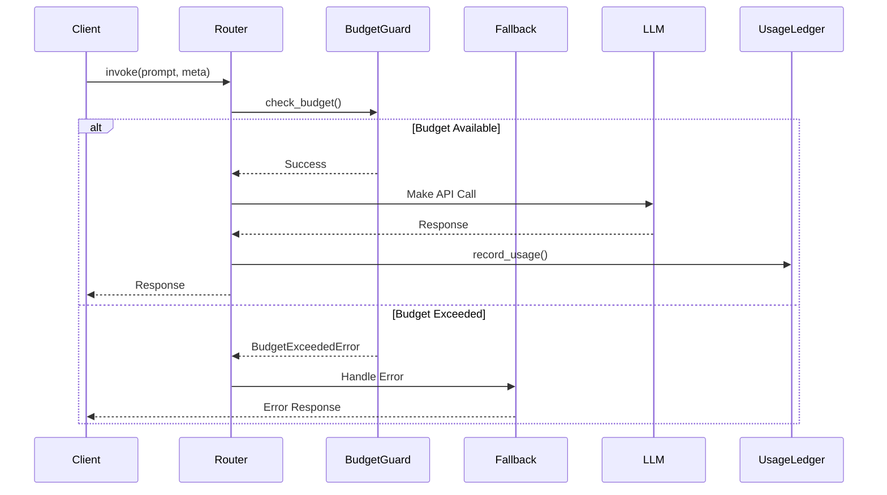

# Budget Guard

<cite>
**Referenced Files in This Document**   
- [budget_guard.py](file://371-os/src/minds371/adaptive_llm_router/budget_guard.py)
- [usage_ledger.py](file://371-os/src/minds371/adaptive_llm_router/usage_ledger.py)
- [config.py](file://371-os/src/minds371/adaptive_llm_router/config.py)
- [data_models.py](file://371-os/src/minds371/adaptive_llm_router/data_models.py)
- [llm.py](file://371-os/src/minds371/adaptive_llm_router/llm.py)
- [cfo_cash.py](file://371-os/src/minds371/agents/business/cfo_cash.py)
- [financial_system.py](file://371-os/src/minds371/financial_system.py)
</cite>

## Table of Contents
1. [Introduction](#introduction)
2. [Core Components](#core-components)
3. [Architecture Overview](#architecture-overview)
4. [Detailed Component Analysis](#detailed-component-analysis)
5. [Integration with CFO Agent (Maya)](#integration-with-cfo-agent-maya)
6. [Configuration and Thresholds](#configuration-and-thresholds)
7. [Error Handling and Fallback Strategies](#error-handling-and-fallback-strategies)
8. [Performance Considerations](#performance-considerations)
9. [Troubleshooting Guide](#troubleshooting-guide)

## Introduction
The **Budget Guard** is a critical sub-component of the **Adaptive LLM Router** system, designed to enforce financial constraints on LLM usage across the agent ecosystem. It acts as a hard-stop gate that prevents LLM operations when the monthly budget cap is exceeded, ensuring cost control and financial accountability. The component integrates tightly with the **Usage Ledger** to track real-time spending and interfaces with financial oversight agents like **CFO Agent (Maya)** for reporting and compliance. This document provides a comprehensive analysis of its implementation, functionality, integration points, and operational behavior.

## Core Components
The Budget Guard system consists of three primary components:
- **BudgetManager**: Core class that enforces budget limits
- **UsageLedger**: Tracks and persists LLM usage data
- **BudgetExceededError**: Custom exception for budget violations

These components work together to monitor, calculate, and enforce financial constraints on LLM operations.

**Section sources**
- [budget_guard.py](file://371-os/src/minds371/adaptive_llm_router/budget_guard.py#L1-L50)
- [usage_ledger.py](file://371-os/src/minds371/adaptive_llm_router/usage_ledger.py#L1-L90)

## Architecture Overview



**Diagram sources**
- [budget_guard.py](file://371-os/src/minds371/adaptive_llm_router/budget_guard.py#L1-L50)
- [usage_ledger.py](file://371-os/src/minds371/adaptive_llm_router/usage_ledger.py#L1-L90)
- [llm.py](file://371-os/src/minds371/adaptive_llm_router/llm.py#L1-L92)

## Detailed Component Analysis

### BudgetManager Class Analysis

The `BudgetManager` class is the central component responsible for enforcing financial constraints on LLM usage.



**Diagram sources**
- [budget_guard.py](file://371-os/src/minds371/adaptive_llm_router/budget_guard.py#L15-L49)
- [usage_ledger.py](file://371-os/src/minds371/adaptive_llm_router/usage_ledger.py#L15-L89)
- [data_models.py](file://371-os/src/minds371/adaptive_llm_router/data_models.py#L25-L40)

**Section sources**
- [budget_guard.py](file://371-os/src/minds371/adaptive_llm_router/budget_guard.py#L15-L49)

#### Key Methods

**get_remaining_budget_percentage()**
Calculates the percentage of the monthly budget that remains available.

```python
def get_remaining_budget_percentage(self) -> float:
    if self.monthly_cap <= 0:
        return 0.0
    current_spend = self.ledger.get_total_cost_for_current_month()
    remaining = self.monthly_cap - current_spend
    if remaining <= 0:
        return 0.0
    return (remaining / self.monthly_cap)
```

**is_budget_exceeded()**
Determines if the current spending has surpassed the monthly budget cap.

```python
def is_budget_exceeded(self) -> bool:
    return self.get_remaining_budget_percentage() <= 0
```

**check_budget()**
Enforces the budget constraint by raising an exception when limits are exceeded.

```python
def check_budget(self):
    if self.is_budget_exceeded():
        raise BudgetExceededError(f"Monthly budget of ${self.monthly_cap} has been exceeded.")
```

### Usage Ledger Integration

The Budget Guard relies on the Usage Ledger to track real-time spending against allocated budgets.



**Diagram sources**
- [budget_guard.py](file://371-os/src/minds371/adaptive_llm_router/budget_guard.py#L30-L35)
- [usage_ledger.py](file://371-os/src/minds371/adaptive_llm_router/usage_ledger.py#L65-L80)

**Section sources**
- [usage_ledger.py](file://371-os/src/minds371/adaptive_llm_router/usage_ledger.py#L65-L89)

## Integration with CFO Agent (Maya)

The Budget Guard integrates with the CFO Agent (Maya) for financial oversight and reporting, enabling comprehensive financial management across the agent ecosystem.



**Diagram sources**
- [budget_guard.py](file://371-os/src/minds371/adaptive_llm_router/budget_guard.py#L1-L50)
- [cfo_cash.py](file://371-os/src/minds371/agents/business/cfo_cash.py#L1-L51)
- [financial_system.py](file://371-os/src/minds371/financial_system.py#L1-L64)

**Section sources**
- [cfo_cash.py](file://371-os/src/minds371/agents/business/cfo_cash.py#L1-L51)
- [financial_system.py](file://371-os/src/minds371/financial_system.py#L1-L64)

The CFO Agent processes financial tasks including:
- **P&L Analysis**: Profit and loss assessment
- **R&D Tax Optimization**: Research and development tax credit optimization
- **Revenue Forecasting**: Future revenue predictions
- **Transaction Processing**: Banking and payment system integration

While the current implementation uses a mock `FinancialAgent`, the architecture supports integration with real financial systems for comprehensive financial oversight.

## Configuration and Thresholds

The Budget Guard's behavior is configured through the `config.py` file, which defines the monthly budget cap.

```python
# The monthly budget cap for LLM usage in USD.
MONTHLY_BUDGET_CAP = 20.00
```

The system supports budget allocation at different levels:
- **System-wide**: Global monthly cap (currently $20.00)
- **Per-agent**: Not currently implemented but structurally supported via agent field in LLMUsage
- **Per-project**: Not currently implemented but supported via task_id field

Configuration options include:
- **Budget thresholds**: Defined by MONTHLY_BUDGET_CAP
- **Alerting**: Not explicitly implemented but supported through PostHog event capture
- **Escalation procedures**: Handled by raising BudgetExceededError to upstream components

**Section sources**
- [config.py](file://371-os/src/minds371/adaptive_llm_router/config.py#L1-L7)

## Error Handling and Fallback Strategies

The Budget Guard implements a hard-stop approach to budget enforcement, with clear error handling mechanisms.



**Diagram sources**
- [llm.py](file://371-os/src/minds371/adaptive_llm_router/llm.py#L42-L50)
- [budget_guard.py](file://371-os/src/minds371/adaptive_llm_router/budget_guard.py#L40-L45)

**Section sources**
- [llm.py](file://371-os/src/minds371/adaptive_llm_router/llm.py#L42-L50)

### Budget Check in LLM Invocation

The integration with the LLM routing system occurs in the `invoke` function:

```python
# 3. Check the budget
try:
    budget_manager.check_budget()
except BudgetExceededError as e:
    # Here you could implement a fallback to a free model or just raise
    raise e
```

Currently, the system raises the exception directly, but the comment indicates potential for implementing fallback strategies such as:
- Downgrading to a less expensive LLM provider
- Using a local, free model
- Queuing requests for later processing
- Returning cached responses

## Performance Considerations

The Budget Guard is designed for minimal overhead during high-volume operations.

### Efficiency Features

- **File-based storage**: Usage data is stored in a JSON file (`llm_usage.json`), providing simple and efficient persistence
- **Batch reading**: The ledger reads all usage records in a single operation
- **In-memory calculation**: Budget calculations are performed in memory after data retrieval
- **Simple data model**: The LLMUsage model contains only essential fields

### Potential Optimization Opportunities

- **Caching**: Implement in-memory caching of monthly totals to avoid file I/O on every request
- **Database integration**: Replace JSON file with a lightweight database for better performance at scale
- **Asynchronous operations**: Make file operations asynchronous to prevent blocking
- **Indexing**: Add date-based indexing to improve monthly cost calculation performance

The current implementation reads the entire usage file for each budget check, which could become a bottleneck under high load. However, for moderate usage patterns, this approach provides a simple and reliable solution.

**Section sources**
- [usage_ledger.py](file://371-os/src/minds371/adaptive_llm_router/usage_ledger.py#L50-L80)
- [budget_guard.py](file://371-os/src/minds371/adaptive_llm_router/budget_guard.py#L30-L35)

## Troubleshooting Guide

### Common Issues and Solutions

**Issue: Inaccurate usage tracking**
- **Symptoms**: Budget calculations don't match expected usage
- **Causes**: 
  - File corruption in llm_usage.json
  - Clock synchronization issues affecting timestamp parsing
  - Incomplete writes due to system crashes
- **Solutions**:
  - Validate JSON file integrity
  - Implement file locking during writes
  - Add backup/restore mechanism for usage data

**Issue: Delayed budget updates**
- **Symptoms**: Recent usage not reflected in budget calculations
- **Causes**:
  - Caching layers not invalidated
  - Asynchronous write operations not completed
  - Timezone mismatches in date calculations
- **Solutions**:
  - Ensure synchronous writes to usage ledger
  - Verify datetime parsing logic
  - Implement refresh mechanism for budget calculations

**Issue: False budget exhaustion alerts**
- **Symptoms**: Budget exceeded errors despite available funds
- **Causes**:
  - Incorrect MONTHLY_BUDGET_CAP configuration
  - Currency conversion issues
  - Floating-point precision errors in cost calculations
- **Solutions**:
  - Validate configuration values
  - Implement decimal arithmetic for financial calculations
  - Add logging to trace cost accumulation

### Monitoring and Debugging

The system includes several monitoring capabilities:
- **PostHog integration**: Usage events are sent to PostHog for analytics
- **JSON logging**: All usage records are persisted in llm_usage.json
- **Exception handling**: Clear error messages indicate budget status

Recommended monitoring practices:
- Regularly audit the llm_usage.json file for completeness
- Monitor PostHog event streams for usage patterns
- Set up alerts for approaching budget thresholds
- Log budget check operations for debugging

**Section sources**
- [usage_ledger.py](file://371-os/src/minds371/adaptive_llm_router/usage_ledger.py#L1-L90)
- [budget_guard.py](file://371-os/src/minds371/adaptive_llm_router/budget_guard.py#L1-L50)