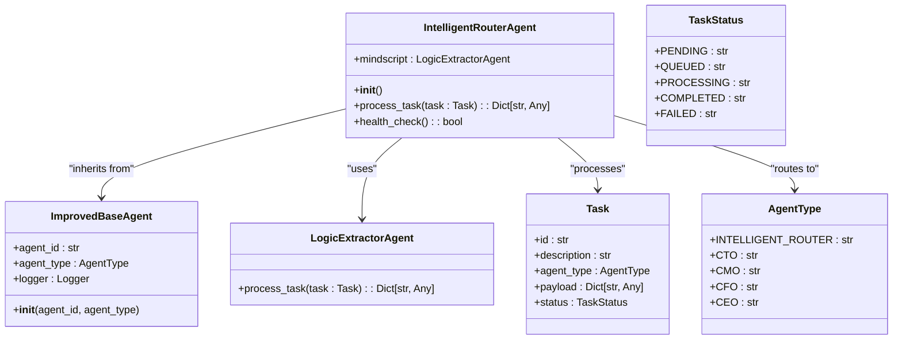
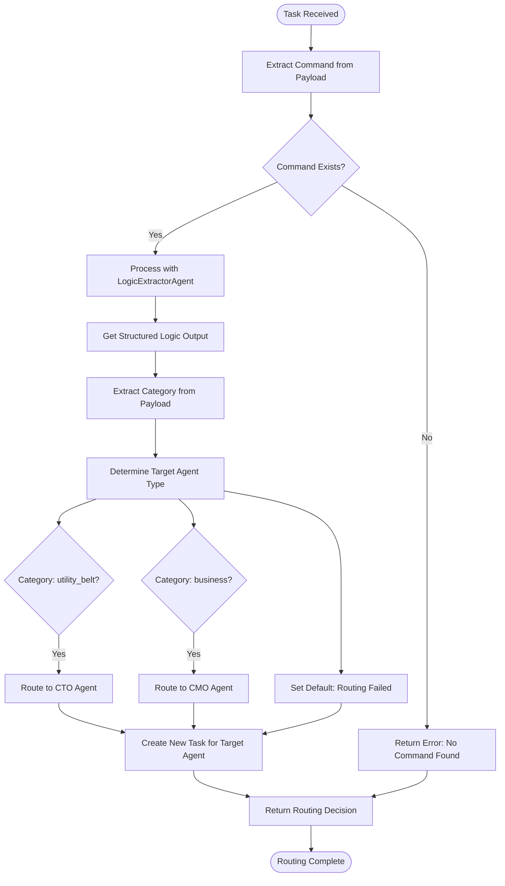
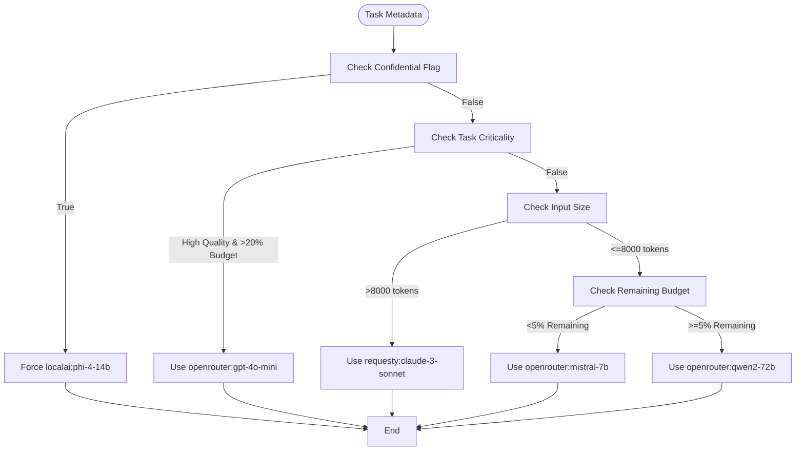
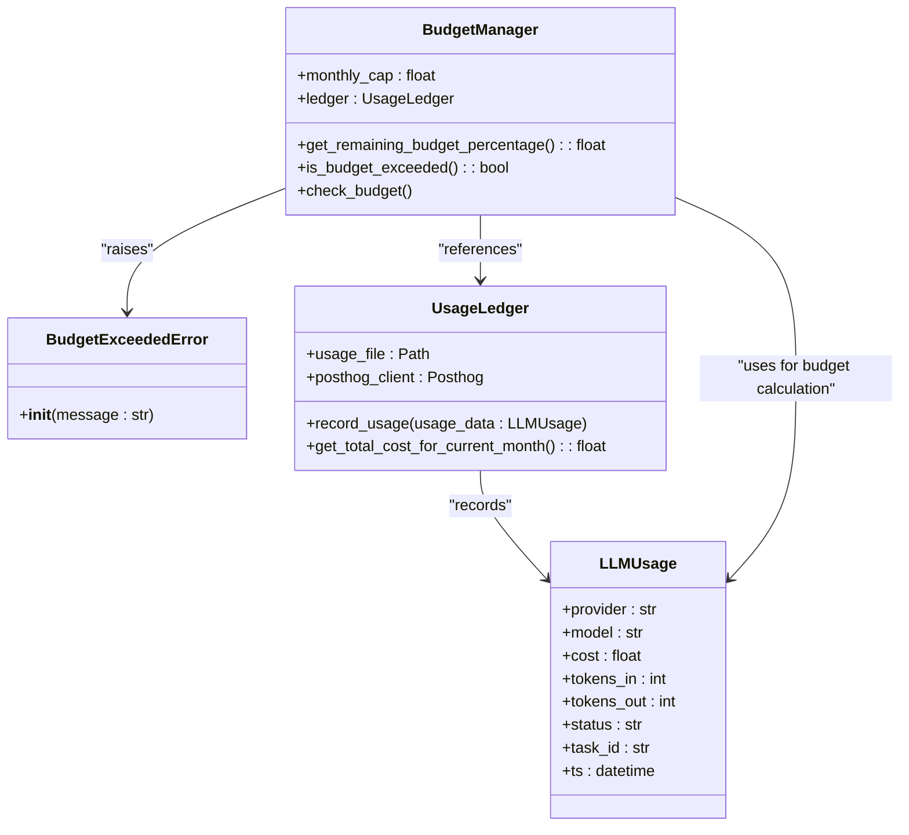
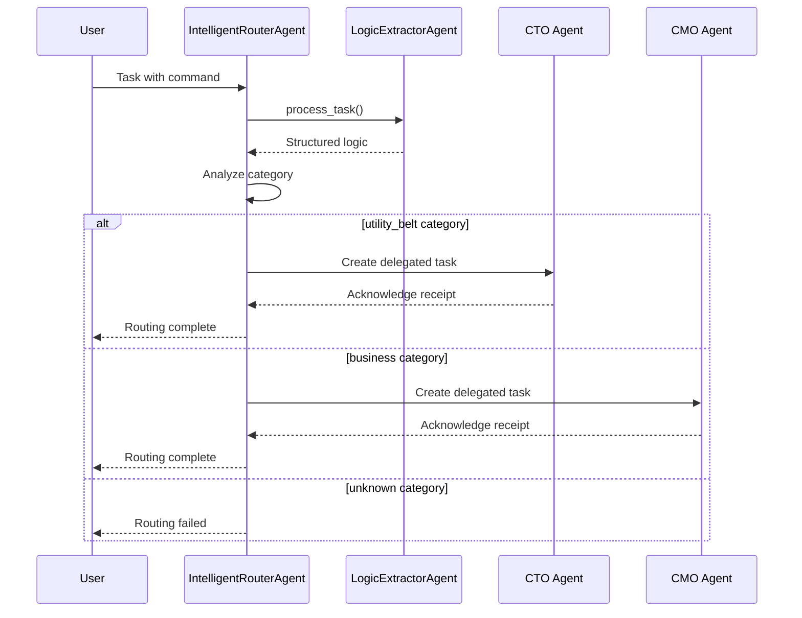

# Intelligent Router Agent

<cite>
**Referenced Files in This Document**   
- [intelligent_router_agent.py](file://371-os/src/minds371/adaptive_llm_router/intelligent_router_agent.py)
- [adaptive_llm_router_example.py](file://371-os/src/minds371/adaptive_llm_router/adaptive_llm_router_example.py)
- [policy_engine.py](file://371-os/src/minds371/adaptive_llm_router/policy_engine.py)
- [budget_guard.py](file://371-os/src/minds371/adaptive_llm_router/budget_guard.py)
- [usage_ledger.py](file://371-os/src/minds371/adaptive_llm_router/usage_ledger.py)
- [data_models.py](file://371-os/src/minds371/adaptive_llm_router/data_models.py)
- [config.py](file://371-os/src/minds371/adaptive_llm_router/config.py)
- [improved_base_agent.py](file://371-os/src/minds371/agents/base_agent/improved_base_agent.py)
- [system_architecture.html](file://371-os/docs/architecture/system_architecture.html)
</cite>

## Table of Contents
1. [Introduction](#introduction)
2. [Core Architecture](#core-architecture)
3. [Agent Lifecycle and Decision-Making Loop](#agent-lifecycle-and-decision-making-loop)
4. [Intelligent Routing Process](#intelligent-routing-process)
5. [Policy Engine and Provider Selection](#policy-engine-and-provider-selection)
6. [Budget Management and Cost Control](#budget-management-and-cost-control)
7. [Usage Tracking and Analytics](#usage-tracking-and-analytics)
8. [Configuration Options](#configuration-options)
9. [Example Usage Scenarios](#example-usage-scenarios)
10. [Troubleshooting Guide](#troubleshooting-guide)
11. [Performance Considerations](#performance-considerations)

## Introduction

The Intelligent Router Agent is a core component of the Adaptive LLM Router system, serving as an autonomous decision-making agent responsible for routing tasks to appropriate specialized agents based on content analysis. Unlike traditional routing systems, this agent leverages MindScript technology to extract structured logic from natural language commands, enabling intelligent delegation to the appropriate C-Suite or functional agents within the 371 Minds OS ecosystem.

The agent operates as part of a sophisticated multi-agent architecture where it analyzes incoming tasks, interprets their intent through the LogicExtractorAgent, and routes them to the appropriate destination agent based on categorized intent. This document provides a comprehensive analysis of the Intelligent Router Agent's implementation, functionality, and integration with other system components.

**Section sources**
- [intelligent_router_agent.py](file://371-os/src/minds371/adaptive_llm_router/intelligent_router_agent.py#L1-L105)

## Core Architecture

The Intelligent Router Agent follows an object-oriented design pattern, inheriting from the ImprovedBaseAgent class which provides foundational agent capabilities. The architecture is designed around modularity, with clear separation between routing logic, policy enforcement, budget management, and usage tracking components.



**Diagram sources**
- [intelligent_router_agent.py](file://371-os/src/minds371/adaptive_llm_router/intelligent_router_agent.py#L1-L105)
- [improved_base_agent.py](file://371-os/src/minds371/agents/base_agent/improved_base_agent.py#L24-L47)

**Section sources**
- [intelligent_router_agent.py](file://371-os/src/minds371/adaptive_llm_router/intelligent_router_agent.py#L1-L105)
- [improved_base_agent.py](file://371-os/src/minds371/agents/base_agent/improved_base_agent.py#L24-L47)

## Agent Lifecycle and Decision-Making Loop

The Intelligent Router Agent follows a well-defined lifecycle that begins with initialization and continues through task processing, routing decisions, and health monitoring. The core decision-making loop is implemented in the `process_task` method, which executes a sequential workflow to analyze and route incoming tasks.



The agent lifecycle begins with initialization where it sets up its internal components, including the LogicExtractorAgent instance. When a task arrives, the agent extracts the command from the payload and delegates it to the MindScript logic extractor. The structured output is then analyzed to determine the appropriate routing destination based on category mapping. Finally, a new task is created for the target agent with the transformed payload.

**Section sources**
- [intelligent_router_agent.py](file://371-os/src/minds371/adaptive_llm_router/intelligent_router_agent.py#L25-L95)

## Intelligent Routing Process

The Intelligent Router Agent's primary function is to interpret natural language commands and route them to appropriate specialized agents. This process leverages the LogicExtractorAgent (MindScript) to transform unstructured input into structured data that can be used for routing decisions.

The routing process follows these key steps:
1. **Command Extraction**: The agent extracts the command string from the incoming task payload
2. **Logic Processing**: The command is processed by the LogicExtractorAgent to generate structured output
3. **Category Analysis**: The structured payload is analyzed to identify the appropriate category
4. **Agent Mapping**: The category is mapped to a target agent type based on predefined rules
5. **Task Delegation**: A new task is created for the target agent with the transformed payload

Currently, the implementation includes routing rules for two primary categories:
- **utility_belt**: Routes to CTO Agent (AgentType.CTO)
- **business**: Routes to CMO Agent (AgentType.CMO)

The routing decision is returned as a structured JSON object containing the status, target agent, new task ID, and payload information. In a production environment, this would be followed by submission to a central task queue rather than returning the task details.

```python
# Example routing decision structure
{
    "status": "routing_complete",
    "delegated_to": "cto",
    "new_task_id": "550e8400-e29b-41d4-a716-446655440000",
    "new_task_payload": {
        "category": "utility_belt",
        "action": "find",
        "target": "services",
        "filters": {"tag": "beta"}
    }
}
```

**Section sources**
- [intelligent_router_agent.py](file://371-os/src/minds371/adaptive_llm_router/intelligent_router_agent.py#L45-L95)

## Policy Engine and Provider Selection

While the Intelligent Router Agent focuses on task routing between agents, the Adaptive LLM Router system includes a Policy Engine that handles LLM provider selection based on task requirements and constraints. The policy_engine.py module implements a decision graph that selects the optimal LLM provider and model based on multiple factors.



The policy engine evaluates requests based on five key criteria in priority order:
1. **Privacy Requirements**: Tasks marked as confidential are routed to local AI models
2. **Task Criticality**: High-quality tasks receive premium models if budget allows
3. **Context Length**: Long-context tasks are routed to models with large context windows
4. **Budget Availability**: Low-budget scenarios trigger cost-optimized models
5. **Default Selection**: Balanced performance and cost for general tasks

This hierarchical decision-making process ensures optimal resource allocation while maintaining performance requirements.

**Diagram sources**
- [policy_engine.py](file://371-os/src/minds371/adaptive_llm_router/policy_engine.py#L1-L34)

**Section sources**
- [policy_engine.py](file://371-os/src/minds371/adaptive_llm_router/policy_engine.py#L1-L34)

## Budget Management and Cost Control

The Adaptive LLM Router includes a comprehensive budget management system that enables cost-aware decision making. The BudgetManager class works in conjunction with the UsageLedger to track spending against a monthly cap and enforce budget constraints.



The budget management system operates on a monthly cycle with a configurable cap (default $20.00). The BudgetManager calculates the remaining budget percentage by comparing current spending (retrieved from UsageLedger) against the monthly cap. When the budget is exceeded, the system can either raise a BudgetExceededError or force a downgrade to cheaper models, depending on the implementation context.

The system supports two primary budget enforcement modes:
- **Hard-stop mode**: Raises BudgetExceededError when cap is reached
- **Downgrade mode**: Automatically routes requests to the cheapest available model

This dual approach provides flexibility between strict budget adherence and continued service availability.

**Diagram sources**
- [budget_guard.py](file://371-os/src/minds371/adaptive_llm_router/budget_guard.py#L1-L50)
- [usage_ledger.py](file://371-os/src/minds371/adaptive_llm_router/usage_ledger.py#L1-L89)

**Section sources**
- [budget_guard.py](file://371-os/src/minds371/adaptive_llm_router/budget_guard.py#L1-L50)
- [config.py](file://371-os/src/minds371/adaptive_llm_router/config.py#L1-L7)

## Usage Tracking and Analytics

The usage_ledger.py module implements a comprehensive usage tracking system that persists detailed information about every LLM request. This system serves both operational and analytical purposes, enabling cost calculation, performance monitoring, and business intelligence.

The UsageLedger class records the following metrics for each request:
- **Provider and model information**
- **Cost in USD**
- **Token counts (input and output)**
- **Latency and response time**
- **Success/failure status**
- **Quality scores**
- **Timestamp and task ID**

```python
# Example usage record structure
{
    "provider": "openrouter",
    "model": "gpt-4o-mini",
    "cost": 0.045,
    "tokens_in": 1250,
    "tokens_out": 850,
    "status": "success",
    "agent": "intelligent_router",
    "task_id": "550e8400-e29b-41d4-a716-446655440000",
    "ts": "2025-01-15T10:30:00.000Z",
    "latency_ms": 1250,
    "quality_score": 0.92
}
```

The system writes usage records to a JSON file (llm_usage.json) for persistent storage and also forwards events to PostHog for advanced analytics and visualization. This dual-storage approach ensures data durability while enabling real-time monitoring and business intelligence capabilities.

The get_total_cost_for_current_month method calculates spending by aggregating records from the current calendar month, providing the data needed for budget enforcement decisions.

**Section sources**
- [usage_ledger.py](file://371-os/src/minds371/adaptive_llm_router/usage_ledger.py#L1-L89)
- [data_models.py](file://371-os/src/minds371/adaptive_llm_router/data_models.py#L1-L15)

## Configuration Options

The Adaptive LLM Router system provides several configuration options that control its behavior, particularly around budget management and decision thresholds. These configurations are primarily defined in the config.py module.

**Configuration Parameters:**
- **MONTHLY_BUDGET_CAP**: Sets the monthly spending limit in USD (default: $20.00)
- **Budget Thresholds**: Implicit thresholds in policy engine (20% for high-quality tasks, 5% for low-budget mode)
- **Provider Selection Rules**: Configurable decision graph in policy_engine.py

The configuration system is currently file-based, with settings defined as module-level constants. The primary configurable parameter is the monthly budget cap, which can be adjusted based on organizational requirements and financial constraints.

While the current implementation has limited configuration options, the architecture supports extension to include additional parameters such as:
- Custom provider selection rules
- Dynamic budget thresholds
- Quality score weighting
- Latency vs. cost tradeoff preferences
- Regional provider preferences

These could be implemented through a more comprehensive configuration system, potentially using environment variables or a dedicated configuration service.

**Section sources**
- [config.py](file://371-os/src/minds371/adaptive_llm_router/config.py#L1-L7)
- [policy_engine.py](file://371-os/src/minds371/adaptive_llm_router/policy_engine.py#L1-L34)

## Example Usage Scenarios

The adaptive_llm_router_example.py file provides concrete examples of the Intelligent Router Agent in action, demonstrating how it handles different types of requests. These examples illustrate the agent's behavior across various scenarios, including successful routing and error conditions.



The example script includes four test cases that demonstrate different routing scenarios:

1. **CTO-directed request**: "Can you please find the catalog_services?" - Routes to CTO agent
2. **CMO-directed request**: "I need to sync our marketing_campaigns." - Routes to CMO agent  
3. **Utility request**: "store the new user feedback document." - Mocked utility belt request
4. **Unknown command**: "This is an unknown command." - Results in routing failure

Each test case shows the complete workflow from command input to routing decision output. The agent successfully extracts intent from natural language commands and routes them to appropriate destinations based on the structured logic provided by the MindScript system.

The example also demonstrates the agent's error handling capabilities, showing how it responds when no command is found in the task payload or when no matching route is found for a given category.

**Diagram sources**
- [adaptive_llm_router_example.py](file://371-os/src/minds371/adaptive_llm_router/adaptive_llm_router_example.py#L1-L65)

**Section sources**
- [adaptive_llm_router_example.py](file://371-os/src/minds371/adaptive_llm_router/adaptive_llm_router_example.py#L1-L65)
- [intelligent_router_agent.py](file://371-os/src/minds371/adaptive_llm_router/intelligent_router_agent.py#L1-L105)

## Troubleshooting Guide

When the Intelligent Router Agent exhibits suboptimal routing decisions or performance issues, several diagnostic steps can be taken to identify and resolve problems.

**Common Issues and Solutions:**

**1. Routing Failures**
- **Symptom**: Tasks return with "routing_failed" status
- **Causes**: 
  - Missing or malformed command in task payload
  - LogicExtractorAgent failing to produce structured output
  - Category not matching any defined routing rules
- **Solutions**:
  - Verify command exists in task.payload['command']
  - Check LogicExtractorAgent logs for processing errors
  - Add new category mappings in the routing logic

**2. Performance Bottlenecks**
- **Symptom**: High latency in routing decisions
- **Causes**:
  - LogicExtractorAgent processing delays
  - Network latency in external service calls
  - Resource constraints on the host system
- **Solutions**:
  - Optimize MindScript processing logic
  - Implement caching for frequent command patterns
  - Scale agent infrastructure

**3. Budget Management Issues**
- **Symptom**: Unexpected budget exhaustion or incorrect cost calculations
- **Causes**:
  - Usage ledger not properly recording transactions
  - Incorrect cost estimation from LLM providers
  - Clock synchronization issues affecting monthly calculations
- **Solutions**:
  - Verify usage_ledger.json file permissions and accessibility
  - Validate cost calculation formulas
  - Ensure system clock is synchronized

**4. Configuration Problems**
- **Symptom**: Agent not respecting budget caps or using wrong providers
- **Causes**:
  - Configuration file not being loaded
  - Environment variables overriding defaults
  - Code referencing outdated configuration parameters
- **Solutions**:
  - Verify config.py is being imported correctly
  - Check for environment variable conflicts
  - Ensure all components use the same configuration instance

Diagnostic logs from the agent's logger can provide valuable insights into the routing process, showing each step of command extraction, logic processing, and decision making.

**Section sources**
- [intelligent_router_agent.py](file://371-os/src/minds371/adaptive_llm_router/intelligent_router_agent.py#L1-L105)
- [budget_guard.py](file://371-os/src/minds371/adaptive_llm_router/budget_guard.py#L1-L50)
- [usage_ledger.py](file://371-os/src/minds371/adaptive_llm_router/usage_ledger.py#L1-L89)

## Performance Considerations

The Intelligent Router Agent's computational overhead is generally low, as its primary function is task routing rather than intensive computation. However, several performance factors should be considered in production deployments.

**Latency Factors:**
- **Logic Extraction**: The largest contributor to latency is the LogicExtractorAgent processing time
- **I/O Operations**: Reading from and writing to the usage ledger adds minimal overhead
- **Decision Logic**: Simple conditional checks have negligible impact

**Scalability Considerations:**
- The agent is stateless except for its logger and MindScript instance, making it easily scalable
- Horizontal scaling can be achieved by deploying multiple agent instances behind a load balancer
- The usage ledger may require optimization (e.g., database backend) at high transaction volumes

**Resource Utilization:**
- **Memory**: Primarily determined by the size of tasks and structured logic outputs
- **CPU**: Light utilization during task processing, spikes during logic extraction
- **Storage**: Grows linearly with usage volume in the JSON ledger

**Optimization Opportunities:**
- **Caching**: Frequently encountered command patterns could be cached to bypass MindScript processing
- **Batch Processing**: Multiple tasks could be processed in batches to amortize overhead
- **Asynchronous Operations**: Non-critical operations like analytics reporting could be handled asynchronously
- **Ledger Optimization**: Replace JSON file storage with a lightweight database for high-volume scenarios

The current implementation prioritizes simplicity and reliability over performance optimization, which is appropriate given its role as a routing coordinator rather than a compute-intensive service.

**Section sources**
- [intelligent_router_agent.py](file://371-os/src/minds371/adaptive_llm_router/intelligent_router_agent.py#L1-L105)
- [usage_ledger.py](file://371-os/src/minds371/adaptive_llm_router/usage_ledger.py#L1-L89)
- [policy_engine.py](file://371-os/src/minds371/adaptive_llm_router/policy_engine.py#L1-L34)