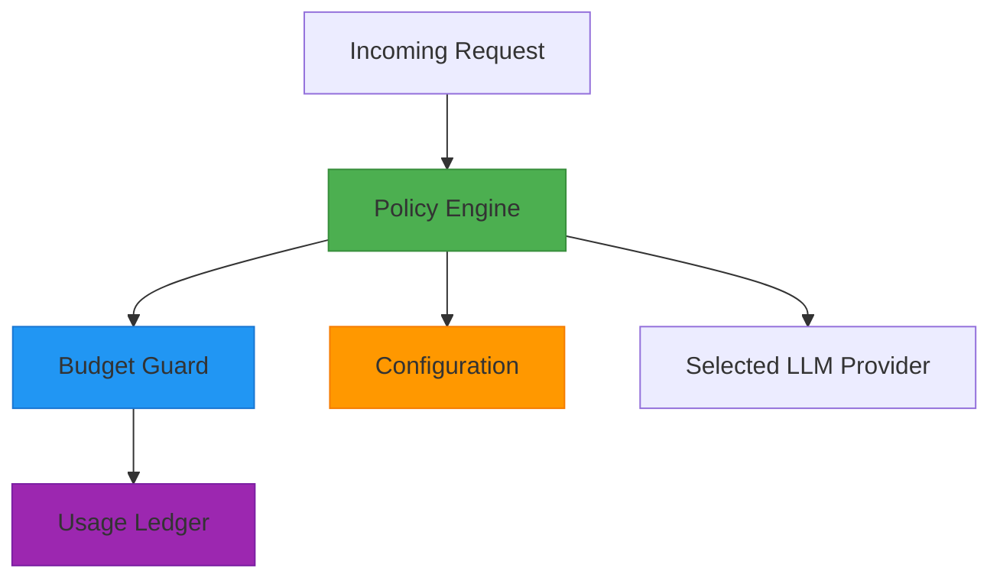
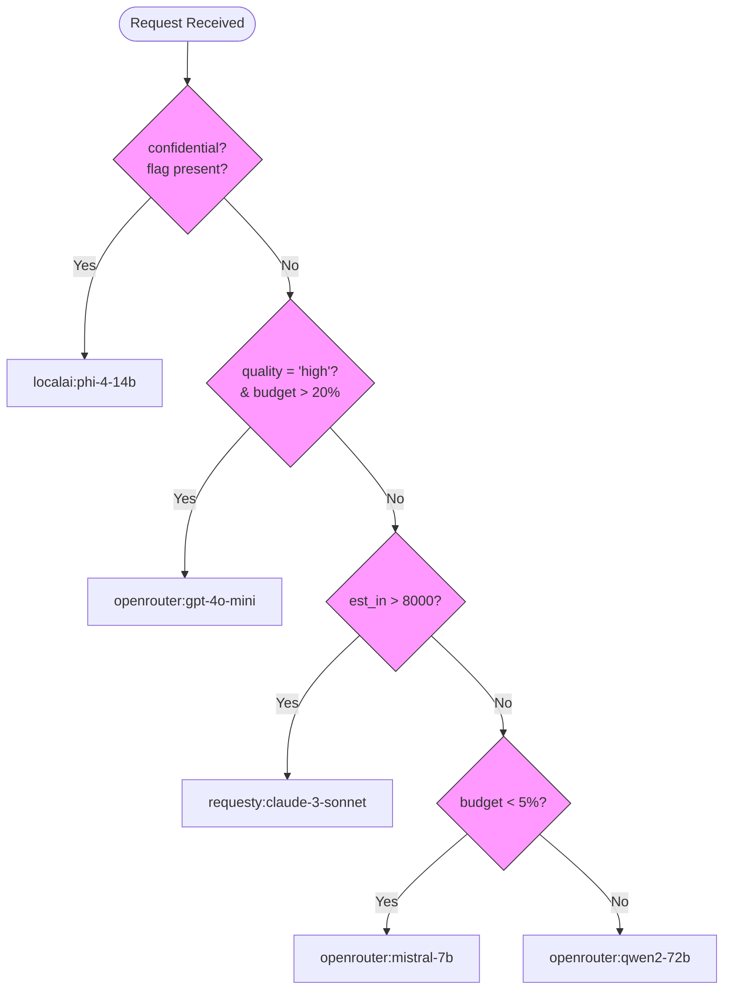
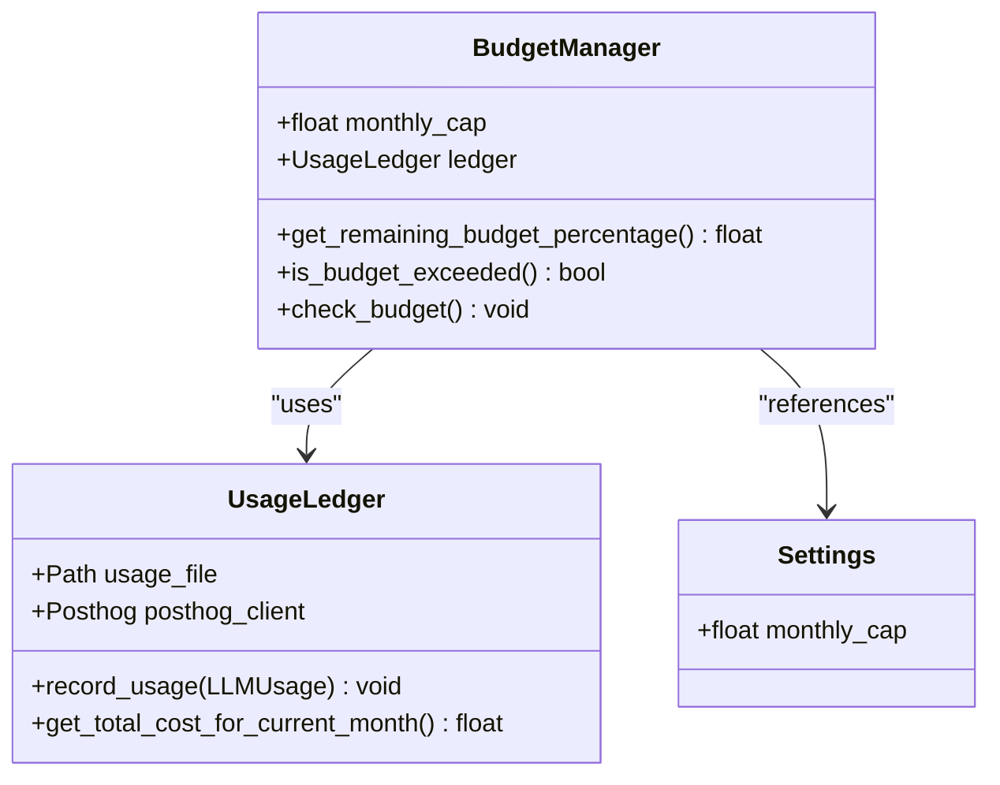
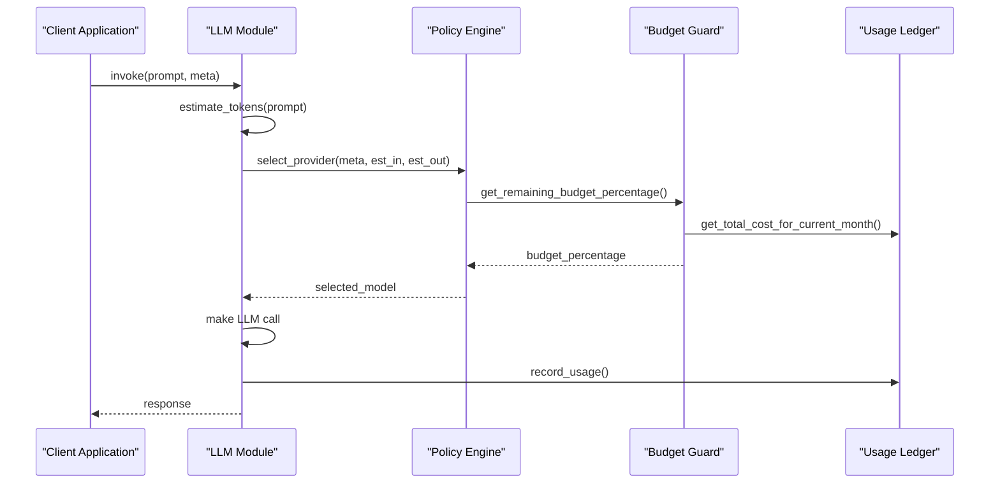

# Policy Engine

<cite>
**Referenced Files in This Document**   
- [policy_engine.py](file://371-os\src\minds371\adaptive_llm_router\policy_engine.py)
- [config.py](file://371-os\src\minds371\adaptive_llm_router\config.py)
- [budget_guard.py](file://371-os\src\minds371\adaptive_llm_router\budget_guard.py)
- [usage_ledger.py](file://371-os\src\minds371\adaptive_llm_router\usage_ledger.py)
- [data_models.py](file://371-os\src\minds371\adaptive_llm_router\data_models.py)
- [llm.py](file://371-os\src\minds371\adaptive_llm_router\llm.py)
- [Adaptive_Router_Logic.md](file://371-os\Adaptive_Router_Logic.md)
</cite>

## Table of Contents
1. [Introduction](#introduction)
2. [Core Components](#core-components)
3. [Policy Evaluation Logic](#policy-evaluation-logic)
4. [Configuration and Thresholds](#configuration-and-thresholds)
5. [Decision Flow and Integration](#decision-flow-and-integration)
6. [Usage Examples](#usage-examples)
7. [Error Handling and Fallbacks](#error-handling-and-fallbacks)
8. [Performance Considerations](#performance-considerations)

## Introduction
The Policy Engine is a critical sub-component of the Adaptive LLM Router system, responsible for making intelligent routing decisions based on configurable business rules, quality requirements, and cost constraints. It operates as a decision graph that evaluates incoming requests against a set of prioritized policies to determine the optimal LLM provider and model for each specific task. The engine balances multiple factors including data privacy, task criticality, context length requirements, and budget constraints to ensure efficient and compliant AI resource utilization.

**Section sources**
- [policy_engine.py](file://371-os\src\minds371\adaptive_llm_router\policy_engine.py#L1-L32)
- [Adaptive_Router_Logic.md](file://371-os\Adaptive_Router_Logic.md#L0-L35)

## Core Components

The Policy Engine consists of several interconnected components that work together to evaluate routing decisions:

- **Policy Engine**: The core decision-making module that evaluates request metadata against business rules
- **Budget Guard**: Monitors and enforces monthly spending limits for LLM usage
- **Usage Ledger**: Tracks historical usage data for cost calculation and reporting
- **Configuration System**: Defines thresholds and parameters for policy evaluation

These components form a cohesive system that ensures routing decisions are made with full context of both immediate requirements and long-term constraints.



**Diagram sources**
- [policy_engine.py](file://371-os\src\minds371\adaptive_llm_router\policy_engine.py)
- [budget_guard.py](file://371-os\src\minds371\adaptive_llm_router\budget_guard.py)
- [usage_ledger.py](file://371-os\src\minds371\adaptive_llm_router\usage_ledger.py)
- [config.py](file://371-os\src\minds371\adaptive_llm_router\config.py)

**Section sources**
- [policy_engine.py](file://371-os\src\minds371\adaptive_llm_router\policy_engine.py#L1-L32)
- [budget_guard.py](file://371-os\src\minds371\adaptive_llm_router\budget_guard.py#L1-L50)
- [usage_ledger.py](file://371-os\src\minds371\adaptive_llm_router\usage_ledger.py#L1-L89)

## Policy Evaluation Logic

The policy evaluation logic in the Policy Engine follows a prioritized decision tree implemented in the `select_provider` function. Policies are evaluated in a specific order of precedence to ensure critical requirements are met first.

### Decision Hierarchy
The engine evaluates policies in the following order:

1. **Privacy Flag**: Requests marked as confidential are immediately routed to local models
2. **Task Criticality**: High-quality tasks are prioritized when budget allows
3. **Context Length**: Long-context requirements trigger specific model selection
4. **Budget Status**: Low budget conditions trigger cost-optimized routing
5. **Default Selection**: Balanced choice for all other cases



**Diagram sources**
- [policy_engine.py](file://371-os\src\minds371\adaptive_llm_router\policy_engine.py#L15-L32)

**Section sources**
- [policy_engine.py](file://371-os\src\minds371\adaptive_llm_router\policy_engine.py#L15-L32)

## Configuration and Thresholds

The Policy Engine relies on configuration parameters to define its behavior and thresholds. These configurations are loaded from the system settings and used to evaluate policies.

### Configuration Parameters
- **MONTHLY_BUDGET_CAP**: The maximum monthly budget for LLM usage in USD
- **Budget Thresholds**: Percentage-based thresholds for different routing modes
- **Context Length Threshold**: Token count that triggers long-context model selection

The configuration is defined in `config.py` and used by the Budget Guard to monitor spending against the monthly cap.

```python
# Configuration for the Adaptive LLM Router
MONTHLY_BUDGET_CAP = 20.00  # Monthly budget cap in USD
```

The Budget Manager uses this configuration to calculate the remaining budget percentage, which is a key factor in policy evaluation.



**Diagram sources**
- [config.py](file://371-os\src\minds371\adaptive_llm_router\config.py#L1-L7)
- [budget_guard.py](file://371-os\src\minds371\adaptive_llm_router\budget_guard.py#L1-L50)
- [usage_ledger.py](file://371-os\src\minds371\adaptive_llm_router\usage_ledger.py#L1-L89)

**Section sources**
- [config.py](file://371-os\src\minds371\adaptive_llm_router\config.py#L1-L7)
- [budget_guard.py](file://371-os\src\minds371\adaptive_llm_router\budget_guard.py#L1-L50)

## Decision Flow and Integration

The Policy Engine is integrated into the main LLM invocation flow through the `llm.py` module. When a request is received, the engine is called to determine the appropriate provider before the actual LLM call is made.

### Integration Points
- **LLM Invocation**: The main entry point that calls the policy engine
- **Token Estimation**: Input and output token estimation for cost calculation
- **Usage Recording**: Post-execution recording of usage metrics

The decision flow begins with token estimation, followed by policy evaluation, provider selection, and finally usage recording.



**Diagram sources**
- [llm.py](file://371-os\src\minds371\adaptive_llm_router\llm.py#L1-L42)
- [policy_engine.py](file://371-os\src\minds371\adaptive_llm_router\policy_engine.py#L1-L32)
- [budget_guard.py](file://371-os\src\minds371\adaptive_llm_router\budget_guard.py#L1-L50)
- [usage_ledger.py](file://371-os\src\minds371\adaptive_llm_router\usage_ledger.py#L1-L89)

**Section sources**
- [llm.py](file://371-os\src\minds371\adaptive_llm_router\llm.py#L1-L42)

## Usage Examples

The Policy Engine handles various request types with different characteristics. Below are concrete examples demonstrating how policies are applied to different scenarios.

### High-Priority CEO Query
When a CEO submits a strategic decision-making request marked as high quality, the policy engine selects a premium model if sufficient budget remains.

```python
# Example: CEO strategic analysis request
meta = {
    "quality": "high",
    "requester": "CEO",
    "purpose": "strategic_planning"
}
# With >20% budget remaining: selects "openrouter:gpt-4o-mini"
```

### Routine Automation Task
For routine automation tasks with no special requirements, the engine selects the balanced default model.

```python
# Example: Routine data processing task
meta = {
    "task_type": "data_processing",
    "priority": "routine"
}
# Selects default model: "openrouter:qwen2-72b"
```

### Confidential Financial Data
Requests containing confidential financial information are automatically routed to local models regardless of other factors.

```python
# Example: Confidential financial analysis
meta = {
    "confidential": True,
    "data_type": "financial_records",
    "quality": "high"
}
# Overrides all other policies: selects "localai:phi-4-14b"
```

### Long-Context Document Analysis
When processing large documents exceeding 8,000 tokens, the engine selects a model with extended context capabilities.

```python
# Example: Legal document review
est_in = 12000  # 12k tokens
meta = {
    "document_type": "legal_contract",
    "analysis_depth": "comprehensive"
}
# Triggers long-context policy: selects "requesty:claude-3-sonnet"
```

**Section sources**
- [policy_engine.py](file://371-os\src\minds371\adaptive_llm_router\policy_engine.py#L15-L32)
- [adaptive_llm_router_results.md](file://371-os\src\minds371\adaptive_llm_router\adaptive_llm_router_results.md#L1-L19)

## Error Handling and Fallbacks

The Policy Engine includes mechanisms to handle edge cases and unexpected conditions, though the current implementation is simplified.

### Budget Exceeded Scenario
When the monthly budget is exceeded, the Budget Guard raises a `BudgetExceededError`, preventing further LLM calls.

```python
class BudgetExceededError(Exception):
    """Custom exception for when the budget is exceeded."""
    pass
```

### Conflicting Policies
In cases where multiple policies might apply, the engine follows a strict precedence order. The first matching policy in the evaluation sequence takes priority, preventing conflicts.

### Unexpected Fallback Behavior
The current implementation does not include explicit fallback mechanisms for provider unavailability. If a selected provider is unreachable, this would be handled at a higher level in the LLM invocation process rather than in the policy engine itself.

**Section sources**
- [budget_guard.py](file://371-os\src\minds371\adaptive_llm_router\budget_guard.py#L5-L15)
- [policy_engine.py](file://371-os\src\minds371\adaptive_llm_router\policy_engine.py#L15-L32)

## Performance Considerations

The Policy Engine is designed for efficiency and low-latency decision making, which is critical for real-time routing.

### Evaluation Efficiency
- **Time Complexity**: O(1) - The decision process involves a fixed number of conditional checks
- **Space Complexity**: O(1) - Minimal memory overhead for policy evaluation
- **Latency**: Sub-millisecond decision time under normal conditions

### Scalability Factors
- **Stateless Design**: The `select_provider` function is stateless, enabling easy horizontal scaling
- **Minimal Dependencies**: Only requires budget percentage calculation, which is cached when possible
- **No External Calls**: Policy evaluation does not require external API calls during the decision process

### Optimization Opportunities
- **Policy Caching**: Cache frequently used policy decisions for identical request patterns
- **Parallel Evaluation**: For more complex policy sets, evaluate independent policies in parallel
- **Pre-computed Thresholds**: Pre-calculate budget thresholds to reduce computation during evaluation

The current implementation is highly efficient and suitable for high-throughput scenarios, with the decision logic optimized for speed and reliability.

**Section sources**
- [policy_engine.py](file://371-os\src\minds371\adaptive_llm_router\policy_engine.py#L15-L32)
- [budget_guard.py](file://371-os\src\minds371\adaptive_llm_router\budget_guard.py#L30-L40)
- [usage_ledger.py](file://371-os\src\minds371\adaptive_llm_router\usage_ledger.py#L70-L85)