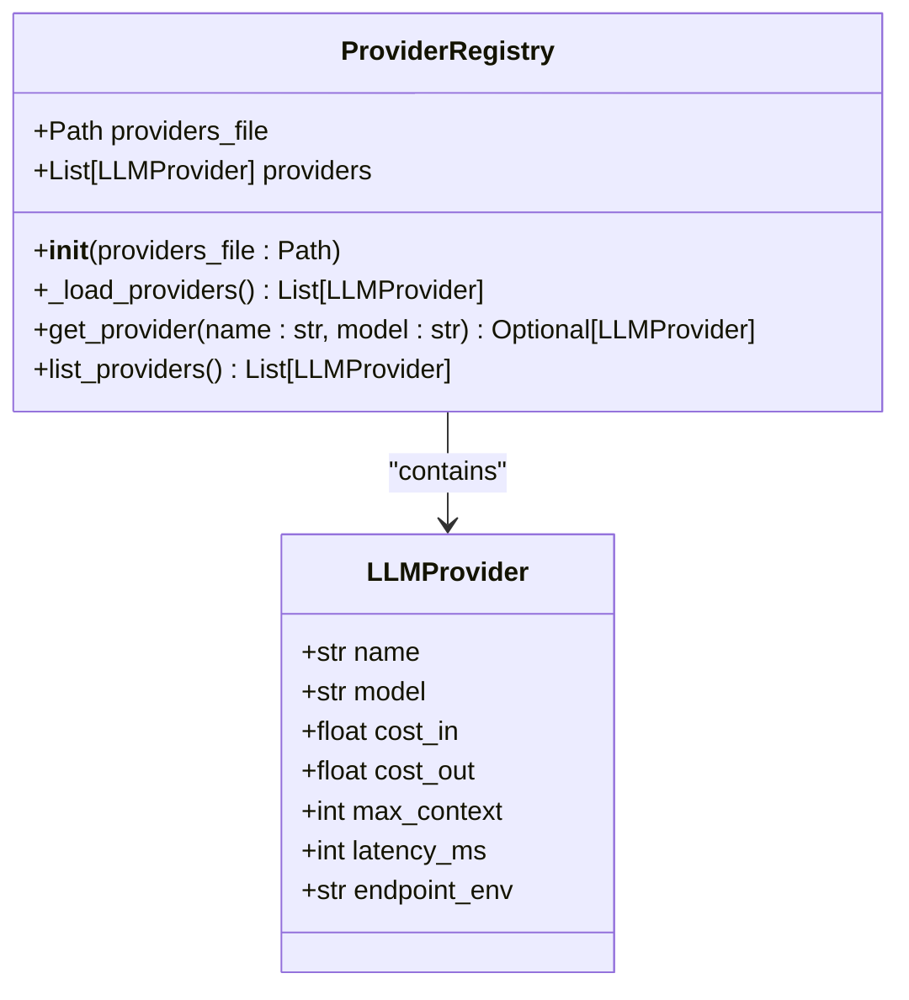
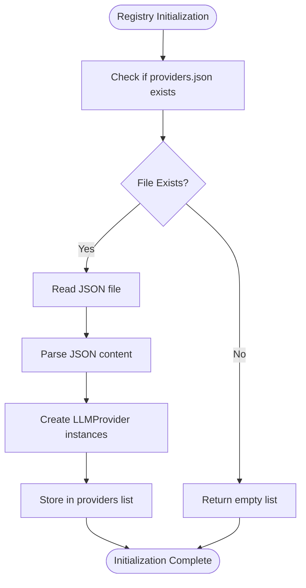
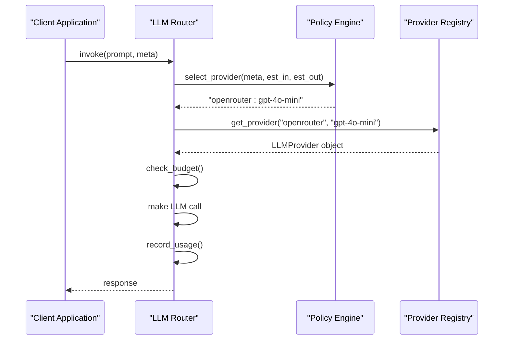

# Provider Registry

<cite>
**Referenced Files in This Document**   
- [provider_registry.py](file://371-os\src\minds371\adaptive_llm_router\provider_registry.py)
- [providers.json](file://371-os\src\minds371\adaptive_llm_router\providers.json)
- [data_models.py](file://371-os\src\minds371\adaptive_llm_router\data_models.py)
- [policy_engine.py](file://371-os\src\minds371\adaptive_llm_router\policy_engine.py)
- [llm.py](file://371-os\src\minds371\adaptive_llm_router\llm.py)
- [usage_ledger.py](file://371-os\src\minds371\adaptive_llm_router\usage_ledger.py)
</cite>

## Table of Contents
1. [Introduction](#introduction)
2. [Provider Registry Overview](#provider-registry-overview)
3. [Provider Metadata Structure](#provider-metadata-structure)
4. [Registry Initialization and Loading](#registry-initialization-and-loading)
5. [Interface Methods](#interface-methods)
6. [Integration with Policy Engine](#integration-with-policy-engine)
7. [Integration with Usage Ledger](#integration-with-usage-ledger)
8. [Runtime Registration Support](#runtime-registration-support)
9. [Troubleshooting Guide](#troubleshooting-guide)

## Introduction
The Provider Registry is a core sub-component of the Adaptive LLM Router system, responsible for maintaining a dynamic catalog of available Large Language Model (LLM) providers. It serves as the central source of truth for provider metadata, enabling intelligent routing decisions based on cost, performance, and capability characteristics. This document provides a comprehensive analysis of the Provider Registry's implementation, functionality, and integration points within the broader system architecture.

## Provider Registry Overview

The Provider Registry component manages the catalog of available LLM providers by loading configuration data from a JSON file and providing a programmatic interface for querying provider capabilities. It plays a critical role in the adaptive routing system by supplying up-to-date information about provider characteristics such as model types, cost structure, latency, and context window sizes.

The registry operates as a singleton instance initialized with a path to the providers configuration file. It exposes methods to retrieve specific providers by name and model, as well as to list all available providers. The component is designed to be lightweight and efficient, with minimal overhead for provider lookups during routing operations.



**Diagram sources**
- [provider_registry.py](file://371-os\src\minds371\adaptive_llm_router\provider_registry.py)
- [data_models.py](file://371-os\src\minds371\adaptive_llm_router\data_models.py)

**Section sources**
- [provider_registry.py](file://371-os\src\minds371\adaptive_llm_router\provider_registry.py#L1-L44)

## Provider Metadata Structure

The structure of provider metadata is defined by the `LLMProvider` Pydantic model, which specifies the schema for each provider entry in the registry. This model ensures type safety and data validation for all provider configurations.

The following fields are included in each provider record:

- **name**: The provider identifier (e.g., "openrouter", "requesty")
- **model**: The specific model name (e.g., "gpt-4o-mini", "claude-3-sonnet")
- **cost_in**: Cost per 1,000 input tokens in USD
- **cost_out**: Cost per 1,000 output tokens in USD
- **max_context**: Maximum context window size in tokens
- **latency_ms**: Expected latency in milliseconds
- **endpoint_env**: Environment variable containing the API key

The `providers.json` file contains an array of provider configurations that adhere to this schema. Sample entries include providers from OpenRouter, Requesty, and local AI instances, covering a range of models from high-performance commercial offerings to cost-effective open-source alternatives.

```json
[
  {
    "name": "openrouter",
    "model": "gpt-4o-mini",
    "cost_in": 0.0006,
    "cost_out": 0.0006,
    "max_context": 128000,
    "latency_ms": 500,
    "endpoint_env": "OPENROUTER_API_KEY"
  },
  {
    "name": "localai",
    "model": "phi-4-14b",
    "cost_in": 0.0,
    "cost_out": 0.0,
    "max_context": 32000,
    "latency_ms": 200,
    "endpoint_env": "LOCALAI_API_KEY"
  }
]
```

**Section sources**
- [data_models.py](file://371-os\src\minds371\adaptive_llm_router\data_models.py#L8-L18)
- [providers.json](file://371-os\src\minds371\adaptive_llm_router\providers.json)

## Registry Initialization and Loading

The Provider Registry is initialized with a path to the providers configuration file, which by default is located at `providers.json` in the same directory as the module. During initialization, the registry automatically loads all provider configurations from the JSON file into memory.

The loading process is implemented in the `_load_providers` method, which performs the following steps:
1. Checks if the providers file exists
2. If the file exists, reads and parses the JSON content
3. Converts each provider object into an `LLMProvider` instance using Pydantic's model initialization
4. Returns a list of `LLMProvider` objects

If the providers file does not exist, the method returns an empty list, allowing the system to operate with no available providers until configurations are added. This graceful degradation prevents startup failures when provider configurations are missing.

A default instance of the registry is created at module level, making it readily available for import and use by other components without requiring explicit instantiation.



**Section sources**
- [provider_registry.py](file://371-os\src\minds371\adaptive_llm_router\provider_registry.py#L10-L25)

## Interface Methods

The Provider Registry exposes a simple interface with two primary methods for querying provider information:

### get_provider
Retrieves a specific provider by name and model combination. This method iterates through the loaded providers and returns the first match, or `None` if no matching provider is found.

```python
def get_provider(self, name: str, model: str) -> Optional[LLMProvider]:
    for provider in self.providers:
        if provider.name == name and provider.model == model:
            return provider
    return None
```

### list_providers
Returns a list of all available providers currently loaded in the registry. This method provides a complete view of the provider catalog for bulk operations or discovery purposes.

```python
def list_providers(self) -> List[LLMProvider]:
    return self.providers
```

These methods are designed to be thread-safe as they only perform read operations on immutable data structures. The simplicity of the interface makes it easy to integrate with other system components while providing the essential functionality needed for provider discovery and selection.

**Section sources**
- [provider_registry.py](file://371-os\src\minds371\adaptive_llm_router\provider_registry.py#L27-L39)

## Integration with Policy Engine

The Provider Registry is tightly integrated with the Policy Engine, which uses provider metadata to make intelligent routing decisions. The Policy Engine queries the registry to validate provider selections and access cost and performance metrics for decision-making.

In the routing workflow, the Policy Engine first determines the appropriate provider based on task requirements and budget constraints. It then uses the `get_provider` method to retrieve the complete provider details from the registry. This information is used to:
- Verify the provider's existence in the catalog
- Calculate expected costs based on token usage estimates
- Consider latency and context window requirements
- Validate that required API keys are available via the specified environment variable

The following sequence diagram illustrates how the main LLM invocation flow integrates the Provider Registry with the Policy Engine:



**Diagram sources**
- [llm.py](file://371-os\src\minds371\adaptive_llm_router\llm.py#L45-L60)
- [policy_engine.py](file://371-os\src\minds371\adaptive_llm_router\policy_engine.py)
- [provider_registry.py](file://371-os\src\minds371\adaptive_llm_router\provider_registry.py)

**Section sources**
- [llm.py](file://371-os\src\minds371\adaptive_llm_router\llm.py#L45-L60)

## Integration with Usage Ledger

The Provider Registry integrates with the Usage Ledger to ensure accurate cost tracking and reporting. When an LLM request is processed, the system uses provider details from the registry to calculate the actual cost based on token usage.

The cost calculation uses the `cost_in` and `cost_out` values from the provider metadata:
- Input cost = (tokens_in / 1000) × cost_in
- Output cost = (tokens_out / 1000) × cost_out
- Total cost = input cost + output cost

This calculated cost is then recorded in the Usage Ledger along with other usage metrics. The integration ensures that cost reporting is consistent with the provider configurations and reflects the actual pricing structure of each provider.

```python
cost = (
    (tokens_in / 1000) * provider_details.cost_in +
    (tokens_out / 1000) * provider_details.cost_out
)
usage_ledger.record_usage(usage_data)
```

This tight integration between the Provider Registry and Usage Ledger enables accurate budget tracking and provides the foundation for the system's cost optimization capabilities.

**Section sources**
- [llm.py](file://371-os\src\minds371\adaptive_llm_router\llm.py#L75-L85)
- [usage_ledger.py](file://371-os\src\minds371\adaptive_llm_router\usage_ledger.py)

## Runtime Registration Support

Based on the code analysis, the current implementation of the Provider Registry does not support runtime registration of new providers. The registry is initialized with a fixed set of providers loaded from the `providers.json` file during startup, and there are no methods exposed to add, modify, or remove providers at runtime.

The design follows a static configuration approach where provider changes require:
1. Modifying the `providers.json` file
2. Restarting the application to reload the configuration

This approach prioritizes simplicity and reliability over dynamic flexibility. While it limits the ability to dynamically discover and register new providers during operation, it ensures configuration consistency and reduces complexity in managing provider state.

Future enhancements could introduce runtime registration capabilities by adding methods such as:
- `register_provider(provider: LLMProvider) -> bool`
- `update_provider(name: str, model: str, updates: dict) -> bool`
- `deregister_provider(name: str, model: str) -> bool`

These methods would enable dynamic provider management while maintaining type safety through the Pydantic model validation.

**Section sources**
- [provider_registry.py](file://371-os\src\minds371\adaptive_llm_router\provider_registry.py)

## Troubleshooting Guide

This section addresses common issues related to the Provider Registry and provides guidance for diagnosis and resolution.

### Stale Provider Data
**Symptoms**: Routing decisions based on outdated cost, latency, or availability information.

**Causes**:
- Changes to `providers.json` without restarting the application
- Manual edits to the configuration file that don't conform to the expected schema
- File permission issues preventing updates

**Solutions**:
1. Restart the application to reload the provider configuration
2. Validate the JSON syntax of `providers.json` using a JSON validator
3. Ensure the file is writable and has appropriate permissions
4. Verify that all required fields are present and correctly typed

### Failed Provider Lookups
**Symptoms**: `ValueError` with message "Provider {provider} not found in registry" during LLM invocation.

**Causes**:
- Provider name or model specified in routing logic does not match any entry in `providers.json`
- Typographical errors in provider or model names
- Missing provider configuration for a required service

**Solutions**:
1. Check the `providers.json` file for the requested provider and model combination
2. Verify exact spelling and case sensitivity of provider and model names
3. Add the missing provider configuration to `providers.json`
4. Use `list_providers()` to inspect all available providers

### Health Check Failures
**Note**: The current implementation does not include built-in health checks for individual providers. Provider availability is verified at the time of LLM invocation through the underlying API call.

**Best Practices for Monitoring**:
1. Implement external monitoring of provider endpoints
2. Use the Usage Ledger to track error rates and latency trends
3. Set up alerts for repeated provider failures
4. Consider implementing a circuit breaker pattern for unreliable providers

The absence of proactive health checks means that provider issues are typically discovered reactively during request processing. Future versions could enhance reliability by incorporating periodic health checks and provider status tracking.

**Section sources**
- [provider_registry.py](file://371-os\src\minds371\adaptive_llm_router\provider_registry.py)
- [llm.py](file://371-os\src\minds371\adaptive_llm_router\llm.py#L55-L60)
- [providers.json](file://371-os\src\minds371\adaptive_llm_router\providers.json)