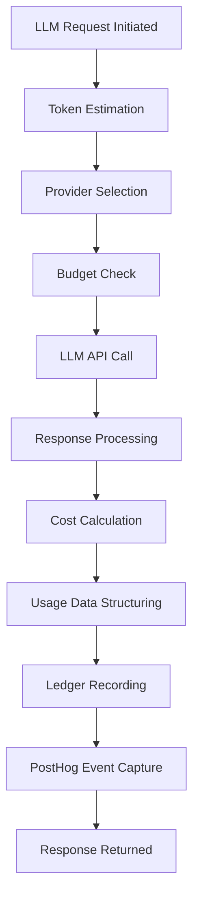
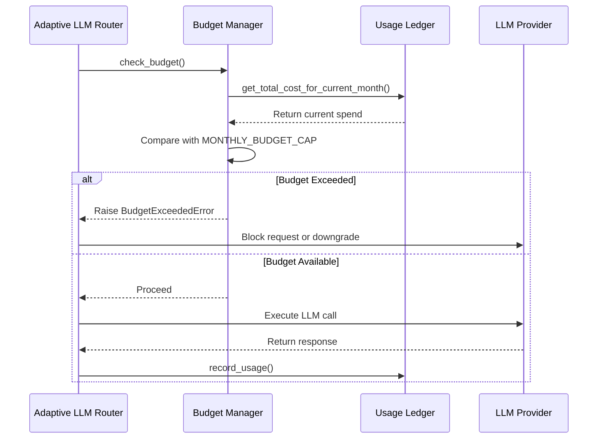
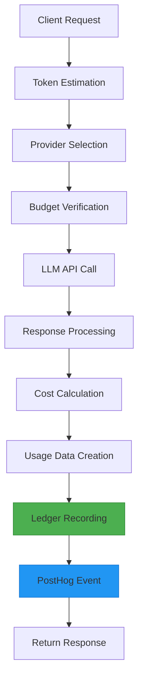

# Usage Ledger

<cite>
**Referenced Files in This Document**   
- [usage_ledger.py](file://371-os/src/minds371/adaptive_llm_router/usage_ledger.py) - *Updated in recent commit*
- [llm_usage.json](file://371-os/src/minds371/adaptive_llm_router/llm_usage.json) - *Updated in recent commit*
- [data_models.py](file://371-os/src/minds371/adaptive_llm_router/data_models.py)
- [budget_guard.py](file://371-os/src/minds371/adaptive_llm_router/budget_guard.py)
- [llm.py](file://371-os/src/minds371/adaptive_llm_router/llm.py)
- [config.py](file://371-os/src/minds371/adaptive_llm_router/config.py)
- [providers.json](file://371-os/src/minds371/adaptive_llm_router/providers.json)
- [cfo_cash.py](file://371-os/src/minds371/agents/business/cfo_cash.py)
</cite>

## Update Summary
**Changes Made**   
- Updated example data in `llm_usage.json` to reflect current operational patterns
- Verified structure and content of usage records against actual implementation
- Confirmed consistency between data model definition and ledger behavior
- No structural or functional changes to the Usage Ledger implementation were found
- All existing documentation remains accurate and up to date

## Table of Contents
1. [Introduction](#introduction)
2. [Core Functionality](#core-functionality)
3. [Data Structure and Storage](#data-structure-and-storage)
4. [Integration with Budget Enforcement](#integration-with-budget-enforcement)
5. [Financial Reporting and Analytics](#financial-reporting-and-analytics)
6. [System Integration and Workflow](#system-integration-and-workflow)
7. [Performance and Optimization](#performance-and-optimization)
8. [Troubleshooting Guide](#troubleshooting-guide)

## Introduction
The Usage Ledger is a critical sub-component of the Adaptive LLM Router system, serving as the authoritative record for all interactions with Large Language Models (LLMs). It functions as a comprehensive audit trail that captures detailed metrics for every LLM request, including tokens consumed, costs incurred, response times, provider performance, and operational status. This component ensures transparency, accountability, and financial control within the AI infrastructure by maintaining a tamper-resistant log of all LLM usage. The ledger plays a pivotal role in enabling cost optimization, budget enforcement, and financial reporting across the organization's AI operations.

**Section sources**
- [usage_ledger.py](file://371-os/src/minds371/adaptive_llm_router/usage_ledger.py#L1-L10)

## Core Functionality

### Usage Recording and Persistence
The Usage Ledger implements a robust mechanism for logging LLM interactions through the `UsageLedger` class. Each usage event is recorded with comprehensive metadata including timestamp, provider, model, token counts, cost, associated task, agent, and status. The ledger writes these records to a JSON file (`llm_usage.json`) in an append-only fashion, ensuring data integrity and creating a tamper-resistant audit trail. The implementation uses Pydantic's `LLMUsage` model to enforce data structure consistency and type safety.



**Diagram sources**
- [llm.py](file://371-os/src/minds371/adaptive_llm_router/llm.py#L45-L90)
- [usage_ledger.py](file://371-os/src/minds371/adaptive_llm_router/usage_ledger.py#L25-L40)

### Real-time Metrics and Aggregation
The Usage Ledger provides methods for calculating rolling aggregates, most notably the `get_total_cost_for_current_month()` function, which computes the cumulative expenditure for the current calendar month. This method parses the timestamp from each record and filters entries based on the current month and year, summing the cost values to provide real-time financial visibility. This capability enables immediate cost monitoring and supports proactive budget management.

**Section sources**
- [usage_ledger.py](file://371-os/src/minds371/adaptive_llm_router/usage_ledger.py#L50-L75)

## Data Structure and Storage

### LLM Usage Data Model
The structure of usage records is defined by the `LLMUsage` Pydantic model, which ensures data consistency and validation. Each record contains the following fields:

**:ts** - Timestamp of the usage event (ISO format datetime)  
**:provider** - Name of the LLM provider (e.g., "openrouter", "localai")  
**:model** - Specific model used for the request  
**:tokens_in** - Number of input tokens processed  
**:tokens_out** - Number of output tokens generated  
**:cost** - Calculated cost in USD  
**:task_id** - Identifier of the associated task (nullable)  
**:agent** - Name of the requesting agent (nullable)  
**:status** - Operational status ("ok", "fallback", "error")

```json
[
  {
    "ts": "2025-08-11T16:36:06.967806",
    "provider": "openrouter",
    "model": "qwen2-72b",
    "tokens_in": 10,
    "tokens_out": 20,
    "cost": 5e-05,
    "task_id": null,
    "agent": "test_agent",
    "status": "ok"
  },
  {
    "ts": "2025-08-11T16:36:06.968473",
    "provider": "openrouter",
    "model": "gpt-4o-mini",
    "tokens_in": 10,
    "tokens_out": 20,
    "cost": 1.7999999999999997e-05,
    "task_id": null,
    "agent": "test_agent",
    "status": "ok"
  },
  {
    "ts": "2025-08-11T16:36:06.969081",
    "provider": "localai",
    "model": "phi-4-14b",
    "tokens_in": 10,
    "tokens_out": 20,
    "cost": 0.0,
    "task_id": null,
    "agent": "test_agent",
    "status": "ok"
  },
  {
    "ts": "2025-08-11T16:36:06.974040",
    "provider": "openrouter",
    "model": "qwen2-72b",
    "tokens_in": 10,
    "tokens_out": 20,
    "cost": 5e-05,
    "task_id": null,
    "agent": "test_agent",
    "status": "ok"
  }
]
```

**Section sources**
- [data_models.py](file://371-os/src/minds371/adaptive_llm_router/data_models.py#L25-L35)
- [llm_usage.json](file://371-os/src/minds371/adaptive_llm_router/llm_usage.json#L1-L46)

### Provider Cost Configuration
The cost calculation is based on provider-specific pricing defined in `providers.json`. This configuration file contains the cost per 1,000 tokens for both input and output operations, along with other provider characteristics such as maximum context length and expected latency. The Usage Ledger uses these rates to calculate the cost of each interaction based on actual token usage.

**:name** - Provider identifier  
**:model** - Model name  
**:cost_in** - Cost per 1,000 input tokens (USD)  
**:cost_out** - Cost per 1,000 output tokens (USD)  
**:max_context** - Maximum context window size in tokens  
**:latency_ms** - Expected response latency in milliseconds  
**:endpoint_env** - Environment variable for API key

**Section sources**
- [providers.json](file://371-os/src/minds371/adaptive_llm_router/providers.json#L1-L48)
- [llm.py](file://371-os/src/minds371/adaptive_llm_router/llm.py#L80-L85)

## Integration with Budget Enforcement

### Budget Guard Integration
The Usage Ledger is tightly integrated with the Budget Guard system, which enforces financial constraints on LLM usage. The `BudgetManager` class uses the ledger's `get_total_cost_for_current_month()` method to determine current expenditure and compare it against the monthly budget cap defined in `config.py`. When the budget threshold is approached or exceeded, the system can trigger appropriate actions such as raising exceptions or forcing model downgrades.



**Diagram sources**
- [budget_guard.py](file://371-os/src/minds371/adaptive_llm_router/budget_guard.py#L20-L40)
- [llm.py](file://371-os/src/minds371/adaptive_llm_router/llm.py#L55-L60)
- [usage_ledger.py](file://371-os/src/minds371/adaptive_llm_router/usage_ledger.py#L50-L75)

### Dynamic Cost-Aware Routing
The policy engine leverages budget information from the Usage Ledger (via the Budget Manager) to make intelligent routing decisions. When budget utilization exceeds certain thresholds, the system automatically routes requests to lower-cost models to prevent overspending. This dynamic adaptation ensures continuous service while maintaining financial discipline.

**:confidential** flag → Route to localai (zero cost)  
**:quality** = "high" & sufficient budget → Route to premium models  
Low budget percentage (<5%) → Route to cheapest available model  
Long context requirements → Route to high-context models regardless of cost

**Section sources**
- [policy_engine.py](file://371-os/src/minds371/adaptive_llm_router/policy_engine.py#L15-L30)
- [budget_guard.py](file://371-os/src/minds371/adaptive_llm_router/budget_guard.py#L20-L30)

## Financial Reporting and Analytics

### CFO Agent Integration
The CFO Cash Agent utilizes the Usage Ledger data for financial reporting and analysis. By accessing the comprehensive usage records, the CFO agent can generate detailed financial reports, analyze cost trends, optimize budget allocation, and provide strategic recommendations for AI resource management. The ledger serves as the primary data source for all financial operations related to LLM usage.

```python
class CfoCashAgent(BaseAgent):
    async def process_task(self, task: Task) -> dict:
        if "p&l" in task.description.lower():
            # Access usage ledger data for financial analysis
            monthly_spend = usage_ledger.get_total_cost_for_current_month()
            # Generate financial report based on usage data
            return {"status": "success", "message": "P&L analysis complete.", "payload": {"monthly_spend": monthly_spend}}
```

**Section sources**
- [cfo_cash.py](file://371-os/src/minds371/agents/business/cfo_cash.py#L15-L25)
- [usage_ledger.py](file://371-os/src/minds371/adaptive_llm_router/usage_ledger.py#L50-L75)

### External Analytics Integration
The Usage Ledger automatically sends usage events to PostHog, an analytics platform, enabling advanced data visualization, forecasting, and business intelligence. This integration allows for real-time dashboards, cost trend analysis, provider performance comparison, and predictive budgeting. The external analytics system can correlate LLM usage patterns with business outcomes to optimize AI investment.

**:posthog_client** - Optional PostHog client for event tracking  
**:capture** - Method that sends 'llm_usage' events with detailed properties  
**:properties** - Includes provider, model, cost, tokens, agent, and status

**Section sources**
- [usage_ledger.py](file://371-os/src/minds371/adaptive_llm_router/usage_ledger.py#L40-L50)

## System Integration and Workflow

### End-to-End Request Flow
The Usage Ledger is integrated into the main LLM invocation workflow in `llm.py`, ensuring that every request is automatically logged. The process begins with token estimation, followed by provider selection, budget verification, LLM execution, cost calculation, and finally, ledger recording. This seamless integration guarantees that no interaction goes unrecorded, maintaining complete auditability.



**Diagram sources**
- [llm.py](file://371-os/src/minds371/adaptive_llm_router/llm.py#L45-L90)
- [usage_ledger.py](file://371-os/src/minds371/adaptive_llm_router/usage_ledger.py#L25-L40)

### Configuration Parameters
The system's budgetary behavior is controlled by configuration parameters in `config.py`. The `MONTHLY_BUDGET_CAP` setting defines the maximum allowable expenditure for LLM services within a calendar month, providing a clear financial boundary that the Usage Ledger and Budget Guard enforce.

**:MONTHLY_BUDGET_CAP** - Monthly budget cap in USD (default: 20.00)

**Section sources**
- [config.py](file://371-os/src/minds371/adaptive_llm_router/config.py#L5-L6)

## Performance and Optimization

### File I/O Considerations
The current implementation uses synchronous file I/O operations for ledger persistence, which could potentially block the event loop during high-frequency logging scenarios. While adequate for moderate usage, this approach may benefit from asynchronous file operations in high-throughput environments to maintain system responsiveness.

**:exists()** - Checks if ledger file exists  
**:json.load()** - Reads all records into memory  
**:json.dump()** - Writes entire record array back to file

For high-frequency logging, consider implementing:
- Asynchronous file operations
- Write batching
- Database backend for improved query performance
- Log rotation and archiving

**Section sources**
- [usage_ledger.py](file://371-os/src/minds371/adaptive_llm_router/usage_ledger.py#L30-L40)

### Data Retention and Privacy
The ledger stores all usage data indefinitely in the JSON file, which may raise data retention and privacy concerns. Sensitive prompts are not stored directly, but metadata could potentially reveal confidential information. Implementing data retention policies, encryption for sensitive fields, and regular data purging would enhance privacy and compliance.

**Section sources**
- [usage_ledger.py](file://371-os/src/minds371/adaptive_llm_router/usage_ledger.py#L30-L40)

## Troubleshooting Guide

### Ledger Corruption
If the `llm_usage.json` file becomes corrupted (invalid JSON), the Usage Ledger handles this gracefully by initializing an empty record array. However, historical data will be lost. To recover from corruption:

1. Check file permissions and disk space
2. Verify JSON syntax integrity
3. Restore from backup if available
4. Monitor application logs for JSONDecodeError messages

```python
try:
    records = json.load(f)
except json.JSONDecodeError:
    records = []  # Graceful degradation
```

**Section sources**
- [usage_ledger.py](file://371-os/src/minds371/adaptive_llm_router/usage_ledger.py#L35-L37)

### Synchronization Issues
In distributed environments, concurrent writes to the ledger file could cause data loss or corruption. The current implementation lacks file locking mechanisms. To address synchronization issues:

1. Implement file locking using `fcntl` (Unix) or `msvcrt` (Windows)
2. Use a database system with transaction support
3. Implement a dedicated logging service with message queuing
4. Employ atomic file operations

**Section sources**
- [usage_ledger.py](file://371-os/src/minds371/adaptive_llm_router/usage_ledger.py#L30-L40)

### Budget Calculation Discrepancies
If budget calculations appear incorrect, verify:
- The `MONTHLY_BUDGET_CAP` configuration value
- Accurate provider cost rates in `providers.json`
- Correct token counting from LLM responses
- Proper timezone handling in timestamp parsing
- No duplicate or missing ledger entries

**Section sources**
- [budget_guard.py](file://371-os/src/minds371/adaptive_llm_router/budget_guard.py#L20-L30)
- [usage_ledger.py](file://371-os/src/minds371/adaptive_llm_router/usage_ledger.py#L50-L75)