# Advanced Topics

<cite>
**Referenced Files in This Document**   
- [intelligent_router_agent.py](file://371-os/src/minds371/adaptive_llm_router/intelligent_router_agent.py)
- [improved_base_agent.py](file://371-os/src/minds371/agents/base_agent/improved_base_agent.py)
- [config.py](file://371-os/src/minds371/adaptive_llm_router/config.py)
- [budget_guard.py](file://371-os/src/minds371/adaptive_llm_router/budget_guard.py)
- [usage_ledger.py](file://371-os/src/minds371/adaptive_llm_router/usage_ledger.py)
- [data_models.py](file://371-os/src/minds371/adaptive_llm_router/data_models.py)
- [policy_engine.py](file://371-os/src/minds371/adaptive_llm_router/policy_engine.py)
- [provider_registry.py](file://371-os/src/minds371/adaptive_llm_router/provider_registry.py)
- [llm.py](file://371-os/src/minds371/adaptive_llm_router/llm.py)
- [agent_utility_belt.py](file://371-os/src/minds371/agents/utility/agent_utility_belt.py)
- [system_architecture.html](file://371-os/docs/architecture/system_architecture.html)
- [_MASTER_ARCHITECTURE.md](file://371-os/_MASTER_ARCHITECTURE.md)
</cite>

## Table of Contents
1. [Introduction](#introduction)
2. [Architecture Overview](#architecture-overview)
3. [Core Components](#core-components)
4. [Adaptive LLM Router System](#adaptive-llm-router-system)
5. [Agent Utility Belt Implementation](#agent-utility-belt-implementation)
6. [Performance and Monitoring](#performance-and-monitoring)
7. [Security and Budget Management](#security-and-budget-management)
8. [Integration Patterns](#integration-patterns)
9. [Conclusion](#conclusion)

## Introduction
The 371OS platform represents a sophisticated multi-agent architecture designed to automate complex business operations through intelligent agent orchestration. This document explores advanced topics in 371OS development and operation, focusing on custom agent development, adaptive LLM routing, performance optimization, and security hardening techniques. The system implements a hierarchical C-Suite agent structure that mirrors traditional corporate leadership, enabling autonomous decision-making and task delegation across specialized domains.

**Section sources**
- [system_architecture.html](file://371-os/docs/architecture/system_architecture.html#L1-L200)
- [_MASTER_ARCHITECTURE.md](file://371-os/_MASTER_ARCHITECTURE.md#L1-L8)

## Architecture Overview

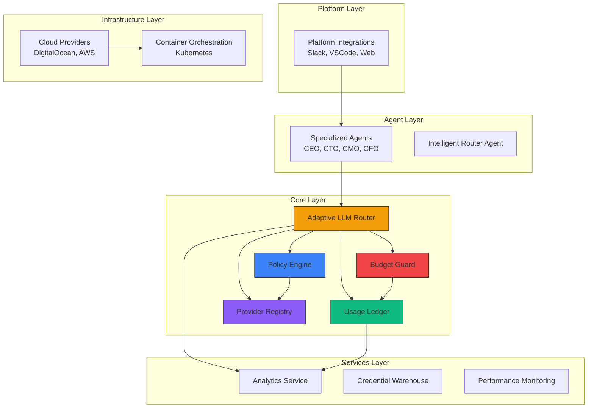

**Diagram sources**
- [system_architecture.html](file://371-os/docs/architecture/system_architecture.html#L1-L200)
- [intelligent_router_agent.py](file://371-os/src/minds371/adaptive_llm_router/intelligent_router_agent.py#L1-L105)

## Core Components

The 371OS platform is built on a hierarchical agent architecture that implements the Orchestrator-Worker pattern with C-Suite level oversight. At its foundation is the `ImprovedBaseAgent` class, which provides a robust framework for agent implementation with built-in performance monitoring, task queuing, and error handling capabilities.

The system features specialized agents for different business functions, including CEO, CTO, CMO, CFO, and other C-Suite roles, each designed to handle specific domains of expertise. These agents communicate through a centralized task queue system and can delegate tasks to one another based on their specialized capabilities.

The Intelligent Router Agent serves as a central coordination point, using MindScript to analyze incoming commands and route them to the appropriate specialized agent based on the task's category and requirements.

**Section sources**
- [improved_base_agent.py](file://371-os/src/minds371/agents/base_agent/improved_base_agent.py#L1-L526)
- [intelligent_router_agent.py](file://371-os/src/minds371/adaptive_llm_router/intelligent_router_agent.py#L1-L105)

## Adaptive LLM Router System

### System Architecture
The Adaptive LLM Router is the central hub for all LLM interactions within the 371OS platform. It implements intelligent provider selection, cost optimization, and usage tracking to ensure efficient and economical operation.

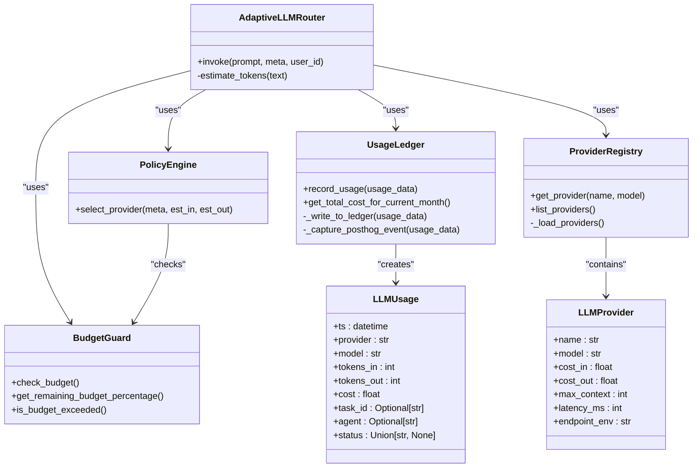

**Diagram sources**
- [llm.py](file://371-os/src/minds371/adaptive_llm_router/llm.py#L1-L92)
- [policy_engine.py](file://371-os/src/minds371/adaptive_llm_router/policy_engine.py#L1-L34)
- [budget_guard.py](file://371-os/src/minds371/adaptive_llm_router/budget_guard.py#L1-L50)
- [usage_ledger.py](file://371-os/src/minds371/adaptive_llm_router/usage_ledger.py#L1-L89)
- [provider_registry.py](file://371-os/src/minds371/adaptive_llm_router/provider_registry.py#L1-L45)
- [data_models.py](file://371-os/src/minds371/adaptive_llm_router/data_models.py#L1-L40)

### Policy Engine Implementation
The Policy Engine implements a decision graph to select the optimal LLM provider based on multiple factors including budget status, task criticality, context length requirements, and privacy considerations.

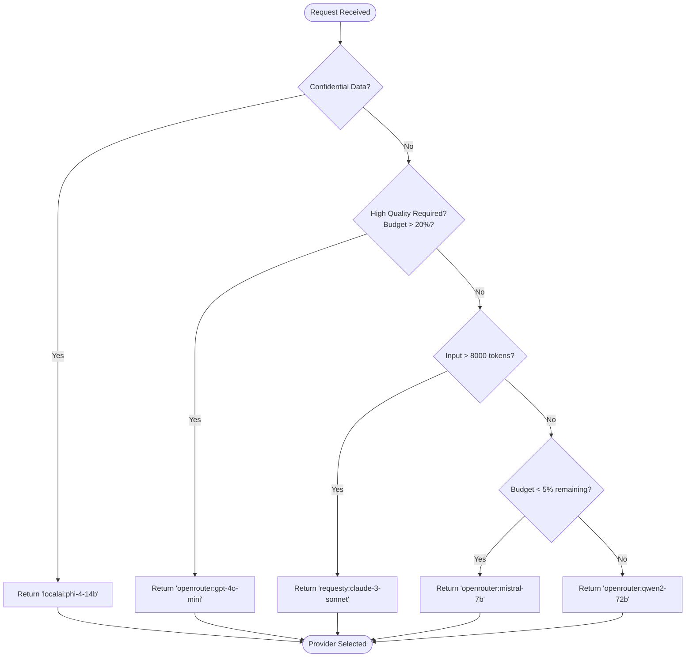

**Diagram sources**
- [policy_engine.py](file://371-os/src/minds371/adaptive_llm_router/policy_engine.py#L1-L34)

### LLM Invocation Flow
The LLM invocation process follows a comprehensive workflow that ensures cost-effective and reliable operation.

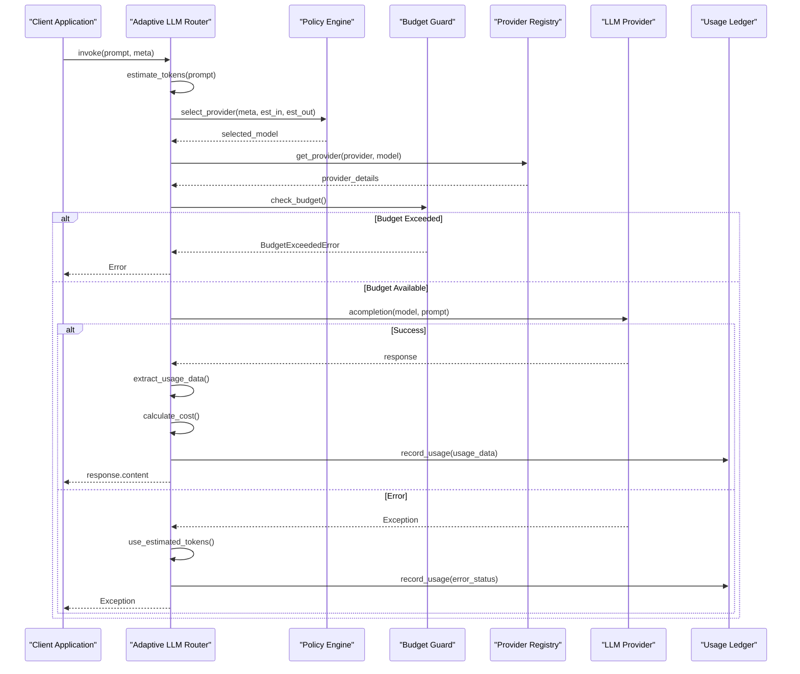

**Diagram sources**
- [llm.py](file://371-os/src/minds371/adaptive_llm_router/llm.py#L1-L92)

## Agent Utility Belt Implementation

### Class Structure
The Agent Utility Belt provides a collection of utility functions for service discovery and management within the 371OS ecosystem.

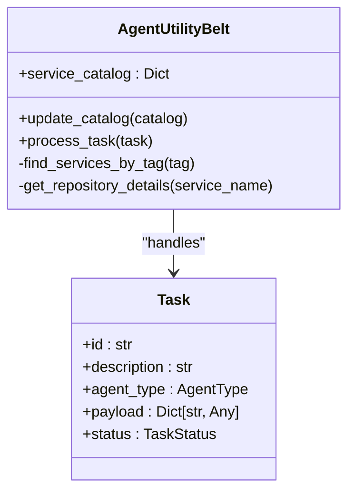

**Diagram sources**
- [agent_utility_belt.py](file://371-os/src/minds371/agents/utility/agent_utility_belt.py#L1-L82)

### Service Catalog Structure
The utility belt maintains a service catalog organized by category and service, with associated metadata including tags and repository information.

```json
{
  "by_category": [
    {
      "ip": {
        "l2.io": {
          "tags": ["curl", "plain"]
        },
        "echoip.de": {
          "tags": ["curl", "plain"]
        }
      }
    },
    {
      "geo": {
        "ipinfo.io": {
          "tags": ["curl", "json"],
          "repository": "https://github.com/ipinfo/ipinfo"
        }
      }
    }
  ]
}
```

**Section sources**
- [agent_utility_belt.py](file://371-os/src/minds371/agents/utility/agent_utility_belt.py#L15-L25)

## Performance and Monitoring

### Base Agent Architecture
The ImprovedBaseAgent class provides a comprehensive foundation for all agents in the 371OS system, incorporating performance optimization and monitoring capabilities.

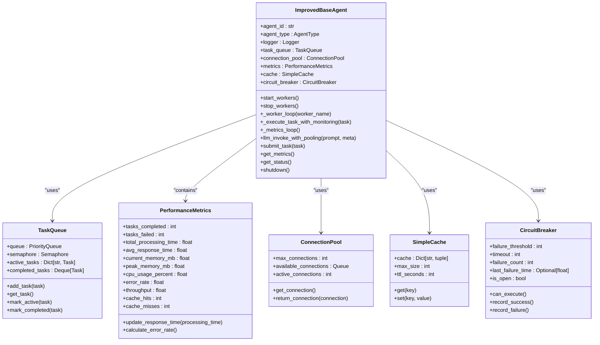

**Diagram sources**
- [improved_base_agent.py](file://371-os/src/minds371/agents/base_agent/improved_base_agent.py#L1-L526)

### Worker Execution Flow
The base agent implements a sophisticated worker system for processing tasks with comprehensive monitoring and error handling.

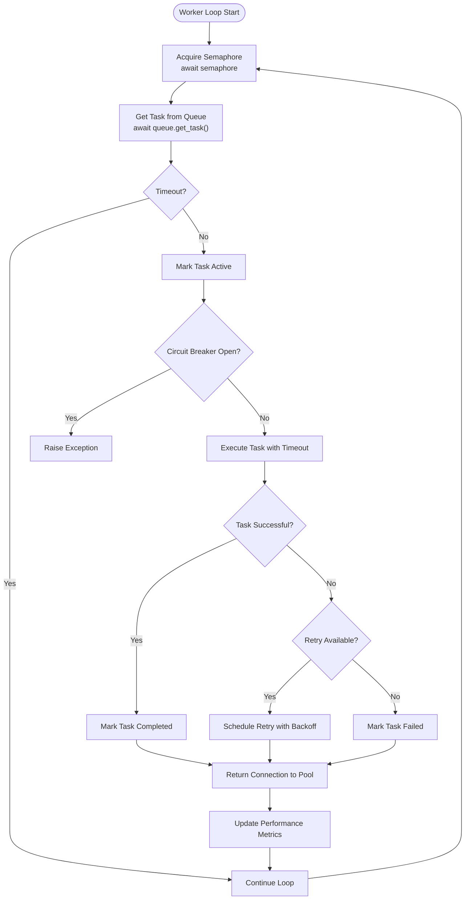

**Diagram sources**
- [improved_base_agent.py](file://371-os/src/minds371/agents/base_agent/improved_base_agent.py#L200-L399)

## Security and Budget Management

### Budget Management System
The budget management system implements hard-stop gates to prevent overspending on LLM usage, with configurable monthly caps and detailed usage tracking.

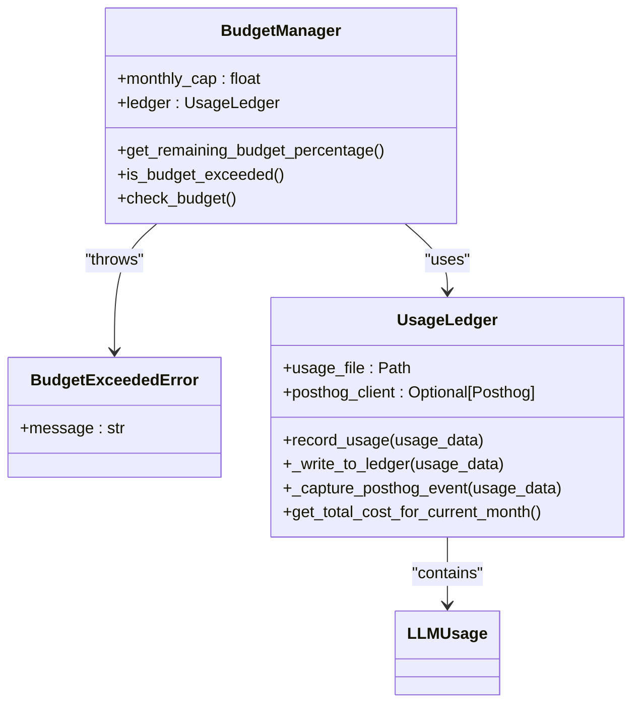

**Diagram sources**
- [budget_guard.py](file://371-os/src/minds371/adaptive_llm_router/budget_guard.py#L1-L50)
- [usage_ledger.py](file://371-os/src/minds371/adaptive_llm_router/usage_ledger.py#L1-L89)

### Usage Tracking and Analytics
The system maintains detailed records of all LLM usage for cost analysis, performance monitoring, and compliance auditing.

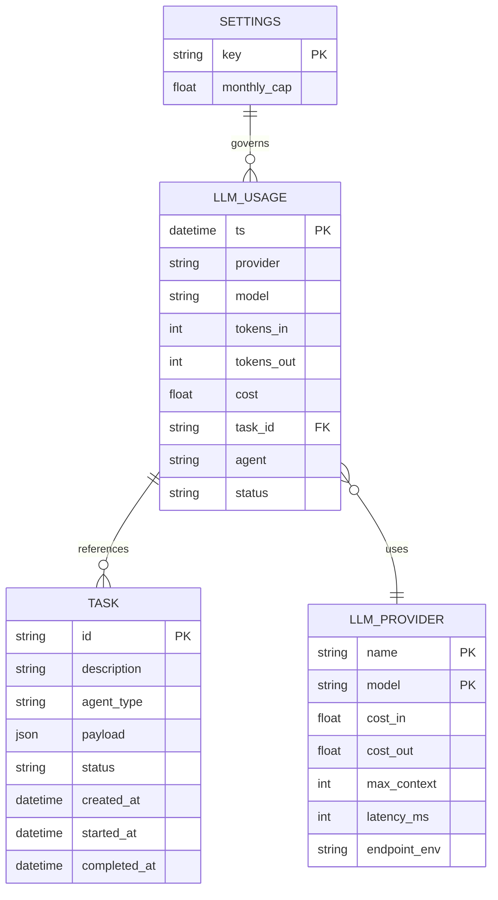

**Diagram sources**
- [data_models.py](file://371-os/src/minds371/adaptive_llm_router/data_models.py#L1-L40)
- [usage_ledger.py](file://371-os/src/minds371/adaptive_llm_router/usage_ledger.py#L1-L89)

## Integration Patterns

### Intelligent Routing Pattern
The Intelligent Router Agent implements a command parsing and delegation pattern that uses MindScript to understand user commands and route them to appropriate specialized agents.

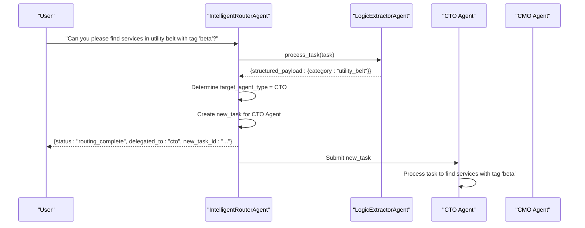

**Diagram sources**
- [intelligent_router_agent.py](file://371-os/src/minds371/adaptive_llm_router/intelligent_router_agent.py#L1-L105)

### Provider Registry Pattern
The Provider Registry implements a configuration-driven pattern for managing LLM providers, loading provider details from a JSON file.

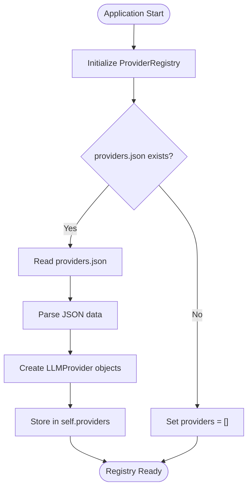

**Diagram sources**
- [provider_registry.py](file://371-os/src/minds371/adaptive_llm_router/provider_registry.py#L1-L45)

## Conclusion
The 371OS platform demonstrates a sophisticated approach to autonomous agent systems, combining hierarchical agent architectures with adaptive LLM routing and comprehensive monitoring. The system's modular design allows for extensibility while maintaining clear separation of concerns between components.

Key strengths include the adaptive LLM router's ability to optimize cost and performance through intelligent provider selection, the robust base agent implementation with built-in performance monitoring, and the comprehensive budget management system that prevents overspending. The integration of PostHog for analytics provides valuable insights into system usage patterns and performance characteristics.

Future development could focus on enhancing the policy engine with machine learning capabilities to dynamically optimize provider selection based on historical performance data, and expanding the security model to include more granular access controls and audit logging capabilities.