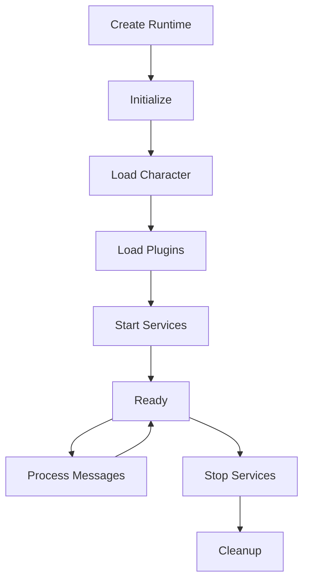
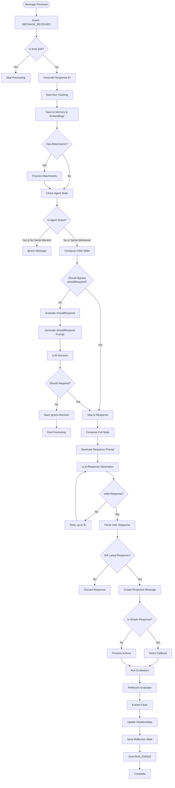
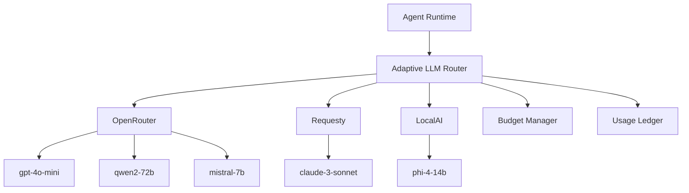

# Agent Runtime Internals

<cite>
**Referenced Files in This Document**   
- [AgentRuntime.md](file://elizaos/Deep Dive/AgentRuntime.md)
- [intelligent_router_agent.py](file://371-os/src/minds371/adaptive_llm_router/intelligent_router_agent.py)
- [improved_base_agent.py](file://371-os/src/minds371/agents/base_agent/improved_base_agent.py)
- [Message Processing Flow.md](file://elizaos/Plugins/Core Plugins/Bootstrap/Message Processing Flow.md)
- [llm.py](file://371-os/src/minds371/adaptive_llm_router/llm.py)
- [policy_engine.py](file://371-os/src/minds371/adaptive_llm_router/policy_engine.py)
- [provider_registry.py](file://371-os/src/minds371/adaptive_llm_router/provider_registry.py)
- [providers.json](file://371-os/src/minds371/adaptive_llm_router/providers.json)
</cite>

## Table of Contents
1. [Introduction](#introduction)
2. [Lifecycle Management](#lifecycle-management)
3. [Message Processing Pipeline](#message-processing-pipeline)
4. [Context Handling Mechanisms](#context-handling-mechanisms)
5. [Interaction with Adaptive LLM Router](#interaction-with-adaptive-llm-router)
6. [Performance Characteristics](#performance-characteristics)
7. [Debugging and Monitoring](#debugging-and-monitoring)
8. [Best Practices for Agent Development](#best-practices-for-agent-development)
9. [Conclusion](#conclusion)

## Introduction
The Agent Runtime is the core engine of the 371OS system, serving as the central orchestrator that manages agent lifecycle, processes messages, and coordinates all system components. This document provides a comprehensive analysis of the Agent Runtime architecture, detailing its key components, operational mechanisms, and integration points. The runtime enables agents to maintain self-awareness through workspace introspection and dynamic capability loading, while providing robust interaction with the Adaptive LLM Router for intelligent decision-making. By understanding the runtime's architecture and behavior, developers can create efficient agent logic that aligns with the system's expectations and leverages its full capabilities.

## Lifecycle Management

The Agent Runtime follows a well-defined lifecycle that ensures proper initialization, operation, and cleanup of agents within the system. This lifecycle management is critical for maintaining system stability and resource efficiency.



**Diagram sources**
- [AgentRuntime.md](file://elizaos/Deep Dive/AgentRuntime.md#L102-L110)

The lifecycle begins with the creation of the runtime instance, followed by initialization where core components are set up. The character configuration is then loaded, which defines the agent's personality, capabilities, and behavior patterns. After character loading, plugins are registered and initialized, extending the agent's functionality with additional actions, providers, evaluators, and services.

Once plugins are loaded, background services are started, preparing the agent for message processing. When all initialization steps are complete, the agent enters the Ready state, where it can begin processing incoming messages. During normal operation, the agent continuously processes messages in a loop, maintaining its state and responding to user interactions.

When shutdown is initiated, services are stopped gracefully, and cleanup operations are performed to release resources and ensure data consistency. This structured lifecycle ensures that agents are properly initialized before use and that resources are properly released during shutdown, preventing memory leaks and other resource management issues.

**Section sources**
- [AgentRuntime.md](file://elizaos/Deep Dive/AgentRuntime.md#L102-L110)

## Message Processing Pipeline

The message processing pipeline in the Agent Runtime is a sophisticated system that handles incoming messages through a series of well-defined steps, ensuring context-aware and appropriate responses.



**Diagram sources**
- [Message Processing Flow.md](file://elizaos/Plugins/Core Plugins/Bootstrap/Message Processing Flow.md#L10-L57)

The pipeline begins when a message is received from a platform such as Discord or Telegram. The first check determines if the message originated from the agent itself, in which case processing is skipped to prevent infinite loops. If the message is from another source, a unique response ID is generated to prevent duplicate responses when multiple messages arrive quickly.

Run tracking is initiated to monitor the processing of the current message, and the message is saved to both memory storage and vector embeddings for future retrieval and context building. If the message contains attachments, they are processed appropriately—images are analyzed with vision models, audio is transcribed, and documents have their text extracted.

The agent's state is then checked to determine if it is muted. If muted and not specifically mentioned by name, the message is ignored. Otherwise, the system determines whether to respond by first checking bypass conditions (such as direct messages or API calls) which automatically trigger a response, or by using an LLM to evaluate whether a response is appropriate based on the conversation context.

For messages that should be responded to, the full state is composed by aggregating data from all relevant providers, including conversation history, character traits, user information, and temporal context. A response prompt is generated and sent to an LLM for processing. The response undergoes validation to ensure it contains all required elements, with up to three retry attempts if validation fails.

Before sending the response, the system checks if it is still the latest response for the conversation, preventing outdated responses from being sent if new messages have arrived. Responses are categorized as simple (containing only a reply action) or complex (involving multiple actions or providers), with different processing paths accordingly.

After the response is sent, evaluators run to analyze the interaction quality, extract new facts, update relationship information, and perform self-reflection on the agent's performance. This reflection process enables the agent to learn from each interaction and improve over time.

**Section sources**
- [Message Processing Flow.md](file://elizaos/Plugins/Core Plugins/Bootstrap/Message Processing Flow.md#L10-L473)

## Context Handling Mechanisms

The Agent Runtime employs sophisticated context handling mechanisms that enable agents to maintain self-awareness through workspace introspection and dynamic capability loading. These mechanisms are fundamental to the agent's ability to understand its environment and respond appropriately to user requests.

### State Composition

The runtime builds comprehensive context by aggregating data from multiple providers:

```typescript
async composeState(message: Memory): Promise<State> {
  const state = {};
  
  for (const provider of this.providers) {
    const data = await provider.get(this, message, state);
    Object.assign(state, data);
  }
  
  return state;
}
```

**Diagram sources**
- [AgentRuntime.md](file://elizaos/Deep Dive/AgentRuntime.md#L41-L48)

State composition is a critical process where the runtime gathers relevant information from various providers to create a comprehensive context for decision-making. Providers contribute different types of information:

- **RECENT_MESSAGES**: Conversation history and message context
- **CHARACTER**: Agent personality traits and behavioral patterns
- **ENTITIES**: User information and profiles
- **TIME**: Temporal context and time-based information
- **RELATIONSHIPS**: Social connections and interaction history
- **WORLD**: Environment details and platform-specific context

This modular approach allows for dynamic capability loading, where providers can be added or removed based on the agent's needs without modifying the core runtime. The system can selectively include providers based on the specific requirements of each interaction, optimizing performance by only gathering necessary context.

### Workspace Introspection

Agents maintain self-awareness through continuous workspace introspection, monitoring their own state and performance metrics. The ImprovedBaseAgent implementation includes comprehensive monitoring capabilities that track various performance indicators:

```python
@dataclass
class PerformanceMetrics:
    tasks_completed: int = 0
    tasks_failed: int = 0
    total_processing_time: float = 0.0
    avg_response_time: float = 0.0
    current_memory_mb: float = 0.0
    peak_memory_mb: float = 0.0
    cpu_usage_percent: float = 0.0
    error_rate: float = 0.0
    throughput: float = 0.0
    cache_hits: int = 0
    cache_misses: int = 0
```

**Section sources**
- [improved_base_agent.py](file://371-os/src/minds371/agents/base_agent/improved_base_agent.py#L89-L116)

These metrics enable agents to understand their own performance characteristics and adapt their behavior accordingly. For example, an agent can detect when its error rate is increasing and potentially adjust its approach or request human assistance. Memory usage monitoring helps prevent resource exhaustion, while throughput tracking allows agents to understand their processing capacity.

### Dynamic Capability Loading

The plugin architecture enables dynamic capability loading, where agents can extend their functionality at runtime:

```typescript
async registerPlugin(plugin: Plugin) {
  // Register components
  plugin.actions?.forEach(a => this.registerAction(a));
  plugin.providers?.forEach(p => this.registerProvider(p));
  plugin.evaluators?.forEach(e => this.registerEvaluator(e));
  plugin.services?.forEach(s => this.registerService(s));
  
  // Initialize plugin
  await plugin.init?.(this.config, this);
}
```

**Section sources**
- [AgentRuntime.md](file://elizaos/Deep Dive/AgentRuntime.md#L50-L57)

This mechanism allows agents to load new capabilities on demand, such as specialized tools for code generation, financial analysis, or marketing automation. The ability to dynamically load capabilities enables agents to adapt to new tasks and domains without requiring a complete system restart or reconfiguration.

## Interaction with Adaptive LLM Router

The interaction between the agent runtime and the Adaptive LLM Router is a critical component of the system's intelligence, enabling context-aware model selection and cost-effective LLM usage.

### Architecture Overview

The Adaptive LLM Router acts as an intelligent gateway between agents and multiple LLM providers, making routing decisions based on various factors including task requirements, budget constraints, and privacy considerations.



**Diagram sources**
- [llm.py](file://371-os/src/minds371/adaptive_llm_router/llm.py)
- [providers.json](file://371-os/src/minds371/adaptive_llm_router/providers.json)

### Prompt Construction

The router receives prompts from agents along with metadata that guides the routing decision:

```python
async def invoke(
    prompt: str,
    meta: Dict[str, Any],
    user_id: Optional[str] = None
) -> Dict[str, Any]:
    # Estimate input tokens
    est_in = estimate_tokens(prompt)
    est_out = est_in // 2

    # Select the best provider based on metadata and requirements
    selected_model = select_provider(meta, est_in, est_out)
```

**Section sources**
- [llm.py](file://371-os/src/minds371/adaptive_llm_router/llm.py#L30-L42)

The metadata includes important information such as:
- **confidential**: Whether the task involves sensitive data requiring local processing
- **quality**: The required quality level (e.g., "high" for critical tasks)
- **task_id**: Identifier for tracking and billing purposes
- **agent_name**: The agent making the request

### Provider Selection Logic

The policy engine implements a decision graph to select the optimal provider:

```python
def select_provider(meta: Dict[str, Any], est_in: int, est_out: int) -> str:
    budget_percentage = budget_manager.get_remaining_budget_percentage()

    # 1. Privacy Flag: forces LocalAI
    if meta.get("confidential"):
        return "localai:phi-4-14b"

    # 2. Task Criticality: high-quality model for critical tasks if budget allows
    if meta.get("quality") == "high" and budget_percentage > 0.20:
        return "openrouter:gpt-4o-mini"

    # 3. Context Length: long-context model for large inputs
    if est_in > 8000:
        return "requesty:claude-3-sonnet"

    # 4. Low Budget Mode: cheapest model when budget is low
    if budget_percentage < 0.05:
        return "openrouter:mistral-7b"

    # 5. Balanced Default: the default choice for all other cases
    return "openrouter:qwen2-72b"
```

**Section sources**
- [policy_engine.py](file://371-os/src/minds371/adaptive_llm_router/policy_engine.py#L10-L33)

The selection logic follows a priority-based approach:
1. Privacy requirements take precedence, routing confidential tasks to local models
2. Critical tasks requiring high quality are routed to premium models when budget allows
3. Tasks with large context requirements are routed to models with sufficient context length
4. When budget is critically low, the cheapest available model is selected
5. All other tasks use a balanced default model

### Response Parsing and Error Recovery

The router handles response parsing and implements robust error recovery mechanisms:

```python
try:
    response = await litellm.acompletion(
        model=f"{provider_name}/{model_name}",
        messages=[{"role": "user", "content": prompt}],
    )

    # Extract usage details from the response
    usage = response.usage
    tokens_in = usage.prompt_tokens
    tokens_out = usage.completion_tokens
    status = "ok"

except Exception as e:
    # Handle fallback or error
    tokens_in = est_in
    tokens_out = 0
    status = "error"
    raise e
```

**Section sources**
- [llm.py](file://371-os/src/minds371/adaptive_llm_router/llm.py#L65-L85)

Error recovery includes:
- **Budget management**: Tasks are rejected when budget limits are exceeded
- **Fallback mechanisms**: The system could implement fallback to alternative models
- **Usage tracking**: All LLM usage is recorded for billing and analysis
- **Cost calculation**: Costs are calculated based on actual token usage

The router also maintains a provider registry that stores configuration for all available LLM providers:

```json
[
  {
    "name": "openrouter",
    "model": "gpt-4o-mini",
    "cost_in": 0.0006,
    "cost_out": 0.0006,
    "max_context": 128000,
    "latency_ms": 500,
    "endpoint_env": "OPENROUTER_API_KEY"
  },
  {
    "name": "requesty",
    "model": "claude-3-sonnet",
    "cost_in": 0.003,
    "cost_out": 0.015,
    "max_context": 200000,
    "latency_ms": 800,
    "endpoint_env": "REQUESTY_API_KEY"
  }
]
```

**Section sources**
- [providers.json](file://371-os/src/minds371/adaptive_llm_router/providers.json#L1-L48)

This configuration includes cost information, context length limits, latency characteristics, and environment variable names for API keys, enabling the router to make informed decisions about provider selection.

## Performance Characteristics

The Agent Runtime is designed with performance optimization as a core principle, incorporating various mechanisms to ensure efficient operation and resource utilization.

### Concurrency Model

The runtime employs an asynchronous concurrency model using Python's asyncio framework, allowing for efficient handling of multiple tasks simultaneously:

```python
class TaskQueue:
    """Priority-based task queue with concurrency control"""
    def __init__(self, max_concurrent_tasks: int = 10):
        self.queue = asyncio.PriorityQueue()
        self.semaphore = asyncio.Semaphore(max_concurrent_tasks)
        self.active_tasks: Dict[str, Task] = {}
        self.completed_tasks = deque(maxlen=1000)
```

**Section sources**
- [improved_base_agent.py](file://371-os/src/minds371/agents/base_agent/improved_base_agent.py#L244-L251)

The concurrency model features:
- **Priority-based task queue**: Tasks are processed according to their priority level
- **Semaphore-controlled concurrency**: Limits the number of simultaneous tasks
- **Worker pool**: Multiple worker coroutines process tasks from the shared queue
- **Non-blocking I/O**: All operations are designed to be asynchronous

### Memory Usage Patterns

The runtime implements several memory optimization techniques to minimize resource consumption:

```python
class SimpleCache:
    """Simple TTL cache for agent responses"""
    def __init__(self, max_size: int = 1000, ttl_seconds: int = 3600):
        self.cache: Dict[str, tuple] = {}
        self.max_size = max_size
        self.ttl_seconds = ttl_seconds
        self.access_times = deque()
```

**Section sources**
- [improved_base_agent.py](file://371-os/src/minds371/agents/base_agent/improved_base_agent.py#L214-L224)

Memory optimization strategies include:
- **TTL-based caching**: Responses are cached with time-to-live expiration
- **Size-limited cache**: Cache size is bounded to prevent memory exhaustion
- **Automatic cleanup**: Expired entries are removed during cache operations
- **Memory monitoring**: Real-time tracking of memory usage and peak values

### Performance Optimizations

The system incorporates multiple performance optimizations:

```python
class ConnectionPool:
    """Simple connection pool for LLM API calls"""
    def __init__(self, max_connections: int = 10):
        self.max_connections = max_connections
        self.available_connections = asyncio.Queue(maxsize=max_connections)
        self.active_connections = 0
        self._lock = asyncio.Lock()
```

**Section sources**
- [improved_base_agent.py](file://371-os/src/minds371/agents/base_agent/improved_base_agent.py#L182-L190)

Key performance features:
- **Connection pooling**: Reuses LLM API connections to reduce overhead
- **Parallel operations**: Multiple memory operations executed concurrently
- **Timeout protection**: Prevents tasks from hanging indefinitely
- **Circuit breaker**: Prevents cascading failures during service outages

The runtime also implements a circuit breaker pattern to handle external API failures:

```python
class CircuitBreaker:
    """Simple circuit breaker for external API calls"""
    def __init__(self, failure_threshold: int = 5, timeout: int = 60):
        self.failure_threshold = failure_threshold
        self.timeout = timeout
        self.failure_count = 0
        self.last_failure_time = None
        self.is_open = False
```

**Section sources**
- [improved_base_agent.py](file://371-os/src/minds371/agents/base_agent/improved_base_agent.py#L231-L239)

This pattern prevents the system from overwhelming failing services and allows time for recovery before attempting to reconnect.

## Debugging and Monitoring

The Agent Runtime provides comprehensive debugging techniques, logging strategies, and monitoring hooks for runtime inspection and troubleshooting.

### Logging Strategies

The system implements structured logging with multiple severity levels:

```python
# Log levels available for filtering
- trace
- debug
- info
- warn
- error
- fatal
```

**Section sources**
- [Get system logs.md](file://elizaos/API Reference/Logs/Get system logs.md#L20-L26)

Logging features include:
- **Agent-specific logging**: Each agent has its own logger with agent ID and type
- **Structured log entries**: Logs include timestamp, level, message, agent ID, and agent name
- **Filtering capabilities**: Logs can be filtered by agent, level, time range, and other criteria
- **Remote access**: System logs can be retrieved via API endpoints

### Monitoring Hooks

The runtime exposes various monitoring endpoints for system inspection:

```python
def get_status(self) -> Dict[str, Any]:
    """Get comprehensive agent status"""
    return {
        "agent_id": self.agent_id,
        "agent_type": self.agent_type.value,
        "workers_started": self.workers_started,
        "active_tasks": len(self.task_queue.active_tasks),
        "queued_tasks": self.task_queue.queue.qsize(),
        "completed_tasks": len(self.task_queue.completed_tasks),
        "metrics": {
            "tasks_completed": self.metrics.tasks_completed,
            "tasks_failed": self.metrics.tasks_failed,
            "avg_response_time": self.metrics.avg_response_time,
            "error_rate": self.metrics.error_rate,
            "throughput": self.metrics.throughput,
            "current_memory_mb": self.metrics.current_memory_mb,
            "cpu_usage_percent": self.metrics.cpu_usage_percent,
            "cache_hit_rate": (self.metrics.cache_hits / (self.metrics.cache_hits + self.metrics.cache_misses) * 100) if (self.metrics.cache_hits + self.metrics.cache_misses) > 0 else 0
        },
        "circuit_breaker_open": self.circuit_breaker.is_open if self.circuit_breaker else False
    }
```

**Section sources**
- [improved_base_agent.py](file://371-os/src/minds371/agents/base_agent/improved_base_agent.py#L482-L508)

These monitoring hooks provide real-time insights into agent performance, including:
- Task processing statistics
- Resource utilization (memory, CPU)
- Error rates and response times
- Cache performance
- Circuit breaker status

### Debugging Techniques

The system supports various debugging techniques:

```python
# Debug helper to trace provider execution
async function debugComposeState(runtime: IAgentRuntime, message: Memory, includeList?: string[]) {
  console.log('=== State Composition Debug ===');
  console.log('Message ID:', message.id);
  console.log('Include List:', includeList || 'default');

  // Monkey patch provider execution
  const originalProviders = runtime.providers;
  runtime.providers = runtime.providers.map((provider) => ({
    ...provider,
    get: async (...args) => {
      const start = Date.now();
      console.log(`[${provider.name}] Starting...`);

      try {
        const result = await provider.get(...args);
        const duration = Date.now() - start;
        console.log(`[${provider.name}] Completed in ${duration}ms`);
        console.log(`[${provider.name}] Data size:`, JSON.stringify(result).length);
        return result;
      } catch (error) {
        console.error(`[${provider.name}] Error:`, error);
        throw error;
      }
    },
  }));
```

**Section sources**
- [State Management.md](file://elizaos/Guides/State Management.md#L992-L1042)

Debugging capabilities include:
- **Provider execution tracing**: Detailed logging of each provider's execution time and data size
- **State composition debugging**: Tools to inspect the state building process
- **Performance profiling**: Monitoring of provider performance in production
- **Error handling**: Graceful degradation when providers fail

## Best Practices for Agent Development

Developing efficient agent logic that aligns with the runtime's expectations requires adherence to several best practices.

### Initialization and Startup

Follow proper initialization patterns:

```python
def __init__(
    self, 
    agent_id: str, 
    agent_type: AgentType, 
    max_concurrent_tasks: int = 5,
    enable_caching: bool = True,
    enable_circuit_breaker: bool = True
):
    self.agent_id = agent_id
    self.agent_type = agent_type
    self.logger = logging.getLogger(f"{agent_type.value}_{agent_id}")
    
    # Initialize performance enhancements
    self.task_queue = TaskQueue(max_concurrent_tasks)
    self.connection_pool = ConnectionPool(max_connections=10)
    self.metrics = PerformanceMetrics()
    
    # Initialize optional features
    self.cache = SimpleCache() if enable_caching else None
    self.circuit_breaker = CircuitBreaker() if enable_circuit_breaker else None
```

**Section sources**
- [improved_base_agent.py](file://371-os/src/minds371/agents/base_agent/improved_base_agent.py#L300-L320)

Best practices for initialization:
- Initialize plugins in dependency order
- Start services after all plugins are loaded
- Configure performance features appropriately for the agent's use case
- Set up logging with agent-specific identifiers

### Task Processing

Implement robust task processing logic:

```python
async def _execute_task_with_monitoring(self, task: Task):
    """Execute task with comprehensive monitoring"""
    task.status = TaskStatus.IN_PROGRESS
    task.started_at = datetime.now()
    self.task_queue.mark_active(task)
    
    try:
        # Check circuit breaker
        if self.circuit_breaker and not self.circuit_breaker.can_execute():
            raise Exception("Circuit breaker is open - service unavailable")
            
        # Execute the task with timeout
        if task.timeout_seconds:
            result = await asyncio.wait_for(
                self.process_task(task),
                timeout=task.timeout_seconds
            )
        else:
            result = await self.process_task(task)
        
        # Update task status and metrics
        task.result = result
        task.status = TaskStatus.COMPLETED
        task.completed_at = datetime.now()
        self.metrics.tasks_completed += 1
        
        # Record success for circuit breaker
        if self.circuit_breaker:
            self.circuit_breaker.record_success()
            
    except Exception as e:
        # Handle failures with retry logic
        if task.retry_count < task.max_retries:
            task.retry_count += 1
            task.status = TaskStatus.RETRYING
            await asyncio.sleep(2 ** task.retry_count)
            await self.task_queue.add_task(task)
        else:
            task.status = TaskStatus.FAILED
            task.result = {"error": str(e)}
            self.metrics.tasks_failed += 1
```

**Section sources**
- [improved_base_agent.py](file://371-os/src/minds371/agents/base_agent/improved_base_agent.py#L350-L420)

Task processing best practices:
- Always handle exceptions gracefully
- Implement appropriate retry logic with exponential backoff
- Use timeouts to prevent tasks from hanging
- Update task status and metrics appropriately
- Respect circuit breaker state

### Integration with Adaptive LLM Router

When interacting with the Adaptive LLM Router:

```python
async def llm_invoke_with_pooling(self, prompt: str, meta: Optional[Dict[str, Any]] = None) -> Dict[str, Any]:
    """Enhanced LLM invocation with connection pooling and caching"""
    if meta is None:
        meta = {}
        
    # Generate cache key
    cache_key = None
    if self.cache:
        cache_key = f"{hash(prompt)}_{hash(str(sorted(meta.items())))}"
        cached_result = self.cache.get(cache_key)
        if cached_result:
            self.metrics.cache_hits += 1
            return cached_result
        self.metrics.cache_misses += 1
    
    # Get connection from pool
    connection = await self.connection_pool.get_connection()
    
    try:
        # Enrich metadata
        meta["agent_name"] = self.agent_type.value
        meta["agent_id"] = self.agent_id
        
        # Make LLM call
        result = await alr_invoke(prompt, meta, user_id=self.agent_id)
        
        # Cache result if caching is enabled
        if self.cache and cache_key:
            self.cache.set(cache_key, result)
        
        return result
        
    finally:
        # Return connection to pool
        await self.connection_pool.return_connection(connection)
```

**Section sources**
- [improved_base_agent.py](file://371-os/src/minds371/agents/base_agent/improved_base_agent.py#L430-L465)

Best practices for LLM integration:
- Use connection pooling to reduce overhead
- Implement caching for repeated prompts
- Provide appropriate metadata for routing decisions
- Handle errors and implement fallback strategies
- Monitor usage and costs

### Performance Optimization

Optimize agent performance by:

- Using appropriate model sizes for the task
- Implementing efficient state composition
- Minimizing unnecessary provider calls
- Leveraging caching where appropriate
- Monitoring resource usage and adjusting behavior accordingly

## Conclusion

The Agent Runtime in 371OS represents a sophisticated and well-architected system for managing autonomous agents. Its comprehensive lifecycle management, sophisticated message processing pipeline, and advanced context handling mechanisms enable agents to maintain self-awareness and respond intelligently to user requests. The integration with the Adaptive LLM Router provides a powerful mechanism for context-aware model selection, balancing quality, cost, and privacy requirements.

The runtime's performance characteristics, including its asynchronous concurrency model, memory optimization techniques, and various performance enhancements, ensure efficient operation even under heavy load. Comprehensive debugging and monitoring capabilities provide valuable insights for development and troubleshooting.

By following the best practices outlined in this document, developers can create efficient agent logic that aligns with the runtime's expectations and leverages its full capabilities. The modular architecture, with its support for dynamic capability loading and extensible plugin system, provides a solid foundation for building increasingly sophisticated agents that can adapt to new tasks and domains.

The Agent Runtime represents a significant advancement in autonomous agent technology, combining robust engineering with intelligent decision-making to create a powerful platform for building next-generation AI applications.