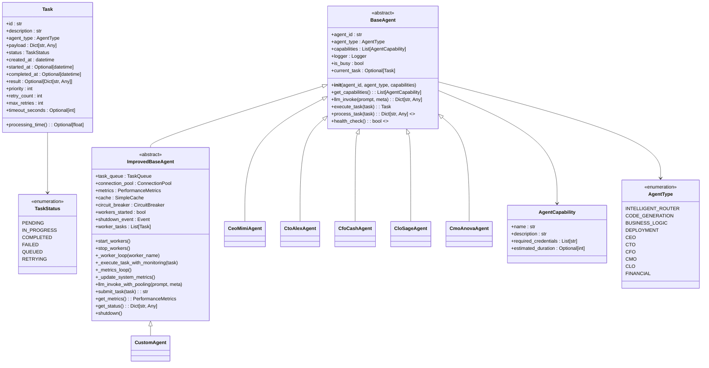
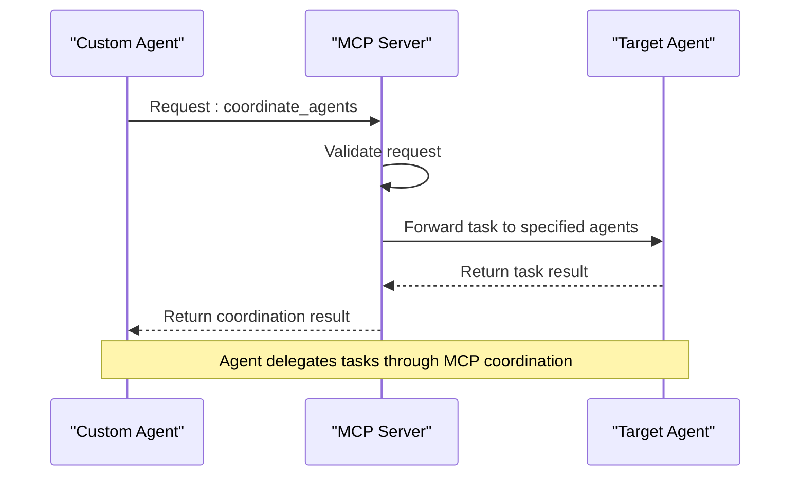
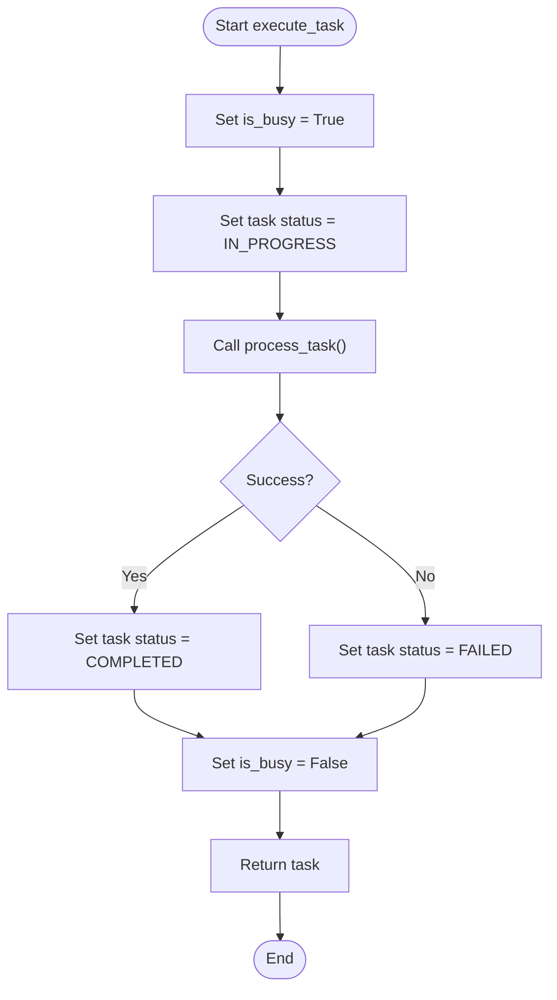
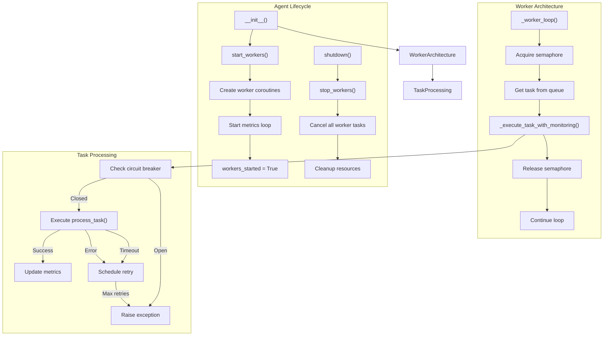
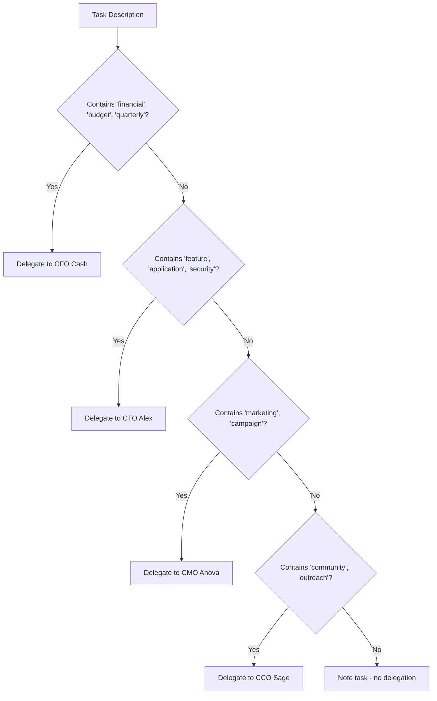
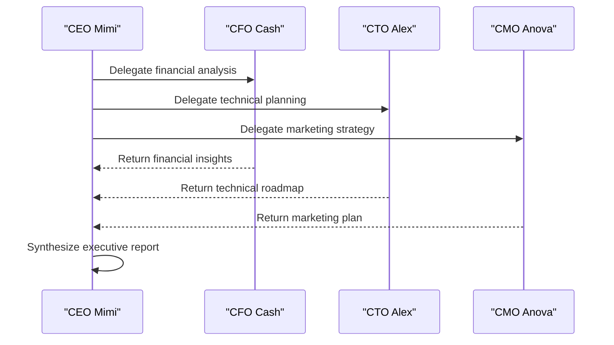

# Custom Agent Development

<cite>
**Referenced Files in This Document**   
- [custom_agent_mcp.md](file://371-os/src/minds371/mcp_servers/custom_agent_mcp.md)
- [base_agent.py](file://371-os/src/minds371/agents/base_agent/base_agent.py)
- [improved_base_agent.py](file://371-os/src/minds371/agents/base_agent/improved_base_agent.py)
- [ceo_mimi.py](file://371-os/src/minds371/agents/business/ceo_mimi.py)
- [cto_alex.py](file://371-os/src/minds371/agents/business/cto_alex.py)
- [cfo_cash.py](file://371-os/src/minds371/agents/business/cfo_cash.py)
- [clo_sage.py](file://371-os/src/minds371/agents/business/clo_sage.py)
- [cmo_anova.py](file://371-os/src/minds371/agents/business/cmo_anova.py)
</cite>

## Table of Contents
1. [Introduction](#introduction)
2. [Core Agent Architecture](#core-agent-architecture)
3. [Model Context Protocol (MCP) Framework](#model-context-protocol-mcp-framework)
4. [Base Agent Implementation](#base-agent-implementation)
5. [Enhanced Base Agent with Performance Optimizations](#enhanced-base-agent-with-performance-optimizations)
6. [C-Suite Oversight Integration](#c-suite-oversight-integration)
7. [Advanced Coordination Patterns](#advanced-coordination-patterns)
8. [Implementation Guidance](#implementation-guidance)
9. [Common Issues and Troubleshooting](#common-issues-and-troubleshooting)
10. [Optimization Tips](#optimization-tips)

## Introduction
This document provides comprehensive guidance on developing custom agents within the 371OS framework. It covers the architecture, implementation patterns, and integration strategies for creating agents that extend beyond standard templates using the Model Context Protocol (MCP). The focus is on enabling dynamic role assignment, runtime adaptation, and coordination with C-Suite oversight agents (CEO, CTO, CFO, CLO, CMO). The documentation includes code examples, architectural diagrams, and best practices for building robust, scalable, and secure agent systems.

## Core Agent Architecture

The 371OS agent system is built on a modular, extensible architecture that supports both simple and complex agent types. At its core, all agents inherit from a base class that defines common behaviors, lifecycle management, and communication protocols. Agents operate asynchronously, processing tasks from a priority queue and reporting status through standardized interfaces.

Agents are categorized by type using the `AgentType` enum, which includes roles such as `CEO`, `CTO`, `CFO`, `CMO`, `CLO`, and various technical and business functions. Each agent has a unique ID, type, and set of capabilities defined by the `AgentCapability` class, which specifies what actions the agent can perform.

The architecture supports two primary agent implementations:
- **BaseAgent**: A foundational implementation with basic task processing and LLM integration
- **ImprovedBaseAgent**: An enhanced version with performance optimizations, monitoring, and reliability features



**Diagram sources**
- [base_agent.py](file://371-os/src/minds371/agents/base_agent/base_agent.py#L1-L159)
- [improved_base_agent.py](file://371-os/src/minds371/agents/base_agent/improved_base_agent.py#L1-L525)

**Section sources**
- [base_agent.py](file://371-os/src/minds371/agents/base_agent/base_agent.py#L1-L159)
- [improved_base_agent.py](file://371-os/src/minds371/agents/base_agent/improved_base_agent.py#L1-L525)

## Model Context Protocol (MCP) Framework

The Model Context Protocol (MCP) enables dynamic context injection, role assignment, and runtime adaptation for custom agents. It operates as a server that exposes tools for agent coordination and task management. The MCP framework allows agents to request context from other agents, delegate tasks, and adapt their behavior based on system state.

The core MCP implementation is defined in `custom_agent_mcp.md`, which outlines a JavaScript-based server using the `@modelcontextprotocol/sdk` package. The server registers tools that can be invoked by agents to coordinate activities across the system.



**Diagram sources**
- [custom_agent_mcp.md](file://371-os/src/minds371/mcp_servers/custom_agent_mcp.md#L1-L32)

**Section sources**
- [custom_agent_mcp.md](file://371-os/src/minds371/mcp_servers/custom_agent_mcp.md#L1-L32)

The MCP server defines a `coordinate_agents` tool that accepts a list of agent names and a task description. This enables cross-agent delegation and hierarchical task decomposition. For example, a CEO agent can delegate financial analysis to a CFO agent and technical planning to a CTO agent through a single coordination request.

Key features of the MCP framework:
- **Dynamic Role Assignment**: Agents can assume different roles based on task requirements
- **Runtime Adaptation**: Agents can modify their behavior based on system context and feedback
- **Context Injection**: Agents can request and incorporate context from other agents or external sources
- **Consensus-Based Decision Making**: Multiple agents can collaborate on decisions through coordinated task execution

## Base Agent Implementation

The `BaseAgent` class provides the foundational implementation for all agents in the 371OS system. It defines the core interface and behavior that all agents must follow. The base implementation includes task processing, LLM integration, and health monitoring capabilities.

Key components of the `BaseAgent` implementation:

### Task Management
The `BaseAgent` uses a simple synchronous task execution model. When a task is executed via `execute_task()`, the agent sets its `is_busy` flag to `True`, processes the task by calling the abstract `process_task()` method, and updates the task status accordingly.

```python
async def execute_task(self, task: Task) -> Task:
    self.is_busy = True
    self.current_task = task
    task.status = TaskStatus.IN_PROGRESS

    try:
        self.logger.info(f"Starting task {task.id}: {task.description}")
        result = await self.process_task(task)

        task.result = result
        task.status = TaskStatus.COMPLETED
        task.completed_at = datetime.now()

        self.logger.info(f"Completed task {task.id}")

    except Exception as e:
        self.logger.error(f"Failed to process task {task.id}: {str(e)}")
        task.status = TaskStatus.FAILED
        task.result = {"error": str(e)}

    finally:
        self.is_busy = False
        self.current_task = None

    return task
```

### LLM Integration
The `llm_invoke()` method provides a wrapper around the Adaptive LLM Router, enriching requests with agent and task metadata. This enables context-aware LLM interactions and facilitates auditing and monitoring.

```python
async def llm_invoke(self, prompt: str, meta: Optional[Dict[str, Any]] = None) -> Dict[str, Any]:
    if meta is None:
        meta = {}

    # Enrich metadata with agent and task info
    meta["agent_name"] = self.agent_type.value
    if self.current_task:
        meta["task_id"] = self.current_task.id

    return await alr_invoke(prompt, meta, user_id=self.agent_id)
```

### Limitations
The base implementation has several limitations:
- **Blocking Architecture**: The `is_busy` flag prevents concurrent task processing
- **No Performance Monitoring**: Lacks built-in metrics collection
- **No Reliability Features**: No retry logic, circuit breaking, or connection pooling
- **Synchronous Execution**: Tasks are processed one at a time without queuing



**Diagram sources**
- [base_agent.py](file://371-os/src/minds371/agents/base_agent/base_agent.py#L1-L159)

**Section sources**
- [base_agent.py](file://371-os/src/minds371/agents/base_agent/base_agent.py#L1-L159)

## Enhanced Base Agent with Performance Optimizations

The `ImprovedBaseAgent` addresses the limitations of the base implementation by introducing performance optimizations, monitoring capabilities, and reliability features. It provides a robust foundation for building production-grade agents.

### Key Enhancements

#### Performance Optimizations
- **Priority-Based Task Queue**: Tasks are processed according to priority (1-10, with 1 being highest)
- **Connection Pooling**: Manages LLM API connections to prevent resource exhaustion
- **Caching**: Implements TTL-based caching for frequently accessed data
- **Concurrency Control**: Uses asyncio semaphores to limit concurrent task execution

#### Monitoring & Metrics
- **PerformanceMetrics Class**: Tracks tasks completed, failures, response times, error rates, and throughput
- **System Resource Monitoring**: Collects CPU usage, memory consumption, and peak memory usage
- **Cache Hit/Miss Ratio**: Monitors cache effectiveness
- **Background Metrics Collection**: Runs in a separate loop updated every 10 seconds

#### Reliability Features
- **Circuit Breaker Pattern**: Prevents cascading failures by temporarily blocking requests to failing services
- **Automatic Retry with Exponential Backoff**: Failed tasks are retried with increasing delays
- **Task Timeout Handling**: Configurable timeouts prevent tasks from hanging indefinitely
- **Graceful Shutdown**: Proper cleanup of worker tasks and resources

### Architecture Overview

The `ImprovedBaseAgent` uses a worker-based architecture with background tasks handling task processing and metrics collection.



**Diagram sources**
- [improved_base_agent.py](file://371-os/src/minds371/agents/base_agent/improved_base_agent.py#L1-L525)

**Section sources**
- [improved_base_agent.py](file://371-os/src/minds371/agents/base_agent/improved_base_agent.py#L1-L525)

### Code Example: Submitting a Task
```python
# Create a task
task = Task(
    id=str(uuid.uuid4()),
    description="Analyze quarterly financial results",
    agent_type=AgentType.CFO,
    payload={"quarter": "Q3", "year": 2024},
    priority=2,
    timeout_seconds=60
)

# Submit to agent
task_id = await agent.submit_task(task)
print(f"Task {task_id} submitted to queue")

# Get agent status
status = agent.get_status()
print(f"Active tasks: {status['active_tasks']}")
print(f"Queued tasks: {status['queued_tasks']}")
print(f"Error rate: {status['metrics']['error_rate']:.2f}%")
```

## C-Suite Oversight Integration

The 371OS system includes specialized C-Suite agents that provide strategic oversight and coordination across business functions. These agents implement hierarchical task decomposition and cross-functional delegation patterns.

### CEO Agent (CeoMimiAgent)
The CEO agent acts as the strategic decision-maker, delegating tasks to appropriate C-Suite agents based on keywords in the task description.



**Section sources**
- [ceo_mimi.py](file://371-os/src/minds371/agents/business/ceo_mimi.py#L1-L99)

### CTO Agent (CtoAlexAgent)
The CTO agent specializes in technical strategy and oversight, handling architecture design, technology evaluation, security response, and infrastructure planning.

```python
def _handle_architecture_design(self, task: Task) -> Dict[str, Any]:
    service_name = task.payload.get("service_name", "Unknown Service")
    return {
        "status": "completed",
        "message": f"Architecture design for {service_name} started. Creating technical specifications.",
        "details": {
            "task": "Design Architecture",
            "service": service_name,
            "next_step": "Create Technical Specification"
        }
    }
```

**Section sources**
- [cto_alex.py](file://371-os/src/minds371/agents/business/cto_alex.py#L1-L100)

### CFO Agent (CfoCashAgent)
The CFO agent handles financial workflows, delegating to a `FinancialAgent` for P&L analysis, R&D tax optimization, revenue forecasting, and transaction processing.

```python
async def process_task(self, task: Task) -> dict:
    description = task.description.lower()

    if "p&l" in description:
        result = await self.financial_agent.process_task(task)
        return {"status": "success", "message": "P&L analysis complete.", "payload": result.get("payload")}
    elif "r&d" in description:
        result = await self.financial_agent.process_task(task)
        return {"status": "success", "message": "R&D tax optimization complete.", "payload": result.get("payload")}
    # ... other financial workflows
```

**Section sources**
- [cfo_cash.py](file://371-os/src/minds371/agents/business/cfo_cash.py#L1-L50)

### CLO Agent (CloSageAgent)
The CLO agent focuses on continuous learning and optimization, analyzing agent performance, identifying patterns, proposing optimizations, and designing knowledge transfer protocols.

```python
async def process_task(self, task: Task) -> Dict[str, Any]:
    description = task.description.lower()

    if "assess performance" in description:
        response_message = "Analyzing agent performance metrics to identify key performance indicators."
    elif "identify successful patterns" in description:
        response_message = "Identifying successful patterns in agent behavior to replicate across the system."
    # ... other learning workflows
```

**Section sources**
- [clo_sage.py](file://371-os/src/minds371/agents/business/clo_sage.py#L1-L77)

### CMO Agent (CmoAnovaAgent)
The CMO agent handles marketing strategy and analysis, with capabilities in strategy & planning, performance analysis, and competitive analysis.

```python
async def process_task(self, task: Task) -> dict:
    description = task.description.lower()
    response_message = ""

    if "strategy" in description or "social media" in description:
        response_message = f"Strategy & Planning for '{task.description}' is underway."
    elif "customer acquisition" in description or "retention" in description:
        response_message = f"Performance Analysis for '{task.description}' is underway."
    # ... other marketing workflows
```

**Section sources**
- [cmo_anova.py](file://371-os/src/minds371/agents/business/cmo_anova.py#L1-L100)

## Advanced Coordination Patterns

The 371OS system supports several advanced coordination patterns that enable complex, multi-agent workflows.

### Cross-Agent Delegation
Agents can delegate tasks to other agents based on expertise and responsibility. This pattern is exemplified by the CEO agent delegating to C-Suite agents.



### Hierarchical Task Decomposition
Complex tasks are broken down into subtasks and distributed across specialized agents. For example, a product launch might be decomposed into technical, financial, and marketing components.

### Consensus-Based Decision Making
Multiple agents can collaborate on decisions by sharing analysis and reaching consensus. This is facilitated by the MCP framework's coordination tools.

## Implementation Guidance

When developing custom agents for 371OS, follow these guidelines:

### Extending the Base Agent
For simple agents, extend `BaseAgent` and implement the required abstract methods:

```python
class CustomAgent(BaseAgent):
    def __init__(self):
        super().__init__(
            agent_id="custom_agent_1",
            agent_type=AgentType.BUSINESS_LOGIC,
            capabilities=[AgentCapability(name="custom_task", description="Perform custom business logic")]
        )
    
    async def process_task(self, task: Task) -> Dict[str, Any]:
        # Implement custom logic
        return {"status": "completed", "message": "Custom task processed"}
    
    async def health_check(self) -> bool:
        return True
```

### Using the Improved Base Agent
For production agents, extend `ImprovedBaseAgent` to leverage performance and reliability features:

```python
class ProductionAgent(ImprovedBaseAgent):
    def __init__(self):
        super().__init__(
            agent_id="production_agent_1",
            agent_type=AgentType.BUSINESS_LOGIC,
            max_concurrent_tasks=10,
            enable_caching=True,
            enable_circuit_breaker=True
        )
    
    async def process_task(self, task: Task) -> Dict[str, Any]:
        # Use enhanced features
        result = await self.llm_invoke_with_pooling("Analyze this data", {"task_id": task.id})
        return {"status": "completed", "result": result}
    
    async def health_check(self) -> bool:
        return True
```

### Security Compliance
Ensure agents comply with security policies by:
- Using the circuit breaker pattern for external API calls
- Implementing proper error handling and logging
- Validating input data and sanitizing outputs
- Following the principle of least privilege for capabilities

## Common Issues and Troubleshooting

### Context Overflow
**Symptoms**: LLM responses are truncated or incomplete, performance degrades with complex tasks
**Solutions**:
- Implement context window management
- Use summarization techniques for large inputs
- Break complex tasks into smaller subtasks
- Use external memory systems for long-term context

### Role Drift
**Symptoms**: Agents perform tasks outside their intended scope, inconsistent behavior
**Solutions**:
- Clearly define agent capabilities and responsibilities
- Implement capability-based access control
- Use the MCP framework for role validation
- Regularly audit agent behavior and task logs

### Performance Degradation
**Symptoms**: Increasing response times, high error rates, resource exhaustion
**Solutions**:
- Monitor performance metrics (use `get_metrics()`)
- Adjust concurrency limits based on system capacity
- Optimize LLM usage with caching and connection pooling
- Implement circuit breakers for external dependencies

## Optimization Tips

1. **Use the ImprovedBaseAgent**: Always prefer the enhanced base class for production agents
2. **Leverage Caching**: Enable caching for frequently accessed data and repetitive LLM calls
3. **Set Appropriate Priorities**: Use task priorities to ensure critical tasks are processed first
4. **Configure Timeouts**: Set reasonable timeouts to prevent hung tasks
5. **Monitor Metrics**: Regularly check agent status and performance metrics
6. **Implement Circuit Breaking**: Protect against cascading failures in distributed systems
7. **Use Connection Pooling**: Reduce overhead from establishing new LLM connections
8. **Optimize Task Queues**: Adjust `max_concurrent_tasks` based on system resources and workload