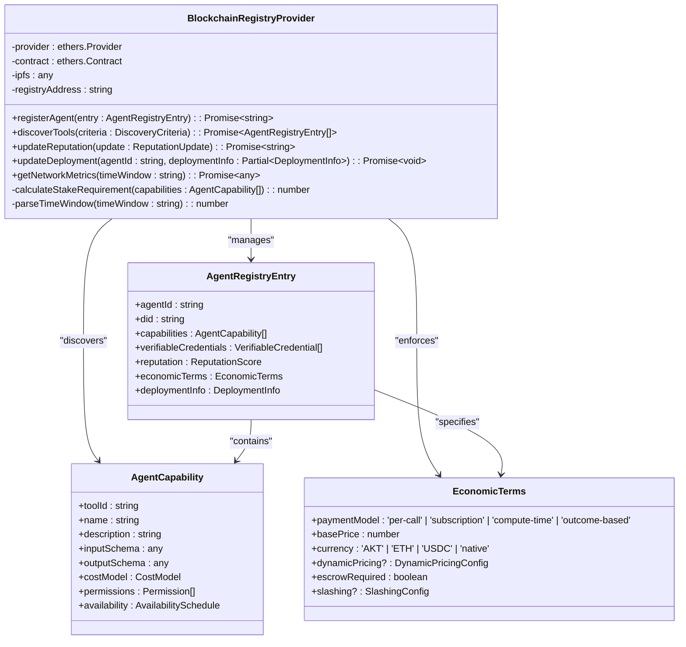
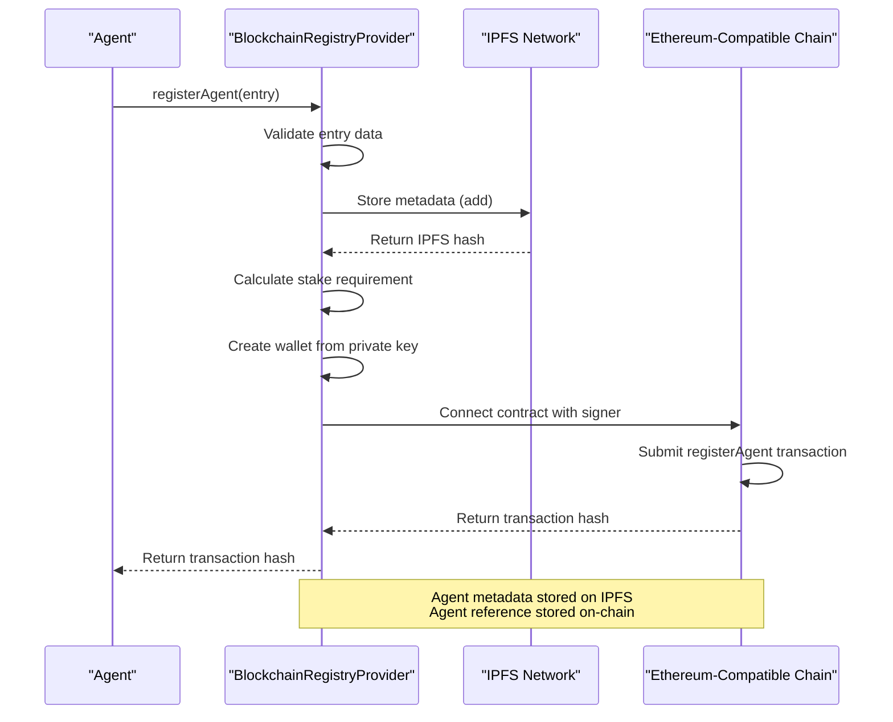

# Extending the Universal Tool Server

<cite>
**Referenced Files in This Document**   
- [local_file_mcp.md](file://371-os/src/minds371/mcp_servers/local_file_mcp.md)
- [memory_mcp.md](file://371-os/src/minds371/mcp_servers/memory_mcp.md)
- [ref-tools-mcp.md](file://371-os/src/minds371/mcp_servers/ref-tools-mcp.md)
- [custom_agent_mcp.md](file://371-os/src/minds371/mcp_servers/custom_agent_mcp.md)
- [comet_371os_shortcuts.py](file://371-os/src/minds371/comet/comet_371os_shortcuts.py)
- [blockchain-registry.ts](file://packages/elizaos-plugins/universal-tool-server/src/blockchain-registry.ts)
- [types.ts](file://packages/elizaos-plugins/universal-tool-server/src/types.ts)
- [actions.ts](file://packages/elizaos-plugins/universal-tool-server/src/actions.ts)
- [AgentRegistry.sol](file://IMPLEMENTATION_GUIDE.md#L92-L157)
</cite>

## Table of Contents
1. [Introduction](#introduction)
2. [Core MCP Server Implementations](#core-mcp-server-implementations)
3. [Stateless Coordination Architecture](#stateless-coordination-architecture)
4. [Blockchain and IPFS Integration](#blockchain-and-ipfs-integration)
5. [Storage Backend Extensions](#storage-backend-extensions)
6. [Creating New MCP Modules](#creating-new-mcp-modules)
7. [Security and Data Consistency](#security-and-data-consistency)
8. [Performance and Testing](#performance-and-testing)
9. [Conclusion](#conclusion)

## Introduction

The Universal Tool Server represents a next-generation agent coordination framework that extends the Model Context Protocol (MCP) with decentralized discovery, economic coordination, and trustless verification. This document provides comprehensive guidance on extending the server with new capabilities, focusing on the architectural principles behind stateless coordination using blockchain and IPFS. The system enables autonomous agents to discover, evaluate, and interact with tools and services without centralized coordination, leveraging cryptographic verification and reputation systems.

The extension framework supports multiple storage backends and blockchain networks, allowing developers to integrate diverse infrastructure components into the agent ecosystem. Key components include local file system access, ephemeral memory management, and reference tool integration, each implemented as modular MCP servers that can be extended or replaced.

**Section sources**
- [local_file_mcp.md](file://371-os/src/minds371/mcp_servers/local_file_mcp.md#L0-L11)
- [memory_mcp.md](file://371-os/src/minds371/mcp_servers/memory_mcp.md#L0-L9)
- [ref-tools-mcp.md](file://371-os/src/minds371/mcp_servers/ref-tools-mcp.md#L0-L31)

## Core MCP Server Implementations

### Local File System Access

The local_file_mcp.md configuration enables secure file system access through the @modelcontextprotocol/server-filesystem package. This MCP server implementation uses Node.js package execution to provide file operations while enforcing directory restrictions through environment variables.

```json
{
  "mcpServers": {
    "filesystem": {
      "command": "npx",
      "args": ["-y", "@modelcontextprotocol/server-filesystem"],
      "env": {
        "ALLOWED_DIRECTORIES": "C:\\Users,D:\\,E:\\,F:\\,G:\\,H:\\,J:\\"
      }
    }
  }
}
```

The ALLOWED_DIRECTORIES environment variable defines the permitted file system locations, implementing a security boundary that prevents unauthorized access to sensitive system areas. This approach balances functionality with security by allowing agents to read and write files within designated directories while preventing system-level exploits.

**Section sources**
- [local_file_mcp.md](file://371-os/src/minds371/mcp_servers/local_file_mcp.md#L0-L11)

### Ephemeral Agent State Management

The memory_mcp.md configuration implements ephemeral state management using the @modelcontextprotocol/server-memory package. This lightweight MCP server provides in-memory storage for agent sessions without persistent data storage requirements.

```json
{
  "mcpServers": {
    "memory": {
      "command": "npx",
      "args": ["-y", "@modelcontextprotocol/server-memory"]
    }
  }
}
```

This implementation is ideal for temporary data storage during agent workflows, such as intermediate processing results or session-specific context. The state exists only for the duration of the agent's operation and is automatically cleared when the session terminates, ensuring data isolation between different agent executions.

**Section sources**
- [memory_mcp.md](file://371-os/src/minds371/mcp_servers/memory_mcp.md#L0-L9)

### Reference Tool Integration

The ref-tools-mcp.md configuration integrates reference tools into the agent workflow through a dedicated MCP server. This implementation provides access to documentation, code examples, and knowledge bases with intelligent content filtering.

```json
{
  "mcpServers": {
    "ref-tools": {
      "command": "npx",
      "args": ["ref-tools-mcp"],
      "env": {
        "REF_API_KEY": "your-api-key"
      }
    }
  }
}
```

Key features of this implementation include:
- **Smart Documentation Chunking**: Returns only relevant tokens instead of entire pages
- **Code Tab Awareness**: Loads all code examples, not just curl commands
- **Deep Link Generation**: Provides specific page locations for verification
- **Fast Performance**: P95 latency of 1.7 seconds
- **Comprehensive Coverage**: Thousands of sites and public GitHub repositories

The strategic value for agent management includes eliminating hallucinations by providing up-to-date documentation, reducing token usage through intelligent content filtering, and supporting both public and private documentation access.

**Section sources**
- [ref-tools-mcp.md](file://371-os/src/minds371/mcp_servers/ref-tools-mcp.md#L0-L31)

### Custom Agent Coordination

The custom_agent_mcp.md implementation demonstrates how to create specialized MCP servers for agent coordination. This example uses the Model Context Protocol SDK to create a server that coordinates multiple TypingMind agents.

```javascript
// agent-manager-mcp.js
const { Server } = require('@modelcontextprotocol/sdk/server/index.js');
const { StdioServerTransport } = require('@modelcontextprotocol/sdk/server/stdio.js');

const server = new Server(
  {
    name: 'agent-manager',
    version: '1.0.0',
  },
  {
    capabilities: {
      tools: {},
    },
  }
);

// Agent coordination tools
server.setRequestHandler(ListToolsRequestSchema, async () => ({
  tools: [
    {
      name: 'coordinate_agents',
      description: 'Coordinate multiple TypingMind agents',
      inputSchema: {
        type: 'object',
        properties: {
          agents: { type: 'array', items: { type: 'string' } },
          task: { type: 'string' }
        }
      }
    }
  ]
}));
```

This pattern allows for the creation of custom coordination logic that can manage complex workflows involving multiple specialized agents, enabling sophisticated multi-agent systems with division of labor and collaborative problem-solving.

**Section sources**
- [custom_agent_mcp.md](file://371-os/src/minds371/mcp_servers/custom_agent_mcp.md#L0-L32)

## Stateless Coordination Architecture

### Comet Shortcuts Integration

The comet_371os_shortcuts.py file demonstrates integration patterns for connecting the Universal Tool Server with external development environments and workflow systems. This implementation defines shortcuts that transform business requirements into technical specifications.

```python
# Save as: comet_371os_shortcuts.py
COMET_SHORTCUTS = {
    "/generate-dev-docs": {
        "prompt": """
        You are a Lead Systems Architect for 371OS. Convert business requirements 
        into technical specifications for JetBrains development environment.
        
        Input: Business asset (community strategy, agent behavior spec)
        Output: Developer_Specification.md with:
        - File locations in src/minds371/
        - Dependencies and integrations
        - Core functions and data schemas
        - Implementation roadmap
        """,
        "output_format": "markdown",
        "integration": "jetbrains_space"
    },
    "/prototype-agent-workflow": {
        "prompt": """
        Design and validate C-Suite agent workflow for 371OS:
        - Community data ingestion pipeline
        - Decision-making logic
        - Action execution framework
        - Cross-agent communication protocols
        """,
        "output_format": "workflow_diagram",
        "integration": "youtrack_workflow"
    }
}
```

These shortcuts enable seamless integration between strategic planning and technical implementation, automating the translation of high-level business objectives into actionable development tasks and workflow designs.

**Section sources**
- [comet_371os_shortcuts.py](file://371-os/src/minds371/comet/comet_371os_shortcuts.py#L0-L29)

### Architectural Principles

The stateless coordination architecture is built on several key principles:

1. **Decentralized Discovery**: Agents discover tools and services through blockchain-based registries rather than centralized directories
2. **Cryptographic Verification**: All interactions are verifiable through cryptographic proofs and digital signatures
3. **Economic Incentives**: Usage is governed by economic models with pricing, escrow, and slashing mechanisms
4. **Reputation Systems**: Trust is established through verifiable reputation scores and attestation networks
5. **Zero-Knowledge Authentication**: Identity verification occurs without exposing sensitive credentials

This architecture eliminates single points of failure and trust, enabling truly autonomous agent networks that can scale globally without centralized coordination overhead.

## Blockchain and IPFS Integration

### Blockchain Registry Provider

The BlockchainRegistryProvider class implements the decentralized agent-tool discovery system using Ethereum-compatible blockchains and IPFS for metadata storage.



**Diagram sources**
- [blockchain-registry.ts](file://packages/elizaos-plugins/universal-tool-server/src/blockchain-registry.ts#L0-L400)
- [types.ts](file://packages/elizaos-plugins/universal-tool-server/src/types.ts#L0-L271)

### Smart Contract Implementation

The AgentRegistry smart contract provides the on-chain foundation for the decentralized registry system.

```solidity
// SPDX-License-Identifier: MIT
pragma solidity ^0.8.19;

contract AgentRegistry {
    struct Agent {
        string did;
        string ipfsHash;
        uint256 stakeAmount;
        uint256 reputation;
        bool active;
    }
    
    mapping(bytes32 => Agent) public agents;
    mapping(bytes32 => bytes32[]) public capabilityToAgents;
    
    event AgentRegistered(bytes32 indexed agentId, string did, string ipfsHash);
    event StakeIncreased(bytes32 indexed agentId, uint256 amount);
    
    function registerAgent(
        bytes32 agentId,
        string memory did,
        string memory ipfsHash,
        uint256 stakeAmount
    ) external payable {
        require(msg.value >= stakeAmount, "Insufficient stake");
        
        agents[agentId] = Agent({
            did: did,
            ipfsHash: ipfsHash,
            stakeAmount: msg.value,
            reputation: 100, // Starting reputation
            active: true
        });
        
        emit AgentRegistered(agentId, did, ipfsHash);
    }
    
    function getAgentsByCapability(bytes32 capability) 
        external view returns (bytes32[] memory) {
        return capabilityToAgents[capability];
    }
}
```

The contract implements key features including staking requirements for registration, reputation tracking, and capability-based discovery. The use of IPFS hashes stored on-chain enables efficient retrieval of comprehensive agent metadata while keeping blockchain storage costs minimal.

**Section sources**
- [AgentRegistry.sol](file://IMPLEMENTATION_GUIDE.md#L92-L157)

### Registration Workflow

The agent registration process combines on-chain transactions with off-chain IPFS storage to create a trustless identity system.



**Diagram sources**
- [blockchain-registry.ts](file://packages/elizaos-plugins/universal-tool-server/src/blockchain-registry.ts#L58-L101)
- [actions.ts](file://packages/elizaos-plugins/universal-tool-server/src/actions.ts#L20-L55)

## Storage Backend Extensions

### Creating New MCP Modules

To create new MCP modules for additional storage backends, follow these steps:

1. **Define the MCP Server Configuration**: Create a JSON configuration file that specifies the command, arguments, and environment variables for your MCP server.

For Amazon S3 integration:
```json
{
  "mcpServers": {
    "s3-storage": {
      "command": "npx",
      "args": ["-y", "@modelcontextprotocol/server-s3"],
      "env": {
        "AWS_ACCESS_KEY_ID": "your-access-key",
        "AWS_SECRET_ACCESS_KEY": "your-secret-key",
        "AWS_REGION": "us-east-1",
        "S3_BUCKET_NAME": "your-bucket-name"
      }
    }
  }
}
```

For Google Drive integration:
```json
{
  "mcpServers": {
    "google-drive": {
      "command": "npx",
      "args": ["-y", "@modelcontextprotocol/server-google-drive"],
      "env": {
        "GOOGLE_CLIENT_ID": "your-client-id",
        "GOOGLE_CLIENT_SECRET": "your-client-secret",
        "GOOGLE_REFRESH_TOKEN": "your-refresh-token",
        "DRIVE_FOLDER_ID": "your-folder-id"
      }
    }
  }
}
```

2. **Implement the MCP Server**: Create a Node.js application that implements the MCP server interface, handling tool discovery and execution requests.

3. **Register the MCP Server**: Add the configuration to your agent's MCP servers configuration, making it available for tool calls.

### Blockchain Network Integration

To integrate with different blockchain networks, extend the BlockchainRegistryProvider class to support additional networks.

For Ethereum integration:
```typescript
const ethereumProvider = new BlockchainRegistryProvider(
  'https://mainnet.infura.io/v3/YOUR_PROJECT_ID',
  '0xYourEthereumContractAddress'
);
```

For Solana integration:
```typescript
// Would require Solana-specific provider implementation
const solanaProvider = new BlockchainRegistryProvider(
  'https://api.mainnet-beta.solana.com',
  'YourSolanaProgramAddress'
);
```

The provider abstraction allows for network-agnostic agent registration and discovery, with network-specific details encapsulated in the provider configuration.

**Section sources**
- [blockchain-registry.ts](file://packages/elizaos-plugins/universal-tool-server/src/blockchain-registry.ts#L0-L400)
- [types.ts](file://packages/elizaos-plugins/universal-tool-server/src/types.ts#L0-L271)

## Security and Data Consistency

### Security Considerations

The Universal Tool Server architecture incorporates multiple security layers:

1. **Staking Requirements**: Agents must stake tokens to register, creating economic disincentives for malicious behavior
2. **Reputation Systems**: Verifiable reputation scores help agents evaluate trustworthiness
3. **Cryptographic Identity**: Decentralized Identifiers (DIDs) and verifiable credentials establish trust without centralized authorities
4. **Zero-Knowledge Proofs**: Authentication occurs without exposing sensitive information
5. **Permission Systems**: Fine-grained permissions control access to capabilities

The economic terms interface specifies security requirements:
```typescript
interface EconomicTerms {
  paymentModel: 'per-call' | 'subscription' | 'compute-time' | 'outcome-based';
  basePrice: number;
  currency: 'AKT' | 'ETH' | 'USDC' | 'native';
  dynamicPricing?: DynamicPricingConfig;
  escrowRequired: boolean;
  slashing?: SlashingConfig;
}
```

The `escrowRequired` and `slashing` fields enable financial guarantees and penalties for service quality, creating economic incentives for reliable performance.

### Data Consistency Models

The architecture employs different consistency models for various components:

1. **Blockchain Layer**: Strong consistency through consensus mechanisms
2. **IPFS Layer**: Eventual consistency with content-addressed storage
3. **Agent State**: Session-level consistency with ephemeral storage
4. **Registry Index**: Eventually consistent views of agent capabilities

The discoverTools method implements a hybrid approach, combining on-chain data (strong consistency) with off-chain metadata (eventual consistency) to balance performance and reliability.

```typescript
async discoverTools(criteria: {
  capabilities: string[];
  minReputation?: number;
  maxCost?: number;
  preferredProviders?: string[];
  excludedProviders?: string[];
}): Promise<AgentRegistryEntry[]>
```

This method applies client-side filtering to ensure that only agents meeting the specified criteria are returned, compensating for potential staleness in the registry data.

**Section sources**
- [blockchain-registry.ts](file://packages/elizaos-plugins/universal-tool-server/src/blockchain-registry.ts#L103-L189)
- [types.ts](file://packages/elizaos-plugins/universal-tool-server/src/types.ts#L0-L271)

## Performance and Testing

### Performance Implications

Different storage choices have significant performance implications:

| Storage Backend | Latency | Throughput | Durability | Cost |
|----------------|---------|-----------|-----------|------|
| Local File System | 1-10ms | High | Medium | Low |
| In-Memory | <1ms | Very High | Low | Low |
| IPFS | 100-2000ms | Medium | High | Medium |
| Blockchain | 1-60s | Low | Very High | High |
| S3/Cloud Storage | 50-500ms | High | Very High | Variable |

The architecture optimizes performance through:
- **Metadata Separation**: Storing lightweight references on-chain and full metadata off-chain
- **Caching Layers**: Implementing multi-level caching for frequently accessed data
- **Batch Operations**: Combining multiple operations into single transactions
- **Indexing**: Creating efficient lookup structures for capability-based discovery

### Testing Strategies

Validation procedures for new extensions should include:

1. **Unit Testing**: Verify individual functions and methods
2. **Integration Testing**: Test interactions between components
3. **End-to-End Testing**: Validate complete workflows
4. **Security Testing**: Identify vulnerabilities and attack vectors
5. **Performance Testing**: Measure latency, throughput, and resource usage

The registerAgentAction demonstrates proper error handling and callback patterns:

```typescript
export const registerAgentAction: Action = {
  name: 'REGISTER_AGENT_BLOCKCHAIN',
  description: 'Register agent capabilities in blockchain-based Universal Tool Server registry',
  validate: async (runtime: IAgentRuntime, message: Memory) => {
    const content = message.content;
    return !!(content.capabilities && content.economicTerms);
  },
  handler: async (
    runtime: IAgentRuntime,
    message: Memory,
    state: State,
    options: any,
    callback?: HandlerCallback
  ): Promise<boolean> => {
    try {
      const registryProvider = new BlockchainRegistryProvider();
      
      const registryEntry: AgentRegistryEntry = {
        agentId: runtime.agentId,
        did: options.did || `did:371minds:${runtime.agentId}`,
        capabilities: message.content.capabilities,
        verifiableCredentials: options.credentials || [],
        reputation: options.initialReputation || { overall: 0.5, categories: [], history: [], attestations: [], slashingHistory: [] },
        economicTerms: message.content.economicTerms,
        deploymentInfo: options.deploymentInfo || { platforms: [], constraints: {}, monitoring: {} }
      };
      
      const txHash = await registryProvider.registerAgent(registryEntry);
      
      if (callback) {
        callback({
          text: `Agent successfully registered in blockchain registry with transaction ${txHash}. Agent DID: ${registryEntry.did}`,
          content: {
            success: true,
            transactionHash: txHash,
            agentDid: registryEntry.did,
            capabilities: registryEntry.capabilities,
            registryUrl: `https://registry.371minds.com/agent/${registryEntry.agentId}`
          }
        });
      }
      
      return true;
    } catch (error) {
      console.error('Failed to register agent in blockchain registry:', error);
      if (callback) {
        callback({
          text: `Failed to register agent: ${error.message}`,
          content: { error: error.message, success: false }
        });
      }
      return false;
    }
  }
};
```

This pattern ensures that errors are properly handled and communicated back to the calling agent, maintaining system stability even when individual operations fail.

**Section sources**
- [actions.ts](file://packages/elizaos-plugins/universal-tool-server/src/actions.ts#L20-L86)
- [blockchain-registry.ts](file://packages/elizaos-plugins/universal-tool-server/src/blockchain-registry.ts#L58-L101)

## Conclusion

The Universal Tool Server provides a comprehensive framework for extending agent capabilities through modular MCP servers and decentralized coordination. By leveraging blockchain and IPFS technologies, the system enables trustless discovery, economic coordination, and cryptographic verification of agent services.

Key architectural principles include stateless coordination, decentralized discovery, and economic incentives that align agent behavior with system goals. The extensible design allows for integration with various storage backends and blockchain networks, enabling developers to adapt the system to specific requirements and constraints.

Security is addressed through multiple layers including staking requirements, reputation systems, cryptographic identity, and permission controls. Data consistency is managed through appropriate models for each component, balancing performance and reliability.

The testing and validation procedures ensure that new extensions maintain system integrity and performance, with comprehensive error handling and callback mechanisms. As the ecosystem evolves, these patterns provide a solid foundation for building increasingly sophisticated multi-agent systems.