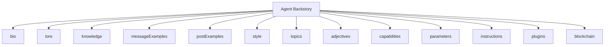
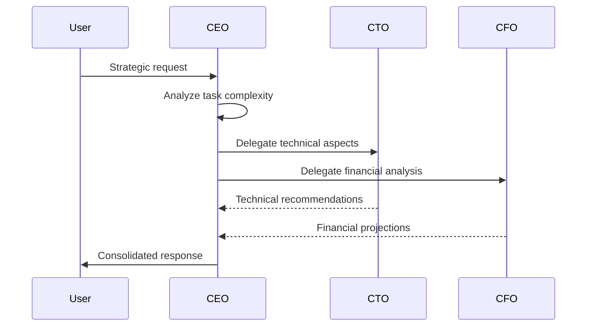
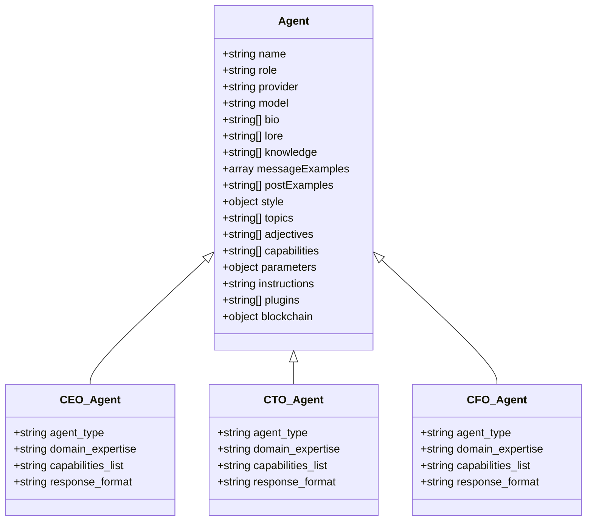

# Agent Backstory Standards

<cite>
**Referenced Files in This Document**   
- [agent-backstory-template.json](file://questflow/agents/templates/agent-backstory-template.json)
- [ceo_mimi.yaml](file://os-workspace/agents/business-agents/ceo_mimi.yaml)
- [cto_agent_prompt.yaml](file://os-workspace/agents/business-agents/cto_agent_prompt.yaml)
- [cfo_agent_prompt.yaml](file://os-workspace/agents/business-agents/cfo_agent_prompt.yaml)
</cite>

## Table of Contents
1. [Introduction](#introduction)
2. [Purpose of Agent Backstories](#purpose-of-agent-backstories)
3. [Required Backstory Fields](#required-backstory-fields)
4. [Field Specifications and Usage Guidelines](#field-specifications-and-usage-guidelines)
5. [Implementation Guidelines](#implementation-guidelines)
6. [Validation Requirements](#validation-requirements)
7. [C-Suite Agent Examples](#c-suite-agent-examples)
8. [Benefits of Standardized Backstories](#benefits-of-standardized-backstories)
9. [Conclusion](#conclusion)

## Introduction
This document outlines the standardized structure and implementation requirements for agent backstories within the 371 OS ecosystem. The Agent Backstory Standards ensure consistency, interoperability, and blockchain integration across autonomous agents. By defining a uniform schema for agent identity, knowledge, behavior, and capabilities, this standard enables seamless agent coordination, reliable delegation, and verifiable digital identities on the 371 OS blockchain.

**Section sources**
- [agent-backstory-template.json](file://questflow/agents/templates/agent-backstory-template.json#L1-L90)

## Purpose of Agent Backstories
Agent backstories serve as comprehensive identity and behavioral blueprints that define how autonomous agents operate within the 371 OS framework. These structured profiles ensure that agents maintain consistent personalities, expertise domains, and interaction patterns across different contexts and platforms. The backstory standard enables predictable agent behavior, facilitates agent-to-agent communication, and supports the creation of a cohesive multi-agent ecosystem where roles and responsibilities are clearly defined and machine-readable.

Standardized backstories are essential for maintaining system integrity in complex agent networks. They prevent behavioral drift, ensure role fidelity, and provide a foundation for trust and accountability in agent interactions. This is particularly critical in C-suite agent implementations where strategic decisions and task delegations must align with organizational objectives and domain-specific expertise.

**Section sources**
- [agent-backstory-template.json](file://questflow/agents/templates/agent-backstory-template.json#L1-L90)

## Required Backstory Fields
The agent backstory schema consists of 13 mandatory fields that collectively define an agent's identity, knowledge, behavior, and technical parameters. These fields are designed to capture both functional capabilities and personality traits, creating holistic digital personas that can operate autonomously while maintaining brand and role consistency.

**Required Fields:**
- **bio**: Agent's self-introduction and core responsibilities
- **lore**: Origin story and philosophical foundation
- **knowledge**: Domain expertise and technical competencies
- **messageExamples**: Sample dialogues demonstrating communication style
- **postExamples**: Example content posts showcasing personality
- **style**: Behavioral guidelines for different interaction modes
- **topics**: Primary subject matter expertise areas
- **adjectives**: Personality descriptors that shape tone
- **capabilities**: Functional abilities and tool integrations
- **parameters**: LLM configuration settings
- **instructions**: Operational guidelines and constraints
- **plugins**: Integrated third-party service connectors
- **blockchain**: Decentralized identity and reputation data

**Diagram sources**
- [agent-backstory-template.json](file://questflow/agents/templates/agent-backstory-template.json#L1-L90)

**Section sources**
- [agent-backstory-template.json](file://questflow/agents/templates/agent-backstory-template.json#L1-L90)

## Field Specifications and Usage Guidelines
Each field in the agent backstory schema serves a specific purpose in defining agent behavior and capabilities. The following specifications ensure consistent implementation across all agents in the 371 OS ecosystem.

### bio
The bio field contains the agent's self-introduction in first-person perspective. It should include:
- Role identification ("I am [Name], the [Role]")
- Key responsibilities (2-3 core functions)
- Mission statement (organizational purpose)

**Usage**: This field is used in agent introductions and identity verification processes.

### lore
The lore field establishes the agent's origin story and philosophical foundation. It should include:
- Creation context within 371 OS
- Generational classification (first-generation, etc.)
- Specific problem-solving purpose
- Technological breakthrough represented

**Usage**: This field supports agent branding and helps users understand the agent's evolutionary context.

### knowledge
The knowledge field defines the agent's domain expertise. It should include:
- Relevant domain knowledge areas
- Specific technical skills or technologies
- Related systems and processes

**Usage**: This field informs task routing and capability matching in the adaptive router system.

### messageExamples
The messageExamples field contains sample dialogues in JSON format. Each example includes:
- User message with placeholder variables
- Agent response demonstrating expertise
- Contextual appropriateness to domain

**Usage**: This field trains the LLM on proper response patterns and serves as a behavioral reference.

### postExamples
The postExamples field contains 2-3 example content posts that showcase:
- Writing style and tone
- Subject matter expertise
- Personality traits

**Usage**: This field guides content generation for social and knowledge-sharing platforms.

### style
The style object contains behavioral guidelines for different interaction modes:
- **all**: Universal behavioral rules
- **chat**: Conversation-specific guidelines
- **post**: Content creation guidelines

**Usage**: This field ensures context-appropriate communication across different platforms.

### topics, adjectives, capabilities
These array fields define:
- **topics**: Primary subject matter expertise
- **adjectives**: Personality descriptors
- **capabilities**: Functional abilities

**Usage**: These fields enable capability-based routing and agent discovery.

**Section sources**
- [agent-backstory-template.json](file://questflow/agents/templates/agent-backstory-template.json#L1-L90)

## Implementation Guidelines
Implementing agent backstories requires adherence to specific technical and behavioral standards. The following guidelines ensure consistent deployment across the 371 OS platform.

### Template Structure
All agent backstories must follow the JSON schema defined in the agent-backstory-template.json file. The structure must maintain field order and data types as specified. YAML implementations (such as ceo_mimi.yaml) must map to the equivalent JSON structure during runtime processing.

### Variable Substitution
Template variables (e.g., {task_description}, {agent_id}) must be resolved at runtime using the agent coordination system. The variable substitution engine processes these placeholders using context from the current session, task, and agent metadata.

### Delegation Patterns
For C-suite agents, delegation logic must be explicitly defined in the instructions field. The CEO agent, for example, implements a structured delegation pattern that:
1. Analyzes task complexity
2. Identifies appropriate specialized agents
3. Creates delegation chains
4. Monitors execution status

**Diagram sources**
- [ceo_mimi.yaml](file://os-workspace/agents/business-agents/ceo_mimi.yaml#L1-L48)
- [cto_agent_prompt.yaml](file://os-workspace/agents/business-agents/cto_agent_prompt.yaml#L1-L47)

**Section sources**
- [ceo_mimi.yaml](file://os-workspace/agents/business-agents/ceo_mimi.yaml#L1-L48)
- [cto_agent_prompt.yaml](file://os-workspace/agents/business-agents/cto_agent_prompt.yaml#L1-L47)
- [cfo_agent_prompt.yaml](file://os-workspace/agents/business-agents/cfo_agent_prompt.yaml#L1-L47)

## Validation Requirements
All agent backstories must pass a comprehensive validation process before deployment. The validation system checks for structural integrity, content quality, and compliance with organizational standards.

### Structural Validation
- JSON schema compliance
- Required field presence
- Data type correctness
- Array length constraints

### Content Validation
- Bio length (4-6 sentences)
- Lore authenticity to 371 OS framework
- Knowledge relevance to role
- Message example quality and diversity
- Style guideline specificity

### Blockchain Integration Validation
- DID (Decentralized Identifier) format correctness
- Stake amount within acceptable range (100-10000)
- Reputation score consistency with agent tier
- Capability claims verifiable through plugin registry

The comprehensive-validation.js script automates this process, ensuring all agents meet the minimum quality standards before registration in the agent directory.

**Section sources**
- [agent-backstory-template.json](file://questflow/agents/templates/agent-backstory-template.json#L1-L90)
- [comprehensive-validation.js](file://comprehensive-validation.js#L1-L100)

## C-Suite Agent Examples
The following examples illustrate how the backstory standard is implemented for executive-level agents in the 371 OS ecosystem.

### CEO Agent (Mimi)
The CEO agent implements strategic oversight and task delegation capabilities. Its backstory emphasizes:
- Strategic decision-making
- Cross-functional coordination
- Organizational vision

Key implementation features:
- Delegation status tracking ("delegated" or "completed")
- JSON response structure for machine readability
- Delegation chain metadata

### CTO Agent (Alex)
The CTO agent specializes in technical architecture and technology selection. Its backstory highlights:
- Infrastructure planning expertise
- Technology evaluation methodologies
- Technical risk assessment

Key implementation features:
- Technical analysis status ("processing" or "completed")
- JSON structure with technical metrics
- Actionable technical recommendations

### CFO Agent
The CFO agent focuses on financial strategy and resource optimization. Its backstory includes:
- Financial modeling expertise
- Budget allocation methodologies
- Risk assessment frameworks

These C-suite agents demonstrate how standardized backstories enable consistent executive-level decision-making while allowing for role-specific specializations.

**Diagram sources**
- [agent-backstory-template.json](file://questflow/agents/templates/agent-backstory-template.json#L1-L90)
- [ceo_mimi.yaml](file://os-workspace/agents/business-agents/ceo_mimi.yaml#L1-L48)
- [cto_agent_prompt.yaml](file://os-workspace/agents/business-agents/cto_agent_prompt.yaml#L1-L47)
- [cfo_agent_prompt.yaml](file://os-workspace/agents/business-agents/cfo_agent_prompt.yaml#L1-L47)

**Section sources**
- [ceo_mimi.yaml](file://os-workspace/agents/business-agents/ceo_mimi.yaml#L1-L48)
- [cto_agent_prompt.yaml](file://os-workspace/agents/business-agents/cto_agent_prompt.yaml#L1-L47)
- [cfo_agent_prompt.yaml](file://os-workspace/agents/business-agents/cfo_agent_prompt.yaml#L1-L47)

## Benefits of Standardized Backstories
Standardized agent backstories provide significant advantages for both system performance and user experience in the 371 OS ecosystem.

### Agent Consistency
The backstory standard ensures that agents maintain consistent personalities, expertise, and communication styles across all interactions. This consistency builds user trust and enables predictable agent behavior, which is essential for mission-critical applications.

### Blockchain Integration
The blockchain field in each backstory enables decentralized identity management through:
- Verifiable DIDs (Decentralized Identifiers)
- Transparent stake amounts
- Immutable reputation scores
- Tamper-proof capability claims

This integration allows agents to establish trustworthiness on the blockchain, facilitating secure agent-to-agent transactions and verifiable expertise claims.

### Interoperability
Standardized backstories enable seamless agent collaboration by providing a common understanding of roles, capabilities, and communication styles. This interoperability is essential for complex task execution that requires coordination between multiple specialized agents.

### Quality Assurance
The validation requirements ensure that all agents meet minimum quality standards before deployment. This quality control mechanism maintains the integrity of the agent ecosystem and prevents the proliferation of poorly designed or inconsistent agents.

### Scalability
The template-based approach allows for rapid creation and deployment of new agents while maintaining consistency across the ecosystem. This scalability is crucial for expanding the agent network to address new domains and use cases.

**Section sources**
- [agent-backstory-template.json](file://questflow/agents/templates/agent-backstory-template.json#L1-L90)
- [ceo_mimi.yaml](file://os-workspace/agents/business-agents/ceo_mimi.yaml#L1-L48)

## Conclusion
The Agent Backstory Standards provide a comprehensive framework for creating consistent, reliable, and interoperable autonomous agents within the 371 OS ecosystem. By standardizing agent identity, knowledge, and behavior through a well-defined schema, this system enables scalable agent networks with predictable performance and verifiable capabilities.

The implementation of these standards across C-suite agents demonstrates their effectiveness in maintaining role fidelity while enabling specialized expertise. The integration with blockchain technology further enhances trust and accountability in agent interactions.

Organizations adopting these standards will benefit from improved agent consistency, enhanced interoperability, and robust quality assurance, ultimately creating a more reliable and effective multi-agent system.