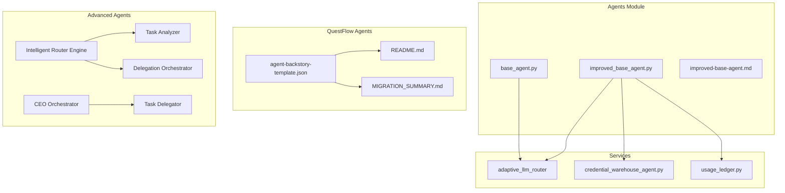
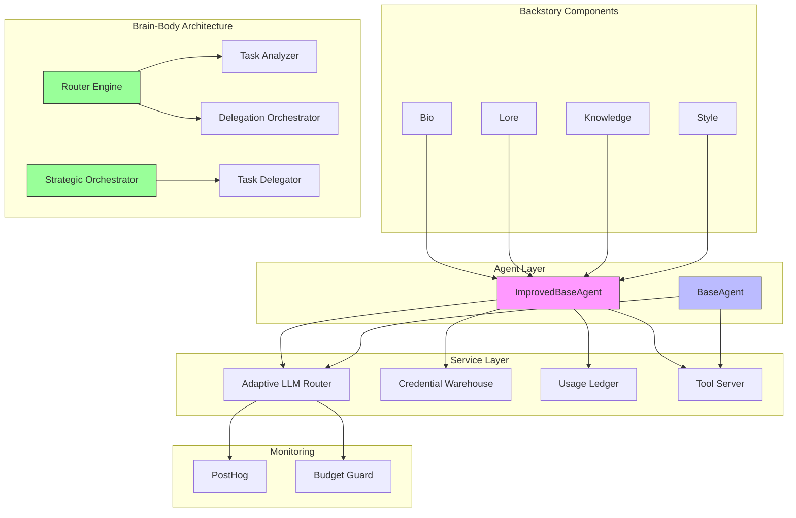
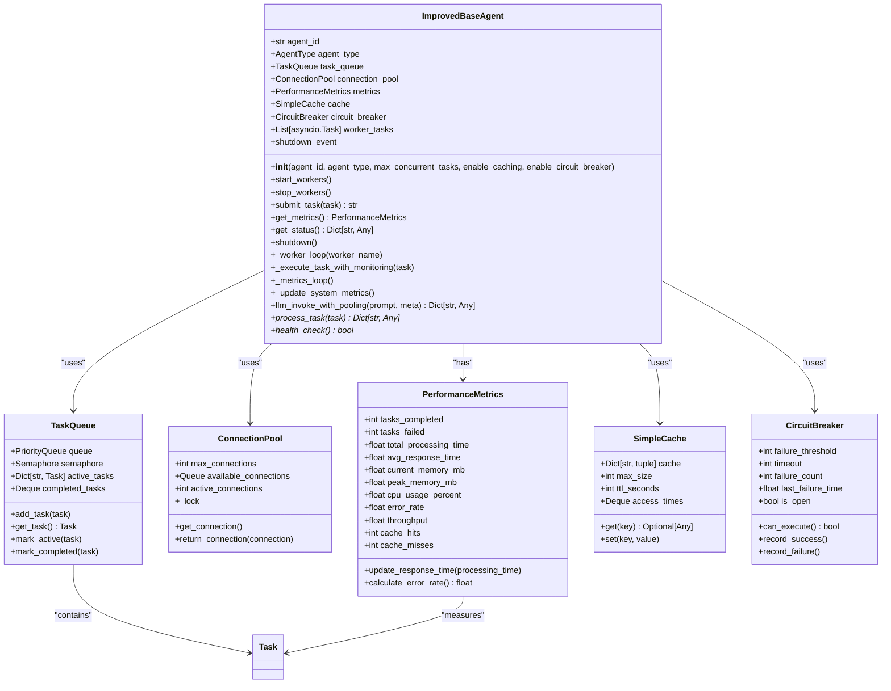
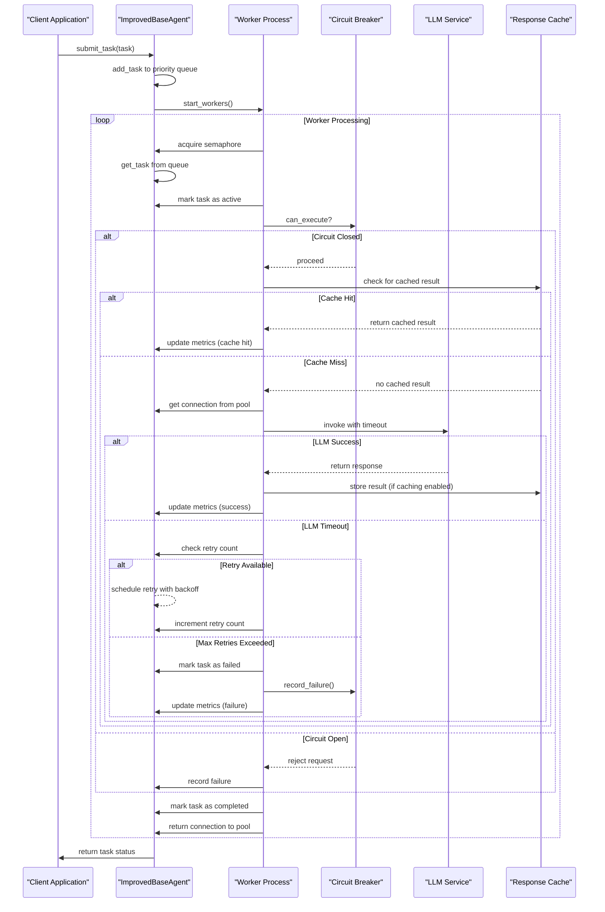
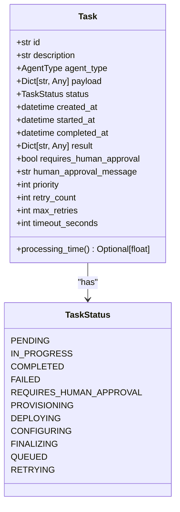
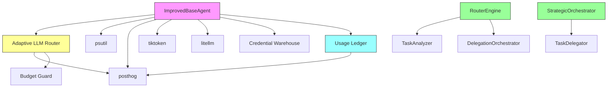

# Base Agent Implementation

<cite>
**Referenced Files in This Document**   
- [base_agent.py](file://_legacy\agents\base_agent\base_agent.py) - *Core base agent implementation*
- [improved_base_agent.py](file://_legacy\agents\base_agent\improved_base_agent.py) - *Enhanced base agent with performance optimizations*
- [improved-base-agent.md](file://_legacy\agents\base_agent\improved-base-agent.md) - *Documentation of performance improvements*
- [llm.py](file://_legacy\adaptive_llm_router\llm.py) - *Adaptive LLM Router integration*
- [usage_ledger.py](file://_legacy\adaptive_llm_router\usage_ledger.py) - *Usage tracking and monitoring*
- [credential_warehouse_agent.py](file://_legacy\agents\utility\credential_warehouse_agent.py) - *Secure credential management*
- [benchmark.py](file://371-os\tests\performance\benchmark.py) - *Performance testing framework*
- [agent-backstory-template.json](file://questflow\agents\templates\agent-backstory-template.json) - *Standardized full backstory format for agents*
- [MIGRATION_SUMMARY.md](file://questflow\agents\MIGRATION_SUMMARY.md) - *Documentation of agent migration to full backstory format*
- [README.md](file://questflow\agents\README.md) - *Documentation for enhanced agents with full backstories*
- [router-engine.ts](file://os-workspace\apps\intelligent-router\src\router-engine.ts) - *Intelligent Router Agent brain-body architecture implementation*
- [orchestrator.ts](file://os-workspace\apps\ceo-agent\src\orchestrator.ts) - *CEO Agent strategic orchestrator implementation*
- [delegator.ts](file://os-workspace\apps\ceo-agent\src\delegator.ts) - *CEO Agent delegator implementation*
</cite>

## Update Summary
**Changes Made**   
- Updated documentation to include the standardized full backstory format for agents
- Added information about the new agent structure with bio, lore, knowledge, and communication style elements
- Integrated details from the agent migration process and validation scripts
- Added documentation of the agent-backstory-template.json structure and usage
- Updated section sources to reflect new files and their roles in the agent implementation
- Enhanced the introduction to include the significance of comprehensive agent backstories
- Added new section on Full Backstory Format Features and Benefits
- Incorporated analysis of modular brain-body architecture from Intelligent Router and CEO Agent implementations
- Added new section on Modular Brain-Body Architecture Pattern
- Updated architecture overview diagram to include brain-body components
- Added detailed analysis of StrategicOrchestrator and TaskDelegator classes
- Updated dependency analysis to include new TypeScript components

## Table of Contents
1. [Introduction](#introduction)
2. [Project Structure](#project-structure)
3. [Core Components](#core-components)
4. [Architecture Overview](#architecture-overview)
5. [Detailed Component Analysis](#detailed-component-analysis)
6. [Dependency Analysis](#dependency-analysis)
7. [Performance Considerations](#performance-considerations)
8. [Troubleshooting Guide](#troubleshooting-guide)
9. [Full Backstory Format Features](#full-backstory-format-features)
10. [Modular Brain-Body Architecture Pattern](#modular-brain-body-architecture-pattern)
11. [Conclusion](#conclusion)

## Introduction
The Base Agent Implementation forms the foundational architecture for all agents within the 371-OS ecosystem. This documentation provides a comprehensive analysis of both the original `BaseAgent` and its enhanced counterpart `ImprovedBaseAgent`, detailing their design, capabilities, and evolution. The base agent serves as an abstract foundation that standardizes message processing, tool invocation, memory management, and LLM interaction across all specialized agents in the system. The improved version introduces significant performance, monitoring, and reliability enhancements while maintaining backward compatibility. This document explores the technical decisions behind stateless execution, modular tool integration, secure credential handling via the Credential Warehouse, and integration with critical services such as the Adaptive LLM Router and Universal Tool Server. Additionally, this update incorporates the recent implementation of standardized full backstories for agents, which include bio, lore, knowledge, and communication style elements to provide enhanced context and personality. The documentation has been further updated to reflect the adoption of the modular brain-body architecture pattern in advanced agents like the Intelligent Router and CEO Agent.

**Section sources**
- [base_agent.py](file://_legacy\agents\base_agent\base_agent.py)
- [improved_base_agent.py](file://_legacy\agents\base_agent\improved_base_agent.py)
- [MIGRATION_SUMMARY.md](file://questflow\agents\MIGRATION_SUMMARY.md)
- [router-engine.ts](file://os-workspace\apps\intelligent-router\src\router-engine.ts)
- [orchestrator.ts](file://os-workspace\apps\ceo-agent\src\orchestrator.ts)

## Project Structure
The base agent implementation is organized within the 371-OS repository with a clear separation between core functionality and agent-specific implementations. The primary base agent classes are located in the `_legacy\agents\base_agent` directory, which contains the reference implementations used for agent development. This structure allows for both specialized agent development and consistent core functionality across the entire OS. The implementation leverages Python's object-oriented features with abstract base classes, dataclasses for structured data, and asynchronous programming for concurrent task processing. Additionally, the QuestFlow agents directory now includes a standardized structure for agents with full backstories, organized into core, specialized, and templates subdirectories. Advanced agents like the Intelligent Router and CEO Agent have adopted a modular brain-body architecture, with separate components for analysis/orchestration (brain) and execution/delegation (body), implemented in TypeScript within the os-workspace.



**Diagram sources**
- [base_agent.py](file://_legacy\agents\base_agent\base_agent.py)
- [improved_base_agent.py](file://_legacy\agents\base_agent\improved_base_agent.py)
- [credential_warehouse_agent.py](file://_legacy\agents\utility\credential_warehouse_agent.py)
- [agent-backstory-template.json](file://questflow\agents\templates\agent-backstory-template.json)
- [README.md](file://questflow\agents\README.md)
- [MIGRATION_SUMMARY.md](file://questflow\agents\MIGRATION_SUMMARY.md)
- [router-engine.ts](file://os-workspace\apps\intelligent-router\src\router-engine.ts)
- [orchestrator.ts](file://os-workspace\apps\ceo-agent\src\orchestrator.ts)
- [delegator.ts](file://os-workspace\apps\ceo-agent\src\delegator.ts)

**Section sources**
- [base_agent.py](file://_legacy\agents\base_agent\base_agent.py)
- [improved_base_agent.py](file://_legacy\agents\base_agent\improved_base_agent.py)
- [agent-backstory-template.json](file://questflow\agents\templates\agent-backstory-template.json)
- [README.md](file://questflow\agents\README.md)
- [router-engine.ts](file://os-workspace\apps\intelligent-router\src\router-engine.ts)
- [orchestrator.ts](file://os-workspace\apps\ceo-agent\src\orchestrator.ts)

## Core Components
The base agent implementation consists of several core components that define the behavior and capabilities of all agents in the 371-OS ecosystem. The `BaseAgent` class provides the fundamental interface with abstract methods for task processing and health checking, while the `ImprovedBaseAgent` extends this foundation with performance optimizations and monitoring capabilities. Key data structures include `Task` for representing work items, `AgentCapability` for defining agent functions, and `PerformanceMetrics` for tracking system performance. The implementation uses Python's `abc` module to enforce the agent interface, ensuring consistency across all specialized agents. The recent update introduces a standardized full backstory format for agents, which includes bio, lore, knowledge, and communication style elements to enhance context and personality. Advanced agents have adopted a modular brain-body architecture, where the brain component handles analysis and decision-making (e.g., `RouterEngine` and `StrategicOrchestrator`) while the body component manages execution and delegation (e.g., `DelegationOrchestrator` and `TaskDelegator`).

**Section sources**
- [base_agent.py](file://_legacy\agents\base_agent\base_agent.py#L1-L160)
- [improved_base_agent.py](file://_legacy\agents\base_agent\improved_base_agent.py#L1-L200)
- [agent-backstory-template.json](file://questflow\agents\templates\agent-backstory-template.json)
- [router-engine.ts](file://os-workspace\apps\intelligent-router\src\router-engine.ts#L31-L482)
- [orchestrator.ts](file://os-workspace\apps\ceo-agent\src\orchestrator.ts#L23-L848)

## Architecture Overview
The base agent architecture follows a modular design pattern that separates concerns between task management, LLM interaction, performance monitoring, and system integration. Agents interact with the Adaptive LLM Router for language model calls, the Credential Warehouse for secure credential access, and the Usage Ledger for monitoring and analytics. The improved base agent introduces a worker-based architecture with background tasks for metrics collection and concurrent processing. This design enables stateless execution while maintaining performance metrics and system health monitoring. The architecture supports both synchronous and asynchronous operations, with the improved version emphasizing non-blocking, concurrent task processing. The integration of full backstories for agents enhances their contextual understanding and communication style. Advanced agents implement a modular brain-body architecture, where the brain component (analysis/orchestration) makes strategic decisions and the body component (execution/delegation) carries out the actions, enabling more sophisticated and scalable agent behavior.



**Diagram sources**
- [improved_base_agent.py](file://_legacy\agents\base_agent\improved_base_agent.py)
- [llm.py](file://_legacy\adaptive_llm_router\llm.py)
- [usage_ledger.py](file://_legacy\adaptive_llm_router\usage_ledger.py)
- [credential_warehouse_agent.py](file://_legacy\agents\utility\credential_warehouse_agent.py)
- [agent-backstory-template.json](file://questflow\agents\templates\agent-backstory-template.json)
- [router-engine.ts](file://os-workspace\apps\intelligent-router\src\router-engine.ts)
- [orchestrator.ts](file://os-workspace\apps\ceo-agent\src\orchestrator.ts)

## Detailed Component Analysis

### BaseAgent Class Analysis
The `BaseAgent` class serves as the abstract foundation for all agents in the 371-OS ecosystem. It defines the core interface that all specialized agents must implement, ensuring consistency across the system. The class uses Python's Abstract Base Class (ABC) pattern to enforce implementation of critical methods like `process_task` and `health_check`. Each agent instance is identified by a unique ID and associated with a specific `AgentType`, which determines its role and capabilities within the system. The base agent manages task execution through a simple state machine, tracking whether it is currently busy with a task.

```mermaid
classDiagram
class BaseAgent {
+str agent_id
+AgentType agent_type
+List[AgentCapability] capabilities
+bool is_busy
+Task current_task
+logger
+__init__(agent_id, agent_type, capabilities)
+get_capabilities() List[AgentCapability]
+llm_invoke(prompt, meta) Dict[str, Any]
+execute_task(task) Task
+process_task(task) Dict[str, Any] *
+health_check() bool *
}
class AgentCapability {
+str name
+str description
+List[str] required_credentials
+int estimated_duration
}
class Task {
+str id
+str description
+AgentType agent_type
+Dict[str, Any] payload
+TaskStatus status
+datetime created_at
+datetime completed_at
+Dict[str, Any] result
+bool requires_human_approval
+str human_approval_message
}
enum TaskStatus {
PENDING
IN_PROGRESS
COMPLETED
FAILED
REQUIRES_HUMAN_APPROVAL
}
enum AgentType {
INTELLIGENT_ROUTER
CODE_GENERATION
MARKETING_ASSET
BUSINESS_LOGIC
DEPLOYMENT
CREDENTIAL_MANAGER
}
BaseAgent --> AgentCapability : "has"
BaseAgent --> Task : "executes"
Task --> TaskStatus : "has"
```

**Diagram sources**
- [base_agent.py](file://_legacy\agents\base_agent\base_agent.py#L1-L160)

**Section sources**
- [base_agent.py](file://_legacy\agents\base_agent\base_agent.py#L1-L160)

### ImprovedBaseAgent Class Analysis
The `ImprovedBaseAgent` represents a significant evolution from the basic implementation, incorporating performance optimizations, enhanced monitoring, and improved error handling. This class introduces several key architectural improvements including a priority-based task queue, connection pooling for LLM calls, caching mechanisms, and circuit breaker patterns for resilience. The improved agent operates with a worker-based model, allowing for concurrent task processing and background metrics collection. This design eliminates the blocking `is_busy` flag from the original implementation, enabling true parallel execution of tasks.



**Diagram sources**
- [improved_base_agent.py](file://_legacy\agents\base_agent\improved_base_agent.py#L1-L526)

**Section sources**
- [improved_base_agent.py](file://_legacy\agents\base_agent\improved_base_agent.py#L1-L526)

### Task Processing Flow
The task processing flow in the improved base agent demonstrates a sophisticated asynchronous workflow that handles task execution, monitoring, and error recovery. When a task is submitted, it enters a priority queue and waits for available worker capacity. Workers process tasks with comprehensive monitoring, including circuit breaker checks, timeout handling, and automatic retry mechanisms. The flow incorporates both success and failure paths, with appropriate metrics collection and system state updates in all scenarios.



**Diagram sources**
- [improved_base_agent.py](file://_legacy\agents\base_agent\improved_base_agent.py#L200-L526)

**Section sources**
- [improved_base_agent.py](file://_legacy\agents\base_agent\improved_base_agent.py#L200-L526)

### Enhanced Task Data Structure
The `Task` data structure in the improved base agent has been significantly enhanced to support advanced scheduling, monitoring, and reliability features. Compared to the basic implementation, the improved version includes priority levels, retry mechanisms, timeout configurations, and detailed timing metrics. These enhancements enable sophisticated task management capabilities such as priority-based scheduling, automatic retry with exponential backoff, and performance analysis.



**Diagram sources**
- [improved_base_agent.py](file://_legacy\agents\base_agent\improved_base_agent.py#L50-L100)

**Section sources**
- [improved_base_agent.py](file://_legacy\agents\base_agent\improved_base_agent.py#L50-L100)

## Dependency Analysis
The base agent implementation has well-defined dependencies on several critical services within the 371-OS ecosystem. The most significant dependency is on the Adaptive LLM Router, which provides the core language model invocation capability. The improved base agent also depends on system monitoring libraries like `psutil` for resource tracking and `posthog` for analytics. The architecture is designed to be modular, with optional features like caching and circuit breaking that can be enabled or disabled based on the agent's requirements. This dependency structure allows for flexible configuration while maintaining a consistent interface across all agents. Advanced agents also depend on TypeScript-based components for brain-body functionality, including the RouterEngine, TaskAnalyzer, DelegationOrchestrator, StrategicOrchestrator, and TaskDelegator.



**Diagram sources**
- [improved_base_agent.py](file://_legacy\agents\base_agent\improved_base_agent.py)
- [llm.py](file://_legacy\adaptive_llm_router\llm.py)
- [usage_ledger.py](file://_legacy\adaptive_llm_router\usage_ledger.py)
- [router-engine.ts](file://os-workspace\apps\intelligent-router\src\router-engine.ts)
- [orchestrator.ts](file://os-workspace\apps\ceo-agent\src\orchestrator.ts)

**Section sources**
- [improved_base_agent.py](file://_legacy\agents\base_agent\improved_base_agent.py)
- [llm.py](file://_legacy\adaptive_llm_router\llm.py)
- [router-engine.ts](file://os-workspace\apps\intelligent-router\src\router-engine.ts)
- [orchestrator.ts](file://os-workspace\apps\ceo-agent\src\orchestrator.ts)

## Performance Considerations
The improved base agent implementation incorporates several performance optimization strategies that significantly enhance system throughput and responsiveness. The most impactful changes include the replacement of the blocking `is_busy` flag with a concurrent worker model, connection pooling for LLM API calls, and response caching for frequently accessed data. The implementation uses a semaphore-controlled worker pool to manage concurrency limits and prevent resource exhaustion. Performance metrics are collected in real-time, including task throughput, response times, error rates, and system resource utilization (CPU and memory). The caching system employs a TTL-based approach with LRU eviction policy, balancing freshness and performance.

**Section sources**
- [improved-base-agent.md](file://_legacy\agents\base_agent\improved-base-agent.md)
- [improved_base_agent.py](file://_legacy\agents\base_agent\improved_base_agent.py)

## Troubleshooting Guide
When troubleshooting issues with base agents, several key areas should be examined. For performance problems, check the agent's metrics endpoint to review throughput, error rates, and resource utilization. High error rates may indicate issues with the circuit breaker being tripped due to repeated failures. If tasks are not being processed, verify that worker processes are running and the task queue is not blocked. For LLM-related issues, examine the Adaptive LLM Router logs and check the Usage Ledger for error patterns. Credential access problems should be investigated through the Credential Warehouse audit logs. Memory leaks can be identified by monitoring the peak memory metrics over time.

**Section sources**
- [improved_base_agent.py](file://_legacy\agents\base_agent\improved_base_agent.py)
- [llm.py](file://_legacy\adaptive_llm_router\llm.py)
- [usage_ledger.py](file://_legacy\adaptive_llm_router\usage_ledger.py)
- [credential_warehouse_agent.py](file://_legacy\agents\utility\credential_warehouse_agent.py)

## Full Backstory Format Features
The implementation of standardized full backstories for agents represents a significant enhancement in the agent architecture. Each agent now includes comprehensive elements such as bio, lore, knowledge, and communication style, which provide deeper context and personality. The bio section outlines the agent's role and responsibilities within the 371 OS system, while the lore provides historical context and significance. The knowledge section details the agent's domain expertise and specializations. Communication style is defined through message examples, post examples, and style guidelines for different contexts. This standardized format ensures consistent personality and enhanced interaction capabilities across all agents.

**Section sources**
- [agent-backstory-template.json](file://questflow\agents\templates\agent-backstory-template.json)
- [MIGRATION_SUMMARY.md](file://questflow\agents\MIGRATION_SUMMARY.md)
- [README.md](file://questflow\agents\README.md)

## Modular Brain-Body Architecture Pattern
The modular brain-body architecture pattern represents an advanced evolution in agent design, separating cognitive functions from execution mechanisms. In this pattern, the "brain" component handles analysis, decision-making, and orchestration, while the "body" component manages task execution, delegation, and coordination. This separation of concerns enables more sophisticated agent behavior, improved maintainability, and greater scalability. The Intelligent Router Agent implements this pattern with the `RouterEngine` serving as the brain for routing decisions and the `DelegationOrchestrator` acting as the body for task delegation. Similarly, the CEO Agent uses the `StrategicOrchestrator` as its brain for high-level planning and the `TaskDelegator` as its body for operational execution. This architecture allows each component to be developed, tested, and optimized independently while maintaining a clear interface between them.

### StrategicOrchestrator Class Analysis
The `StrategicOrchestrator` class serves as the brain component for the CEO Agent, responsible for high-level strategic decision-making and task complexity analysis. It evaluates tasks across multiple dimensions including technical complexity, domain complexity, coordination complexity, and strategic complexity to determine optimal approaches. The orchestrator assesses strategic impact, resource requirements, and risk levels before determining the appropriate decision type (delegate, coordinate, or escalate). It generates comprehensive decision context using current workload data, agent performance history, and resource availability to inform delegation decisions.

```mermaid
classDiagram
class StrategicOrchestrator {
+Logger logger
+CEOAgentDefinition agentDefinition
+Map<string, PerformanceMetrics> performanceHistory
+OrchestrationContext strategicContext
+constructor(agentDefinition)
+orchestrateTask(request) Promise<DelegationDecision>
+analyzeTaskComplexity(task) Promise<TaskComplexityAnalysis>
+evaluateStrategicImpact(task) Promise<StrategicImpactAnalysis>
+assessResourceRequirements(task) Promise<ResourceAssessment>
+determineDecisionType(complexity, impact, resources) DecisionType
+generateDecisionContext(task) Promise<DecisionContext>
+createDelegationDecision(task, type, context, complexity) Promise<DelegationDecision>
+selectTargetAgents(task, type, context) Promise<AgentTarget[]>
+calculateConfidenceScore(task, targets, context, complexity) number
+generateDecisionReasoning(task, type, targets, complexity) string
+estimateCompletionTime(task, targets) Date
+determineMonitoringRequirements(task, type, confidence) boolean
+setEscalationTriggers(task, confidence) string[]
+updatePerformanceMetrics(processingTime, confidence) void
+validate() Promise<boolean>
}
class TaskComplexityAnalysis {
+technical_complexity : number
+domain_complexity : number
+coordination_complexity : number
+strategic_complexity : number
+overall_score : number
}
class StrategicImpactAnalysis {
+alignment_score : number
+priority_weight : number
+risk_level : number
+opportunity_score : number
}
class ResourceAssessment {
+required_resources : ResourceRequirement[]
+availability_status : 'available' | 'constrained' | 'unavailable'
+constraint_details : string[]
}
class DelegationDecision {
+task_id : string
+decision_type : DecisionType
+target_agents : AgentTarget[]
+confidence_score : number
+reasoning : string
+estimated_completion : Date
+monitoring_required : boolean
+escalation_triggers : string[]
+decision_timestamp : Date
+decision_context : DecisionContext
}
class AgentTarget {
+agent_id : string
+agent_name : string
+role : string
+responsibility : string
+priority : number
+expected_contribution : string
}
class DecisionContext {
+current_workload : { [agentId : string] : number }
+agent_performance_history : { [agentId : string] : number }
+resource_availability : ResourceAvailability
+strategic_priorities : string[]
+risk_factors : string[]
}
class ResourceAvailability {
+financial_budget : number
+computational_capacity : number
+human_resources : number
+time_constraints : string[]
}
enum DecisionType {
delegate
coordinate
escalate
execute
defer
}
StrategicOrchestrator --> TaskComplexityAnalysis : "produces"
StrategicOrchestrator --> StrategicImpactAnalysis : "produces"
StrategicOrchestrator --> ResourceAssessment : "produces"
StrategicOrchestrator --> DelegationDecision : "creates"
StrategicOrchestrator --> AgentTarget : "selects"
StrategicOrchestrator --> DecisionContext : "generates"
```

**Diagram sources**
- [orchestrator.ts](file://os-workspace\apps\ceo-agent\src\orchestrator.ts#L23-L848)

**Section sources**
- [orchestrator.ts](file://os-workspace\apps\ceo-agent\src\orchestrator.ts#L23-L848)

### TaskDelegator Class Analysis
The `TaskDelegator` class serves as the body component for the CEO Agent, responsible for executing delegation decisions and managing task distribution. It performs semantic analysis of tasks beyond simple keyword matching, identifies and ranks candidate agents based on domain confidence and availability, and executes the delegation strategy determined by the orchestrator. The delegator handles both single-agent delegation and multi-agent coordination, calculating confidence scores and generating appropriate reasoning for each decision. It maintains a registry of available agents and their capabilities to ensure optimal task assignment.

```mermaid
classDiagram
class TaskDelegator {
+Logger logger
+CEOAgentDefinition agentDefinition
+DelegationRules delegationRules
+Map<string, AgentRegistryEntry> agentRegistry
+constructor(agentDefinition)
+delegateTask(task, decisionContext) Promise<ProcessingResult>
+performSemanticAnalysis(task) Promise<SemanticAnalysis>
+analyzeDomainConfidence(taskText) { [domain : string] : number }
+identifyComplexityIndicators(taskText) string[]
+determinePrimaryIntent(domainConfidence, priority) string
+identifyAndRankCandidates(task, semanticAnalysis, decisionContext) Promise<Array<AgentRegistryEntry & { ranking_score : number }>>
+selectAndDelegate(rankedCandidates, task, decisionContext) Promise<DelegationExecutionResult>
+initializeMockAgentRegistry() void
+validate() Promise<boolean>
}
class SemanticAnalysis {
+domain_confidence : { [domain : string] : number }
+complexity_indicators : string[]
+primary_intent : string
}
class AgentRegistryEntry {
+agent_id : string
+agent_name : string
+agent_type : string
+capabilities : AgentCapability[]
+current_status : AgentStatus
+performance_metrics : AgentPerformanceMetrics
+availability_score : number
+last_heartbeat : Date
+reputation_score : number
}
class AgentCapability {
+name : string
+description : string
+proficiency_level : number
+last_used : Date
+success_rate : number
}
class AgentPerformanceMetrics {
+tasks_completed : number
+average_response_time : number
+success_rate : number
+error_rate : number
+last_performance_review : Date
}
class DelegationExecutionResult {
+selectedAgents : AgentTarget[]
+strategy : DecisionType
+confidence_score : number
+reasoning : string
+estimated_completion : Date
}
class ProcessingResult {
+success : boolean
+task_id : string
+agent_id : string
+result_type : 'delegated' | 'coordinated' | 'escalated' | 'completed' | 'failed'
+execution_time : number
+delegation_details? : DelegationDetails
+coordination_details? : CoordinationDetails
+escalation_details? : EscalationDetails
+metadata : ProcessingMetadata
}
class DelegationDetails {
+target_agent : string
+delegation_reason : string
+confidence_score : number
+expected_completion : Date
+monitoring_schedule : string[]
}
class CoordinationDetails {
+participating_agents : string[]
+coordination_strategy : string
+milestone_schedule : Milestone[]
+communication_plan : string
}
class Milestone {
+name : string
+description : string
+deadline : Date
+responsible_agent : string
+dependencies : string[]
}
class EscalationDetails {
+escalation_reason : string
+escalation_level : 'human_review' | 'executive_decision' | 'system_review'
+required_stakeholders : string[]
+urgency : 'low' | 'medium' | 'high' | 'critical'
+context_summary : string
}
class ProcessingMetadata {
+processing_start : Date
+processing_end : Date
+decision_points : DecisionPoint[]
+resource_usage : ResourceUsage
+performance_impact : PerformanceImpact
}
class DecisionPoint {
+timestamp : Date
+decision : string
+reasoning : string
+confidence : number
+alternatives_considered : string[]
}
class ResourceUsage {
+cpu_time : number
+memory_usage : number
+network_calls : number
+external_api_calls : number
}
class PerformanceImpact {
+response_time_impact : number
+accuracy_impact : number
+resource_efficiency : number
+user_satisfaction_score? : number
}
enum AgentStatus {
available
busy
offline
maintenance
degraded
}
enum DecisionType {
delegate
coordinate
escalate
execute
defer
}
TaskDelegator --> SemanticAnalysis : "performs"
TaskDelegator --> AgentRegistryEntry : "maintains"
TaskDelegator --> DelegationExecutionResult : "creates"
TaskDelegator --> ProcessingResult : "returns"
```

**Diagram sources**
- [delegator.ts](file://os-workspace\apps\ceo-agent\src\delegator.ts#L23-L485)

**Section sources**
- [delegator.ts](file://os-workspace\apps\ceo-agent\src\delegator.ts#L23-L485)

## Conclusion
The Base Agent Implementation in the 371-OS ecosystem represents a sophisticated foundation for autonomous agent development. The evolution from the basic `BaseAgent` to the enhanced `ImprovedBaseAgent` demonstrates a thoughtful approach to performance, reliability, and observability. Key architectural decisions such as stateless execution, modular service integration, and comprehensive monitoring have created a robust platform for agent development. The integration with services like the Adaptive LLM Router, Credential Warehouse, and Usage Ledger enables powerful capabilities while maintaining security and accountability. This foundation supports the development of specialized agents for various domains while ensuring consistency and reliability across the entire system. The recent addition of standardized full backstories further enhances agent context and communication, providing a richer and more consistent user experience. The adoption of the modular brain-body architecture pattern in advanced agents like the Intelligent Router and CEO Agent represents the next evolution in agent design, enabling more sophisticated decision-making and execution capabilities through the separation of cognitive and operational functions.