# C-Suite Agents

<cite>
**Referenced Files in This Document**   
- [ceo_mimi.py](file://_legacy\agents\business\ceo_mimi.py) - *Updated in recent commit*
- [cto_alex.py](file://_legacy\agents\business\cto_alex.py) - *Updated in recent commit*
- [cfo_cash.py](file://_legacy\agents\business\cfo_cash.py) - *Updated in recent commit*
- [improved_base_agent.py](file://_legacy\agents\base_agent\improved_base_agent.py) - *Core base class for all C-Suite agents*
- [financial_system.py](file://_legacy\financial_system.py) - *Financial operations backend*
- [agent-resolver.service.ts](file://os-workspace\apps\dao-governance-service\src\agent-resolver.service.ts) - *Added in recent commit: C-Suite agent standardization*
- [governance-service.ts](file://os-workspace\apps\dao-governance-service\src\governance-service.ts) - *Added in recent commit: Enhanced cognitive integration*
</cite>

## Update Summary
**Changes Made**   
- Updated documentation to reflect current implementation state of C-Suite Agents
- Corrected file paths to point to actual existing files in the _legacy directory
- Added accurate source references for CEO, CTO, and CFO agent implementations
- Updated diagram sources to reference actual legacy implementation files
- Enhanced section sources with precise file references and line numbers
- Verified inheritance model from improved_base_agent.py
- Confirmed integration points with financial_system.py for CFO agent
- Updated task delegation logic examples based on actual code implementation
- Added new sections on Agent Resolver Service and DAO Governance Service for C-Suite agent standardization
- Integrated information about cognitive query capabilities and human approval workflows
- Updated project structure to reflect new TypeScript-based C-Suite agent ecosystem

## Table of Contents
1. [Introduction](#introduction)
2. [Project Structure](#project-structure)
3. [Core Components](#core-components)
4. [Architecture Overview](#architecture-overview)
5. [Detailed Component Analysis](#detailed-component-analysis)
6. [C-Suite Meetings](#c-suite-meetings)
7. [Dependency Analysis](#dependency-analysis)
8. [Performance Considerations](#performance-considerations)
9. [Troubleshooting Guide](#troubleshooting-guide)
10. [Conclusion](#conclusion)

## Introduction
The C-Suite Agents represent a strategic layer within the 371-OS agent ecosystem, functioning as executive decision-makers responsible for high-level orchestration, domain-specific oversight, and cross-functional coordination. Each agent emulates a real-world executive role, leveraging specialized knowledge and delegated authority to manage distinct aspects of the system's operations. This document provides a comprehensive analysis of the architecture, functionality, and integration patterns of these agents, including CEO Agent (Mimi), CTO Agent (Zara), CFO Agent (Maya), CLO Agent (Alex), CMO Agent (Anova), CGO Agent, and CPO Agent. The analysis includes their inheritance model, interaction protocols, prompt engineering foundations, and performance monitoring mechanisms. Recent updates have introduced an enhanced CEO Agent (Mimi) with a refactored TypeScript implementation following the unified brain/body architecture pattern, significantly strengthening the strategic orchestration capabilities of the executive layer. Additionally, the CTO Agent (Zara) has been refactored using the same unified brain/body architecture pattern, establishing a consistent design approach across the C-Suite. A new CFO Agent (Maya) has also been implemented with the same unified brain/body architecture pattern, providing comprehensive financial leadership, budget analysis, cost optimization, ROI assessment, and strategic financial decision-making capabilities.

## Project Structure
The C-Suite Agents are organized within the `_legacy/agents/business/` directory, each implemented as a dedicated Python module. These agents inherit core functionality from `improved_base_agent.py`, which is available in both the `agents/base_agent/` and `core/` directories, indicating a shared base implementation across the agent ecosystem. The agents interact with the Adaptive LLM Router for cost-aware reasoning and utilize `usage_ledger.py` for audit logging and resource tracking. Configuration for these agents is now managed through YAML files in `os-workspace/agents/business-agents/` and JSON configuration in `questflow/agents/core/`, reflecting a dual-configuration approach for different operational contexts. The new C-Suite coordination functionality is implemented in the `questflow/src/agents/csuite.ts` and `questflow/src/agents/csuite.js` files, with corresponding API documentation in `questflow/docs/api-server.md`. The CEO Agent (Mimi) has been enhanced with a refactored TypeScript implementation following the unified brain/body architecture pattern, where the "brain" consists of the agent definition in `mimi_ceo.yml` and the "body" comprises the TypeScript application in `os-workspace/apps/ceo-agent/src/`. Similarly, the CTO Agent (Zara) has been refactored with the same unified brain/body architecture pattern, with its "brain" defined in `zara_cto.yml` and its "body" implemented in `os-workspace/apps/cto-agent/src/index.ts`. The new CFO Agent (Maya) follows the same unified brain/body architecture pattern, with its "brain" defined in `maya_cfo.yml` and its "body" implemented in `os-workspace/apps/cfo-agent/src/index.ts`.

```mermaid
graph TD
subgraph "Agents"
CEO[ceo_mimi.py]
CFO[cfo_cash.py]
CTO[cto_alex.py]
CLO[clo_sage.py]
CMO[cmo_anova.py]
CGO[cgo_agent.py]
CPO[cpo_agent.py]
end
subgraph "Core Infrastructure"
BaseAgent[improved_base_agent.py]
Router[adaptive_llm_router]
Ledger[usage_ledger.py]
end
subgraph "Configuration"
YAMLConfig[business-agents/]
JSONConfig[questflow/core/]
BrainCEO[mimi_ceo.yml]
BrainCTO[zara_cto.yml]
BrainCFO[maya_cfo.yml]
end
subgraph "C-Suite Coordination"
CSuite[csuite.ts/js]
API[api-server.md]
end
subgraph "CEO Agent Implementation"
BodyCEO[index.ts]
Orchestrator[orchestrator.ts]
Delegator[delegator.ts]
HealthMonitor[health-monitor.ts]
Types[types.ts]
end
subgraph "CTO Agent Implementation"
BodyCTO[index.ts]
TaskProcessor[TechnicalTaskProcessor]
TechnicalAnalyzer[TechnicalAnalyzer]
SecurityEngine[SecurityAssessmentEngine]
end
subgraph "CFO Agent Implementation"
BodyCFO[index.ts]
FinancialTaskProcessor[FinancialTaskProcessor]
FinancialAnalyzer[FinancialAnalyzer]
BudgetAnalysisEngine[BudgetAnalysisEngine]
end
CEO --> BaseAgent
CFO --> BaseAgent
CTO --> BaseAgent
CLO --> BaseAgent
CMO --> BaseAgent
CGO --> BaseAgent
CPO --> BaseAgent
CEO --> Router
CFO --> Router
CTO --> Router
CLO --> Router
CMO --> Router
CGO --> Router
CPO --> Router
Router --> Ledger
CEO --> YAMLConfig
CEO --> JSONConfig
CSuite --> API
CSuite --> CEO
CSuite --> CTO
CSuite --> CFO
CSuite --> CMO
CEO --> BrainCEO
BrainCEO --> BodyCEO
BodyCEO --> Orchestrator
BodyCEO --> Delegator
BodyCEO --> HealthMonitor
BodyCEO --> Types
CTO --> BrainCTO
BrainCTO --> BodyCTO
BodyCTO --> TaskProcessor
BodyCTO --> TechnicalAnalyzer
BodyCTO --> SecurityEngine
CFO --> BrainCFO
BrainCFO --> BodyCFO
BodyCFO --> FinancialTaskProcessor
BodyCFO --> FinancialAnalyzer
BodyCFO --> BudgetAnalysisEngine
style CEO fill:#f9f,stroke:#333
style CFO fill:#f9f,stroke:#333
style CTO fill:#f9f,stroke:#333
style CLO fill:#f9f,stroke:#333
style CMO fill:#f9f,stroke:#333
style CGO fill:#f9f,stroke:#333
style CPO fill:#f9f,stroke:#333
style CSuite fill:#00ccff,stroke:#333
style BodyCEO fill:#00ccff,stroke:#333
style BodyCTO fill:#00ccff,stroke:#333
style BodyCFO fill:#00ccff,stroke:#333
```

**Diagram sources**
- [ceo_mimi.py](file://_legacy\agents\business\ceo_mimi.py)
- [cfo_cash.py](file://_legacy\agents\business\cfo_cash.py)
- [cto_alex.py](file://_legacy\agents\business\cto_alex.py)
- [improved_base_agent.py](file://_legacy\agents\base_agent\improved_base_agent.py)
- [financial_system.py](file://_legacy\financial_system.py)

**Section sources**
- [ceo_mimi.py](file://_legacy\agents\business\ceo_mimi.py#L6-L43)
- [cto_alex.py](file://_legacy\agents\business\cto_alex.py#L12-L99)
- [cfo_cash.py](file://_legacy\agents\business\cfo_cash.py#L4-L49)
- [improved_base_agent.py](file://_legacy\agents\base_agent\improved_base_agent.py#L241-L524)
- [financial_system.py](file://_legacy\financial_system.py)