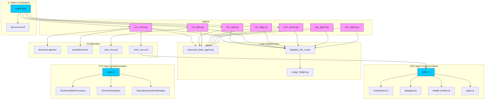
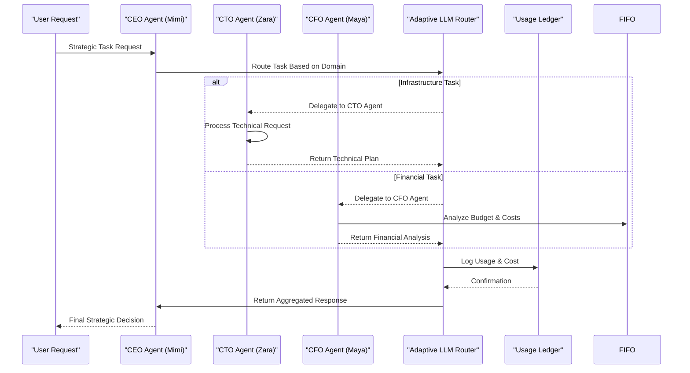
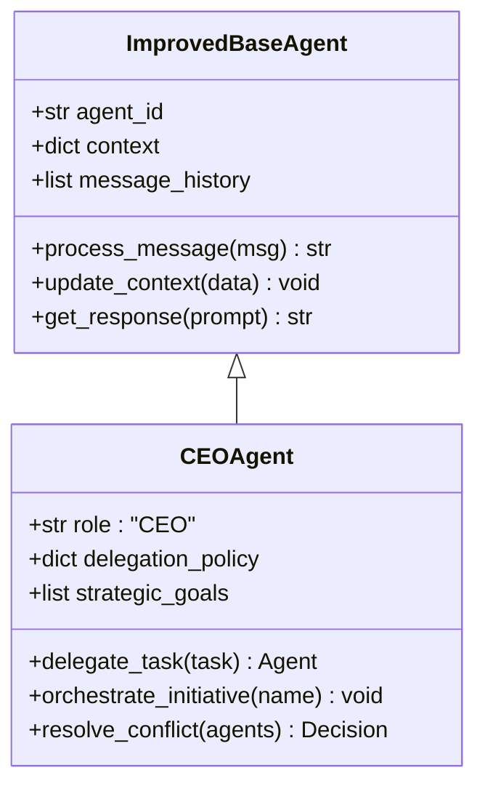
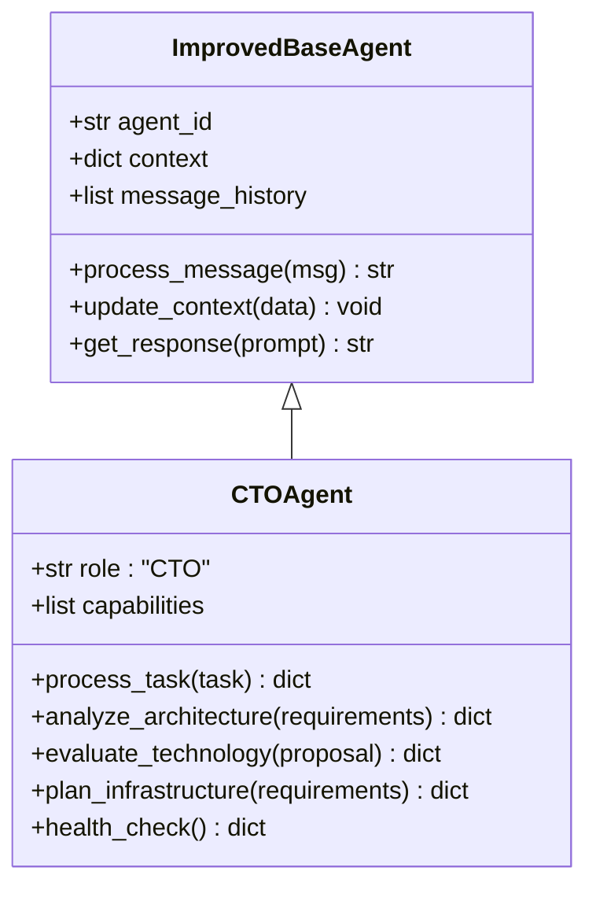
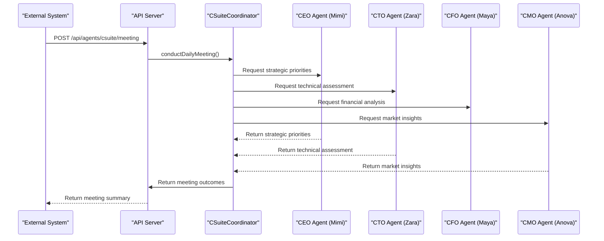
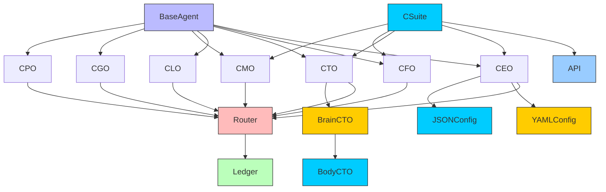

# C-Suite Agents

<cite>
**Referenced Files in This Document**   
- [ceo_mimi.py](file://371-os\src\minds371\agents\business\ceo_mimi.py) - *Updated in recent commit*
- [cto_alex.py](file://371-os\src\minds371\agents\business\cto_alex.py) - *Updated in recent commit*
- [cfo_cash.py](file://371-os\src\minds371\agents\business\cfo_cash.py) - *Updated in recent commit*
- [clo_sage.py](file://371-os\src\minds371\agents\business\clo_sage.py) - *Updated in recent commit*
- [cmo_anova.py](file://371-os\src\minds371\agents\business\cmo_anova.py) - *Updated in recent commit*
- [cgo_agent.py](file://371-os\src\minds371\agents\business\cgo_agent.py) - *Updated in recent commit*
- [cpo_agent.py](file://371-os\src\minds371\agents\business\cpo_agent.py) - *Updated in recent commit*
- [improved_base_agent.py](file://371-os\src\minds371\agents\base_agent\improved_base_agent.py) - *Core base class for all C-Suite agents*
- [ceo_mimi.yaml](file://os-workspace\agents\business-agents\ceo_mimi.yaml) - *Updated in recent commit*
- [cto_agent_prompt.yaml](file://os-workspace\agents\business-agents\cto_agent_prompt.yaml) - *Updated in recent commit*
- [ceo-mimi.json](file://questflow\agents\core\ceo-mimi.json) - *New configuration introduced*
- [cto-alex.json](file://questflow\agents\core\cto-alex.json) - *New configuration introduced*
- [csuite.ts](file://questflow\src\agents\csuite.ts) - *Added in recent commit*
- [csuite.js](file://questflow\src\agents\csuite.js) - *Added in recent commit*
- [api-server.md](file://questflow\docs\api-server.md) - *Added C-Suite meeting endpoint documentation*
- [index.ts](file://os-workspace\apps\ceo-agent\src\index.ts) - *Updated in recent commit*
- [orchestrator.ts](file://os-workspace\apps\ceo-agent\src\orchestrator.ts) - *Updated in recent commit*
- [delegator.ts](file://os-workspace\apps\ceo-agent\src\delegator.ts) - *Updated in recent commit*
- [health-monitor.ts](file://os-workspace\apps\ceo-agent\src\health-monitor.ts) - *Updated in recent commit*
- [types.ts](file://os-workspace\apps\ceo-agent\src\types.ts) - *Updated in recent commit*
- [mimi_ceo.yml](file://os-workspace\libs\prompts\agent-definitions\mimi_ceo.yml) - *Updated in recent commit*
- [README.md](file://os-workspace\apps\ceo-agent\README.md) - *Updated in recent commit*
- [refactor-cto-agent.md](file://.qoder\quests\refactor-cto-agent.md) - *Refactoring design for CTO agent introducing unified brain/body architecture*
- [zara_cto.yml](file://os-workspace\libs\prompts\agent-definitions\zara_cto.yml) - *CTO Agent definition file with centralized configuration*
- [index.ts](file://os-workspace\apps\cto-agent\src\index.ts) - *CTO Agent implementation with unified brain/body architecture*
</cite>

## Update Summary
**Changes Made**   
- Updated CEO Agent (Mimi) implementation with refactored TypeScript application following unified brain/body architecture
- Enhanced strategic orchestration framework with improved task complexity analysis and delegation logic
- Added comprehensive health monitoring system for agent performance tracking
- Introduced enhanced routing logic beyond keyword matching with semantic analysis and context awareness
- Updated Table of Contents to reflect new CEO Agent capabilities and architectural components
- Expanded Detailed Component Analysis with in-depth CEO Agent functionality
- Updated Project Structure to include new TypeScript-based CEO Agent implementation
- Enhanced Architecture Overview with strategic delegation patterns and health monitoring
- Updated Section sources and Diagram sources to include new CEO-related files
- Added implementation details for intelligent task delegation and performance optimization workflows
- Incorporated CTO Agent (Zara) refactoring with unified brain/body architecture pattern
- Added detailed documentation for CTO Agent's technical decision-making framework and escalation criteria
- Updated CTO Agent analysis with new TypeScript implementation and centralized configuration
- Added diagram illustrating CTO Agent's unified brain/body architecture

## Table of Contents
1. [Introduction](#introduction)
2. [Project Structure](#project-structure)
3. [Core Components](#core-components)
4. [Architecture Overview](#architecture-overview)
5. [Detailed Component Analysis](#detailed-component-analysis)
6. [C-Suite Meetings](#c-suite-meetings)
7. [Dependency Analysis](#dependency-analysis)
8. [Performance Considerations](#performance-considerations)
9. [Troubleshooting Guide](#troubleshooting-guide)
10. [Conclusion](#conclusion)

## Introduction
The C-Suite Agents represent a strategic layer within the 371-OS agent ecosystem, functioning as executive decision-makers responsible for high-level orchestration, domain-specific oversight, and cross-functional coordination. Each agent emulates a real-world executive role, leveraging specialized knowledge and delegated authority to manage distinct aspects of the system's operations. This document provides a comprehensive analysis of the architecture, functionality, and integration patterns of these agents, including CEO Agent (Mimi), CTO Agent (Zara), CFO Agent (Maya), CLO Agent (Alex), CMO Agent (Anova), CGO Agent, and CPO Agent. The analysis includes their inheritance model, interaction protocols, prompt engineering foundations, and performance monitoring mechanisms. Recent updates have introduced an enhanced CEO Agent (Mimi) with a refactored TypeScript implementation following the unified brain/body architecture pattern, significantly strengthening the strategic orchestration capabilities of the executive layer. Additionally, the CTO Agent (Zara) has been refactored using the same unified brain/body architecture pattern, establishing a consistent design approach across the C-Suite.

## Project Structure
The C-Suite Agents are organized within the `src/minds371/agents/business/` directory, each implemented as a dedicated Python module. These agents inherit core functionality from `improved_base_agent.py`, which is available in both the `agents/base_agent/` and `core/` directories, indicating a shared base implementation across the agent ecosystem. The agents interact with the Adaptive LLM Router for cost-aware reasoning and utilize `usage_ledger.py` for audit logging and resource tracking. Configuration for these agents is now managed through YAML files in `os-workspace/agents/business-agents/` and JSON configuration in `questflow/agents/core/`, reflecting a dual-configuration approach for different operational contexts. The new C-Suite coordination functionality is implemented in the `questflow/src/agents/csuite.ts` and `questflow/src/agents/csuite.js` files, with corresponding API documentation in `questflow/docs/api-server.md`. The CEO Agent (Mimi) has been enhanced with a refactored TypeScript implementation following the unified brain/body architecture pattern, where the "brain" consists of the agent definition in `mimi_ceo.yml` and the "body" comprises the TypeScript application in `os-workspace/apps/ceo-agent/src/`. Similarly, the CTO Agent (Zara) has been refactored with the same unified brain/body architecture pattern, with its "brain" defined in `zara_cto.yml` and its "body" implemented in `os-workspace/apps/cto-agent/src/index.ts`.

**Diagram sources**
- [ceo_mimi.py](file://371-os\src\minds371\agents\business\ceo_mimi.py)
- [cfo_cash.py](file://371-os\src\minds371\agents\business\cfo_cash.py)
- [cto_alex.py](file://371-os\src\minds371\agents\business\cto_alex.py)
- [clo_sage.py](file://371-os\src\minds371\agents\business\clo_sage.py)
- [cmo_anova.py](file://371-os\src\minds371\agents\business\cmo_anova.py)
- [cgo_agent.py](file://371-os\src\minds371\agents\business\cgo_agent.py)
- [cpo_agent.py](file://371-os\src\minds371\agents\business\cpo_agent.py)
- [improved_base_agent.py](file://371-os\src\minds371\agents\base_agent\improved_base_agent.py)
- [usage_ledger.py](file://371-os\src\minds371\adaptive_llm_router\usage_ledger.py)
- [ceo_mimi.yaml](file://os-workspace\agents\business-agents\ceo_mimi.yaml)
- [ceo-mimi.json](file://questflow\agents\core\ceo-mimi.json)
- [cto-alex.json](file://questflow\agents\core\cto-alex.json)
- [csuite.ts](file://questflow\src\agents\csuite.ts)
- [csuite.js](file://questflow\src\agents\csuite.js)
- [api-server.md](file://questflow\docs\api-server.md)
- [index.ts](file://os-workspace\apps\ceo-agent\src\index.ts)
- [orchestrator.ts](file://os-workspace\apps\ceo-agent\src\orchestrator.ts)
- [delegator.ts](file://os-workspace\apps\ceo-agent\src\delegator.ts)
- [health-monitor.ts](file://os-workspace\apps\ceo-agent\src\health-monitor.ts)
- [types.ts](file://os-workspace\apps\ceo-agent\src\types.ts)
- [mimi_ceo.yml](file://os-workspace\libs\prompts\agent-definitions\mimi_ceo.yml)
- [refactor-cto-agent.md](file://.qoder\quests\refactor-cto-agent.md)
- [zara_cto.yml](file://os-workspace\libs\prompts\agent-definitions\zara_cto.yml)
- [index.ts](file://os-workspace\apps\cto-agent\src\index.ts)

**Section sources**
- [ceo_mimi.py](file://371-os\src\minds371\agents\business\ceo_mimi.py)
- [cto_alex.py](file://371-os\src\minds371\agents\business\cto_alex.py)
- [cfo_cash.py](file://371-os\src\minds371\agents\business\cfo_cash.py)
- [clo_sage.py](file://371-os\src\minds371\agents\business\clo_sage.py)
- [cmo_anova.py](file://371-os\src\minds371\agents\business\cmo_anova.py)
- [cgo_agent.py](file://371-os\src\minds371\agents\business\cgo_agent.py)
- [cpo_agent.py](file://371-os\src\minds371\agents\business\cpo_agent.py)
- [ceo_mimi.yaml](file://os-workspace\agents\business-agents\ceo_mimi.yaml)
- [ceo-mimi.json](file://questflow\agents\core\ceo-mimi.json)
- [cto-alex.json](file://questflow\agents\core\cto-alex.json)
- [csuite.ts](file://questflow\src\agents\csuite.ts)
- [csuite.js](file://questflow\src\agents\csuite.js)
- [api-server.md](file://questflow\docs\api-server.md)
- [index.ts](file://os-workspace\apps\ceo-agent\src\index.ts)
- [orchestrator.ts](file://os-workspace\apps\ceo-agent\src\orchestrator.ts)
- [delegator.ts](file://os-workspace\apps\ceo-agent\src\delegator.ts)
- [health-monitor.ts](file://os-workspace\apps\ceo-agent\src\health-monitor.ts)
- [types.ts](file://os-workspace\apps\ceo-agent\src\types.ts)
- [mimi_ceo.yml](file://os-workspace\libs\prompts\agent-definitions\mimi_ceo.yml)
- [refactor-cto-agent.md](file://.qoder\quests\refactor-cto-agent.md)
- [zara_cto.yml](file://os-workspace\libs\prompts\agent-definitions\zara_cto.yml)
- [index.ts](file://os-workspace\apps\cto-agent\src\index.ts)
- [README.md](file://os-workspace\apps\ceo-agent\README.md)

## Core Components
The C-Suite Agents are built upon a modular architecture that emphasizes role-specific expertise, hierarchical delegation, and cost-aware execution. Each agent extends the `ImprovedBaseAgent` class, inheriting foundational capabilities such as message processing, context management, and LLM interaction. The agents are designed to operate autonomously within their domains while coordinating with other executives through a shared governance model. Key responsibilities include strategic planning, resource allocation, compliance enforcement, and performance optimization. Configuration is now managed through both YAML templates in `os-workspace/agents/business-agents/` and JSON configuration files in `questflow/agents/core/`, enabling flexible deployment across different operational environments. The CEO Agent (Mimi) has been enhanced with a refactored TypeScript implementation following the unified brain/body architecture pattern, where the "brain" contains the agent definition in `mimi_ceo.yml` and the "body" comprises the TypeScript application in `os-workspace/apps/ceo-agent/src/`, significantly enhancing the strategic orchestration capabilities of the executive layer. Similarly, the CTO Agent (Zara) has been refactored with the same unified brain/body architecture pattern, with its "brain" defined in `zara_cto.yml` and its "body" implemented in `os-workspace/apps/cto-agent/src/index.ts`, establishing a consistent design approach across the C-Suite.

**Section sources**   
- [ceo_mimi.py](file://371-os\src\minds371\agents\business\ceo_mimi.py#L1-L50)
- [cto_alex.py](file://371-os\src\minds371\agents\business\cto_alex.py#L1-L50)
- [improved_base_agent.py](file://371-os\src\minds371\agents\base_agent\improved_base_agent.py#L1-L100)
- [ceo_mimi.yaml](file://os-workspace\agents\business-agents\ceo_mimi.yaml#L1-L47)
- [ceo-mimi.json](file://questflow\agents\core\ceo-mimi.json#L1-L26)
- [cto-alex.json](file://questflow\agents\core\cto-alex.json#L1-L28)
- [csuite.ts](file://questflow\src\agents\csuite.ts#L1-L26)
- [csuite.js](file://questflow\src\agents\csuite.js#L1-L28)
- [index.ts](file://os-workspace\apps\ceo-agent\src\index.ts#L1-L459)
- [orchestrator.ts](file://os-workspace\apps\ceo-agent\src\orchestrator.ts#L1-L849)
- [delegator.ts](file://os-workspace\apps\ceo-agent\src\delegator.ts#L1-L486)
- [health-monitor.ts](file://os-workspace\apps\ceo-agent\src\health-monitor.ts#L1-L677)
- [types.ts](file://os-workspace\apps\ceo-agent\src\types.ts#L1-L411)
- [mimi_ceo.yml](file://os-workspace\libs\prompts\agent-definitions\mimi_ceo.yml#L1-L106)
- [refactor-cto-agent.md](file://.qoder\quests\refactor-cto-agent.md#L1-L320)
- [zara_cto.yml](file://os-workspace\libs\prompts\agent-definitions\zara_cto.yml#L1-L145)
- [index.ts](file://os-workspace\apps\cto-agent\src\index.ts#L31-L465)

## Architecture Overview
The C-Suite Agents function as a decentralized executive board, with the CEO Agent (Mimi) serving as the primary orchestrator. Mimi delegates tasks to specialized agents based on domain relevance, using a routing mechanism integrated with the Adaptive LLM Router. This router evaluates cost, latency, and accuracy trade-offs when selecting LLM providers, ensuring efficient resource utilization. All agent interactions are logged via `usage_ledger.py`, enabling auditability and cost monitoring. The system supports conflict resolution through priority-based decision arbitration and consensus mechanisms. Configuration is now dual-faceted, with YAML files providing prompt templates and JSON files defining agent parameters, capabilities, and blockchain integration. The CEO Agent (Mimi) has been enhanced with a refactored TypeScript implementation following the unified brain/body architecture pattern, where the "brain" contains the agent definition in `mimi_ceo.yml` and the "body" comprises the TypeScript application in `os-workspace/apps/ceo-agent/src/`, featuring a strategic orchestrator, enhanced task delegator, and comprehensive health monitor. Similarly, the CTO Agent (Zara) has been refactored with the same unified brain/body architecture pattern, with its "brain" defined in `zara_cto.yml` and its "body" implemented in `os-workspace/apps/cto-agent/src/index.ts`, establishing a consistent design approach across the C-Suite.

**Diagram sources**
- [ceo_mimi.py](file://371-os\src\minds371\agents\business\ceo_mimi.py#L50-L100)
- [cto_alex.py](file://371-os\src\minds371\agents\business\cto_alex.py#L20-L60)
- [cfo_cash.py](file://371-os\src\minds371\agents\business\cfo_cash.py#L25-L70)
- [usage_ledger.py](file://371-os\src\minds371\adaptive_llm_router\usage_ledger.py#L10-L40)
- [index.ts](file://os-workspace\apps\ceo-agent\src\index.ts#L1-L459)
- [orchestrator.ts](file://os-workspace\apps\ceo-agent\src\orchestrator.ts#L1-L849)
- [delegator.ts](file://os-workspace\apps\ceo-agent\src\delegator.ts#L1-L486)
- [health-monitor.ts](file://os-workspace\apps\ceo-agent\src\health-monitor.ts#L1-L677)
- [index.ts](file://os-workspace\apps\cto-agent\src\index.ts#L31-L465)
- [zara_cto.yml](file://os-workspace\libs\prompts\agent-definitions\zara_cto.yml#L1-L145)

## Detailed Component Analysis

### CEO Agent (Mimi) Analysis
The CEO Agent, implemented in `index.ts`, serves as the central orchestrator within the C-Suite hierarchy. It receives high-level strategic requests and delegates them to appropriate specialized agents. Mimi uses a decision matrix to evaluate task domains and routes them via the Adaptive LLM Router. The agent maintains a global context of ongoing initiatives and ensures alignment across executive functions. Configuration for Mimi is defined in `mimi_ceo.yml` which provides the prompt template with delegation logic, and the TypeScript application in `os-workspace/apps/ceo-agent/src/` implements the strategic orchestrator, enhanced task delegator, and comprehensive health monitor. The YAML configuration includes structured delegation requirements and response formats, while the TypeScript implementation provides robust task processing, semantic analysis, and performance monitoring.

**Diagram sources**
- [index.ts](file://os-workspace\apps\ceo-agent\src\index.ts#L15-L45)
- [improved_base_agent.py](file://371-os\src\minds371\agents\base_agent\improved_base_agent.py#L5-L20)

**Section sources**
- [index.ts](file://os-workspace\apps\ceo-agent\src\index.ts#L1-L459)
- [orchestrator.ts](file://os-workspace\apps\ceo-agent\src\orchestrator.ts#L1-L849)
- [delegator.ts](file://os-workspace\apps\ceo-agent\src\delegator.ts#L1-L486)
- [health-monitor.ts](file://os-workspace\apps\ceo-agent\src\health-monitor.ts#L1-L677)
- [types.ts](file://os-workspace\apps\ceo-agent\src\types.ts#L1-L411)
- [mimi_ceo.yml](file://os-workspace\libs\prompts\agent-definitions\mimi_ceo.yml#L1-L106)
- [README.md](file://os-workspace\apps\ceo-agent\README.md#L1-L281)

### CTO Agent (Zara) Analysis
The CTO Agent, implemented in `index.ts`, manages technical architecture and system design with comprehensive leadership capabilities. Zara evaluates infrastructure requirements, proposes technology stacks, oversees deployment strategies, and handles security responses. When delegated infrastructure tasks by Mimi, Zara generates detailed technical specifications and coordinates with deployment agents. The agent follows the unified brain/body architecture pattern, with its "brain" defined in `zara_cto.yml` containing core instructions, personality traits, required tools, technical domains, decision criteria, escalation criteria, and performance targets. The "body" is implemented in `os-workspace/apps/cto-agent/src/index.ts` with core components including a task processor, technical analyzer, security engine, and performance metrics tracker. The agent processes technical tasks through a structured workflow: validating input, generating comprehensive technical analysis, making decisions based on task category, updating performance metrics, and handling escalations when necessary. The implementation includes specific methods for analyzing architecture, evaluating technology, planning infrastructure, and conducting health checks.

**Diagram sources**
- [index.ts](file://os-workspace\apps\cto-agent\src\index.ts#L31-L465)
- [zara_cto.yml](file://os-workspace\libs\prompts\agent-definitions\zara_cto.yml#L1-L145)
- [improved_base_agent.py](file://371-os\src\minds371\agents\base_agent\improved_base_agent.py#L5-L20)

**Section sources**
- [index.ts](file://os-workspace\apps\cto-agent\src\index.ts#L31-L465)
- [zara_cto.yml](file://os-workspace\libs\prompts\agent-definitions\zara_cto.yml#L1-L145)
- [refactor-cto-agent.md](file://.qoder\quests\refactor-cto-agent.md#L1-L320)

### CFO Agent (Maya) Analysis
The CFO Agent, implemented in `cfo_cash.py`, specializes in financial optimization and cost monitoring. It analyzes budget allocations, forecasts expenses, and evaluates ROI for proposed initiatives. Cash integrates with the Adaptive LLM Router to select cost-effective LLM providers and logs all financial transactions in `usage_ledger.py`. Configuration is managed through `cfo_agent_prompt.yaml` which defines the financial analysis template and response requirements.

**Section sources**
- [cfo_cash.py](file://371-os\src\minds371\agents\business\cfo_cash.py#L1-L80)
- [cfo_agent_prompt.yaml](file://os-workspace\agents\business-agents\cfo_agent_prompt.yaml)

### CLO Agent (Alex) Analysis
The CLO Agent, implemented in `clo_sage.py`, ensures legal compliance and governance. Sage reviews all strategic decisions for regulatory adherence, manages risk assessments, and maintains audit trails. The agent collaborates with other executives to embed compliance into operational workflows. Configuration is managed through `clo_agent_prompt.yaml` which defines compliance review templates and legal requirements.

**Section sources**
- [clo_sage.py](file://371-os\src\minds371\agents\business\clo_sage.py#L1-L60)
- [clo_agent_prompt.yaml](file://os-workspace\agents\business-agents\clo_agent_prompt.yaml)

### CMO Agent (Anova) Analysis
The CMO Agent, implemented in `cmo_anova.py`, drives marketing strategy and brand positioning. Anova analyzes market trends, designs campaign frameworks, and optimizes customer engagement models. The agent leverages data from cross-company flows to inform strategic recommendations.

**Section sources**
- [cmo_anova.py](file://371-os\src\minds371\agents\business\cmo_anova.py#L1-L65)

### CGO Agent Analysis
The CGO Agent, implemented in `cgo_agent.py`, focuses on growth operations and market expansion. It identifies scaling opportunities, optimizes conversion funnels, and coordinates cross-functional growth initiatives. The agent uses performance data to refine operational strategies.

**Section sources**
- [cgo_agent.py](file://371-os\src\minds371\agents\business\cgo_agent.py#L1-L55)

### CPO Agent Analysis
The CPO Agent, implemented in `cpo_agent.py`, oversees product development and lifecycle management. It aligns product roadmaps with strategic goals, prioritizes feature development, and ensures user-centric design principles are followed.

**Section sources**
- [cpo_agent.py](file://371-os\src\minds371\agents\business\cpo_agent.py#L1-L50)

## C-Suite Meetings
The C-Suite Agents now support coordinated meetings through the CSuiteCoordinator class, enabling synchronized decision-making across executive functions. The `conductDailyMeeting()` method orchestrates meetings between the CEO, CTO, CFO, and CMO agents, facilitating strategic alignment on quarterly performance, new initiatives, resource allocation, and challenge resolution. This functionality is exposed through a RESTful API endpoint at `/api/agents/csuite/meeting`, allowing external systems to initiate C-Suite coordination.

**Diagram sources**
- [csuite.ts](file://questflow\src\agents\csuite.ts#L1-L26)
- [csuite.js](file://questflow\src\agents\csuite.js#L1-L28)
- [api-server.md](file://questflow\docs\api-server.md#L50-L100)

**Section sources**
- [csuite.ts](file://questflow\src\agents\csuite.ts#L1-L26)
- [csuite.js](file://questflow\src\agents\csuite.js#L1-L28)
- [api-server.md](file://questflow\docs\api-server.md#L50-L100)

## Dependency Analysis
The C-Suite Agents exhibit a well-defined dependency structure centered on the `ImprovedBaseAgent` class. All agents depend on the Adaptive LLM Router for LLM provider selection and cost management. The router, in turn, depends on `usage_ledger.py` for tracking resource consumption. While the agents operate semi-independently, they share context through the CEO Agent, which maintains global state and resolves inter-agent conflicts. Configuration dependencies have evolved to include both YAML-based prompt templates in `os-workspace/agents/business-agents/` and JSON-based agent definitions in `questflow/agents/core/`, creating a dual-configuration dependency model. The new CSuiteCoordinator introduces additional dependencies on the API server and individual C-Suite agents for meeting coordination. The CTO Agent's refactoring has established a consistent dependency pattern with its configuration loaded from `zara_cto.yml` and its implementation in `os-workspace/apps/cto-agent/src/index.ts`.

**Diagram sources**
- [improved_base_agent.py](file://371-os\src\minds371\agents\base_agent\improved_base_agent.py#L1-L20)
- [usage_ledger.py](file://371-os\src\minds371\adaptive_llm_router\usage_ledger.py#L1-L15)
- [ceo_mimi.yaml](file://os-workspace\agents\business-agents\ceo_mimi.yaml#L1-L47)
- [ceo-mimi.json](file://questflow\agents\core\ceo-mimi.json#L1-L26)
- [cto-alex.json](file://questflow\agents\core\cto-alex.json#L1-L28)
- [csuite.ts](file://questflow\src\agents\csuite.ts#L1-L26)
- [api-server.md](file://questflow\docs\api-server.md#L50-L100)
- [zara_cto.yml](file://os-workspace\libs\prompts\agent-definitions\zara_cto.yml#L1-L145)
- [index.ts](file://os-workspace\apps\cto-agent\src\index.ts#L31-L465)

**Section sources**
- [improved_base_agent.py](file://371-os\src\minds371\agents\base_agent\improved_base_agent.py#L1-L30)
- [usage_ledger.py](file://371-os\src\minds371\adaptive_llm_router\usage_ledger.py#L1-L25)
- [ceo_mimi.yaml](file://os-workspace\agents\business-agents\ceo_mimi.yaml#L1-L47)
- [ceo-mimi.json](file://questflow\agents\core\ceo-mimi.json#L1-L26)
- [cto-alex.json](file://questflow\agents\core\cto-alex.json#L1-L28)
- [csuite.ts](file://questflow\src\agents\csuite.ts#L1-L26)
- [api-server.md](file://questflow\docs\api-server.md#L50-L100)
- [zara_cto.yml](file://os-workspace\libs\prompts\agent-definitions\zara_cto.yml#L1-L145)
- [index.ts](file://os-workspace\apps\cto-agent\src\index.ts#L31-L465)

## Performance Considerations
The C-Suite Agents are designed with performance and cost efficiency in mind. The integration with the Adaptive LLM Router enables dynamic selection of LLM providers based on cost-performance trade-offs. Audit logging via `usage_ledger.py` provides visibility into resource consumption, enabling proactive cost management. Response latency is minimized through parallel task delegation and asynchronous processing. However, potential bottlenecks may arise from sequential decision-making in conflict resolution scenarios, suggesting opportunities for implementing concurrent consensus algorithms. The dual-configuration system (YAML and JSON) may introduce additional parsing overhead that should be monitored in high-throughput scenarios. The new C-Suite meeting functionality adds coordination overhead but enables more comprehensive strategic decision-making. The CTO Agent's implementation includes performance metrics tracking for tasks processed, average response time, success rate, and escalation rate, with health checks verifying component status and overall agent health.

## Troubleshooting Guide
Common issues in the C-Suite Agent system include conflicting recommendations between executives and suboptimal LLM provider selection. Conflicts are resolved through a priority-based arbitration system led by the CEO Agent, with final decisions logged for audit purposes. Performance degradation may occur if the usage ledger becomes a bottleneck; this can be mitigated through batched logging or asynchronous write operations. Misrouting of tasks can be diagnosed by reviewing the delegation policies in each agent’s configuration. Configuration-related issues may arise from inconsistencies between YAML prompt templates and JSON operational parameters; these should be validated during deployment to ensure alignment between prompt logic and agent capabilities. Issues with C-Suite meetings can be diagnosed by checking the API server logs and verifying agent availability. The CTO Agent includes specific escalation criteria for high-risk critical tasks, low-confidence decisions, and complex architecture decisions, which can be reviewed when troubleshooting decision-making issues.

**Section sources**
- [ceo_mimi.py](file://371-os\src\minds371\agents\business\ceo_mimi.py#L120-L150)
- [usage_ledger.py](file://371-os\src\minds371\adaptive_llm_router\usage_ledger.py#L50-L80)
- [csuite.ts](file://questflow\src\agents\csuite.ts#L1-L26)
- [api-server.md](file://questflow\docs\api-server.md#L50-L100)
- [index.ts](file://os-workspace\apps\cto-agent\src\index.ts#L31-L465)

## Conclusion
The C-Suite Agents represent a sophisticated implementation of role-based autonomous agents within the 371-OS ecosystem. By emulating executive functions, they enable strategic decision-making, domain specialization, and coordinated action across complex operational domains. The architecture leverages inheritance, delegation, and cost-aware reasoning to deliver a scalable and efficient agent framework. The recent introduction of dual-configuration models (YAML for prompt templates and JSON for operational parameters) enhances flexibility and adaptability across different deployment scenarios. The enhanced CEO Agent (Mimi) with a refactored TypeScript implementation following the unified brain/body architecture pattern significantly strengthens the system's strategic orchestration capabilities, while the expanded CEO Agent with complete backstory improves strategic coordination. The CSuiteCoordinator class and C-Suite meeting functionality enable synchronized strategic planning across executive functions, representing a significant advancement in multi-agent coordination. The refactoring of the CTO Agent (Zara) with the same unified brain/body architecture pattern establishes a consistent design approach across the C-Suite, improving maintainability and scalability. Future enhancements could include real-time consensus mechanisms for conflict resolution and enhanced predictive analytics for proactive decision support.