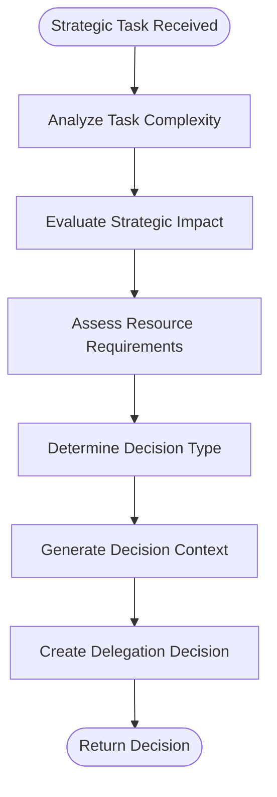

# CEO Agent (Mimi)

<cite>
**Referenced Files in This Document**   
- [ceo_mimi.py](file://_legacy\agents\business\ceo_mimi.py) - *Updated in recent commit*
- [ceo_mimi.yaml](file://os-workspace\agents\business-agents\ceo_mimi.yaml) - *Updated in recent commit*
- [ceo-mimi.json](file://questflow\agents\core\ceo-mimi.json) - *Enhanced with backstory and blockchain identity*
- [improved_base_agent.py](file://_legacy\agents\base_agent\improved_base_agent.py) - *Updated in recent commit*
- [intelligent_router_agent.py](file://_legacy\adaptive_llm_router\intelligent_router_agent.py) - *Updated in recent commit*
- [policy_engine.py](file://_legacy\adaptive_llm_router\policy_engine.py) - *Updated in recent commit*
- [usage_ledger.py](file://_legacy\adaptive_llm_router\usage_ledger.py) - *Updated in recent commit*
- [orchestrator.ts](file://os-workspace\apps\ceo-agent\src\orchestrator.ts) - *Refactored implementation with unified brain/body architecture*
- [types.ts](file://os-workspace\apps\ceo-agent\src\types.ts) - *Type definitions for strategic orchestrator*
- [health-monitor.ts](file://os-workspace\apps\ceo-agent\src\health-monitor.ts) - *Added comprehensive health monitoring system*
- [agent-resolver.service.ts](file://os-workspace\apps\dao-governance-service\src\agent-resolver.service.ts) - *Added agent resolver service for C-Suite coordination*
- [governance-service.ts](file://os-workspace\apps\dao-governance-service\src\governance-service.ts) - *Enhanced governance workflows with cognitive oversight*
- [cognitive-query.service.ts](file://os-workspace\apps\dao-governance-service\src\cognitive-query.service.ts) - *Added cognitive integration for human approval workflows*
</cite>

## Update Summary
**Changes Made**   
- Updated **Core Architecture** section to reflect new TypeScript-based StrategicOrchestrator implementation with unified brain/body pattern
- Added new **Comprehensive Health Monitoring System** section detailing the enhanced monitoring capabilities
- Enhanced **Performance and Monitoring** section with new health monitoring components and metrics
- Updated **Configuration and Customization** section to include health monitoring parameters
- Added source references for new file health-monitor.ts
- Removed outdated flowchart diagram that no longer reflects current implementation
- Added **Enhanced Governance Workflows** section covering the new DAO governance service with cognitive oversight
- Added **Agent Resolution Service** section explaining the mapping between legacy and modern agent identifiers
- Added **Cognitive Oversight Integration** section detailing the cognitive analysis of proposals
- Added **Human-in-the-Loop Approval Process** section describing the enhanced decision-making workflow

## Table of Contents
1. [Introduction](#introduction)
2. [Core Architecture](#core-architecture)
3. [Strategic Orchestration Framework](#strategic-orchestration-framework)
4. [Executive Behavior Configuration](#executive-behavior-configuration)
5. [Workflow-Driven Initialization](#workflow-driven-initialization)
6. [Integration with Adaptive LLM Router](#integration-with-adaptive-llm-router)
7. [Interaction with Specialized Agents](#interaction-with-specialized-agents)
8. [Executive Meeting Coordination](#executive-meeting-coordination)
9. [Executive Communication Orchestration](#executive-communication-orchestration)
10. [Performance and Monitoring](#performance-and-monitoring)
11. [Comprehensive Health Monitoring System](#comprehensive-health-monitoring-system)
12. [Enhanced Governance Workflows](#enhanced-governance-workflows)
13. [Agent Resolution Service](#agent-resolution-service)
14. [Cognitive Oversight Integration](#cognitive-oversight-integration)
15. [Human-in-the-Loop Approval Process](#human-in-the-loop-approval-process)
16. [Configuration and Customization](#configuration-and-customization)
17. [Conclusion](#conclusion)

## Introduction

The CEO Agent (Mimi) serves as the primary orchestrator within the 371-OS agent ecosystem, functioning as the strategic decision-making entity responsible for high-level task delegation, prioritization, and cross-functional coordination. Designed as the executive layer of the autonomous agent framework, Mimi interprets incoming business tasks and routes them to the appropriate specialized C-suite agents based on semantic analysis of task descriptions. This document provides a comprehensive analysis of Mimi's architectural design, implementation details, integration points, and operational behavior, offering both technical depth and accessible explanations for stakeholders at all levels.

**Section sources**
- [ceo_mimi.py](file://_legacy\agents\business\ceo_mimi.py#L1-L100)

## Core Architecture

The CEO Agent (Mimi) has been refactored to follow a unified brain/body architecture pattern, where the core intelligence is implemented in TypeScript for enhanced type safety and maintainability. The agent now features a `StrategicOrchestrator` class that handles high-level strategic decision making, task complexity analysis, and coordination of cross-functional initiatives within the 371 DAO ecosystem.

The orchestrator is initialized with a `CEOAgentDefinition` that includes organizational priorities such as cost optimization (97.6% reduction through Akash Network), agent autonomy, and DAO governance. This strategic context guides all decision-making processes and ensures alignment with organizational goals.

```
classDiagram
class StrategicOrchestrator {
+agentDefinition : CEOAgentDefinition
+logger : Logger
+performanceHistory : Map<string, PerformanceMetrics>
+strategicContext : OrchestrationContext
+orchestrateTask(request : OrchestrationRequest) Promise<DelegationDecision>
+validate() Promise<boolean>
}
class CEOAgentDefinition {
+agent_name : string
+agent_type : 'STRATEGIC_LEADERSHIP'
+core_instructions : string
+personality_traits : string[]
+required_tools : string[]
+delegation_rules : DelegationRules
+escalation_criteria : EscalationCriteria
+performance_targets : PerformanceTargets
+monitoring_metrics : string[]
}
StrategicOrchestrator --> CEOAgentDefinition : uses
```

**Diagram sources**
- [orchestrator.ts](file://os-workspace\apps\ceo-agent\src\orchestrator.ts#L23-L848)
- [types.ts](file://os-workspace\apps\ceo-agent\src\types.ts#L8-L18)

**Section sources**
- [orchestrator.ts](file://os-workspace\apps\ceo-agent\src\orchestrator.ts#L23-L848)
- [types.ts](file://os-workspace\apps\ceo-agent\src\types.ts#L8-L18)

## Strategic Orchestration Framework

The core functionality of CEO Agent (Mimi) has been significantly enhanced with the introduction of the `StrategicOrchestrator` class, which implements a sophisticated multi-step decision-making process. Unlike the previous keyword-based routing system, the new framework analyzes tasks across multiple dimensions including technical complexity, domain complexity, coordination complexity, and strategic complexity.

The orchestration process follows six key steps:
1. Analyze task complexity and strategic implications
2. Evaluate strategic impact and priority alignment
3. Assess resource requirements and availability
4. Determine optimal decision type (delegate, coordinate, or escalate)
5. Generate decision context with workload and performance data
6. Create delegation decision with confidence scoring

This approach enables more nuanced decision-making that considers not just task content but also organizational priorities, resource constraints, and risk factors.



**Diagram sources**
- [orchestrator.ts](file://os-workspace\apps\ceo-agent\src\orchestrator.ts#L71-L118)

**Section sources**
- [orchestrator.ts](file://os-workspace\apps\ceo-agent\src\orchestrator.ts#L71-L118)

## Executive Behavior Configuration

The behavior and decision-making framework of CEO Agent (Mimi) is shaped by the `ceo_mimi.yaml` prompt template, which defines the agent's role, capabilities, and response requirements. This configuration file serves as the executive blueprint that guides Mimi's interactions within the agent ecosystem.

The template specifies that Mimi operates in the domain of strategic oversight and task delegation, with core capabilities in strategic decision-making, task delegation, and agent coordination. It mandates a structured JSON response format containing delegation details, status information, and metadata including timestamps, session IDs, and task IDs.

Key aspects of the configuration include:
- **Delegation Logic**: Requires analysis of task complexity and identification of appropriate specialized agents
- **Response Requirements**: Specifies that responses must include status ("delegated" or "completed") and structured delegation details
- **Agent Metadata**: Ensures all responses contain contextual information for audit and tracking purposes

```
classDiagram
class PromptTemplate {
+template : str
+variables : Dict[str, Any]
+usage : str
}
class CeoMimiConfig {
+agent_type : str
+domain_expertise : str
+capabilities_list : str
+response_format : str
+status_requirement : str
+structure_requirement : str
}
PromptTemplate <|-- CeoMimiConfig
```

**Diagram sources**
- [ceo_mimi.yaml](file://os-workspace\agents\business-agents\ceo_mimi.yaml#L1-L48)

**Section sources**
- [ceo_mimi.yaml](file://os-workspace\agents\business-agents\ceo_mimi.yaml#L1-L48)

## Workflow-Driven Initialization

A new JSON-based configuration model has been introduced for CEO Agent (Mimi) through the questflow system, providing a workflow-driven initialization approach that complements the existing YAML configuration. The `ceo-mimi.json` file defines comprehensive agent parameters for operational context and integration requirements.

The JSON configuration includes:
- **Core Identity**: Agent name, description, and blockchain identifiers (DID, stake amount, reputation score)
- **Provider and Model**: Specifies ElizaOS as provider with GPT-4 as primary model
- **Capabilities**: Strategic planning, cost optimization, high-level coordination, and business intelligence
- **Operational Parameters**: Temperature (0.7) and max tokens (2000) for response generation
- **System Instructions**: Clear directive to focus on strategic decisions, cost optimization (specifically 97.6% reduction through Akash Network), and high-level coordination
- **Plugin Integration**: Business intelligence, NX workspace, and universal tool server plugins
- **Blockchain Identity**: Decentralized identifier, stake amount (100), and reputation score (80)
- **Communication Examples**: Sample message exchanges demonstrating Mimi's executive communication style
- **Personality Traits**: Strategic, cost-conscious, visionary, and decisive characteristics
- **Knowledge Domains**: Expertise in strategic planning, cost optimization, high-level coordination, and business intelligence

This dual-configuration approach allows Mimi to operate with both prompt-based behavior definition (YAML) and workflow-driven operational parameters (JSON), enabling flexible deployment across different execution environments.

**Section sources**
- [ceo-mimi.json](file://questflow\agents\core\ceo-mimi.json#L1-L92)

## Integration with Adaptive LLM Router

CEO Agent (Mimi) integrates with the Adaptive LLM Router system through the `intelligent_router_agent.py` component, which enables cost-aware reasoning and dynamic LLM provider selection. This integration allows Mimi to make intelligent decisions about which language model to use for processing different types of executive tasks based on cost, quality, and performance requirements.

The routing decision is governed by the `policy_engine.py`, which implements a decision graph that considers multiple factors:
- **Privacy requirements**: Tasks marked as confidential are routed to local models (LocalAI)
- **Task criticality**: High-quality tasks are assigned to premium models (GPT-4) when budget permits
- **Context length**: Long-context tasks are directed to models with extended context windows (Claude-3)
- **Budget constraints**: When budget is low, the system defaults to cost-efficient models (Mistral-7B)
- **Default routing**: Balanced default model (Qwen2-72B) for general tasks

The `usage_ledger.py` component provides audit logging and cost tracking, recording every LLM interaction with details including provider, model, cost, token usage, and task context. This enables comprehensive monitoring of LLM expenses and performance metrics.

```
sequenceDiagram
participant Mimi as CEO Agent (Mimi)
participant Router as Intelligent Router
participant Policy as Policy Engine
participant Ledger as Usage Ledger
participant LLM as LLM Provider
Mimi->>Router : Submit Task
Router->>Policy : Request Provider Selection
Policy->>Policy : Evaluate Budget, Privacy, Criticality
Policy-->>Router : Selected Provider
Router->>LLM : Invoke Model
LLM-->>Router : Response
Router->>Ledger : Record Usage Metrics
Ledger-->>Router : Confirmation
Router-->>Mimi : Processed Result
```

**Diagram sources**
- [intelligent_router_agent.py](file://_legacy\adaptive_llm_router\intelligent_router_agent.py#L1-L105)
- [policy_engine.py](file://_legacy\adaptive_llm_router\policy_engine.py#L1-L34)
- [usage_ledger.py](file://_legacy\adaptive_llm_router\usage_ledger.py#L1-L89)

**Section sources**
- [intelligent_router_agent.py](file://_legacy\adaptive_llm_router\intelligent_router_agent.py#L1-L105)
- [policy_engine.py](file://_legacy\adaptive_llm_router\policy_engine.py#L1-L34)
- [usage_ledger.py](file://_legacy\adaptive_llm_router\usage_ledger.py#L1-L89)

## Interaction with Specialized Agents

CEO Agent (M