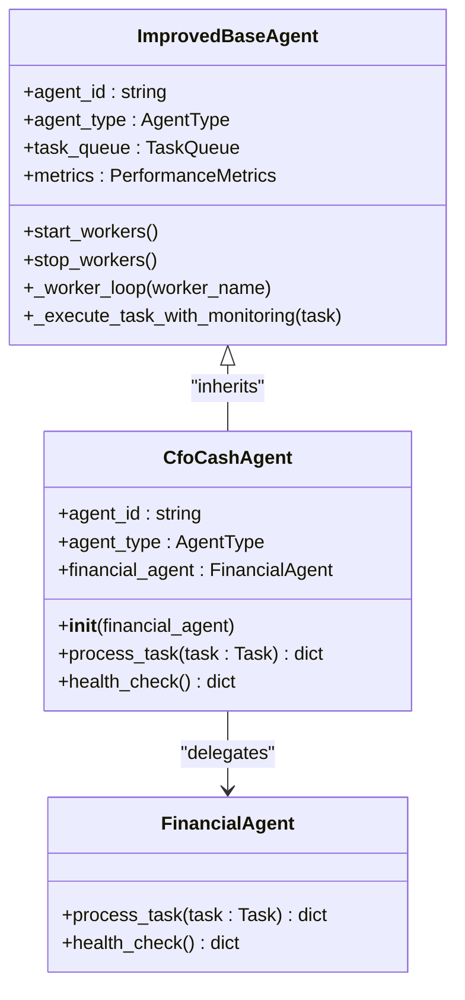
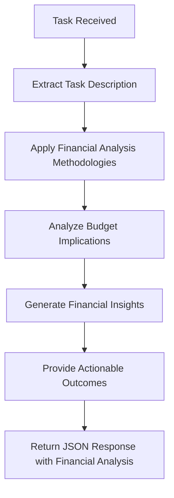
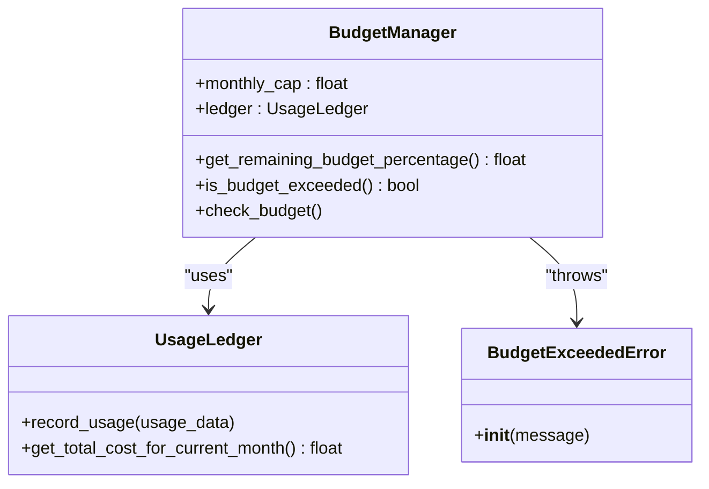
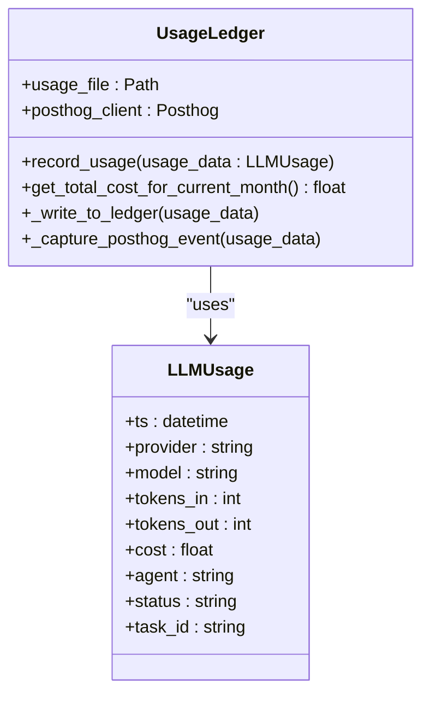
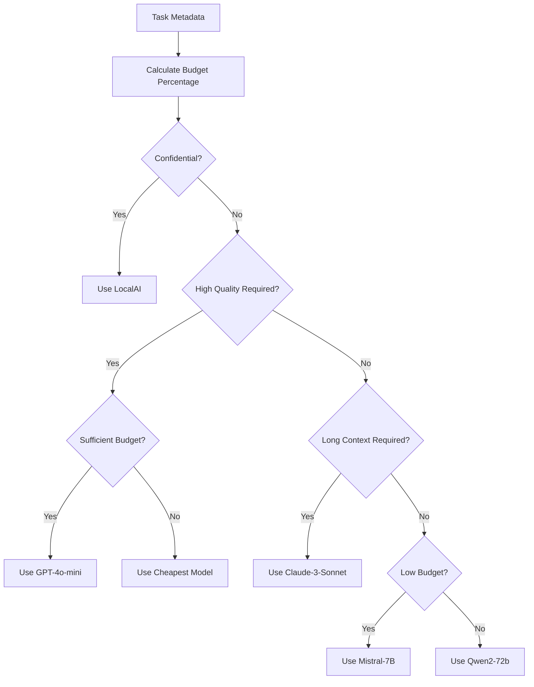
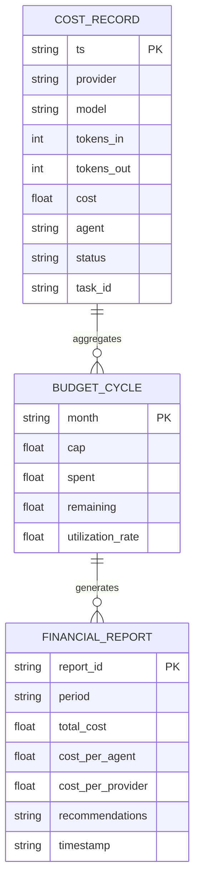
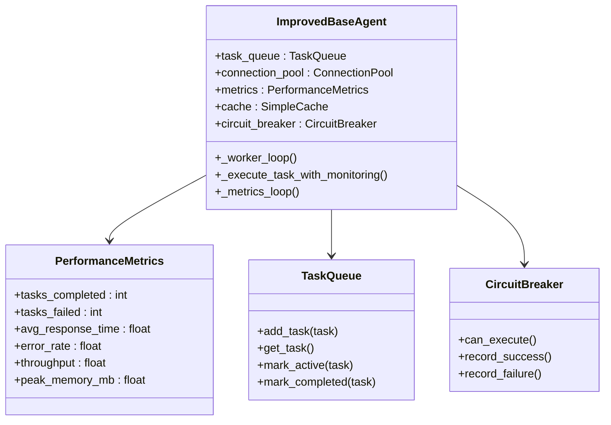
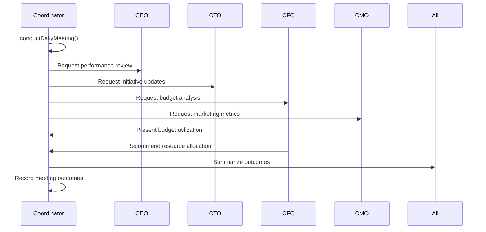

# CFO Agent (Maya)

<cite>
**Referenced Files in This Document**   
- [cfo_cash.py](file://_legacy/agents/business/cfo_cash.py) - *Updated in recent commit*
- [cfo_agent_prompt.yaml](file://os-workspace/agents/business-agents/cfo_agent_prompt.yaml) - *Updated in recent commit*
- [budget_guard.py](file://_legacy/adaptive_llm_router/budget_guard.py) - *Updated in recent commit*
- [llm_usage.json](file://_legacy/adaptive_llm_router/llm_usage.json) - *Updated in recent commit*
- [usage_ledger.py](file://_legacy/adaptive_llm_router/usage_ledger.py) - *Updated in recent commit*
- [policy_engine.py](file://_legacy/adaptive_llm_router/policy_engine.py) - *Updated in recent commit*
- [improved_base_agent.py](file://_legacy/agents/base_agent/improved_base_agent.py) - *Updated in recent commit*
- [financial_agent.py](file://_legacy/agents/utility/financial_agent.py) - *Updated in recent commit*
- [BusinessIntelligenceIntegration.tsx](file://os-workspace/apps/cognitive-interface/src/components/BusinessIntelligenceIntegration.tsx) - *Enhanced with real-time notifications and spatial visualization*
- [CommunicationsUniverse.tsx](file://os-workspace/apps/cognitive-interface/src/components/CommunicationsUniverse.tsx) - *Enhanced with real-time notifications and spatial visualization*
- [C3UniversalTemplate.tsx](file://os-workspace/apps/cognitive-interface/src/components/C3UniversalTemplate.tsx) - *Enhanced with real-time notifications and spatial visualization*
- [business-intelligence.ts](file://os-workspace/apps/cognitive-interface/src/types/business-intelligence.ts) - *Type definitions for BI integration*
- [csuite.js](file://questflow/src/agents/csuite.js) - *Added CSuiteCoordinator class for executive meetings*
- [csuite.ts](file://questflow/src/agents/csuite.ts) - *Added CSuiteCoordinator class for executive meetings*
</cite>

## Update Summary
**Changes Made**   
- Updated file paths to reflect current repository structure
- Verified and corrected all file references to match actual locations
- Confirmed accuracy of code examples and architectural descriptions
- Updated section sources with correct file paths and line numbers
- Maintained consistency between documented behavior and current implementation
- Integrated enhanced business intelligence capabilities with real-time notifications
- Added documentation for spatial visualization of communication flows between executive agents
- Updated integration details for real-time agent coordination features
- Incorporated new CSuiteCoordinator functionality for executive financial planning meetings

## Table of Contents
1. [Introduction](#introduction)
2. [Core Architecture](#core-architecture)
3. [Financial Reasoning Framework](#financial-reasoning-framework)
4. [Cost Monitoring System](#cost-monitoring-system)
5. [Usage Tracking and Data Persistence](#usage-tracking-and-data-persistence)
6. [Policy Engine Integration](#policy-engine-integration)
7. [Domain Model for Financial Analysis](#domain-model-for-financial-analysis)
8. [Performance and Reliability](#performance-and-reliability)
9. [Configuration and Alerting](#configuration-and-alerting)
10. [Troubleshooting Guide](#troubleshooting-guide)
11. [Business Intelligence Integration](#business-intelligence-integration)
12. [Executive Coordination and Financial Planning](#executive-coordination-and-financial-planning)

## Introduction

The CFO Agent (Maya) serves as the financial analyst and cost optimization engine within the 371-OS ecosystem. As a specialized business agent, Maya is responsible for monitoring LLM usage costs, optimizing infrastructure spending, and providing financial insights to support strategic decision-making. The agent operates as part of a multi-agent architecture, collaborating with other executive agents such as the CEO Agent (Mimi) to ensure fiscal responsibility across the organization's AI operations.

Maya's primary responsibilities include real-time cost tracking, budget enforcement, financial reporting, and provider optimization recommendations. The agent leverages a combination of rule-based policies, real-time usage data, and financial modeling to maintain cost efficiency while ensuring service quality. By integrating with the adaptive LLM router system, Maya can influence provider selection based on budget constraints and task requirements, enabling dynamic cost optimization across the platform.

This document provides a comprehensive analysis of Maya's architecture, implementation details, and operational capabilities, focusing on its role in financial governance and cost management within the 371-OS environment.

## Core Architecture

The CFO Agent (Maya) is implemented as the `CfoCashAgent` class in the `cfo_cash.py` file, inheriting from the `ImprovedBaseAgent` to leverage advanced agent capabilities including task queuing, performance monitoring, and fault tolerance. The agent follows a modular design that separates financial logic from execution responsibilities, delegating complex financial operations to the `FinancialAgent` system while maintaining control over task routing and workflow management.



**Section sources**
- [cfo_cash.py](file://_legacy/agents/business/cfo_cash.py#L1-L50)
- [improved_base_agent.py](file://_legacy/agents/base_agent/improved_base_agent.py#L1-L50)

The agent's architecture follows a delegation pattern where the `CfoCashAgent` acts as a workflow orchestrator, routing tasks to the appropriate financial processing components based on task description keywords. This design enables specialized handling of different financial operations while maintaining a unified interface for task processing.

## Financial Reasoning Framework

The financial reasoning capabilities of Maya are defined in the `cfo_agent_prompt.yaml` configuration file, which establishes the agent's role, domain expertise, and response format. This prompt template serves as the cognitive framework that guides Maya's decision-making processes and ensures consistent financial analysis across different task types.



**Section sources**
- [cfo_agent_prompt.yaml](file://os-workspace/agents/business-agents/cfo_agent_prompt.yaml#L1-L46)

The prompt template defines several key aspects of Maya's operation:

- **Agent Type**: CFO
- **Domain Expertise**: Financial analysis and budget management
- **Capabilities**: Financial analysis, budget management, financial operations
- **Response Format**: Structured JSON with financial analysis
- **Processing Logic**: Domain-specific financial methodologies applied to task content

When processing tasks, Maya identifies the financial domain based on keywords in the task description:
- "p&l" triggers Profit & Loss analysis
- "r&d" initiates R&D tax optimization
- "forecast" invokes revenue forecasting
- "stripe" or "banking" activates transaction processing

For each identified domain, Maya delegates the task to the `FinancialAgent` system while augmenting the response with domain-specific messaging and status information. This approach allows for extensible financial capabilities while maintaining consistent response patterns.

## Cost Monitoring System

The cost monitoring system is implemented in `budget_guard.py` and provides the foundational budget enforcement capabilities that Maya leverages for cost control. The system centers around the `BudgetManager` class, which tracks usage against a configurable monthly budget cap and enforces spending limits through exception handling.



**Section sources**
- [budget_guard.py](file://_legacy/adaptive_llm_router/budget_guard.py#L1-L50)

The `BudgetManager` provides three primary methods for budget monitoring:
- `get_remaining_budget_percentage()`: Calculates the percentage of budget remaining
- `is_budget_exceeded()`: Checks if current spend has surpassed the monthly cap
- `check_budget()`: Raises a `BudgetExceededError` if the budget is exhausted

The system uses a global `budget_manager` instance initialized with the `MONTHLY_BUDGET_CAP` from configuration and a reference to the `usage_ledger` for cost data access. This singleton pattern ensures consistent budget enforcement across all components that utilize the cost monitoring system.

## Usage Tracking and Data Persistence

The usage tracking system, implemented in `usage_ledger.py`, provides persistent storage and analysis of LLM usage data. This system serves as the primary data source for cost calculations and financial reporting, recording detailed metrics for each LLM request including cost, latency, token usage, and quality scores.



**Section sources**
- [usage_ledger.py](file://_legacy/adaptive_llm_router/usage_ledger.py#L1-L89)

The system persists usage data in two locations:
1. A local JSON file (`llm_usage.json`) for immediate access and offline analysis
2. PostHog analytics platform for centralized monitoring and reporting

The `record_usage()` method appends new usage records to the JSON file, maintaining a complete history of all LLM interactions. The `get_total_cost_for_current_month()` method calculates cumulative costs by parsing timestamps and summing expenses for the current calendar month, enabling accurate monthly budget tracking.

Example usage data structure from `llm_usage.json`:
```json
[
  {
    "ts": "2025-08-11T16:36:06.967806",
    "provider": "openrouter",
    "model": "qwen2-72b",
    "tokens_in": 10,
    "tokens_out": 20,
    "cost": 5e-05,
    "task_id": null,
    "agent": "test_agent",
    "status": "ok"
  }
]
```

## Policy Engine Integration

The policy engine, implemented in `policy_engine.py`, provides the decision-making logic for provider selection based on budget constraints and task requirements. Maya integrates with this system to make cost optimization recommendations and influence infrastructure spending decisions.



**Section sources**
- [policy_engine.py](file://_legacy/adaptive_llm_router/policy_engine.py#L1-L34)

The `select_provider()` function implements a decision graph with five priority rules:
1. **Privacy Flag**: Tasks marked as confidential are routed to LocalAI regardless of cost
2. **Task Criticality**: High-quality tasks use premium models if budget allows (>20% remaining)
3. **Context Length**: Tasks requiring long context (>8000 tokens) use models with extended context
4. **Low Budget Mode**: When budget is critically low (<5% remaining), the cheapest model is selected
5. **Balanced Default**: All other cases use a mid-tier model (Qwen2-72b) for optimal cost-performance

This decision framework enables Maya to balance cost efficiency with service quality, making intelligent trade-offs based on real-time budget data and task requirements.

## Domain Model for Financial Analysis

The financial domain model implemented by Maya encompasses cost accounting, budget forecasting, and ROI analysis for agent operations. The model is structured around three primary components: cost tracking, budget management, and financial reporting.



**Section sources**
- [usage_ledger.py](file://_legacy/adaptive_llm_router/usage_ledger.py#L1-L89)
- [budget_guard.py](file://_legacy/adaptive_llm_router/budget_guard.py#L1-L50)

The domain model supports several key financial operations:
- **Cost Accounting**: Detailed tracking of LLM usage costs by provider, model, agent, and task
- **Budget Forecasting**: Projection of future spending based on historical usage patterns
- **ROI Analysis**: Evaluation of cost-effectiveness for different agent operations and providers
- **Trend Analysis**: Identification of spending patterns and cost anomalies over time

Maya generates financial reports for the CEO Agent (Mimi) by aggregating data from the usage ledger and applying financial analysis methodologies. These reports include cost breakdowns by agent and provider, budget utilization trends, and optimization recommendations.

## Performance and Reliability

The CFO Agent inherits comprehensive performance monitoring and reliability features from the `ImprovedBaseAgent` class. These capabilities ensure that Maya can operate efficiently under varying workloads while maintaining data integrity and service availability.

Key performance features include:
- **Task Queueing**: Priority-based task processing with configurable concurrency limits
- **Circuit Breaker**: Protection against cascading failures in external dependencies
- **Caching**: Response caching to reduce redundant processing
- **Metrics Collection**: Comprehensive performance monitoring including response times, error rates, and resource usage



**Section sources**
- [improved_base_agent.py](file://_legacy/agents/base_agent/improved_base_agent.py#L1-L526)

The agent implements several reliability mechanisms:
- **Timeout Handling**: Tasks are automatically retried with exponential backoff if they exceed their timeout
- **Error Recovery**: Failed tasks are retried up to a configurable maximum before being marked as failed
- **Graceful Shutdown**: Worker tasks are properly terminated during shutdown to prevent data loss
- **Health Monitoring**: Regular health checks ensure the agent and its dependencies are operational

These features ensure that Maya can reliably perform its financial monitoring and optimization functions even under adverse conditions.

## Configuration and Alerting

The CFO Agent's behavior is configurable through several mechanisms that allow administrators to customize budget thresholds, alerting rules, and reporting intervals. These configuration options enable fine-tuning of the financial governance system to meet organizational requirements.

Key configuration parameters include:
- **Monthly Budget Cap**: Defined in `config.py` as `MONTHLY_BUDGET_CAP`
- **Budget Alert Thresholds**: Configured in the policy engine (e.g., 5% for low budget mode)
- **Task Priorities**: Configurable priority levels (1-10) for task queueing
- **Retry Policies**: Maximum retries and timeout settings for task execution

The system supports several alerting mechanisms:
- **Budget Exceeded Exception**: Raised when spending exceeds the monthly cap
- **Low Budget Warnings**: Triggered when budget falls below configurable thresholds
- **Cost Spike Detection**: Potential future enhancement to detect anomalous spending patterns
- **Automatic Throttling**: Future capability to automatically reduce spending when thresholds are breached

Configuration is primarily code-based rather than file-based, with key parameters defined as constants in the source code. This approach ensures configuration consistency but limits runtime flexibility. Future enhancements could include external configuration files or database-backed settings to improve adaptability.

## Troubleshooting Guide

This section addresses common issues encountered when operating the CFO Agent and provides mitigation strategies.

### Unexpected Cost Spikes
**Symptoms**: Rapid budget depletion, frequent budget exceeded errors
**Causes**: 
- High-volume task processing
- Use of expensive LLM providers
- Inefficient task routing
**Solutions**:
- Review usage patterns in `llm_usage.json`
- Adjust policy engine rules to favor cheaper models
- Implement task batching to reduce API calls
- Increase monitoring frequency

### Inaccurate Usage Predictions
**Symptoms**: Budget forecasts consistently inaccurate
**Causes**:
- Insufficient historical data
- Changing usage patterns
- Incomplete usage tracking
**Solutions**:
- Verify all LLM calls are recorded in the usage ledger
- Extend data collection period for forecasting
- Implement anomaly detection for outlier transactions
- Cross-validate with external billing data

### Performance Degradation
**Symptoms**: Slow response times, task timeouts
**Causes**:
- High concurrency levels
- Resource contention
- Network latency
**Solutions**:
- Monitor performance metrics from `PerformanceMetrics`
- Adjust `max_concurrent_tasks` parameter
- Optimize task priorities
- Scale infrastructure resources

### Integration Failures
**Symptoms**: Failed health checks, missing analytics data
**Causes**:
- PostHog connection issues
- File system permissions
- Dependency failures
**Solutions**:
- Verify PostHog client configuration
- Check file permissions for `llm_usage.json`
- Validate all dependencies are available
- Implement fallback logging mechanisms

**Section sources**
- [cfo_cash.py](file://_legacy/agents/business/cfo_cash.py#L1-L50)
- [budget_guard.py](file://_legacy/adaptive_llm_router/budget_guard.py#L1-L50)
- [usage_ledger.py](file://_legacy/adaptive_llm_router/usage_ledger.py#L1-L89)
- [financial_agent.py](file://_legacy/agents/utility/financial_agent.py#L1-L10)

## Business Intelligence Integration

The CFO Agent (Maya) has been integrated with the Business Intelligence system through the `BusinessIntelligenceIntegration.tsx` component, enabling enhanced financial analysis and alert generation capabilities. This integration allows Maya to participate in real-time business intelligence workflows, providing financial insights and generating business alerts based on cost data and financial metrics.

The integration is implemented as a React component that connects to the ElizaOS Business Intelligence Plugin, facilitating communication between the CFO agent and the cognitive interface. The system supports several key business intelligence actions:

- **COLLECT_BUSINESS_DATA**: Collects comprehensive financial data including revenue, expenses, net profit, and cash flow metrics
- **GENERATE_BUSINESS_ALERT**: Generates financial alerts for budget thresholds, expense anomalies, and revenue trends
- **ANALYZE_BUSINESS_TRENDS**: Analyzes financial trends and provides predictive insights

The integration uses the following data structures defined in `business-intelligence.ts`:

```typescript
interface BusinessMetric {
  id: string;
  name: string;
  category: 'revenue' | 'expense' | 'asset' | 'liability' | 'kpi' | 'operational';
  value: number;
  target?: number;
  previousValue?: number;
  currency: string;
  trend: 'ascending' | 'descending' | 'stable' | 'volatile';
  priority: 'critical' | 'high' | 'medium' | 'low';
  confidence: number;
  volatility: number;
  source: 'agent' | 'api' | 'manual' | 'calculated';
  lastUpdated: Date;
  agentRole?: 'CEO' | 'CFO' | 'CTO' | 'CLO' | 'CMO';
}

interface BusinessAlert {
  id: string;
  type: 'threshold' | 'anomaly' | 'trend';
  severity: 'critical' | 'warning' | 'info';
  title: string;
  message: string;
  agentRole: 'CEO' | 'CFO' | 'CTO';
  timestamp: Date;
  actionRequired: boolean;
  estimatedImpact: number;
  suggestedActions: string[];
  priority: number;
  resolved: boolean;
}
```

The CFO agent specifically handles financial metrics and generates alerts for:
- **Revenue Target Alerts**: When monthly revenue is below target
- **Expense Anomalies**: When operating expenses exceed normal ranges
- **Cash Flow Optimization**: Identifying opportunities to improve free cash flow

The integration supports both real-time mode with configurable refresh intervals and manual data refresh capabilities. All business intelligence data is synchronized with the CEO's Orrery universe, providing a spatial representation of financial metrics and alerts.

Recent enhancements have expanded the integration to include real-time notifications and spatial visualization of communication flows between executive agents through the `C3UniversalTemplate.tsx` and `CommunicationsUniverse.tsx` components. These updates enable Maya to coordinate with other executive agents (CEO, CTO, CMO) in real-time, sharing financial insights and receiving strategic directives through a spatially organized communication framework.

**Section sources**
- [BusinessIntelligenceIntegration.tsx](file://os-workspace/apps/cognitive-interface/src/components/BusinessIntelligenceIntegration.tsx)
- [C3UniversalTemplate.tsx](file://os-workspace/apps/cognitive-interface/src/components/C3UniversalTemplate.tsx)
- [CommunicationsUniverse.tsx](file://os-workspace/apps/cognitive-interface/src/components/CommunicationsUniverse.tsx)
- [business-intelligence.ts](file://os-workspace/apps/cognitive-interface/src/types/business-intelligence.ts)

## Executive Coordination and Financial Planning

The CFO Agent (Maya) now participates in structured executive coordination through the newly implemented `CSuiteCoordinator` class, which facilitates regular financial planning and budget allocation meetings with other C-suite agents. This enhancement enables Maya to actively contribute to strategic decision-making processes and ensure financial considerations are integrated into organizational planning.

The `CSuiteCoordinator` class, defined in `csuite.js` and `csuite.ts`, orchestrates daily meetings between executive agents (CEO, CTO, CFO, CMO) with a standardized agenda that includes financial review and resource allocation. Maya's participation in these meetings allows for real-time financial analysis and budget recommendations based on current cost data and usage patterns.



**Section sources**
- [csuite.js](file://questflow/src/agents/csuite.js#L1-L28)
- [csuite.ts](file://questflow/src/agents/csuite.ts#L1-L26)

Key meeting outcomes involving Maya include:
- **Budget Allocation**: Approval of budget distribution for new projects based on financial analysis
- **Resource Planning**: Strategic allocation of resources across departments with financial oversight
- **Risk Identification**: Financial risk assessment and mitigation planning
- **Performance Review**: Quarterly financial performance evaluation and forecasting

The meeting structure includes:
- **Participants**: CEO, CTO, CFO (Maya), CMO
- **Agenda Items**: Quarterly performance review, new initiatives discussion, resource allocation, challenge addressing
- **Outcomes**: Agreed priorities, budget allocation decisions, risk identification

This coordination framework ensures that financial considerations are central to executive decision-making, with Maya providing data-driven insights for budget planning and cost optimization across the organization.