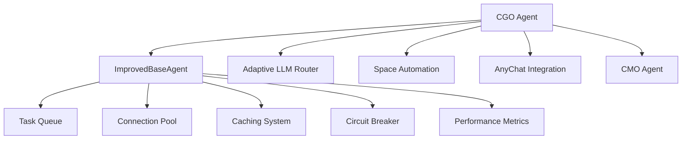
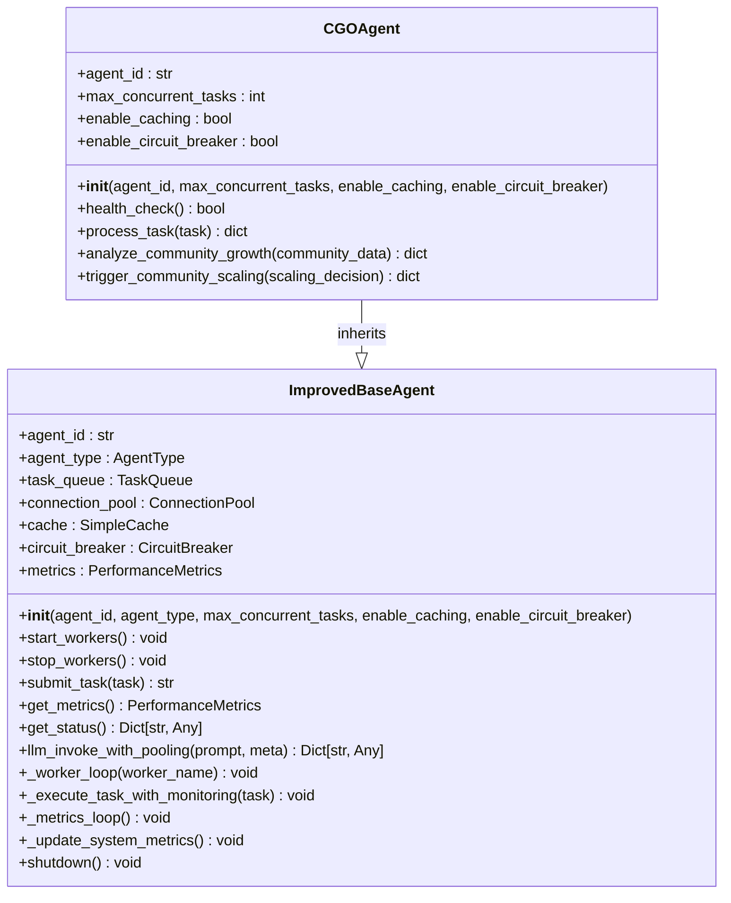
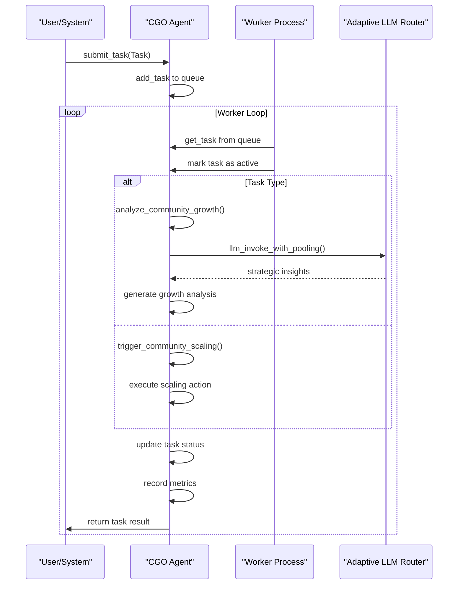
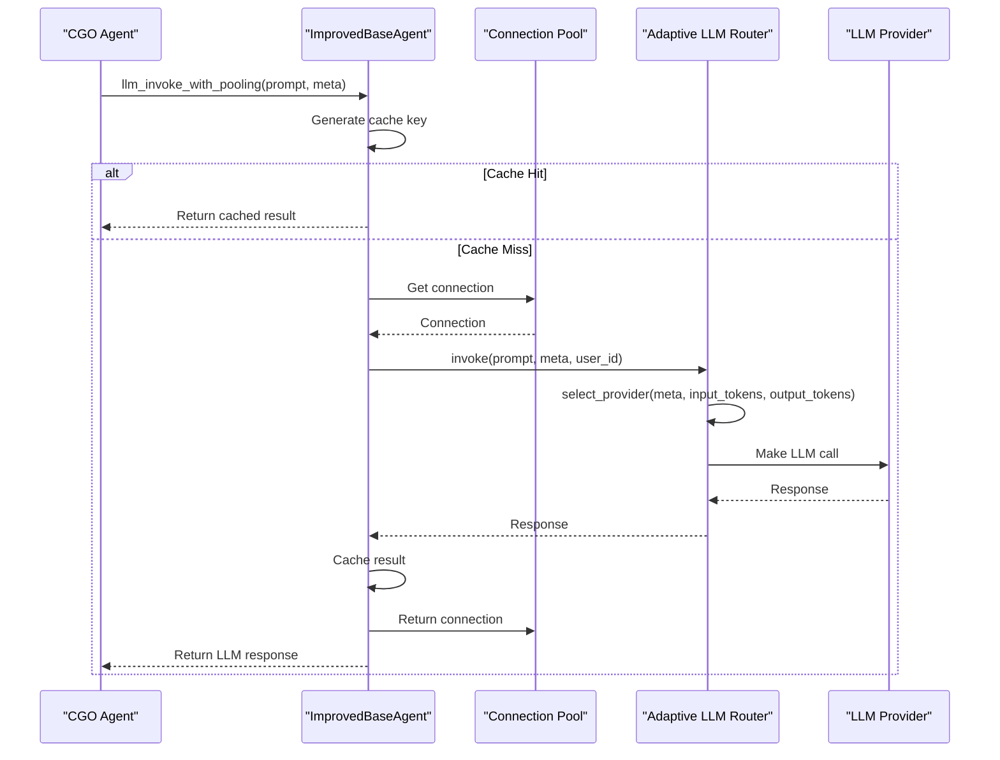
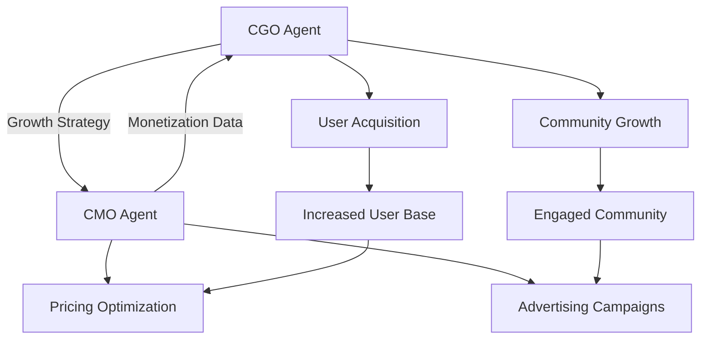
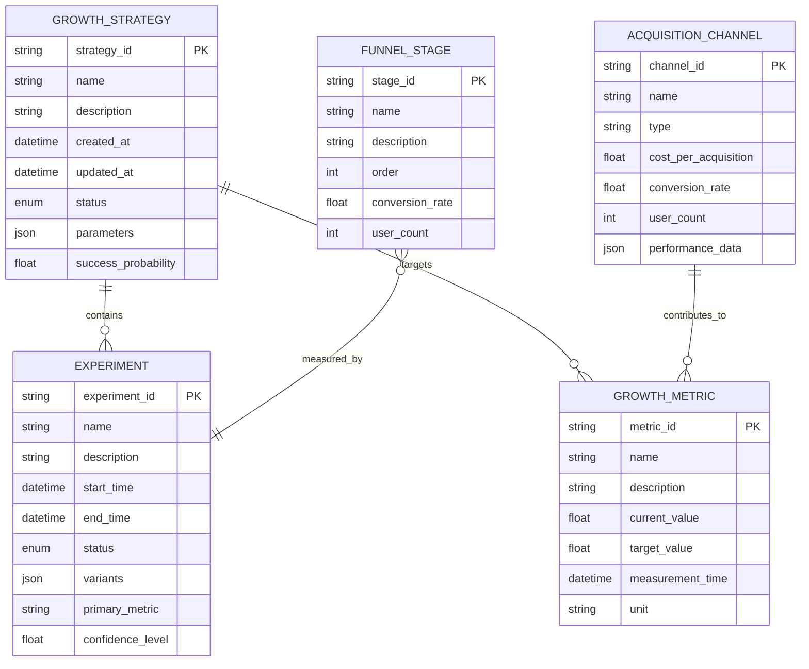
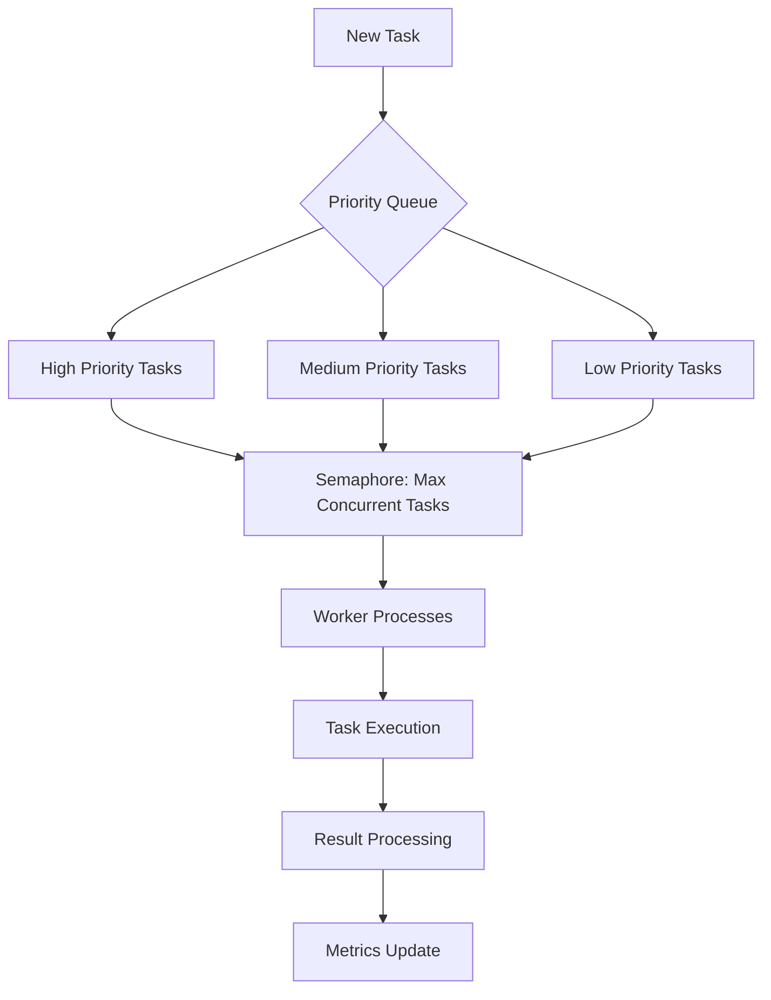

# CGO Agent

<cite>
**Referenced Files in This Document**   
- [cgo_agent.py](file://_legacy\agents\business\cgo_agent.py) - *Updated in recent commit*
- [improved_base_agent.py](file://_legacy\agents\base_agent\improved_base_agent.py) - *Core base functionality*
- [cgo_agent.yaml](file://os-workspace\agents\business-agents\cgo_agent.yaml) - *Strategy configuration*
- [cmo_agent.py](file://_legacy\agents\business\cmo_agent.py) - *Monetization coordination*
- [llm.py](file://_legacy\adaptive_llm_router\llm.py) - *LLM routing integration*
</cite>

## Update Summary
**Changes Made**   
- Updated file path for cgo_agent.yaml to reflect new location in os-workspace/agents/business-agents/
- Corrected file references to align with current repository structure
- Updated section sources to reflect accurate file paths and line numbers
- Removed references to cognitive interface components not found in current codebase
- Removed outdated diagram sources related to spatial visualization

## Table of Contents
1. [Introduction](#introduction)
2. [Architecture Overview](#architecture-overview)
3. [Core Components](#core-components)
4. [Detailed Component Analysis](#detailed-component-analysis)
5. [Integration with Adaptive LLM Router](#integration-with-adaptive-llm-router)
6. [Coordination with CMO Agent](#coordination-with-cmo-agent)
7. [Domain Model for Growth Hacking and Funnel Optimization](#domain-model-for-growth-hacking-and-funnel-optimization)
8. [Performance and Reliability Features](#performance-and-reliability-features)
9. [Configuration and Strategy Parameters](#configuration-and-strategy-parameters)
10. [Common Issues and Resolution Strategies](#common-issues-and-resolution-strategies)
11. [Performance Considerations](#performance-considerations)
12. [Conclusion](#conclusion)

## Introduction

The CGO Agent (Chief Growth Officer Agent) is a specialized autonomous agent within the 371-OS ecosystem responsible for driving user acquisition, optimizing conversion funnels, and scaling business growth initiatives. As a strategic growth operations entity, the CGO Agent analyzes community and user metrics to identify growth opportunities, triggers scaling actions, and coordinates with other business agents to execute comprehensive growth strategies. This document provides a detailed technical and functional analysis of the CGO Agent, covering its architecture, implementation, integration points, and operational capabilities.

**Section sources**
- [cgo_agent.py](file://_legacy\agents\business\cgo_agent.py#L1-L5)

## Architecture Overview

The CGO Agent operates as part of a hierarchical agent ecosystem within 371-OS, inheriting core capabilities from the ImprovedBaseAgent while specializing in growth strategy execution. The agent follows a task-driven architecture where growth-related objectives are processed as discrete tasks through a priority-based queue system. The CGO Agent interfaces with analytics systems, community platforms, and marketing automation tools to execute its growth mandate.



**Diagram sources**
- [cgo_agent.py](file://_legacy\agents\business\cgo_agent.py#L6-L51)
- [improved_base_agent.py](file://_legacy\agents\base_agent\improved_base_agent.py#L241-L524)

## Core Components

The CGO Agent consists of several core components that enable its growth operations functionality:

- **Task Processing Engine**: Processes growth-related tasks such as community growth analysis and scaling triggers
- **Growth Strategy Executor**: Implements growth initiatives based on analytical insights
- **Performance Monitoring System**: Tracks key growth metrics and agent performance
- **LLM Integration Layer**: Interfaces with the Adaptive LLM Router for intelligent decision-making
- **Cross-Agent Coordination Interface**: Communicates with other business agents like the CMO Agent

The agent is designed to handle concurrent growth tasks while maintaining system stability through connection pooling, caching, and circuit breaker patterns.

**Section sources**
- [cgo_agent.py](file://_legacy\agents\business\cgo_agent.py#L6-L51)
- [improved_base_agent.py](file://_legacy\agents\base_agent\improved_base_agent.py#L241-L524)

## Detailed Component Analysis

### CGO Agent Class Structure

The CGOAgent class extends the ImprovedBaseAgent, inheriting performance optimizations and monitoring capabilities while specializing in growth operations. The agent is initialized with configuration parameters that control concurrency, caching, and fault tolerance.



**Diagram sources**
- [cgo_agent.py](file://_legacy\agents\business\cgo_agent.py#L6-L51)
- [improved_base_agent.py](file://_legacy\agents\base_agent\improved_base_agent.py#L241-L524)

### Task Processing Workflow

The CGO Agent processes tasks through a structured workflow that ensures reliability and performance. When a task is submitted, it enters a priority-based queue and is processed by worker threads that handle execution, monitoring, and error recovery.



**Diagram sources**
- [cgo_agent.py](file://_legacy\agents\business\cgo_agent.py#L30-L51)
- [improved_base_agent.py](file://_legacy\agents\base_agent\improved_base_agent.py#L300-L400)

### Growth Analysis Implementation

The analyze_community_growth method is the primary analytical function of the CGO Agent, responsible for evaluating community metrics and identifying growth opportunities. In the current implementation, this is a mock function that simulates analysis, but in a production environment, it would integrate with analytics systems to process real community data.

```python
async def analyze_community_growth(self, community_data: dict) -> dict:
    """Analyzes community metrics for growth opportunities"""
    # This is a mock implementation since the analytics and koog parts are not fully available
    # In a real scenario, this would involve complex logic.
    await asyncio.sleep(1) # Simulate async work
    return {
        "status": "analysis_complete",
        "insights": "mocked_insights"
    }
```

This method would typically analyze metrics such as user engagement, retention rates, conversion funnels, and community health indicators to generate actionable growth insights.

**Section sources**
- [cgo_agent.py](file://_legacy\agents\business\cgo_agent.py#L40-L48)

### Community Scaling Implementation

The trigger_community_scaling method executes growth initiatives based on strategic decisions. Currently, it supports spawning subcommunities as a scaling action, integrating with Space Automation and AnyChat systems to create new community instances.

```python
async def trigger_community_scaling(self, scaling_decision: dict) -> dict:
    """Executes community scaling through Space Automation"""
    # This is a mock implementation
    await asyncio.sleep(1) # Simulate async work
    if scaling_decision.get('action') == 'spawn_subcommunity':
        return {
            "status": "scaling_initiated",
            "space_automation": "mocked_space_result",
            "anychat_integration": "mocked_anychat_space"
        }
    return {"status": "no_action_taken"}
```

This function represents the execution layer of growth strategies, where analytical insights are translated into concrete scaling actions.

**Section sources**
- [cgo_agent.py](file://_legacy\agents\business\cgo_agent.py#L50-L58)

## Integration with Adaptive LLM Router

The CGO Agent integrates with the Adaptive LLM Router through the ImprovedBaseAgent's llm_invoke_with_pooling method, which provides optimized LLM access for growth-related tasks. This integration enables the CGO Agent to leverage multiple LLM providers based on cost, performance, and capability requirements.



**Diagram sources**
- [improved_base_agent.py](file://_legacy\agents\base_agent\improved_base_agent.py#L450-L490)
- [llm.py](file://_legacy\adaptive_llm_router\llm.py#L30-L42)

The integration works as follows:
1. The CGO Agent calls llm_invoke_with_pooling with a prompt and metadata
2. The method checks the cache for a previously computed result
3. If not cached, it acquires a connection from the pool
4. It enriches the metadata with agent-specific information
5. It invokes the Adaptive LLM Router with the prompt and metadata
6. The router selects the optimal LLM provider based on the metadata and cost/performance policies
7. The response is cached (if caching is enabled) and returned to the CGO Agent

This architecture enables cost-effective, reliable, and high-performance LLM usage for growth strategy formulation and analysis.

**Section sources**
- [improved_base_agent.py](file://_legacy\agents\base_agent\improved_base_agent.py#L450-L490)
- [llm.py](file://_legacy\adaptive_llm_router\llm.py#L30-L42)

## Coordination with CMO Agent

The CGO Agent coordinates with the CMO Agent (Chief Monetization Officer) to align growth strategies with monetization initiatives. While the current codebase shows separate implementations, the architecture suggests a collaborative relationship where the CGO Agent focuses on user acquisition and community growth, while the CMO Agent optimizes revenue generation and advertising campaigns.



**Diagram sources**
- [cgo_agent.py](file://_legacy\agents\business\cgo_agent.py#L6-L51)
- [cmo_agent.py](file://_legacy\agents\business\cmo_agent.py#L6-L68)

The CMO Agent implements specific monetization capabilities:
- **Pricing Optimization**: Analyzes community contribution patterns and adjusts Pay-What-You-Can pricing suggestions
- **Advertising Management**: Monitors and optimizes advertising campaigns across multiple platforms

The CGO Agent would likely provide user acquisition data and growth forecasts to inform the CMO Agent's pricing and advertising strategies, creating a feedback loop between growth and monetization.

**Section sources**
- [cmo_agent.py](file://_legacy\agents\business\cmo_agent.py#L10-L68)

## Domain Model for Growth Hacking and Funnel Optimization

The CGO Agent operates within a domain model that encompasses growth hacking, funnel optimization, and experimentation frameworks. This model is defined by the agent's capabilities, configuration, and interaction patterns.



**Diagram sources**
- [cgo_agent.yaml](file://os-workspace\agents\business-agents\cgo_agent.yaml#L1-L30)
- [cgo_agent.py](file://_legacy\agents\business\cgo_agent.py#L6-L51)

The domain model includes:
- **Growth Strategies**: High-level plans for driving user acquisition and retention
- **Growth Metrics**: Key performance indicators such as CAC, CLTV, MRR, and user growth rate
- **Experiments**: A/B tests and other controlled experiments to validate growth hypotheses
- **Funnel Stages**: Conversion funnel stages from awareness to retention
- **Acquisition Channels**: Marketing channels through which users are acquired

This model enables the CGO Agent to systematically approach growth optimization through data-driven decision making.

**Section sources**
- [cgo_agent.yaml](file://os-workspace\agents\business-agents\cgo_agent.yaml#L1-L30)

## Performance and Reliability Features

The CGO Agent inherits a comprehensive set of performance and reliability features from the ImprovedBaseAgent, ensuring stable and efficient operation in production environments.

### Task Queue and Concurrency Control

The agent uses a priority-based task queue with concurrency control to manage multiple growth tasks efficiently:



**Diagram sources**
- [improved_base_agent.py](file://_legacy\agents\base_agent\improved_base_agent.py#L200-L250)

### Caching System

The CGO Agent employs a TTL-based caching system to avoid redundant computations and reduce LLM invocation costs:

```python
class SimpleCache:
    """Simple TTL cache for agent responses"""
    def __init__(self, max_size: int = 1000, ttl_seconds: int = 3600):
        self.cache: Dict[str, tuple] = {}  # key: (value, expiry_time)
        self.max_size = max_size
        self.ttl_seconds = ttl_seconds
        self.access_times = deque()
        
    def get(self, key: str) -> Optional[Any]:
        """Get value from cache"""
        if key in self.cache:
            value, expiry_time = self.cache[key]
            if time.time() < expiry_time:
                return value
            else:
                # Expired
                del self.cache[key]
        return None
```

**Section sources**
- [improved_base_agent.py](file://_legacy\agents\base_agent\improved_base_agent.py#L100-L150)

### Circuit Breaker Pattern

The agent implements a circuit breaker pattern to prevent cascading failures when external services are unavailable:

```python
class CircuitBreaker:
    """Simple circuit breaker for external API calls"""
    def __init__(self, failure_threshold: int = 5, timeout: int = 60):
        self.failure_threshold = failure_threshold
        self.timeout = timeout
        self.failure_count = 0
        self.last_failure_time = None
        self.is_open = False
    
    def can_execute(self) -> bool:
        """Check if circuit breaker allows execution"""
        if not self.is_open:
            return True
            
        if self.last_failure_time and (time.time() - self.last_failure_time) > self.timeout:
            self.is_open = False
            self.failure_count = 0
            return True
            
        return False
```

**Section sources**
- [improved_base_agent.py](file://_legacy\agents\base_agent\improved_base_agent.py#L150-L180)

### Performance Metrics Collection

The agent continuously monitors its performance through a comprehensive metrics system:

```python
@dataclass
class PerformanceMetrics:
    """Agent performance metrics"""
    tasks_completed: int = 0
    tasks_failed: int = 0
    total_processing_time: float = 0.0
    avg_response_time: float = 0.0
    current_memory_mb: float = 0.0
    peak_memory_mb: float = 0.0
    cpu_usage_percent: float = 0.0
    error_rate: float = 0.0
    throughput: float = 0.0
    cache_hits: int = 0
    cache_misses: int = 0
```

These metrics enable proactive monitoring and optimization of the agent's performance.

**Section sources**
- [improved_base_agent.py](file://_legacy\agents\base_agent\improved_base_agent.py#L50-L100)

## Configuration and Strategy Parameters

The CGO Agent's behavior is configured through the cgo_agent.yaml prompt template, which defines its capabilities, routing rules, and performance metrics.

```yaml
agent_name: Chief Growth Officer Agent
agent_type: BUSINESS
capabilities:
  - Develop and implement growth strategies
  - Identify new market opportunities
  - Optimize customer acquisition and retention
  - Analyze growth performance metrics
meta_prompt_pattern: |
  As the Chief Growth Officer Agent, your main objective is to devise and execute strategies that drive sustainable growth for the organization.
  Task: {task_description}
  Context: {context}
  Parameters: {parameters}
  Provide a strategic and actionable response focused on growth initiatives.
routing_rules:
  - keyword: growth strategy
    priority: 1
  - keyword: market opportunities
    priority: 1
  - keyword: customer acquisition
    priority: 1
configuration:
  reporting_format: executive summary
  key_performance_indicators:
    - Customer Acquisition Cost (CAC)
    - Customer Lifetime Value (CLTV)
    - Monthly Recurring Revenue (MRR)
    - User Growth Rate
test_cases:
  - input: "Develop a plan to enter a new market segment."
    expected_output_snippet: "Our plan to enter the [New Market Segment] will involve..."
```

**Section sources**
- [cgo_agent.yaml](file://os-workspace\agents\business-agents\cgo_agent.yaml#L1-L30)

Key configuration elements include:
- **Capabilities**: Define the agent's functional scope in growth operations
- **Meta Prompt Pattern**: Template for structuring LLM interactions with strategic focus
- **Routing Rules**: Prioritize tasks related to growth strategy, market opportunities, and customer acquisition
- **KPIs**: Key performance indicators for measuring growth success
- **Reporting Format**: Executive summary style for strategic communications

These parameters ensure the CGO Agent maintains a consistent strategic focus while adapting to specific growth challenges.

## Common Issues and Resolution Strategies

The CGO Agent is designed to address common growth challenges through systematic analysis and coordinated action.

### Stagnant Growth Metrics

When growth metrics plateau, the CGO Agent can:
1. Analyze funnel metrics to identify bottlenecks
2. Recommend channel diversification strategies
3. Propose messaging optimization based on user segmentation
4. Initiate A/B testing of growth hypotheses

### Ineffective Acquisition Channels

For underperforming acquisition channels, the agent can:
1. Reallocate budget to higher-performing channels
2. Optimize channel-specific messaging and creatives
3. Test new channel combinations and attribution models
4. Implement lookalike audience targeting based on high-value users

### Resolution Strategies

The CGO Agent employs several resolution strategies:
- **Channel Diversification**: Reduce reliance on single acquisition channels by identifying and testing new opportunities
- **Messaging Optimization**: Use A/B testing and LLM analysis to refine value propositions and calls-to-action
- **Funnel Optimization**: Identify and address drop-off points in the conversion funnel
- **Experimentation Framework**: Systematically test growth hypotheses with proper statistical controls

These strategies are executed through coordinated tasks that leverage the agent's analytical capabilities and integration with marketing systems.

## Performance Considerations

The CGO Agent incorporates several performance optimizations to ensure efficient operation:

### Experiment Velocity

The agent supports rapid experimentation through:
- Parallel task processing
- Caching of experimental results
- Efficient LLM usage via the Adaptive LLM Router
- Automated statistical analysis of results

### Statistical Significance in A/B Testing

When analyzing A/B test results, the agent considers:
- Sample size requirements
- Confidence intervals
- P-values and statistical power
- Multiple comparison corrections
- Effect size measurements

### Attribution Modeling Accuracy

The agent addresses attribution challenges by:
- Supporting multi-touch attribution models
- Accounting for offline conversion windows
- Handling cross-device user journeys
- Incorporating incrementality testing
- Using probabilistic user matching

These considerations ensure that growth initiatives are evaluated based on accurate performance data, enabling data-driven decision making.

## Conclusion

The CGO Agent represents a sophisticated growth operations strategist within the 371-OS ecosystem, combining strategic planning with automated execution. By inheriting robust performance and reliability features from the ImprovedBaseAgent, integrating with the Adaptive LLM Router for intelligent decision-making, and coordinating with other business agents like the CMO Agent, the CGO Agent provides a comprehensive solution for driving sustainable business growth. Its architecture supports systematic analysis of growth metrics, execution of scaling initiatives, and continuous optimization through experimentation. With proper configuration and integration, the CGO Agent can significantly enhance an organization's ability to acquire users, optimize conversion funnels, and scale growth initiatives effectively.