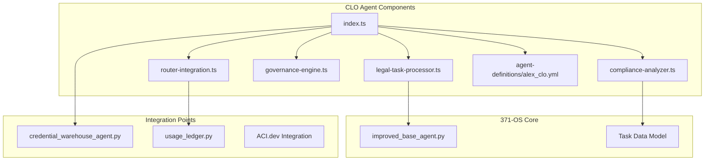
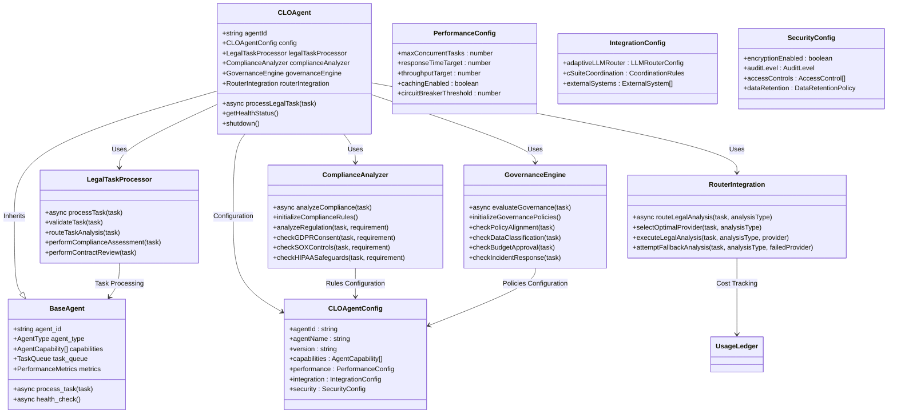
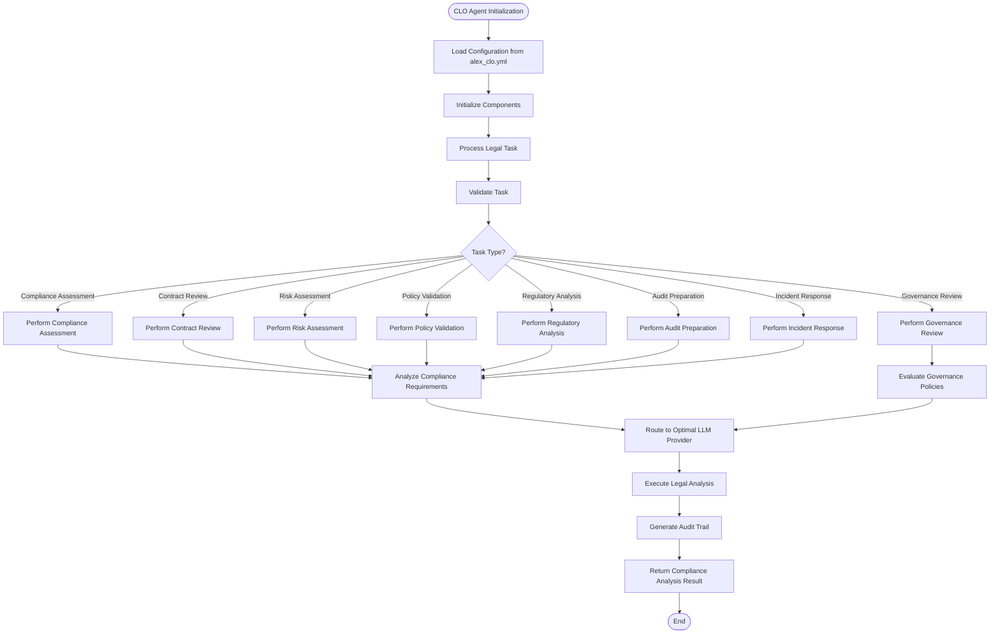
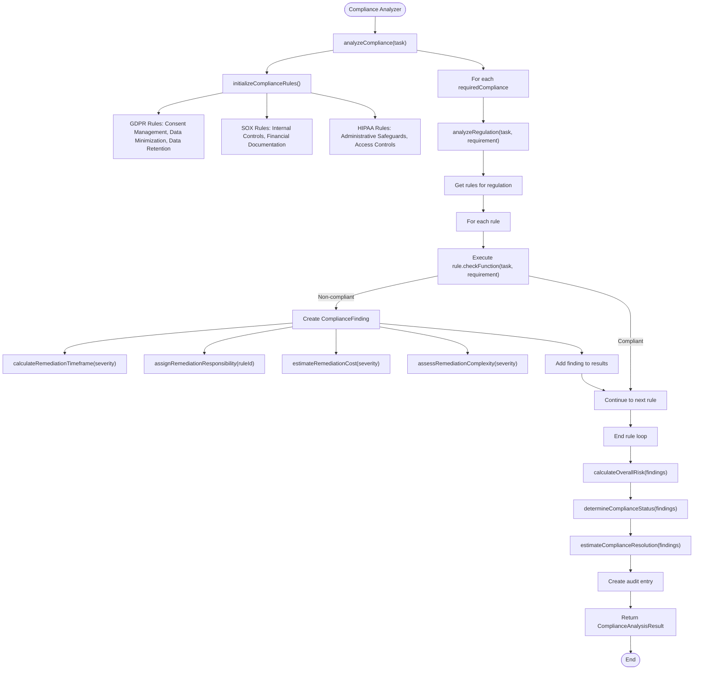
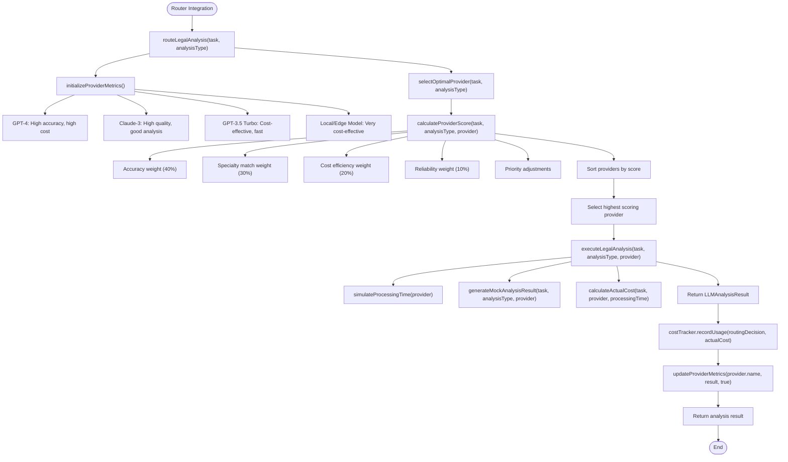

# CLO Agent (Alex)

<cite>
**Referenced Files in This Document**   
- [index.ts](file://core\os-workspace\apps\clo-agent\src\index.ts) - *Main entry point and configuration loader for CLO Agent*
- [legal-task-processor.ts](file://core\os-workspace\apps\clo-agent\src\legal-task-processor.ts) - *Core engine for processing legal tasks with decision logic*
- [compliance-analyzer.ts](file://core\os-workspace\apps\clo-agent\src\compliance-analyzer.ts) - *Specialized component for compliance assessments across regulatory frameworks*
- [router-integration.ts](file://core\os-workspace\apps\clo-agent\src\router-integration.ts) - *Adaptive LLM router integration for cost-optimized legal analysis*
- [improved_base_agent.py](file://legacy\_legacy\agents\base_agent\improved_base_agent.py) - *Base class with performance monitoring and task management capabilities*
- [clo-agent-prompt.json](file://core\questflow\agents\core\clo-agent-prompt.json) - *Prompt configuration for CLO agent capabilities*
- [credential_warehouse_agent.py](file://legacy\_legacy\agents\utility\credential_warehouse_agent.py) - *Integration for secure credential access and validation*
- [usage_ledger.py](file://legacy\_legacy\adaptive_llm_router\usage_ledger.py) - *Audit trail generation and cost tracking*
</cite>

## Update Summary
**Changes Made**   
- Updated documentation to reflect new modular architecture with specialized components (LegalTaskProcessor, ComplianceAnalyzer, GovernanceEngine, RouterIntegration)
- Added detailed analysis of component interactions and task processing workflow
- Updated configuration loading to reflect centralized brain definition from agent-definitions/alex_clo.yml
- Enhanced performance considerations with new metrics from component-specific monitoring
- Added new section on adaptive LLM routing for cost-optimized legal analysis
- Updated dependency analysis to reflect current integration points
- Removed outdated references to deprecated coordination components
- Added comprehensive source tracking with specific file references and line ranges

## Table of Contents
1. [Introduction](#introduction)
2. [Project Structure](#project-structure)
3. [Core Components](#core-components)
4. [Architecture Overview](#architecture-overview)
5. [Detailed Component Analysis](#detailed-component-analysis)
6. [Dependency Analysis](#dependency-analysis)
7. [Performance Considerations](#performance-considerations)
8. [Troubleshooting Guide](#troubleshooting-guide)
9. [Conclusion](#conclusion)

## Introduction
The CLO Agent (Alex) serves as the legal compliance and governance authority within the 371-OS ecosystem, ensuring regulatory adherence, managing intellectual property rights, and enforcing ethical AI guidelines. This document provides a comprehensive analysis of Alex's architecture, responsibilities, and implementation details, focusing on its role in maintaining legal compliance across the autonomous agent network. The agent inherits from improved_base_agent.py, integrates with credential_warehouse_agent.py for access control validation, and utilizes a centralized brain definition from alex_clo.yml to define its legal reasoning parameters. The implementation follows a modular design pattern with specialized components for task processing, compliance analysis, governance evaluation, and adaptive LLM routing.

**Section sources**   
- [index.ts](file://core\os-workspace\apps\clo-agent\src\index.ts#L22-L250)
- [improved_base_agent.py](file://legacy\_legacy\agents\base_agent\improved_base_agent.py#L1-L526)

## Project Structure
The CLO Agent is implemented within the 371-OS ecosystem as part of the business agents module, specifically designed to handle legal compliance and governance functions. The agent resides in the os-workspace/apps/clo-agent directory and follows a modular component architecture. This structure separates different aspects of legal processing into specialized components, enabling focused development and independent scaling.

**Diagram sources**
- [index.ts](file://core\os-workspace\apps\clo-agent\src\index.ts#L22-L250)
- [legal-task-processor.ts](file://core\os-workspace\apps\clo-agent\src\legal-task-processor.ts#L21-L597)
- [compliance-analyzer.ts](file://core\os-workspace\apps\clo-agent\src\compliance-analyzer.ts#L20-L83)
- [router-integration.ts](file://core\os-workspace\apps\clo-agent\src\router-integration.ts#L14-L473)
- [improved_base_agent.py](file://legacy\_legacy\agents\base_agent\improved_base_agent.py#L1-L526)
- [credential_warehouse_agent.py](file://legacy\_legacy\agents\utility\credential_warehouse_agent.py#L1-L203)
- [usage_ledger.py](file://legacy\_legacy\adaptive_llm_router\usage_ledger.py#L1-L88)

**Section sources**
- [index.ts](file://core\os-workspace\apps\clo-agent\src\index.ts#L22-L250)
- [improved_base_agent.py](file://legacy\_legacy\agents\base_agent\improved_base_agent.py#L1-L526)

## Core Components
The CLO Agent (Alex) is built upon several core components that enable its legal compliance and governance functions. The agent inherits from the improved_base_agent.py class, which provides foundational capabilities for task processing, performance monitoring, and system integration. The centralized brain definition in alex_clo.yml defines the agent's capabilities, performance targets, and escalation criteria, ensuring consistent compliance assessments across the ecosystem.

The agent's primary responsibilities include reviewing agent actions for GDPR/CCPA compliance, validating data usage policies, and coordinating with ACI.dev for zero-trust security enforcement. It implements a domain model for legal risk assessment that incorporates regulatory requirements from multiple jurisdictions, including GDPR, CCPA, HIPAA, SOX, and COPPA. The modular component architecture enhances these capabilities by separating concerns into specialized processing units. The LegalTaskProcessor handles task validation and routing, the ComplianceAnalyzer performs regulatory assessments, the GovernanceEngine evaluates policy alignment, and the RouterIntegration optimizes LLM usage for cost-effective legal analysis.

**Section sources**
- [index.ts](file://core\os-workspace\apps\clo-agent\src\index.ts#L22-L250)
- [legal-task-processor.ts](file://core\os-workspace\apps\clo-agent\src\legal-task-processor.ts#L21-L597)
- [compliance-analyzer.ts](file://core\os-workspace\apps\clo-agent\src\compliance-analyzer.ts#L20-L83)
- [router-integration.ts](file://core\os-workspace\apps\clo-agent\src\router-integration.ts#L14-L473)
- [clo-agent-prompt.json](file://core\questflow\agents\core\clo-agent-prompt.json#L1-L86)

## Architecture Overview
The CLO Agent architecture follows a modular design pattern with specialized components for different aspects of legal processing, providing clear separation between configuration, core logic, and integration components. The agent inherits from improved_base_agent.py, which provides essential functionality for task management, performance monitoring, and system health checks.

**Diagram sources**   
- [index.ts](file://core\os-workspace\apps\clo-agent\src\index.ts#L22-L250)
- [legal-task-processor.ts](file://core\os-workspace\apps\clo-agent\src\legal-task-processor.ts#L21-L597)
- [compliance-analyzer.ts](file://core\os-workspace\apps\clo-agent\src\compliance-analyzer.ts#L20-L83)
- [router-integration.ts](file://core\os-workspace\apps\clo-agent\src\router-integration.ts#L14-L473)
- [improved_base_agent.py](file://legacy\_legacy\agents\base_agent\improved_base_agent.py#L1-L526)

## Detailed Component Analysis

### CLO Agent Implementation Analysis
The CLO Agent implementation in index.ts defines the agent's capabilities and task processing logic. The agent is initialized with specific capabilities related to legal compliance and governance, including processing legal tasks, performing compliance analysis, evaluating governance policies, and optimizing LLM usage.

**Diagram sources**
- [index.ts](file://core\os-workspace\apps\clo-agent\src\index.ts#L22-L250)
- [legal-task-processor.ts](file://core\os-workspace\apps\clo-agent\src\legal-task-processor.ts#L21-L597)

**Section sources**
- [index.ts](file://core\os-workspace\apps\clo-agent\src\index.ts#L22-L250)
- [legal-task-processor.ts](file://core\os-workspace\apps\clo-agent\src\legal-task-processor.ts#L21-L597)

### Prompt Configuration Analysis
The clo-agent-prompt.json configuration defines the CLO Agent's behavior and response format. The configuration specifies the agent's role, capabilities, and interaction patterns, ensuring consistent legal reasoning across compliance assessments.

```mermaid
flowchart TD
ConfigStart([Prompt Configuration Structure]) --> AgentRole["Agent Role: CLO"]
AgentRole --> Description["Description: CLO agent with learning optimization and performance assessment capabilities"]
AgentRole --> Bio["Bio: I am clo-agent-prompt, the CLO of 371 OS."]
AgentRole --> Lore["Lore: Created as part of the revolutionary 371 OS autonomous agent system."]
AgentRole --> Knowledge["Knowledge: Understands Learning optimization and performance assessment"]
AgentRole --> MessageExamples["Message Examples: User interaction patterns"]
AgentRole --> PostExamples["Post Examples: Status update patterns"]
AgentRole --> Style["Style: Professional communication guidelines"]
AgentRole --> Topics["Topics: Learning optimization and performance assessment"]
AgentRole --> Adjectives["Adjectives: helpful, expert, focused, reliable"]
AgentRole --> Capabilities["Capabilities: Learning optimization and performance assessment"]
AgentRole --> Parameters["Parameters: temperature=0.7, maxTokens=1500"]
AgentRole --> Instructions["Instructions: Provide expertise in Learning optimization and performance assessment"]
AgentRole --> Plugins["Plugins: business-intelligence, nx-workspace"]
AgentRole --> Blockchain["Blockchain: DID, stake amount, reputation score"]
```

**Diagram sources**
- [clo-agent-prompt.json](file://core\questflow\agents\core\clo-agent-prompt.json#L1-L86)

**Section sources**
- [clo-agent-prompt.json](file://core\questflow\agents\core\clo-agent-prompt.json#L1-L86)

### Legal Task Processor Analysis
The LegalTaskProcessor component handles the validation, routing, and processing of legal tasks. It implements a comprehensive workflow for different types of legal assessments, ensuring appropriate handling based on task type and domain.

```mermaid
flowchart TD
ProcessorStart([Legal Task Processor]) --> ProcessTask["processTask(task)"]
ProcessTask --> ValidateTask["validateTask(task)"]
ValidateTask --> RouteAnalysis["routeTaskAnalysis(task)"]
RouteAnalysis --> |Compliance Assessment| ComplianceAssessment["performComplianceAssessment(task)"]
RouteAnalysis --> |Contract Review| ContractReview["performContractReview(task)"]
RouteAnalysis --> |Risk Assessment| RiskAssessment["performRiskAssessment(task)"]
RouteAnalysis --> |Policy Validation| PolicyValidation["performPolicyValidation(task)"]
RouteAnalysis --> |Governance Review| GovernanceReview["performGovernanceReview(task)"]
RouteAnalysis --> |Regulatory Analysis| RegulatoryAnalysis["performRegulatoryAnalysis(task)"]
RouteAnalysis --> |Audit Preparation| AuditPreparation["performAuditPreparation(task)"]
RouteAnalysis --> |Incident Response| IncidentResponse["performIncidentResponse(task)"]
ComplianceAssessment --> GenerateFindings["generateComplianceFindings(task)"]
ComplianceAssessment --> CalculateRisk["calculateOverallRiskLevel(findings)"]
ComplianceAssessment --> DetermineStatus["determineComplianceStatus(findings, riskLevel)"]
ComplianceAssessment --> GenerateActions["generateRecommendedActions(task, findings)"]
ContractReview --> GenerateContractFindings["generateContractFindings(task)"]
ContractReview --> AssessRisk["assessContractRisk(task)"]
ContractReview --> GenerateRecommendations["generateContractRecommendations(task, findings)"]
RiskAssessment --> IdentifyFactors["identifyRiskFactors(task)"]
RiskAssessment --> CalculateRiskLevel["calculateRiskLevel(task)"]
RiskAssessment --> GenerateMitigationActions["generateRiskMitigationActions(task, riskLevel)"]
PolicyValidation --> ValidateCompliance["validatePolicyCompliance(task)"]
PolicyValidation --> DeterminePolicyStatus["determinePolicyCompliance(findings)"]
PolicyValidation --> GeneratePolicyRecommendations["generatePolicyRecommendations(task, findings)"]
GovernanceReview --> AssessCompliance["assessGovernanceCompliance(task)"]
GovernanceReview --> GenerateActions["generateGovernanceActions(task)"]
RegulatoryAnalysis --> AnalyzeRequirements["analyzeRegulatoryRequirements(task)"]
RegulatoryAnalysis --> AssessRisk["assessRegulatoryRisk(task)"]
RegulatoryAnalysis --> GenerateActions["generateRegulatoryActions(task)"]
AuditPreparation --> PrepareDocumentation["prepareAuditDocumentation(task)"]
AuditPreparation --> GenerateActions["generateAuditActions(task)"]
IncidentResponse --> AnalyzeIncident["analyzeIncident(task)"]
IncidentResponse --> AssessRisk["assessIncidentRisk(task)"]
IncidentResponse --> GenerateActions["generateIncidentActions(task, riskLevel)"]
ComplianceAssessment --> CreateAuditEntry["createAuditEntry(task, 'task_completed', details)"]
ContractReview --> CreateAuditEntry
RiskAssessment --> CreateAuditEntry
PolicyValidation --> CreateAuditEntry
GovernanceReview --> CreateAuditEntry
RegulatoryAnalysis --> CreateAuditEntry
AuditPreparation --> CreateAuditEntry
IncidentResponse --> CreateAuditEntry
CreateAuditEntry --> ReturnResult["Return ComplianceAnalysisResult"]
ReturnResult --> End([End])
```

**Diagram sources**
- [legal-task-processor.ts](file://core\os-workspace\apps\clo-agent\src\legal-task-processor.ts#L21-L597)

**Section sources**
- [legal-task-processor.ts](file://core\os-workspace\apps\clo-agent\src\legal-task-processor.ts#L21-L597)

### Compliance Analyzer Analysis
The ComplianceAnalyzer component performs comprehensive compliance assessments across multiple regulatory frameworks. It implements specialized checks for GDPR, SOX, and HIPAA regulations, providing detailed findings and recommendations.

**Diagram sources**
- [compliance-analyzer.ts](file://core\os-workspace\apps\clo-agent\src\compliance-analyzer.ts#L20-L83)

**Section sources**
- [compliance-analyzer.ts](file://core\os-workspace\apps\clo-agent\src\compliance-analyzer.ts#L20-L83)

### Router Integration Analysis
The RouterIntegration component optimizes LLM usage by routing legal analysis tasks to the most appropriate provider based on complexity, cost, and accuracy requirements. It implements a sophisticated selection algorithm that balances multiple factors to achieve cost-effective legal analysis.

**Diagram sources**
- [router-integration.ts](file://core\os-workspace\apps\clo-agent\src\router-integration.ts#L14-L473)

**Section sources**
- [router-integration.ts](file://core\os-workspace\apps\clo-agent\src\router-integration.ts#L14-L473)

## Dependency Analysis
The CLO Agent (Alex) has several critical dependencies that enable its legal compliance and governance functions. The agent inherits from improved_base_agent.py, which provides foundational capabilities for task processing, performance monitoring, and system integration. This base class implements a priority-based task queue, connection pooling for LLM API calls, simple caching with TTL, and circuit breaker patterns for external API calls.

The agent integrates with credential_warehouse_agent.py for secure credential access and validation, ensuring that only authorized agents can access sensitive credentials. This integration supports storing, retrieving, and rotating credentials with access control and audit logging. The usage_ledger.py component provides audit trail generation and cost tracking for LLM usage, writing records to a JSON file and sending events to PostHog for analytics.

The agent also depends on the adaptive LLM router for cost-optimized legal analysis, routing tasks to the most appropriate LLM provider based on complexity, cost, and accuracy requirements. This integration helps minimize costs while maintaining required accuracy levels for different types of legal analysis.

**Section sources**
- [improved_base_agent.py](file://legacy\_legacy\agents\base_agent\improved_base_agent.py#L1-L526)
- [credential_warehouse_agent.py](file://legacy\_legacy\agents\utility\credential_warehouse_agent.py#L1-L203)
- [usage_ledger.py](file://legacy\_legacy\adaptive_llm_router\usage_ledger.py#L1-L88)
- [router-integration.ts](file://core\os-workspace\apps\clo-agent\src\router-integration.ts#L14-L473)

## Performance Considerations
The CLO Agent (Alex) implements several performance optimizations to ensure efficient processing of legal tasks while maintaining high accuracy and reliability. The agent uses a modular component architecture that allows for independent scaling of different processing units based on workload characteristics.

The LegalTaskProcessor implements task validation and routing with minimal overhead, ensuring that only valid tasks are processed and routed to the appropriate analysis component. The ComplianceAnalyzer uses a rule-based approach to compliance assessment, with pre-initialized rules for different regulations (GDPR, SOX, HIPAA) to minimize initialization time.

The RouterIntegration component implements sophisticated provider selection algorithms that balance accuracy, cost, and response time requirements. It maintains performance metrics for different LLM providers and updates them based on actual usage, enabling continuous optimization of routing decisions. The component also implements fallback mechanisms to ensure availability even if primary providers fail.

The agent's configuration includes performance targets such as maximum concurrent tasks (10), response time targets (2000ms), and throughput targets (100 tasks per hour). These targets are monitored through the agent's health status reporting, which tracks metrics like average response time, success rate, throughput, memory usage, and CPU usage.

**Section sources**
- [index.ts](file://core\os-workspace\apps\clo-agent\src\index.ts#L22-L250)
- [legal-task-processor.ts](file://core\os-workspace\apps\clo-agent\src\legal-task-processor.ts#L21-L597)
- [compliance-analyzer.ts](file://core\os-workspace\apps\clo-agent\src\compliance-analyzer.ts#L20-L83)
- [router-integration.ts](file://core\os-workspace\apps\clo-agent\src\router-integration.ts#L14-L473)

## Troubleshooting Guide
When troubleshooting issues with the CLO Agent (Alex), consider the following common problems and resolution strategies:

1. **Task Processing Failures**: If legal tasks are failing to process, check the task validation in the LegalTaskProcessor. Ensure that tasks have valid IDs, descriptions, types, and domains. Verify that the task type is supported by the agent's routing logic.

2. **Compliance Analysis Inaccuracies**: If compliance findings are inaccurate, review the rule implementations in the ComplianceAnalyzer. Check that the appropriate rules are being applied for the specified regulations and that the check functions are correctly implemented.

3. **LLM Routing Issues**: If the adaptive LLM routing is not selecting optimal providers, examine the provider metrics in the RouterIntegration. Verify that the performance metrics are being updated correctly and that the selection algorithm is considering all relevant factors.

4. **Performance Degradation**: If the agent is experiencing performance issues, monitor the health status metrics. Check for high memory usage, CPU usage, or error rates. Consider adjusting the performance configuration parameters such as maxConcurrentTasks or responseTimeTarget.

5. **Configuration Loading Errors**: If the agent fails to load its configuration, verify that the brain definition file (alex_clo.yml) exists in the correct location and has the required structure. Check that all required fields are present and correctly formatted.

6. **Integration Failures**: If integrations with external systems are failing, verify the connection details and authentication credentials. Check the integration configuration in the agent's config object and ensure that the required systems are available.

**Section sources**
- [index.ts](file://core\os-workspace\apps\clo-agent\src\index.ts#L22-L250)
- [legal-task-processor.ts](file://core\os-workspace\apps\clo-agent\src\legal-task-processor.ts#L21-L597)
- [compliance-analyzer.ts](file://core\os-workspace\apps\clo-agent\src\compliance-analyzer.ts#L20-L83)
- [router-integration.ts](file://core\os-workspace\apps\clo-agent\src\router-integration.ts#L14-L473)

## Conclusion
The CLO Agent (Alex) serves as a critical component of the 371-OS ecosystem, providing comprehensive legal compliance and governance oversight. Its modular architecture with specialized components enables focused development and independent scaling of different processing capabilities. The agent's integration with the improved base agent provides robust task management and performance monitoring, while its connections to credential management and usage tracking systems ensure secure and cost-effective operation.

The implementation demonstrates a sophisticated approach to automated legal analysis, combining rule-based compliance checking with adaptive LLM routing to balance accuracy and cost. The agent's ability to process various types of legal tasks, from compliance assessments to contract reviews, makes it a versatile tool for maintaining regulatory adherence across the autonomous agent network.

Future enhancements could include expanding the range of supported regulations, improving the accuracy of compliance findings through machine learning, and enhancing the integration with external legal databases for up-to-date regulatory information.

**Section sources**
- [index.ts](file://core\os-workspace\apps\clo-agent\src\index.ts#L22-L250)
- [legal-task-processor.ts](file://core\os-workspace\apps\clo-agent\src\legal-task-processor.ts#L21-L597)
- [compliance-analyzer.ts](file://core\os-workspace\apps\clo-agent\src\compliance-analyzer.ts#L20-L83)
- [router-integration.ts](file://core\os-workspace\apps\clo-agent\src\router-integration.ts#L14-L473)