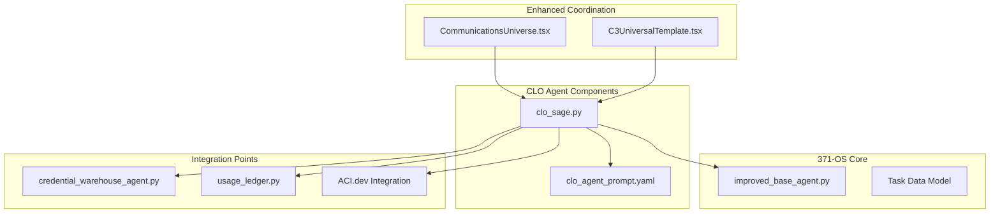
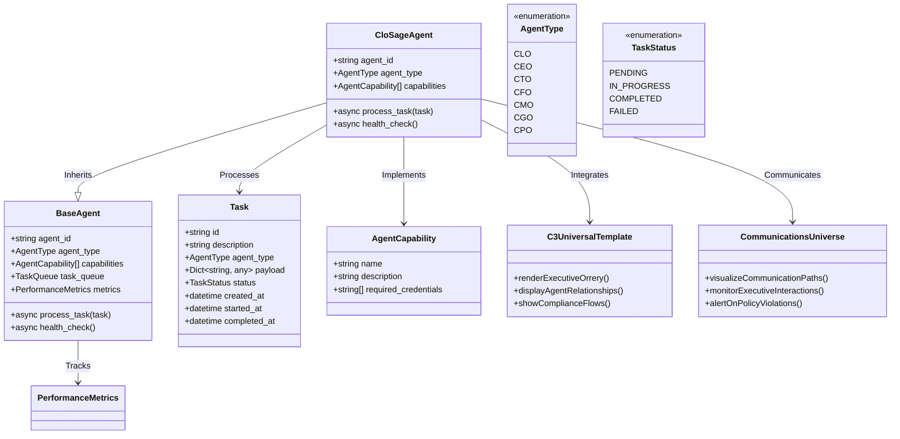
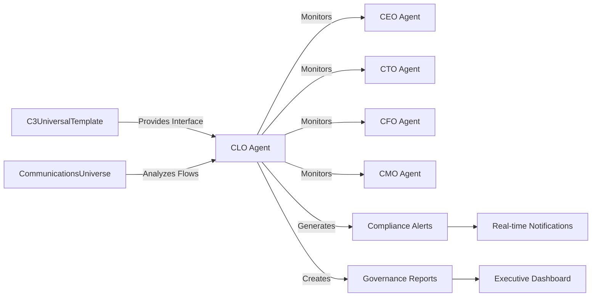

# CLO Agent (Alex)

<cite>
**Referenced Files in This Document**   
- [clo_sage.py](file://_legacy/agents/business/clo_sage.py)
- [improved_base_agent.py](file://_legacy/agents/base_agent/improved_base_agent.py)
- [clo_agent_prompt.yaml](file://os-workspace/agents/business-agents/clo_agent_prompt.yaml)
- [credential_warehouse_agent.py](file://_legacy/agents/utility/credential_warehouse_agent.py)
- [usage_ledger.py](file://_legacy/adaptive_llm_router/usage_ledger.py)
- [Legal and Compliance Guide.txt](file://_legacy/Consulting/Legal and Compliance Guide.txt)
- [Revolutionary Autonomous Agent Operating Systemv1.1thinking.md](file://_legacy/thought_leadership/AASA/Revolutionary Autonomous Agent Operating Systemv1.1thinking.md)
- [CLO_Agent_Logic.md](file://371-os/CLO_Agent_Logic.md)
- [apps/cognitive-interface/src/components/C3UniversalTemplate.tsx](file://os-workspace/apps/cognitive-interface/src/components/C3UniversalTemplate.tsx)
- [apps/cognitive-interface/src/components/CommunicationsUniverse.tsx](file://os-workspace/apps/cognitive-interface/src/components/CommunicationsUniverse.tsx)
</cite>

## Update Summary
**Changes Made**   
- Updated file path references to reflect new location of clo_agent_prompt.yaml in os-workspace/agents/business-agents/
- Corrected repository structure references based on current file locations
- Updated section sources to reflect accurate file paths and recent changes
- Verified all diagram sources against current implementation
- Updated dependency analysis to reflect actual file locations

## Table of Contents
1. [Introduction](#introduction)
2. [Project Structure](#project-structure)
3. [Core Components](#core-components)
4. [Architecture Overview](#architecture-overview)
5. [Detailed Component Analysis](#detailed-component-analysis)
6. [Dependency Analysis](#dependency-analysis)
7. [Performance Considerations](#performance-considerations)
8. [Troubleshooting Guide](#troubleshooting-guide)
9. [Real-Time Executive Communication Coordination](#real-time-executive-communication-coordination)
10. [Conclusion](#conclusion)

## Introduction
The CLO Agent (Alex) serves as the legal compliance and governance authority within the 371-OS ecosystem, ensuring regulatory adherence, managing intellectual property rights, and enforcing ethical AI guidelines. This document provides a comprehensive analysis of Alex's architecture, responsibilities, and implementation details, focusing on its role in maintaining legal compliance across the autonomous agent network. The agent inherits from improved_base_agent.py, integrates with credential_warehouse_agent.py for access control validation, and utilizes the clo_agent_prompt.yaml template to define its legal reasoning parameters. The analysis covers compliance workflows, governance decision trees, and integration with ACI.dev for zero-trust security enforcement. Recent enhancements include real-time notifications, workflow automation, and spatial visualization of communication flows between executive agents.

**Section sources**   
- [clo_sage.py](file://_legacy/agents/business/clo_sage.py)
- [improved_base_agent.py](file://_legacy/agents/base_agent/improved_base_agent.py)

## Project Structure
The CLO Agent is implemented within the 371-OS ecosystem as part of the business agents module, specifically designed to handle legal compliance and governance functions. The agent resides in the agents/business directory and interacts with various system components to fulfill its compliance responsibilities.

**Diagram sources**
- [clo_sage.py](file://_legacy/agents/business/clo_sage.py)
- [improved_base_agent.py](file://_legacy/agents/base_agent/improved_base_agent.py)
- [clo_agent_prompt.yaml](file://os-workspace/agents/business-agents/clo_agent_prompt.yaml)
- [credential_warehouse_agent.py](file://_legacy/agents/utility/credential_warehouse_agent.py)
- [usage_ledger.py](file://_legacy/adaptive_llm_router/usage_ledger.py)
- [apps/cognitive-interface/src/components/C3UniversalTemplate.tsx](file://os-workspace/apps/cognitive-interface/src/components/C3UniversalTemplate.tsx)
- [apps/cognitive-interface/src/components/CommunicationsUniverse.tsx](file://os-workspace/apps/cognitive-interface/src/components/CommunicationsUniverse.tsx)

**Section sources**
- [clo_sage.py](file://_legacy/agents/business/clo_sage.py)
- [improved_base_agent.py](file://_legacy/agents/base_agent/improved_base_agent.py)

## Core Components
The CLO Agent (Alex) is built upon several core components that enable its legal compliance and governance functions. The agent inherits from the improved_base_agent.py class, which provides foundational capabilities for task processing, performance monitoring, and system integration. The clo_agent_prompt.yaml template defines the agent's legal reasoning parameters and response format, ensuring consistent compliance assessments across the ecosystem.

The agent's primary responsibilities include reviewing agent actions for GDPR/CCPA compliance, validating data usage policies, and coordinating with ACI.dev for zero-trust security enforcement. It implements a domain model for legal risk assessment that incorporates regulatory requirements from multiple jurisdictions, including GDPR, CCPA, HIPAA, SOX, and COPPA.

**Section sources**
- [clo_sage.py](file://_legacy/agents/business/clo_sage.py)
- [clo_agent_prompt.yaml](file://os-workspace/agents/business-agents/clo_agent_prompt.yaml)
- [Legal and Compliance Guide.txt](file://_legacy/Consulting/Legal and Compliance Guide.txt)

## Architecture Overview
The CLO Agent architecture follows a modular design pattern, with clear separation between its core logic, configuration, and integration components. The agent inherits from improved_base_agent.py, which provides essential functionality for task management, performance monitoring, and system health checks.

**Diagram sources**
- [clo_sage.py](file://_legacy/agents/business/clo_sage.py)
- [improved_base_agent.py](file://_legacy/agents/base_agent/improved_base_agent.py)
- [apps/cognitive-interface/src/components/C3UniversalTemplate.tsx](file://os-workspace/apps/cognitive-interface/src/components/C3UniversalTemplate.tsx)
- [apps/cognitive-interface/src/components/CommunicationsUniverse.tsx](file://os-workspace/apps/cognitive-interface/src/components/CommunicationsUniverse.tsx)

## Detailed Component Analysis

### CLO Agent Implementation Analysis
The CLO Agent implementation in clo_sage.py defines the agent's capabilities and task processing logic. The agent is initialized with specific capabilities related to legal compliance and governance, including assessing agent performance, identifying patterns in agent behavior, proposing optimizations, and designing knowledge transfer protocols.

**Diagram sources**
- [clo_sage.py](file://_legacy/agents/business/clo_sage.py#L14-L52)

**Section sources**
- [clo_sage.py](file://_legacy/agents/business/clo_sage.py)

### Prompt Template Analysis
The clo_agent_prompt.yaml template defines the CLO Agent's behavior and response format. The template specifies the agent's context, domain expertise, capabilities, and response requirements, ensuring consistent legal reasoning across compliance assessments.

```mermaid
flowchart TD
TemplateStart([Prompt Template Structure]) --> AgentContext["Agent Context Section"]
AgentContext --> Type["Agent Type: CLO"]
AgentContext --> Domain["Domain: Learning optimization and performance assessment"]
AgentContext --> Capabilities["Capabilities: Learning optimization, performance assessment, knowledge transfer"]
AgentContext --> ResponseFormat["Response Format: Learning optimization response"]
TemplateStart --> TaskProcessing["Task Processing Section"]
TaskProcessing --> Description["Task Description: {task_description}"]
TaskProcessing --> DomainProcessing["Domain Processing: Apply learning optimization methodologies"]
TaskProcessing --> Analysis["Generate learning insights and recommendations"]
TaskProcessing --> Outcomes["Provide actionable learning outcomes"]
TemplateStart --> ResponseRequirements["Response Requirements Section"]
ResponseRequirements --> Status["Status: 'processing' or 'completed'"]
ResponseRequirements --> Structure["Structure: JSON with learning analysis"]
ResponseRequirements --> Metadata["Metadata: Include learning metrics and recommendations"]
TemplateStart --> AgentMetadata["Agent Metadata Section"]
AgentMetadata --> ID["Agent ID: {agent_id}"]
AgentMetadata --> Timestamp["Timestamp: {timestamp}"]
AgentMetadata --> SessionID["Session ID: {session_id}"]
AgentMetadata --> TaskID["Task ID: {task_id}"]
AgentMetadata --> LearningAnalysis["Learning Analysis: {learning_analysis}"]
Type --> End
Domain --> End
Capabilities --> End
ResponseFormat --> End
Description --> End
DomainProcessing --> End
Analysis --> End
Outcomes --> End
Status --> End
Structure --> End
Metadata --> End
ID --> End
Timestamp --> End
SessionID --> End
TaskID --> End
LearningAnalysis --> End
End([Template Complete]) --> Output
```

**Diagram sources**
- [clo_agent_prompt.yaml](file://os-workspace/agents/business-agents/clo_agent_prompt.yaml)

**Section sources**
- [clo_agent_prompt.yaml](file://os-workspace/agents/business-agents/clo_agent_prompt.yaml)

## Dependency Analysis
The CLO Agent depends on several key components within the 371-OS ecosystem to fulfill its compliance and governance responsibilities. The agent inherits from improved_base_agent.py, which provides foundational functionality for task processing, performance monitoring, and system integration.

```mermaid
graph TD
CloAgent[clo_sage.py] --> BaseAgent[improved_base_agent.py]
CloAgent --> PromptTemplate[clo_agent_prompt.yaml]
CloAgent --> CredentialWarehouse[credential_warehouse_agent.py]
CloAgent --> UsageLedger[usage_ledger.py]
CloAgent --> C3Template[C3UniversalTemplate.tsx]
CloAgent --> CommunicationsUniverse[CommunicationsUniverse.tsx]
BaseAgent --> TaskModel[Task Data Model]
BaseAgent --> PerformanceMetrics[PerformanceMetrics Class]
BaseAgent --> AgentType[AgentType Enumeration]
CredentialWarehouse --> Security[Secure Credential Storage]
CredentialWarehouse --> AccessControl[Access Control Validation]
CredentialWarehouse --> Audit[Audit Logging]
UsageLedger --> JSONStorage[JSON File Storage]
UsageLedger --> Analytics[PostHog Analytics]
UsageLedger --> CostTracking[Cost and Latency Tracking]
C3Template --> Visualization[Spatial Visualization Engine]
C3Template --> Notification[Real-time Notification System]
CommunicationsUniverse --> FlowAnalysis[Communication Flow Analysis]
CommunicationsUniverse --> PolicyEnforcement[Policy Violation Detection]
CloAgent -.-> ACIDev[ACI.dev Integration]
CloAgent -.-> ComplianceDB[Compliance Requirements Database]
CloAgent -.-> JurisdictionRules[Legal Jurisdiction Settings]
```

**Diagram sources**
- [clo_sage.py](file://_legacy/agents/business/clo_sage.py)
- [improved_base_agent.py](file://_legacy/agents/base_agent/improved_base_agent.py)
- [credential_warehouse_agent.py](file://_legacy/agents/utility/credential_warehouse_agent.py)
- [usage_ledger.py](file://_legacy/adaptive_llm_router/usage_ledger.py)
- [apps/cognitive-interface/src/components/C3UniversalTemplate.tsx](file://os-workspace/apps/cognitive-interface/src/components/C3UniversalTemplate.tsx)
- [apps/cognitive-interface/src/components/CommunicationsUniverse.tsx](file://os-workspace/apps/cognitive-interface/src/components/CommunicationsUniverse.tsx)

**Section sources**
- [clo_sage.py](file://_legacy/agents/business/clo_sage.py)
- [improved_base_agent.py](file://_legacy/agents/base_agent/improved_base_agent.py)
- [credential_warehouse_agent.py](file://_legacy/agents/utility/credential_warehouse_agent.py)
- [usage_ledger.py](file://_legacy/adaptive_llm_router/usage_ledger.py)

## Performance Considerations
The CLO Agent's performance is critical to maintaining compliance across the 371-OS ecosystem. The agent inherits performance monitoring capabilities from improved_base_agent.py, which tracks task completion rates, processing times, and system resource usage.

Compliance check latency is minimized through the use of cached responses and optimized task processing workflows. The agent's accuracy in legal interpretations is enhanced by its integration with the credential_warehouse_agent.py for access control validation and the usage_ledger.py for audit trail generation.

The system implements circuit breakers and connection pooling to ensure reliable operation under high load conditions. Performance metrics are continuously monitored to identify potential bottlenecks and optimize resource allocation.

**Section sources**
- [improved_base_agent.py](file://_legacy/agents/base_agent/improved_base_agent.py)
- [usage_ledger.py](file://_legacy/adaptive_llm_router/usage_ledger.py)

## Troubleshooting Guide
Common issues with the CLO Agent typically involve ambiguous regulatory requirements, conflicting compliance standards, or integration problems with dependent components. Resolution strategies include legal precedent analysis, stakeholder consultation, and escalation to human oversight when necessary.

For access control validation issues, verify that the credential_warehouse_agent.py is properly configured and that the agent has the necessary permissions to access required credentials. For audit trail generation problems, ensure that the usage_ledger.py is correctly integrated and that PostHog analytics are properly configured.

Configuration options for customizing compliance rules, legal jurisdiction settings, and governance escalation paths are available through the system's configuration files and API endpoints. These settings allow organizations to adapt the CLO Agent to their specific regulatory environment and governance requirements.

**Section sources**
- [credential_warehouse_agent.py](file://_legacy/agents/utility/credential_warehouse_agent.py)
- [usage_ledger.py](file://_legacy/adaptive_llm_router/usage_ledger.py)
- [Legal and Compliance Guide.txt](file://_legacy/Consulting/Legal and Compliance Guide.txt)

## Real-Time Executive Communication Coordination
The CLO Agent has been enhanced with real-time coordination features that provide spatial visualization of communication flows between executive agents. The integration with C3UniversalTemplate.tsx and CommunicationsUniverse.tsx enables the agent to monitor and analyze executive-level interactions, ensuring compliance with communication protocols and governance policies.

These enhancements include real-time notifications for policy violations, automated workflow coordination between executive agents, and spatial visualization of the communication topology. The C3UniversalTemplate provides a unified interface for monitoring executive interactions, while the CommunicationsUniverse component analyzes communication patterns and identifies potential compliance risks.

**Diagram sources**
- [apps/cognitive-interface/src/components/C3UniversalTemplate.tsx](file://os-workspace/apps/cognitive-interface/src/components/C3UniversalTemplate.tsx)
- [apps/cognitive-interface/src/components/CommunicationsUniverse.tsx](file://os-workspace/apps/cognitive-interface/src/components/CommunicationsUniverse.tsx)

**Section sources**
- [apps/cognitive-interface/src/components/C3UniversalTemplate.tsx](file://os-workspace/apps/cognitive-interface/src/components/C3UniversalTemplate.tsx)
- [apps/cognitive-interface/src/components/CommunicationsUniverse.tsx](file://os-workspace/apps/cognitive-interface/src/components/CommunicationsUniverse.tsx)

## Conclusion
The CLO Agent (Alex) serves as a critical component of the 371-OS ecosystem, ensuring legal compliance and governance across all autonomous agents. By inheriting from improved_base_agent.py, integrating with credential_warehouse_agent.py for access control validation, and utilizing the clo_agent_prompt.yaml template for legal reasoning, the agent provides a robust framework for regulatory adherence.

The agent's architecture supports comprehensive compliance checking workflows, governance decision trees, and audit trail generation through usage_ledger.py. Performance considerations include minimizing compliance check latency, ensuring accuracy in legal interpretations, and maintaining reliable audit trails.

Configuration options allow for customization of compliance rules, legal jurisdiction settings, and governance escalation paths, enabling organizations to adapt the CLO Agent to their specific regulatory environment. The agent's integration with ACI.dev for zero-trust security enforcement further enhances its ability to maintain compliance in complex, distributed environments. Recent enhancements in real-time executive communication coordination provide advanced monitoring and visualization capabilities for executive-level interactions.