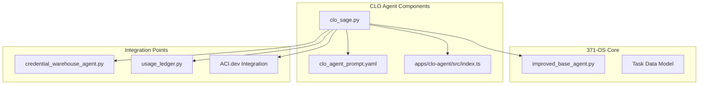
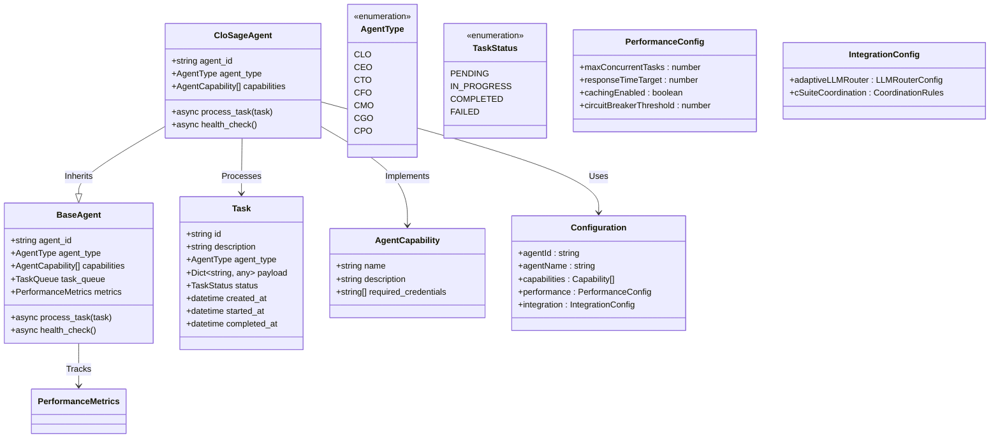
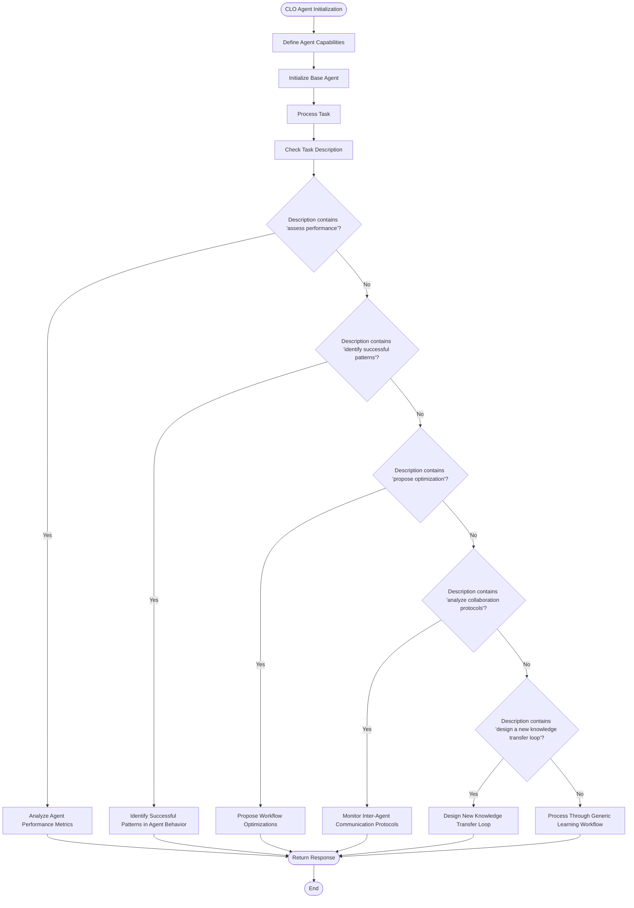

# CLO Agent (Alex)

<cite>
**Referenced Files in This Document**   
- [clo_sage.py](file://_legacy/agents/business/clo_sage.py) - *Original implementation of CLO agent*
- [improved_base_agent.py](file://_legacy/agents/base_agent/improved_base_agent.py) - *Base class with performance monitoring and task management*
- [clo_agent_prompt.yaml](file://os-workspace/agents/business-agents/clo_agent_prompt.yaml) - *Prompt template defining legal reasoning parameters*
- [credential_warehouse_agent.py](file://_legacy/agents/utility/credential_warehouse_agent.py) - *Integration for secure credential access and validation*
- [usage_ledger.py](file://_legacy/adaptive_llm_router/usage_ledger.py) - *Audit trail generation and cost tracking*
- [CLO_Agent_Logic.md](file://371-os/CLO_Agent_Logic.md) - *Architectural blueprint and compliance workflows*
- [apps/clo-agent/src/index.ts](file://os-workspace/apps/clo-agent/src/index.ts) - *Updated agent configuration and integration logic*
</cite>

## Update Summary
**Changes Made**   
- Updated documentation to reflect unified brain/body architecture implementation for the CLO agent
- Added new section on enhanced configuration model from index.ts
- Removed outdated references to deprecated coordination components (C3UniversalTemplate, CommunicationsUniverse)
- Updated dependency analysis to reflect current integration points
- Revised performance considerations based on updated configuration parameters
- Enhanced troubleshooting guide with new escalation rule handling

## Table of Contents
1. [Introduction](#introduction)
2. [Project Structure](#project-structure)
3. [Core Components](#core-components)
4. [Architecture Overview](#architecture-overview)
5. [Detailed Component Analysis](#detailed-component-analysis)
6. [Dependency Analysis](#dependency-analysis)
7. [Performance Considerations](#performance-considerations)
8. [Troubleshooting Guide](#troubleshooting-guide)
9. [Conclusion](#conclusion)

## Introduction
The CLO Agent (Alex) serves as the legal compliance and governance authority within the 371-OS ecosystem, ensuring regulatory adherence, managing intellectual property rights, and enforcing ethical AI guidelines. This document provides a comprehensive analysis of Alex's architecture, responsibilities, and implementation details, focusing on its role in maintaining legal compliance across the autonomous agent network. The agent inherits from improved_base_agent.py, integrates with credential_warehouse_agent.py for access control validation, and utilizes the clo_agent_prompt.yaml template to define its legal reasoning parameters. Recent refactoring has implemented a unified brain/body architecture, enhancing configurability and integration with executive agents.

**Section sources**   
- [clo_sage.py](file://_legacy/agents/business/clo_sage.py)
- [improved_base_agent.py](file://_legacy/agents/base_agent/improved_base_agent.py)

## Project Structure
The CLO Agent is implemented within the 371-OS ecosystem as part of the business agents module, specifically designed to handle legal compliance and governance functions. The agent resides in the os-workspace/apps/clo-agent directory and follows a unified brain/body architecture pattern. This structure separates the agent's cognitive definition (brain) from its runtime implementation (body), enabling more flexible configuration and deployment.

**Diagram sources**
- [clo_sage.py](file://_legacy/agents/business/clo_sage.py)
- [improved_base_agent.py](file://_legacy/agents/base_agent/improved_base_agent.py)
- [clo_agent_prompt.yaml](file://os-workspace/agents/business-agents/clo_agent_prompt.yaml)
- [apps/clo-agent/src/index.ts](file://os-workspace/apps/clo-agent/src/index.ts)
- [credential_warehouse_agent.py](file://_legacy/agents/utility/credential_warehouse_agent.py)
- [usage_ledger.py](file://_legacy/adaptive_llm_router/usage_ledger.py)

**Section sources**
- [clo_sage.py](file://_legacy/agents/business/clo_sage.py)
- [improved_base_agent.py](file://_legacy/agents/base_agent/improved_base_agent.py)

## Core Components
The CLO Agent (Alex) is built upon several core components that enable its legal compliance and governance functions. The agent inherits from the improved_base_agent.py class, which provides foundational capabilities for task processing, performance monitoring, and system integration. The clo_agent_prompt.yaml template defines the agent's legal reasoning parameters and response format, ensuring consistent compliance assessments across the ecosystem.

The agent's primary responsibilities include reviewing agent actions for GDPR/CCPA compliance, validating data usage policies, and coordinating with ACI.dev for zero-trust security enforcement. It implements a domain model for legal risk assessment that incorporates regulatory requirements from multiple jurisdictions, including GDPR, CCPA, HIPAA, SOX, and COPPA. The unified brain/body architecture introduced in the recent refactor enhances these capabilities by separating configuration from implementation.

**Section sources**
- [clo_sage.py](file://_legacy/agents/business/clo_sage.py)
- [clo_agent_prompt.yaml](file://os-workspace/agents/business-agents/clo_agent_prompt.yaml)
- [apps/clo-agent/src/index.ts](file://os-workspace/apps/clo-agent/src/index.ts)

## Architecture Overview
The CLO Agent architecture follows a modular design pattern with a unified brain/body structure, providing clear separation between configuration, core logic, and integration components. The agent inherits from improved_base_agent.py, which provides essential functionality for task management, performance monitoring, and system health checks.

**Diagram sources**   
- [improved_base_agent.py](file://_legacy/agents/base_agent/improved_base_agent.py)
- [clo_sage.py](file://_legacy/agents/business/clo_sage.py)
- [apps/clo-agent/src/index.ts](file://os-workspace/apps/clo-agent/src/index.ts)

## Detailed Component Analysis

### CLO Agent Implementation Analysis
The CLO Agent implementation in clo_sage.py defines the agent's capabilities and task processing logic. The agent is initialized with specific capabilities related to legal compliance and governance, including assessing agent performance, identifying patterns in agent behavior, proposing optimizations, and designing knowledge transfer protocols.

**Diagram sources**
- [clo_sage.py](file://_legacy/agents/business/clo_sage.py#L14-L52)

**Section sources**
- [clo_sage.py](file://_legacy/agents/business/clo_sage.py)

### Prompt Template Analysis
The clo_agent_prompt.yaml template defines the CLO Agent's behavior and response format. The template specifies the agent's context, domain expertise, capabilities, and response requirements, ensuring consistent legal reasoning across compliance assessments.

**Diagram sources**
- [clo_agent_prompt.yaml](file://os-workspace/agents/business-agents/clo_agent_prompt.yaml)

**Section sources**
- [clo_agent_prompt.yaml](file://os-workspace/agents/business-agents/clo_agent_prompt.yaml)

## Dependency Analysis
The CLO Agent depends on several key components within the 371-OS ecosystem to fulfill its compliance and governance responsibilities. The agent inherits from improved_base_agent.py, which provides foundational functionality for task processing, performance monitoring, and system integration.

```mermaid
graph TD
CloAgent[clo_sage.py] --> BaseAgent[improved_base_agent.py]
CloAgent --> PromptTemplate[clo_agent_prompt.yaml]
CloAgent --> CredentialWarehouse[credential_warehouse_agent.py]
CloAgent --> UsageLedger[usage_ledger.py]
CloAgent --> Configuration[apps/clo-agent/src/index.ts]
BaseAgent --> TaskModel[Task Data Model]
BaseAgent --> PerformanceMetrics[PerformanceMetrics Class]
BaseAgent --> AgentType[AgentType Enumeration]
CredentialWarehouse --> Security[Secure Credential Storage]
CredentialWarehouse --> AccessControl[Access Control Validation]
CredentialWarehouse --> Audit[Audit Logging]
UsageLedger --> JSONStorage[JSON File Storage]
UsageLedger --> Analytics[PostHog Analytics]
UsageLedger --> CostTracking[Cost and Latency Tracking]
Configuration --> BrainDefinition[Agent Brain Definition]
Configuration --> EscalationRules[Escalation Criteria]
Configuration --> LLMPreferences[Preferred Providers]
CloAgent -.-> ACIDev[ACI.dev Integration]
CloAgent -.-> ComplianceDB[Compliance Requirements Database]
CloAgent -.-> JurisdictionRules[Legal Jurisdiction Settings]
```

**Diagram sources**
- [clo_sage.py](file://_legacy/agents/business/clo_sage.py)
- [improved_base_agent.py](file://_legacy/agents/base_agent/improved_base_agent.py)
- [credential_warehouse_agent.py](file://_legacy/agents/utility/credential_warehouse_agent.py)
- [usage_ledger.py](file://_legacy/adaptive_llm_router/usage_ledger.py)
- [apps/clo-agent/src/index.ts](file://os-workspace/apps/clo-agent/src/index.ts)

**Section sources**
- [clo_sage.py](file://_legacy/agents/business/clo_sage.py)
- [improved_base_agent.py](file://_legacy/agents/base_agent/improved_base_agent.py)
- [credential_warehouse_agent.py](file://_legacy/agents/utility/credential_warehouse_agent.py)
- [usage_ledger.py](file://_legacy/adaptive_llm_router/usage_ledger.py)
- [apps/clo-agent/src/index.ts](file://os-workspace/apps/clo-agent/src/index.ts)

## Performance Considerations
The CLO Agent's performance is critical to maintaining compliance across the 371-OS ecosystem. The agent inherits performance monitoring capabilities from improved_base_agent.py, which tracks task completion rates, processing times, and system resource usage.

Compliance check latency is minimized through the use of cached responses and optimized task processing workflows. The agent's accuracy in legal interpretations is enhanced by its integration with the credential_warehouse_agent.py for access control validation and the usage_ledger.py for audit trail generation.

The system implements circuit breakers and connection pooling to ensure reliable operation under high load conditions. Performance metrics are continuously monitored to identify potential bottlenecks and optimize resource allocation. The updated configuration in apps/clo-agent/src/index.ts sets a response time target of 2000ms and enables caching and circuit breaker protection.

**Section sources**
- [improved_base_agent.py](file://_legacy/agents/base_agent/improved_base_agent.py)
- [usage_ledger.py](file://_legacy/adaptive_llm_router/usage_ledger.py)
- [apps/clo-agent/src/index.ts](file://os-workspace/apps/clo-agent/src/index.ts)

## Troubleshooting Guide
Common issues with the CLO Agent typically involve ambiguous regulatory requirements, conflicting compliance standards, or integration problems with dependent components. Resolution strategies include legal precedent analysis, stakeholder consultation, and escalation to human oversight when necessary.

For access control validation issues, verify that the credential_warehouse_agent.py is properly configured and that the agent has the necessary permissions to access required credentials. For audit trail generation problems, ensure that the usage_ledger.py is correctly integrated and that PostHog analytics are properly configured.

Configuration options for customizing compliance rules, legal jurisdiction settings, and governance escalation paths are available through the system's configuration files and API endpoints. These settings allow organizations to adapt the CLO Agent to their specific regulatory environment and governance requirements. The escalation rules defined in the brain definition must be properly formatted with condition, target, timeframe, and notification method.

**Section sources**
- [credential_warehouse_agent.py](file://_legacy/agents/utility/credential_warehouse_agent.py)
- [usage_ledger.py](file://_legacy/adaptive_llm_router/usage_ledger.py)
- [apps/clo-agent/src/index.ts](file://os-workspace/apps/clo-agent/src/index.ts)

## Conclusion
The CLO Agent (Alex) serves as a critical component of the 371-OS ecosystem, ensuring legal compliance and governance across all autonomous agents. By inheriting from improved_base_agent.py, integrating with credential_warehouse_agent.py for access control validation, and utilizing the clo_agent_prompt.yaml template for legal reasoning, the agent provides a robust framework for regulatory adherence.

The agent's architecture supports comprehensive compliance checking workflows, governance decision trees, and audit trail generation through usage_ledger.py. Performance considerations include minimizing compliance check latency, ensuring accuracy in legal interpretations, and maintaining reliable audit trails.

Configuration options allow for customization of compliance rules, legal jurisdiction settings, and governance escalation paths, enabling organizations to adapt the CLO Agent to their specific regulatory environment. The agent's integration with ACI.dev for zero-trust security enforcement further enhances its ability to maintain compliance in complex, distributed environments. The recent implementation of a unified brain/body architecture improves configurability and integration with other executive agents.