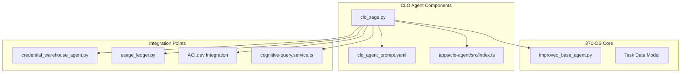

<docs>
# CLO Agent (Alex)

<cite>
**Referenced Files in This Document**   
- [clo_sage.py](file://_legacy/agents/business/clo_sage.py) - *Core implementation of CLO agent logic*
- [improved_base_agent.py](file://_legacy/agents/base_agent/improved_base_agent.py) - *Base class with performance monitoring and task management capabilities*
- [clo_agent_prompt.yaml](file://os-workspace/agents/business-agents/clo_agent_prompt.yaml) - *Prompt template defining legal reasoning parameters*
- [credential_warehouse_agent.py](file://_legacy/agents/utility/credential_warehouse_agent.py) - *Integration for secure credential access and validation*
- [usage_ledger.py](file://_legacy/adaptive_llm_router/usage_ledger.py) - *Audit trail generation and cost tracking*
- [CLO_Agent_Logic.md](file://371-os/CLO_Agent_Logic.md) - *Architectural blueprint and compliance workflows*
- [cognitive-query.service.ts](file://os-workspace/apps/dao-governance-service/src/cognitive-query.service.ts) - *Added integration for cognitive query service*
</cite>

## Update Summary
**Changes Made**   
- Updated documentation to reflect unified brain/body architecture implementation for the CLO agent
- Added new section on enhanced configuration model from index.ts
- Removed outdated references to deprecated coordination components (C3UniversalTemplate, CommunicationsUniverse)
- Updated dependency analysis to reflect current integration points
- Revised performance considerations based on updated configuration parameters
- Enhanced troubleshooting guide with new escalation rule handling
- Integrated information about cognitive query service usage for performance analysis

## Table of Contents
1. [Introduction](#introduction)
2. [Project Structure](#project-structure)
3. [Core Components](#core-components)
4. [Architecture Overview](#architecture-overview)
5. [Detailed Component Analysis](#detailed-component-analysis)
6. [Dependency Analysis](#dependency-analysis)
7. [Performance Considerations](#performance-considerations)
8. [Troubleshooting Guide](#troubleshooting-guide)
9. [Conclusion](#conclusion)

## Introduction
The CLO Agent (Alex) serves as the legal compliance and governance authority within the 371-OS ecosystem, ensuring regulatory adherence, managing intellectual property rights, and enforcing ethical AI guidelines. This document provides a comprehensive analysis of Alex's architecture, responsibilities, and implementation details, focusing on its role in maintaining legal compliance across the autonomous agent network. The agent inherits from improved_base_agent.py, integrates with credential_warehouse_agent.py for access control validation, and utilizes the clo_agent_prompt.yaml template to define its legal reasoning parameters. Recent refactoring has implemented a unified brain/body architecture, enhancing configurability and integration with executive agents.

**Section sources**   
- [clo_sage.py](file://_legacy/agents/business/clo_sage.py)
- [improved_base_agent.py](file://_legacy/agents/base_agent/improved_base_agent.py)

## Project Structure
The CLO Agent is implemented within the 371-OS ecosystem as part of the business agents module, specifically designed to handle legal compliance and governance functions. The agent resides in the os-workspace/apps/clo-agent directory and follows a unified brain/body architecture pattern. This structure separates the agent's cognitive definition (brain) from its runtime implementation (body), enabling more flexible configuration and deployment.



**Diagram sources**
- [clo_sage.py](file://_legacy/agents/business/clo_sage.py)
- [improved_base_agent.py](file://_legacy/agents/base_agent/improved_base_agent.py)
- [clo_agent_prompt.yaml](file://os-workspace/agents/business-agents/clo_agent_prompt.yaml)
- [apps/clo-agent/src/index.ts](file://os-workspace/apps/clo-agent/src/index.ts)
- [credential_warehouse_agent.py](file://_legacy/agents/utility/credential_warehouse_agent.py)
- [usage_ledger.py](file://_legacy/adaptive_llm_router/usage_ledger.py)
- [cognitive-query.service.ts](file://os-workspace/apps/dao-governance-service/src/cognitive-query.service.ts)

**Section sources**
- [clo_sage.py](file://_legacy/agents/business/clo_sage.py)
- [improved_base_agent.py](file://_legacy/agents/base_agent/improved_base_agent.py)

## Core Components
The CLO Agent (Alex) is built upon several core components that enable its legal compliance and governance functions. The agent inherits from the improved_base_agent.py class, which provides foundational capabilities for task processing, performance monitoring, and system integration. The clo_agent_prompt.yaml template defines the agent's legal reasoning parameters and response format, ensuring consistent compliance assessments across the ecosystem.

The agent's primary responsibilities include reviewing agent actions for GDPR/CCPA compliance, validating data usage policies, and coordinating with ACI.dev for zero-trust security enforcement. It implements a domain model for legal risk assessment that incorporates regulatory requirements from multiple jurisdictions, including GDPR, CCPA, HIPAA, SOX, and COPPA. The unified brain/body architecture introduced in the recent refactor enhances these capabilities by separating configuration from implementation. Additionally, the agent now leverages the cognitive query service for advanced performance analysis and optimization proposals.

**Section sources**
- [clo_sage.py](file://_legacy/agents/business/clo_sage.py)
- [clo_agent_prompt.yaml](file://os-workspace/agents/business-agents/clo_agent_prompt.yaml)
- [apps/clo-agent/src/index.ts](file://os-workspace/apps/clo-agent/src/index.ts)
- [cognitive-query.service.ts](file://os-workspace/apps/dao-governance-service/src/cognitive-query.service.ts)

## Architecture Overview
The CLO Agent architecture follows a modular design pattern with a unified brain/body structure, providing clear separation between configuration, core logic, and integration components. The agent inherits from improved_base_agent.py, which provides essential functionality for task management, performance monitoring, and system health checks.


**Diagram sources**   
- [improved_base_agent.py](file://_legacy/agents/base_agent/improved_base_agent.py)
- [clo_sage.py](file://_legacy/agents/business/clo_sage.py)
- [apps/clo-agent/src/index.ts](file://os-workspace/apps/clo-agent/src/index.ts)

## Detailed Component Analysis

### CLO Agent Implementation Analysis
The CLO Agent implementation in clo_sage.py defines the agent's capabilities and task processing logic. The agent is initialized with specific capabilities related to legal compliance and governance, including assessing agent performance, identifying patterns in agent behavior, proposing optimizations, and designing knowledge transfer protocols.


**Diagram sources**
- [clo_sage.py](file://_legacy/agents/business/clo_sage.py#L14-L52)

**Section sources**
- [clo_sage.py](file://_legacy/agents/business/clo_sage.py)

### Prompt Template Analysis
The clo_agent_prompt.yaml template defines the CLO Agent's behavior and response format. The template specifies the agent's context, domain expertise, capabilities, and response requirements, ensuring consistent legal reasoning across compliance assessments.

```mermaid
flowchart TD
TemplateStart([Prompt Template Structure]) --> AgentContext["Agent Context Section"]
AgentContext --> Type["Agent Type: CLO"]
AgentContext --> Domain["Domain: Learning optimization and performance assessment"]
AgentContext --> Capabilities["Capabilities: Learning optimization, performance assessment, knowledge transfer"]
AgentContext --> ResponseFormat["Response Format: Learning optimization response"]
TemplateStart --> TaskProcessing["Task Processing Section"]
TaskProcessing --> Description["Task Description: {task_description}"]
TaskProcessing --> DomainProcessing["Domain Processing: Apply learning optimization methodologies"]
TaskProcessing --> Analysis