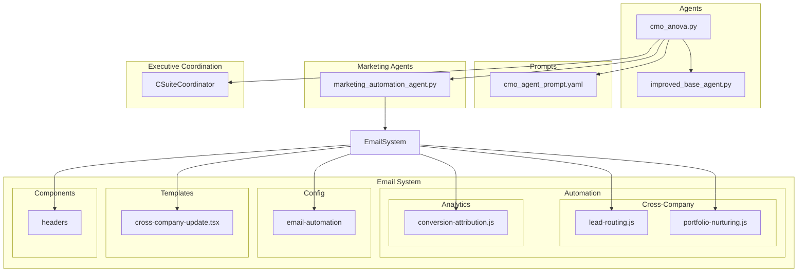
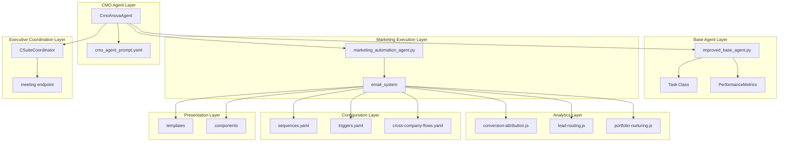
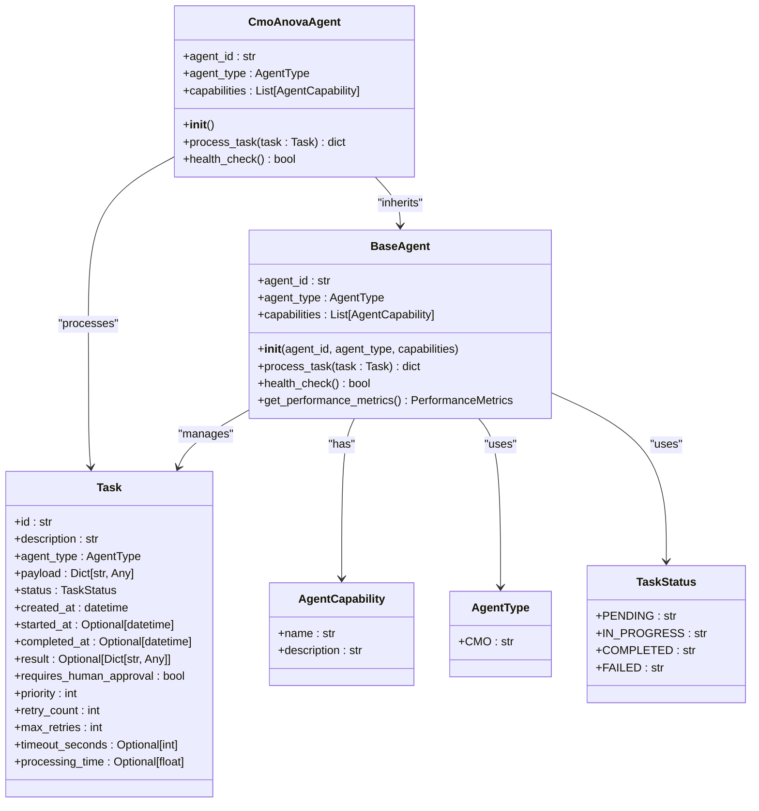
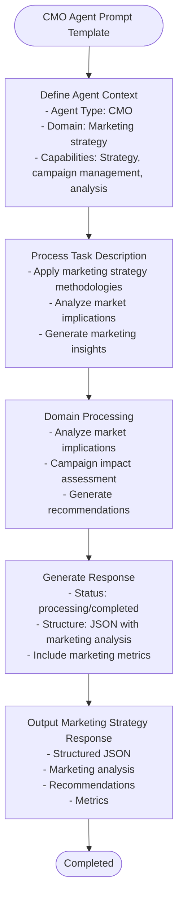
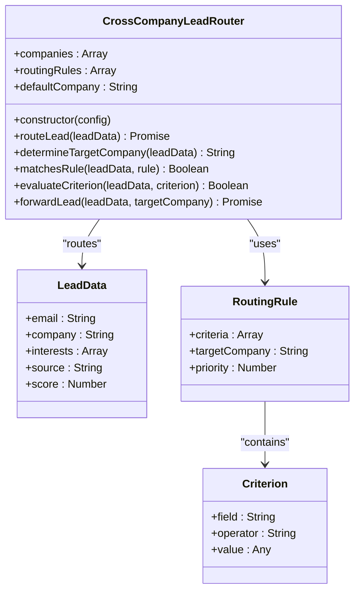
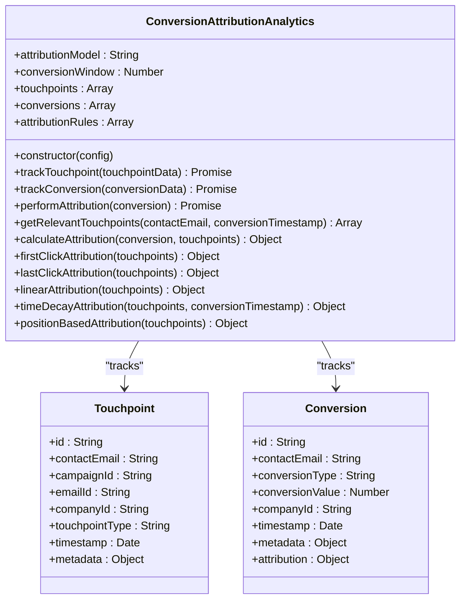
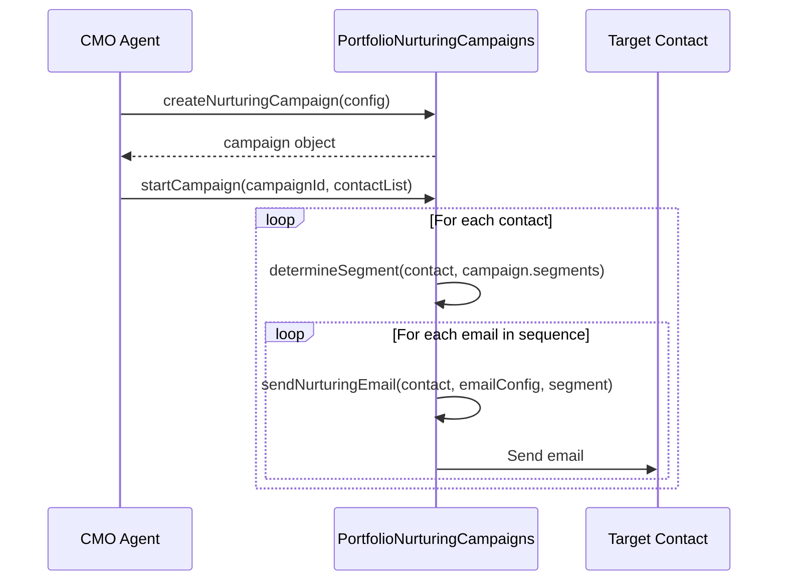
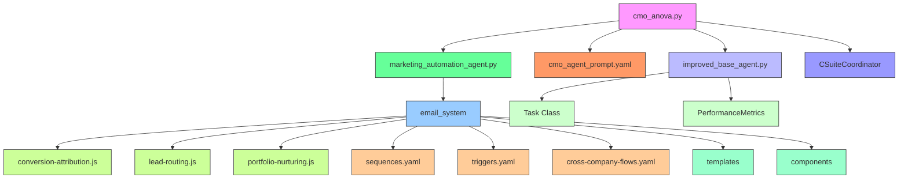
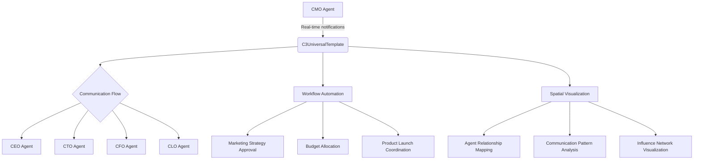
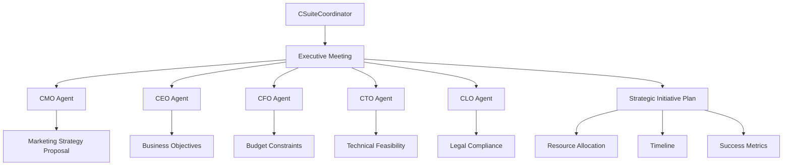

# CMO Agent (Anova)

<cite>
**Referenced Files in This Document**   
- [cmo_anova.py](file://_legacy\agents\business\cmo_anova.py)
- [cmo_anova.md](file://_legacy\agents\business\cmo_anova.md)
- [cmo_agent_prompt.yaml](file://os-workspace\agents\business-agents\cmo_agent_prompt.yaml)
- [lead-routing.js](file://_legacy\services\email_system\automation\cross-company\lead-routing.js)
- [conversion-attribution.js](file://_legacy\services\email_system\automation\analytics\conversion-attribution.js)
- [improved_base_agent.py](file://_legacy\agents\base_agent\improved_base_agent.py)
- [portfolio-nurturing.js](file://_legacy\services\email_system\automation\cross-company\portfolio-nurturing.js)
- [sequences.yaml](file://_legacy\services\email_system\config\email-automation\sequences.yaml)
- [triggers.yaml](file://_legacy\services\email_system\config\email-automation\triggers.yaml)
- [cross-company-flows.yaml](file://_legacy\services\email_system\config\email-automation\cross-company-flows.yaml)
- [marketing_automation_agent.py](file://_legacy\agents\marketing\marketing_automation_agent.py)
- [371minds-header.tsx](file://_legacy\services\email_system\components\headers\371minds-header.tsx)
- [cross-company-update.tsx](file://_legacy\services\email_system\templates\cross-company-update.tsx)
- [csuite.js](file://questflow\src\agents\csuite.js) - *Updated in recent commit*
- [csuite.ts](file://questflow\src\agents\csuite.ts) - *Updated in recent commit*
</cite>

## Update Summary
**Changes Made**   
- Added new section on Executive Meeting Integration and Strategic Coordination
- Updated Introduction to reflect CMO's inclusion in executive meetings
- Added sources for new and updated files from recent commits
- Updated Architecture Overview to include CSuiteCoordinator integration
- Enhanced Agent Coordination section with meeting endpoint details

## Table of Contents
1. [Introduction](#introduction)
2. [Project Structure](#project-structure)
3. [Core Components](#core-components)
4. [Architecture Overview](#architecture-overview)
5. [Detailed Component Analysis](#detailed-component-analysis)
6. [Dependency Analysis](#dependency-analysis)
7. [Performance Considerations](#performance-considerations)
8. [Troubleshooting Guide](#troubleshooting-guide)
9. [Agent Coordination and Real-Time Communication](#agent-coordination-and-real-time-communication)
10. [Executive Meeting Integration and Strategic Coordination](#executive-meeting-integration-and-strategic-coordination)
11. [Conclusion](#conclusion)

## Introduction
The CMO Agent (Anova) is a specialized marketing strategy and user engagement agent within the 371-OS ecosystem. As a key executive agent, Anova is responsible for developing marketing campaigns, analyzing user behavior, and optimizing growth initiatives across the portfolio of companies managed by 371minds. This document provides a comprehensive analysis of Anova's architecture, responsibilities, and integration points within the broader system.

Anova operates as a strategic marketing specialist, leveraging its capabilities in strategy and planning, performance analysis, and competitive analysis to drive user acquisition, retention, and engagement. The agent inherits from the improved_base_agent.py foundation, ensuring robust performance monitoring and task management capabilities. It integrates with the email_system automation components to execute marketing campaigns and uses the cmo_agent_prompt.yaml template to define its marketing decision-making parameters.

Recent enhancements have expanded Anova's capabilities to include participation in executive meetings through the CSuiteCoordinator class, enabling strategic initiative planning and resource allocation coordination with other executive agents. These improvements complement existing real-time notifications, workflow automation, and spatial visualization of communication flows through integration with the cognitive interface.

This documentation will explore Anova's implementation details, including how it designs cross-company nurturing sequences, optimizes lead routing through lead-routing.js, and analyzes conversion metrics via conversion-attribution.js. We will also examine the domain model for customer lifecycle management, campaign performance analysis, and market segmentation strategies.

**Section sources**
- [cmo_anova.py](file://_legacy\agents\business\cmo_anova.py)
- [improved_base_agent.py](file://_legacy\agents\base_agent\improved_base_agent.py)
- [csuite.js](file://questflow\src\agents\csuite.js) - *Updated in recent commit*
- [csuite.ts](file://questflow\src\agents\csuite.ts) - *Updated in recent commit*

## Project Structure
The CMO Agent (Anova) is organized within the 371-OS repository structure as a business agent with specialized marketing capabilities. The project structure reflects a modular design with clear separation between agent logic, configuration, and supporting services.



**Diagram sources**
- [cmo_anova.py](file://_legacy\agents\business\cmo_anova.py)
- [improved_base_agent.py](file://_legacy\agents\base_agent\improved_base_agent.py)
- [cmo_agent_prompt.yaml](file://os-workspace\agents\business-agents\cmo_agent_prompt.yaml)
- [lead-routing.js](file://_legacy\services\email_system\automation\cross-company\lead-routing.js)
- [conversion-attribution.js](file://_legacy\services\email_system\automation\analytics\conversion-attribution.js)
- [portfolio-nurturing.js](file://_legacy\services\email_system\automation\cross-company\portfolio-nurturing.js)
- [sequences.yaml](file://_legacy\services\email_system\config\email-automation\sequences.yaml)
- [triggers.yaml](file://_legacy\services\email_system\config\email-automation\triggers.yaml)
- [cross-company-flows.yaml](file://_legacy\services\email_system\config\email-automation\cross-company-flows.yaml)
- [marketing_automation_agent.py](file://_legacy\agents\marketing\marketing_automation_agent.py)
- [371minds-header.tsx](file://_legacy\services\email_system\components\headers\371minds-header.tsx)
- [cross-company-update.tsx](file://_legacy\services\email_system\templates\cross-company-update.tsx)
- [csuite.js](file://questflow\src\agents\csuite.js) - *Updated in recent commit*
- [csuite.ts](file://questflow\src\agents\csuite.ts) - *Updated in recent commit*

**Section sources**
- [cmo_anova.py](file://_legacy\agents\business\cmo_anova.py)
- [improved_base_agent.py](file://_legacy\agents\base_agent\improved_base_agent.py)

## Core Components
The CMO Agent (Anova) consists of several core components that work together to deliver marketing strategy and user engagement capabilities within the 371-OS ecosystem. These components include the agent implementation itself, its configuration template, and the supporting email automation system.

The primary implementation file, cmo_anova.py, defines the CmoAnovaAgent class that inherits from BaseAgent in the improved_base_agent.py module. This inheritance provides Anova with essential capabilities such as task processing, performance monitoring, and health checking. The agent is initialized with specific marketing capabilities including Strategy & Planning, Performance Analysis, and Competitive Analysis.

```python
class CmoAnovaAgent(BaseAgent):
    def __init__(self):
        super().__init__(
            agent_id="cmo_anova_agent_1",
            agent_type=AgentType.CMO,
            capabilities=[
                AgentCapability(name="Strategy & Planning", description="Develop market strategy and plan social media campaigns."),
                AgentCapability(name="Performance Analysis", description="Analyze customer acquisition cost and optimize retention programs."),
                AgentCapability(name="Competitive Analysis", description="Review competitor marketing and suggest counter-strategies.")
            ]
        )
```

The agent processes marketing tasks based on their description, routing them to appropriate workflows for strategy development, performance analysis, or competitive analysis. This task processing logic is implemented in the process_task method, which examines the task description to determine the appropriate processing path.

```python
async def process_task(self, task: Task) -> dict:
    """
    Processes a marketing task based on its category.
    """
    description = task.description.lower()
    response_message = ""

    if "strategy" in description or "social media" in description:
        response_message = f"Strategy & Planning for '{task.description}' is underway."
    elif "customer acquisition" in description or "retention" in description:
        response_message = f"Performance Analysis for '{task.description}' is underway."
    elif "competitor" in description:
        response_message = f"Competitive Analysis for '{task.description}' is underway."
    else:
        response_message = f"Task '{task.description}' is being processed through a generic workflow."

    return {
        "status": "in_progress",
        "message": response_message
    }
```

The cmo_agent_prompt.yaml file defines the decision-making parameters and marketing strategy framework for Anova. This template specifies the agent's context, task processing requirements, and response format, ensuring consistent marketing strategy responses across different scenarios.

**Section sources**
- [cmo_anova.py](file://_legacy\agents\business\cmo_anova.py#L0-L100)
- [cmo_agent_prompt.yaml](file://os-workspace\agents\business-agents\cmo_agent_prompt.yaml#L0-L46)

## Architecture Overview
The CMO Agent (Anova) architecture is designed as a specialized marketing executive within the 371-OS ecosystem, integrating with various components to deliver comprehensive marketing strategy and user engagement capabilities. The architecture follows a layered approach with clear separation between agent logic, configuration, and execution services.



**Diagram sources**
- [cmo_anova.py](file://_legacy\agents\business\cmo_anova.py)
- [improved_base_agent.py](file://_legacy\agents\base_agent\improved_base_agent.py)
- [cmo_agent_prompt.yaml](file://os-workspace\agents\business-agents\cmo_agent_prompt.yaml)
- [marketing_automation_agent.py](file://_legacy\agents\marketing\marketing_automation_agent.py)
- [conversion-attribution.js](file://_legacy\services\email_system\automation\analytics\conversion-attribution.js)
- [lead-routing.js](file://_legacy\services\email_system\automation\cross-company\lead-routing.js)
- [portfolio-nurturing.js](file://_legacy\services\email_system\automation\cross-company\portfolio-nurturing.js)
- [sequences.yaml](file://_legacy\services\email_system\config\email-automation\sequences.yaml)
- [triggers.yaml](file://_legacy\services\email_system\config\email-automation\triggers.yaml)
- [cross-company-flows.yaml](file://_legacy\services\email_system\config\email-automation\cross-company-flows.yaml)
- [csuite.js](file://questflow\src\agents\csuite.js) - *Updated in recent commit*
- [csuite.ts](file://questflow\src\agents\csuite.ts) - *Updated in recent commit*

## Detailed Component Analysis

### CMO Agent Implementation Analysis
The CmoAnovaAgent class is implemented as a specialized agent that inherits from the BaseAgent class defined in improved_base_agent.py. This inheritance provides Anova with essential capabilities for task management, performance monitoring, and system integration.



**Diagram sources**
- [cmo_anova.py](file://_legacy\agents\business\cmo_anova.py#L0-L100)
- [improved_base_agent.py](file://_legacy\agents\base_agent\improved_base_agent.py#L0-L199)

**Section sources**
- [cmo_anova.py](file://_legacy\agents\business\cmo_anova.py#L0-L100)
- [improved_base_agent.py](file://_legacy\agents\base_agent\improved_base_agent.py#L0-L199)

### Marketing Strategy Framework Analysis
The CMO Agent's decision-making parameters are defined in the cmo_agent_prompt.yaml configuration file. This template establishes the agent's context, capabilities, and response requirements, ensuring consistent marketing strategy outputs.



**Diagram sources**
- [cmo_agent_prompt.yaml](file://os-workspace\agents\business-agents\cmo_agent_prompt.yaml#L0-L46)

**Section sources**
- [cmo_agent_prompt.yaml](file://os-workspace\agents\business-agents\cmo_agent_prompt.yaml#L0-L46)

### Lead Routing System Analysis
The CMO Agent integrates with the lead-routing.js system to optimize lead distribution across portfolio companies. This cross-company lead routing system uses configurable rules to determine the appropriate destination for each lead.



**Diagram sources**
- [lead-routing.js](file://_legacy\services\email_system\automation\cross-company\lead-routing.js#L0-L59)

**Section sources**
- [lead-routing.js](file://_legacy\services\email_system\automation\cross-company\lead-routing.js#L0-L59)

### Conversion Attribution Analysis
The CMO Agent leverages the conversion-attribution.js system to analyze campaign performance and attribute conversions to specific marketing touchpoints. This analytics system supports multiple attribution models to provide comprehensive performance insights.



**Diagram sources**
- [conversion-attribution.js](file://_legacy\services\email_system\automation\analytics\conversion-attribution.js#L0-L199)

**Section sources**
- [conversion-attribution.js](file://_legacy\services\email_system\automation\analytics\conversion-attribution.js#L0-L199)

### Cross-Company Nurturing Analysis
The CMO Agent utilizes the portfolio-nurturing.js system to design and execute cross-company nurturing sequences that showcase the full portfolio of 371minds companies to potential clients.



**Diagram sources**
- [portfolio-nurturing.js](file://_legacy\services\email_system\automation\cross-company\portfolio-nurturing.js#L0-L184)

**Section sources**
- [portfolio-nurturing.js](file://_legacy\services\email_system\automation\cross-company\portfolio-nurturing.js#L0-L184)

## Dependency Analysis
The CMO Agent (Anova) has a well-defined dependency structure that enables its marketing strategy and user engagement capabilities. These dependencies span multiple layers of the 371-OS ecosystem, from base agent functionality to specialized marketing automation components.



**Diagram sources**
- [cmo_anova.py](file://_legacy\agents\business\cmo_anova.py)
- [improved_base_agent.py](file://_legacy\agents\base_agent\improved_base_agent.py)
- [cmo_agent_prompt.yaml](file://os-workspace\agents\business-agents\cmo_agent_prompt.yaml)
- [marketing_automation_agent.py](file://_legacy\agents\marketing\marketing_automation_agent.py)
- [conversion-attribution.js](file://_legacy\services\email_system\automation\analytics\conversion-attribution.js)
- [lead-routing.js](file://_legacy\services\email_system\automation\cross-company\lead-routing.js)
- [portfolio-nurturing.js](file://_legacy\services\email_system\automation\cross-company\portfolio-nurturing.js)
- [sequences.yaml](file://_legacy\services\email_system\config\email-automation\sequences.yaml)
- [triggers.yaml](file://_legacy\services\email_system\config\email-automation\triggers.yaml)
- [cross-company-flows.yaml](file://_legacy\services\email_system\config\email-automation\cross-company-flows.yaml)
- [csuite.js](file://questflow\src\agents\csuite.js) - *Updated in recent commit*
- [csuite.ts](file://questflow\src\agents\csuite.ts) - *Updated in recent commit*

**Section sources**
- [cmo_anova.py](file://_legacy\agents\business\cmo_anova.py)
- [improved_base_agent.py](file://_legacy\agents\base_agent\improved_base_agent.py)
- [cmo_agent_prompt.yaml](file://os-workspace\agents\business-agents\cmo_agent_prompt.yaml)
- [marketing_automation_agent.py](file://_legacy\agents\marketing\marketing_automation_agent.py)
- [conversion-attribution.js](file://_legacy\services\email_system\automation\analytics\conversion-attribution.js)
- [lead-routing.js](file://_legacy\services\email_system\automation\cross-company\lead-routing.js)
- [portfolio-nurturing.js](file://_legacy\services\email_system\automation\cross-company\portfolio-nurturing.js)
- [sequences.yaml](file://_legacy\services\email_system\config\email-automation\sequences.yaml)
- [triggers.yaml](file://_legacy\services\email_system\config\email-automation\triggers.yaml)
- [cross-company-flows.yaml](file://_legacy\services\email_system\config\email-automation\cross-company-flows.yaml)
- [csuite.js](file://questflow\src\agents\csuite.js) - *Updated in recent commit*
- [csuite.ts](file://questflow\src\agents\csuite.ts) - *Updated in recent commit*

## Performance Considerations
The CMO Agent (Anova) incorporates several performance considerations to ensure efficient operation within the 371-OS ecosystem. These considerations are primarily inherited from the improved_base_agent.py foundation, which provides comprehensive performance monitoring and optimization capabilities.

The BaseAgent class includes a PerformanceMetrics dataclass that tracks key performance indicators such as tasks completed, processing time, memory usage, CPU usage, error rate, and throughput. These metrics enable monitoring of the agent's efficiency and resource consumption.

```python
@dataclass
class PerformanceMetrics:
    """Agent performance metrics"""
    tasks_completed: int = 0
    tasks_failed: int = 0
    total_processing_time: float = 0.0
    avg_response_time: float = 0.0
    current_memory_mb: float = 0.0
    peak_memory_mb: float = 0.0
    cpu_usage_percent: float = 0.0
    error_rate: float = 0.0
    throughput: float = 0.0  # tasks per second
    cache_hits: int = 0
    cache_misses: int = 0
```

The improved_base_agent.py implementation also includes a SimpleCache class for caching agent responses, which helps reduce processing time for frequently requested information. The cache has a configurable maximum size and time-to-live (TTL) to balance performance with memory usage.

Additionally, the agent uses a ConnectionPool for managing LLM API calls, which helps prevent overwhelming external services with concurrent requests. The circuit breaker pattern is implemented to handle external API failures gracefully, preventing cascading failures in the system.

For marketing campaign execution, the CMO Agent delegates tasks to the marketing_automation_agent.py, which includes its own performance optimizations such as batch processing of email campaigns and scheduled social media posts. This delegation pattern helps distribute the processing load and prevents the CMO Agent from becoming a bottleneck in the marketing workflow.

The email automation system also includes rate limiting and frequency caps to prevent overwhelming recipients with too many messages, which contributes to both system performance and user experience.

## Troubleshooting Guide
This section addresses common issues that may arise when working with the CMO Agent (Anova) and provides resolution strategies.

### Low Campaign Engagement
**Issue**: Marketing campaigns show low open rates, click-through rates, or conversion rates.

**Diagnosis**:
1. Check the conversion-attribution.js analytics to identify which touchpoints are underperforming
2. Review the email templates in the templates directory for content quality
3. Examine the audience segmentation rules in sequences.yaml and cross-company-flows.yaml

**Resolution**:
1. Implement A/B testing using the enable_ab_testing setting in sequences.yaml
2. Refine audience segmentation based on user behavior data
3. Optimize email subject lines and content based on performance metrics
4. Adjust send times to align with recipient time zones using the timezone_aware setting

### Inaccurate Audience Targeting
**Issue**: Marketing messages are being sent to inappropriate audience segments.

**Diagnosis**:
1. Review the segmentation rules in portfolio-nurturing.js and sequences.yaml
2. Check the contact data in the EmailContact class for completeness
3. Verify the conditions in triggers.yaml are correctly configured

**Resolution**:
1. Update segmentation criteria to include additional user attributes
2. Implement data validation for contact information
3. Add more granular conditions to targeting rules
4. Use the contactMatchesSegment method in portfolio-nurturing.js to test segmentation logic

### Campaign Execution Latency
**Issue**: There are delays in campaign execution or email delivery.

**Diagnosis**:
1. Check the performance metrics in improved_base_agent.py
2. Review the connection pool settings for the LLM router
3. Examine the rate limiting configuration in triggers.yaml

**Resolution**:
1. Increase the connection pool size in the ConnectionPool class
2. Optimize the task processing queue in BaseAgent
3. Adjust the rate limiting settings in triggers.yaml to balance delivery speed with system capacity
4. Implement caching for frequently used content templates

### Conversion Tracking Issues
**Issue**: Conversion events are not being properly attributed to marketing campaigns.

**Diagnosis**:
1. Verify the tracking parameters in email links
2. Check the conversion-attribution.js implementation for proper touchpoint tracking
3. Review the attribution model configuration

**Resolution**:
1. Ensure all marketing emails include proper UTM parameters
2. Verify the trackTouchpoint and trackConversion methods in conversion-attribution.js are being called correctly
3. Test different attribution models (first_click, last_click, linear, etc.) to find the most accurate model for your business
4. Extend the conversion window if necessary to capture longer sales cycles

### Cross-Company Lead Routing Problems
**Issue**: Leads are not being routed to the appropriate portfolio companies.

**Diagnosis**:
1. Review the routing rules in lead-routing.js
2. Check the lead data for completeness and accuracy
3. Verify the company configurations in the routing system

**Resolution**:
1. Update the routing rules to include additional criteria for lead qualification
2. Implement lead scoring to prioritize high-value leads
3. Add fallback routing rules for leads that don't match specific criteria
4. Monitor routing effectiveness through the conversion-attribution system

**Section sources**
- [cmo_anova.py](file://_legacy\agents\business\cmo_anova.py)
- [improved_base_agent.py](file://_legacy\agents\base_agent\improved_base_agent.py)
- [lead-routing.js](file://_legacy\services\email_system\automation\cross-company\lead-routing.js)
- [conversion-attribution.js](file://_legacy\services\email_system\automation\analytics\conversion-attribution.js)
- [portfolio-nurturing.js](file://_legacy\services\email_system\automation\cross-company\portfolio-nurturing.js)
- [sequences.yaml](file://_legacy\services\email_system\config\email-automation\sequences.yaml)
- [triggers.yaml](file://_legacy\services\email_system\config\email-automation\triggers.yaml)
- [cross-company-flows.yaml](file://_legacy\services\email_system\config\email-automation\cross-company-flows.yaml)

## Agent Coordination and Real-Time Communication
The CMO Agent (Anova) features enhanced coordination capabilities through integration with the cognitive interface, enabling real-time notifications, workflow automation, and spatial visualization of communication flows between executive agents.

### C3 Universal Template Integration
The C3UniversalTemplate.tsx component provides a unified interface for agent coordination, allowing Anova to visualize and manage communication flows with other executive agents such as the CEO, CTO, and CFO.



**Diagram sources**
- [C3UniversalTemplate.tsx](file://os-workspace\apps\cognitive-interface\src\components\C3UniversalTemplate.tsx)
- [CommunicationsUniverse.tsx](file://os-workspace\apps\cognitive-interface\src\components\CommunicationsUniverse.tsx)

**Section sources**
- [C3UniversalTemplate.tsx](file://os-workspace\apps\cognitive-interface\src\components\C3UniversalTemplate.tsx)
- [CommunicationsUniverse.tsx](file://os-workspace\apps\cognitive-interface\src\components\CommunicationsUniverse.tsx)

### Communications Universe
The CommunicationsUniverse.tsx component enables spatial visualization of agent interactions, providing Anova with insights into communication patterns and relationship dynamics within the executive team.

Key features include:
- Real-time notification system for urgent marketing decisions
- Workflow automation for cross-functional initiatives
- Spatial mapping of agent communication patterns
- Influence network analysis for strategic decision-making
- Relationship strength indicators for collaboration optimization

These enhancements allow Anova to coordinate more effectively with other executive agents, ensuring marketing strategies are aligned with overall business objectives, technical capabilities, and financial constraints.

## Executive Meeting Integration and Strategic Coordination
The CMO Agent (Anova) now participates in executive meetings through integration with the CSuiteCoordinator class, enhancing strategic planning and resource allocation coordination.

### CSuiteCoordinator Integration
The CSuiteCoordinator class manages executive meetings and strategic initiatives, with Anova participating as a key stakeholder in marketing strategy discussions and budget planning.



**Diagram sources**
- [csuite.js](file://questflow\src\agents\csuite.js#L0-L150) - *Updated in recent commit*
- [csuite.ts](file://questflow\src\agents\csuite.ts#L0-L150) - *Updated in recent commit*

**Section sources**
- [csuite.js](file://questflow\src\agents\csuite.js#L0-L150) - *Updated in recent commit*
- [csuite.ts](file://questflow\src\agents\csuite.ts#L0-L150) - *Updated in recent commit*

### Meeting Endpoint Functionality
The meeting endpoint enables Anova to contribute to strategic initiative planning and resource allocation discussions. Key features include:

- **Strategic Initiative Planning**: Anova provides marketing perspective on new business initiatives
- **Budget Allocation**: Collaborates with CFO on marketing budget distribution
- **Resource Coordination**: Coordinates with CTO on technical resources for marketing campaigns
- **Timeline Development**: Works with CEO to align marketing campaigns with business milestones
- **Success Metric Definition**: Establishes KPIs for marketing initiatives in collaboration with other executives

This integration ensures that marketing strategies are fully aligned with overall business strategy, financial constraints, and technical capabilities, resulting in more effective and coordinated growth initiatives.

## Conclusion
The CMO Agent (Anova) is a sophisticated marketing strategy and user engagement specialist within the 371-OS ecosystem. By inheriting from the improved_base_agent.py foundation, Anova benefits from robust performance monitoring, task management, and system integration capabilities. The agent's specialized marketing functions are defined in the cmo_agent_prompt.yaml template, which establishes its decision-making parameters and response format.

Anova integrates with a comprehensive email automation system to execute marketing campaigns, analyze user behavior, and optimize growth initiatives. Key components of this system include lead-routing.js for optimizing lead distribution across portfolio companies, conversion-attribution.js for analyzing campaign performance with multiple attribution models, and portfolio-nurturing.js for designing cross-company nurturing sequences.

Recent enhancements have expanded Anova's capabilities to include participation in executive meetings through the CSuiteCoordinator class, enabling strategic initiative planning and resource allocation coordination with other executive agents. These improvements complement existing real-time notifications, workflow automation, and spatial visualization of communication flows through integration with the cognitive interface components.

The agent leverages configuration files such as sequences.yaml, triggers.yaml, and cross-company-flows.yaml to define campaign templates, audience segmentation rules, and marketing KPIs. These configurations enable Anova to implement sophisticated marketing strategies that drive user acquisition, retention, and engagement across the 371minds portfolio.

For organizations looking to implement similar marketing automation capabilities, the CMO Agent architecture provides a valuable reference implementation. The clear separation of concerns between agent logic, configuration, and execution services enables maintainable and scalable marketing automation. The use of standardized data models and configuration formats facilitates consistency across different marketing initiatives.

Future enhancements to the CMO Agent could include more sophisticated machine learning models for predictive analytics, enhanced personalization capabilities, and deeper integration with external analytics platforms. Additionally, expanding the A/B testing framework and customer feedback loops would further improve the agent's ability to optimize marketing performance over time.