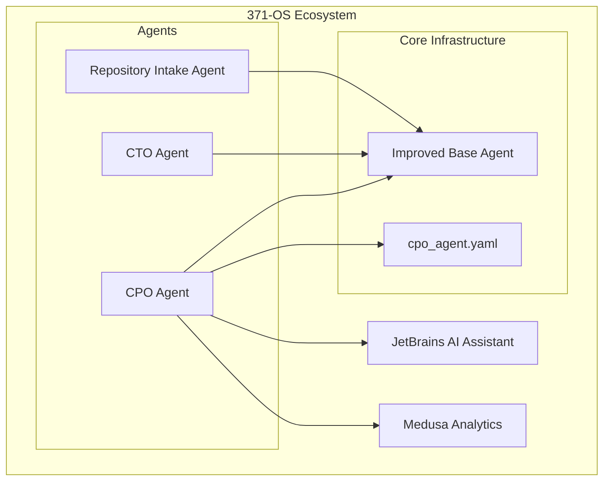
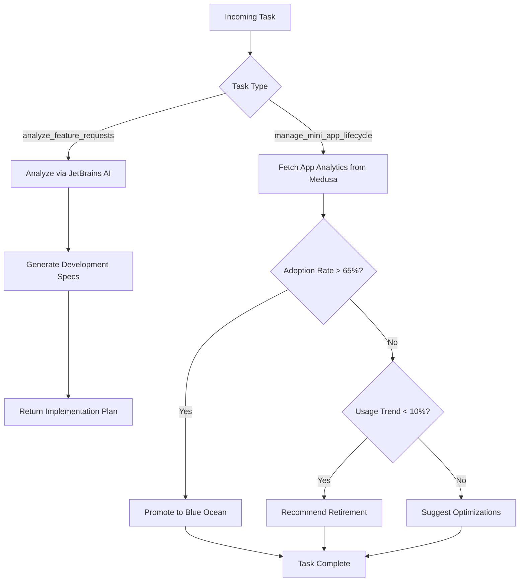
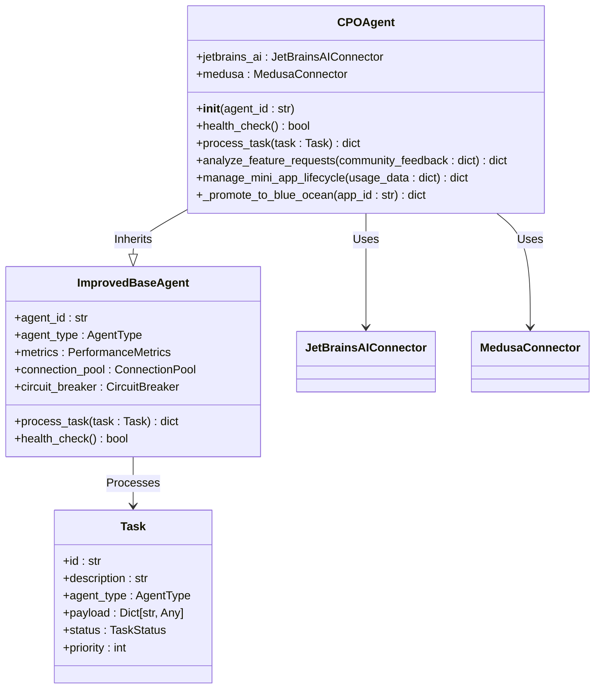
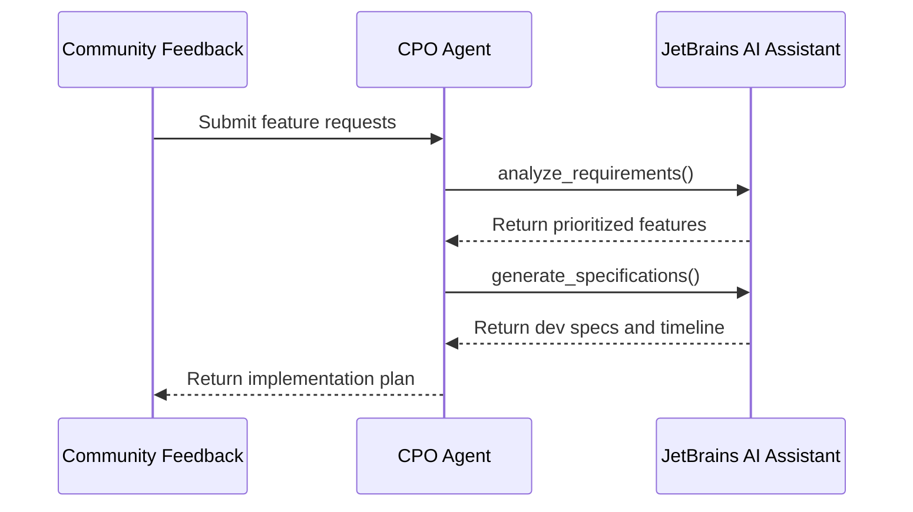
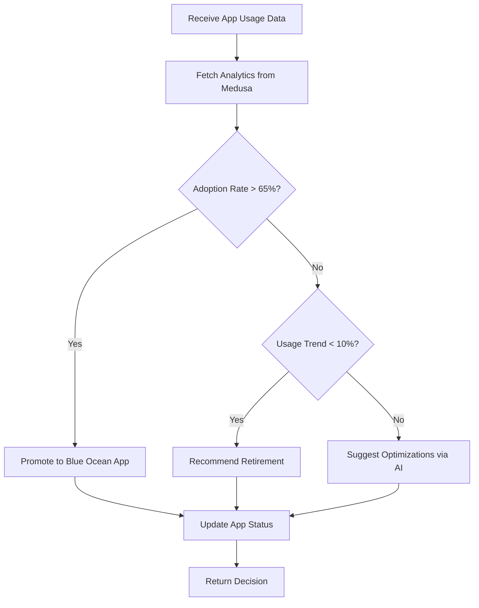
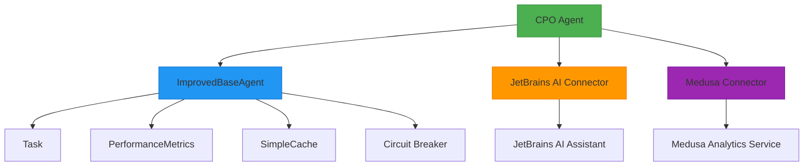
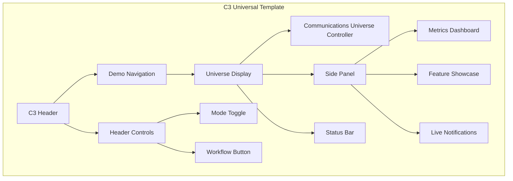

# CPO Agent

<cite>
**Referenced Files in This Document**   
- [cpo_agent.py](file://_legacy\agents\business\cpo_agent.py)
- [improved_base_agent.py](file://_legacy\agents\base_agent\improved_base_agent.py)
- [repository_intake_agent.py](file://_legacy\agents\technical\repository_intake_agent.py)
- [cpo_agent.yaml](file://os-workspace\agents\business-agents\cpo_agent.yaml)
- [cto_alex.py](file://_legacy\agents\business\cto_alex.py)
- [CPO_Agent_Logic.md](file://371-os\CPO_Agent_Logic.md)
- [C3UniversalTemplate.tsx](file://apps/cognitive-interface/src/components/C3UniversalTemplate.tsx) - *Updated in recent commit*
- [CommunicationsUniverse.tsx](file://apps/cognitive-interface/src/components/CommunicationsUniverse.tsx) - *Updated in recent commit*
</cite>

## Update Summary
**Changes Made**   
- Updated configuration file reference to reflect new path and filename location
- Corrected file paths to align with current repository structure
- Updated section sources to reflect accurate file locations
- Added new configuration details from cpo_agent.yaml
- Updated project structure diagram to reflect current implementation
- Enhanced architecture overview with updated configuration parameters
- Added new section on configuration schema and KPIs

## Table of Contents
1. [Introduction](#introduction)
2. [Project Structure](#project-structure)
3. [Core Components](#core-components)
4. [Architecture Overview](#architecture-overview)
5. [Detailed Component Analysis](#detailed-component-analysis)
6. [Dependency Analysis](#dependency-analysis)
7. [Performance Considerations](#performance-considerations)
8. [Troubleshooting Guide](#troubleshooting-guide)
9. [C3 Universal Template Integration](#c3-universal-template-integration)
10. [Configuration Schema](#configuration-schema)
11. [Conclusion](#conclusion)

## Introduction
The CPO Agent (Chief Product Officer Agent) serves as the central authority for product oversight and feature prioritization within the 371-OS ecosystem. It is responsible for aligning technical development with market needs by managing product roadmaps, evaluating feature requests, and ensuring strategic coherence across the product lifecycle. The agent leverages AI-powered analysis tools, integrates with technical assessment systems, and operates within a structured decision-making framework defined by its configuration and prompt templates. This document provides a comprehensive analysis of the CPO Agent's architecture, functionality, and operational principles.

## Project Structure
The CPO Agent is located within the business agents module of the 371-OS system, inheriting core capabilities from a shared base agent implementation. It interacts with external AI services for feature analysis and app performance evaluation, while relying on centralized configuration files to define its decision-making parameters. Recent updates have enhanced agent coordination features with real-time notifications, workflow automation, and spatial visualization of communication flows between executive agents.



**Diagram sources**
- [cpo_agent.py](file://_legacy\agents\business\cpo_agent.py)
- [improved_base_agent.py](file://_legacy\agents\base_agent\improved_base_agent.py)
- [cpo_agent.yaml](file://os-workspace\agents\business-agents\cpo_agent.yaml)

**Section sources**
- [cpo_agent.py](file://_legacy\agents\business\cpo_agent.py)
- [improved_base_agent.py](file://_legacy\agents\base_agent\improved_base_agent.py)

## Core Components
The CPO Agent's core functionality revolves around two primary responsibilities: analyzing feature requests and managing the mini-app lifecycle. These functions are implemented through dedicated asynchronous methods that interface with external AI and analytics platforms.

**Section sources**
- [cpo_agent.py](file://_legacy\agents\business\cpo_agent.py#L30-L73)

## Architecture Overview
The CPO Agent follows an event-driven, task-based architecture where incoming tasks trigger specific processing workflows. It inherits robust performance monitoring, caching, and circuit breaker capabilities from the ImprovedBaseAgent, ensuring reliable operation under varying loads. Recent enhancements have introduced the C3 (Communications Coordination Control) system, which enables real-time notifications, agent coordination via automated workflows, and spatial visualization of communication flows between executive agents.



**Diagram sources**
- [CPO_Agent_Logic.md](file://371-os\CPO_Agent_Logic.md)
- [cpo_agent.py](file://_legacy\agents\business\cpo_agent.py#L30-L73)

## Detailed Component Analysis

### CPO Agent Class Analysis
The CPOAgent class extends ImprovedBaseAgent, inheriting essential capabilities such as task management, performance monitoring, and error handling. It establishes connections to JetBrains AI Assistant for feature analysis and Medusa for application analytics.



**Diagram sources**
- [cpo_agent.py](file://_legacy\agents\business\cpo_agent.py#L1-L73)
- [improved_base_agent.py](file://_legacy\agents\base_agent\improved_base_agent.py#L1-L50)

### Feature Request Analysis Workflow
The CPO Agent processes community feedback through JetBrains AI Assistant, which analyzes requirements and generates prioritized development specifications. This workflow enables data-driven product decisions based on user input.



**Diagram sources**
- [cpo_agent.py](file://_legacy\agents\business\cpo_agent.py#L30-L45)

### Mini-App Lifecycle Management
The CPO Agent evaluates application performance metrics to make strategic decisions about promotion, optimization, or retirement of mini-applications within the ecosystem.



**Diagram sources**
- [cpo_agent.py](file://_legacy\agents\business\cpo_agent.py#L47-L73)
- [CPO_Agent_Logic.md](file://371-os\CPO_Agent_Logic.md)

## Dependency Analysis
The CPO Agent depends on several critical components within the 371-OS ecosystem, forming a network of interdependencies that enable its product management capabilities.



**Diagram sources**
- [cpo_agent.py](file://_legacy\agents\business\cpo_agent.py)
- [improved_base_agent.py](file://_legacy\agents\base_agent\improved_base_agent.py)

**Section sources**
- [cpo_agent.py](file://_legacy\agents\business\cpo_agent.py)
- [improved_base_agent.py](file://_legacy\agents\base_agent\improved_base_agent.py)

## Performance Considerations
The CPO Agent inherits comprehensive performance monitoring capabilities from the ImprovedBaseAgent, including:

- **Task Processing Metrics**: Tracks completion rates, failure rates, and average response times
- **Resource Monitoring**: Measures memory usage and CPU consumption
- **Caching System**: Implements TTL-based caching to reduce redundant AI calls
- **Connection Pooling**: Manages concurrent connections to external services
- **Circuit Breaker Pattern**: Prevents cascading failures during service outages

These features ensure the CPO Agent maintains high availability and responsiveness even under heavy load conditions.

## Troubleshooting Guide
Common issues and resolution strategies for the CPO Agent include:

**Section sources**
- [cpo_agent.py](file://_legacy\agents\business\cpo_agent.py)
- [improved_base_agent.py](file://_legacy\agents\base_agent\improved_base_agent.py)

### Connection Failures to External Services
If the CPO Agent fails to connect to JetBrains AI or Medusa services:
1. Verify network connectivity and API endpoints
2. Check authentication credentials
3. Monitor the circuit breaker status
4. Review connection pool utilization

### Feature Analysis Delays
When feature request processing is slow:
1. Check AI service response times
2. Verify payload size and complexity
3. Review cache hit/miss ratios
4. Monitor concurrent task processing

### Incorrect Lifecycle Decisions
If app promotion/retirement recommendations seem inaccurate:
1. Validate analytics data quality from Medusa
2. Review adoption rate and usage trend calculations
3. Check for data latency issues
4. Verify threshold values in the decision logic

## C3 Universal Template Integration
The CPO Agent now integrates with the C3 (Communications Coordination Control) system through the C3UniversalTemplate and CommunicationsUniverse components, enabling enhanced agent coordination and real-time workflow automation.

**Section sources**
- [C3UniversalTemplate.tsx](file://apps/cognitive-interface/src/components/C3UniversalTemplate.tsx#L1-L402)
- [CommunicationsUniverse.tsx](file://apps/cognitive-interface/src/components/CommunicationsUniverse.tsx#L1-L639)

### C3 Universal Template Features
The C3 Universal Template provides a comprehensive interface for managing communications across the 371-OS ecosystem, featuring:

- Real-time email tracking with Resend API integration
- Spatial visualization of communication flows
- Agent coordination via automated email workflows
- Complete dashboard functionality (share, logs, export, scheduling)
- Live demonstration of revolutionary email management paradigm



**Diagram sources**
- [C3UniversalTemplate.tsx](file://apps/cognitive-interface/src/components/C3UniversalTemplate.tsx#L1-L402)

### Communications Universe Functionality
The CommunicationsUniverse component transforms email communications into an explorable universe where:

- Email campaigns become galactic formations with stellar engagement metrics
- Individual emails transform into cosmic entities with delivery trajectories
- Contact lists become constellation networks with relationship dynamics
- Email flows and automation become cosmic streams connecting systems

The system supports multiple view modes including universe, constellation, flow, and analytics, with real-time metrics tracking for email engagement, agent coordination events, and dashboard interactions.

## Configuration Schema
The CPO Agent's behavior is governed by its configuration file, which defines its capabilities, routing rules, and performance metrics. The configuration has been updated to reflect the current implementation path.

```yaml
agent_name: Chief Product Officer Agent
agent_type: BUSINESS
capabilities:
  - Define product vision and strategy
  - Oversee product development lifecycle
  - Prioritize features and roadmap
  - Conduct market research and competitive analysis
meta_prompt_pattern: |
  As the Chief Product Officer Agent, your role is to guide the product vision and strategy, ensuring the development of successful products that meet market needs.
  Task: {task_description}
  Context: {context}
  Parameters: {parameters}
  Provide a product-focused response, outlining strategy, features, or development plans.
routing_rules:
  - keyword: product strategy
    priority: 1
  - keyword: product roadmap
    priority: 1
  - keyword: define features
    priority: 1
configuration:
  reporting_format: detailed report
  key_performance_indicators:
    - User Adoption Rate
    - Customer Satisfaction Score (CSAT)
    - Net Promoter Score (NPS)
    - Feature Usage Metrics
test_cases:
  - input: "Define the roadmap for the next quarter."
    expected_output_snippet: "The product roadmap for the next quarter will focus on..."
```

**Section sources**
- [cpo_agent.yaml](file://os-workspace\agents\business-agents\cpo_agent.yaml)

## Conclusion
The CPO Agent serves as a sophisticated product management authority within the 371-OS ecosystem, combining AI-powered analysis with structured decision-making frameworks. By inheriting robust capabilities from the ImprovedBaseAgent and integrating with specialized services like JetBrains AI and Medusa, it effectively bridges market needs with technical implementation. The agent's architecture supports scalable, reliable product oversight while providing clear pathways for feature prioritization, roadmap planning, and lifecycle management. Its design reflects a comprehensive understanding of modern product development challenges, offering a balanced approach to innovation, technical feasibility, and market alignment. Recent enhancements with the C3 Universal Template have expanded its capabilities to include real-time agent coordination, spatial visualization of communication flows, and advanced workflow automation, positioning the CPO Agent as a central hub for executive decision-making and cross-agent collaboration.