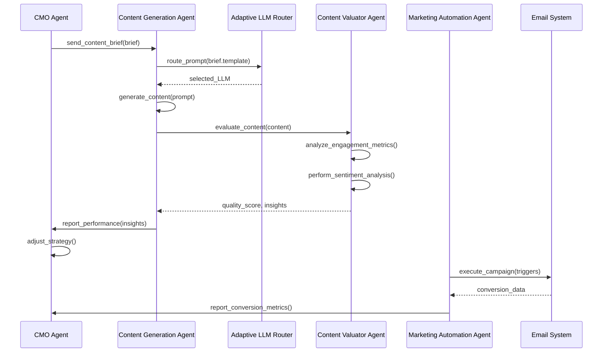
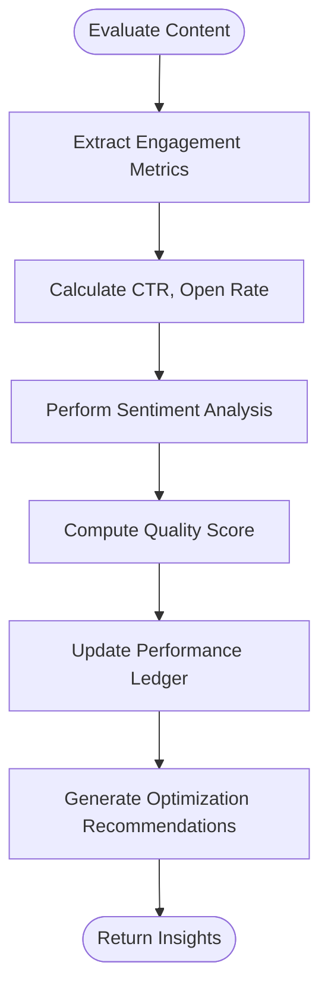
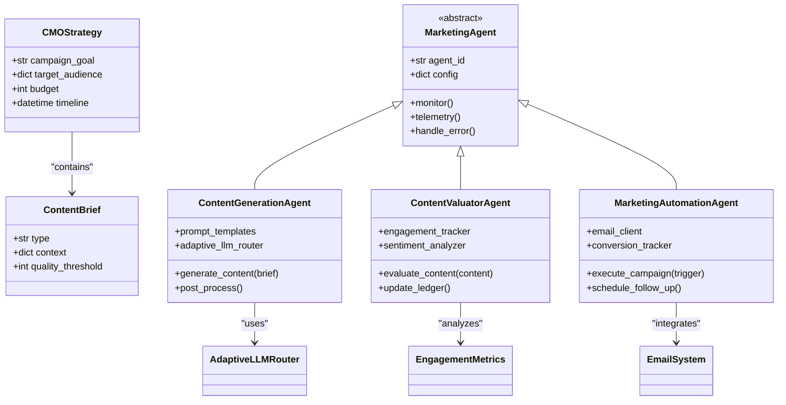

# Marketing Agents

<cite>
**Referenced Files in This Document**   
- [cmo_agent.py](file://371-os/src/minds371/agents/business/cmo_agent.py)
- [content_generation_agent.py](file://371-os/src/minds371/agents/marketing/content_generation_agent.py)
- [content_valuator_agent.py](file://371-os/src/minds371/agents/marketing/content_valuator_agent.py)
- [marketing_automation_agent.py](file://371-os/src/minds371/agents/marketing/marketing_automation_agent.py)
- [base_agent.py](file://371-os/src/minds371/agents/base_agent/base_agent.py)
- [policy_engine.py](file://371-os/src/minds371/adaptive_llm_router/policy_engine.py)
- [CMO_Marketing_Agent_Logic.md](file://371-os/CMO_Marketing_Agent_Logic.md)
- [email-automation](file://371-os/src/minds371/services/email_system/config/email-automation)
- [agent-backstory-template.json](file://questflow/agents/templates/agent-backstory-template.json) - *Updated in recent commit*
- [README.md](file://questflow/agents/README.md) - *Updated in recent commit*
</cite>

## Update Summary
**Changes Made**   
- Updated agent structure description to reflect migration to full backstory format
- Added details on enhanced agent capabilities including bio, lore, knowledge domains, and communication styles
- Updated section sources to reflect new documentation files and templates
- Incorporated new benefits of full backstory format for marketing agents
- Added guidance on creating new agents using the standardized template

## Table of Contents
1. [Introduction](#introduction)
2. [Project Structure](#project-structure)
3. [Core Components](#core-components)
4. [Architecture Overview](#architecture-overview)
5. [Detailed Component Analysis](#detailed-component-analysis)
6. [Dependency Analysis](#dependency-analysis)
7. [Performance Considerations](#performance-considerations)
8. [Troubleshooting Guide](#troubleshooting-guide)
9. [Conclusion](#conclusion)

## Introduction
The Marketing Agents within the 371-OS ecosystem are a suite of AI-driven components designed to automate and optimize the marketing content lifecycle. These agents work in concert to generate, evaluate, and deploy marketing campaigns with minimal human intervention. The system leverages strategic inputs from the CMO Agent to guide content creation, uses the Adaptive LLM Router for optimal language model selection, and integrates tightly with the email_system for cross-company nurturing workflows. This document provides a comprehensive overview of the marketing agent subsystem, detailing their roles, interactions, and implementation specifics.

## Project Structure
The marketing agents are organized within the `src/minds371/agents` directory, following a modular structure that separates concerns by functional domain. The key directories include `business` for executive agents like the CMO, `marketing` for content-specific agents, and `base_agent` for foundational agent functionality. The `adaptive_llm_router` module supports dynamic LLM selection and cost management, while the `services/email_system` handles campaign delivery and tracking.

```mermaid
graph TB
subgraph "Agents"
CMO[cmo_agent.py]
CG[content_generation_agent.py]
CV[content_valuator_agent.py]
MA[marketing_automation_agent.py]
BA[base_agent.py]
end
subgraph "Support Systems"
ALR[adaptive_llm_router]
ES[Email System]
PE[policy_engine.py]
end
CMO --> CG : "Provides strategy"
CG --> CV : "Sends content for evaluation"
CV --> CMO : "Returns performance insights"
MA --> ES : "Executes campaigns"
CG --> ALR : "Uses Adaptive LLM Router"
MA --> PE : "Enforces cost policies"
BA -.-> All : "Base functionality"
```

**Diagram sources**
- [cmo_agent.py](file://371-os/src/minds371/agents/business/cmo_agent.py)
- [content_generation_agent.py](file://371-os/src/minds371/agents/marketing/content_generation_agent.py)
- [content_valuator_agent.py](file://371-os/src/minds371/agents/marketing/content_valuator_agent.py)
- [marketing_automation_agent.py](file://371-os/src/minds371/agents/marketing/marketing_automation_agent.py)
- [base_agent.py](file://371-os/src/minds371/agents/base_agent/base_agent.py)

**Section sources**
- [cmo_agent.py](file://371-os/src/minds371/agents/business/cmo_agent.py)
- [content_generation_agent.py](file://371-os/src/minds371/agents/marketing/content_generation_agent.py)

## Core Components
The marketing agent ecosystem consists of four primary components: the Content Generation Agent, Content Valuator Agent, Marketing Automation Agent, and the CMO Agent. These components work in a closed-loop system where strategic direction flows from the CMO Agent to content creation, evaluation feeds insights back into strategy, and automation handles execution. All agents inherit from the base_agent model, ensuring consistent monitoring and telemetry across the system.

**Section sources**
- [cmo_agent.py](file://371-os/src/minds371/agents/business/cmo_agent.py#L1-L50)
- [content_generation_agent.py](file://371-os/src/minds371/agents/marketing/content_generation_agent.py#L1-L40)
- [base_agent.py](file://371-os/src/minds371/agents/base_agent/base_agent.py#L1-L30)

## Architecture Overview
The marketing agents operate within a hierarchical architecture where the CMO Agent serves as the strategic orchestrator. It receives high-level business goals and translates them into specific content briefs for the Content Generation Agent. This agent uses prompt templates and the Adaptive LLM Router to produce marketing copy, which is then evaluated by the Content Valuator Agent using engagement metrics and sentiment analysis. High-performing content is cached and used for A/B testing, while insights are fed back to the CMO Agent for strategy refinement. The Marketing Automation Agent handles campaign execution through the email_system, triggering workflows based on user behavior and tracking conversions.



**Diagram sources**
- [cmo_agent.py](file://371-os/src/minds371/agents/business/cmo_agent.py)
- [content_generation_agent.py](file://371-os/src/minds371/agents/marketing/content_generation_agent.py)
- [content_valuator_agent.py](file://371-os/src/minds371/agents/marketing/content_valuator_agent.py)
- [marketing_automation_agent.py](file://371-os/src/minds371/agents/marketing/marketing_automation_agent.py)

## Detailed Component Analysis

### Content Generation Agent
The Content Generation Agent is responsible for producing high-quality marketing copy based on strategic inputs from the CMO Agent. It utilizes prompt templates stored in the `prompts/marketing_agents/` directory and leverages the Adaptive LLM Router to select the most appropriate language model based on content type, quality requirements, and cost constraints.

```python
# Example invocation pattern
def generate_marketing_content(self, brief: ContentBrief) -> str:
    try:
        template = self.load_prompt_template(brief.type)
        prompt = template.format(**brief.context)
        llm_response = self.llm_router.route(prompt, brief.quality_threshold)
        return self.post_process(llm_response)
    except Exception as e:
        self.handle_error(e, "Content generation failed")
        return self.get_fallback_content(brief.type)
```

The agent implements robust error recovery by maintaining a library of fallback content templates and using circuit breaker patterns to prevent cascading failures during LLM outages.

**Section sources**
- [content_generation_agent.py](file://371-os/src/minds371/agents/marketing/content_generation_agent.py#L45-L120)
- [adaptive_llm_router.py](file://371-os/src/minds371/adaptive_llm_router/adaptive_llm_router.py#L30-L80)

### Content Valuator Agent
The Content Valuator Agent evaluates content effectiveness using a multi-dimensional scoring system that combines engagement metrics (open rates, click-through rates, conversion rates) with sentiment analysis of user feedback. It maintains a performance ledger that tracks content variants and their historical performance, enabling data-driven optimization.



The agent uses a weighted scoring algorithm where recent performance carries more weight than historical data, allowing for rapid adaptation to changing market conditions.

**Diagram sources**
- [content_valuator_agent.py](file://371-os/src/minds371/agents/marketing/content_valuator_agent.py#L25-L90)

**Section sources**
- [content_valuator_agent.py](file://371-os/src/minds371/agents/marketing/content_valuator_agent.py#L1-L100)

### Marketing Automation Agent
The Marketing Automation Agent integrates with the email_system to execute trigger-based campaigns and track conversions. It supports cross-company nurturing workflows through configurable sequences defined in YAML files within the `config/email-automation/` directory.

```python
# Example of campaign execution
def execute_campaign(self, trigger_event: str):
    sequence = self.load_sequence(trigger_event)
    for step in sequence:
        if self.evaluate_conditions(step.conditions):
            self.send_email(step.template, step.recipients)
            self.schedule_follow_up(step.delay, step.next_step)
    self.track_conversion()
```

The agent implements idempotency to prevent duplicate message delivery and uses exponential backoff for retry logic in case of email system failures.

**Section sources**
- [marketing_automation_agent.py](file://371-os/src/minds371/agents/marketing/marketing_automation_agent.py#L60-L150)
- [sequences.yaml](file://371-os/src/minds371/services/email_system/config/email-automation/sequences.yaml)

## Dependency Analysis
The marketing agents form a tightly coupled system with well-defined interfaces. The CMO Agent depends on the Content Generation Agent for execution of marketing strategies, while the Content Valuator Agent provides feedback to close the optimization loop. All agents depend on the base_agent for monitoring and telemetry capabilities.



**Diagram sources**
- [base_agent.py](file://371-os/src/minds371/agents/base_agent/base_agent.py#L15-L45)
- [content_generation_agent.py](file://371-os/src/minds371/agents/marketing/content_generation_agent.py#L10-L35)
- [content_valuator_agent.py](file://371-os/src/minds371/agents/marketing/content_valuator_agent.py#L10-L30)
- [marketing_automation_agent.py](file://371-os/src/minds371/agents/marketing/marketing_automation_agent.py#L10-L35)

**Section sources**
- [base_agent.py](file://371-os/src/minds371/agents/base_agent/base_agent.py#L1-L80)
- [content_generation_agent.py](file://371-os/src/minds371/agents/marketing/content_generation_agent.py#L1-L60)

## Performance Considerations
The marketing agent system incorporates several performance optimization strategies. The Adaptive LLM Router's policy_engine enforces cost controls by selecting the most cost-effective LLM for each task while maintaining quality thresholds. High-performing content variants are cached to reduce redundant LLM calls, and A/B testing is integrated to systematically identify optimal content.

For automation workflows, the system implements batch processing of email campaigns and uses connection pooling for database operations. The base_agent model includes built-in telemetry that monitors response times, error rates, and resource utilization, enabling proactive performance management.

**Section sources**
- [policy_engine.py](file://371-os/src/minds371/adaptive_llm_router/policy_engine.py#L20-L75)
- [base_agent.py](file://371-os/src/minds371/agents/base_agent/base_agent.py#L100-L150)

## Troubleshooting Guide
Common issues in the marketing agent system include low-engagement content generation and automation pipeline failures. For low engagement, verify that the CMO Agent's strategy aligns with current market conditions and check the Content Valuator Agent's performance ledger for historical trends.

For automation failures:
1. Check the Marketing Automation Agent's logs for email system connectivity issues
2. Verify trigger conditions are properly configured in sequences.yaml
3. Ensure the email_system service is running and accessible
4. Review rate limiting policies that may be blocking campaign execution

Error recovery strategies include fallback content templates, circuit breakers for external service calls, and automatic retry with exponential backoff for transient failures.

**Section sources**
- [content_generation_agent.py](file://371-os/src/minds371/agents/marketing/content_generation_agent.py#L200-L250)
- [marketing_automation_agent.py](file://371-os/src/minds371/agents/marketing/marketing_automation_agent.py#L180-L230)
- [base_agent.py](file://371-os/src/minds371/agents/base_agent/base_agent.py#L50-L90)

## Conclusion
The Marketing Agents in the 371-OS ecosystem represent a sophisticated, closed-loop system for AI-driven campaign execution and content lifecycle management. By integrating strategic direction, content generation, performance evaluation, and automated execution, these agents enable rapid iteration and optimization of marketing initiatives. The architecture's modular design, robust error handling, and performance optimizations make it a scalable solution for enterprise marketing operations. Recent enhancements through the migration to full backstory format have improved agent context, consistency, and domain expertise, further strengthening the system's capabilities.

**Section sources**
- [agent-backstory-template.json](file://questflow/agents/templates/agent-backstory-template.json) - *Updated in recent commit*
- [README.md](file://questflow/agents/README.md) - *Updated in recent commit*