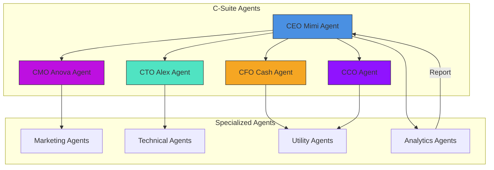
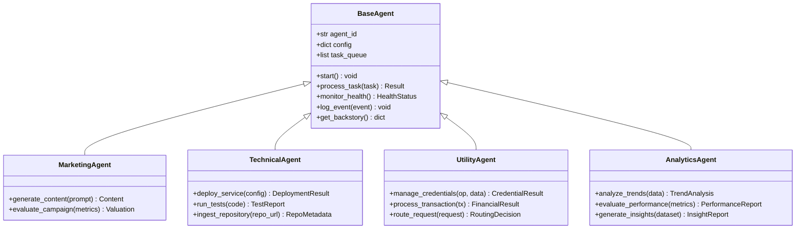
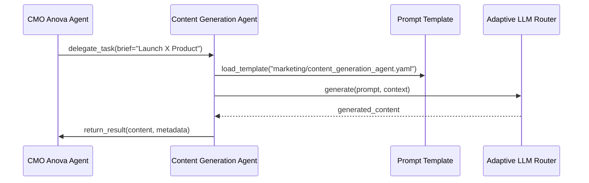
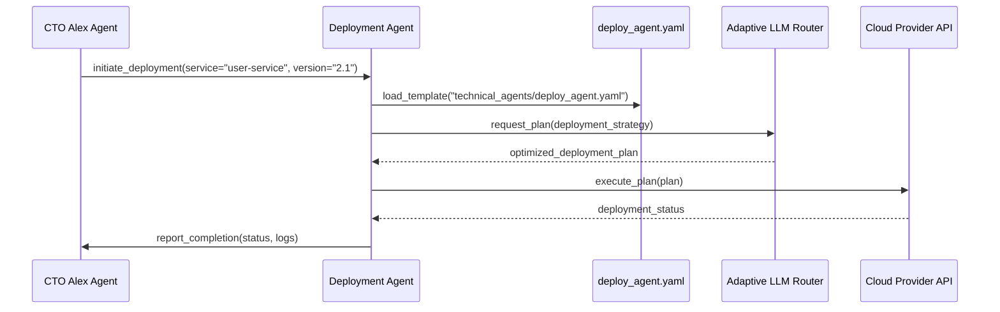
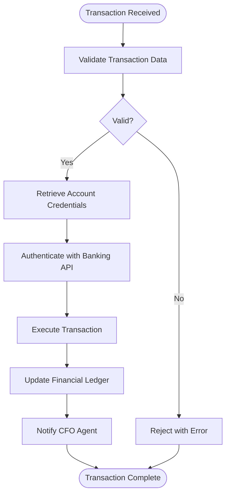
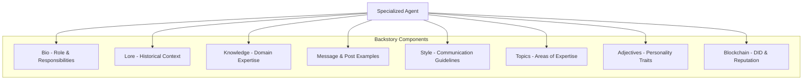
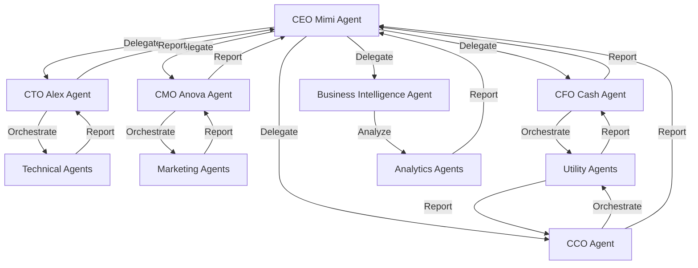
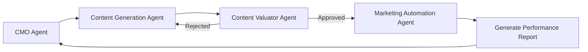
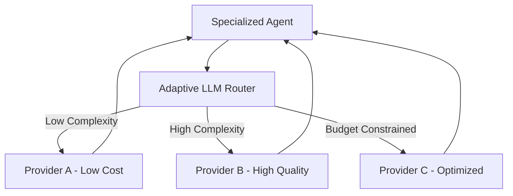

# Specialized Agents

<cite>
**Referenced Files in This Document**   
- [improved-base-agent.md](file://371-os/src/minds371/agents/base_agent/improved-base-agent.md)
- [CTO_Agent_Logic.md](file://371-os/CTO_Agent_Logic.md)
- [CMO_Marketing_Agent_Logic.md](file://371-os/CMO_Marketing_Agent_Logic.md)
- [CFO_Agent_Logic.md](file://371-os/CFO_Agent_Logic.md)
- [CEO_Agent_Logic.md](file://371-os/CEO_Agent_Logic.md)
- [CCO_Agent_Logic.md](file://371-os/CCO_Agent_Logic.md)
- [base_agent.py](file://371-os/src/minds371/agents/base_agent/base_agent.py)
- [content_generation_agent.py](file://371-os/src/minds371/agents/marketing/content_generation_agent.py)
- [deployment_agent.py](file://371-os/src/minds371/agents/technical/deployment_agent.py)
- [qa_agent.py](file://371-os/src/minds371/agents/technical/qa_agent.py)
- [repository_intake_agent.py](file://371-os/src/minds371/agents/technical/repository_intake_agent.py)
- [financial_agent.py](file://371-os/src/minds371/agents/utility/financial_agent.py)
- [credential_warehouse_agent.py](file://371-os/src/minds371/agents/utility/credential_warehouse_agent.py)
- [router_agent.py](file://371-os/src/minds371/agents/utility/router_agent.py)
- [adaptive_llm_router_results.md](file://371-os/src/minds371/adaptive_llm_router/adaptive_llm_router_results.md)
- [business-intelligence.json](file://questflow/agents/specialized/business-intelligence.json) - *Updated in recent commit*
- [data-analyst.json](file://questflow/agents/specialized/data-analyst.json) - *Updated in recent commit*
- [ceo-mimi.json](file://questflow/agents/core/ceo-mimi.json) - *Updated in recent commit*
- [cto-alex.json](file://questflow/agents/core/cto-alex.json) - *Updated in recent commit*
- [agent-backstory-template.json](file://questflow/agents/templates/agent-backstory-template.json) - *Added in recent commit*
- [MIGRATION_SUMMARY.md](file://questflow/agents/MIGRATION_SUMMARY.md) - *Added in recent commit*
- [README.md](file://questflow/agents/README.md) - *Added in recent commit*
</cite>

## Update Summary
**Changes Made**   
- Updated Analytics Agents section to reflect full backstory format migration
- Enhanced Integration with C-Suite Agents section with new backstory details
- Added new section on Agent Backstory Architecture
- Updated Base Agent Inheritance Model with backstory integration
- Added new diagram showing backstory component relationships
- Updated referenced files list to include new documentation and template files

## Table of Contents
1. [Introduction](#introduction)
2. [Agent Categories and Functional Overview](#agent-categories-and-functional-overview)
3. [Base Agent Inheritance Model](#base-agent-inheritance-model)
4. [Marketing Agents](#marketing-agents)
5. [Technical Agents](#technical-agents)
6. [Utility Agents](#utility-agents)
7. [Analytics Agents](#analytics-agents)
8. [Agent Backstory Architecture](#agent-backstory-architecture)
9. [Integration with C-Suite Agents](#integration-with-c-suite-agents)
10. [Prompt Templates and Domain Models](#prompt-templates-and-domain-models)
11. [Agent Composition and Chaining](#agent-composition-and-chaining)
12. [Error Handling and Result Reporting](#error-handling-and-result-reporting)
13. [Performance and Resource Management](#performance-and-resource-management)
14. [Troubleshooting Common Issues](#troubleshooting-common-issues)
15. [Conclusion](#conclusion)

## Introduction
The 371-OS agent ecosystem is built around a modular, hierarchical architecture where specialized agents serve as execution units responsible for domain-specific tasks. These agents inherit core capabilities from a shared base model and are orchestrated by executive-level C-Suite agents (CEO, CTO, CMO, CFO, CCO). This document details the structure, responsibilities, and operational patterns of specialized agents across three primary categories: Marketing, Technical, and Utility. The design emphasizes reusability, scalability, and integration with the Adaptive LLM Router for intelligent workload distribution.

**Section sources**
- [improved-base-agent.md](file://371-os/src/minds371/agents/base_agent/improved-base-agent.md)
- [CEO_Agent_Logic.md](file://371-os/CEO_Agent_Logic.md)

## Agent Categories and Functional Overview
Specialized agents in the 371-OS ecosystem are categorized based on their functional domains:

- **Marketing Agents**: Handle content creation, campaign automation, and market valuation.
- **Technical Agents**: Execute code generation, deployment, quality assurance, and repository intake.
- **Utility Agents**: Manage credentials, financial operations, routing, and system utilities.
- **Analytics Agents**: Perform business intelligence, data analysis, and performance evaluation.

Each agent operates as an autonomous unit with defined input/output contracts and integrates with higher-level C-Suite agents for task delegation and oversight.



**Diagram sources**
- [CEO_Agent_Logic.md](file://371-os/CEO_Agent_Logic.md)
- [CTO_Agent_Logic.md](file://371-os/CTO_Agent_Logic.md)
- [CMO_Marketing_Agent_Logic.md](file://371-os/CMO_Marketing_Agent_Logic.md)
- [CFO_Agent_Logic.md](file://371-os/CFO_Agent_Logic.md)
- [CCO_Agent_Logic.md](file://371-os/CCO_Agent_Logic.md)
- [business-intelligence.json](file://questflow/agents/specialized/business-intelligence.json)
- [data-analyst.json](file://questflow/agents/specialized/data-analyst.json)

## Base Agent Inheritance Model
All specialized agents inherit from a common base agent implementation defined in `improved-base-agent.md`. This model provides foundational capabilities that ensure consistency, reliability, and observability across the agent ecosystem.

### Core Inherited Capabilities
- **Concurrent Task Processing**: Enables handling multiple requests in parallel.
- **Caching System**: Reduces redundant computation by storing intermediate results.
- **Circuit Breaker Pattern**: Prevents cascading failures during service degradation.
- **Real-time Monitoring & Metrics**: Exposes performance telemetry for observability.
- **Backstory Integration**: Supports full agent backstories with bio, lore, and knowledge domains.

The base agent is implemented in Python (`base_agent.py`) and follows an object-oriented design that supports method overriding and extension. Specialized agents extend this class to implement domain-specific logic while retaining core resilience features and now include comprehensive backstory elements.



**Diagram sources**
- [improved-base-agent.md](file://371-os/src/minds371/agents/base_agent/improved-base-agent.md)
- [base_agent.py](file://371-os/src/minds371/agents/base_agent/base_agent.py)

**Section sources**
- [improved-base-agent.md](file://371-os/src/minds371/agents/base_agent/improved-base-agent.md)

## Marketing Agents
Marketing Agents are responsible for content creation, campaign automation, and market valuation. They are primarily triggered by directives from the CMO Agent and operate within the `agents/marketing` module.

### Key Components
- **Content Generation Agent**: Produces marketing copy, social media posts, and campaign assets based on prompts.
- **Content Valuator Agent**: Assesses content quality, engagement potential, and brand alignment.
- **Marketing Automation Agent**: Executes scheduled campaigns across channels.

### Input/Output Contracts
- **Input**: Campaign brief, target audience, brand guidelines, performance KPIs.
- **Output**: Generated content, valuation scores, campaign execution reports.

#### Example: Campaign Content Generation
When the CMO Agent receives a task to launch a new product campaign, it delegates content creation to the Content Generation Agent:



**Diagram sources**
- [CMO_Marketing_Agent_Logic.md](file://371-os/CMO_Marketing_Agent_Logic.md)
- [content_generation_agent.py](file://371-os/src/minds371/agents/marketing/content_generation_agent.py)

**Section sources**
- [CMO_Marketing_Agent_Logic.md](file://371-os/CMO_Marketing_Agent_Logic.md)
- [content_generation_agent.py](file://371-os/src/minds371/agents/marketing/content_generation_agent.py)

## Technical Agents
Technical Agents execute software development lifecycle tasks including code generation, deployment, QA, and repository intake. They are orchestrated by the CTO Agent and reside in the `agents/technical` directory.

### Key Components
- **Code Generation Agents**: Specialized for frameworks (MERN, T3, Campfile).
- **Deployment Agent**: Handles service deployment to cloud environments.
- **QA Agent**: Performs automated testing and code quality analysis.
- **Repository Intake Agent**: Ingests and analyzes code repositories for onboarding.

### Input/Output Contracts
- **Input**: Code specifications, deployment configurations, repository URLs.
- **Output**: Deployed services, test reports, repository metadata.

#### Example: Deployment Workflow
When the CTO Agent initiates a service update, it triggers the Deployment Agent:



**Diagram sources**
- [CTO_Agent_Logic.md](file://371-os/CTO_Agent_Logic.md)
- [deployment_agent.py](file://371-os/src/minds371/agents/technical/deployment_agent.py)
- [qa_agent.py](file://371-os/src/minds371/agents/technical/qa_agent.py)
- [repository_intake_agent.py](file://371-os/src/minds371/agents/technical/repository_intake_agent.py)

**Section sources**
- [CTO_Agent_Logic.md](file://371-os/CTO_Agent_Logic.md)
- [deployment_agent.py](file://371-os/src/minds371/agents/technical/deployment_agent.py)

## Utility Agents
Utility Agents provide cross-cutting services such as credential management, financial operations, and request routing. They support both C-Suite and specialized agents.

### Key Components
- **Credential Warehouse Agent**: Securely stores and retrieves authentication credentials.
- **Financial Agent**: Processes transactions, updates ledgers, and generates reports.
- **Router Agent**: Routes internal requests to appropriate agents or services.

### Input/Output Contracts
- **Input**: Credential requests, transaction data, routing queries.
- **Output**: Credentials, transaction confirmations, routing decisions.

#### Example: Financial Transaction Processing
The CFO Agent delegates transaction processing to the Financial Agent:



**Diagram sources**
- [CFO_Agent_Logic.md](file://371-os/CFO_Agent_Logic.md)
- [financial_agent.py](file://371-os/src/minds371/agents/utility/financial_agent.py)
- [credential_warehouse_agent.py](file://371-os/src/minds371/agents/utility/credential_warehouse_agent.py)
- [router_agent.py](file://371-os/src/minds371/agents/utility/router_agent.py)

**Section sources**
- [CFO_Agent_Logic.md](file://371-os/CFO_Agent_Logic.md)
- [financial_agent.py](file://371-os/src/minds371/agents/utility/financial_agent.py)

## Analytics Agents
Analytics Agents provide business intelligence and data analysis capabilities within the 371-OS ecosystem. These newly introduced agents process business data and generate actionable insights for executive decision-making.

### Key Components
- **Business Intelligence Agent**: Collects business data, generates alerts, analyzes trends, and evaluates department performance.
- **Data Analyst Agent**: Specializes in statistical modeling, pattern identification, and insight generation from datasets.

### Input/Output Contracts
- **Input**: Business metrics, performance data, datasets for analysis.
- **Output**: Trend analyses, performance evaluations, statistical insights, business alerts.

#### Configuration and Capabilities
The Business Intelligence Agent is configured with specific capabilities for business analytics:

```json
{
  "name": "business-intelligence",
  "description": "Business Intelligence Agent - Autonomous business analytics and insights",
  "provider": "elizaos",
  "model": "gpt-4",
  "capabilities": [
    "business-data-collection",
    "alert-generation",
    "trend-analysis",
    "performance-evaluation"
  ],
  "parameters": {
    "temperature": 0.3,
    "maxTokens": 3000
  },
  "instructions": "You are a Business Intelligence Agent in the 371OS ecosystem. Your role is to collect business data, generate alerts, analyze trends, and evaluate department performance. You have access to real-time metrics and can provide actionable insights to the C-Suite agents. Focus on cost optimization and performance improvement opportunities.",
  "actions": [
    "COLLECT_BUSINESS_DATA",
    "GENERATE_BUSINESS_ALERT",
    "ANALYZE_BUSINESS_TRENDS",
    "ANALYZE_DEPARTMENT_PERFORMANCE"
  ]
}
```

The Data Analyst Agent focuses on statistical analysis and insight generation:

```json
{
  "name": "data-analyst-agent",
  "description": "An agent specialized in data analysis tasks",
  "provider": "openai",
  "model": "gpt-4",
  "capabilities": [
    "data-analysis",
    "statistical-modeling",
    "insight-generation"
  ],
  "parameters": {
    "temperature": 0.3,
    "maxTokens": 2000
  },
  "instructions": "You are an expert data analyst. Your role is to analyze data, identify patterns, and generate insights. Always provide clear explanations for your findings and use appropriate statistical methods."
}
```

**Section sources**
- [business-intelligence.json](file://questflow/agents/specialized/business-intelligence.json)
- [data-analyst.json](file://questflow/agents/specialized/data-analyst.json)

## Agent Backstory Architecture
All specialized agents now implement a comprehensive backstory architecture that provides enhanced context, personality, and domain expertise. This migration to the full backstory format standardizes agent behavior and improves interaction quality.

### Backstory Components
- **Bio**: Personal background and role in the 371 OS system
- **Lore**: Historical context and significance of the agent
- **Knowledge**: Domain expertise and areas of specialization
- **Message Examples**: Sample conversations demonstrating communication style
- **Post Examples**: Sample social media posts or public communications
- **Style**: Communication guidelines for different contexts (all, chat, post)
- **Topics**: Areas of expertise and interest
- **Adjectives**: Personality traits that define the agent
- **Blockchain Integration**: Decentralized identity and reputation system

### Migration Benefits
1. **Enhanced Context**: Agents understand their role and responsibilities more deeply
2. **Consistent Personality**: Standardized communication style and tone
3. **Domain Expertise**: Clear knowledge boundaries and specializations
4. **Better Interaction**: Improved examples for training and demonstration
5. **Blockchain Identity**: Integrated decentralized identification and reputation



**Diagram sources**
- [MIGRATION_SUMMARY.md](file://questflow/agents/MIGRATION_SUMMARY.md)
- [README.md](file://questflow/agents/README.md)
- [agent-backstory-template.json](file://questflow/agents/templates/agent-backstory-template.json)

**Section sources**
- [MIGRATION_SUMMARY.md](file://questflow/agents/MIGRATION_SUMMARY.md)
- [README.md](file://questflow/agents/README.md)
- [agent-backstory-template.json](file://questflow/agents/templates/agent-backstory-template.json)

## Integration with C-Suite Agents
Specialized agents integrate with C-Suite agents through a delegation model where executive agents analyze high-level tasks and route them to appropriate specialized units.

### Delegation Workflow
1. C-Suite Agent receives a high-level task.
2. Task is categorized (technical, marketing, financial, analytics, etc.).
3. Task is delegated to the corresponding specialized agent.
4. Execution progress is monitored.
5. Results are aggregated and reported.



**Diagram sources**
- [CEO_Agent_Logic.md](file://371-os/CEO_Agent_Logic.md)
- [CTO_Agent_Logic.md](file://371-os/CTO_Agent_Logic.md)
- [CMO_Marketing_Agent_Logic.md](file://371-os/CMO_Marketing_Agent_Logic.md)
- [CFO_Agent_Logic.md](file://371-os/CFO_Agent_Logic.md)
- [CCO_Agent_Logic.md](file://371-os/CCO_Agent_Logic.md)
- [business-intelligence.json](file://questflow/agents/specialized/business-intelligence.json)

**Section sources**
- [CEO_Agent_Logic.md](file://371-os/CEO_Agent_Logic.md)
- [ceo-mimi.json](file://questflow/agents/core/ceo-mimi.json)
- [cto-alex.json](file://questflow/agents/core/cto-alex.json)

## Prompt Templates and Domain Models
Agents use structured prompt templates from the `prompts/` directory to standardize interactions with LLMs. These templates define input schemas, output formats, and contextual instructions.

### Prompt Template Structure
- **Location**: `prompts/{category}_agents/`
- **Format**: YAML
- **Key Elements**: 
  - **system_prompt**: Role definition and constraints
  - **input_schema**: Expected input parameters
  - **output_format**: Desired response structure

### Domain Models for Task Execution
Agents use standardized data models for:
- **Task**: ID, type, priority, payload
- **Result**: Status, output, metadata, timestamp
- **Error**: Code, message, severity, recovery_suggestion

These models ensure consistent data exchange across the agent ecosystem.

**Section sources**
- [prompts/marketing_agents/content_generation_agent.yaml](file://371-os/prompts/marketing_agents/content_generation_agent.yaml)
- [prompts/technical_agents/deploy_agent.yaml](file://371-os/prompts/technical_agents/deploy_agent.yaml)

## Agent Composition and Chaining
Complex workflows are achieved through agent composition, where multiple agents are chained to complete multi-step tasks.

### Chaining Patterns
- **Sequential**: Agent A → Agent B → Agent C
- **Parallel**: Agent A and Agent B execute concurrently
- **Conditional**: Routing based on intermediate results

### Example: Full Campaign Launch


This pattern enables end-to-end automation of marketing campaigns with built-in quality control.

**Section sources**
- [CMO_Marketing_Agent_Logic.md](file://371-os/CMO_Marketing_Agent_Logic.md)
- [content_generation_agent.py](file://371-os/src/minds371/agents/marketing/content_generation_agent.py)

## Error Handling and Result Reporting
Agents implement robust error handling using the circuit breaker pattern and structured reporting.

### Error Handling Strategy
- **Retry Mechanism**: Transient failures are retried with exponential backoff.
- **Circuit Breaker**: After repeated failures, the agent stops attempting and reports outage.
- **Fallback Logic**: Default responses or alternative execution paths.

### Result Reporting
All agents return structured results including:
- **status**: success, failed, partial
- **output**: Primary result data
- **metadata**: Execution time, resources used
- **errors**: List of encountered issues

This enables consistent monitoring and debugging across the agent ecosystem.

**Section sources**
- [improved-base-agent.md](file://371-os/src/minds371/agents/base_agent/improved-base-agent.md)
- [base_agent.py](file://371-os/src/minds371/agents/base_agent/base_agent.py)

## Performance and Resource Management
Specialized agents are optimized for efficient resource utilization and integrate with the Adaptive LLM Router for cost-effective operation.

### Key Performance Features
- **Execution Timeout**: Tasks are terminated if they exceed predefined limits.
- **Resource Monitoring**: CPU, memory, and LLM token usage are tracked.
- **Adaptive LLM Routing**: The router selects the most cost-effective LLM provider based on task requirements.

### Adaptive LLM Router Integration
The Adaptive LLM Router analyzes task complexity and budget constraints to route requests to optimal LLM providers, minimizing costs while maintaining quality.



**Diagram sources**
- [adaptive_llm_router_results.md](file://371-os/src/minds371/adaptive_llm_router/adaptive_llm_router_results.md)

**Section sources**
- [adaptive_llm_router_results.md](file://371-os/src/minds371/adaptive_llm_router/adaptive_llm_router_results.md)

## Troubleshooting Common Issues
### Failed Deployments
- **Symptoms**: Deployment hangs or fails with provider error.
- **Mitigation**: Check cloud credentials, validate configuration, retry with different region.

### Invalid Content Generation
- **Symptoms**: Output violates brand guidelines or contains hallucinations.
- **Mitigation**: Refine prompt template, add validation rules, use content valuator as gatekeeper.

### Performance Degradation
- **Symptoms**: Slow response times, high resource usage.
- **Mitigation**: Enable caching, optimize prompts, scale agent instances.

These issues are monitored through the real-time metrics system inherited from the base agent.

**Section sources**
- [improved-base-agent.md](file://371-os/src/minds371/agents/base_agent/improved-base-agent.md)
- [deployment_agent.py](file://371-os/src/minds371/agents/technical/deployment_agent.py)
- [content_generation_agent.py](file://371-os/src/minds371/agents/marketing/content_generation_agent.py)

## Conclusion
Specialized Agents in the 371-OS ecosystem serve as modular execution units that enable scalable, domain-specific automation. By inheriting from a robust base agent model and integrating with C-Suite agents, they form a hierarchical, resilient architecture capable of handling complex business workflows. The use of standardized prompt templates, domain models, and the Adaptive LLM Router ensures consistency, efficiency, and cost-effectiveness across all operations. This design supports both independent agent execution and sophisticated composition patterns for end-to-end process automation. The recent addition of Analytics Agents expands the ecosystem's capabilities to include business intelligence and data analysis, providing enhanced decision support for executive leadership. The migration to full backstory format further enhances agent capabilities by providing comprehensive context, personality, and domain expertise, resulting in more consistent and effective interactions across the agent ecosystem.