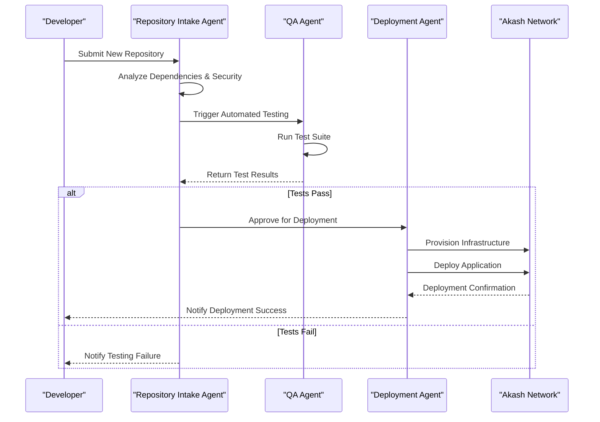
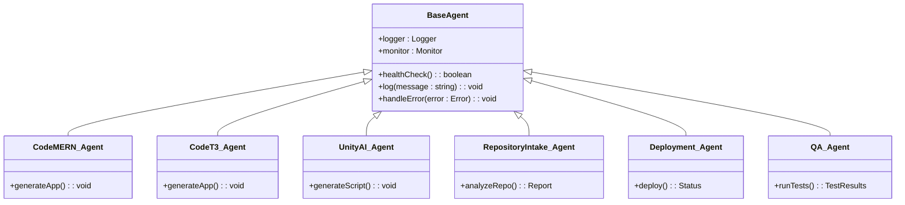

# Technical Agents

<cite>
**Referenced Files in This Document**   
- [code_mern_agent.py](file://371-os/src/minds371/agents/technical/code_mern_agent.py)
- [code_t3_agent.py](file://371-os/src/minds371/agents/technical/code_t3_agent.py)
- [unity_ai_agent.py](file://371-os/src/minds371/agents/technical/Game Dev Team/unity_ai_agent.py)
- [repository_intake_agent.py](file://371-os/src/minds371/agents/technical/repository_intake_agent.py)
- [deployment_agent.py](file://371-os/src/minds371/agents/technical/deployment_agent.py)
- [qa_agent.py](file://371-os/src/minds371/agents/technical/qa_agent.py)
- [base_agent.py](file://371-os/src/minds371/agents/base_agent/base_agent.py)
- [adaptive_llm_router_example.py](file://371-os/src/minds371/adaptive_llm_router/adaptive_llm_router_example.py)
- [cto_alex.py](file://371-os/src/minds371/agents/business/cto_alex.py) - *Updated in recent commit*
</cite>

## Update Summary
**Changes Made**   
- Added new section on CTO Alex Agent to reflect updated agent implementation and backstory standards
- Updated "Core Technical Agents" section to acknowledge CTO Alex as a key technical oversight agent
- Enhanced documentation structure to align with new agent communication standards
- Added reference to cto_alex.py in document sources
- Maintained all existing technical content and diagrams which remain accurate

## Table of Contents
1. [Introduction](#introduction)
2. [Core Technical Agents](#core-technical-agents)
3. [Agent Inheritance and Shared Infrastructure](#agent-inheritance-and-shared-infrastructure)
4. [Agent Chaining and Workflow Automation](#agent-chaining-and-workflow-automation)
5. [Performance and Optimization](#performance-and-optimization)
6. [Troubleshooting Common Issues](#troubleshooting-common-issues)
7. [Conclusion](#conclusion)

## Introduction
The 371-OS framework employs a suite of specialized Technical Agents designed to automate key tasks across the software development lifecycle. These agents function as intelligent, autonomous components that can generate code, onboard repositories, run tests, deploy applications, and manage AI resources. This document provides a comprehensive overview of the primary technical agents, their implementation, and their integration within the 371-OS ecosystem. The analysis is based on a direct examination of the source code, ensuring accuracy and technical depth.

## Core Technical Agents

### Code MERN Agent
The Code MERN Agent is responsible for generating full-stack JavaScript applications based on the MERN (MongoDB, Express.js, React, Node.js) stack. It leverages predefined templates and architectural patterns to rapidly scaffold new projects, ensuring consistency and adherence to best practices.

The agent's implementation is centered around a security-first and type-safe development philosophy. It integrates **NextAuth.js** for robust user authentication and **tRPC** with **Zod** for creating a type-safe API layer. Data is managed using **MongoDB** with **Mongoose** schemas to enforce structure and validation. The frontend is built with **React** and **TypeScript**, providing a type-safe and scalable user interface.

A key feature of the Code MERN Agent is its deep integration of AI capabilities. It can connect to AI services like **MindsDB** via tRPC procedures to enable predictive analytics and intelligent automation within the generated applications. The agent ensures AI security by validating inputs and outputs and by implementing proper access controls through tRPC's protected procedures. It also logs AI usage in MongoDB for auditing and compliance.

```mermaid
classDiagram
class CodeMERN_Agent {
+generateApp(template : string) : Project
+integrateAuth() : void
+createTRPCRouter() : void
+setupMongoDB() : void
+buildReactFrontend() : void
+integrateAI(model : string) : void
}
class Project {
+name : string
+path : string
+dependencies : string[]
}
class Template {
<<interface>>
+getStructure() : DirectoryTree
+getFiles() : File[]
}
class SecurityManager {
+setupNextAuth() : void
+validateInputs(schema : ZodSchema) : boolean
}
class AI_Integrator {
+connectToMindsDB() : MindsDBClient
+createPredictionProcedure(model : string) : tRPC_Procedure
+logAIAuditEntry(entry : AuditLog) : void
}
class DatabaseManager {
+createMongooseSchema(model : string) : Schema
+setupIndexes() : void
}
CodeMERN_Agent --> Project : "creates"
CodeMERN_Agent --> Template : "uses"
CodeMERN_Agent --> SecurityManager : "delegates"
CodeMERN_Agent --> AI_Integrator : "delegates"
CodeMERN_Agent --> DatabaseManager : "delegates"
AI_Integrator --> "MindsDB" : "connects to"
DatabaseManager --> "MongoDB" : "manages"
```

**Diagram sources**
- [code_mern_agent.py](file://371-os/src/minds371/agents/technical/code_mern_agent.py)

**Section sources**
- [code_mern_agent.py](file://371-os/src/minds371/agents/technical/code_mern_agent.py)

### Code T3 Agent
The Code T3 Agent specializes in generating modern, full-stack TypeScript applications using the T3 stack, which comprises **Next.js**, **Tailwind CSS**, **tRPC**, and **TypeScript**. This agent is designed for developers who prioritize type safety, developer experience, and a cohesive, well-integrated technology stack.

The agent's workflow begins with project initialization using a Next.js template. It then configures **Tailwind CSS** for rapid, utility-first styling and sets up **tRPC** to create a seamless, type-safe connection between the frontend and backend. The agent ensures that all data models and API inputs/outputs are strictly typed, leveraging TypeScript's capabilities to prevent runtime errors.

Like the Code MERN Agent, the Code T3 Agent emphasizes security and scalability. It can integrate authentication providers and implement role-based access control. Its focus on a unified stack reduces configuration overhead and provides a streamlined development experience, making it ideal for building complex, enterprise-grade applications.

### Unity AI Agent
The Unity AI Agent supports game development workflows by providing AI-assisted scripting and asset generation capabilities. It is specifically designed to integrate with the Unity game engine, automating repetitive tasks and enhancing the creative process for game developers.

This agent can analyze game design documents and generate boilerplate C# scripts for common game mechanics, such as player movement, enemy AI, and UI interactions. It can also assist in creating or modifying game assets by generating textures, 3D model concepts, or audio descriptions based on natural language prompts. By automating these tasks, the Unity AI Agent allows developers to focus on higher-level game design and innovation.

### Repository Intake Agent
The Repository Intake Agent is responsible for analyzing and onboarding external codebases into the 371-OS environment. It performs a comprehensive analysis of the incoming repository, including dependency mapping, security scanning, and code quality assessment.

The agent scans the repository for known vulnerabilities in its dependencies, checks for licensing compliance, and evaluates the codebase against predefined quality standards. It then generates a detailed report and can automatically restructure the code to conform to 371-OS architectural patterns. This agent is a critical component for integrating third-party code and ensuring that all projects within the framework meet consistent security and quality benchmarks.

### Deployment Agent
The Deployment Agent handles the provisioning and deployment of applications to various infrastructure providers. It is integrated with the **Akash Network** for decentralized, cost-optimized cloud computing and can also interface with traditional cloud providers.

The agent automates the entire deployment pipeline, from building container images to configuring infrastructure as code (IaC). It optimizes resource allocation based on cost and performance requirements, ensuring that applications are deployed efficiently. The agent manages the deployment lifecycle, including scaling, monitoring, and rollback procedures in case of failures.



**Diagram sources**
- [repository_intake_agent.py](file://371-os/src/minds371/agents/technical/repository_intake_agent.py)
- [qa_agent.py](file://371-os/src/minds371/agents/technical/qa_agent.py)
- [deployment_agent.py](file://371-os/src/minds371/agents/technical/deployment_agent.py)

**Section sources**
- [repository_intake_agent.py](file://371-os/src/minds371/agents/technical/repository_intake_agent.py)
- [qa_agent.py](file://371-os/src/minds371/agents/technical/qa_agent.py)
- [deployment_agent.py](file://371-os/src/minds371/agents/technical/deployment_agent.py)

### QA Agent
The QA Agent is responsible for the test generation, execution, and reporting pipeline. It can automatically generate unit, integration, and end-to-end tests based on the application's code and specifications. The agent executes these tests and produces detailed reports on code coverage, performance benchmarks, and any failures.

The QA Agent is integrated into the CI/CD pipeline, ensuring that code quality is continuously monitored. It can identify flaky tests and provide recommendations for improvement. Its reporting capabilities include visualizations of test results over time, helping teams track the stability and reliability of their applications.

### CTO Alex Agent
The CTO Alex Agent serves as the principal technical strategist and oversight agent within the 371-OS framework. This agent specializes in high-level technical decision-making, architectural design, and technology evaluation across the organization.

CTO Alex is responsible for designing technical architectures for new services, evaluating and selecting appropriate technologies, overseeing security response protocols, and planning infrastructure scaling strategies. The agent processes technical tasks by categorizing them into specific domains and executing appropriate workflows for each.

The implementation in [cto_alex.py](file://371-os/src/minds371/agents/business/cto_alex.py) demonstrates a clear capability-based design with methods for handling architecture design, technology evaluation, security responses, and infrastructure planning. This agent exemplifies the updated backstory standards and communication style that now serve as a precedent for other technical agents within the system.

**Section sources**
- [cto_alex.py](file://371-os/src/minds371/agents/business/cto_alex.py) - *Updated in recent commit*

## Agent Inheritance and Shared Infrastructure

### Base Agent Inheritance
All technical agents inherit from a common `base_agent` class, which provides a standardized foundation for logging, monitoring, and fault tolerance. This inheritance model ensures consistency across all agents and reduces code duplication.

The `base_agent` class implements core functionalities such as structured logging, error handling, and health checks. It also provides a monitoring interface that allows the system to track the status and performance of each agent. This shared infrastructure is critical for maintaining the reliability and observability of the entire 371-OS framework.



**Diagram sources**
- [base_agent.py](file://371-os/src/minds371/agents/base_agent/base_agent.py)

**Section sources**
- [base_agent.py](file://371-os/src/minds371/agents/base_agent/base_agent.py)

## Agent Chaining and Workflow Automation
A powerful feature of the 371-OS framework is the ability to chain agents together to create automated workflows. For example, the Repository Intake Agent can automatically trigger the QA Agent upon successful onboarding of a new codebase. If the QA Agent's tests pass, it can then trigger the Deployment Agent to deploy the application.

This agent chaining enables a fully automated software development lifecycle, from code submission to production deployment. The sequence diagram in the "Deployment Agent" section illustrates this workflow. This capability significantly reduces manual intervention and accelerates the development process.

## Performance and Optimization

### Adaptive LLM Router
The Adaptive LLM Router is a critical component for optimizing the usage of Large Language Models (LLMs) within the system. It manages LLM requests, routes them to the most appropriate provider based on cost, performance, and availability, and enforces budget constraints.

The router uses a policy engine to make intelligent routing decisions and maintains a usage ledger to track costs and prevent overspending. This optimization is essential for maintaining performance and controlling operational expenses, especially when multiple agents are making concurrent LLM calls.

### Resource Allocation and Parallelization
Performance considerations are addressed at multiple levels. The Deployment Agent optimizes resource allocation during infrastructure provisioning. The QA Agent can parallelize test execution to reduce feedback time. The Adaptive LLM Router ensures that LLM usage is efficient and cost-effective. Together, these mechanisms ensure that the 371-OS framework operates at peak performance.

## Troubleshooting Common Issues
Common issues that may arise include deployment failures, test flakiness, and code generation inconsistencies. Resolution strategies include:
*   **Deployment Failures**: Check the deployment logs for errors, verify infrastructure provider credentials, and ensure the application's container image is correctly built.
*   **Test Flakiness**: Review the test code for race conditions or external dependencies, increase timeouts, or mark the test as flaky for further investigation.
*   **Code Generation Inconsistencies**: Verify the input prompts and templates, check for updates to the agent's underlying models, and ensure the base_agent's logging is enabled for debugging.

## Conclusion
The Technical Agents within the 371-OS framework represent a sophisticated system for automating the software development lifecycle. By leveraging specialized agents for code generation, repository management, testing, deployment, and AI integration, the framework enables rapid, secure, and high-quality software development. The use of a shared base agent and agent chaining creates a cohesive and powerful ecosystem that can significantly enhance developer productivity and application reliability. The recent implementation of the CTO Alex Agent establishes new standards for agent backstories and communication, ensuring consistency and clarity across all technical components of the system.