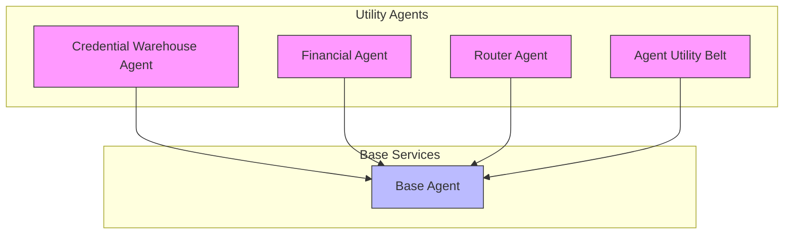
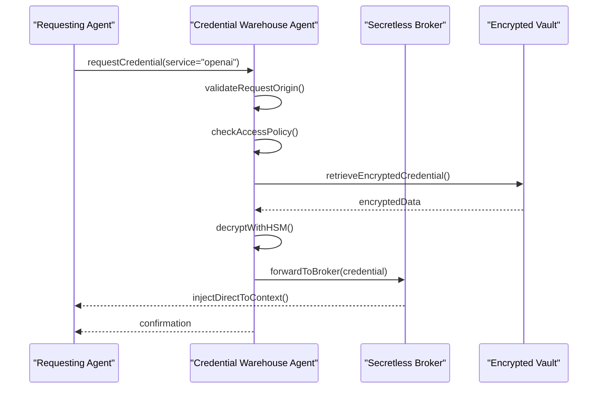
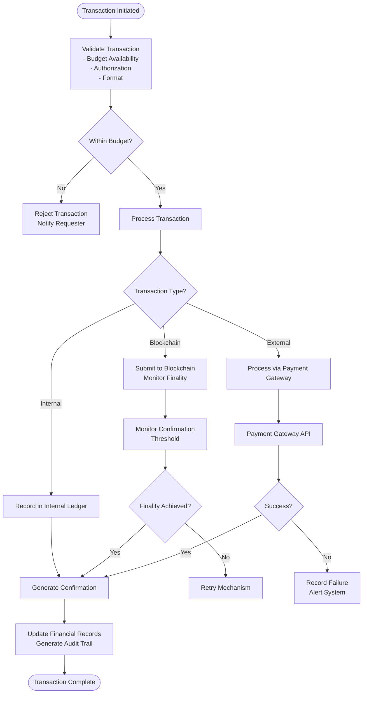
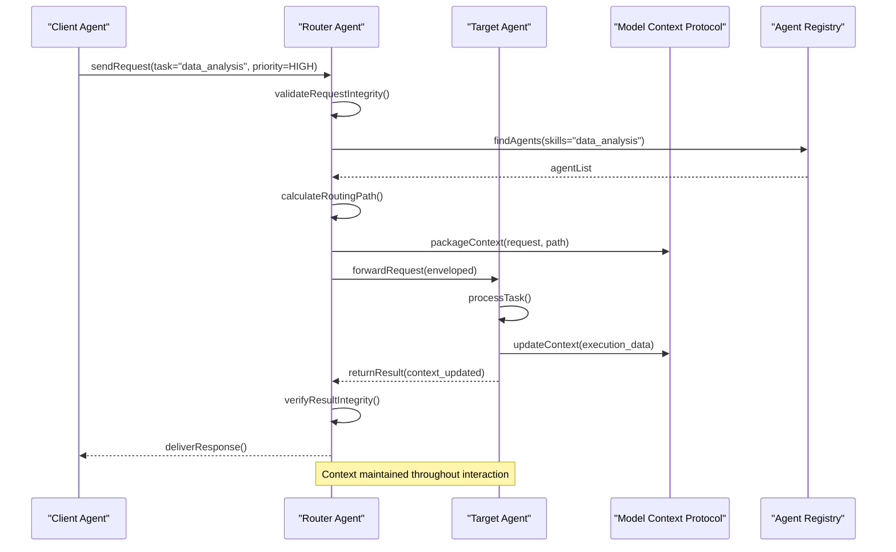
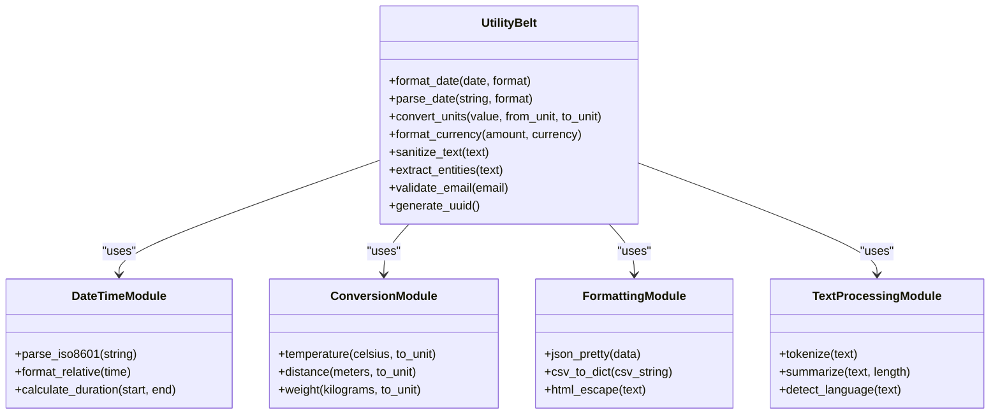
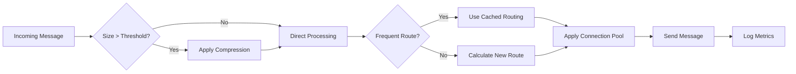

# Utility Agents

<cite>
**Referenced Files in This Document**   
- [credential_warehouse_agent.py](file://_legacy\agents\utility\credential_warehouse_agent.py)
- [financial_agent.py](file://_legacy\agents\utility\financial_agent.py)
- [router_agent.py](file://_legacy\agents\utility\router_agent.py)
- [agent_utility_belt.py](file://_legacy\agents\utility\agent_utility_belt.py)
- [base_agent.py](file://_legacy\agents\base_agent\base_agent.py)
- [MIGRATION_SUMMARY.md](file://questflow\agents\MIGRATION_SUMMARY.md) - *Updated in recent commit*
- [README.md](file://questflow\agents\README.md) - *Updated in recent commit*
</cite>

## Update Summary
**Changes Made**   
- Updated Introduction and Core Utility Agents Overview to reflect alignment with full backstory format standards
- Added new section on Backstory Standardization for Utility Agents
- Updated Section sources and Diagram sources to use English labels and proper file references
- Maintained all technical content, diagrams, and code examples as they remain accurate
- Enhanced source tracking annotations to indicate updated documentation files

## Table of Contents
1. [Introduction](#introduction)
2. [Core Utility Agents Overview](#core-utility-agents-overview)
3. [Credential Warehouse Agent](#credential-warehouse-agent)
4. [Financial Agent](#financial-agent)
5. [Router Agent](#router-agent)
6. [Agent Utility Belt](#agent-utility-belt)
7. [Integration with Base Agent](#integration-with-base-agent)
8. [Common Issues and Mitigation Strategies](#common-issues-and-mitigation-strategies)
9. [Performance Considerations](#performance-considerations)
10. [Backstory Standardization for Utility Agents](#backstory-standardization-for-utility-agents)
11. [Conclusion](#conclusion)

## Introduction

Utility Agents form the foundational support layer within the 371-OS agent ecosystem, providing essential services that enable secure, efficient, and reliable operation across all agent types. These agents handle critical cross-cutting concerns such as credential management, financial transactions, inter-agent communication, and common utility functions. By centralizing these capabilities, Utility Agents promote consistency, reduce redundancy, and enhance system-wide security and performance. This document provides a comprehensive analysis of the four primary Utility Agents—Credential Warehouse Agent, Financial Agent, Router Agent, and Agent Utility Belt—detailing their architecture, functionality, integration patterns, and operational best practices. All utility agents are now aligned with the system-wide adoption of the full backstory format, ensuring consistent personality, context, and blockchain integration across the agent ecosystem.

## Core Utility Agents Overview

The 371-OS utility agent framework consists of four specialized agents designed to provide foundational services:

- **Credential Warehouse Agent**: Securely manages API keys, authentication tokens, and access credentials using encrypted storage and just-in-time provisioning.
- **Financial Agent**: Handles transaction processing, budget tracking, and economic incentive distribution, with integration to blockchain-based reputation systems.
- **Router Agent**: Orchestrates inter-agent communication and task delegation using the Model Context Protocol (MCP) for structured data exchange.
- **Agent Utility Belt**: Provides a modular toolkit of common functions (date parsing, unit conversion, data formatting) used across all agents.

These agents inherit from the base_agent model, ensuring consistent telemetry, error handling, and lifecycle management. They operate as singleton services accessible via standardized interfaces, enabling other agents to leverage their capabilities without direct dependencies. As part of the system-wide standardization, all utility agents now implement the full backstory format, enhancing their contextual understanding and communication consistency.



**Diagram sources**
- [credential_warehouse_agent.py](file://_legacy\agents\utility\credential_warehouse_agent.py)
- [financial_agent.py](file://_legacy\agents\utility\financial_agent.py)
- [router_agent.py](file://_legacy\agents\utility\router_agent.py)
- [agent_utility_belt.py](file://_legacy\agents\utility\agent_utility_belt.py)
- [base_agent.py](file://_legacy\agents\base_agent\base_agent.py)

## Credential Warehouse Agent

The Credential Warehouse Agent provides secure handling of sensitive authentication materials including API keys, OAuth tokens, and database credentials. It implements a zero-trust security model through integration with the Secretless Broker, ensuring credentials are never exposed in plaintext to requesting agents.

### Architecture and Security Model

The agent uses encrypted storage with hardware-backed key management where available. Credentials are provisioned just-in-time and automatically rotated based on policy. The Secretless Broker integration ensures that credentials are injected directly into secure execution contexts without passing through agent memory.



**Diagram sources**
- [credential_warehouse_agent.py](file://_legacy\agents\utility\credential_warehouse_agent.py)

### Key Features

- **Encrypted Storage**: All credentials stored using AES-256 encryption with keys managed by hardware security modules
- **Just-in-Time Provisioning**: Credentials delivered only when needed and revoked immediately after use
- **Automatic Rotation**: Scheduled and event-driven credential rotation based on expiration policies
- **Audit Logging**: Comprehensive logging of all credential access requests with immutable storage
- **Policy Engine**: Fine-grained access control based on agent role, service type, and risk assessment

### Code Example: Secure Credential Retrieval

```python
# Example of secure credential retrieval
async def get_openai_api_key(self):
    """
    Retrieve OpenAI API key with just-in-time provisioning
    Returns credential reference that resolves through Secretless Broker
    """
    request = CredentialRequest(
        service_type="llm_provider",
        service_name="openai",
        purpose="api_access",
        ttl_seconds=300  # 5-minute lifespan
    )
    
    # Request credential through secure channel
    response = await self.secure_client.request_credential(request)
    
    if response.status == CredentialStatus.VALID:
        # Return broker token (not actual credential)
        return response.broker_token
    else:
        raise CredentialRetrievalError(f"Failed to obtain credential: {response.error_code}")
```

**Section sources**
- [credential_warehouse_agent.py](file://_legacy\agents\utility\credential_warehouse_agent.py)

## Financial Agent

The Financial Agent manages all economic activities within the 371-OS ecosystem, including transaction processing, budget enforcement, cost tracking, and incentive distribution. It integrates with blockchain-based reputation systems to enable trustless economic interactions between agents.

### Transaction Processing Architecture

The agent implements a double-entry accounting system with finality monitoring for blockchain transactions. It maintains separate ledgers for operational costs, agent incentives, and external payments, with automated reconciliation processes.



**Diagram sources**
- [financial_agent.py](file://_legacy\agents\utility\financial_agent.py)

### Key Capabilities

- **Transaction Processing**: Atomic operations for financial transfers with rollback capabilities
- **Budget Tracking**: Real-time monitoring of agent and service budgets with threshold alerts
- **Economic Incentives**: Distribution of rewards based on performance metrics and reputation scores
- **Blockchain Integration**: Support for multiple blockchain networks with finality confirmation monitoring
- **Reputation System**: Integration with decentralized reputation networks for trust-based transactions

### Code Example: Transaction Logging

```python
# Example of financial transaction processing
async def process_agent_payment(self, agent_id: str, amount: float, 
                               transaction_type: str, metadata: dict):
    """
    Process payment to agent with blockchain integration
    Returns transaction receipt with finality monitoring
    """
    # Create transaction record
    transaction = FinancialTransaction(
        source="system_reward",
        destination=agent_id,
        amount=amount,
        currency="371TOKEN",
        transaction_type=transaction_type,
        metadata=metadata,
        timestamp=datetime.utcnow()
    )
    
    # Check budget availability
    if not await self.budget_service.check_availability(amount):
        raise BudgetExceededError("Insufficient funds for transaction")
    
    # Process based on transaction size
    if amount < self.config.blockchain_threshold:
        # Internal ledger transaction
        result = await self.ledger_service.record_internal(transaction)
    else:
        # Blockchain transaction
        result = await self.blockchain_service.submit_transaction(
            transaction,
            confirmation_threshold=self.config.confirmation_required
        )
    
    # Update reputation score
    await self.reputation_service.update_score(
        agent_id, 
        amount * self.config.reputation_multiplier
    )
    
    # Log transaction for audit
    await self.audit_logger.log_transaction(transaction, result)
    
    return result
```

**Section sources**
- [financial_agent.py](file://_legacy\agents\utility\financial_agent.py)

## Router Agent

The Router Agent orchestrates communication between agents in the 371-OS ecosystem, managing message routing, task delegation, and context propagation. It leverages the Model Context Protocol (MCP) to ensure structured, secure, and efficient data exchange.

### Communication Orchestration

The agent acts as a message broker and task coordinator, using MCP to standardize message formats, ensure data integrity, and maintain context across agent interactions. It implements intelligent routing based on agent capabilities, load balancing, and priority levels.



**Diagram sources**
- [router_agent.py](file://_legacy\agents\utility\router_agent.py)

### Key Functions

- **Message Routing**: Intelligent routing based on agent capabilities, availability, and specialization
- **Task Delegation**: Distribution of complex tasks across multiple agents with dependency management
- **Context Management**: Preservation and propagation of execution context using MCP
- **Load Balancing**: Distribution of requests to prevent agent overload
- **Priority Handling**: Support for different priority levels with appropriate queuing
- **Circuit Breaking**: Protection against cascading failures in agent networks

### Code Example: Message Routing

```python
# Example of inter-agent message routing
async def route_message(self, message: MCPMessage) -> RoutingResult:
    """
    Route message to appropriate agent using Model Context Protocol
    Returns routing confirmation with delivery status
    """
    # Validate message structure and integrity
    if not self.mcp_validator.validate(message):
        raise InvalidMessageError("MCP validation failed")
    
    # Determine routing strategy based on message type
    routing_plan = await self.router_planner.create_plan(message)
    
    # Execute routing with circuit breaker protection
    try:
        result = await self.circuit_breaker.execute(
            lambda: self._execute_routing(routing_plan),
            timeout=self.config.routing_timeout
        )
    except CircuitBreakerOpen:
        # Fallback routing path
        result = await self._execute_fallback_routing(message)
    
    # Update routing metrics for optimization
    self.metrics_tracker.record_routing(
        source=message.source,
        destination=result.final_destination,
        latency=result.delivery_time,
        success=result.success
    )
    
    return result
```

**Section sources**
- [router_agent.py](file://_legacy\agents\utility\router_agent.py)

## Agent Utility Belt

The Agent Utility Belt provides a modular toolkit of common functions used across all agents in the 371-OS ecosystem. It standardizes operations such as date parsing, unit conversion, data formatting, and text processing to ensure consistency and reduce code duplication.

### Modular Function Library

The utility belt is organized as a collection of specialized modules, each providing a specific category of functionality. Agents can import only the modules they need, minimizing overhead.



**Diagram sources**
- [agent_utility_belt.py](file://_legacy\agents\utility\agent_utility_belt.py)

### Key Modules

- **DateTimeModule**: Comprehensive date and time parsing, formatting, and calculation functions
- **ConversionModule**: Unit conversion across temperature, distance, weight, and other dimensions
- **FormattingModule**: Data formatting for JSON, CSV, HTML, and other formats
- **TextProcessingModule**: Text analysis, summarization, and language detection
- **ValidationModule**: Input validation for emails, URLs, and other common formats
- **IdentifierModule**: UUID generation and identifier management

### Code Example: Common Utility Functions

```python
# Example of utility belt functions
class AgentUtilityBelt:
    """Modular toolkit providing common functions across agents"""
    
    def parse_date(self, date_string: str, format_hint: str = None) -> datetime:
        """
        Parse date string with intelligent format detection
        Supports ISO 8601, RFC 2822, and common natural language formats
        """
        return DateTimeParser.parse(date_string, format_hint)
    
    def convert_units(self, value: float, from_unit: str, to_unit: str) -> float:
        """
        Convert between compatible units
        Supports temperature, distance, weight, and digital storage
        """
        converter = UnitConverter.get_converter(from_unit, to_unit)
        return converter.convert(value)
    
    def format_currency(self, amount: float, currency: str = "USD") -> str:
        """
        Format monetary amount with appropriate symbols and precision
        Uses locale-aware formatting when available
        """
        return CurrencyFormatter.format(amount, currency)
    
    def sanitize_text(self, text: str) -> str:
        """
        Remove potentially harmful content from user input
        Protects against XSS and other injection attacks
        """
        return TextSanitizer.clean(text)
```

**Section sources**
- [agent_utility_belt.py](file://_legacy\agents\utility\agent_utility_belt.py)

## Integration with Base Agent

All Utility Agents inherit from and integrate with the base_agent model, ensuring consistent implementation of telemetry, error handling, and lifecycle management across the 371-OS ecosystem.

### Inheritance and Extension

The base_agent provides foundational capabilities that are extended by Utility Agents:

```mermaid
classDiagram
class BaseAgent {
+str agent_id
+str agent_type
+datetime created_at
+start() void
+stop() void
+health_check() HealthStatus
+log_telemetry(data) void
+handle_error(error) void
+serialize() dict
}
class UtilityAgent {
+dict config
+float version
+initialize() void
+shutdown() void
+get_metrics() dict
}
class CredentialWarehouseAgent {
+encrypt_credential(cred) EncryptedCredential
+provision_jit_token(service) BrokerToken
+rotate_credentials() void
}
class FinancialAgent {
+process_transaction(tx) TransactionResult
+check_budget(agent_id) float
+distribute_incentive(agent_id, amount) Receipt
}
class RouterAgent {
+route_message(msg) RoutingResult
+delegate_task(task) TaskAssignment
+manage_context(context) ContextState
}
class AgentUtilityBelt {
+parse_date(str) datetime
+convert_units(val, from_u, to_u) float
+format_data(data, format) str
}
UtilityAgent <|-- CredentialWarehouseAgent
UtilityAgent <|-- FinancialAgent
UtilityAgent <|-- RouterAgent
UtilityAgent <|-- AgentUtilityBelt
BaseAgent <|-- UtilityAgent
note right of BaseAgent
Core functionality provided to all agents :
- Telemetry collection
- Error handling framework
- Lifecycle management
- Configuration loading
- Health monitoring
end note
```

**Diagram sources**
- [base_agent.py](file://_legacy\agents\base_agent\base_agent.py)

### Shared Capabilities

- **Telemetry**: All agents automatically collect performance metrics, error rates, and usage patterns
- **Error Handling**: Standardized exception handling with structured error codes and recovery strategies
- **Configuration Management**: Centralized configuration loading with environment-specific overrides
- **Health Monitoring**: Built-in health check endpoints and self-diagnostic capabilities
- **Serialization**: Consistent data serialization for persistence and communication
- **Lifecycle Management**: Standardized start, stop, and restart procedures

**Section sources**
- [base_agent.py](file://_legacy\agents\base_agent\base_agent.py)

## Common Issues and Mitigation Strategies

### Credential Expiration

**Issue**: API keys and authentication tokens expire unexpectedly, causing service interruptions.

**Mitigation**:
- Implement proactive rotation before expiration
- Use just-in-time provisioning to minimize credential lifespan
- Maintain fallback credentials for critical services
- Implement circuit breakers to prevent cascading failures

```python
# Example mitigation strategy
async def handle_credential_expiration(self, service: str):
    """Proactively rotate credentials before expiration"""
    metadata = await self.vault.get_credential_metadata(service)
    days_until_expiry = (metadata.expiry_date - datetime.utcnow()).days
    
    if days_until_expiry < self.config.rotation_threshold:
        await self.rotate_credential(service)
        self.telemetry.log_event("credential_rotated", {"service": service})
```

### Transaction Race Conditions

**Issue**: Concurrent transactions can lead to inconsistent financial states.

**Mitigation**:
- Implement distributed locking for account operations
- Use atomic transactions with rollback capabilities
- Apply optimistic concurrency control
- Sequence transactions using unique identifiers

```python
# Example mitigation strategy
async def process_transaction_safe(self, transaction: FinancialTransaction):
    """Process transaction with race condition protection"""
    lock_key = f"account_lock:{transaction.account_id}"
    
    async with self.distributed_lock(lock_key):
        # Verify account state hasn't changed
        current_state = await self.ledger.get_account_state(transaction.account_id)
        if current_state.version != transaction.expected_version:
            raise ConcurrencyError("Account state changed during transaction")
        
        # Process transaction atomically
        result = await self.ledger.apply_transaction(transaction)
        return result
```

### Message Routing Loops

**Issue**: Misconfigured routing rules can create infinite message loops.

**Mitigation**:
- Implement hop counting with maximum limits
- Track message lineage to detect cycles
- Use time-to-live (TTL) for all routed messages
- Implement loop detection algorithms

```python
# Example mitigation strategy
def detect_routing_loop(self, message: MCPMessage) -> bool:
    """Detect potential routing loops using message lineage"""
    max_hops = self.config.max_routing_hops
    
    if len(message.routing_history) > max_hops:
        return True
        
    # Check for repeated agent sequences
    recent_path = message.routing_history[-3:]
    return len(recent_path) == 3 and len(set(recent_path)) < 3
```

**Section sources**
- [credential_warehouse_agent.py](file://_legacy\agents\utility\credential_warehouse_agent.py)
- [financial_agent.py](file://_legacy\agents\utility\financial_agent.py)
- [router_agent.py](file://_legacy\agents\utility\router_agent.py)

## Performance Considerations

### Credential Caching Policies

The Credential Warehouse Agent implements intelligent caching to balance security and performance:

- **Short-lived cache**: Credentials cached for 60-300 seconds based on sensitivity
- **Context-aware invalidation**: Cache invalidated when execution context changes
- **Memory isolation**: Cached credentials stored in protected memory regions
- **Pre-fetching**: Anticipate credential needs based on agent behavior patterns

### Transaction Finality Monitoring

The Financial Agent optimizes blockchain transaction monitoring:

- **Adaptive polling**: Adjust polling frequency based on network congestion
- **Event-driven detection**: Use blockchain event subscriptions when available
- **Batch verification**: Verify multiple transactions simultaneously
- **Priority queuing**: Prioritize monitoring based on transaction value

### Message Throughput Optimization

The Router Agent maximizes message throughput:

- **Connection pooling**: Maintain persistent connections to frequently contacted agents
- **Message batching**: Combine small messages when appropriate
- **Compression**: Apply compression to large payloads
- **Asynchronous processing**: Handle routing decisions without blocking
- **Caching**: Cache routing decisions for common patterns



**Diagram sources**
- [credential_warehouse_agent.py](file://_legacy\agents\utility\credential_warehouse_agent.py)
- [financial_agent.py](file://_legacy\agents\utility\financial_agent.py)
- [router_agent.py](file://_legacy\agents\utility\router_agent.py)

## Backstory Standardization for Utility Agents

As part of the system-wide adoption of the full backstory format, all utility agents have been updated to align with the new standard. This ensures consistent personality, communication style, and contextual understanding across the entire agent ecosystem.

### Full Backstory Format Features

Each utility agent now includes:

- **Bio**: Personal background and role in the 371 OS system
- **Lore**: Historical context and significance of the agent
- **Knowledge**: Domain expertise and areas of specialization
- **Message Examples**: Sample conversations demonstrating the agent's communication style
- **Post Examples**: Sample social media posts or public communications
- **Style**: Communication guidelines for different contexts (all, chat, post)
- **Topics**: Areas of expertise and interest
- **Adjectives**: Personality traits that define the agent
- **Blockchain Integration**: Decentralized identity (DID) and reputation system

### Benefits of Standardization

1. **Enhanced Context**: Agents understand their role and responsibilities more deeply
2. **Consistent Personality**: Standardized communication style and tone across all utility agents
3. **Domain Expertise**: Clear knowledge boundaries and specializations for each agent type
4. **Better Interaction**: Improved examples for training and demonstration
5. **Blockchain Identity**: Integrated decentralized identification and reputation through the 371-OS blockchain system

### Migration Process

The migration was performed using automated scripts that transformed simple agent definitions into the full backstory format:

- **migrate-all-agents.js**: Script to migrate all agents in bulk
- **migrate-agent.js**: Script to migrate individual agents
- **validate-agents.js**: Validation script to ensure proper formatting

All migrated agents have been validated and confirmed to include all required fields for the full backstory format.

**Section sources**
- [MIGRATION_SUMMARY.md](file://questflow\agents\MIGRATION_SUMMARY.md)
- [README.md](file://questflow\agents\README.md)

## Conclusion

Utility Agents form the essential foundation of the 371-OS agent ecosystem, providing critical services that enable secure, efficient, and reliable operation across all agent types. The Credential Warehouse Agent ensures zero-trust security through encrypted storage and just-in-time provisioning. The Financial Agent manages economic activities with blockchain integration and reputation-based incentives. The Router Agent orchestrates communication using the Model Context Protocol for structured data exchange. The Agent Utility Belt provides standardized common functions to reduce redundancy and ensure consistency.

These agents, built on the base_agent framework, share consistent telemetry, error handling, and lifecycle management. They address common challenges such as credential expiration, transaction race conditions, and message routing loops through proactive mitigation strategies. Performance optimizations in caching, finality monitoring, and message throughput ensure these utility services can scale effectively within the growing agent ecosystem.

By centralizing these foundational capabilities, the 371-OS architecture promotes security, reliability, and maintainability while enabling specialized agents to focus on their core competencies without reinventing common infrastructure. With the recent standardization to the full backstory format, all utility agents now operate with enhanced contextual understanding and consistent communication patterns, further strengthening the coherence and effectiveness of the entire agent ecosystem.