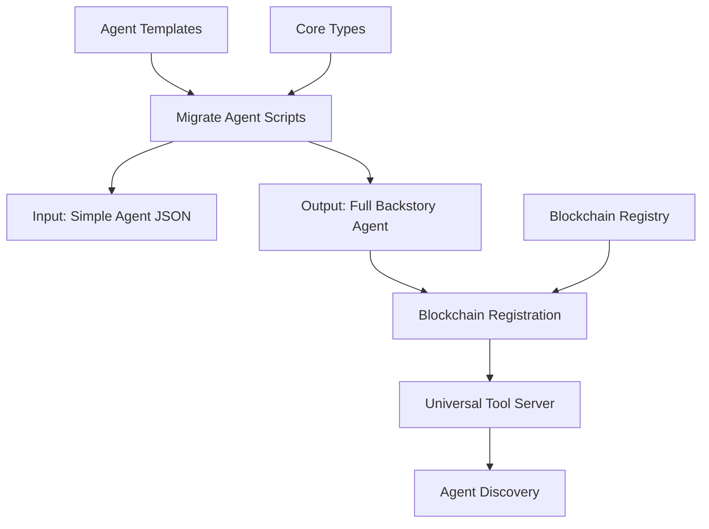
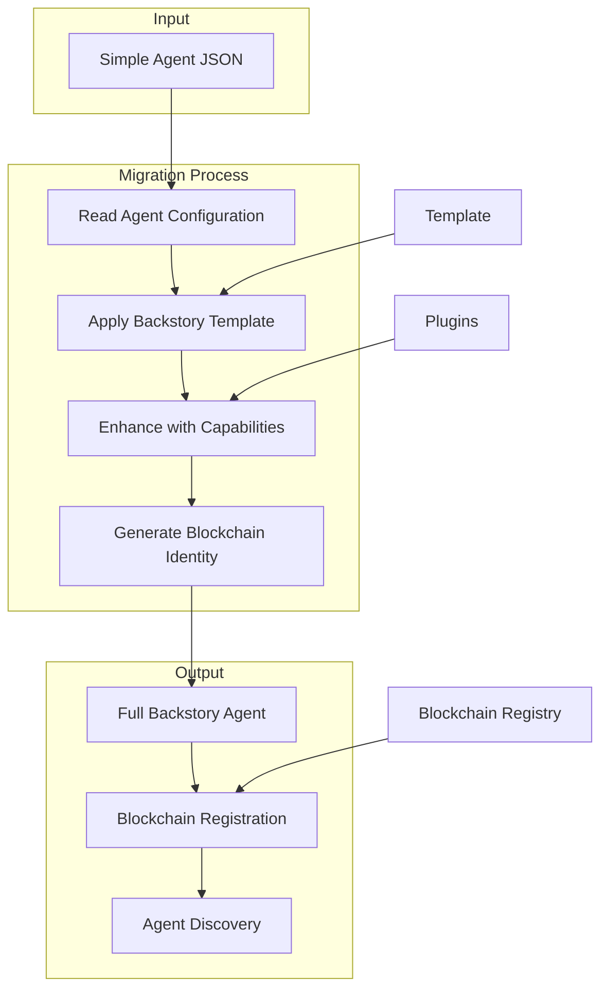
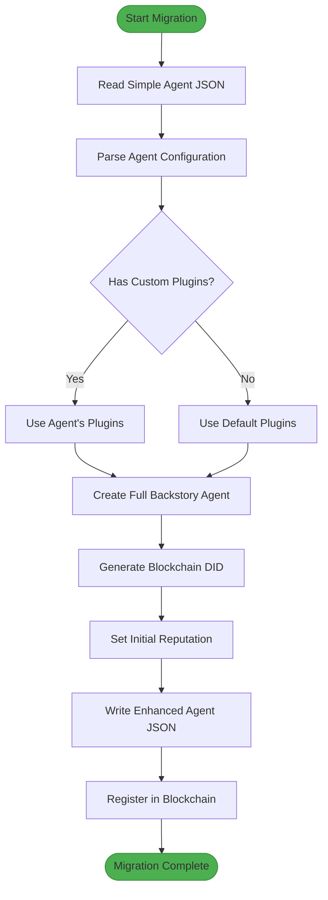
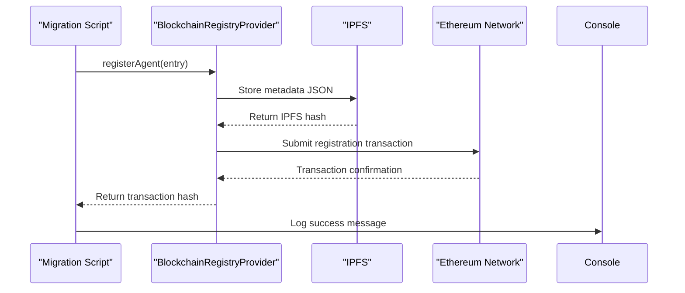
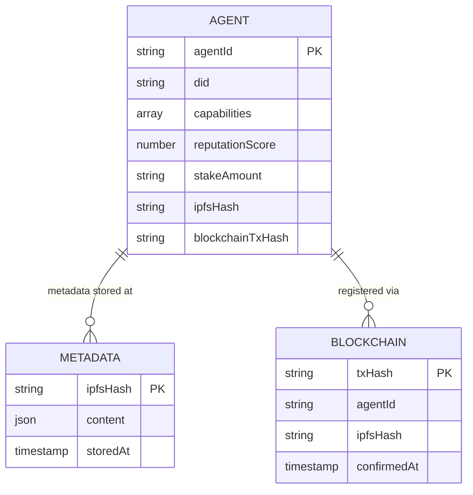

# Agent Migration Framework

<cite>
**Referenced Files in This Document**   
- [migrate-agent.js](file://questflow\scripts\migrate-agent.js)
- [migrate-all-agents.js](file://questflow\scripts\migrate-all-agents.js)
- [agent-backstory-template.json](file://questflow\agents\templates\agent-backstory-template.json)
- [registerAgentAction](file://_legacy\sotalogic\Claude Sonnet 4\Alignment Review of 371OS_launch Project Plan\here's the thing.md#L5259-L5326)
- [blockchain-registry.ts](file://os-workspace\packages\universal-tool-server\src\blockchain-registry.ts#L66-L101)
- [core-types/index.test.ts](file://os-workspace\libs\core-types\src\index.test.ts#L0-L37)
</cite>

## Table of Contents
1. [Introduction](#introduction)
2. [Project Structure](#project-structure)
3. [Core Components](#core-components)
4. [Architecture Overview](#architecture-overview)
5. [Detailed Component Analysis](#detailed-component-analysis)
6. [Migration Patterns](#migration-patterns)
7. [Integration with Agent Systems](#integration-with-agent-systems)
8. [Troubleshooting Guide](#troubleshooting-guide)
9. [Conclusion](#conclusion)

## Introduction
The Agent Migration Framework is a comprehensive system designed to transition simple agent configurations into fully-featured, blockchain-registered autonomous agents within the 371 OS ecosystem. This framework enables the evolution of basic agents into sophisticated digital entities with rich backstories, capabilities, and decentralized identities. The migration process supports both individual agent upgrades and bulk transformations, ensuring seamless integration with the Universal Tool Server and blockchain registry systems.

## Project Structure
The Agent Migration Framework is primarily located within the `questflow/scripts` directory and integrates with core components across the 371 OS architecture. The framework leverages existing agent definitions and transforms them into enhanced configurations that support advanced capabilities, blockchain registration, and interoperability with the broader agent ecosystem.

**Diagram sources**
- [migrate-agent.js](file://questflow\scripts\migrate-agent.js)
- [agent-backstory-template.json](file://questflow\agents\templates\agent-backstory-template.json)

**Section sources**
- [migrate-agent.js](file://questflow\scripts\migrate-agent.js)
- [migrate-all-agents.js](file://questflow\scripts\migrate-all-agents.js)

## Core Components
The Agent Migration Framework consists of several key components that work together to transform basic agent configurations into fully-featured autonomous entities. The core functionality is implemented in two primary scripts: `migrate-agent.js` for individual agent migration and `migrate-all-agents.js` for batch processing. These scripts utilize a standardized agent template that defines the structure of enhanced agents, including properties for capabilities, blockchain identity, and interaction patterns.

The framework also integrates with the blockchain registry system, enabling migrated agents to register their capabilities on-chain and become discoverable within the decentralized network. This integration ensures that migrated agents can participate in the broader agent economy, leveraging reputation systems and economic incentives.

**Section sources**
- [migrate-agent.js](file://questflow\scripts\migrate-agent.js#L0-L127)
- [agent-backstory-template.json](file://questflow\agents\templates\agent-backstory-template.json#L0-L89)

## Architecture Overview
The Agent Migration Framework follows a transformation pipeline architecture that converts simple agent definitions into comprehensive digital entities. The process begins with reading a basic agent configuration, then enriching it with additional metadata, capabilities, and blockchain identity information. The migrated agent is then registered in the decentralized registry, making it available for discovery and collaboration within the agent network.

**Diagram sources**
- [migrate-agent.js](file://questflow\scripts\migrate-agent.js)
- [blockchain-registry.ts](file://os-workspace\packages\universal-tool-server\src\blockchain-registry.ts#L66-L101)

## Detailed Component Analysis

### Migration Script Analysis
The migration framework provides two primary scripts for agent transformation: `migrate-agent.js` for individual agents and `migrate-all-agents.js` for bulk operations. These scripts implement a consistent transformation pattern that enhances simple agent configurations with comprehensive metadata.

#### Migration Process Flowchart

**Diagram sources**
- [migrate-agent.js](file://questflow\scripts\migrate-agent.js#L0-L127)

**Section sources**
- [migrate-agent.js](file://questflow\scripts\migrate-agent.js#L0-L127)

### Agent Registry Integration
The migrated agents are registered in a blockchain-based registry that provides cryptographic verification and staking requirements. This integration ensures that agents have verifiable identities and economic incentives to maintain high performance.

#### Blockchain Registration Sequence

**Diagram sources**
- [blockchain-registry.ts](file://os-workspace\packages\universal-tool-server\src\blockchain-registry.ts#L66-L101)
- [here's the thing.md](file://_legacy\sotalogic\Claude Sonnet 4\Alignment Review of 371OS_launch Project Plan\here's the thing.md#L5259-L5326)

## Migration Patterns
The Agent Migration Framework implements several key patterns for transforming agent configurations:

1. **Backstory Enrichment**: Basic agent definitions are expanded with comprehensive biographical information, knowledge domains, and interaction examples.
2. **Capability Enhancement**: Simple capability lists are transformed into structured capability objects with detailed descriptions and parameters.
3. **Blockchain Identity Generation**: Each agent receives a Decentralized Identifier (DID) in the format `did:371os:agent:{name}`.
4. **Reputation System Integration**: Migrated agents are initialized with a reputation score of 80 and a stake amount of 100 tokens.
5. **Plugin Association**: Agents are associated with relevant plugins based on their capabilities, with default plugins assigned when none are specified.

These patterns ensure that migrated agents are fully equipped to participate in the decentralized agent network, with verifiable identities and economic incentives.

**Section sources**
- [migrate-agent.js](file://questflow\scripts\migrate-agent.js#L66-L113)
- [agent-backstory-template.json](file://questflow\agents\templates\agent-backstory-template.json#L0-L89)

## Integration with Agent Systems
The Agent Migration Framework integrates with multiple components of the 371 OS ecosystem:

1. **Universal Tool Server**: Migrated agents register their capabilities with the Universal Tool Server, making them discoverable by other agents.
2. **Blockchain Registry**: Agents are registered on-chain with cryptographic verification and staking requirements.
3. **IPFS Storage**: Agent metadata is stored on IPFS, with only the content hash recorded on-chain for efficiency.
4. **Agent Runtime**: The enhanced agent configurations are compatible with the IAgentRuntime interface, enabling seamless execution.

The integration with the blockchain registry is particularly important, as it enables decentralized discovery and trust verification. When an agent registers its capabilities, the system stores the complete metadata on IPFS and records the hash on-chain, creating a tamper-proof record of the agent's capabilities and identity.

**Diagram sources**
- [blockchain-registry.ts](file://os-workspace\packages\universal-tool-server\src\blockchain-registry.ts#L66-L101)
- [core-types/index.test.ts](file://os-workspace\libs\core-types\src\index.test.ts#L0-L37)

## Troubleshooting Guide
When using the Agent Migration Framework, several common issues may arise:

1. **File Path Errors**: Ensure that the input and output paths are correctly specified when running the migration scripts.
2. **JSON Parsing Issues**: Verify that the input agent configuration is valid JSON with the required fields.
3. **Blockchain Registration Failures**: Check that the AGENT_PRIVATE_KEY environment variable is set and that the Ethereum network is accessible.
4. **IPFS Connectivity**: Ensure that the IPFS daemon is running and accessible from the migration script.
5. **Plugin Resolution**: If custom plugins are not being recognized, verify that the plugin definitions exist in the expected location.

For debugging purposes, the migration scripts provide detailed console output, including success messages with checkmarks (✅) and error messages with cross marks (❌). These visual indicators help quickly identify the status of migration operations.

**Section sources**
- [migrate-agent.js](file://questflow\scripts\migrate-agent.js#L0-L127)
- [blockchain-registry.ts](file://os-workspace\packages\universal-tool-server\src\blockchain-registry.ts#L66-L101)

## Conclusion
The Agent Migration Framework provides a robust solution for evolving simple agent configurations into fully-featured autonomous entities within the 371 OS ecosystem. By standardizing the migration process and integrating with blockchain-based identity and reputation systems, the framework enables the creation of a decentralized network of trustworthy, capable agents. The implementation supports both individual and bulk migration operations, making it suitable for both development and production environments. As the agent ecosystem continues to grow, this framework will play a crucial role in onboarding new agents and enhancing existing ones, ensuring interoperability and trust across the network.