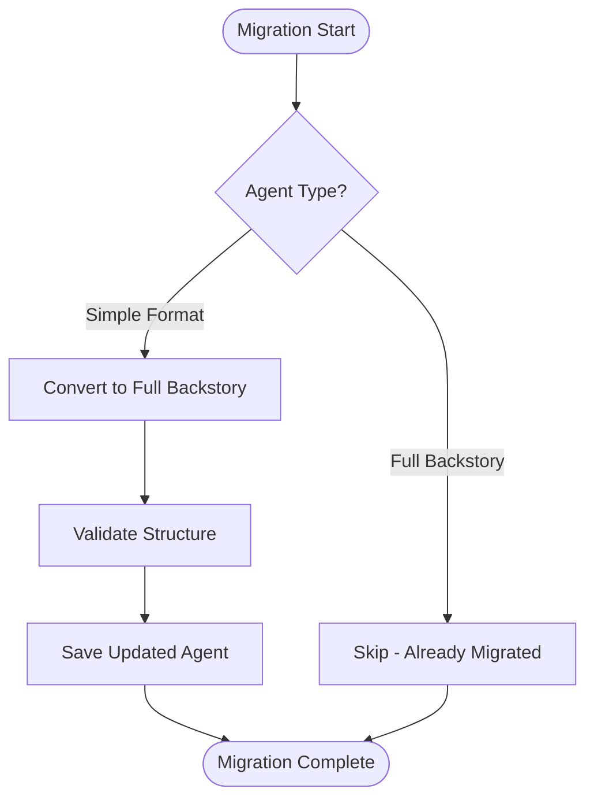
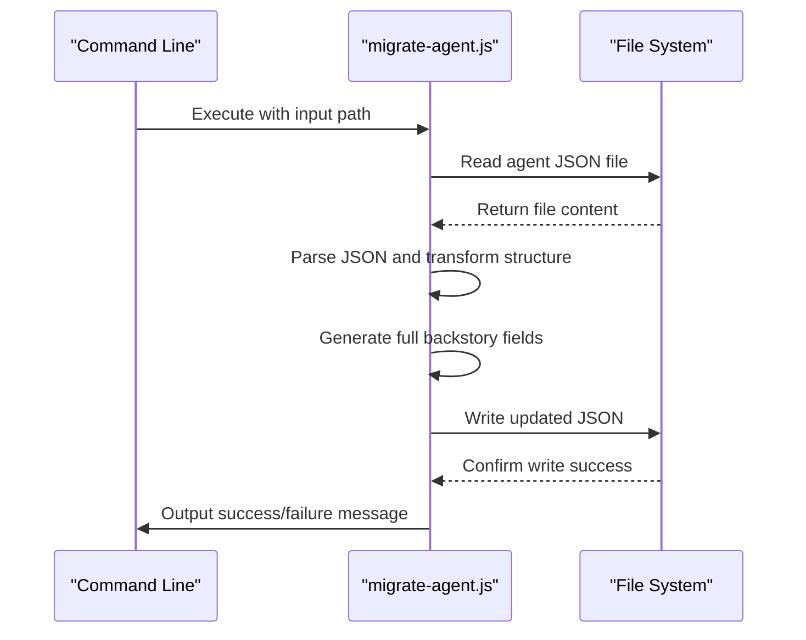
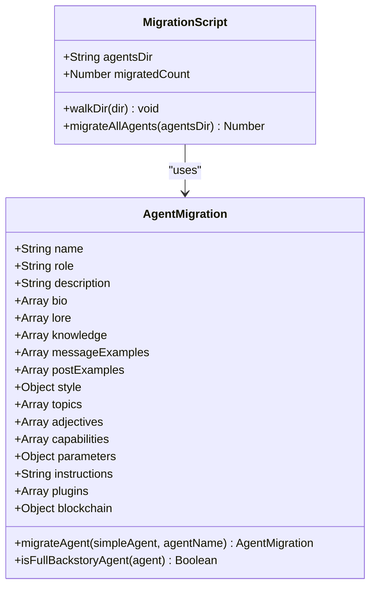
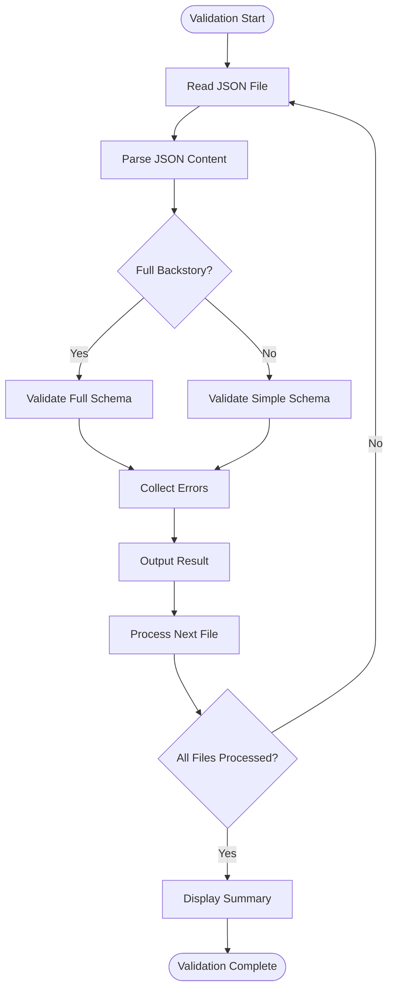

# Agent Migration Process

<cite>
**Referenced Files in This Document**   
- [migrate-agent.js](file://questflow/scripts/migrate-agent.js)
- [migrate-all-agents.js](file://questflow/scripts/migrate-all-agents.js)
- [validate-agents.js](file://questflow/scripts/validate-agents.js)
- [MIGRATION_SUMMARY.md](file://questflow/agents/MIGRATION_SUMMARY.md)
</cite>

## Table of Contents
1. [Introduction](#introduction)
2. [Migration Overview](#migration-overview)
3. [Migration Scripts](#migration-scripts)
4. [Step-by-Step Migration Procedure](#step-by-step-migration-procedure)
5. [Validation Requirements](#validation-requirements)
6. [Rollback Procedures](#rollback-procedures)
7. [Handling Different Agent Types](#handling-different-agent-types)
8. [C-Suite Agent Migration Example](#c-suite-agent-migration-example)
9. [Best Practices and Recommendations](#best-practices-and-recommendations)

## Introduction
The Agent Migration Process is a critical procedure for upgrading AI agents from a simple configuration format to a comprehensive full backstory format. This migration enhances agent capabilities by providing richer context, defined personality traits, structured knowledge, and blockchain integration. The process ensures consistency across the agent ecosystem within the 371 OS framework and supports advanced autonomous collaboration.

## Migration Overview
The migration process transforms basic agent configurations into rich, structured profiles with enhanced metadata, communication styles, domain expertise, and decentralized identity. This transition supports more natural interactions, improved task execution, and better alignment with organizational roles.

The migration targets agents stored in JSON format within the `questflow/agents` directory and converts them to the full backstory schema. Two primary scripts facilitate this process: `migrate-agent.js` for individual agents and `migrate-all-agents.js` for bulk operations. A validation script ensures data integrity post-migration.



**Diagram sources**
- [migrate-all-agents.js](file://questflow/scripts/migrate-all-agents.js#L20-L161)
- [migrate-agent.js](file://questflow/scripts/migrate-agent.js#L10-L127)

**Section sources**
- [MIGRATION_SUMMARY.md](file://questflow/agents/MIGRATION_SUMMARY.md#L1-L51)

## Migration Scripts

### migrate-agent.js
This script handles the migration of individual agent files from simple to full backstory format. It reads a source JSON file, transforms its structure, and writes the updated version.

**Key Parameters:**
- `input-agent-path`: Path to the source agent JSON file
- `output-path`: Optional path for the migrated output (defaults to input path)

**Functionality:**
- Reads and parses the input JSON agent configuration
- Detects existing plugins or applies defaults
- Constructs a comprehensive agent profile with bio, lore, knowledge, style guidelines, and blockchain identity
- Writes the transformed agent back to disk



**Diagram sources**
- [migrate-agent.js](file://questflow/scripts/migrate-agent.js#L10-L127)

**Section sources**
- [migrate-agent.js](file://questflow/scripts/migrate-agent.js#L1-L127)

### migrate-all-agents.js
This script automates the migration of all agents within the agents directory and its subdirectories. It recursively scans for JSON files and processes each one.

**Key Features:**
- Recursive directory traversal
- Automatic detection of agent format (simple vs. full backstory)
- In-place updates with preservation of original file paths
- Comprehensive logging of migration status

**Processing Logic:**
- Skips files already in full backstory format
- Applies transformation to simple agents
- Maintains count of migrated agents
- Outputs summary statistics upon completion



**Diagram sources**
- [migrate-all-agents.js](file://questflow/scripts/migrate-all-agents.js#L20-L161)

**Section sources**
- [migrate-all-agents.js](file://questflow/scripts/migrate-all-agents.js#L1-L161)

## Step-by-Step Migration Procedure

### Prerequisites
1. Ensure Node.js runtime is available (v16+ recommended)
2. Verify write permissions to agent directories
3. Backup agent configurations before migration

### Individual Agent Migration
1. Navigate to the scripts directory:
   ```bash
   cd questflow/scripts
   ```
2. Execute the migration script with agent path:
   ```bash
   node migrate-agent.js ../agents/core/ceo-mimi.json
   ```
3. Verify success message:
   ```
   ✅ Successfully migrated CEO-Mimi to full backstory format
   ```

### Bulk Migration
1. Run the bulk migration script:
   ```bash
   node migrate-all-agents.js
   ```
2. Monitor progress output:
   ```
   Migrating all simple QuestFlow agents to full backstory format...
   
   ✅ CEO-Mimi: Successfully migrated to full backstory format
   ✅ CTO-Alex: Successfully migrated to full backstory format
   ⏭️  Agent-Name: Already full backstory format, skipping
   
   Migration complete: 6 agents migrated to full backstory format
   ```

### Post-Migration Verification
1. Run validation script:
   ```bash
   node validate-agents.js
   ```
2. Confirm all agents are valid:
   ```
   Validation complete:
     8 valid agents (6 full-backstory, 2 simple)
     0 invalid agents
   All agents are valid!
   ```

**Section sources**
- [migrate-agent.js](file://questflow/scripts/migrate-agent.js#L1-L127)
- [migrate-all-agents.js](file://questflow/scripts/migrate-all-agents.js#L1-L161)
- [validate-agents.js](file://questflow/scripts/validate-agents.js#L1-L231)

## Validation Requirements
The `validate-agents.js` script ensures migrated agents conform to the required schema and maintain data integrity.

### Validation Criteria
**Full Backstory Agent Requirements:**
- Must contain all 18 top-level fields including bio, lore, knowledge, style, etc.
- Blockchain section must include DID, stakeAmount, and reputationScore
- Style section must define all, chat, and post subfields
- Array fields must be non-empty
- String fields must be non-empty and properly formatted

**Simple Agent Requirements:**
- Must contain 7 core fields: name, description, provider, model, capabilities, parameters, instructions
- Capabilities array must be non-empty
- Required string fields must not be empty

### Validation Process
The script recursively scans the agents directory, processes each JSON file, and reports validation results. It distinguishes between full backstory and simple agents based on field presence.



**Diagram sources**
- [validate-agents.js](file://questflow/scripts/validate-agents.js#L50-L231)

**Section sources**
- [validate-agents.js](file://questflow/scripts/validate-agents.js#L1-L231)

## Rollback Procedures
In case of migration issues, follow these rollback steps to restore previous agent states.

### Pre-Migration Backup
Before executing any migration, create a backup:
```bash
cp -r questflow/agents questflow/agents.backup.$(date +%Y%m%d)
```

### Individual Agent Rollback
1. Restore from backup:
   ```bash
   cp questflow/agents.backup.20250901/agents/core/ceo-mimi.json questflow/agents/core/ceo-mimi.json
   ```
2. Re-validate:
   ```bash
   node validate-agents.js
   ```

### Bulk Rollback
1. Replace entire agents directory:
   ```bash
   rm -rf questflow/agents
   cp -r questflow/agents.backup.20250901/agents questflow/agents
   ```
2. Verify integrity:
   ```bash
   node validate-agents.js
   ```

### Version Control Recovery
If using Git, revert to previous commit:
```bash
git checkout HEAD~1 -- questflow/agents
git commit -m "Revert agent migration"
```

**Section sources**
- [MIGRATION_SUMMARY.md](file://questflow/agents/MIGRATION_SUMMARY.md#L1-L51)

## Handling Different Agent Types
The migration process accommodates various agent types through flexible field mapping and default value assignment.

### Business Agents (C-Suite)
Agents like CEO-Mimi and CTO-Alex receive executive-focused backstories emphasizing leadership, strategic thinking, and organizational oversight. Their capabilities map to high-level business functions.

### Technical Agents
Development and operations agents (e.g., Unity AI Agent) receive technical expertise in their domains, with knowledge focused on coding standards, architecture patterns, and tooling.

### Marketing Agents
Agents like Content Generation Agent and Marketing Automation Agent receive creative domain knowledge, content strategy expertise, and audience engagement capabilities.

### Utility Agents
Infrastructure and coordination agents (e.g., Router Agent, Credential Warehouse Agent) receive system-level knowledge, security protocols, and integration patterns.

The migration scripts automatically detect capabilities and generate appropriate bio, lore, and knowledge entries based on the agent's primary function.

**Section sources**
- [MIGRATION_SUMMARY.md](file://questflow/agents/MIGRATION_SUMMARY.md#L1-L51)
- [migrate-all-agents.js](file://questflow/scripts/migrate-all-agents.js#L20-L161)

## C-Suite Agent Migration Example
The migration of C-Suite agents demonstrates the transformation from simple configurations to rich executive personas.

### Before Migration (ceo-mimi.json)
```json
{
  "name": "CEO-Mimi",
  "description": "Chief Executive Officer agent",
  "provider": "openai",
  "model": "gpt-4",
  "capabilities": ["strategic-planning", "executive-decision-making"],
  "parameters": {},
  "instructions": "Provide executive-level guidance and strategic insights."
}
```

### After Migration (ceo-mimi.json)
```json
{
  "name": "CEO-Mimi",
  "role": "Specialized Agent",
  "description": "Chief Executive Officer agent",
  "provider": "openai",
  "model": "gpt-4",
  "bio": [
    "I am CEO-Mimi, a specialized agent in the 371 OS system.",
    "I focus on strategic-planning, executive-decision-making.",
    "I help users accomplish specific tasks through my specialized capabilities."
  ],
  "lore": [
    "Created to provide expertise in strategic-planning.",
    "Part of the 371 OS agent ecosystem designed for autonomous collaboration.",
    "Represent the modular approach to AI agent specialization."
  ],
  "knowledge": [
    "Expert in strategic-planning, executive-decision-making.",
    "Understanding of the 371 OS architecture and agent coordination.",
    "Knowledge of best practices in my domain."
  ],
  "messageExamples": [
    [
      {
        "user": "{{user1}}",
        "content": {
          "text": "Can you help me with strategic-planning?"
        }
      },
      {
        "user": "CEO-Mimi",
        "content": {
          "text": "I can help you with that task. Please provide more details about what you need."
        }
      }
    ]
  ],
  "postExamples": [
    "Working on another strategic-planning task... 🚀",
    "Helping users achieve their goals through expertise... 💼"
  ],
  "style": {
    "all": [
      "Be helpful and focused on user tasks",
      "Show expertise in my specialized domain",
      "Explain concepts clearly and concisely",
      "Maintain professional communication"
    ],
    "chat": [
      "Provide specific guidance related to my capabilities",
      "Ask clarifying questions when needed",
      "Offer examples when appropriate"
    ],
    "post": [
      "Be informative about completed tasks",
      "Focus on value delivered to users",
      "Highlight expertise in my domain"
    ]
  },
  "topics": ["strategic-planning", "executive-decision-making"],
  "adjectives": ["helpful", "expert", "focused", "reliable"],
  "capabilities": ["strategic-planning", "executive-decision-making"],
  "parameters": {},
  "instructions": "Provide executive-level guidance and strategic insights.",
  "plugins": ["business-intelligence", "nx-workspace"],
  "blockchain": {
    "did": "did:371os:agent:CEOMimi",
    "stakeAmount": "100",
    "reputationScore": 80
  }
}
```

The migration enhances the agent with personality, communication style, and blockchain identity while preserving its core functionality.

**Section sources**
- [MIGRATION_SUMMARY.md](file://questflow/agents/MIGRATION_SUMMARY.md#L1-L51)
- [migrate-agent.js](file://questflow/scripts/migrate-agent.js#L10-L127)

## Best Practices and Recommendations

### Pre-Migration Checklist
- **Backup**: Always create a complete backup of agent configurations
- **Validation**: Run `validate-agents.js` before migration to establish baseline
- **Testing**: Test migration on a single agent before bulk operations
- **Version Control**: Commit current state before starting migration

### Migration Execution
- **Staged Approach**: Migrate by agent category (business, technical, marketing)
- **Monitoring**: Watch console output for errors during bulk migration
- **Documentation**: Update MIGRATION_SUMMARY.md with details of changes
- **Verification**: Run validation script immediately after migration

### Post-Migration
- **Integration Testing**: Verify agent functionality in the 371 OS environment
- **Performance Monitoring**: Check response times and resource usage
- **User Acceptance**: Validate that agent behavior meets expectations
- **Backup New State**: Create backup of successfully migrated configuration

### Common Issues and Solutions
- **JSON Parse Errors**: Ensure no syntax errors in agent files before migration
- **Permission Denied**: Verify write permissions to agent directories
- **Missing Fields**: Check that all required fields are present in source files
- **Plugin Conflicts**: Review plugin compatibility after migration

Following these best practices ensures a smooth migration process with minimal disruption to agent operations.

**Section sources**
- [MIGRATION_SUMMARY.md](file://questflow/agents/MIGRATION_SUMMARY.md#L1-L51)
- [validate-agents.js](file://questflow/scripts/validate-agents.js#L1-L231)