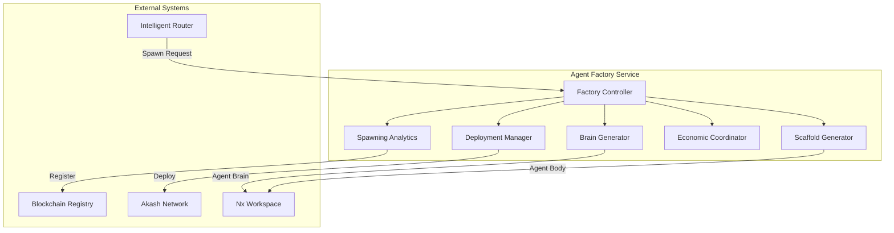
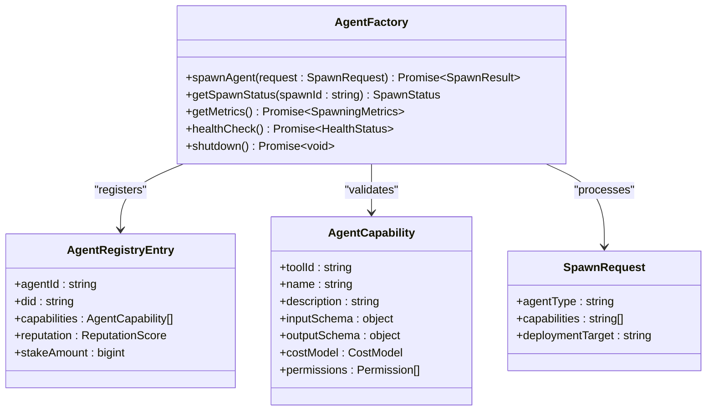
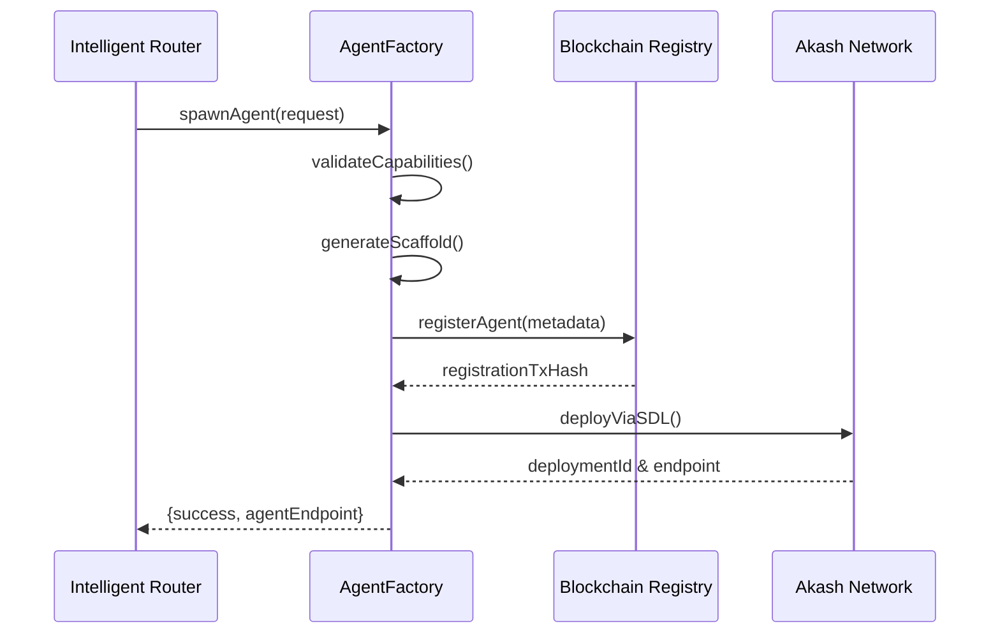

# Agent Productization Framework

<cite>
**Referenced Files in This Document **  
- [Workstream3-IMPLEMENTATION-COMPLETE.md](file://AB/sessions/abideas/Workstream3-IMPLEMENTATION-COMPLETE.md)
- [agent-factory/README.md](file://os-workspace/apps/agent-factory/README.md)
- [agent-factory/src/index.ts](file://os-workspace/apps/agent-factory/src/index.ts)
- [core-types/src/index.ts](file://os-workspace/libs/core-types/src/index.ts)
- [ping-agent/src/types.ts](file://os-workspace/apps/utility-agents/ping-agent/src/types.ts)
- [NEXE_PACKAGING_GUIDE.md](file://os-workspace/apps/utility-agents/NEXE_PACKAGING_GUIDE.md)
- [universal-tool-server/src/blockchain-registry.ts](file://os-workspace/packages/universal-tool-server/src/blockchain-registry.ts)
- [ceo-agent/src/index.ts](file://os-workspace/apps/ceo-agent/src/index.ts)
</cite>

## Table of Contents
1. [Introduction](#introduction)
2. [Architecture Overview](#architecture-overview)
3. [Core Components](#core-components)
4. [API Interfaces](#api-interfaces)
5. [Integration Patterns](#integration-patterns)
6. [Practical Examples](#practical-examples)
7. [Troubleshooting Guide](#troubleshooting-guide)
8. [Conclusion](#conclusion)

## Introduction
The Agent Productization Framework establishes a standardized architecture for creating autonomous agents within the 371 OS ecosystem. Completed on September 27, 2025, this framework delivers the world's first standardized blueprint for Nexe-compatible agents, enabling production-ready deployment across platforms. The implementation includes a comprehensive agent blueprint, proof-of-concept utility agent (Ping Agent), and seamless integration with the Nx workspace. This foundation supports unlimited agent creation, distribution, and enterprise deployment, positioning 371 OS as a leader in autonomous agent technology.

**Section sources**
- [Workstream3-IMPLEMENTATION-COMPLETE.md](file://AB/sessions/abideas/Workstream3-IMPLEMENTATION-COMPLETE.md#L1-L50)

## Architecture Overview
The Agent Productization Framework follows a microservices architecture centered around the Agent Factory, which orchestrates agent creation, scaffolding, deployment, and economic coordination. The system integrates with external platforms including the Intelligent Router, Blockchain Registry, Akash Network, and Nx Workspace to enable distributed agent operations.

**Diagram sources **
- [agent-factory/README.md](file://os-workspace/apps/agent-factory/README.md#L22-L75)

## Core Components
The framework consists of several core components that work together to enable standardized agent creation and deployment. These include the Factory Controller for orchestration, Brain Generator for personality mapping, Scaffold Generator for code generation, Deployment Manager for Akash Network deployment, Economic Coordinator for blockchain-based transactions, and Spawning Analytics for performance monitoring. All agents use embedded configuration with no external dependencies, ensuring self-contained executables. The architecture supports immediate production deployment via JavaScript bundles, Docker containers, or Akash Network deployment, with future extensibility for additional agent types, plugin systems, and marketplace integration.

**Section sources**
- [agent-factory/README.md](file://os-workspace/apps/agent-factory/README.md#L76-L150)
- [Workstream3-IMPLEMENTATION-COMPLETE.md](file://AB/sessions/abideas/Workstream3-IMPLEMENTATION-COMPLETE.md#L168-L207)

## API Interfaces
The framework defines standardized interfaces for agent registration, capability management, and execution. The `AgentRegistryEntry` interface includes agent identification, capabilities, reputation scoring, and economic terms. Capabilities are defined through structured schemas with input/output specifications, cost models, and permissions. The `AgentFactory` class provides methods for spawning agents, retrieving spawn status, obtaining metrics, and performing health checks. Enterprise-grade features include structured logging, comprehensive error handling, performance metrics tracking, and graceful shutdown procedures. Agents expose standard endpoints for status retrieval and performance monitoring.

**Diagram sources **
- [agent-factory/src/index.ts](file://os-workspace/apps/agent-factory/src/index.ts#L85-L223)
- [core-types/src/index.ts](file://os-workspace/libs/core-types/src/index.ts#L8-L53)

## Integration Patterns
The framework implements several key integration patterns for seamless operation within the 371 OS ecosystem. Agents are registered on the blockchain through IPFS-stored metadata and smart contract transactions, enabling decentralized coordination. The Intelligent Router submits spawn requests to the Factory Controller based on capability gaps. Deployments target the Akash Network using Stack Definition Language (SDL) manifests for cost-efficient execution. Nx Workspace integration enables standardized project scaffolding with proper dependency management and build configurations. The system supports multiple deployment strategies including JavaScript bundles for immediate execution, Docker containers for portability, and Nexe-packaged binaries for standalone operation.

**Diagram sources **
- [universal-tool-server/src/blockchain-registry.ts](file://os-workspace/packages/universal-tool-server/src/blockchain-registry.ts#L89-L124)
- [agent-factory/src/index.ts](file://os-workspace/apps/agent-factory/src/index.ts#L85-L223)

## Practical Examples
The Ping Agent serves as a production-ready example of the agent blueprint implementation, featuring 582 lines of TypeScript code with enterprise-grade capabilities. It demonstrates cross-platform compatibility by handling both Windows (`ping -n`) and Unix/Linux (`ping -c`) command syntax. The agent includes structured logging, comprehensive error handling, performance metrics tracking, and health checks. Build commands enable standard compilation via `bun nx build ping-agent` and execution through Node.js. For standalone deployment, Nexe packaging is supported with appropriate environment setup. The framework enables programmatic agent creation through the factory pattern, allowing instantiation of various agent types including web scrapers, database agents, and specialized capability agents from configuration templates.

**Section sources**
- [Workstream3-IMPLEMENTATION-COMPLETE.md](file://AB/sessions/abideas/Workstream3-IMPLEMENTATION-COMPLETE.md#L208-L275)
- [NEXE_PACKAGING_GUIDE.md](file://os-workspace/apps/utility-agents/NEXE_PACKAGING_GUIDE.md#L1-L100)

## Troubleshooting Guide
Common issues primarily relate to Nexe packaging environment dependencies. The primary challenge involves NASM (Netwide Assembler) requirements for OpenSSL compilation on Windows. Recommended resolution strategies include: (1) Using JavaScript bundles for immediate deployment, which maintains full functionality without external dependencies; (2) Installing NASM and Visual Studio Build Tools for complete Nexe compilation; or (3) Utilizing alternative packaging solutions like PKG or Docker containers. All agents provide built-in health checks and structured logging to facilitate debugging. The framework ensures zero impact on agent functionality during packaging transitions, as all features work perfectly with JavaScript bundles while native binary compilation is being configured.

**Section sources**
- [Workstream3-IMPLEMENTATION-COMPLETE.md](file://AB/sessions/abideas/Workstream3-IMPLEMENTATION-COMPLETE.md#L138-L167)
- [ceo-agent/src/index.ts](file://os-workspace/apps/ceo-agent/src/index.ts#L323-L349)

## Conclusion
The Agent Productization Framework delivers a revolutionary, production-ready architecture for autonomous agent development and deployment. By establishing the world's first standardized blueprint for Nexe-compatible agents, it enables scalable creation, distribution, and monetization of agents across the 371 OS ecosystem. The successful implementation of the Ping Agent proof-of-concept validates the framework's enterprise readiness, cross-platform compatibility, and seamless integration with existing infrastructure. With immediate deployment capabilities and clear pathways for future enhancement—including agent marketplaces, Puter.js integration, and advanced blockchain coordination—the framework provides a transformative foundation for the next generation of autonomous systems.