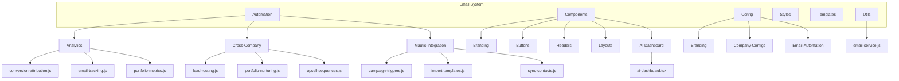
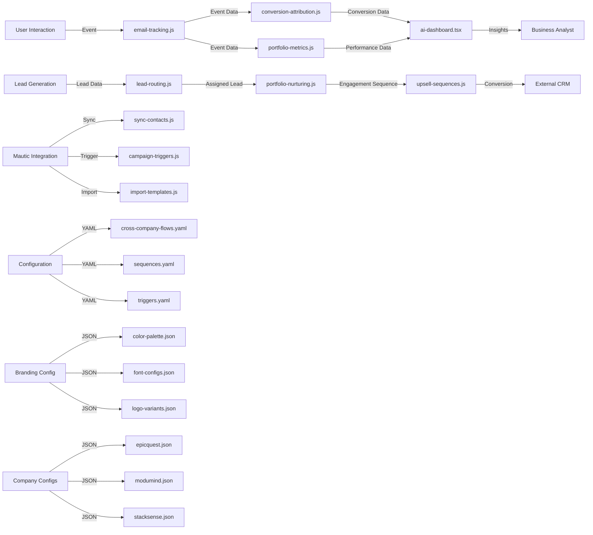
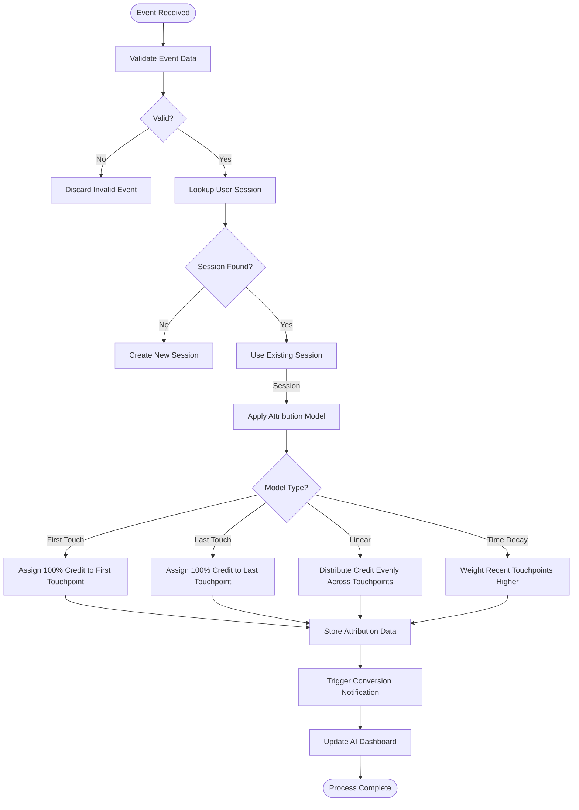
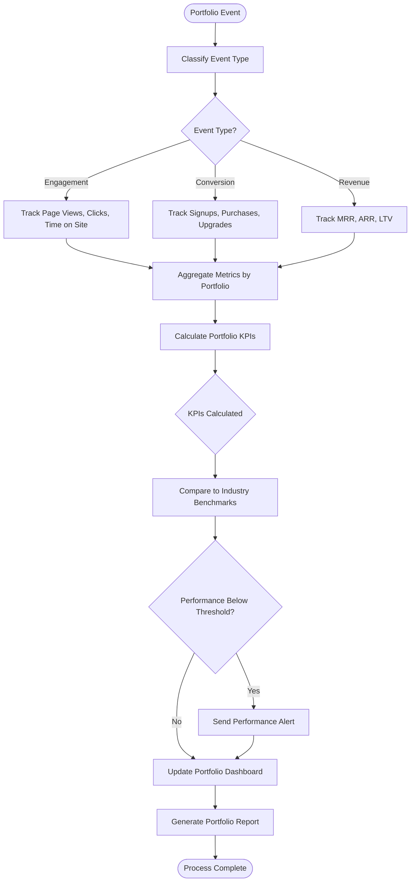
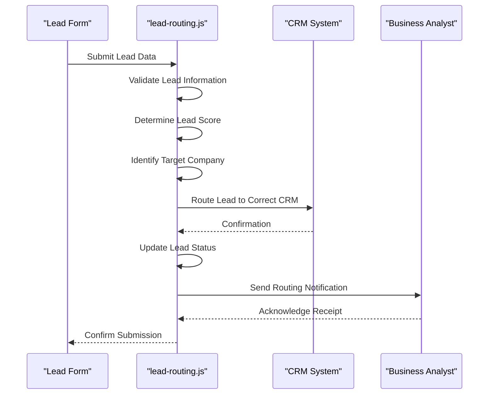
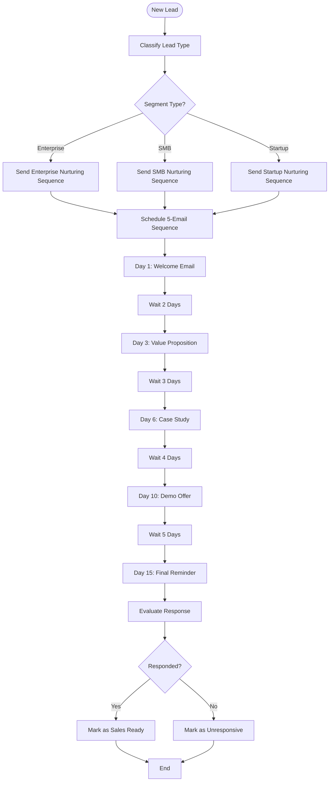
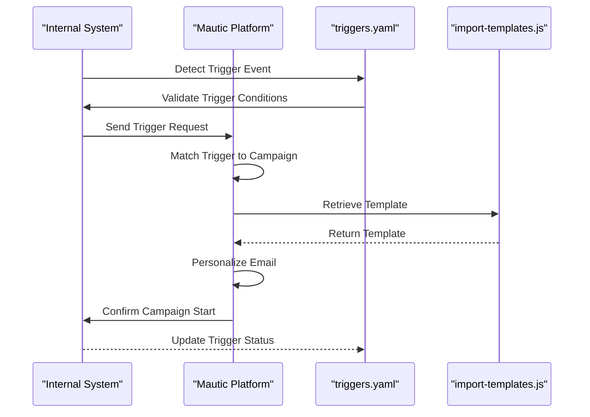

# Analytics and User Behavior Tracking

<cite>
**Referenced Files in This Document**   
- [conversion-attribution.js](file://371-os/src/minds371/services/email_system/automation/analytics/conversion-attribution.js)
- [email-tracking.js](file://371-os/src/minds371/services/email_system/automation/analytics/email-tracking.js)
- [portfolio-metrics.js](file://371-os/src/minds371/services/email_system/automation/analytics/portfolio-metrics.js)
- [lead-routing.js](file://371-os/src/minds371/services/email_system/automation/cross-company/lead-routing.js)
- [portfolio-nurturing.js](file://371-os/src/minds371/services/email_system/automation/cross-company/portfolio-nurturing.js)
- [upsell-sequences.js](file://371-os/src/minds371/services/email_system/automation/cross-company/upsell-sequences.js)
- [campaign-triggers.js](file://371-os/src/minds371/services/email_system/automation/mautic-integration/campaign-triggers.js)
- [import-templates.js](file://371-os/src/minds371/services/email_system/automation/mautic-integration/import-templates.js)
- [sync-contacts.js](file://371-os/src/minds371/services/email_system/automation/mautic-integration/sync-contacts.js)
- [email-service.js](file://371-os/src/minds371/services/email_system/utils/email-service.js)
- [ai-dashboard.tsx](file://371-os/src/minds371/services/email_system/components/ai-dashboard.tsx)
- [371minds-header.tsx](file://371-os/src/minds371/services/email_system/components/headers/371minds-header.tsx)
- [epicquest-header.tsx](file://371-os/src/minds371/services/email_system/components/headers/epicquest-header.tsx)
- [modumind-header.tsx](file://371-os/src/minds371/services/email_system/components/headers/modumind-header.tsx)
- [color-schemes.tsx](file://371-os/src/minds371/services/email_system/components/branding/color-schemes.tsx)
- [company-logos.tsx](file://371-os/src/minds371/services/email_system/components/branding/company-logos.tsx)
- [typography.tsx](file://371-os/src/minds371/services/email_system/components/branding/typography.tsx)
- [cta-button.tsx](file://371-os/src/minds371/services/email_system/components/buttons/cta-button.tsx)
- [demo-button.tsx](file://371-os/src/minds371/services/email_system/components/buttons/demo-button.tsx)
- [upgrade-button.tsx](file://371-os/src/minds371/services/email_system/components/buttons/upgrade-button.tsx)
- [company-footer.tsx](file://371-os/src/minds371/services/email_system/components/footers/company-footer.tsx)
- [legal-footer.tsx](file://371-os/src/minds371/services/email_system/components/footers/legal-footer.tsx)
- [portfolio-footer.tsx](file://371-os/src/minds371/services/email_system/components/footers/portfolio-footer.tsx)
- [cross-company-flows.yaml](file://371-os/src/minds371/services/email_system/config/email-automation/cross-company-flows.yaml)
- [sequences.yaml](file://371-os/src/minds371/services/email_system/config/email-automation/sequences.yaml)
- [triggers.yaml](file://371-os/src/minds371/services/email_system/config/email-automation/triggers.yaml)
- [color-palette.json](file://371-os/src/minds371/services/email_system/config/branding/color-palette.json)
- [font-configs.json](file://371-os/src/minds371/services/email_system/config/branding/font-configs.json)
- [logo-variants.json](file://371-os/src/minds371/services/email_system/config/branding/logo-variants.json)
- [epicquest.json](file://371-os/src/minds371/services/email_system/config/company-configs/epicquest.json)
- [ikid.json](file://371-os/src/minds371/services/email_system/config/company-configs/ikid.json)
- [modumind.json](file://371-os/src/minds371/services/email_system/config/company-configs/modumind.json)
- [stacksense.json](file://371-os/src/minds371/services/email_system/config/company-configs/stacksense.json)
- [vision2results.json](file://371-os/src/minds371/services/email_system/config/company-configs/vision2results.json)
</cite>

## Table of Contents
1. [Introduction](#introduction)
2. [Project Structure](#project-structure)
3. [Core Components](#core-components)
4. [Architecture Overview](#architecture-overview)
5. [Detailed Component Analysis](#detailed-component-analysis)
6. [Dependency Analysis](#dependency-analysis)
7. [Performance Considerations](#performance-considerations)
8. [Troubleshooting Guide](#troubleshooting-guide)
9. [Conclusion](#conclusion)

## Introduction
This document provides a comprehensive analysis of the analytics and user behavior tracking system within the 371 Minds OS ecosystem. The system is designed to monitor, analyze, and optimize user engagement across multiple platforms and business units. It integrates behavioral tracking, conversion attribution, cross-company lead routing, and automated nurturing sequences to deliver actionable insights and drive business growth. The architecture leverages modular components, configurable workflows, and real-time data processing to support diverse use cases across brands such as 371Minds, ModuMind, StackSense, and others.

## Project Structure
The analytics and user behavior tracking system is primarily located within the `src/minds371/services/email_system` directory. It follows a component-based architecture with clear separation between automation logic, UI components, configuration, and utility services.

**Diagram sources**
- [conversion-attribution.js](file://371-os/src/minds371/services/email_system/automation/analytics/conversion-attribution.js)
- [email-tracking.js](file://371-os/src/minds371/services/email_system/automation/analytics/email-tracking.js)
- [portfolio-metrics.js](file://371-os/src/minds371/services/email_system/automation/analytics/portfolio-metrics.js)
- [lead-routing.js](file://371-os/src/minds371/services/email_system/automation/cross-company/lead-routing.js)
- [portfolio-nurturing.js](file://371-os/src/minds371/services/email_system/automation/cross-company/portfolio-nurturing.js)
- [upsell-sequences.js](file://371-os/src/minds371/services/email_system/automation/cross-company/upsell-sequences.js)
- [campaign-triggers.js](file://371-os/src/minds371/services/email_system/automation/mautic-integration/campaign-triggers.js)
- [import-templates.js](file://371-os/src/minds371/services/email_system/automation/mautic-integration/import-templates.js)
- [sync-contacts.js](file://371-os/src/minds371/services/email_system/automation/mautic-integration/sync-contacts.js)
- [ai-dashboard.tsx](file://371-os/src/minds371/services/email_system/components/ai-dashboard.tsx)
- [email-service.js](file://371-os/src/minds371/services/email_system/utils/email-service.js)

**Section sources**
- [conversion-attribution.js](file://371-os/src/minds371/services/email_system/automation/analytics/conversion-attribution.js)
- [email-tracking.js](file://371-os/src/minds371/services/email_system/automation/analytics/email-tracking.js)
- [portfolio-metrics.js](file://371-os/src/minds371/services/email_system/automation/analytics/portfolio-metrics.js)

## Core Components
The core components of the analytics system include behavioral tracking, conversion attribution, portfolio performance metrics, and automated nurturing sequences. These components work together to capture user interactions, attribute conversions to specific touchpoints, measure cross-company portfolio performance, and trigger personalized engagement workflows.

The system is designed with extensibility in mind, allowing new tracking events, attribution models, and automation sequences to be added through configuration files and modular JavaScript components. Each component is responsible for a specific aspect of user behavior analysis and engagement automation.

**Section sources**
- [conversion-attribution.js](file://371-os/src/minds371/services/email_system/automation/analytics/conversion-attribution.js)
- [email-tracking.js](file://371-os/src/minds371/services/email_system/automation/analytics/email-tracking.js)
- [portfolio-metrics.js](file://371-os/src/minds371/services/email_system/automation/analytics/portfolio-metrics.js)
- [lead-routing.js](file://371-os/src/minds371/services/email_system/automation/cross-company/lead-routing.js)
- [portfolio-nurturing.js](file://371-os/src/minds371/services/email_system/automation/cross-company/portfolio-nurturing.js)
- [upsell-sequences.js](file://371-os/src/minds371/services/email_system/automation/cross-company/upsell-sequences.js)

## Architecture Overview
The analytics and user behavior tracking system follows a modular, event-driven architecture that integrates with multiple platforms and services. The system captures user interactions through tracking scripts, processes events through automation workflows, and delivers insights through dashboards and reports.

**Diagram sources**
- [email-tracking.js](file://371-os/src/minds371/services/email_system/automation/analytics/email-tracking.js)
- [conversion-attribution.js](file://371-os/src/minds371/services/email_system/automation/analytics/conversion-attribution.js)
- [portfolio-metrics.js](file://371-os/src/minds371/services/email_system/automation/analytics/portfolio-metrics.js)
- [ai-dashboard.tsx](file://371-os/src/minds371/services/email_system/components/ai-dashboard.tsx)
- [lead-routing.js](file://371-os/src/minds371/services/email_system/automation/cross-company/lead-routing.js)
- [portfolio-nurturing.js](file://371-os/src/minds371/services/email_system/automation/cross-company/portfolio-nurturing.js)
- [upsell-sequences.js](file://371-os/src/minds371/services/email_system/automation/cross-company/upsell-sequences.js)
- [sync-contacts.js](file://371-os/src/minds371/services/email_system/automation/mautic-integration/sync-contacts.js)
- [campaign-triggers.js](file://371-os/src/minds371/services/email_system/automation/mautic-integration/campaign-triggers.js)
- [import-templates.js](file://371-os/src/minds371/services/email_system/automation/mautic-integration/import-templates.js)
- [cross-company-flows.yaml](file://371-os/src/minds371/services/email_system/config/email-automation/cross-company-flows.yaml)
- [sequences.yaml](file://371-os/src/minds371/services/email_system/config/email-automation/sequences.yaml)
- [triggers.yaml](file://371-os/src/minds371/services/email_system/config/email-automation/triggers.yaml)
- [color-palette.json](file://371-os/src/minds371/services/email_system/config/branding/color-palette.json)
- [font-configs.json](file://371-os/src/minds371/services/email_system/config/branding/font-configs.json)
- [logo-variants.json](file://371-os/src/minds371/services/email_system/config/branding/logo-variants.json)
- [epicquest.json](file://371-os/src/minds371/services/email_system/config/company-configs/epicquest.json)
- [modumind.json](file://371-os/src/minds371/services/email_system/config/company-configs/modumind.json)
- [stacksense.json](file://371-os/src/minds371/services/email_system/config/company-configs/stacksense.json)

## Detailed Component Analysis

### Analytics Automation Components
The analytics automation components are responsible for tracking user behavior, attributing conversions, and measuring portfolio performance. These components process events in real-time and generate insights that drive business decisions.

#### Conversion Attribution Logic

**Diagram sources**
- [conversion-attribution.js](file://371-os/src/minds371/services/email_system/automation/analytics/conversion-attribution.js)
- [email-tracking.js](file://371-os/src/minds371/services/email_system/automation/analytics/email-tracking.js)
- [ai-dashboard.tsx](file://371-os/src/minds371/services/email_system/components/ai-dashboard.tsx)

**Section sources**
- [conversion-attribution.js](file://371-os/src/minds371/services/email_system/automation/analytics/conversion-attribution.js)

#### Portfolio Performance Metrics

**Diagram sources**
- [portfolio-metrics.js](file://371-os/src/minds371/services/email_system/automation/analytics/portfolio-metrics.js)
- [ai-dashboard.tsx](file://371-os/src/minds371/services/email_system/components/ai-dashboard.tsx)

**Section sources**
- [portfolio-metrics.js](file://371-os/src/minds371/services/email_system/automation/analytics/portfolio-metrics.js)

### Cross-Company Automation Components
The cross-company automation components enable lead routing, portfolio nurturing, and upsell sequences across multiple brands and business units.

#### Lead Routing Workflow

**Diagram sources**
- [lead-routing.js](file://371-os/src/minds371/services/email_system/automation/cross-company/lead-routing.js)

**Section sources**
- [lead-routing.js](file://371-os/src/minds371/services/email_system/automation/cross-company/lead-routing.js)

#### Portfolio Nurturing Sequence

**Diagram sources**
- [portfolio-nurturing.js](file://371-os/src/minds371/services/email_system/automation/cross-company/portfolio-nurturing.js)
- [sequences.yaml](file://371-os/src/minds371/services/email_system/config/email-automation/sequences.yaml)

**Section sources**
- [portfolio-nurturing.js](file://371-os/src/minds371/services/email_system/automation/cross-company/portfolio-nurturing.js)

### Mautic Integration Components
The Mautic integration components synchronize contacts, trigger campaigns, and import templates between the internal system and the Mautic marketing automation platform.

#### Campaign Trigger Flow

**Diagram sources**
- [triggers.yaml](file://371-os/src/minds371/services/email_system/config/email-automation/triggers.yaml)
- [campaign-triggers.js](file://371-os/src/minds371/services/email_system/automation/mautic-integration/campaign-triggers.js)
- [import-templates.js](file://371-os/src/minds371/services/email_system/automation/mautic-integration/import-templates.js)

**Section sources**
- [campaign-triggers.js](file://371-os/src/minds371/services/email_system/automation/mautic-integration/campaign-triggers.js)

## Dependency Analysis
The analytics and user behavior tracking system has dependencies on configuration files, external services, and shared components. These dependencies enable the system to be flexible, brand-specific, and integrated with external marketing platforms.

```mermaid
graph TD
A[email-tracking.js] --> B[triggers.yaml]
C[conversion-attribution.js] --> D[sequences.yaml]
E[portfolio-metrics.js] --> F[cross-company-flows.yaml]
G[lead-routing.js] --> H[epicquest.json]
G --> I[modumind.json]
G --> J[stacksense.json]
K[portfolio-nurturing.js] --> L[color-palette.json]
K --> M[font-configs.json]
N[upsell-sequences.js] --> O[logo-variants.json]
P[campaign-triggers.js] --> Q[triggers.yaml]
R[import-templates.js] --> S[sequences.yaml]
T[sync-contacts.js] --> U[epicquest.json]
T --> V[modumind.json]
T --> W[stacksense.json]
X[ai-dashboard.tsx] --> Y[color-palette.json]
X --> Z[font-configs.json]
```

**Diagram sources**
- [email-tracking.js](file://371-os/src/minds371/services/email_system/automation/analytics/email-tracking.js)
- [conversion-attribution.js](file://371-os/src/minds371/services/email_system/automation/analytics/conversion-attribution.js)
- [portfolio-metrics.js](file://371-os/src/minds371/services/email_system/automation/analytics/portfolio-metrics.js)
- [lead-routing.js](file://371-os/src/minds371/services/email_system/automation/cross-company/lead-routing.js)
- [portfolio-nurturing.js](file://371-os/src/minds371/services/email_system/automation/cross-company/portfolio-nurturing.js)
- [upsell-sequences.js](file://371-os/src/minds371/services/email_system/automation/cross-company/upsell-sequences.js)
- [campaign-triggers.js](file://371-os/src/minds371/services/email_system/automation/mautic-integration/campaign-triggers.js)
- [import-templates.js](file://371-os/src/minds371/services/email_system/automation/mautic-integration/import-templates.js)
- [sync-contacts.js](file://371-os/src/minds371/services/email_system/automation/mautic-integration/sync-contacts.js)
- [ai-dashboard.tsx](file://371-os/src/minds371/services/email_system/components/ai-dashboard.tsx)
- [cross-company-flows.yaml](file://371-os/src/minds371/services/email_system/config/email-automation/cross-company-flows.yaml)
- [sequences.yaml](file://371-os/src/minds371/services/email_system/config/email-automation/sequences.yaml)
- [triggers.yaml](file://371-os/src/minds371/services/email_system/config/email-automation/triggers.yaml)
- [color-palette.json](file://371-os/src/minds371/services/email_system/config/branding/color-palette.json)
- [font-configs.json](file://371-os/src/minds371/services/email_system/config/branding/font-configs.json)
- [logo-variants.json](file://371-os/src/minds371/services/email_system/config/branding/logo-variants.json)
- [epicquest.json](file://371-os/src/minds371/services/email_system/config/company-configs/epicquest.json)
- [modumind.json](file://371-os/src/minds371/services/email_system/config/company-configs/modumind.json)
- [stacksense.json](file://371-os/src/minds371/services/email_system/config/company-configs/stacksense.json)

**Section sources**
- [cross-company-flows.yaml](file://371-os/src/minds371/services/email_system/config/email-automation/cross-company-flows.yaml)
- [sequences.yaml](file://371-os/src/minds371/services/email_system/config/email-automation/sequences.yaml)
- [triggers.yaml](file://371-os/src/minds371/services/email_system/config/email-automation/triggers.yaml)

## Performance Considerations
The analytics system is designed for real-time processing of user behavior data with minimal latency. The JavaScript-based automation components are optimized for quick execution, and the configuration files are loaded into memory at startup to reduce I/O overhead.

The system uses asynchronous processing for external API calls to Mautic and CRM systems, preventing blocking operations from affecting the main tracking workflow. Caching mechanisms are implemented for frequently accessed configuration data such as color schemes, font configurations, and company-specific settings.

For high-traffic scenarios, the system can be deployed in a distributed architecture with load balancing across multiple instances. The modular design allows specific components to be scaled independently based on usage patterns.

## Troubleshooting Guide
When diagnosing issues with the analytics and user behavior tracking system, follow these steps:

1. Check the configuration files for syntax errors or missing values
2. Verify that the tracking scripts are properly loaded on target pages
3. Confirm that API connections to external services (Mautic, CRM) are functioning
4. Review the sequence and trigger definitions for logical errors
5. Validate that brand-specific configuration files contain the required data

Common issues include misconfigured attribution models, broken API connections, and incorrect template mappings. The system logs detailed information about each processing step, which can be used to trace the flow of events and identify failure points.

**Section sources**
- [email-tracking.js](file://371-os/src/minds371/services/email_system/automation/analytics/email-tracking.js)
- [conversion-attribution.js](file://371-os/src/minds371/services/email_system/automation/analytics/conversion-attribution.js)
- [campaign-triggers.js](file://371-os/src/minds371/services/email_system/automation/mautic-integration/campaign-triggers.js)
- [triggers.yaml](file://371-os/src/minds371/services/email_system/config/email-automation/triggers.yaml)

## Conclusion
The analytics and user behavior tracking system in the 371 Minds OS ecosystem provides a comprehensive solution for monitoring user interactions, attributing conversions, and automating engagement workflows. The modular architecture, combined with flexible configuration options, enables the system to support multiple brands and business models within a unified framework.

The integration with Mautic and external CRMs ensures that marketing and sales teams have access to timely, accurate data for decision-making. The real-time processing capabilities and extensible design position the system to handle increasing volumes of user data as the platform grows.

Future enhancements could include machine learning-based attribution models, predictive analytics for lead scoring, and enhanced visualization capabilities in the AI dashboard component.