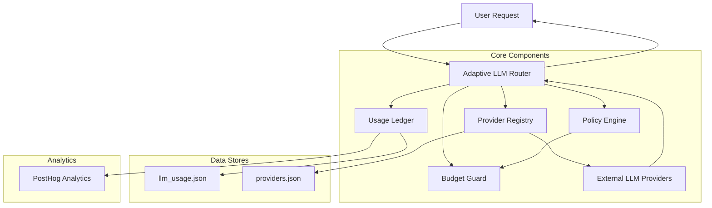
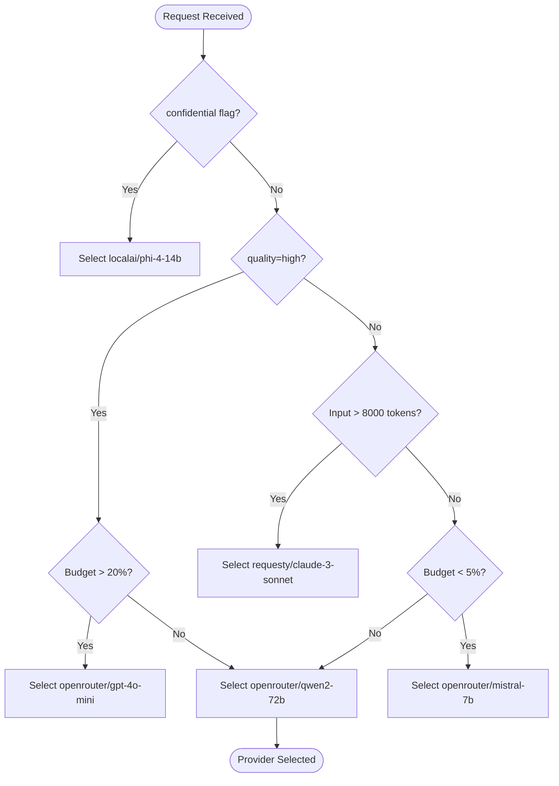
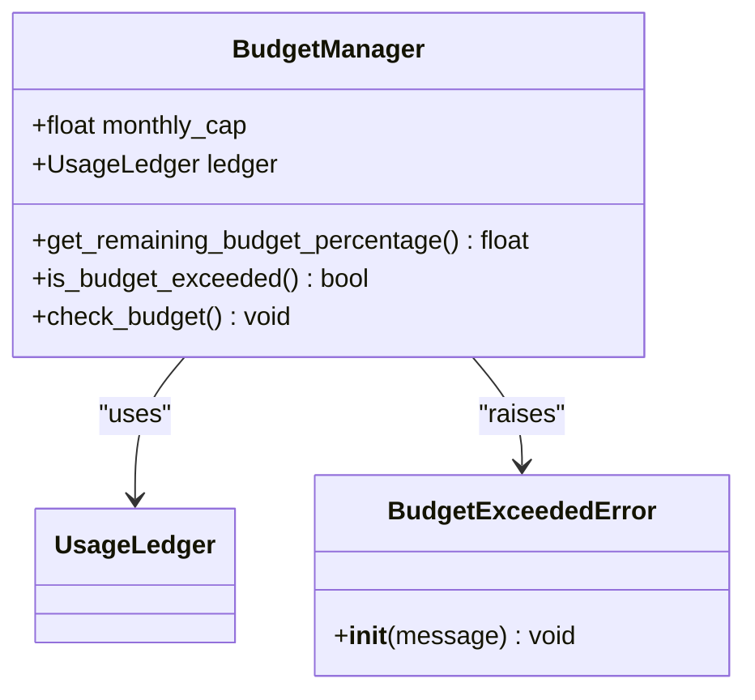
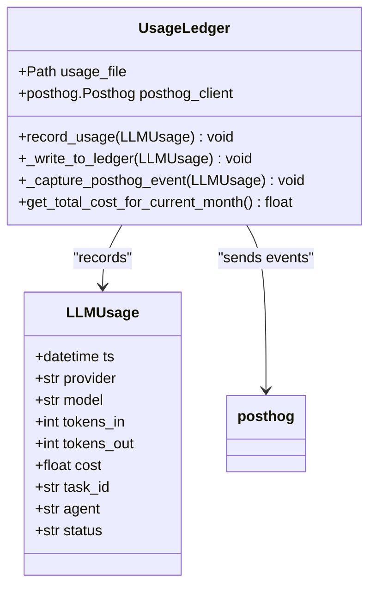
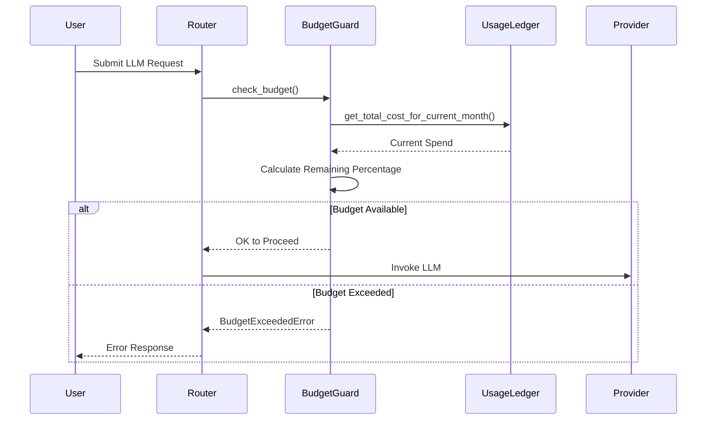
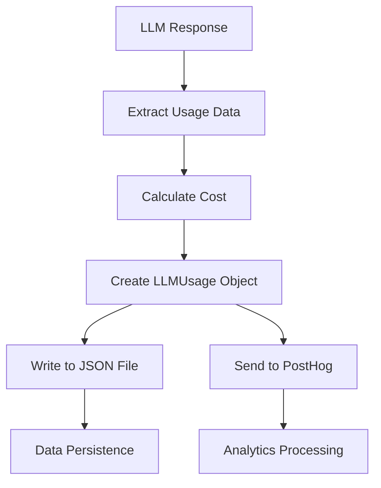
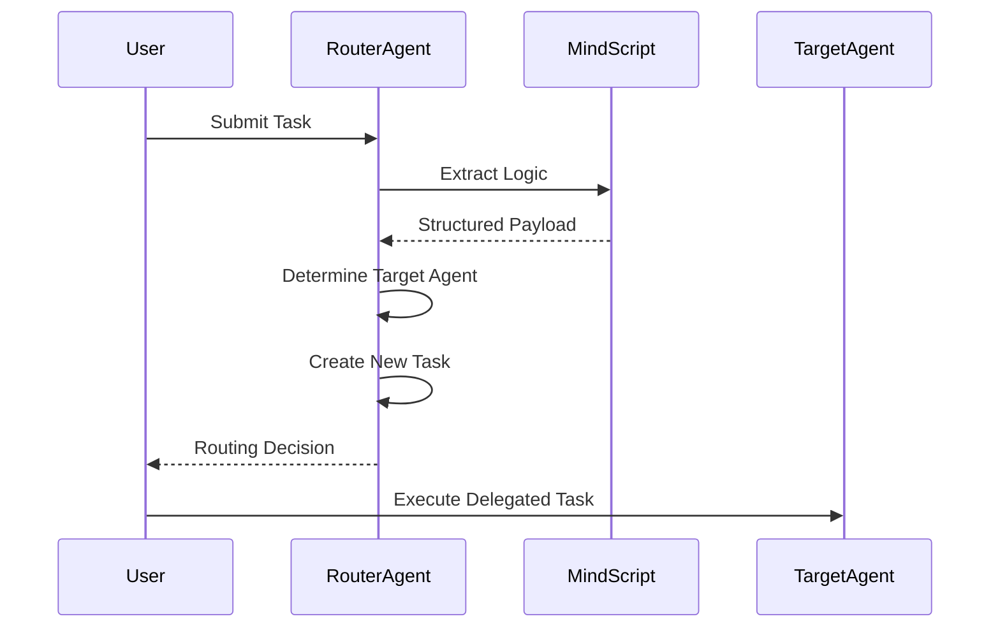
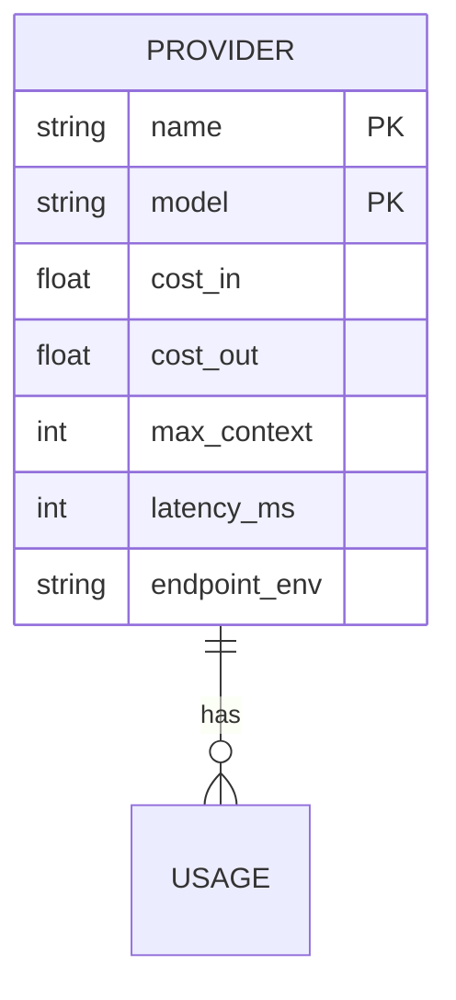

# Adaptive LLM Router Architecture

<cite>
**Referenced Files in This Document**   
- [adaptive_llm_router\llm.py](file://371-os/src/minds371/adaptive_llm_router/llm.py#L1-L92)
- [adaptive_llm_router\policy_engine.py](file://371-os/src/minds371/adaptive_llm_router/policy_engine.py#L1-L34)
- [adaptive_llm_router\budget_guard.py](file://371-os/src/minds371/adaptive_llm_router/budget_guard.py#L1-L50)
- [adaptive_llm_router\usage_ledger.py](file://371-os/src/minds371/adaptive_llm_router/usage_ledger.py#L1-L89)
- [adaptive_llm_router\provider_registry.py](file://371-os/src/minds371/adaptive_llm_router/provider_registry.py#L1-L45)
- [adaptive_llm_router\providers.json](file://371-os/src/minds371/adaptive_llm_router/providers.json#L1-L48)
- [adaptive_llm_router\data_models.py](file://371-os/src/minds371/adaptive_llm_router/data_models.py#L1-L40)
- [adaptive_llm_router\config.py](file://371-os/src/minds371/adaptive_llm_router/config.py#L1-L7)
- [adaptive_llm_router\intelligent_router_agent.py](file://371-os/src/minds371/adaptive_llm_router/intelligent_router_agent.py#L1-L105)
- [agents\mindscript_agent.py](file://371-os/src/minds371/agents/mindscript_agent.py#L1-L89)
- [agents\base_agent\improved_base_agent.py](file://371-os/src/minds371/agents/base_agent/improved_base_agent.py#L1-L199)
- [Adaptive_Router_Logic.md](file://371-os/Adaptive_Router_Logic.md#L1-L36)
</cite>

## Table of Contents
1. [Introduction](#introduction)
2. [Core Components](#core-components)
3. [Architecture Overview](#architecture-overview)
4. [Detailed Component Analysis](#detailed-component-analysis)
5. [Decision-Making Logic](#decision-making-logic)
6. [Budget and Cost Control](#budget-and-cost-control)
7. [Usage Tracking and Data Flow](#usage-tracking-and-data-flow)
8. [Intelligent Task Routing](#intelligent-task-routing)
9. [Provider Management and Extensibility](#provider-management-and-extensibility)
10. [Configuration and Policy Examples](#configuration-and-policy-examples)
11. [Performance Optimization](#performance-optimization)
12. [Conclusion](#conclusion)

## Introduction

The Adaptive LLM Router is a core component of the 371OS system, designed to intelligently route LLM (Large Language Model) requests across multiple providers based on cost, performance, and budget constraints. This architecture ensures optimal resource utilization while maintaining high-quality service delivery. The system integrates cost-aware decision-making, real-time usage tracking, and dynamic provider selection to balance efficiency and effectiveness.

The router operates as a middleware layer between user requests and LLM endpoints, abstracting provider complexity and enforcing organizational policies. It leverages a modular design with distinct components for policy evaluation, budget enforcement, usage accounting, and provider management. This documentation provides a comprehensive analysis of the system's architecture, implementation details, and operational workflows.

## Core Components

The Adaptive LLM Router consists of several interconnected components that work together to provide intelligent routing capabilities:

- **Provider Registry**: Manages the catalog of available LLM providers and their capabilities
- **Policy Engine**: Evaluates routing decisions based on task metadata and constraints
- **Budget Guard**: Enforces spending limits and prevents budget overruns
- **Usage Ledger**: Tracks all LLM usage for cost calculation and analytics
- **Intelligent Router Agent**: Delegates tasks to specialized C-suite agents based on content analysis

These components form a cohesive system that optimizes LLM usage across cost, performance, and strategic objectives. The architecture follows a microservices-inspired pattern with clear separation of concerns, enabling independent development and scaling of each component.

**Section sources**
- [adaptive_llm_router\llm.py](file://371-os/src/minds371/adaptive_llm_router/llm.py#L1-L92)
- [adaptive_llm_router\policy_engine.py](file://371-os/src/minds371/adaptive_llm_router/policy_engine.py#L1-L34)
- [adaptive_llm_router\budget_guard.py](file://371-os/src/minds371/adaptive_llm_router/budget_guard.py#L1-L50)

## Architecture Overview



**Diagram sources**
- [adaptive_llm_router\llm.py](file://371-os/src/minds371/adaptive_llm_router/llm.py#L1-L92)
- [adaptive_llm_router\policy_engine.py](file://371-os/src/minds371/adaptive_llm_router/policy_engine.py#L1-L34)
- [adaptive_llm_router\budget_guard.py](file://371-os/src/minds371/adaptive_llm_router/budget_guard.py#L1-L50)
- [adaptive_llm_router\usage_ledger.py](file://371-os/src/minds371/adaptive_llm_router/usage_ledger.py#L1-L89)
- [adaptive_llm_router\provider_registry.py](file://371-os/src/minds371/adaptive_llm_router/provider_registry.py#L1-L45)

## Detailed Component Analysis

### Policy Engine Analysis

The Policy Engine implements the decision-making logic for LLM provider selection based on multiple factors including task requirements, cost considerations, and budget availability.



**Diagram sources**
- [adaptive_llm_router\policy_engine.py](file://371-os/src/minds371/adaptive_llm_router/policy_engine.py#L1-L34)

**Section sources**
- [adaptive_llm_router\policy_engine.py](file://371-os/src/minds371/adaptive_llm_router/policy_engine.py#L1-L34)

### Budget Guard Analysis

The Budget Guard component enforces spending limits and prevents budget overruns through a combination of real-time monitoring and policy enforcement.



**Diagram sources**
- [adaptive_llm_router\budget_guard.py](file://371-os/src/minds371/adaptive_llm_router/budget_guard.py#L1-L50)
- [adaptive_llm_router\usage_ledger.py](file://371-os/src/minds371/adaptive_llm_router/usage_ledger.py#L1-L89)

**Section sources**
- [adaptive_llm_router\budget_guard.py](file://371-os/src/minds371/adaptive_llm_router/budget_guard.py#L1-L50)

### Usage Ledger Analysis

The Usage Ledger component tracks all LLM usage events, recording detailed information for cost calculation, analytics, and reporting.



**Diagram sources**
- [adaptive_llm_router\usage_ledger.py](file://371-os/src/minds371/adaptive_llm_router/usage_ledger.py#L1-L89)
- [adaptive_llm_router\data_models.py](file://371-os/src/minds371/adaptive_llm_router/data_models.py#L1-L40)

**Section sources**
- [adaptive_llm_router\usage_ledger.py](file://371-os/src/minds371/adaptive_llm_router/usage_ledger.py#L1-L89)

## Decision-Making Logic

The policy engine implements a decision graph that evaluates multiple factors to determine the optimal LLM provider for each request. The decision-making process follows a priority-based evaluation:

1. **Privacy Check**: Requests marked as confidential are routed to local AI providers regardless of other factors
2. **Quality Requirements**: High-quality tasks are prioritized when sufficient budget remains
3. **Context Length**: Long-context requests are routed to providers with sufficient capacity
4. **Budget Status**: Low budget triggers fallback to cheaper models
5. **Default Selection**: Balanced default option for standard requests

This hierarchical approach ensures that critical constraints are addressed first, while optimizing for cost-effectiveness in normal operations. The decision logic is implemented in the `select_provider` function, which returns a provider:model string for the LLM invocation.

**Section sources**
- [adaptive_llm_router\policy_engine.py](file://371-os/src/minds371/adaptive_llm_router/policy_engine.py#L1-L34)

## Budget and Cost Control

The Budget Guard component implements strict cost control mechanisms to prevent spending overruns. It operates through the following key functions:

- **Budget Monitoring**: Tracks current spending against the monthly cap defined in configuration
- **Percentage Calculation**: Computes remaining budget percentage for policy decisions
- **Exhaustion Check**: Determines when the budget has been fully consumed
- **Exception Handling**: Raises `BudgetExceededError` when limits are breached

The system uses a configurable monthly budget cap (default: $20.00) and integrates with the Usage Ledger to calculate real-time spending. This tight integration ensures accurate cost tracking and immediate enforcement of spending limits.



**Diagram sources**
- [adaptive_llm_router\budget_guard.py](file://371-os/src/minds371/adaptive_llm_router/budget_guard.py#L1-L50)
- [adaptive_llm_router\usage_ledger.py](file://371-os/src/minds371/adaptive_llm_router/usage_ledger.py#L1-L89)

**Section sources**
- [adaptive_llm_router\budget_guard.py](file://371-os/src/minds371/adaptive_llm_router/budget_guard.py#L1-L50)
- [adaptive_llm_router\config.py](file://371-os/src/minds371/adaptive_llm_router/config.py#L1-L7)

## Usage Tracking and Data Flow

The Usage Ledger component implements comprehensive usage tracking with dual persistence mechanisms. Each LLM request triggers the recording of detailed usage data to both a local JSON file and external analytics platform (PostHog).

The data flow for usage tracking follows these steps:
1. LLM response is received with token usage information
2. Cost is calculated based on provider pricing and token counts
3. Usage data is structured into an LLMUsage model
4. Record is written to local JSON ledger
5. Event is sent to PostHog for analytics and monitoring

This dual-tracking approach ensures data durability while enabling real-time analytics and business intelligence. The system captures essential metrics including provider, model, token counts, cost, agent, task ID, and status.



**Diagram sources**
- [adaptive_llm_router\usage_ledger.py](file://371-os/src/minds371/adaptive_llm_router/usage_ledger.py#L1-L89)
- [adaptive_llm_router\data_models.py](file://371-os/src/minds371/adaptive_llm_router/data_models.py#L1-L40)

**Section sources**
- [adaptive_llm_router\usage_ledger.py](file://371-os/src/minds371/adaptive_llm_router/usage_ledger.py#L1-L89)

## Intelligent Task Routing

The Intelligent Router Agent extends the basic LLM routing functionality by analyzing task content and delegating to specialized C-suite agents. This higher-level routing system uses MindScript technology to extract structured logic from natural language commands.

The routing workflow involves:
1. Receiving a task with a natural language command
2. Using MindScript to extract structured logic and category
3. Mapping the category to the appropriate C-suite agent
4. Creating a new task for the target agent
5. Returning routing decision with delegation details

This intelligent routing enables the system to direct requests to the most appropriate specialized agent (CEO, CTO, CMO, etc.) based on content analysis rather than simple rule matching.



**Diagram sources**
- [adaptive_llm_router\intelligent_router_agent.py](file://371-os/src/minds371/adaptive_llm_router/intelligent_router_agent.py#L1-L105)
- [agents\mindscript_agent.py](file://371-os/src/minds371/agents/mindscript_agent.py#L1-L89)

**Section sources**
- [adaptive_llm_router\intelligent_router_agent.py](file://371-os/src/minds371/adaptive_llm_router/intelligent_router_agent.py#L1-L105)
- [agents\mindscript_agent.py](file://371-os/src/minds371/agents/mindscript_agent.py#L1-L89)

## Provider Management and Extensibility

The Provider Registry component manages the catalog of available LLM providers through a JSON-based configuration system. This design enables easy extensibility and dynamic provider management.

Providers are defined in `providers.json` with the following attributes:
- **name**: Provider identifier (e.g., "openrouter")
- **model**: Model identifier (e.g., "gpt-4o-mini")
- **cost_in**: Cost per 1,000 input tokens (USD)
- **cost_out**: Cost per 1,000 output tokens (USD)
- **max_context**: Maximum context window size in tokens
- **latency_ms**: Expected latency in milliseconds
- **endpoint_env**: Environment variable for API key

New providers can be added by simply updating the JSON configuration file, making the system highly extensible without code changes. The registry loads providers at initialization and provides lookup capabilities for the routing system.



**Diagram sources**
- [adaptive_llm_router\provider_registry.py](file://371-os/src/minds371/adaptive_llm_router/provider_registry.py#L1-L45)
- [adaptive_llm_router\providers.json](file://371-os/src/minds371/adaptive_llm_router/providers.json#L1-L48)
- [adaptive_llm_router\data_models.py](file://371-os/src/minds371/adaptive_llm_router/data_models.py#L1-L40)

**Section sources**
- [adaptive_llm_router\provider_registry.py](file://371-os/src/minds371/adaptive_llm_router/provider_registry.py#L1-L45)
- [adaptive_llm_router\providers.json](file://371-os/src/minds371/adaptive_llm_router/providers.json#L1-L48)

## Configuration and Policy Examples

The Adaptive LLM Router supports flexible configuration through dedicated configuration files and policy rules. Key configuration elements include:

**Budget Configuration** (`config.py`):
```python
# The monthly budget cap for LLM usage in USD.
MONTHLY_BUDGET_CAP = 20.00
```

**Provider Configuration** (`providers.json`):
```json
[
  {
    "name": "openrouter",
    "model": "gpt-4o-mini",
    "cost_in": 0.0006,
    "cost_out": 0.0006,
    "max_context": 128000,
    "latency_ms": 500,
    "endpoint_env": "OPENROUTER_API_KEY"
  }
]
```

**Policy Rules** (implicit in `policy_engine.py`):
- Confidential requests → localai/phi-4-14b
- High quality + >20% budget → openrouter/gpt-4o-mini
- Input > 8000 tokens → requesty/claude-3-sonnet
- <5% budget remaining → openrouter/mistral-7b
- Default → openrouter/qwen2-72b

These configuration files and policy rules can be modified to adapt the system to different organizational requirements, cost structures, and performance priorities.

**Section sources**
- [adaptive_llm_router\config.py](file://371-os/src/minds371/adaptive_llm_router/config.py#L1-L7)
- [adaptive_llm_router\providers.json](file://371-os/src/minds371/adaptive_llm_router/providers.json#L1-L48)
- [adaptive_llm_router\policy_engine.py](file://371-os/src/minds371/adaptive_llm_router/policy_engine.py#L1-L34)

## Performance Optimization

The Adaptive LLM Router incorporates several performance optimization techniques to ensure efficient operation:

1. **Token Estimation**: Uses tiktoken for accurate token counting with cl100k_base encoding
2. **Asynchronous Processing**: Implements async/await pattern for non-blocking I/O operations
3. **External Integration**: Leverages litellm for unified LLM provider access
4. **Caching Strategy**: Potential for response caching (indicated in base agent implementation)
5. **Connection Pooling**: Base agent includes connection pool implementation for API calls
6. **Circuit Breaking**: Base agent includes circuit breaker pattern for fault tolerance

The system also inherits performance monitoring capabilities from the improved base agent, including task timing, memory usage tracking, and error rate calculation. These features enable comprehensive performance analysis and optimization over time.

**Section sources**
- [adaptive_llm_router\llm.py](file://371-os/src/minds371/adaptive_llm_router/llm.py#L1-L92)
- [agents\base_agent\improved_base_agent.py](file://371-os/src/minds371/agents/base_agent/improved_base_agent.py#L1-L199)

## Conclusion

The Adaptive LLM Router in 371OS represents a sophisticated system for intelligent LLM provider selection that balances cost, performance, and strategic requirements. Its modular architecture separates concerns into distinct components: Provider Registry for provider management, Policy Engine for decision-making, Budget Guard for cost control, and Usage Ledger for tracking and analytics.

The system demonstrates a thoughtful approach to resource optimization, implementing hierarchical decision logic that prioritizes security and quality while maintaining cost efficiency. The integration with MindScript technology enables higher-level intelligent routing to specialized agents, creating a comprehensive AI orchestration framework.

Key strengths of the architecture include its extensibility through JSON configuration, real-time cost enforcement, comprehensive usage tracking, and seamless integration with external analytics. The design supports both immediate operational needs and long-term strategic objectives, making it a robust foundation for AI-powered systems.