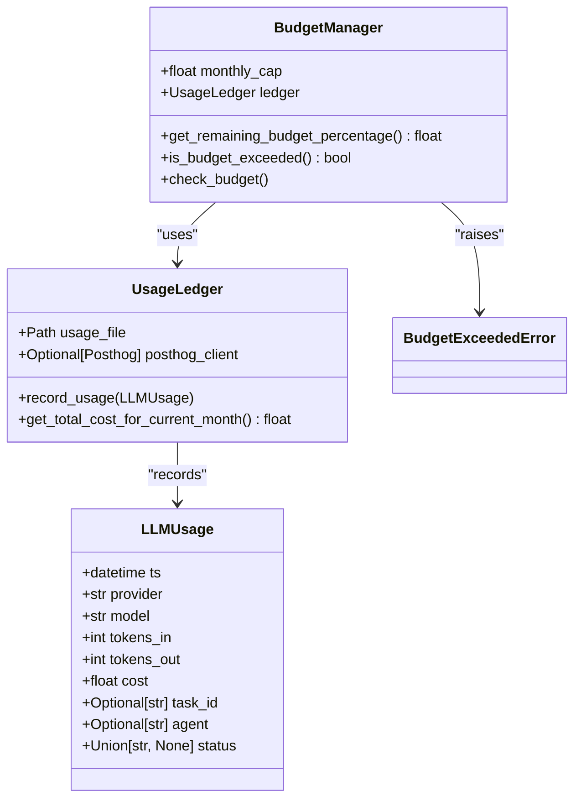
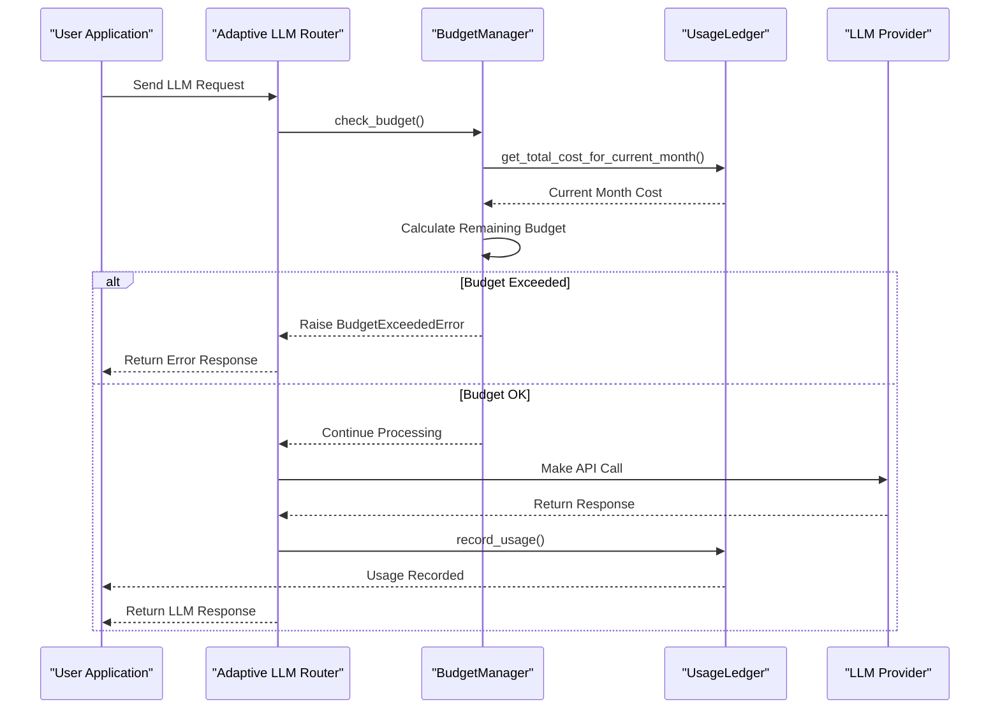
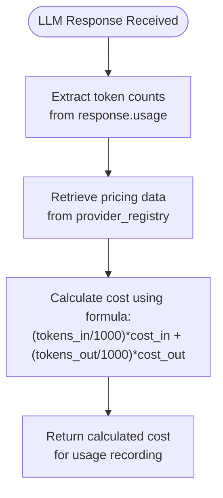
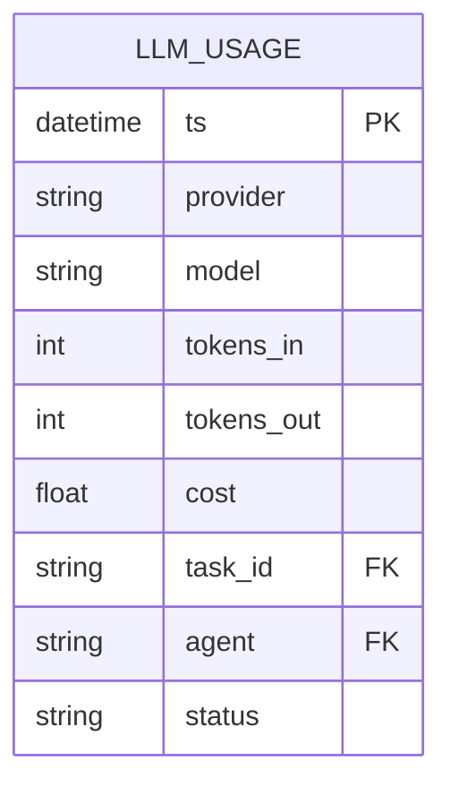
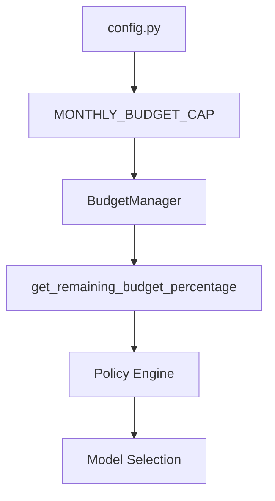
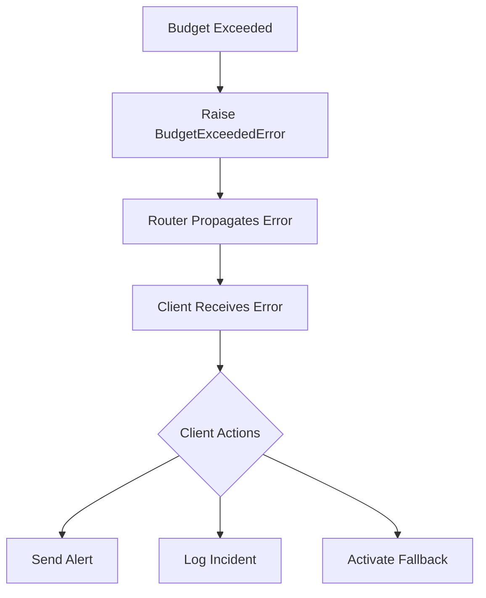

# Budget Guard and Cost Control

<cite>
**Referenced Files in This Document**   
- [budget_guard.py](file://371-os/src/minds371/adaptive_llm_router/budget_guard.py#L1-L49)
- [usage_ledger.py](file://371-os/src/minds371/adaptive_llm_router/usage_ledger.py#L1-L89)
- [llm.py](file://371-os/src/minds371/adaptive_llm_router/llm.py#L1-L92)
- [policy_engine.py](file://371-os/src/minds371/adaptive_llm_router/policy_engine.py#L1-L34)
- [providers.json](file://371-os/src/minds371/adaptive_llm_router/providers.json#L1-L48)
- [llm_usage.json](file://371-os/src/minds371/adaptive_llm_router/llm_usage.json#L1-L47)
- [config.py](file://371-os/src/minds371/adaptive_llm_router/config.py#L1-L5)
- [data_models.py](file://371-os/src/minds371/adaptive_llm_router/data_models.py#L20-L32)
- [Adaptive_Router_Logic.md](file://371-os/Adaptive_Router_Logic.md#L1-L35)
</cite>

## Table of Contents
1. [Introduction](#introduction)
2. [Core Components](#core-components)
3. [Budget Enforcement Workflow](#budget-enforcement-workflow)
4. [Real-Time Cost Calculation](#real-time-cost-calculation)
5. [Usage Tracking and Persistence](#usage-tracking-and-persistence)
6. [Budget Configuration and Thresholds](#budget-configuration-and-thresholds)
7. [Model Downgrading and Fallback Logic](#model-downgrading-and-fallback-logic)
8. [Alerting and Integration](#alerting-and-integration)
9. [Edge Case Handling](#edge-case-handling)
10. [Troubleshooting Guide](#troubleshooting-guide)

## Introduction
The Budget Guard system is a critical component of the Adaptive LLM Router that enforces cost constraints and prevents uncontrolled spending on LLM API calls. It operates as a hard-stop gate that either rejects requests or triggers model downgrading when spending thresholds are exceeded. The system integrates real-time cost calculation, historical usage tracking, and intelligent routing decisions to maintain financial control while preserving functionality. This document details the implementation, integration, and operational characteristics of the Budget Guard system.

## Core Components

The Budget Guard system consists of several interconnected components that work together to enforce cost constraints:

- **BudgetManager**: Core class that checks current spending against configured limits
- **UsageLedger**: Persists usage records and calculates monthly totals
- **BudgetExceededError**: Custom exception raised when limits are breached
- **policy_engine**: Uses budget percentage to influence model selection
- **llm.py**: Main entry point that integrates budget checks into request flow



**Diagram sources**
- [budget_guard.py](file://371-os/src/minds371/adaptive_llm_router/budget_guard.py#L7-L49)
- [usage_ledger.py](file://371-os/src/minds371/adaptive_llm_router/usage_ledger.py#L1-L89)
- [data_models.py](file://371-os/src/minds371/adaptive_llm_router/data_models.py#L20-L32)

**Section sources**
- [budget_guard.py](file://371-os/src/minds371/adaptive_llm_router/budget_guard.py#L1-L49)
- [usage_ledger.py](file://371-os/src/minds371/adaptive_llm_router/usage_ledger.py#L1-L89)

## Budget Enforcement Workflow

The Budget Guard system intercepts LLM requests through a well-defined workflow that ensures cost constraints are enforced before any API calls are made. The process begins when a request enters the Adaptive LLM Router and proceeds through several validation and decision points.



**Diagram sources**
- [llm.py](file://371-os/src/minds371/adaptive_llm_router/llm.py#L43-L49)
- [budget_guard.py](file://371-os/src/minds371/adaptive_llm_router/budget_guard.py#L35-L47)
- [usage_ledger.py](file://371-os/src/minds371/adaptive_llm_router/usage_ledger.py#L60-L79)

**Section sources**
- [llm.py](file://371-os/src/minds371/adaptive_llm_router/llm.py#L43-L49)
- [budget_guard.py](file://371-os/src/minds371/adaptive_llm_router/budget_guard.py#L35-L47)

## Real-Time Cost Calculation

The system calculates costs in real-time using pricing data from providers.json and actual token counts from LLM responses. The cost calculation occurs after the LLM call to ensure accuracy based on actual usage rather than estimates.

### Cost Calculation Formula
The cost is calculated using the following formula:
```
cost = (tokens_in / 1000) * cost_in + (tokens_out / 1000) * cost_out
```

Where:
- **tokens_in**: Actual number of input tokens from the LLM response
- **tokens_out**: Actual number of output tokens from the LLM response
- **cost_in**: Cost per 1000 input tokens (from providers.json)
- **cost_out**: Cost per 1000 output tokens (from providers.json)



**Diagram sources**
- [llm.py](file://371-os/src/minds371/adaptive_llm_router/llm.py#L78-L85)
- [providers.json](file://371-os/src/minds371/adaptive_llm_router/providers.json#L1-L48)

**Section sources**
- [llm.py](file://371-os/src/minds371/adaptive_llm_router/llm.py#L78-L85)
- [providers.json](file://371-os/src/minds371/adaptive_llm_router/providers.json#L1-L48)

## Usage Tracking and Persistence

The UsageLedger component is responsible for persisting historical usage data and providing current spending information to the BudgetManager. It maintains a JSON file (llm_usage.json) that records every LLM request with detailed cost and performance metrics.

### Usage Data Structure
Each usage record contains the following fields:
- **ts**: Timestamp of the request
- **provider**: LLM provider name
- **model**: Model name used
- **tokens_in**: Number of input tokens
- **tokens_out**: Number of output tokens
- **cost**: Calculated cost in USD
- **task_id**: Associated task identifier (if available)
- **agent**: Originating agent name
- **status**: Request status ("ok", "fallback", "error")



The UsageLedger also integrates with PostHog for analytics, sending a "llm_usage" event for each request to enable monitoring and reporting.

**Diagram sources**
- [usage_ledger.py](file://371-os/src/minds371/adaptive_llm_router/usage_ledger.py#L30-L38)
- [llm_usage.json](file://371-os/src/minds371/adaptive_llm_router/llm_usage.json#L1-L47)
- [data_models.py](file://371-os/src/minds371/adaptive_llm_router/data_models.py#L20-L32)

**Section sources**
- [usage_ledger.py](file://371-os/src/minds371/adaptive_llm_router/usage_ledger.py#L30-L38)
- [llm_usage.json](file://371-os/src/minds371/adaptive_llm_router/llm_usage.json#L1-L47)

## Budget Configuration and Thresholds

The system supports configurable budget limits through the config.py file. The primary configuration parameter is MONTHLY_BUDGET_CAP, which defines the maximum allowable spending per calendar month.

### Configuration Example
```python
# config.py
MONTHLY_BUDGET_CAP = 20.00  # $20.00 monthly budget
```

The BudgetManager uses this cap to calculate the remaining budget percentage, which is then used by the policy engine to make routing decisions. The system currently implements a single monthly budget at the system level, though the architecture supports potential extensions for project-level or user-level budgets.



**Diagram sources**
- [config.py](file://371-os/src/minds371/adaptive_llm_router/config.py#L5-L5)
- [budget_guard.py](file://371-os/src/minds371/adaptive_llm_router/budget_guard.py#L1-L49)

**Section sources**
- [config.py](file://371-os/src/minds371/adaptive_llm_router/config.py#L5-L5)
- [budget_guard.py](file://371-os/src/minds371/adaptive_llm_router/budget_guard.py#L1-L49)

## Model Downgrading and Fallback Logic

When budget thresholds are approached, the system implements a graceful degradation strategy through the policy_engine rather than immediately rejecting all requests. This approach balances cost control with service availability.

### Downgrading Rules
The policy_engine uses the remaining budget percentage to influence model selection:

1. **High Budget (>20% remaining)**: Allows high-quality models for critical tasks
2. **Low Budget (<5% remaining)**: Forces use of cheapest available model
3. **Budget Exceeded (0% remaining)**: Rejects requests with BudgetExceededError

```python
def select_provider(meta: Dict[str, Any], est_in: int, est_out: int) -> str:
    budget_percentage = budget_manager.get_remaining_budget_percentage()

    # Privacy Flag: forces LocalAI
    if meta.get("confidential"):
        return "localai:phi-4-14b"

    # Task Criticality: high-quality model for critical tasks if budget allows
    if meta.get("quality") == "high" and budget_percentage > 0.20:
        return "openrouter:gpt-4o-mini"

    # Context Length: long-context model for large inputs
    if est_in > 8000:
        return "requesty:claude-3-sonnet"

    # Low Budget Mode: cheapest model when budget is low
    if budget_percentage < 0.05:
        return "openrouter:mistral-7b"

    # Balanced Default
    return "openrouter:qwen2-72b"
```

This tiered approach ensures that essential functionality remains available even as budgets are depleted, while still preventing overspending.

**Section sources**
- [policy_engine.py](file://371-os/src/minds371/adaptive_llm_router/policy_engine.py#L1-L34)
- [budget_guard.py](file://371-os/src/minds371/adaptive_llm_router/budget_guard.py#L19-L28)

## Alerting and Integration

The Budget Guard system integrates with monitoring systems through multiple channels to provide visibility into cost usage and budget status.

### PostHog Integration
The UsageLedger automatically sends "llm_usage" events to PostHog, including detailed properties:
- **provider**: LLM provider name
- **model**: Model name
- **cost**: Request cost
- **agent**: Originating agent
- **tokens_in**: Input token count
- **tokens_out**: Output token count
- **status**: Request status
- **task_id**: Associated task ID

These events enable real-time monitoring, alerting, and analytics on LLM usage patterns and cost trends.

### Error Propagation
When the budget is exceeded, the system raises a BudgetExceededError that propagates through the call stack to the client application. This allows external systems to implement custom alerting, logging, or fallback behaviors.



**Section sources**
- [usage_ledger.py](file://371-os/src/minds371/adaptive_llm_router/usage_ledger.py#L49-L58)
- [budget_guard.py](file://371-os/src/minds371/adaptive_llm_router/budget_guard.py#L45-L47)
- [llm.py](file://371-os/src/minds371/adaptive_llm_router/llm.py#L47-L49)

## Edge Case Handling

The current implementation addresses several edge cases, though some limitations exist that should be considered in production deployments.

### Concurrent Requests
The system does not implement explicit locking for concurrent requests, which could lead to race conditions where multiple simultaneous requests are approved just before the budget is exhausted. This could result in slight budget overages in high-concurrency scenarios.

### Burst Usage
The monthly budget calculation is based on calendar months, which may not align with billing cycles. Sudden bursts of usage at the end of a month could exhaust the budget quickly, affecting service availability for the remainder of the month.

### Multi-Tenant Isolation
The current implementation provides system-level budgeting only, without support for per-project, per-user, or per-agent budget isolation. All usage is aggregated into a single monthly total.

### Data Persistence Risks
The usage ledger relies on a JSON file for persistence, which could be corrupted by improper shutdowns or concurrent writes. While the code includes basic error handling for JSON decode errors, a more robust database solution would provide better reliability.

**Section sources**
- [usage_ledger.py](file://371-os/src/minds371/adaptive_llm_router/usage_ledger.py#L30-L38)
- [budget_guard.py](file://371-os/src/minds371/adaptive_llm_router/budget_guard.py#L25-L28)

## Troubleshooting Guide

This section addresses common issues and their solutions related to the Budget Guard system.

### Issue 1: Unexpected BudgetExceededError
**Symptom**: Requests are being rejected with "Monthly budget has been exceeded" even when expected usage is low.

**Diagnosis Steps**:
1. Check the current llm_usage.json file to verify actual usage
2. Calculate the sum of all "cost" fields for the current month
3. Compare against the MONTHLY_BUDGET_CAP in config.py

**Solution**: The budget is likely genuinely exceeded. Options include:
- Wait until the next calendar month for reset
- Increase MONTHLY_BUDGET_CAP in config.py
- Implement a custom reset mechanism

### Issue 2: Inaccurate Cost Calculations
**Symptom**: Recorded costs do not match expected pricing from provider documentation.

**Diagnosis Steps**:
1. Verify the cost_in and cost_out values in providers.json
2. Check that the actual token counts in responses match the recorded values
3. Confirm the cost calculation formula is being applied correctly

**Solution**: Update providers.json with correct pricing data from the provider's official documentation.

### Issue 3: Usage Data Not Persisting
**Symptom**: llm_usage.json is not being updated with new records.

**Diagnosis Steps**:
1. Verify the file path and write permissions
2. Check for JSON syntax errors in the existing file
3. Review error logs for exceptions in _write_to_ledger

**Solution**: Ensure the application has write permissions to the directory and that the JSON file is not corrupted.

### Issue 4: Budget Percentage Not Updating
**Symptom**: get_remaining_budget_percentage returns stale values.

**Diagnosis Steps**:
1. Verify that record_usage is being called after each LLM request
2. Check that the timestamp in new records is correct
3. Confirm that get_total_cost_for_current_month is filtering by current month/year

**Solution**: The issue is likely in the date filtering logic. Ensure datetime parsing is handling the ISO format correctly.

**Section sources**
- [budget_guard.py](file://371-os/src/minds371/adaptive_llm_router/budget_guard.py#L25-L28)
- [usage_ledger.py](file://371-os/src/minds371/adaptive_llm_router/usage_ledger.py#L60-L79)
- [llm.py](file://371-os/src/minds371/adaptive_llm_router/llm.py#L88-L90)