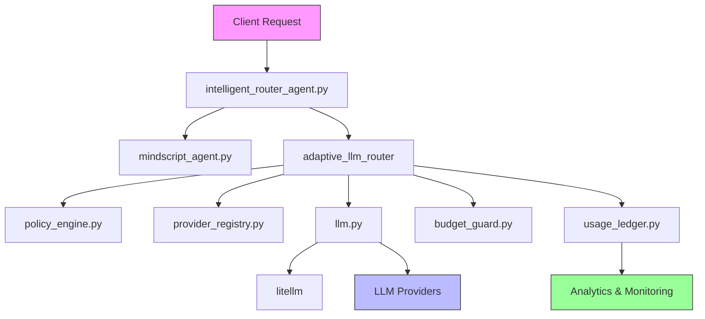
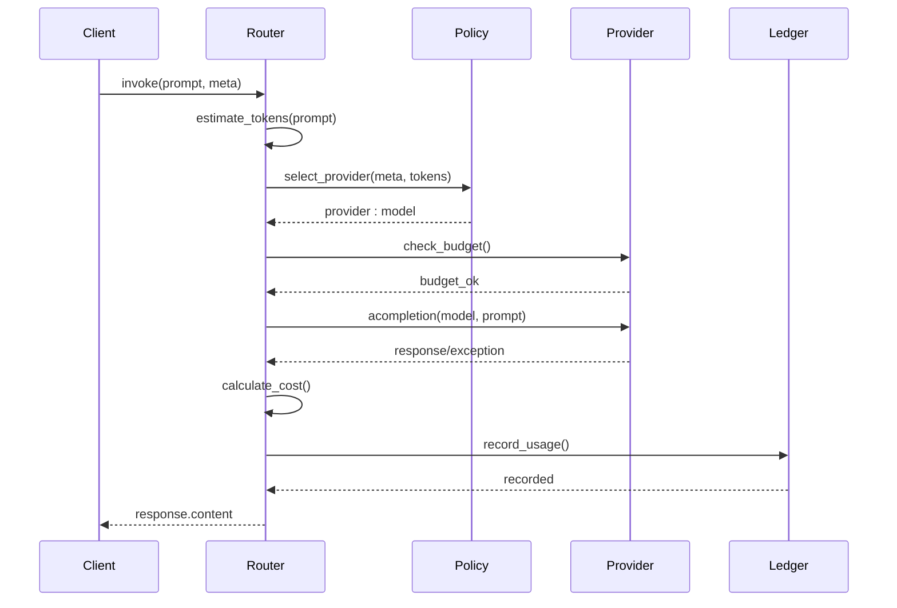
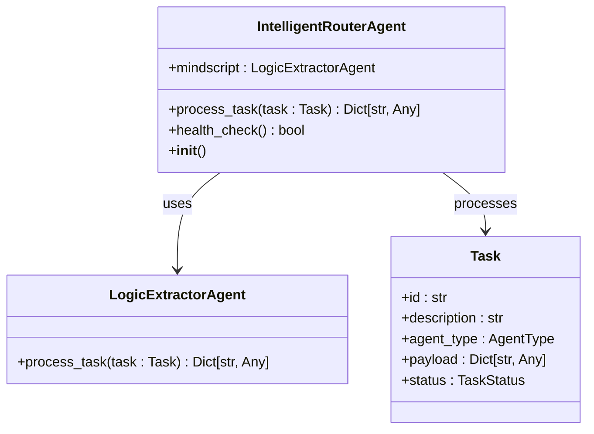
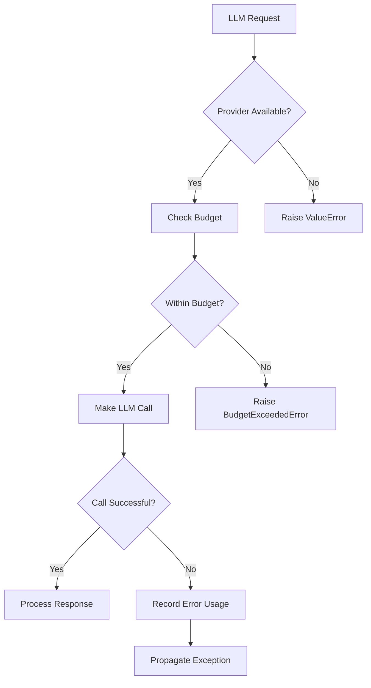

# LLM Integration and Request Handling

<cite>
**Referenced Files in This Document**   
- [llm.py](file://371-os/src/minds371/adaptive_llm_router/llm.py#L1-L92)
- [intelligent_router_agent.py](file://371-os/src/minds371/adaptive_llm_router/intelligent_router_agent.py#L1-L105)
- [adaptive_llm_router_example.py](file://371-os/src/minds371/adaptive_llm_router/adaptive_llm_router_example.py#L1-L65)
- [data_models.py](file://371-os/src/minds371/adaptive_llm_router/data_models.py#L1-L40)
- [config.py](file://371-os/src/minds371/adaptive_llm_router/config.py#L1-L7)
- [budget_guard.py](file://371-os/src/minds371/adaptive_llm_router/budget_guard.py)
- [policy_engine.py](file://371-os/src/minds371/adaptive_llm_router/policy_engine.py)
- [provider_registry.py](file://371-os/src/minds371/adaptive_llm_router/provider_registry.py)
- [usage_ledger.py](file://371-os/src/minds371/adaptive_llm_router/usage_ledger.py)
</cite>

## Table of Contents
1. [Introduction](#introduction)
2. [Core Components Overview](#core-components-overview)
3. [Request Routing and Response Processing](#request-routing-and-response-processing)
4. [Data Models and Validation](#data-models-and-validation)
5. [Workflow Orchestration with Intelligent Router](#workflow-orchestration-with-intelligent-router)
6. [Practical Usage Examples](#practical-usage-examples)
7. [Error Handling and Fallback Strategies](#error-handling-and-fallback-strategies)
8. [Budget Management and Cost Control](#budget-management-and-cost-control)
9. [Performance and Context Management](#performance-and-context-management)
10. [Best Practices](#best-practices)

## Introduction
The Adaptive LLM Router system provides a sophisticated interface for managing LLM requests across multiple providers. This document details the architecture, implementation, and usage patterns for the core LLM integration layer that handles request routing, response processing, and cost management. The system enables intelligent delegation of tasks based on content analysis, provider capabilities, and budget constraints.

## Core Components Overview

The LLM integration system consists of several interconnected components that work together to provide a robust, scalable interface for LLM interactions. The architecture is designed to be modular, allowing for easy extension and maintenance.



**Diagram sources**
- [llm.py](file://371-os/src/minds371/adaptive_llm_router/llm.py#L1-L92)
- [intelligent_router_agent.py](file://371-os/src/minds371/adaptive_llm_router/intelligent_router_agent.py#L1-L105)

## Request Routing and Response Processing

The core request handling is implemented in `llm.py`, which serves as the primary interface for all LLM requests. The system uses LiteLLM to provide a unified interface across different LLM providers.

### Request Flow
The request processing follows a structured sequence:

1. Token estimation for input text
2. Provider selection based on policies and requirements
3. Budget validation
4. LLM invocation
5. Usage tracking and cost calculation
6. Response formatting



**Diagram sources**
- [llm.py](file://371-os/src/minds371/adaptive_llm_router/llm.py#L1-L92)

**Section sources**
- [llm.py](file://371-os/src/minds371/adaptive_llm_router/llm.py#L1-L92)

## Data Models and Validation

The system uses Pydantic models to ensure data integrity and provide clear structure for all components. These models serve as the contract between different parts of the system.

### LLM Provider Model
Defines the capabilities and cost structure of each LLM provider:

```python
class LLMProvider(BaseModel):
    name: str  # e.g., "openrouter"
    model: str  # e.g., "gpt-4o"
    cost_in: float = Field(..., description="Cost per 1k input tokens in USD")
    cost_out: float = Field(..., description="Cost per 1k output tokens in USD")
    max_context: int = Field(..., description="Maximum context window size in tokens")
    latency_ms: int = Field(..., description="Expected latency in milliseconds")
    endpoint_env: str = Field(..., description="Environment variable for the API key")
```

### Usage Tracking Model
Captures detailed information about each LLM invocation:

```python
class LLMUsage(BaseModel):
    ts: datetime = Field(default_factory=datetime.now)
    provider: str
    model: str
    tokens_in: int
    tokens_out: int
    cost: float
    task_id: Optional[str] = None
    agent: Optional[str] = None
    status: Union[str, None] = "ok" # "ok", "fallback", "error"
```

**Section sources**
- [data_models.py](file://371-os/src/minds371/adaptive_llm_router/data_models.py#L1-L40)

## Workflow Orchestration with Intelligent Router

The `IntelligentRouterAgent` class provides advanced workflow orchestration capabilities, enabling the system to handle complex tasks that may require multiple LLM calls or delegation to specialized agents.

### Architecture
The intelligent router uses a two-step process:
1. **Logic Extraction**: Uses MindScript to analyze the user command and extract structured information
2. **Task Routing**: Determines the appropriate agent type based on the extracted category



**Diagram sources**
- [intelligent_router_agent.py](file://371-os/src/minds371/adaptive_llm_router/intelligent_router_agent.py#L1-L105)

**Section sources**
- [intelligent_router_agent.py](file://371-os/src/minds371/adaptive_llm_router/intelligent_router_agent.py#L1-L105)

## Practical Usage Examples

The `adaptive_llm_router_example.py` file provides concrete examples of how to use the intelligent routing system.

### Example Implementation
```python
async def main():
    print("--- Running Intelligent Router Agent Example ---")
    agent = IntelligentRouterAgent()

    test_tasks = [
        {
            "command": "Can you please find the catalog_services?",
            "description": "A request for the CTO."
        },
        {
            "command": "I need to sync our marketing_campaigns.",
            "description": "A request for the CMO."
        }
    ]

    for i, task_info in enumerate(test_tasks):
        task = Task(
            id=str(uuid4()),
            description=task_info["description"],
            agent_type=AgentType.INTELLIGENT_ROUTER,
            payload={'command': task_info['command']},
            status=TaskStatus.PENDING
        )

        result = await agent.process_task(task)
        print("Router Output:")
        print(json.dumps(result, indent=2))
```

### Key Parameters
- **command**: The natural language instruction from the user
- **agent_type**: Specifies the target agent type for delegation
- **payload**: Additional context and data for the task
- **task_id**: Unique identifier for tracking and auditing

**Section sources**
- [adaptive_llm_router_example.py](file://371-os/src/minds371/adaptive_llm_router/adaptive_llm_router_example.py#L1-L65)

## Error Handling and Fallback Strategies

The system implements comprehensive error handling to ensure reliability and graceful degradation when issues occur.

### Error Types and Responses
- **Provider Not Found**: Raises `ValueError` when requested provider is unavailable
- **Budget Exceeded**: Raises `BudgetExceededError` when monthly cap is reached
- **LLM Invocation Failure**: Catches exceptions from LiteLLM and propagates them
- **Missing Command**: Returns failure status when no command is provided

### Fallback Mechanisms
The current implementation includes several fallback strategies:
- Token estimation fallback when actual token count is unavailable
- Status tracking for failed requests
- Structured error responses for client handling



**Section sources**
- [llm.py](file://371-os/src/minds371/adaptive_llm_router/llm.py#L1-L92)

## Budget Management and Cost Control

The budget management system ensures cost-effective usage of LLM resources while preventing unexpected expenses.

### Configuration
The monthly budget cap is defined in `config.py`:
```python
MONTHLY_BUDGET_CAP = 20.00  # USD
```

### Budget Guard Implementation
The `budget_guard.py` module monitors usage against the configured cap:
- Tracks cumulative costs across all LLM requests
- Prevents new requests when the budget is exceeded
- Integrates with the usage ledger for accurate accounting

### Cost Calculation
Costs are calculated based on actual token usage:
```
cost = (tokens_in / 1000) * provider.cost_in + (tokens_out / 1000) * provider.cost_out
```

This formula uses provider-specific pricing for both input and output tokens.

**Section sources**
- [config.py](file://371-os/src/minds371/adaptive_llm_router/config.py#L1-L7)
- [budget_guard.py](file://371-os/src/minds371/adaptive_llm_router/budget_guard.py)

## Performance and Context Management

The system includes several features to optimize performance and manage context effectively.

### Token Estimation
Uses TikToken for accurate token counting:
```python
tokenizer = tiktoken.get_encoding("cl100k_base")

def estimate_tokens(text: str) -> int:
    return len(tokenizer.encode(text))
```

### Context Window Management
Provider capabilities are tracked in the `LLMProvider` model:
- `max_context`: Maximum context window size in tokens
- Used by the policy engine to select appropriate providers
- Prevents requests that would exceed provider limits

### Latency Considerations
- `latency_ms` field in provider model for performance-aware routing
- Asynchronous implementation using asyncio
- Non-blocking I/O operations

**Section sources**
- [llm.py](file://371-os/src/minds371/adaptive_llm_router/llm.py#L1-L92)
- [data_models.py](file://371-os/src/minds371/adaptive_llm_router/data_models.py#L1-L40)

## Best Practices

### Error Recovery
- Implement retry logic with exponential backoff for transient failures
- Use circuit breakers to prevent cascading failures
- Maintain fallback providers for critical operations

### Fallback Strategies
When primary providers are unavailable:
1. Route to secondary providers with similar capabilities
2. Use local models for confidential or low-latency requirements
3. Implement graceful degradation of functionality
4. Provide clear error messages to users

### Monitoring and Analytics
- Track usage patterns to optimize provider selection
- Monitor cost trends to adjust budget caps
- Analyze error rates to identify systemic issues
- Use the usage ledger for auditing and reporting

### Configuration Management
- Centralize configuration in environment variables
- Use feature flags for gradual rollout of new providers
- Implement configuration validation
- Provide sensible defaults for all settings