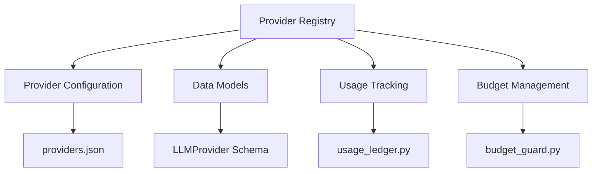
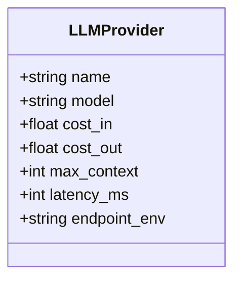
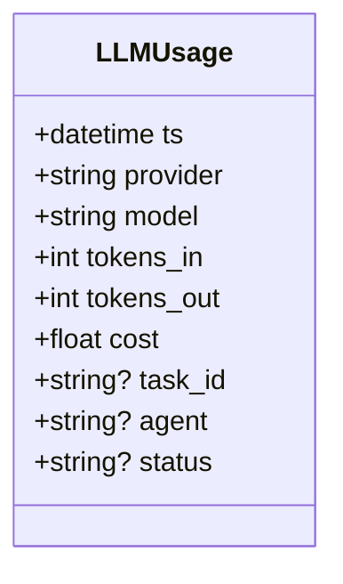
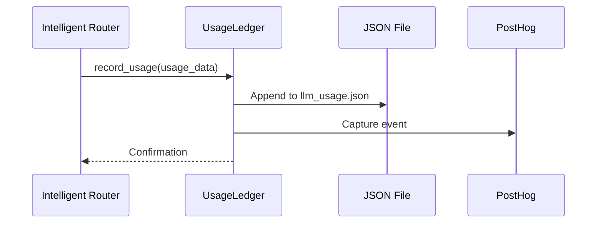

# Provider Registry and Configuration

<cite>
**Referenced Files in This Document**   
- [provider_registry.py](file://371-os/src/minds371/adaptive_llm_router/provider_registry.py)
- [data_models.py](file://371-os/src/minds371/adaptive_llm_router/data_models.py)
- [config.py](file://371-os/src/minds371/adaptive_llm_router/config.py)
- [providers.json](file://371-os/src/minds371/adaptive_llm_router/providers.json)
- [usage_ledger.py](file://371-os/src/minds371/adaptive_llm_router/usage_ledger.py)
- [budget_guard.py](file://371-os/src/minds371/adaptive_llm_router/budget_guard.py)
</cite>

## Table of Contents
1. [Introduction](#introduction)
2. [Core Components Overview](#core-components-overview)
3. [Provider Registry Implementation](#provider-registry-implementation)
4. [Data Models and Schemas](#data-models-and-schemas)
5. [Configuration Management](#configuration-management)
6. [Provider Validation and Caching](#provider-validation-and-caching)
7. [Usage Tracking and Budget Enforcement](#usage-tracking-and-budget-enforcement)
8. [Extensibility and Versioning](#extensibility-and-versioning)
9. [Conclusion](#conclusion)

## Introduction
The Provider Registry component of the Adaptive LLM Router is responsible for managing the dynamic registration, discovery, and health status of Large Language Model (LLM) providers. This system enables intelligent routing decisions based on provider capabilities, cost profiles, latency characteristics, and budget constraints. The registry loads provider configurations from a JSON file, validates their schemas, and makes them available for runtime selection by the routing engine.

**Section sources**
- [provider_registry.py](file://371-os/src/minds371/adaptive_llm_router/provider_registry.py#L1-L45)
- [data_models.py](file://371-os/src/minds371/adaptive_llm_router/data_models.py#L1-L40)

## Core Components Overview
The Provider Registry system consists of several interconnected components that work together to manage LLM provider information and enforce usage policies:

- **ProviderRegistry**: Central class that loads and provides access to LLM provider configurations
- **LLMProvider**: Data model defining the schema for provider capabilities and cost metrics
- **UsageLedger**: Component that tracks all LLM usage events for cost monitoring
- **BudgetManager**: Enforces monthly spending caps and triggers budget alerts
- **Configuration System**: Handles provider definitions and global settings

These components form a cohesive system that enables cost-aware, performance-optimized routing decisions across multiple LLM providers.



**Diagram sources**
- [provider_registry.py](file://371-os/src/minds371/adaptive_llm_router/provider_registry.py#L1-L45)
- [data_models.py](file://371-os/src/minds371/adaptive_llm_router/data_models.py#L1-L40)
- [usage_ledger.py](file://371-os/src/minds371/adaptive_llm_router/usage_ledger.py#L1-L89)
- [budget_guard.py](file://371-os/src/minds371/adaptive_llm_router/budget_guard.py#L1-L50)

## Provider Registry Implementation

### Dynamic Registration and Discovery
The `ProviderRegistry` class manages the lifecycle of LLM provider configurations. It loads provider data from a JSON file during initialization and provides methods for retrieving specific providers or listing all available options.

```python
class ProviderRegistry:
    def __init__(self, providers_file: Path):
        self.providers_file = providers_file
        self.providers: List[LLMProvider] = self._load_providers()

    def _load_providers(self) -> List[LLMProvider]:
        if not self.providers_file.exists():
            return []
        with open(self.providers_file, 'r') as f:
            data = json.load(f)
        return [LLMProvider(**p) for p in data]
```

The registry supports two primary discovery methods:
- `get_provider(name: str, model: str)`: Retrieves a specific provider by name and model
- `list_providers()`: Returns all available providers

A default instance is initialized with the path to the providers.json file, making it immediately available for use throughout the application.

**Section sources**
- [provider_registry.py](file://371-os/src/minds371/adaptive_llm_router/provider_registry.py#L1-L45)

## Data Models and Schemas

### LLM Provider Schema
The `LLMProvider` model defines the structure for each provider configuration with the following fields:



**Diagram sources**
- [data_models.py](file://371-os/src/minds371/adaptive_llm_router/data_models.py#L10-L22)

The schema includes:
- **name**: Provider identifier (e.g., "openrouter", "requesty")
- **model**: Specific model name (e.g., "gpt-4o-mini", "claude-3-sonnet")
- **cost_in**: Cost per 1,000 input tokens in USD
- **cost_out**: Cost per 1,000 output tokens in USD
- **max_context**: Maximum context window size in tokens
- **latency_ms**: Expected latency in milliseconds
- **endpoint_env**: Environment variable containing the API key

### Usage Tracking Model
The `LLMUsage` model captures detailed information about each LLM invocation:



**Diagram sources**
- [data_models.py](file://371-os/src/minds371/adaptive_llm_router/data_models.py#L24-L34)

This model enables comprehensive usage analysis and cost attribution across different agents and tasks.

**Section sources**
- [data_models.py](file://371-os/src/minds371/adaptive_llm_router/data_models.py#L1-L40)

## Configuration Management

### Provider Configuration
The `providers.json` file contains the complete list of available LLM providers with their respective configurations:

```json
[
  {
    "name": "openrouter",
    "model": "gpt-4o-mini",
    "cost_in": 0.0006,
    "cost_out": 0.0006,
    "max_context": 128000,
    "latency_ms": 500,
    "endpoint_env": "OPENROUTER_API_KEY"
  },
  {
    "name": "requesty",
    "model": "claude-3-sonnet",
    "cost_in": 0.003,
    "cost_out": 0.015,
    "max_context": 200000,
    "latency_ms": 800,
    "endpoint_env": "REQUESTY_API_KEY"
  }
]
```

Each provider entry specifies its cost structure, performance characteristics, and authentication requirements through environment variables.

### Global Configuration
The `config.py` file defines system-wide settings:

```python
# The monthly budget cap for LLM usage in USD.
MONTHLY_BUDGET_CAP = 20.00
```

This configuration is used by the budget management system to enforce spending limits.

**Section sources**
- [providers.json](file://371-os/src/minds371/adaptive_llm_router/providers.json#L1-L48)
- [config.py](file://371-os/src/minds371/adaptive_llm_router/config.py#L1-L7)

## Provider Validation and Caching

### Schema Validation
When loading providers from the JSON file, the system uses Pydantic's validation capabilities to ensure all required fields are present and correctly typed. The `LLMProvider(**p)` instantiation automatically validates that:
- All required fields are present
- Numeric values are within acceptable ranges
- String fields are properly formatted

Invalid provider configurations will raise validation errors during startup, preventing malformed data from entering the system.

### In-Memory Caching
The Provider Registry implements a simple caching strategy by loading all providers into memory during initialization. This approach provides:
- Fast lookup performance for routing decisions
- Reduced I/O operations during normal operation
- Atomic updates when reloading configurations

The cache is automatically populated at startup and can be refreshed by reinitializing the registry instance.

**Section sources**
- [provider_registry.py](file://371-os/src/minds371/adaptive_llm_router/provider_registry.py#L1-L45)
- [data_models.py](file://371-os/src/minds371/adaptive_llm_router/data_models.py#L1-L40)

## Usage Tracking and Budget Enforcement

### Usage Ledger Implementation
The `UsageLedger` class persists all LLM usage events to a JSON file and forwards them to PostHog for analytics:



**Diagram sources**
- [usage_ledger.py](file://371-os/src/minds371/adaptive_llm_router/usage_ledger.py#L1-L89)

### Budget Management
The `BudgetManager` enforces monthly spending caps through the following mechanisms:

```python
class BudgetManager:
    def get_remaining_budget_percentage(self) -> float:
        current_spend = self.ledger.get_total_cost_for_current_month()
        remaining = self.monthly_cap - current_spend
        return (remaining / self.monthly_cap)

    def is_budget_exceeded(self) -> bool:
        return self.get_remaining_budget_percentage() <= 0

    def check_budget(self):
        if self.is_budget_exceeded():
            raise BudgetExceededError(f"Monthly budget of ${self.monthly_cap} has been exceeded.")
```

The system calculates monthly spend by aggregating usage records from the current calendar month and comparing against the configured cap.

**Section sources**
- [usage_ledger.py](file://371-os/src/minds371/adaptive_llm_router/usage_ledger.py#L1-L89)
- [budget_guard.py](file://371-os/src/minds371/adaptive_llm_router/budget_guard.py#L1-L50)

## Extensibility and Versioning

### Adding New Providers
To add a new provider, simply extend the `providers.json` file with a new entry:

```json
{
  "name": "anthropic",
  "model": "claude-3-opus",
  "cost_in": 0.015,
  "cost_out": 0.075,
  "max_context": 200000,
  "latency_ms": 900,
  "endpoint_env": "ANTHROPIC_API_KEY"
}
```

The system will automatically validate and incorporate the new provider upon restart.

### Supporting New Provider Types
The extensible data model allows for easy addition of new provider types by:
1. Extending the `LLMProvider` schema with new fields if needed
2. Adding provider-specific configuration options
3. Implementing custom routing logic in the intelligent router

### Configuration Versioning
While the current implementation uses a simple JSON file, the architecture supports versioning through:
- Schema evolution with backward compatibility
- Migration scripts for configuration updates
- Multiple configuration profiles for different environments

Future enhancements could include:
- Configuration version tracking
- Rollback capabilities
- Environment-specific overrides

**Section sources**
- [providers.json](file://371-os/src/minds371/adaptive_llm_router/providers.json#L1-L48)
- [data_models.py](file://371-os/src/minds371/adaptive_llm_router/data_models.py#L1-L40)

## Conclusion
The Provider Registry component provides a robust foundation for managing multiple LLM providers within the Adaptive LLM Router system. By centralizing provider configurations, enforcing budget constraints, and tracking usage patterns, it enables intelligent, cost-aware routing decisions. The modular design with clear separation of concerns makes it easy to extend with new providers and adapt to changing requirements. The integration of validation, caching, and monitoring ensures reliability and performance in production environments.