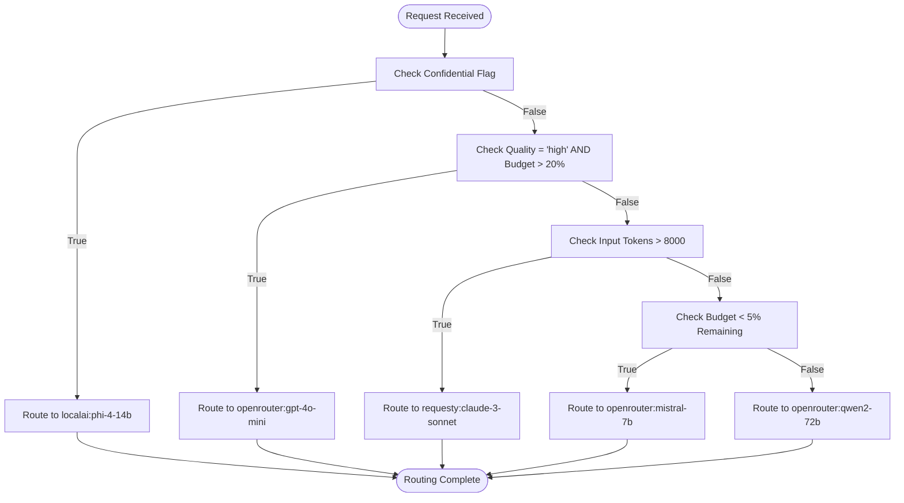
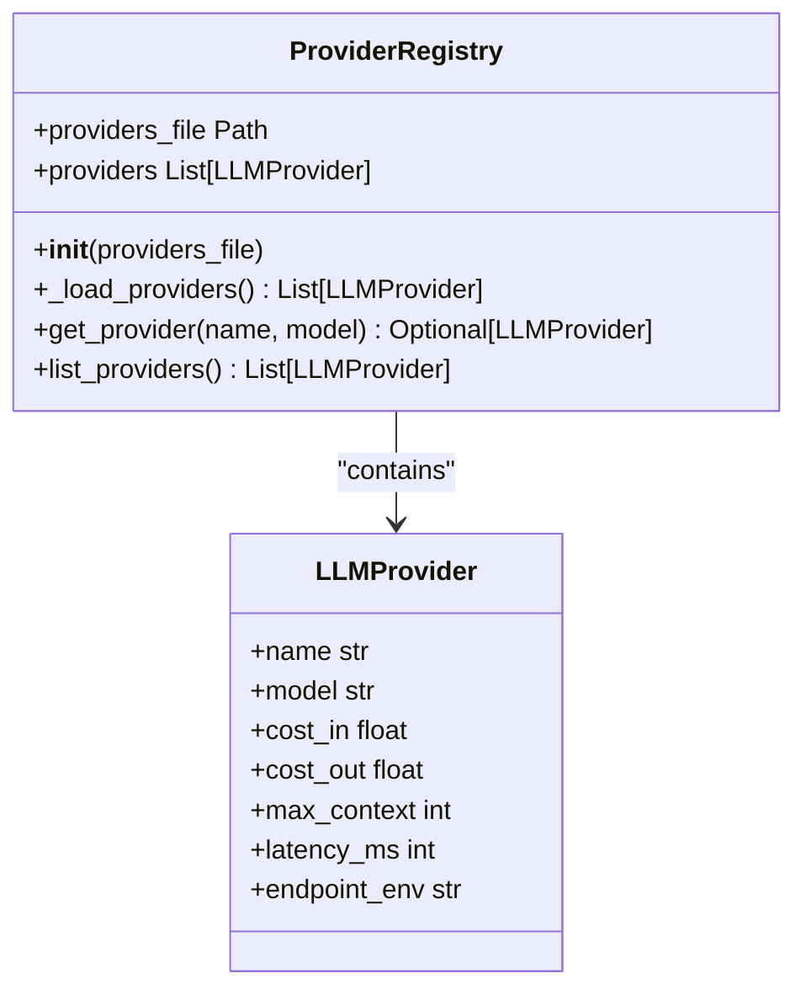
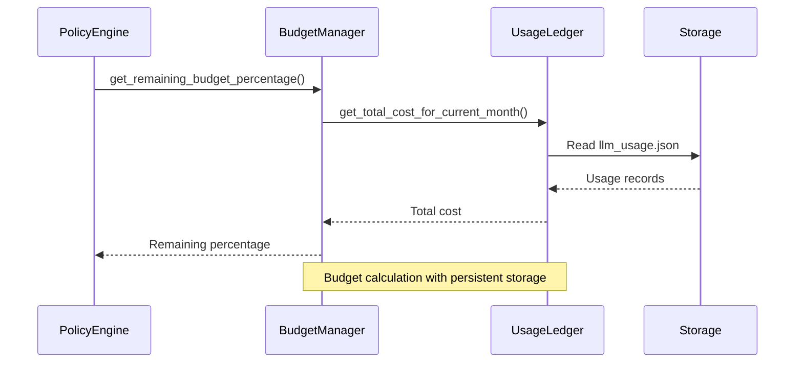
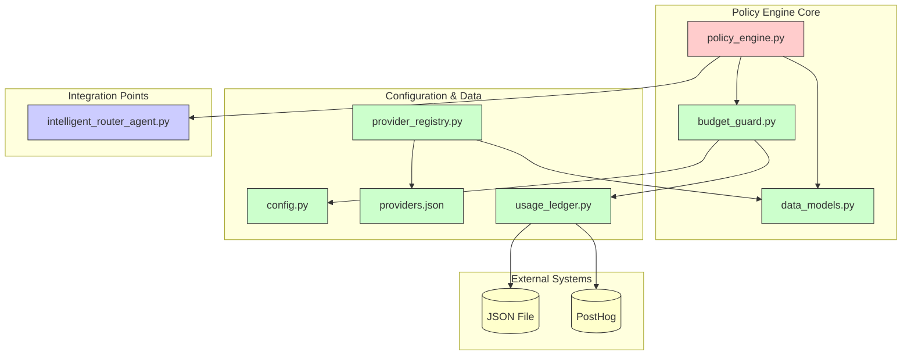

# Routing Policy Engine

<cite>
**Referenced Files in This Document**   
- [policy_engine.py](file://371-os/src/minds371/adaptive_llm_router/policy_engine.py#L1-L33)
- [config.py](file://371-os/src/minds371/adaptive_llm_router/config.py#L1-L7)
- [data_models.py](file://371-os/src/minds371/adaptive_llm_router/data_models.py#L1-L40)
- [budget_guard.py](file://371-os/src/minds371/adaptive_llm_router/budget_guard.py#L1-L50)
- [usage_ledger.py](file://371-os/src/minds371/adaptive_llm_router/usage_ledger.py#L1-L89)
- [providers.json](file://371-os/src/minds371/adaptive_llm_router/providers.json#L1-L48)
- [provider_registry.py](file://371-os/src/minds371/adaptive_llm_router/provider_registry.py#L1-L45)
- [Adaptive_Router_Logic.md](file://371-os/Adaptive_Router_Logic.md#L1-L35)
</cite>

## Table of Contents
1. [Introduction](#introduction)
2. [Policy Evaluation Pipeline](#policy-evaluation-pipeline)
3. [Scoring Algorithm and Decision Graph](#scoring-algorithm-and-decision-graph)
4. [Provider Capabilities and Configuration](#provider-capabilities-and-configuration)
5. [Budget Management System](#budget-management-system)
6. [Request Profiling and Metadata](#request-profiling-and-metadata)
7. [Policy Configuration Examples](#policy-configuration-examples)
8. [Integration with Intelligent Router Agent](#integration-with-intelligent-router-agent)
9. [Debugging and Logging Strategy](#debugging-and-logging-strategy)
10. [Architecture Overview](#architecture-overview)

## Introduction
The Routing Policy Engine is a core component of the Adaptive LLM Router system that makes intelligent decisions about which LLM provider and model should handle a given request. It implements a decision graph-based approach that evaluates multiple factors including cost, latency, model capabilities, budget constraints, and request metadata to determine the optimal provider. The engine operates as a stateless function that takes request metadata and token estimates as input and returns a provider:model string identifier for routing. This document provides a comprehensive analysis of the policy engine's implementation, architecture, and integration points.

## Policy Evaluation Pipeline
The policy engine follows a sequential decision pipeline that evaluates routing criteria in a specific order of precedence. Each decision node acts as a filter that can immediately terminate the evaluation process when a matching condition is found. This short-circuit evaluation ensures efficient decision-making without unnecessary computation.

The pipeline consists of five primary stages:
1. **Privacy Flag Check**: Requests marked as confidential are immediately routed to local providers
2. **Task Criticality Assessment**: High-quality tasks are prioritized when sufficient budget remains
3. **Context Length Evaluation**: Large input requests are routed to models with extended context windows
4. **Budget Availability Check**: Low-budget scenarios trigger fallback to the cheapest available model
5. **Default Selection**: A balanced, mid-tier model is selected for all remaining cases

This pipeline structure ensures that critical business requirements (privacy, quality, budget) take precedence over performance or cost considerations.

**Section sources**
- [policy_engine.py](file://371-os/src/minds371/adaptive_llm_router/policy_engine.py#L1-L33)

## Scoring Algorithm and Decision Graph
The policy engine implements a simplified decision graph algorithm rather than a weighted scoring system. Instead of calculating composite scores across multiple factors, it applies a series of conditional rules in priority order. This approach provides deterministic, explainable routing decisions that are easier to debug and audit.



**Diagram sources**
- [policy_engine.py](file://371-os/src/minds371/adaptive_llm_router/policy_engine.py#L1-L33)

**Section sources**
- [policy_engine.py](file://371-os/src/minds371/adaptive_llm_router/policy_engine.py#L1-L33)

## Provider Capabilities and Configuration
LLM provider capabilities and performance metrics are configured in a JSON file that serves as the system's provider catalog. Each provider entry includes detailed specifications that inform routing decisions, including cost per token, context window size, expected latency, and API endpoint configuration.

```json
[
  {
    "name": "openrouter",
    "model": "gpt-4o-mini",
    "cost_in": 0.0006,
    "cost_out": 0.0006,
    "max_context": 128000,
    "latency_ms": 500,
    "endpoint_env": "OPENROUTER_API_KEY"
  },
  {
    "name": "requesty",
    "model": "claude-3-sonnet",
    "cost_in": 0.003,
    "cost_out": 0.015,
    "max_context": 200000,
    "latency_ms": 800,
    "endpoint_env": "REQUESTY_API_KEY"
  }
]
```

The ProviderRegistry class loads this configuration at startup and provides an interface for retrieving provider information by name and model. This decoupling of configuration from logic allows for easy updates to provider capabilities without code changes.



**Diagram sources**
- [providers.json](file://371-os/src/minds371/adaptive_llm_router/providers.json#L1-L48)
- [provider_registry.py](file://371-os/src/minds371/adaptive_llm_router/provider_registry.py#L1-L45)
- [data_models.py](file://371-os/src/minds371/adaptive_llm_router/data_models.py#L1-L40)

**Section sources**
- [providers.json](file://371-os/src/minds371/adaptive_llm_router/providers.json#L1-L48)
- [provider_registry.py](file://371-os/src/minds371/adaptive_llm_router/provider_registry.py#L1-L45)

## Budget Management System
The policy engine integrates with a budget management system that tracks LLM usage against a monthly spending cap. The BudgetManager class calculates the remaining budget percentage by querying the UsageLedger for current month expenditures. This real-time budget awareness enables cost-sensitive routing decisions that prevent overspending.

The system is configured with a monthly budget cap of $20.00, defined in config.py. When the remaining budget falls below 5%, the policy engine automatically routes requests to the cheapest available model (mistral-7b) regardless of other considerations. If the budget is completely exhausted, the BudgetManager raises a BudgetExceededError to block further LLM usage.



**Diagram sources**
- [budget_guard.py](file://371-os/src/minds371/adaptive_llm_router/budget_guard.py#L1-L50)
- [usage_ledger.py](file://371-os/src/minds371/adaptive_llm_router/usage_ledger.py#L1-L89)
- [config.py](file://371-os/src/minds371/adaptive_llm_router/config.py#L1-L7)

**Section sources**
- [budget_guard.py](file://371-os/src/minds371/adaptive_llm_router/budget_guard.py#L1-L50)
- [usage_ledger.py](file://371-os/src/minds371/adaptive_llm_router/usage_ledger.py#L1-L89)

## Request Profiling and Metadata
The policy engine evaluates requests based on metadata provided in the `meta` parameter and estimated token counts. The metadata dictionary supports several key fields that influence routing decisions:

- **confidential**: Boolean flag that forces routing to local providers for privacy-sensitive requests
- **quality**: String value ("high" or default) that indicates task criticality and quality requirements
- **estimated tokens**: Input and output token counts used to assess context length requirements

The engine uses these metadata attributes to make context-aware decisions without needing to inspect the actual request content. This abstraction allows the policy engine to operate efficiently while maintaining compatibility with various request types and formats.

**Section sources**
- [policy_engine.py](file://371-os/src/minds371/adaptive_llm_router/policy_engine.py#L1-L33)
- [data_models.py](file://371-os/src/minds371/adaptive_llm_router/data_models.py#L1-L40)

## Policy Configuration Examples
The policy engine supports different routing strategies through configuration and metadata. The following examples illustrate how policies can be tailored to specific use cases:

### Development Environment Policy
For development environments where cost is not a constraint but experimentation is encouraged:
```python
# Always use high-quality models for accurate testing
if meta.get("environment") == "development":
    return "openrouter:gpt-4o-mini"
```

### Production Cost-Sensitive Policy
For production systems with strict budget constraints:
```python
# Aggressive cost optimization
if budget_percentage < 0.10:
    return "openrouter:mistral-7b"
elif budget_percentage < 0.25:
    return "openrouter:qwen2-72b"
```

### Performance-Critical Policy
For latency-sensitive applications:
```python
# Prioritize low-latency models
if meta.get("latency_sensitivity") == "high":
    return "openrouter:mistral-7b"  # Fastest response time
```

### Compliance Policy
For regulated industries requiring data privacy:
```python
# Enforce on-premises processing for all requests
return "localai:phi-4-14b"
```

These examples demonstrate how the decision graph can be extended or modified to support different operational requirements.

## Integration with Intelligent Router Agent
The policy engine is integrated into the broader routing architecture through the IntelligentRouterAgent, which handles higher-level task classification and delegation. While the policy engine focuses on LLM provider selection, the IntelligentRouterAgent determines which agent type should process a request based on its content.

The two systems work in concert: the IntelligentRouterAgent first classifies the request and determines the appropriate agent, then the policy engine selects the optimal LLM provider for executing that agent's tasks. This separation of concerns allows for independent optimization of routing and provider selection logic.

```mermaid
graph TD
subgraph "Intelligent Router: Core System Workflow"
Start((User Request Ingested)) --> CheckBudget[Check Budget Guard];
CheckBudget -- "Budget OK" --> A[Use Adaptive LLM Router to Analyze Request];
A --> Decompose[Decompose Request into Tasks];
Decompose --> Classify{Classify Task Category};
Classify -- "Strategic/Executive" --> RouteCEO[Route to CEO Agent];
Classify -- "Technical" --> RouteCTO[Route to CTO Agent];
Classify -- "Marketing" --> RouteCMO[Route to CMO (Marketing) Agent];
Classify -- "Product" --> RouteCPO[Route to CPO Agent];
Classify -- "Community" --> RouteCCO[Route to CCO Agent];
Classify -- "Financial" --> RouteCFO[Route to CFO Agent];
Classify -- "Learning/Optimization" --> RouteCLO[Route to CLO Agent];
CheckBudget -- "Budget Exceeded" --> B(Return Budget Exceeded Error);
B --> End((Request Cycle Complete));
RouteCEO --> End;
RouteCTO --> End;
RouteCMO --> End;
RouteCPO --> End;
RouteCCO --> End;
RouteCFO --> End;
RouteCLO --> End;
end
subgraph "Core Components Utilized"
style Core fill:#e6f3ff,stroke:#0066cc
Comp1[Adaptive LLM Router]
Comp2[Budget Manager]
Comp3[Usage Ledger]
end
```

**Diagram sources**
- [Adaptive_Router_Logic.md](file://371-os/Adaptive_Router_Logic.md#L1-L35)

**Section sources**
- [intelligent_router_agent.py](file://371-os/src/minds371/adaptive_llm_router/intelligent_router_agent.py#L1-L105)

## Debugging and Logging Strategy
The policy engine's decision-making process is designed to be transparent and auditable. Each routing decision can be traced through the decision graph, with clear conditions determining the outcome. The system logs key information for debugging and analysis:

- **Budget status**: Current remaining budget percentage
- **Decision path**: Which condition triggered the provider selection
- **Request metadata**: Key attributes used in the decision process
- **Token estimates**: Input and output token counts

The UsageLedger persists all LLM usage events to a JSON file and forwards them to PostHog for analytics. Each record includes the provider, model, token counts, cost, and status, enabling detailed cost analysis and performance monitoring. This comprehensive logging allows administrators to audit routing decisions, identify optimization opportunities, and troubleshoot issues.

**Section sources**
- [usage_ledger.py](file://371-os/src/minds371/adaptive_llm_router/usage_ledger.py#L1-L89)
- [policy_engine.py](file://371-os/src/minds371/adaptive_llm_router/policy_engine.py#L1-L33)

## Architecture Overview
The Routing Policy Engine is part of a larger adaptive LLM routing system that integrates multiple components to make intelligent provider selection decisions. The architecture follows a modular design with clear separation of concerns between configuration, decision logic, and operational data.



**Diagram sources**
- [policy_engine.py](file://371-os/src/minds371/adaptive_llm_router/policy_engine.py#L1-L33)
- [budget_guard.py](file://371-os/src/minds371/adaptive_llm_router/budget_guard.py#L1-L50)
- [usage_ledger.py](file://371-os/src/minds371/adaptive_llm_router/usage_ledger.py#L1-L89)
- [provider_registry.py](file://371-os/src/minds371/adaptive_llm_router/provider_registry.py#L1-L45)
- [data_models.py](file://371-os/src/minds371/adaptive_llm_router/data_models.py#L1-L40)
- [config.py](file://371-os/src/minds371/adaptive_llm_router/config.py#L1-L7)

**Section sources**
- [policy_engine.py](file://371-os/src/minds371/adaptive_llm_router/policy_engine.py#L1-L33)
- [budget_guard.py](file://371-os/src/minds371/adaptive_llm_router/budget_guard.py#L1-L50)
- [usage_ledger.py](file://371-os/src/minds371/adaptive_llm_router/usage_ledger.py#L1-L89)
- [provider_registry.py](file://371-os/src/minds371/adaptive_llm_router/provider_registry.py#L1-L45)
- [data_models.py](file://371-os/src/minds371/adaptive_llm_router/data_models.py#L1-L40)
- [config.py](file://371-os/src/minds371/adaptive_llm_router/config.py#L1-L7)