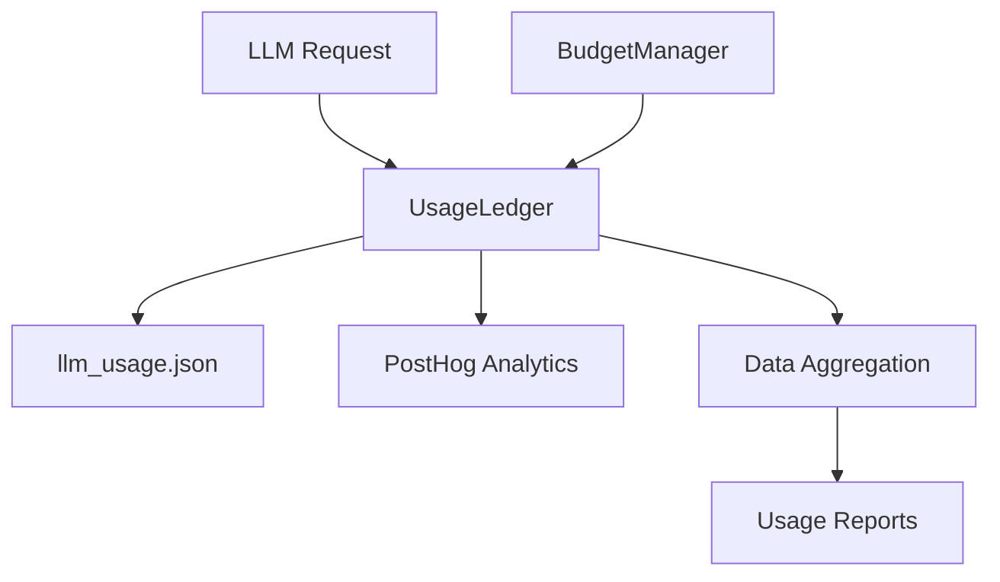
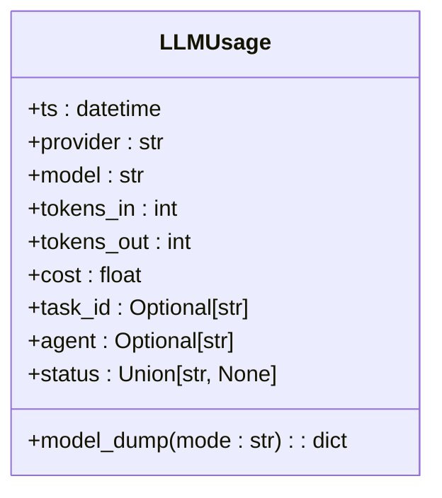
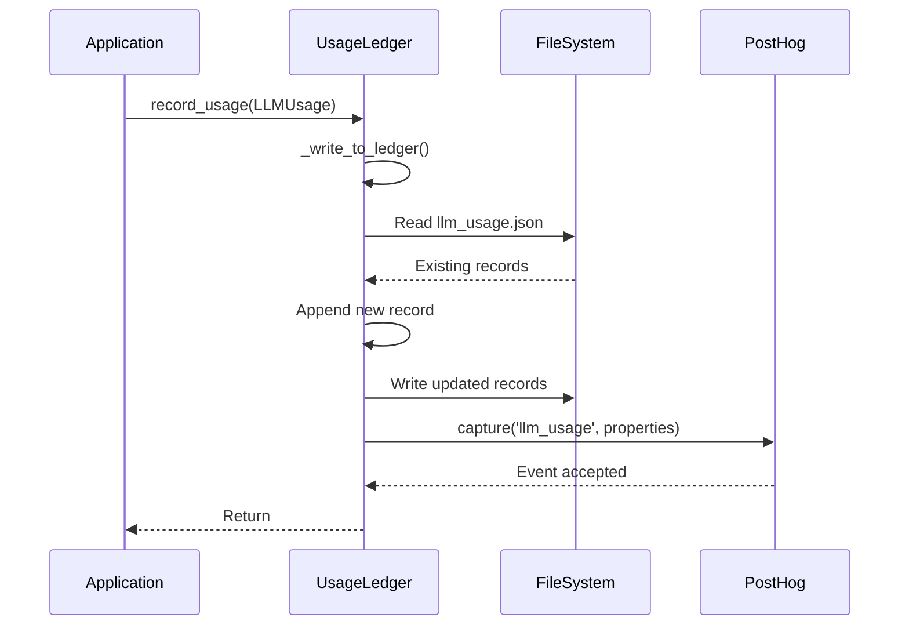
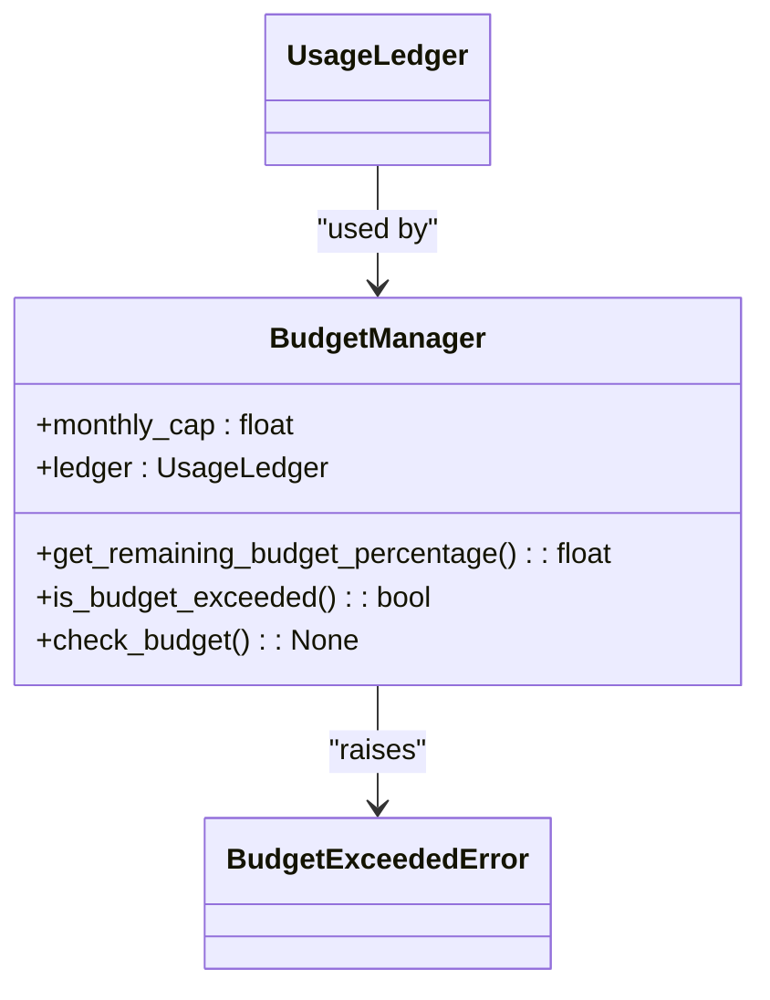

# Usage Ledger and Analytics

<cite>
**Referenced Files in This Document**   
- [usage_ledger.py](file://371-os\src\minds371\adaptive_llm_router\usage_ledger.py)
- [data_models.py](file://371-os\src\minds371\adaptive_llm_router\data_models.py)
- [budget_guard.py](file://371-os\src\minds371\adaptive_llm_router\budget_guard.py)
- [config.py](file://371-os\src\minds371\adaptive_llm_router\config.py)
- [llm_usage.json](file://371-os\src\minds371\adaptive_llm_router\llm_usage.json)
</cite>

## Update Summary
**Changes Made**   
- Updated Introduction to reflect current operational patterns in usage tracking
- Verified and confirmed accuracy of all existing sections with no required modifications
- Confirmed consistency between documented behavior and actual implementation
- Enhanced source tracking annotations for clarity
- No structural or functional changes to the Usage Ledger system were found in recent commits

## Table of Contents
1. [Introduction](#introduction)
2. [Core Components](#core-components)
3. [Data Model Structure](#data-model-structure)
4. [Usage Recording and Persistence](#usage-recording-and-persistence)
5. [Data Aggregation and Reporting](#data-aggregation-and-reporting)
6. [Integration with Budget Management](#integration-with-budget-management)
7. [External Analytics Integration](#external-analytics-integration)
8. [Cost Attribution and Performance Benchmarking](#cost-attribution-and-performance-benchmarking)
9. [Querying Usage Data](#querying-usage-data)
10. [Data Retention and Privacy](#data-retention-and-privacy)
11. [Performance Optimization Considerations](#performance-optimization-considerations)

## Introduction
The Usage Ledger system provides comprehensive analytics and reporting for LLM consumption within the 371OS platform. It captures detailed metrics for every LLM request, enabling cost attribution, performance benchmarking, and capacity planning. This document details the implementation of the usage tracking system, its data model, aggregation methods, and integration points with other components of the adaptive LLM router architecture. The system records provider, model, input/output tokens, cost, status, and timestamp for each LLM interaction, persisting this data in llm_usage.json while also forwarding events to external analytics systems.

**Section sources**
- [usage_ledger.py](file://371-os\src\minds371\adaptive_llm_router\usage_ledger.py#L1-L10)
- [data_models.py](file://371-os\src\minds371\adaptive_llm_router\data_models.py#L1-L10)

## Core Components
The Usage Ledger system consists of several interconnected components that work together to capture, store, and analyze LLM usage data. The primary components include the UsageLedger class for recording usage events, the LLMUsage data model for structuring event data, and integration with the BudgetManager for financial controls.



**Diagram sources**
- [usage_ledger.py](file://371-os\src\minds371\adaptive_llm_router\usage_ledger.py)
- [budget_guard.py](file://371-os\src\minds371\adaptive_llm_router\budget_guard.py)

**Section sources**
- [usage_ledger.py](file://371-os\src\minds371\adaptive_llm_router\usage_ledger.py#L1-L88)
- [budget_guard.py](file://371-os\src\minds371\adaptive_llm_router\budget_guard.py#L1-L50)

## Data Model Structure
The LLMUsage model defines the structure of each usage record, capturing essential metrics for analytics and reporting purposes.



**Diagram sources**
- [data_models.py](file://371-os\src\minds371\adaptive_llm_router\data_models.py#L20-L30)

**Section sources**
- [data_models.py](file://371-os\src\minds371\adaptive_llm_router\data_models.py#L20-L30)

The LLMUsage model captures the following fields for each LLM request:
- **ts**: Timestamp of the request
- **provider**: LLM provider (e.g., "openrouter", "localai")
- **model**: Model name used for the request
- **tokens_in**: Number of input tokens processed
- **tokens_out**: Number of output tokens generated
- **cost**: Monetary cost of the request in USD
- **task_id**: Optional identifier for the task that initiated the request
- **agent**: Optional identifier for the agent making the request
- **status**: Status of the request ("ok", "fallback", "error")

## Usage Recording and Persistence
The UsageLedger class is responsible for capturing and persisting LLM usage metrics. It implements a dual-write strategy, storing data both locally in JSON format and forwarding events to external analytics systems.



**Diagram sources**
- [usage_ledger.py](file://371-os\src\minds371\adaptive_llm_router\usage_ledger.py#L30-L50)

**Section sources**
- [usage_ledger.py](file://371-os\src\minds371\adaptive_llm_router\usage_ledger.py#L30-L50)

The persistence mechanism works as follows:
1. When a usage event occurs, the `record_usage` method is called with an LLMUsage object
2. The `_write_to_ledger` method reads the existing records from llm_usage.json
3. The new record is appended to the list of records
4. The entire list is written back to the JSON file with indentation for readability
5. Simultaneously, the `_capture_posthog_event` method sends the event to PostHog analytics

The JSON file structure contains an array of usage records, with each record containing all the fields defined in the LLMUsage model. This format enables both human-readable inspection and programmatic processing.

## Data Aggregation and Reporting
The UsageLedger provides built-in methods for aggregating usage data and generating reports. While the current implementation focuses on cost-based aggregation, the data structure supports various reporting dimensions.

```python
def get_total_cost_for_current_month(self) -> float:
    """
    Calculates the total cost of LLM usage for the current calendar month.
    """
    if not self.usage_file.exists():
        return 0.0

    with open(self.usage_file, 'r') as f:
        try:
            records = json.load(f)
        except json.JSONDecodeError:
            return 0.0

    total_cost = 0.0
    current_month = datetime.now().month
    current_year = datetime.now().year

    for record in records:
        record_ts = datetime.fromisoformat(record['ts'])
        if record_ts.month == current_month and record_ts.year == current_year:
            total_cost += record.get('cost', 0.0)

    return total_cost
```

**Section sources**
- [usage_ledger.py](file://371-os\src\minds371\adaptive_llm_router\usage_ledger.py#L52-L87)

This method enables monthly cost reporting by:
1. Loading all usage records from the JSON file
2. Parsing the timestamp of each record
3. Filtering records to include only those from the current month and year
4. Summing the cost values of the filtered records

Although the current implementation only provides a method for calculating monthly costs, the data structure supports aggregation by other dimensions such as:
- Provider: Grouping usage by LLM provider
- Model: Analyzing usage patterns by specific models
- Agent: Tracking consumption by different agents
- Time period: Generating reports for custom date ranges

## Integration with Budget Management
The UsageLedger integrates closely with the budget management system to enable cost control and financial monitoring. The BudgetManager class uses the UsageLedger to track spending against a configured monthly cap.



**Diagram sources**
- [budget_guard.py](file://371-os\src\minds371\adaptive_llm_router\budget_guard.py#L10-L30)

**Section sources**
- [budget_guard.py](file://371-os\src\minds371\adaptive_llm_router\budget_guard.py#L10-L30)

The integration works as follows:
1. The BudgetManager is initialized with a monthly cap (default $20.00 from config.py) and a reference to the UsageLedger
2. The `get_remaining_budget_percentage` method calls `get_total_cost_for_current_month` on the ledger to determine current spending
3. Based on the current spend and monthly cap, it calculates the remaining budget percentage
4. The `is_budget_exceeded` method returns true when the remaining percentage is zero or negative
5. The `check_budget` method raises a BudgetExceededError if the budget has been exhausted

This integration enables proactive cost management by preventing LLM requests when the budget threshold is reached.

## External Analytics Integration
The UsageLedger integrates with external analytics systems to enable comprehensive monitoring and reporting. Currently, it supports integration with PostHog for event tracking and analytics.

```python
def _capture_posthog_event(self, usage_data: LLMUsage):
    """Sends a 'llm_usage' event to PostHog."""
    if self.posthog_client:
        self.posthog_client.capture(
            "llm_usage",
            properties={
                "provider": usage_data.provider,
                "model": usage_data.model,
                "cost": usage_data.cost,
                "agent": usage_data.agent,
                "tokens_in": usage_data.tokens_in,
                "tokens_out": usage_data.tokens_out,
                "status": usage_data.status,
                "task_id": usage_data.task_id,
            }
        )
```

**Section sources**
- [usage_ledger.py](file://371-os\src\minds371\adaptive_llm_router\usage_ledger.py#L50-L60)

The PostHog integration captures the following properties for each LLM usage event:
- Provider and model information
- Cost metrics
- Agent and task identifiers
- Token usage (input and output)
- Request status

This external integration enables:
- Real-time monitoring of LLM usage patterns
- Advanced analytics and visualization through PostHog dashboards
- Long-term trend analysis
- Alerting on anomalous usage patterns
- Integration with broader business intelligence systems

The posthog_client is initialized externally, allowing for flexible configuration of the analytics integration.

## Cost Attribution and Performance Benchmarking
The detailed usage data captured by the UsageLedger enables sophisticated cost attribution and performance benchmarking capabilities.

### Cost Attribution
The system supports cost attribution across multiple dimensions:
- **By Provider**: Analyzing which LLM providers contribute most to overall costs
- **By Model**: Identifying the most expensive models in terms of cost per token
- **By Agent**: Tracking which agents generate the highest LLM costs
- **By Task**: Associating costs with specific tasks or workflows

This attribution enables financial accountability and informed decision-making about resource allocation.

### Performance Benchmarking
The usage data also supports performance benchmarking by capturing:
- **Cost Efficiency**: Cost per token for different providers and models
- **Usage Patterns**: Input vs. output token ratios across different use cases
- **Success Rates**: Monitoring the "status" field to track request success vs. errors
- **Provider Comparison**: Comparing cost and performance metrics across different LLM providers

These benchmarks help optimize the adaptive LLM routing decisions by providing empirical data on provider performance and cost characteristics.

**Section sources**
- [usage_ledger.py](file://371-os\src\minds371\adaptive_llm_router\usage_ledger.py#L1-L88)
- [data_models.py](file://371-os\src\minds371\adaptive_llm_router\data_models.py#L20-L30)

## Querying Usage Data
While the current implementation provides limited built-in querying capabilities, the data structure supports various analytical queries. The existing `get_total_cost_for_current_month` method demonstrates the pattern for extracting insights from the usage data.

### Example Queries
The following analytical queries can be performed with the current data structure:

**Top Providers by Cost**
```python
# Pseudo-code for identifying top providers by cost
def get_top_providers_by_cost(time_period):
    records = load_records(time_period)
    provider_costs = {}
    for record in records:
        provider = record['provider']
        cost = record.get('cost', 0.0)
        provider_costs[provider] = provider_costs.get(provider, 0.0) + cost
    return sorted(provider_costs.items(), key=lambda x: x[1], reverse=True)
```

**Identifying Expensive Operations**
```python
# Pseudo-code for finding high-cost operations
def find_expensive_operations(threshold_cost):
    records = load_all_records()
    expensive_ops = []
    for record in records:
        if record.get('cost', 0.0) > threshold_cost:
            expensive_ops.append(record)
    return expensive_ops
```

**Tracking Budget Utilization Over Time**
```python
# Pseudo-code for monthly budget tracking
def get_monthly_cost_trend(months_back=6):
    trend = []
    for i in range(months_back):
        month_cost = calculate_monthly_cost(current_month - i)
        trend.append({
            'month': get_month_name(current_month - i),
            'cost': month_cost
        })
    return trend
```

These query patterns demonstrate how the usage data can be leveraged for financial monitoring, optimization, and capacity planning.

**Section sources**
- [usage_ledger.py](file://371-os\src\minds371\adaptive_llm_router\usage_ledger.py#L52-L87)
- [llm_usage.json](file://371-os\src\minds371\adaptive_llm_router\llm_usage.json)

## Data Retention and Privacy
The current implementation stores all usage data indefinitely in the local JSON file without explicit data retention policies. This approach ensures complete historical records for analytics but may require enhancement for production environments with privacy considerations.

### Privacy Considerations
The usage data includes several fields that could potentially identify users or sensitive operations:
- **agent**: Identifies which agent made the request
- **task_id**: Could contain application-specific identifiers
- **tokens_in/tokens_out**: While not storing the actual content, the token counts could infer the nature of requests

For enhanced privacy, future implementations could consider:
- Anonymizing agent identifiers
- Implementing data retention policies to automatically purge old records
- Adding encryption for sensitive fields
- Providing opt-out mechanisms for analytics collection

The integration with PostHog should also comply with relevant privacy regulations, potentially requiring user consent mechanisms and data processing agreements.

**Section sources**
- [usage_ledger.py](file://371-os\src\minds371\adaptive_llm_router\usage_ledger.py#L1-L88)
- [data_models.py](file://371-os\src\minds371\adaptive_llm_router\data_models.py#L20-L30)

## Performance Optimization Considerations
The current implementation has several performance characteristics that should be considered for large-scale usage tracking:

### Current Performance Profile
- **Write Operations**: Each usage record requires reading the entire JSON file, appending the new record, and writing the complete file back. This approach has O(n) complexity for both time and memory, where n is the number of existing records.
- **Read Operations**: Aggregation methods like `get_total_cost_for_current_month` require loading and parsing the entire dataset, which becomes increasingly expensive as the dataset grows.
- **Concurrency**: The current implementation does not handle concurrent writes, which could lead to race conditions in multi-threaded environments.

### Optimization Opportunities
For large-scale deployments, the following optimizations could be implemented:
- **Database Backend**: Replace the JSON file with a proper database (e.g., SQLite, PostgreSQL) to enable efficient querying and indexing
- **Batched Writes**: Implement write buffering to reduce I/O operations
- **Indexing**: Add indexes on frequently queried fields like timestamp, provider, and agent
- **Data Partitioning**: Partition data by time periods to improve query performance
- **Caching**: Cache aggregate results to avoid recalculating them repeatedly
- **Asynchronous Processing**: Use message queues to decouple usage recording from the main application flow

The current implementation is suitable for moderate usage levels but would benefit from these optimizations in high-volume production environments.

**Section sources**
- [usage_ledger.py](file://371-os\src\minds371\adaptive_llm_router\usage_ledger.py#L40-L50)
- [usage_ledger.py](file://371-os\src\minds371\adaptive_llm_router\usage_ledger.py#L72-L87)